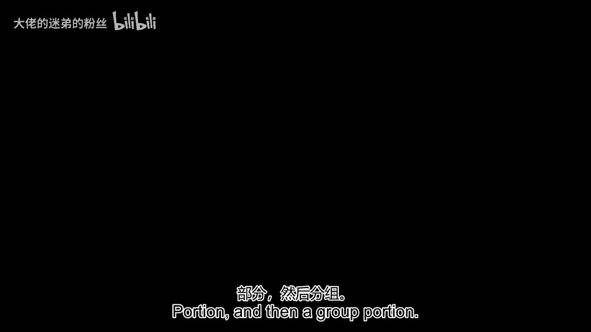
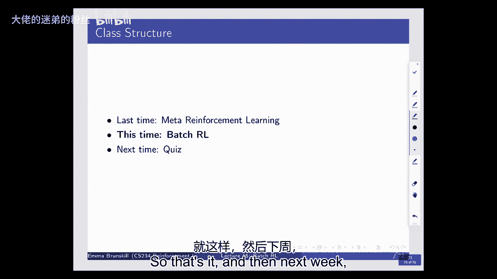

# 14：第15讲 - 批量强化学习 📚 

在本节课中，我们将要学习**批量强化学习**，特别是**安全的批量强化学习**。我们将探讨如何利用已有的历史数据来学习更好的决策策略，并确保新策略在部署前具有可靠的性能保证。这对于医疗、工业维护等高风险领域至关重要。

---

## 🎯 概述与动机

批量强化学习关注的核心问题是：我们如何利用一组已有的、由某个“行为策略”生成的数据，来评估和改进另一个“评估策略”，而无需与环境进行新的交互？

上一节我们介绍了在线强化学习中的探索与利用。本节中我们来看看离线或批处理场景下的挑战。这涉及到**反事实推理**——我们只能观察到已采取行动的结果，而需要推断如果采取不同行动会怎样。此外，我们还需要处理**分布不匹配**和**泛化**问题，以确保学到的策略能有效应用于新情况。

---

## 📊 问题定义与符号

首先，让我们明确一些基本符号和概念，以便后续讨论。

*   **策略**：用 `π` 表示。`π(a|s)` 表示在状态 `s` 下选择动作 `a` 的概率。
*   **行为策略**：用 `π_b` 表示。这是生成我们已有数据 `D` 的策略。
*   **评估策略**：用 `π_e` 表示。这是我们想要评估或希望改进的目标策略。
*   **轨迹**：用 `τ` 表示，是一条状态、动作、奖励的序列 `(s_1, a_1, r_1, s_2, a_2, r_2, ...)`。
*   **回报**：轨迹 `τ` 的折扣奖励总和，记为 `G(τ)`。
*   **策略价值**：策略 `π` 的期望回报，记为 `V(π) = E_{τ∼π}[G(τ)]`。

我们的目标是：给定数据集 `D`（由 `π_b` 生成），设计一个算法 `A`，输出一个策略 `π`，并希望 `V(π)` 至少和 `V(π_b)` 一样好，最好能显著更好。同时，我们希望对这个改进有**统计置信度**。

---

## 🔍 离策略策略评估

为了安全地改进策略，我们首先需要能够准确评估一个候选策略 `π_e` 的价值，即使数据并非由其生成。这就是**离策略策略评估**。

### 重要性采样

核心思想是**对已有数据进行重新加权**，使其在统计上看起来像是从目标策略 `π_e` 中采样得到的。

对于一个轨迹 `τ`，其在策略 `π` 下出现的概率为：
`P(τ|π) = P(s_1) ∏_{t=1}^{T} π(a_t|s_t) P(s_{t+1}|s_t, a_t) P(r_t|s_t, a_t)`

当我们用行为策略 `π_b` 的数据评估 `π_e` 时，可以使用重要性权重比：
`ρ(τ) = P(τ|π_e) / P(τ|π_b) = ∏_{t=1}^{T} [π_e(a_t|s_t) / π_b(a_t|s_t)]`
（初始状态分布和动态模型/奖励模型概率相同，因此抵消）。

于是，`π_e` 的价值估计为：
`V̂(π_e) = (1/N) Σ_{τ∈D} ρ(τ) * G(τ)`

这是一个**无偏估计器**。但它的**方差可能非常高**，特别是当 `π_e` 和 `π_b` 差异很大时，权重 `ρ(τ)` 可能变得极大或极小。

### 加权重要性采样与每步决策重要性采样

为了降低方差，常采用两种技术：

1.  **加权重要性采样**：将估计归一化。
    `V̂_wis(π_e) = Σ_{τ∈D} ρ(τ) * G(τ) / Σ_{τ∈D} ρ(τ)`
    这降低了方差，但引入了（渐近可消失的）偏差。

2.  **每步决策重要性采样**：利用“未来不影响过去回报”的事实，仅对影响当前奖励的动作进行重要性加权。这能进一步降低方差。

### 双重稳健估计器

结合模型估计和重要性采样，可以得到更鲁棒、方差更低的估计器。

基本形式为：
`V̂_dr(π_e) = (1/N) Σ_{τ∈D} [ ρ(τ)(G(τ) - Q̂(τ)) + V̂_model(π_e) ]`
其中 `Q̂(τ)` 是对轨迹中某个点之后回报的估计（例如通过拟合Q函数得到），`V̂_model(π_e)` 是基于学到的模型对策略价值的估计。

**双重稳健性**体现在：如果模型是准确的，或者重要性权重是准确的，那么估计器就是（近似）无偏的。这比单独使用任何一种方法更鲁棒。

以下是不同评估方法在数据需求上的对比示例（数值为示意）：
| 方法 | 达到特定精度所需剧集数 |
| :--- | :--- |
| 基于模型（有偏） | ~50 |
| 重要性采样 | ~2000 |
| 双重稳健 | ~200 |
| 加权双重稳健 | ~5 |

可以看到，先进的估计器能**大幅减少对数据量的需求**。

---

## 🛡️ 高置信度策略评估与安全策略改进

仅仅得到点估计是不够的。在部署新策略前，我们需要确信它确实比旧策略好。这需要**高置信度的策略评估**。

### 挑战：重要性权重导致宽松的置信区间

直接对重要性采样估计应用霍夫丁不等式等集中不等式，得到的置信区间通常非常宽（甚至无信息）。因为重要性权重 `ρ(τ)` 可能极大，导致回报的潜在范围 `B` 很大，从而使置信边界 `± B√(log(1/δ)/2N)` 变得无用。

### 解决方案：截断重要性采样

一个关键见解是：我们可以安全地**截断**那些具有极大重要性权重的轨迹（即 `π_e` 下极不可能但 `π_b` 下偶然出现的轨迹）。虽然这会轻微低估策略价值，但它能得到更紧且仍有保障的置信下界。这符合“安全”的原则——我们宁愿错过一个可能好的策略，也不部署一个我们误以为好但实际上很差的策略。

通过这种方法，我们可以计算 `V(π_e)` 的置信下界 `L(π_e)`。如果 `L(π_e) > V(π_b)`（或 `V(π_b)` 的估计下界），我们就可以以高置信度断言 `π_e` 优于 `π_b`。

### 安全策略改进流程

1.  **策略评估**：使用（加权/双重稳健）重要性采样等方法，评估多个候选策略 `{π_e}`。
2.  **置信区间计算**：为每个候选策略的价值估计计算置信下界。
3.  **策略选择**：选择具有最高置信下界的策略。如果其下界高于当前行为策略的价值估计，则可以安全部署。

这种方法使算法具备**自知之明**：当数据不足时，它可能无法推荐任何有信心的改进，从而避免给出错误建议。

---

## 💎 总结与展望

本节课中我们一起学习了批量强化学习的核心内容：

1.  **目标**：利用历史数据学习更好、更安全的策略，核心是**离策略评估**与**高置信度保证**。
2.  **关键方法**：**重要性采样**是离策略评估的基础，通过**加权**、**每步决策**和**双重稳健**技术可以显著改善估计的方差与偏差。
3.  **安全保证**：通过**截断重要性采样**等技术，可以为策略价值计算实用的置信下界，从而实现**安全策略改进**，确保部署的新策略很可能优于旧策略。

批量强化学习在医疗、推荐系统、工业控制等领域有巨大应用潜力。未来的研究方向包括：处理**未知行为策略**、结合**深度神经网络与元学习**进行迁移、应对**非平稳环境**以及优化长期回报的评估等。这是一个融合了统计学、机器学习和领域知识的活跃研究领域。

---
*下周将进行测验。*