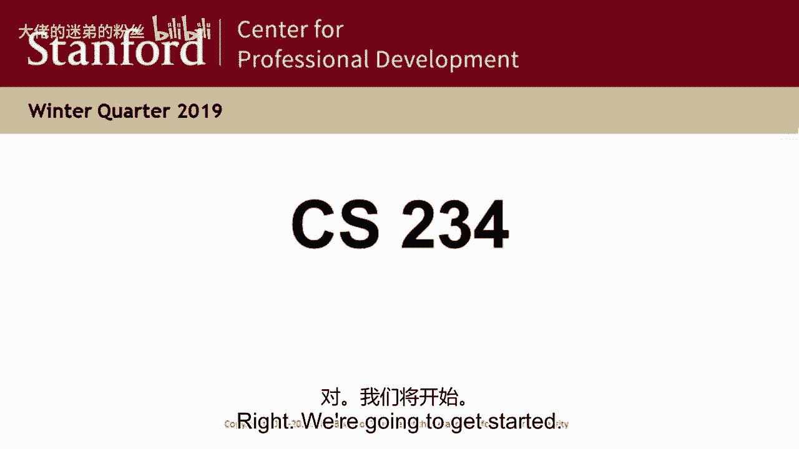
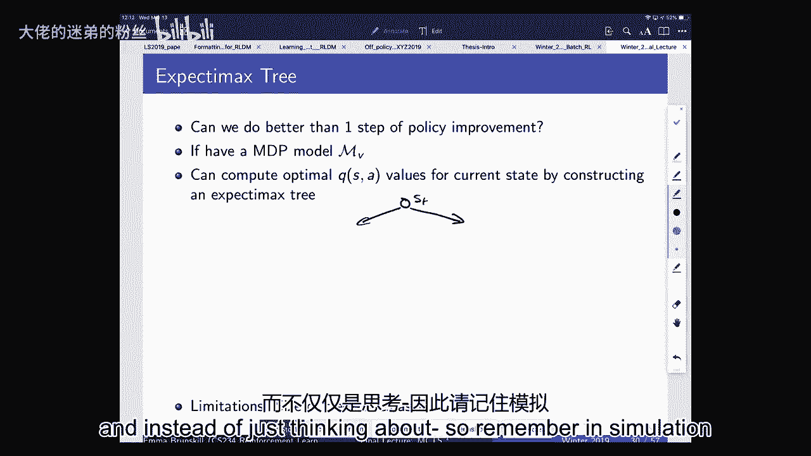
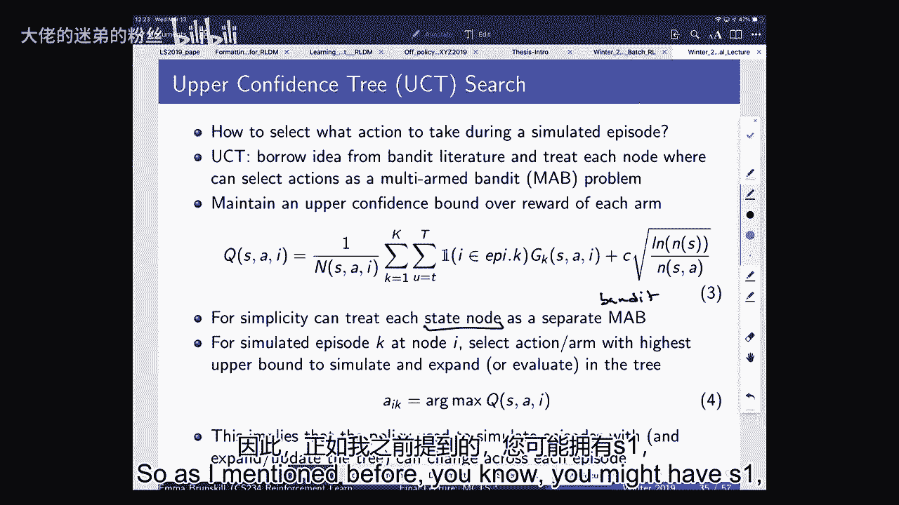
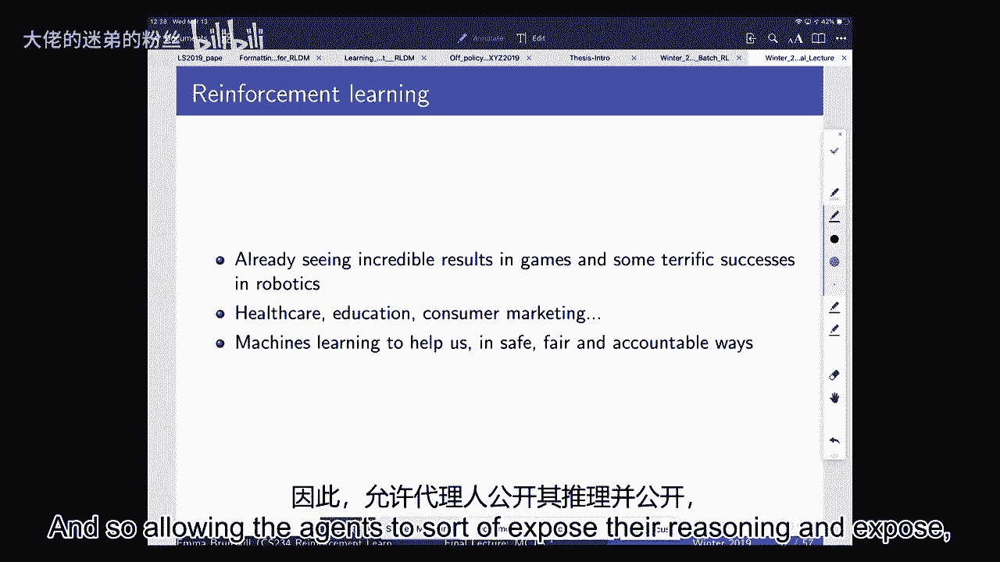

# 15：第16讲 - 蒙特卡洛树搜索 🎲

在本节课中，我们将要学习蒙特卡洛树搜索。这是一种强大的规划算法，在诸如AlphaGo等复杂决策系统中扮演了核心角色。我们将从基于模型的强化学习开始，逐步理解如何通过模拟和搜索来做出更好的决策。

## 概述

蒙特卡洛树搜索是一种结合了树搜索和蒙特卡洛模拟的方法，用于在具有巨大状态空间的问题中（如围棋）进行高效决策。它通过构建部分搜索树并智能地选择探索路径，避免了穷举搜索的计算负担。

---

## 基于模型的强化学习

上一节我们介绍了无模型强化学习，本节中我们来看看基于模型的强化学习。在这种方法中，我们首先尝试从经验中学习一个世界模型，然后利用这个模型进行规划。

在基于模型的强化学习中，我们拥有一个由经验数据（如状态、动作、奖励、下一个状态组成的元组）训练出的模型。这个模型可以预测在给定状态和动作下的奖励和状态转移。

**核心概念公式**：
我们学习一个近似的转移模型 $\hat{P}(s'|s, a)$ 和一个近似的奖励模型 $\hat{R}(s, a)$。这通常被表述为一个监督学习问题。

**优点**：
*   可以利用丰富的监督学习方法（包括深度学习）来学习模型。
*   可以显式地处理模型的不确定性，从而指导探索。
*   具有良好的可迁移性：如果学习了动力学模型，当奖励函数改变时，可以进行零样本迁移，只需用新奖励函数重新规划即可。

**缺点**：
*   存在复合误差：模型近似误差和规划近似误差会叠加。
*   如果模型在数据稀疏的区域表现不佳，学到的策略也可能很差。

---

## 基于模拟的搜索

当我们拥有了一个世界模型（模拟器）后，除了进行动态规划，还可以进行基于模拟的搜索。前向搜索是其中一种直观的方法。

前向搜索算法会从当前状态开始，考虑所有可能的动作序列，构建一棵搜索树直到某个深度，然后通过回溯计算根节点的值（在动作节点取最大值，在状态节点取期望值）。

**问题**：
前向搜索树的规模会随搜索深度 $H$ 呈指数级增长（约为 $(|S| \times |A|)^H$），对于像围棋这样状态空间巨大、步数长的游戏，完全展开是不可行的。

---

## 蒙特卡洛树搜索原理

蒙特卡洛树搜索的核心思想是**两全其美**：我们既想像前向搜索一样考虑多种未来可能性，又希望避免计算全部分支。其策略是**增量式地构建一棵部分搜索树**，并智能地分配计算资源到更有希望的路径上。

MCTS 通过多次模拟（或称“推演”）来逐步构建这棵树。每次模拟包含四个阶段：

1.  **选择**：从根节点（当前状态）开始，使用**树策略**递归地选择子节点，直到到达一个未完全展开的节点（即存在未尝试过的合法动作）。
2.  **扩展**：为这个未完全展开的节点添加一个或多个新的子节点（对应一个未尝试过的动作）。
3.  **模拟**：从新添加的节点开始，使用**默认策略**（ rollout policy，通常是随机策略）进行快速模拟，直到到达终止状态或固定深度，并得到一个模拟回报。
4.  **回溯**：将模拟得到的回报沿着选择路径反向传播，更新路径上所有节点的统计信息（如访问次数、累计价值）。

经过多次这样的模拟后，树中节点的价值估计会越来越准确。最终，根据根节点下各动作子节点的统计信息（通常是访问次数），选择最优的动作执行。

**树策略的关键**：
一个常用的树策略是**上置信界树搜索**。它将每个状态-动作对视为一个独立的**多臂老虎机问题**。在选择动作时，不仅考虑该动作的平均价值 $Q(s, a)$，还考虑其不确定性，倾向于选择具有更高“上限置信界”的动作：

**核心概念公式**：
$$ a = \arg\max_a \left[ Q(s, a) + c \sqrt{\frac{\ln N(s)}{N(s, a)}} \right] $$
其中：
*   $Q(s, a)$ 是动作 $a$ 的平均模拟回报。
*   $N(s)$ 是状态 $s$ 的总访问次数。
*   $N(s, a)$ 是在状态 $s$ 下选择动作 $a$ 的次数。
*   $c$ 是一个探索常数。

这种方法能确保在探索（尝试访问次数少的动作）和利用（选择当前估计价值高的动作）之间取得平衡。

---

## 在围棋中的应用

围棋是MCTS取得里程碑式成功的领域。其状态空间极其庞大，奖励稀疏（仅在终局时知道输赢）。

**MCTS在围棋中的工作流程**：
1.  **自我对弈**：这是关键洞察。AI使用当前的策略模型与自己进行模拟对弈。这解决了奖励稀疏问题，因为即使两个策略都不完美，也能产生胜负信号。
2.  **构建搜索树**：从当前棋盘状态（根节点）开始，运行大量MCTS模拟。
3.  **选择落子**：模拟结束后，根据根节点下各落子点的访问次数，选择访问次数最多的点作为实际落子。访问次数反映了该动作的“胜率”估计。
4.  **迭代改进**：将实际对局数据加入训练集，更新策略模型和价值模型，然后重复上述过程。

AlphaGo 及其后继版本 AlphaZero 将 MCTS 与深度神经网络结合：神经网络提供强大的**先验策略**（用于指导树搜索中的动作选择）和**价值估计**（用于替代部分随机模拟），极大地提升了搜索效率。

---

## 总结

本节课中我们一起学习了蒙特卡洛树搜索。我们从基于模型的强化学习出发，理解了拥有一个模拟器的重要性。接着，我们看到了前向搜索的局限性，从而引出了MCTS这一高效解决方案。

MCTS 的核心在于通过**多次模拟、增量建树、UCT选择、回溯更新**的循环，将计算资源集中在最有希望的行动路径上。它在围棋等复杂博弈中的成功，证明了其在解决大规模序列决策问题上的强大能力。这种将规划、学习与搜索相结合的思想，是强化学习领域一个非常有力的工具。