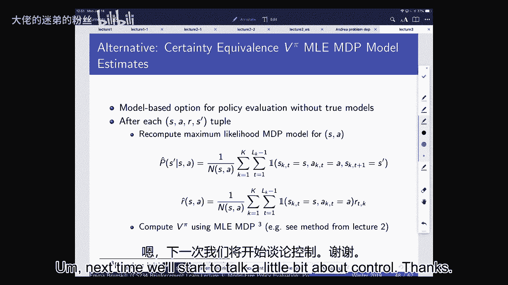

# 【强化学习】斯坦福CS234课程：强化学习中英文字幕 - P3：Lecture 3 -  Model-Free Policy Evaluation - 大佬的迷弟的粉丝 - BV1Cc411h7QQ

那么我们今天要做的，我们要开始讨论无模型政策评估，嗯，所以我们上次讨论的是，我们开始正式定义马尔可夫过程，马尔可夫奖励过程与马尔可夫决策过程，我们在研究这些不同形式的过程之间的关系。

这些都是我们在不确定性问题下建模顺序决策的方法，所以我们上周想的是，如果有人给我们一个世界是如何运作的模型，所以我们知道奖励模式是什么，我们知道动力学模型是什么，可能仍然很难弄清楚这样做是正确的。

我们如何采取行动，或者我们如何找到一个政策，可以最大化我们的预期，奖励折现金额，嗯，即使我们有一个模型，那么我们仍然需要做一些计算来尝试识别策略，所以我们很快就会得到的，我们如何做到这一切。

当我们没有事先得到世界的模型时，但让我们首先回顾一下政策评估的普遍问题，所以我们上次听到了一些关于政策评估的内容，当我们谈到策略评估是策略迭代中的一个步骤时，在政策评价和政策改进之间交替进行。

所以政策评估的想法是有人给你一个行动的方法，然后你想知道这个政策有多好，那么该特定保单的预期折扣奖励金额是多少，我们今天要讨论的是动态编程，蒙特卡洛，政策评估和TD学习，以及我们应该思考的一些方法。

试图比较这些算法，所以作为一个简短的回忆，记得上次我们定义了什么是马尔可夫回报过程，和马尔可夫奖励过程的回报，我们用g t定义的是，从那个特定的时间点T开始，我们获得的奖励的折扣总额。

所以我们会立即得到RT的奖励，然后我们要得到伽马，伽马是我们的折扣系数，记住，我们假设它在0到1之间，所以我们考虑的是未来的奖励，而不是眼前的奖励，状态值函数的定义是预期返回，一般来说。

预期的回报将不同于特定的回报，如果域是随机的，因为你今天开车去机场可能会得到的奖励，可能会不同于你得到的奖励，当你明天开车去机场的时候，因为交通会略有不同，它是随时间随机变化的。

所以你可以比较你是否知道在特定的一天，如果你花了两个小时到机场，而平均来说，你可能只需要一个小时，我们还定义了状态动作值函数，这是预期的奖励，嗯，如果我们遵循一个特定的策略，但我们首先采取行动。

所以我们是说如果你处于一种状态，s，你采取行动，从那时起，你遵循这个政策，别人给你的，预期的折扣奖励金额是多少，我们看到Q函数很有用，因为我们可以用它们来改善政策。

因为他们允许我们思考如果我们以后想遵循一项政策，但我们做一些稍微不同的事情开始，我们能看看这会如何帮助我们提高，就我们能获得的奖励而言，所以我们稍微讨论了一下，但作为回顾。

我们谈到了为政策评估做动态规划，所以当我们知道世界是如何运作的时候，动态编程是我们可以应用的东西，所以这是我们得到动力的时候，在本课程中，我将交替使用动态或过渡模型这个词。

所以如果你被赋予动态或过渡模型p和奖励模型，然后您可以进行动态编程来评估策略有多好，所以我们讨论的方法是，你初始化你的值函数，你可以把它看作是一个向量，现在我们在考虑有一组有限的状态和动作，因此。

您可以将此特定策略的值函数初始化为零，然后迭代直到收敛，我们说，一个国家的价值正好等于我们从，在那个州遵循那个政策，加上我们使用过渡模型获得的未来奖励的折扣总额，以及我们从以前的迭代中计算的值。

我们在这里讨论了定义收敛，收敛，一般来说，我们将使用某种规范，比较一次迭代中值函数之间的差异，接下来我们做这样的事情，v，pi，at，k-，k减去1时的v圆周率，等待这个比某个ε小，所以作为一个提醒。

我们正在计算的这个数量代表什么，嗯，我们可以想到我们正在计算的这个量，作为该政策下州S的K视界值的精确值，所以在任何特定的迭代中，就好像我们确切地知道我们会得到什么价值。

如果我们只能在有限的时间步内行动，就像K个时间步数，说，你知道如果，如果您在接下来的k个时间步骤中遵循此特定策略，相当于，你可以把它看作是价值的近似值，如果你永远演戏，所以如果k真的很大，k是200亿。

然后呢，这可能是一个很好的近似值，你会得到，如果你永远演戏，如果k是1，这可能是一个相当糟糕的估计，这会随着时间的推移而收敛，所以我认为用图形来思考这些事情也是有用的，所以让我们想想这个。

因为你处于一种状态，我用顶部的白色圆圈表示，然后你可以采取行动，那么动态编程是做什么的，它是在计算顶部的Vπ的估计值，通过说期望是什么，期望除以π的rt加γv k减1，那个期望超过了什么？

这将是s质数的概率给定sπ，那么我们如何从图形上很好地思考这个问题，我们从这个状态开始，我们采取行动，然后我们考虑下一个我们可以到达的州，我们再次假设我们处于一个随机过程中。

所以也许你知道有时红灯亮有时红灯关，所以根据这一点，我们将处于不同的下一个状态，我们正打算开车去机场，然后我们可以在达到那个状态后思考，然后我们可以采取一些其他的行动。

特别是在这种情况下我们可以采取一个行动，因为我们假设我们正在修改政策，然后从那些行动会把我们引向其他可能的状态，所以我们可以考虑画出我们可能到达的轨迹树，如果我们从一个州开始，开始遵循我们的政策。

在哪里，每当我们做出选择，我们只有一个行动，因为我们在做政策评估，每当有某种自然的选择，然后就像我们可能到达的下一个州的分布，你可以把这些看作是s素数和s双素数，像这样下去的时候，所以这有点。

你知道你的代理人可能出现的潜在未来，我认为用图形来思考这一点是有用的，因为这样我们就可以思考这些潜在的未来，我们如何利用这些来计算，价值是多少，这个政策的区别，嗯在什么动态程序中，我们在做什么。

和一般情况下，当我们试图计算保单的价值时，我们将对接下来的州进行预期，因此，价值是未来奖励的预期贴现总和，如果我们遵循这个政策，期望值正好在期货的分布上，所以每当我们看到一个动作。

然后我们考虑下一个可能到达的节点，我们想对这些特性进行期望，对我们能得到的所有回报的期望，这就是动态编程，或者这就是我们可以认为这个图表所做的，当我们思考动态编程所做的是，它估计了所有可能的未来。

通过引导并精确计算一个时间步长的期望，那么它是做什么的，它说s的vπ正好等于s的r，我的直接奖励，加伽马和除以s质数的概率给定s a v pi k减去1，最好的，所以它引导。

我们在那里使用bootstrap这个词，因为它实际上并没有总结所有这些更低的潜在回报，它在说我不需要那样做，之前我计算过它会是什么样子，如果我开始说在这种状态下，并继续为未来。

所以我现在已经知道那种状态的价值了，我要引导并用它作为替代品，实际上做了所有的展示，这里也是因为我知道预期的折扣，或者我知道什么嗯对不起，这个模型是，我也可以在s素数上取一个直接的期望。

所以我的问题是这里是否有一个隐含的假设，在给定的状态下的奖励，因此，被求值状态的值函数不会随着时间的推移而改变，因为您使用的是从先前的迭代中获得的，所以我想问题是说，这里是否有一个明确的假设。

即价值不随时间变化，是呀，这种情况下的想法是，我们计算的值是无限视界的情况，因此它是静止的，它不依赖于时间步长，我们今天不会太多谈论有限视界的情况，在那种情况下，在这种情况下就不一样了。

我们一直在说步骤，你总是有无限多的时间步要走，所以值函数本身是一个平稳的量，那么为什么这是一件可以做的事情，就像我们在自力更生，嗯，这是可以的原因是因为我们实际上有一个确切的表示，v，k，减一。

你不会得到任何近似误差把它，而不是明确地总结许多不同的历史，对不起，很多不同的未来奖励，所以当我们做动态编程时，这里要考虑的是，如果我们知道模型，然后知道动态模型和奖励模型。

我们可以准确地计算出即时奖励，我们可以精确地计算未来状态的期望和，然后我们代替而不是想我们，而不是想着把这个扩展出去，作为奖励的总和，我们可以启动并使用我们当前的估计v k-1，我强调这一点的原因是。

当我们开始研究这些其他方法时，比如蒙特卡洛方法和TD方法，他们不会再这么做了，他们会做其他形式的近似，试图计算这棵树，所以最终要计算策略的价值，我们本质上在做的是，我们在考虑所有可能的未来。

我们在每一个期货下得到的回报是什么，我们正试图使计算变得容易，尤其是当我们不知道世界是如何运作的时候，我们无法访问动态模型或奖励模型，好的，总结一下动态编程，你上次谈到了一点。

但我们没有真正谈论自助方面，动态规划说一个策略的值大约等于预期的下一个，对即时奖励的期望超过圆周率加上伽马倍，您计算的前一个值需要一个模型，它引导未来的回归，使用估计，用你的bk减一。

它需要马尔可夫假设，我这么说是什么意思，你没有去想过去的一切，你必须达到某种状态，你的意思是，不管我怎么到了以前的状态，我对那个状态的价值是相同的，嗯，我可以假设，我可以根据当前的观察单独计算。

所以我对此有什么问题吗，所以现在我们有点，主要是对上次的回顾，嗯，但稍微指出了一些我以前没有指出的事情，所以那些东西现在很有用，我们将在没有模型的情况下讨论政策评估。

所以我们现在要讨论的是蒙特卡洛政策评估，这是我们可以应用的东西，当我们不知道世界的模型是什么的时候，我们将讨论如何开始思考，比较这些不同形式的估计量，保单价值的估计量，所以在蒙特卡洛政策评估中，嗯。

我们可以再次考虑回归，所以退货又打折了，保单下的未来奖励总额，我们可以表示的策略的值，现在让我们想想我们能得到的所有可能的轨迹，嗯，根据我们的政策，什么是平均的，他们所有的回报。

所以我们可以再想想我们刚刚建造的那棵树，每一个不同种类的分支都会有一个特定的奖励，然后我们把它们都平均一下，所以这是一个很简单的想法，这个想法是，价值正好等于你的预期回报，如果你所有的轨迹都是有限的。

你可以拿一大堆这些，你平均，所以蒙特卡洛政策评估的好处是，它不要求你有一个特定的动力或奖励模型，它只要求你能够从环境中取样，所以我不需要知道一个特定的参数模型，比如交通是如何工作的。

我所要做的就是开车从这里到机场，你知道几百次，然后平均我花了多长时间，如果我总是用同样的政策开车，假设我总是走高速公路，嗯，那么如果我这样做，你知道一百次，那么我对我到达机场的预计时间有一个很好的估计。

如果我在高速公路上开车，这是我的政策，所以它不做自举，它不会试图在这个房间里维持，v k减去一，嗯，它简单地总结了你每一个轨迹的所有回报，然后是这些的平均值，它不假设状态是马尔可夫的，只是平均。

难道没有下一个状态的概念吗？这是否足以总结未来的回报，重要的是，它只能应用于所谓的插曲MDPS，如果你永远行动，如果没有概念，如果这有点像平均你的生活，这不起作用，因为你只有一个，所以你需要有一个过程。

你可以重复做很多次，这个过程每次都会结束，所以开车去机场可能会很长时间，但你最终会到达那里，然后你可以明天再试一次，所以这并不适用于所有的过程，就像你有一个永远在演戏的机器人，你不能做蒙特卡洛政策评估。

我们也经常以增量的方式这样做，这意味着在我们保持每集后的运行估计后，我们更新了目前对V PI的估计，我们希望随着我们获得越来越多的数据，这个估计会收敛到真实值，所以让我们来看看，嗯，这个的算法是什么。

所以一个算法，这被称为第一次访问蒙特卡洛政策评估算法当我们开始，我们假设我们没有，这里基本上是我们访问一个州的次数，所以我们开始，这是零，在任何状态下开始的返回或平均返回也为零，所以我们现在初始化说。

或者我们认为你知道我们没有得到任何州的奖励，我们没有去过任何一个州，然后我们要做的是循环每循环一次我们就取样一集，也就是我们在启动状态下开始，我们一直行动到我们的过程结束，我从我家出发，一直开车到机场。

然后我计算我的回报，所以我说，好的，嗯，也许我花了两个小时才到那里，所以现在我的G I是两个小时，嗯，但你只要计算你的回报，你计算每一步T在这一集里，所以这里的GI T是从那一集的T时间步定义的。

从那时开始你剩下的奖励是什么，我们将在火星探测器的例子中实例化这一点，然后你在那个特定的插曲中访问的每一个州，你第一次遇到一种状态，你看起来，你增加计数器，您更新您的总回报，你用，然后呢。

你只要取这些估计的平均值，计算当前对状态值的估计，为什么你可能在一集里不止一次处于相同的状态，好吧，假设我遇到红灯，假设我离散了我的时间步长，所以我每时每刻都在看我的状态，好吧，我遇到了红灯。

发生了一起交通事故，所以准时第一步我在红灯前，第二步，我在闯红灯，时间第三步，我在闯红灯，所以你可以在这一集的多个时间步中处于相同的状态，这意味着你只使用第一步，你看到那种状态了，然后你总结奖励。

直到那一集结束，我们看到了同样的状态，但我想在同一集的不同时间步骤，我们仍然会增加两倍，因为这不可能有差距，问题是发生了什么，如果我们在同一集里看到同样的状态，首次访问，您只使用第一个事件。

你把其他的都扔掉，所以当我第一次到红灯的时候，然后我会总结未来的奖励，直到这一集结束，如果我碰巧在同一集遇到同样的红灯，我忽略了那个数据，我们会看到一种不同的方法，一秒钟，好的，所以你知道。

我们如何估计这是否是一件好事，我们如何评估这个特定的，这是一个估计，有点不对，至少在我们没有太多数据的开始，那么我们如何理解这个估计是否好呢，我们如何比较，所有的估计量，我们今天要讨论的这些算法。

实际上只要举起你的手，因为我很好奇，嗯，他在这里正式地看到了偏见和方差在其他类别中的定义，好的，大多数人，但不是每个人，所以作为一个快速的回顾，让我们考虑一下有一个统计模型，它是由θ参数化的。

我们在一些观测数据上也有一些分布，x的p给定θ，所以我们想要一个统计θ帽，这是一个函数，所以θ帽是观测数据的函数，它提供了θ的估计，所以在我们的例子中，我们将有这个值，我们正在计算的价值的估计。

这是我们剧集的一个功能，它是对遵循这一政策的真实折扣预期回报的估计，因此，估计量偏差的定义是比较期望值是多少，我们的统计数据与真实值的对比，对于任何一组数据，所以这会说，如果我计算。

你知道我到机场的预计时间，基于三次试图开车去那里，我刚才给你们展示的算法平均来说是无偏的吗，这是我到达机场的真实预期时间，估计量方差的定义，比较我的统计数据和它的期望值，预期的平方。

我可以在true参数下得到的数据类型，均方误差结合了这两个均方误差通常是，我们关心的，正常情况下，我们最终关心的是，我们对我们关心的数量的估计与真实数量相去甚远，这是它的偏差和方差的总和。

通常不同的算法和不同的估计量会有不同的权衡，在偏差和方差之间，好的，所以如果我们回到我们第一次访问蒙特卡洛算法，我们使用的V pi估计器，对真实期望有一个无偏的估计器，我们政策奖励的折扣金额。

这只是一个简单的平均数，而且没有偏见，根据大数定律，随着你获得越来越多的数据，它收敛到真值，所以这也是所谓的一致，一致性意味着它收敛到真实值，当AS数据走向无穷大时，所以这是合理的，嗯。

但它可能不是很有效，就像我们刚才说的，你可能处于同样的状态，你可能在同一个红绿灯对许多人来说，许多时间步，嗯，你只会在一集里使用第一个状态来更新，所以每次去蒙特卡洛都很好，每次你在这一集里访问一个州。

看看你从那个州得到了多少奖励，直到最后，和所有这些的平均值，所以基本上每次你达到一个状态，你总是看折扣奖励的总和，从那里到这一集的结尾，你把所有这些都平均一下，这可能会更有效率，偏差定义，好的。

所以我有点困惑，我们会如何有偏见，鉴于我们实际上并不知道，我们如何通过它来竞争，是啊，是啊，鉴于我们没有，这是一个很好的问题，如何计算偏差，是呀，如果你，呃，如果你能计算偏差，准确地说，这通常意味着。

你知道θ是什么，在这种情况下，你为什么要做估计器，一般来说，我们不知道什么是偏见，嗯，我们可以经常把它捆起来，用浓度不等式之类的东西，我们就可以，嗯好吧，浓度质量更适合变体，经常，嗯。

我们不知道偏见到底是什么，除非你知道最基本的真相是什么，在实践中，我们有不同的方法来估计偏差，所以当你比较不同形式的参数模型时，嗯，有时你可以做结构性风险，呃，结构组合，最大化，诸如此类的事情。

试图得到你如何比较的数量，您的估计量和模型类，我不打算在这里多谈这个，但我很乐意用抵消来谈论它，所以每次去蒙特卡洛，我们每次都要更新它，这会给我们另一个估计器，注意，这将给我们更多的计数。

因为每次你看到一个状态，您可以更新计数，但这是有偏见的，所以你可以证明这是一个有偏的估计器，或者Vπ可能有直觉，为什么它可能是有偏见的，所以在第一个案例中，对于那些以前见过这个的人来说，嗯。

或者不一定是这个，尤其是，但看到这种分析，首次访问蒙特卡洛，嗯，你得到的是一个州的iID估计，一个国家的回归，对呀，因为你只拿那个，嗯，每集都是，嗯是我的，因为你开始了一个起始状态，你从那里估计，嗯。

您只使用第一次看到该状态时的返回，如果你在同一集多次看到一个状态，他们的回报是相关的还是不相关的，相关右，因此您的数据不再是IDID，这就是为什么，当你搬到每一个访问蒙特卡洛，你的估计量可能有偏差。

它是否出于明显的原因对检查员有偏见，悖论，像那样的过程，这是个好问题，我很高兴看到它并返回，然而，它的好处是它是一个一致的估计器，所以当你得到越来越多的数据，它会收敛到真实的估计，从经验上看。

它的方差通常要低得多，直觉上，它应该有捕鲸者的差异，我们平均了更多的数据点，现在通常是一样的，你知道的，如果你只访问一个，如果你不太可能重复访问同一个州，这两个估计量在一集里通常非常接近同一件事。

因为你不会多次访问同一个州，但在某些情况下，你会多次访问同一个州，你会得到更多的数据，如果您使用每次访问，这些估计器通常会更好，但这是有偏见的，所以有一个权衡，经验上，这往往要好得多，现在。

当然在实践中，经常而不是嗯，你经常，您可能希望逐步地这样做，你可能只是想跟踪跑步的意思，然后你跟踪你的跑步，意味着并逐步更新您的帐户，你也可以这样做，当你参观时，你不必等到最后，哦，那是不对的。

你一定要等到最后，因为你总是要等到得到完整的回报才能更新，是啊，是啊，在后面，所以这个问题，如果你喜欢，如果你的条件是你有相同数量的估计，大约在每个状态下，那么两者或多或少是相等的。

但另一个会不那么有偏见，比如说，如果你做了，我想这是不可能的，你本可以，比如说，或者看过的剧集，用第一次访问近似来每个州的人数相同，但如果你真的有，就会，你想象MSU会更低，在这种情况下，我会质疑嗯。

如果在两个算法中对一个状态的计数数相同，就剧集而言你不可能做到这一点，嗯，除非是这样，否则它们要么是相同的，如果你只访问一个州，嗯一集一次，然后它们就完全一样了，如果不是这样。

如果你在一集内多次访问一个州，然后当你得到同样的计数时，单次参观的会更好，因为它是公正的，它的方差基本相同，还有什么问题吗，所以增量蒙特卡罗在政策评估上基本上和以前一样。

除了你可以慢慢地移动你在每个州的跑步平均水平，重要的是，嗯，当你慢慢移动你的估计器，如果您将alpha设置为1以上，s，每次去蒙特卡洛都是一样的，本质上，你只是精确地计算平均值，嗯，但你不必这么做。

这样你就可以把它，这样你运行的平均值对最近的数据更有权重，你想这么做的原因是因为，如果你的实域是非平稳的，我们已经猜到了，其中域可能是非平稳的，这是一个高级话题，在这门课的大部分时间里。

我们不会真正讨论非平稳域，尽管在现实中它们非常重要，我不知道你们的机械零件是不是随着时间的推移坏了，喜欢的例子，如果你在一个制造过程中，你的零件在变化，随着时间的推移会崩溃。

所以你的动力学模型实际上是随着时间的推移而变化的，那么您就不想重用旧数据了，因为你实际上你的MDP随着时间的推移而改变，所以这是原因之一，通常在经验上像，当人们训练推荐系统之类的东西时，你知道新闻吗。

所有这些东西都不是静止的，所以人们经常重新训练他们来处理这个非平稳的过程，我在后面看到一个问题，是啊，是啊，所以从经验上来说，这通常对非平稳域很有帮助，但如果它不是静止的，所有的，有一堆不同的担忧。

所以我们现在基本上忽略这一点，好的，所以让我们来看看我们对蒙特卡洛的理解，关于政策评价的建议，让我们回到我们的火星探测器领域，嗯，所以在我们的火星探测器中，我们有这七个州，我们的火星车掉了下来。

它要探索一个奖励，处于一种状态，一个在州的七个，其他地方在零时都是正十，我们的政策将适用于所有州，嗯，现在想象一下，我们不知道动力学模型是什么，所以我们要观察轨迹，如果你到了第一州或第七州。

您采取的下一个行动将终止奖励，我不知道，可能是从悬崖上掉下来之类的，但每当你走到一步，It’7点还是1点，然后嗯，你采取的下一个行动，这样你就可以得到任何奖励，你要么得到一个，要么得到十个。

然后你的进程终止，所以让我们想象一下在这种政策下的轨迹，会是，你从三秒开始，你去行动，你采取行动一个，你得到的奖励是零，这是奖励，然后你过渡到状态二，你采取了一个行动，你得了零分，你保持在同样的状态。

所以你又呆在S 2，采取行动，你又得到了一个零的奖励，然后你到达状态1，采取行动，你得到一个，然后它就终止了，这是你的火星探测器生活中的一次经历，嗯，所以在这种情况下，嗯，我们花一两分钟。

可以自由地和邻居交谈并计算，第一次访问是什么，蒙特卡洛，每个状态的价值估计，每次访问是什么，蒙特卡洛州的估计，我把第一次访问和每次访问的算法都放在上面，就看这一集你是否只更新一次状态。

或者您是否可以多次更新它，你问这个问题，我也是，如果我们还没有看到，我们使用的值是多少，也可以说，对于所有s，初始化s的v p等于零，如果你还没看过的话，所有的权利，如果你想要多一点时间，请举手。

否则我们就继续，好的，所以有人想分享的，他们是什么，也许他们附近的人认为是第一次访问蒙特卡洛，每个状态的V估计，我认为第一个估计是每个州都有一个，除了最后一个，然后呃，我们只更新了哪些日期。

到目前为止有几个，你就会，呃，这就是为什么，别跟我来这套，嗯，让我们从这里开始，所以s one的v是什么，好吧，两个中的一个也是一个，和S 3中的V，也是4中的1和v也是1，你可能不同意，先生，好吧。

五个中的一个，芝诺和，是啊，是啊，所以我们只能在这一个中更新我们实际访问过的州，所以这里是1 1 0 0，零现在零，嗯，每次参观怎么样，蒙特卡洛估计只有两个，所以我只挑了两个。

因为那是我们唯一去过两次的州，什么事？它的估价是多少？它还会是，是的，是呀，它是，为什么，因为我们都是增量的，所以我们在它的末尾有一个是两个，但是GS也是2，所以我们完全实现了这两个，所以两次的回报。

当你在S 2开始的时候，加起来直到这一集结束两种情况都是一个，所以是两次，然后你平均超过这个，所以它还是一个，他们都是一体的原因是因为伽马是一体的，就像，在那个问题中不应该有伽马项吗？

是的这里我们假设伽马等于1，否则它们就会有一个伽马乘以这两个中的一些，是啊，是啊，没有好问题，我选了伽马等于1，只是为了让数学更容易一点，否则就会有伽马因子，我也是，好的很好，所以你知道。

第二个问题有点转移注意力，因为在这种情况下是完全一样的，但如果返回与S2不同，比如，假设处于一种状态会受到惩罚，那么他们可能会有不同的回报，然后我们会在那里得到不同的东西。

所以蒙特卡洛在这种情况下更新了，我们不得不等到这一集结束，但是当我们更新到这一集结束的时候，嗯，我们更新了s 3 s 2 s 1，那么蒙特卡洛在做什么，那么蒙特卡洛在做什么，嗯。

我把这种增量版本放在这里，你可以用在非静止的情况下，但你可以用另一种方式来思考，我也是，所以请记住如果你想让这与每次访问相等，你只需插入α的n次方s，这就是蒙特卡洛评估公司正在做的，只是平均这些回报。

所以我们要做的是，如果我们想想我们的树在做什么，在我们的例子中，我们的树将是有限的，我们将假设这些分支中的每一个最终都会终止，他们必须，因为我们只能评估回报，一旦我们到达它，所以在某个时候，比如这里。

当我们在火星上陈述一个或七个时，进程终止的示例，那么蒙特卡洛政策评估是做什么的，它近似地平均了所有可能的未来，通过总结穿过树的一个轨迹，所以它会一路向下采样直到到达最终状态，它把一路上所有的回报加起来。

就像奖励一样，奖赏，奖赏，嗯，我会比这里的奖赏更小心，每个州行动对都有奖励，所以你把这种情况下的所有奖励加起来，这就是它的样本，价值的um，所以请注意它没有做任何事情，嗯，呃，的。

它将如何进入对各州的期望，就是通过对轨迹的平均，它没有显式地查看给定的下一个状态的概率，S和A，这不是自举，只有当你一路出去看到完整的回报时，它才能更新，这就是它的样品，它不使用动力学模型的显式表示。

它不会引导，因为没有V的概念，k减去1，它只是总结了所有的退货问题，斯科特，政策评价，喜欢在罕见的情况下做得很差，嗯，很有趣，问题是，这么说公平吗，在非常罕见的情况下，这将做一个非常糟糕的工作。

很耐人寻味，它们是非常高的方差估计器，所以如果你是蒙特卡洛，你本质上就像推出未来一样，对，通常你需要很多可能的未来，直到你能得到一个好的期望，另一方面，对于像Alphago这样的东西。

这是用来解决棋盘游戏的算法之一，他们用蒙特卡洛，你知道的，我认为你做事要小心，这次推出的一些内容，当你开始控制，当你开始，因为这样你就可以选择动作，嗯，你经常想玩之间，但它并不可怕，即使有罕见的事件。

嗯，但如果你有其他信息，你可以用，它通常是好的，取决于你的其他选择，这是一个相当高的方差估计器，它可能需要大量的数据，它需要一个情节设置，因为你不能这么做，如果你永远在演戏，因为没有办法终止。

所以你必须能够有终止的进程，所以DP政策评估，我们有伽马因子，因为我们想处理各州介于两者之间的情况，大概等于1，但在这种情况下，我的意思是，如果我们有这样一个永远不会终止的案子，因为这一集永远不会结束。

所以从技术上来说，我们是否仍然需要一个伽马因子来评估策略迭代，对这个问题的政策评估是关于，在这种情况下，我们还需要伽马因子吗，那么在你的过程中，你可以有自我循环或小循环的情况呢，所以总的来说这个g。

你能知道，可以使用伽马因子，所以这可以包括伽马，当你计算这些时，你是对的，如果已知进程终止，你不必有小于1的伽马射线，因为你的回报不可能是无限的，因为您的进程将始终终止，嗯。

这不能处理你有可能终止的情况，所以如果在流程内部有一个自我循环或一个小循环，这样你就可以永远绕着它走，永远不会终止，你不能做蒙特卡洛，必须把这个拿出来对身体原因没有帮助，为什么你可能会有一个游戏。

不只是那样，这很像模拟燃料成本，或者我们行为的东西，那合理吗？嗯，伽马是否有物理原因，比如燃料成本，或者类似的东西，我的意思是我想通常我会把它放在奖励功能中，好的，所以如果你有像你这样的东西。

你可以吃那个，所以我想，考虑这样的情况，基本上你想尽快达到一个目标，你想做一个随机最短路径类型的问题，嗯，我想总的来说，我可能宁愿选择让它成为一个终端状态，然后有一个负的成本，如果你真的知道燃料成本。

嗯，但您也可以将其用作代理，试图鼓励朝着目标快速前进，挑战在于你如何设置它通常是相当微妙的，因为嗯，如果你把它定得太高，你会得到奇怪的行为，你的经纪人在哪里，有点害怕，什么都不敢做。

你只要呆在真正安全的区域，嗯，如果在某些情况下太高，如果有可能得到一些微不足道的奖励，你的经纪人可能会被误导，所以在现实世界中设置通常有点棘手，好的，因此，有高方差估计需要这些插曲设置和，没有自举。

一般情况下，它们在某些情况下收敛于真实值，呃，一般来说，温和假设，我们将在课程结束时讨论重要的抽样，如果我们有时间，否则我们可能会把它推到以后，那是我们怎么做的，如果您有非策略数据。

从另一个策略收集的数据，好的，现在，让我们来谈谈时差学习，所以如果你看看萨顿·巴托，如果你和里奇·萨顿谈谈，或者其他一些在这个领域非常有影响力的人，他们可能会争辩说这些中心。

对强化学习的贡献或对强化学习的贡献，使其不同，也许比其他一些关于自适应控制的思考方式更重要的是时间差异学习的概念，本质上，它将结合蒙特卡洛估计和动态规划方法，而且是免费的。

我们不会显式地计算动力学模型或奖励模型，或者从数据中估计它既引导又样本，所以记住动态动态编程，就像我们到目前为止定义的那样，它自举和我们到目前为止对它的思考方式。

你实际上可以接触到真正的动态模型和真正的奖励模型，但它通过使用V来引导，k减去1蒙特卡罗估计不引导，它们一直走到轨迹的尽头，还有一些奖励，但他们取样以接近预期，所以引导被用来近似未来，奖励折现金额。

抽样通常是为了接近你对状态的期望，时差学习的好处是，你可以在偶发过程或连续过程中做到这一点，它的另一个好的方面是，不用等到本集结束才更新，所以一旦你有了新的观察，在一种状态下开始，采取行动，去下一个州。

得到一些奖励，嗯，您可以立即更新您的值，这真的很有用，因为你可以立即开始使用这些知识，好的，那么我们在时差学习中要做什么呢，我们的目的是计算我们对V pi的估计，我们对回归的定义还是一样的，我们要看看。

提醒自己行李员接线员，所以如果我们知道我们的MDP模型，我们的贝尔莫尔接线员说我们会得到立即的奖励，加上我们未来奖励的折扣金额，在蒙特卡洛的每一次访问中，我们在做的是，我们在更新我们的估计。

使用返回的一个样本，所以这就是我们说我们的，我们对价值的新估计等于我们对价值的旧估计，加上阿尔法时间，返回，我们刚刚看到负V，但这是我们必须等到这一集结束时再做更新的地方，时间差异的内部，学习很好。

为什么我们不直接用我们的旧估计器v pi来表示那个状态呢，然后你就不用等到这一集结束了，所以在那里不用GI，你用奖励，你刚刚看到了加伽马倍，你下一个状态的值，所以你说，我不会等到这一集开始我的状态。

我得到了奖励，我去了另一个州，下一个状态的值是多少，我不知道，我去估价器里查一下，我把它插进去，我将把它看作是对回报的估计，所以最简单的TD学习算法就是，你只需要把你的即时奖励。

加上你的折现预期未来价值，我们把它插入你实际到达的状态，现在请注意，这是采样，没有，正常情况下，我们想要那笔好钱，行李员接线员，我们通常会有一个和s素数，给定s质数的s a的v pi的s质数的概率。

我们这里没有，我们只给你一个下一个州，我们把它作为我们的估计器，所以我们还是要取样，为了接近这个期望，但就像动态编程一样，我们要引导，因为我们要用我们以前对VPI的估计。

我们还写了一个子k和子k-1来显示，就像迭代一样，是啊，是啊，我现在可能有那个CLE了，我不知道，在这种情况下，你也可以写这个，建议是，如果我们想清楚迭代中发生了什么，你也可以把它看作是p的k加一。

这是V好的，比如说，你在随着时间的推移更新这个，问题是，你对每个州都这样做，与动态规划相比，你这样做的方式对所有州来说，所以你有一个一致的BK，然后你在这里更新，我们可以把它看作是一个值函数。

你只是在更新值函数的一个条目，取决于你刚刚到达的州，所以前面的值函数没有很好的概念，新值函数的，因为这个原因，我会把它放在那里，现在人们经常谈论TD错误，时差误差，那是什么，它在比较，你的估价是多少？

你的新预算，也就是你的即时奖励加上伽马倍，你实际达到的状态的价值减去你目前对你的价值的估计，现在请注意，这一个本质上应该是近似的，对s质数的期望，因为对于那个，你将平均，所以这看的是时间差异。

所以这是说你的直接奖励加上伽马倍有多大的不同，你下一个状态的值，相对于你对当前状态价值的当前估计，现在请注意，这不一定要归零，因为第一件事总是一个样本，这是一个未来，唯一一次它被定义为归零。

如果这是确定性的，所以下一个州只有一个，所以你知道如果我开车去机场的时候，我堵车了，有一半的时间我不知道，那么这是两种不同的下一个状态，对于当前的开始状态，我可以去，要么堵车，要么不堵车。

所以我要么会遇到交通堵塞，或者不撞车的V PI，所以这个TD错误不一定会归零，即使有无限的数据，因为一个是当前状态下的预期事物，另一个是你到达了下一个州，所以好的一点是，在您的状态操作之后。

您可以立即更新这个值估计值，奖赏，s素元组，你不需要插曲设置，是啊，是啊，收敛，如果你保持alpha常数，如果保持alpha不变，这会影响收敛吗，是呀，你通常必须对衰变有一些温和的假设。

像T除以1这样的事情通常足以确保这些估计收敛，是啊，是啊，问题，我们能说说系统的偏见吗，问题是这个问题是否是一个好问题，你能说说这个估计量的偏差吗，它可能会感觉到这是否会是一个偏差估计器，你以前呢？

或者我们有一种感觉，它是否会有偏见，回想一下动态编程是V，k减去一，无限视界的无偏估计器，如，假设k等于2，你想要无限的视界值，不管你怎么做这些更新，不会很酷的，一般当你引导，它将是一个偏差估计器。

因为您依赖于以前的估计器，这通常是错误的，所以这将使你在一个特定的方向上有偏见，所以这绝对是一个有偏见的估计器，嗯，它也可以有相当高的方差，所以它既可以是高方差的，也可以是有偏见的，但另一方面。

你可以非常非常快地更新它，嗯，你不必等到这一集结束，你可以使用很多信息，所以它通常比蒙特卡洛估计的高方差小得多，因为你在自拍，这有助于平均你的许多可变性，事实是。

我们基本上是在为序列号上的值函数初始化相同的值，哪个问题是它是否是初始化的函数，它不是它是一个，它是估计量不同性质的函数，你可以，以不同的方式初始化，嗯，自举是因为你使用的是通过自举。

并使用这个V PI作为你实际预期折扣回报的代理，嗯，除非这是真正的值，它只是会有偏见，你注意到这个，嗯，这不是你在动态编程中没有偏见吗，当你知道模特的时候，因为当你引导时，v pi实际上是v pi。

它实际上是真正的价值，所以问题是，这里是实际值的近似值，这就是为什么它对你有偏见，所以自举很好，如果你知道真正的动力学模型和真正的奖励函数，你计算的vπ是k减去1，但这里不好，因为我们引入了偏见。

那么电视零学习是如何工作的呢，嗯，我在这里做零，因为中间有一些有趣的嗯，在TD学习和蒙特卡洛学习之间，而不是立即奖励，加上未来奖励的折扣总额，而不是所有奖励的总和，你可以想象这两者之间的连续体。

你可能会总结前两个奖励，然后引导，所以有嗯，有一个连续的模型，基于一系列算法从直接获得奖励，然后自举与从不自举，但我们现在只想谈谈拿你的即时奖励，然后引导，所以TD学习的工作方式如下。

你必须选择一个特定的阿尔法嗯，可以是时间的函数，台阶嗯，初始化值函数，您对一个状态进行采样，在这种情况下，下一个状态是行动奖励，因为我们正在进行政策评估，我是说，这将等于pi s t，然后更新您的值。

好的，让我们再看看之前的例子，所以我们说第一次去蒙特卡洛，你会得到1-1-0-0-0，每次访问都是一次，在这一集结束时，所有州的TD估计是多少，所以请注意我们在这里做什么，我们循环。

我们对一个元组进行采样，我们更新状态的值，我们刚刚到达，我们得到另一个元组，我们取样，那么那会是什么样子，在这种情况下，我们将从，我们会有三个，我们会有三个一一个，如：’s two表示有…。

s two’s two，’s one’s one，加一个终止，所以让我花一分钟想想在TD下的价值是多少，学习，这可能会产生什么影响，我也是，好的，有人想说你得到的价值是什么吗，是啊，是啊，呃。

一个接着是所有的权利，好的，一个后跟所有的零，所以我们只更新了最终状态，在这种情况下，我也只是想，是啊，是啊，问题验证是否发生了这种情况，是啊，是啊，因为在这种情况下，我们所做的是我们得到一个数据点。

所以我们处于一种状态，我们采取行动，我们得到了奖励，我们得到下一个状态，我们只更新该状态的值，所以我们在这里做的是，我们有三个，我们更新了，我们做了一个动作，我们得到了一个零的二。

所以S3的新值也等于零，所以我们去了二号，1。我们采取了行动，我们得到了一个零，我们去了二号，我们得到了，所以我们更新了两个，也是零，我们又做了一次，当我们最终陈述一个，我们得到了一个，所以关于这一点。

可以是有益的，也可以是无益的，你以最幼稚的形式扔掉你的数据，你有一个s a r s素数元组，然后它又消失了，你不这样保存它，当你最终看到奖励，你不后退，你不能向后传播这些信息。

所以蒙特卡洛所做的就是一直等到他到达那里，然后它计算沿插曲的每个状态的返回，这意味着这就是为什么我们得到了一个，一个一个，但在这里，当你到达，嗯，It’只有一个。

你已经抛弃了你曾经在三年级或二年级的事实，那你，你不更新这些状态，时间直到奖励与样本数成正比，你需要对值函数有一个很好的估计，再说一遍，我假设，你得到奖励的时间就越长，你需要喜欢的样品就越多，估计数。

我不完全确定的问题是，你知道，你要花多长时间才能得到奖励，你需要多少个样本才能得到值函数的估计值，嗯，你是说所有的州，有点细致入微，嗯，这也取决于过渡动力学，嗯，你不能为某一个特定的，就像。

一个特定的州需要多少样本，对它的回报有一个很好的估计，假设你的奖励是随机的，但就传播这些信息所需的时间而言，这取决于动态，所以在这种情况下你知道，如果你有完全相同的轨迹，你再做一次。

然后你最终会更新这是两个，那么如果你再次得到同样的轨迹，然后再将信息传播回s 2，然后再一次，然后你把它调回S三，实际上是第三个，这是第三个，所以你可以慢慢地把这个信息传播回来，嗯。

但你不会马上喜欢什么，蒙特卡洛会做问题，我在想，如果你能强调一下这和我们讨论过的Q学习之间的区别，上次，因为它们看起来有点相似的想法，这很好，所以完全正确，事实上，TD学习和Q学习非常相似，Q学习是。

嗯，当你要做控制，所以我们要看动作，TD学习基本上是Q学习，你在策略中固定的地方，刚才的问题，所以如果你真的想实现这个，所以你会继续循环并更新，或者你只是跑过去一次，这取决于，所以我，这取决于你问谁。

所以如果你真的真的比较关心记忆，嗯，你只是删除数据，所以你想让我们在很多现有的深度学习方法中，你保持了一个情节重播缓冲区，然后你会重新取样，然后你会对那里的样本进行更新，所以你可以重温过去的东西。

用它来更新你的价值函数，嗯，你也可以它可以，你这样做的顺序可能很重要，所以在这种情况下，你可以通过你的数据，然后再做一次，或者从最后倒退，你再过一次，你最终会把一些alpha传播回S2右边，是啊，是啊。

所以你就像收敛一样，或者我们很快就会讨论这个，是呀，有一个很好的问题，所以你这样做是为了收敛，我们一会儿再谈这个，是啊，是啊，所以一定要让我明白，所以当我们谈论元组采样时，到底发生了什么。

在这里通过一个轨迹，你在迭代theta，非典，轨道上的两个螺栓，对呀，但我们认为这真的是演戏，呃，所以嗯，重复这个问题，问题是我们正在经历这个轨迹，我们按元组更新，是呀，但我们真的在考虑这个。

就像你的经纪人处于某种状态，采取行动，使你的措辞进入下一个状态，所以不存在完整的轨迹，就像我在开车，在接下来的两分钟里我会发生什么，所以我没有完整的轨迹，我正在迭代它，每次都是这样，进入那个轨迹。

我更新，所以我不必等到，我有完整的轨迹，我想这两个人被选中的顺序，i，我猜，这对你在估计中得到的元音很重要，是呀，所以问题就像，您知道接收元组的顺序，这绝对会影响你的价值，嗯，所以在，呃。

如果你是根据你在这个世界上的经历来理解这一点的，这只是命令，你在世界上经历过这些，所以这个s t加t，加一个质数在下一个时间步中成为你的ST，所以这些不是从弹道中取样的，就像你现在在哪里。

如果您可以访问批处理数据，然后你可以选择哪些，它绝对会影响你的收敛，问题是你通常不知道该提前挑选哪些，我想说的另一件事，所以有点微妙，嗯，如果你把alpha设置为like，你知道一个比T。

或者类似的东西，你可以保证这些东西会聚，呃，有时如果阿尔法真的很小，嗯，这些将被保证在较小的条件下收敛，但是如果你说α等于1，它肯定会振荡，α等于1，意思是你基本上忽略了你以前的估计。

所以如果你把alpha设为1，那么你只是在利用你的TD目标，好的，那么什么是时间政策差异政策评估，如果我们用这个图表来思考，把我们看作是对未来的期望，所以它是，嗯，这是它在上面的方程，它所做的是。

它通过使用st加1的样本来更新其价值估计，近似预期的下一个状态分布或下一个未来分布，然后它引导，因为它插入了你之前对正1的v pi估计，所以这就是为什么它是动态编程的混合体，因为它引导蒙特卡洛。

因为它没有对接下来的所有状态做明确的期望，只取样一个，好的，所以现在，我们为什么不想想这些事情，允许我们比较这些不同的算法及其优缺点，这有时取决于应用程序，如果要我选哪个最受欢迎。

可能是TD学习最受欢迎的，但这取决于域，这取决于，嗯，你是否受到数据的限制，或者嗯，你知道，计算或内存，等等，所有的权利，所以我们为什么不花几分钟简单地讨论这个问题呢，所以说。

花一分钟思考这些属性中的哪一个，从你到目前为止记得的，适用于这三种算法，那么当您没有当前域的模型时，它们是否可用，它们是否处理持续的非插曲域，他们可以处理非马尔可夫域，它们收敛到极限中的真值。

我们假设现在一切都在表格中，我们不在函数近似地，嗯，你是否认为他们给了你一个公正的价值估计，所以如果在任何时间点，如果你把你的估计量，如果它是公正的，所以我们为什么要花一分钟看看你能不能填满这张桌子。

随时和你旁边的人说话，然后我们会跨过它，所有的权利，当您没有当前域的模型时，其中哪些是可用的，动态编程是否需要当前域的模型，蒙特卡洛可用吗，那t怎么样，这两种TD都不被称为什么，作为一个无模型的算法。

不需要一个明确的概念，它依赖于从现实世界中对下一个状态的采样，其中哪一个可以用于连续的非插曲域，所以你的进程可能不会终止，好的，那么TD学习可以用来，是呀，是呀，蒙特卡洛可以用，不能使用DP。

这些中哪一个需要马尔可夫，蒙特卡洛需要马尔科夫，TD需要Markobian吗，所以嗯，时差与动态规划，依靠事实，当前状态的值不依赖于历史记录，所以不管你到了现在的状态，它忽略了，嗯，然后它利用这个。

当它也启动时，它假设没有，所以蒙特卡洛只是把你现在的回报加起来，直到这一集结束并注意到这取决于你什么时候达到那个特定的状态，你的回报可能不同，这可能取决于历史，所以蒙特卡洛不依赖世界是马尔科夫。

您可以在部分可观察的环境中使用它，td假设世界是马尔可夫的，按照我们目前的定义，动态编程也是如此，所以你引导，你说，对于当前状态，我对未来价值的预测只取决于当前的状态，所以我可以说我得到了立即的奖励。

加上我过渡到的任何状态，这是对历史的充分统计，我可以插入我的引导估计器，所以它依赖于马尔可夫本质非马尔可夫域，然后把它涂在上面，嗯是的，所以问题很好，你说的不处理是什么意思？就像这些是算法，你可以。

你可以把它们，嗯，所以耶，你可以将这些算法应用于任何事情，问题是，它们是否保证会聚，在正确价值的极限中，他们不是，如果世界不是马尔科夫式的，他们不喜欢，以及我们在早期智能辅导系统的一些工作中看到的。

我们用了一个分数导师的数据，我们正在应用马尔科夫技术，它们不会聚，我是说，他们会聚到完全错误的地方，不管你有多少数据，因为您使用的方法依赖于一个不正确的假设，所以你需要能够评估马尔可夫。

或者试图约束偏见，或者做点什么，嗯，否则，你对保单价值的估计可能是错误的，即使在无限数据的极限下，嗯，收敛到极限中的真值怎么样，让我们假设我们又在马可夫的案子里，所以对于马尔可夫和域DP。

收敛于关于蒙特卡洛极限中的真值，是呀，TD怎么样，他们所有人都做这个世界真的是马尔科夫式的，所有东西都是渐近收敛的，在较小的假设下没有，所有这些都需要次要的假设，在次要假设下，它就会收敛到极限的真值。

取决于喜欢的alpha值，嗯，对价值的无偏见估计是蒙特卡洛，无偏估计量，是呀，好的，TD不是DP有点奇怪，这不是一个很公平的问题，dp总是给出该策略的确切bk减去一个值，所以这是完美的，那就是。

准确的值，如果你有k或者1 k再减去一次，行动步骤，这与无限视界值函数是不一样的，最后两行不一样，好像我不明白，无偏估计量之间的差值，我们只是一个真正的价值，问题很大。

所以问题是某件事没有偏见和始终如一有什么区别，嗯，所以当我们说收敛到真值时，分钟，也称为形式上的一致估计器，所以对值的无偏估计意味着如果你有有限数量的数据，你计算你的统计数据，在本例中，值。

并将其与真实值进行比较，那么平均来说，这个差异将为零，对于像TD这样的事情来说，这不是真的，但是嗯，这可能是对有限数量数据的评估，如果你有无限多的数据，一致性会说什么，当你得到真正的值。

所以这意味着对TD的说法，渐近地，偏差必须为零，如果你有无限多的数据，最终它的偏差为零，但对于少量，你知道对于有限数量的数据，你真的知道你不知道N是什么，嗯，它可以是一个偏差估计器。

但是你拥有的数据量是无穷大的吗，那么它必须收敛到真正的值，所以你可以有偏见的东西，一致的估计量，是啊，是啊，为了蒙特卡洛，我想我们说过实施会影响到，它是有偏见的，因为我以为我们说过，如果是每次访问。

好问题，是呀，所以我质疑是好的，所以这是，嗯，这是对，嗯，第一次访问，每一次访问，大问题，所以这可能是一个多余的或愚蠢的问题，但是有没有，你知道的，模型自由政策评估模型实际上不是收敛的，是呀。

问题是有没有没有模型的政策评估方法不收敛，是呀，当我们开始工作时，我们会经常看到它们，近似值，当你开始的时候，所以现在我们在表格中，这意味着我们可以用表格或向量来写，当我们移动到无限状态空间时。

我们的值是什么，嗯，很多方法甚至不能保证收敛到任何东西，我们甚至没有讨论它们是否收敛到正确的值，它们甚至不能保证停止振荡，他们可以不停地变化，好的，是啊，是啊，问题那么为什么有任何二七解释。

为什么TD不是无偏见的，就是为什么TD不是UNBI，为什么，呃，是啊，是啊，大问题，所以问题是说，你知道的，为什么TD有偏见，TD是有偏见的，因为你插入了下一个状态值的估计值，那是不对的。

这通常会导致一些偏见，您插入的估计量不是真V，π代表s质数，只是为了一点建议，所以这真的是自助的部分，这就是问题所在，蒙特卡洛也在取样，而且没有偏见，至少在首次探访个案中，这里的问题是。

你插入了一个预期的折扣奖励金额，那是不对的，所以这只是总结了那里的，我认为有一些重要的属性需要考虑来比较它们，嗯，你如何在这些算法中做出选择，所以我认为考虑偏差和方差特征很重要。

数据效率和计算效率也很重要，在这些之间会有权衡，嗯，所以如果我们想想一般的偏见，这些不同形式算法的方差，蒙特卡洛是公正的，一般高方差，嗯，这是一致的TD有一些偏见，远低于蒙特卡洛TD的方差。

零用表格表示收敛到真值，正如我所说的，一旦我们进入函数逼近，它并不总是收敛的，我们很快就会看到更多关于这一点的信息，我想在最后几分钟，我们就有机会通过一点点，关于这些方法是如何相互关联的。

当我们开始考虑批量设置时，就像我们在火星探测器的这个特殊例子中看到的那样，再来一次，对比一下，嗯，蒙特卡洛估计数，等到这一集结束，然后更新了那一集访问过的每个州，td只使用每个数据点一次。

所以它最终只会改变最终状态的值，在这种情况下，如果发生了什么如果我们想不止一次地检查我们的数据，所以假设我们愿意花更多的计算，所以我们实际上可以得到更好的估计，更有效地采样。

这意味着我们希望更有效地使用我们的数据，这样我们就可以得到更好的估计，所以我们经常称之为批量或离线，嗯，我们有一些数据的政策评估，我们愿意尽可能多地经历它，为了得到对保单的估计，用来收集数据的。

所以让我们想象一下我们有一组K集，我们可以反复采样一集，嗯，然后我们要么把蒙特卡洛或TD应用到整集，在这种情况下会发生什么，嗯，所以有一个很好的例子，从set到，假设只有两个州。

所以状态a、b和gamma等于1，你有八集的经验，你要么，第一集你看到一个零B零，所以这是B中的奖励，你在《对不起》中看到的，然后是另一组你刚开始在B中的剧集，你得到了一个，你观察六次。

然后在第八集你从B开始你得了零分，所以首先，我们能计算出在这种情况下b的v是多少吗，所以世界的模型是这样的，b和b有时变成1，B有时归零，然后我们总是终止，所以在所有八集里，我们在其中六集里看到了B。

我们得到了一个，在其中两个，我们得到了一个零，如果我们在做蒙特卡洛，我们对b的b值的估计是多少，所以我们做了一个蒙特卡洛估计，用这八集，我们可以想看多少遍就看多少遍，我们不只是要经历每一集。

一旦这是批处理数据集，有人已经为我们收集了这个，可以对这个数据集进行蒙特卡洛更新，你想吃多少就吃多少，B的V的估计是多少，三分，在蒙特卡洛估计中等于6除以8，B的TD估计是多少。

记住TD做的是他们得到这个S A R S素数，你引导，你做α乘以r加上γv，你做一个减去你以前估计的阿尔法，什么是，这里，在这种情况下，你可以把alpha变成任何小的东西，你要做无限次。

所以这是批处理数据设置，所以对于TD，你只会在你的数据上运行数百万次，直到收敛，基本上，有人能猜到b的v代表td吗，也是四分之三，好的，对于TD也是如此，这是一样的，因为无论何时你在B中，你总是终止。

所以这真的就像是B的一步问题，所以对于TD，也会说b的v等于6除以8到3/4，因此，这两种方法在批处理设置中一致，如果你能在无限长的时间内检查你的数据，嗯，b的v等于三六八，也是如此，嗯，呃呃。

在两种方法下，有人知道在蒙特卡洛的领导下，是啊，是啊，蒙特卡洛下的A将为零，为什么，是啊，是啊，好，呃，因为唯一的轨迹，你有一个持久的结束，只有一个轨迹，我们有一个A，它得到了零奖励。

你认为TD会发生什么，只是，会是零还是非零另一个什么，因为您可以从信息中绑定值，因为你可以报废，如此如此是的，只有当你在一个，你碰巧在那个轨迹上得到零，但这是在TD，你会说，嗯，你得到了一个即时的零。

零加伽马乘以b的v和b的v是四分之三，所以这里，伽马等于1，所以你估计在TD下这将是四分之三，这样它们就不会收敛到同一件事，那么这为什么，嗯，呃，这就是我们刚刚经历的，我们可以用这些概率来思考。

那么这里发生了什么，批处理设置中的Monte Carlo转换为最小均方误差估计，因此，它最大限度地减少了相对于观察者返回的损失，嗯，在这个例子中，a的v等于零，TD，零收敛到动态规划策略。

动态和奖励模型的最大似然估计，所以它相当于如果你本质上只是通过计数，你估计了s质数的p帽子给定s a，所以对于这一点，可以说给a的去b的概率等于1，因为你唯一一次，你去了B，然后B的奖励等于四分之三。

而A的奖励等于零，然后你会用它做动态编程，你会从，取出值，所以TD收敛到这种最大可能性，mdp值估计，蒙特卡洛只是收敛到均方误差，它忽视得很好，它不假设马可维乌斯，所以它没有用它们，这个马尔可夫结构。

为了确认上一张幻灯片，你说的是多次检查数据，因为对于第一次迭代的TD学习，a的v等于零，是的，因为B说过，他假设过了一段时间，BB已收敛到四分之三，是完全正确的，所以在联机设置中，嗯，如果你只看到一次。

呃，那么对于特定的更新，a的v将为零，只是如果你做了很多很多，很多次，然后它会收敛到另一个东西，所以你很清楚哪个更好，如果你的世界不是马尔科夫式的，你不想收敛到某件事，好像是马尔科夫式的。

所以蒙特卡洛更好，但如果你的世界真的是马尔科夫，嗯，那么你从TD那里得到了很大的好处，因为它可以利用马尔可夫结构，所以即使你从来没有得到过一个，你可以利用你有很多关于B的数据的事实。

并用它来获得更好的估计，我鼓励你们思考如何计算这些模型，就像它被称为确定性等价物，你能做的就是把你的数据，计算你的估计动态和奖励模型，然后用它做动态编程，这通常比这些其他方法更有效地收集数据，嗯。

