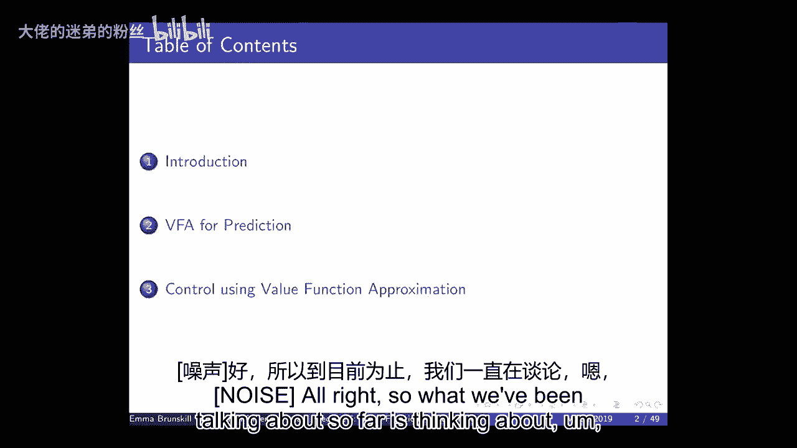
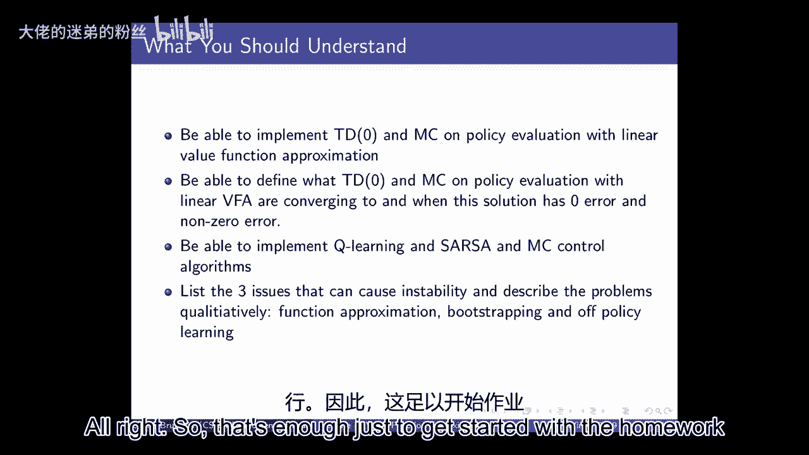

# 【强化学习】斯坦福CS234课程：强化学习中英文字幕 - P5：Lecture 5 - Value Function Approximation - 大佬的迷弟的粉丝 - BV1Cc411h7QQ

 All right， good morning。

 We're going to go ahead and get started。 Homework 1 is due today， unless you're using late days。

 And homework 2 will be released today。 Homework 2 is going to be over function approximation and reinforcement learning。

 We're going to start to cover that material today， and then we'll continue next week。

 with deep learning。 Deep learning is not a prerequisite for this class。

 and so we're going to be releasing， a tutorial on TensorFlow later this week。

 And then next week we'll also in session have the opportunity to go into some more of。

 the background of deep learning。 You're not expected to be an expert。

 but you need to know enough of it in order to do the， homework and do the function approximation。

 We will be assuming that you're very familiar with things like grading the scent and taking。

 derivatives and things like that。 TensorFlow and other packages can do that automatically for you。

 but you should be familiar， with the general process that happens。

 Before we continue to then we may have any logistic questions。 Alright。

 let's go ahead and get started。 As you can see， I have lost my voice a little bit。 It's coming back。

 but we'll see how we go and if it gets too tricky then we'll take， over。 Alright。

 so what we've been talking about so far is thinking about learning to be able。

 to evaluate policies and sequential decision making cases and being able to make decisions。

 All of this is when the world is unknown and what I mean by that is that we're not given。

 in advance a dynamics model or a reward model。 What we're going to start to talk about today is value function approximation。

 Just so I know actually who have you seen this before？

 Who's seen some form of value function approximation？ Okay， so a couple people but most people know。

 When I say value function approximation， what I mean is that so far we've been thinking。

 about domains where we tend to have a finite set of states and actions and where it is。

 computationally and memory feasible to just write down a table to keep track of what the。

 value is of states or the value of state action pairs or that we could imagine writing。

 down a table to write down the models explicitly of the reward model and the dynamics model。

 But many real world problems have enormous state and action spaces。

 So if you think about things like the Atari games， which we can debate about whether or。

 not that's a real world problem but it's certainly a challenging problem。

 the state space we discussed， at the beginning is really sort of a set of pixels。

 And so that's going to be an enormous space and we're not going to be able to write down。

 that as a table。 And so in these cases we're going to have to go beyond sort of this tabular representation。

 and really think about this issue of generalization。

 So we're going to need to be able to say we want to be able to make decisions and learn。

 to make a decision and we're going to need to be able to generalize from our prior experience。

 so that even if we end up in a state action pair that we've never seen exactly before。

 it's like a slightly different set of pixels than we've ever seen before that we're still。

 going to be able to make good decisions。 And that's going to require generalization。

 So what we're going to talk about today is we're starting with value function approximation。

 for prediction and then talk about control。 And the kind of the key idea that we're going to start to talk about in this case is that。

 we're going to be representing the state action value function with a parameterized function。

 So we can think of now as having a function where we input a state and instead of looking。

 up in a table to see what its value is， instead we're going to have some parameters here。

 So this could be a deep neural network。 This could be a polynomial。

 It could be all sorts of different function approximations but the key here is that we。

 have some parameters that allow us to say for any input state， what is the value？

 And just like we saw before， we're going to both sort of go back and forth between thinking。

 of there being a state value function and a state action value function。

 And the key thing now is that we have these parameters。

 We're mostly going to be talking about those parameters in terms of W。

 So you can generally think of W as just a vector where that vector could be the parameters。

 of a deep neural network or it could be something much simpler。 So again， why do we want to do this？

 And sort of what are the forms of approximations we might start to think about？

 So we just don't want to have explicitly store， learn for every individual state action pair。

 So we don't have to do that in terms of learning a dynamics model。

 We don't have to do that in terms of a value function or state action value function or。

 even in terms of a policy。 We're going to need to be able to generalize so that we can figure out that our agents。

 our algorithms can figure out good policies for sort of these enormous state spaces and。

 action spaces。 And so we need these compact representations。 So once we do this。

 we're going to get multiple different benefits。 There were also going to incur potential problems as well。

 So we're going to reduce the memory that we need to store all of these things。

 We're going to reduce the computation needed and， we might be able to reduce the experience。

 And so what I mean by that there is how much data does our agent need to collect。

 in order to learn to make good decisions。 So this is really a notion of sort of how much data is needed。

 Now I just want to highlight here that they can be really bad approximations。

 And those can be great in terms of not leaving a lot of data and。

 not needing a lot of computation and not needing a lot of memory。

 But they may just not allow you to represent very good policies。

 So these choices of representation are defining sort of hypothesis classes。

 They're defining spaces over which you can represent policies and value functions。

 And so there's going to be sort of a bias variance trade off here and。

 a function approximation trade off in the sense that if you have a very small representation。

 you're not going to need very much data to learn to fit it。

 But then it's also not going to have very good capacity in terms of representing。

 complicated value functions or policies。 So as a simple example。

 we could assume that our agent is always in the same state， all the time。

 All video game frames are always identical。 And that's a really compressed representation。

 We only have one state， but it's not going to allow us to learn to make different。

 decisions in different parts of the game。 So it's not going to allow us to achieve high reward。

 So there's going to generally be a trade off between the capacity of the representation， we choose。

 So sort of the representational capacity。 Versus all these other things we would like versus memory。

 computation and data。 Now there isn't always sometimes one gets lucky and。

 you can choose something that's very， very compact and。

 still sufficient to represent the properties you need to represent in order to make good， decisions。

 But it's just worth thinking that often there's this explicit trade off and we often don't。

 know in advance what is a sufficient representational capacity in order to achieve high reward。

 Yeah。 >> Is this more or less than orthogonal consideration from the bi-estarian's trade off。

 in a functional representation？ >> Yeah， and you can think of it as a question as whether this is an orthogonal。

 trade off to sort of bi-estarian's trade off。 Good make up is related。

 If you choose a really restricted representational capacity， you're going to have a bias forever。

 because you're just not going to be able to represent the true function。

 So it's and they'll have considered a smaller variance for a long time because it's a smaller。

 representation。 So it's related to related to that。

 If you take a machine learning and talk about things like structural risk minimization and。

 thinking about how you choose your model class capacity versus how much data you have in。

 terms of minimizing your test center， similar to that too。

 So how do you trade off in terms of capacity to generalize versus the expressive power？ All right。

 So a natural immediate question that I've started alluding to already is what function。

 approximation are we going to use？ There's a huge number of choices。

 Today we're only going to start to talk about one particular set but there's an enormous。

 number and probably most of the ones you can think of have been tried with reinforcement， learning。

 So pretty much anything that you could do in supervised learning， you could also try as。

 a function approximator for your value function。 Could be neural networks or deep decision trees or nearest neighbors。

 wavelet bases， lots of， different things。 What we're going to do in this class is mostly focus on things that are differentiable。

 These are nice for a number of reasons but they tend to be a really nice smooth optimization。

 properties so they're easier to optimize for。 That's one of the reasons we're going to focus on them in this class。

 Those are not always the right choice。 Can you make me an example of where for those of you that are familiar with decision trees。

 where you might want a decision tree to represent either your value function or your policy？ Yeah。

 They tend to be how they interpret both and keep them supportive but it's also a treat。

 In the case we need to explain it to people that need to actually understand that's feasible。

 Exactly。 What's just said is that depending on how you're using this reinforcement learning policy。

 this may be interacting directly with people。 Let's say this is going to be used as a decision support for doctors。

 In those cases having a deep neural network may not be very effective in terms of justifying。

 why you want a particular treatment for a patient but if you use a decision tree those。

 tend to be highly interpretable。 Depending on which features you use but often it's pretty highly interpretable and so that。

 can be really helpful。 Thinking about what function approximation you use often depends on how you're going。

 to use it later on。 There's also been some really exciting work recently on explainable deep neural networks。

 where you can fit a deep neural network and then you can fit a simpler function approximator。

 on top so you can fit your deep neural network and then try to fit a decision tree to it。

 You try to get the best of both worlds super expressive function approximator and then still。

 get the interpretability later。 It's worth thinking about the application that you're looking at because different ones。

 will be more appropriate in different cases。 Probably the two most popular classes these days and in RL in general are linear value function。

 approximation and deep neural networks。 We're going to start with linear value function approximation for two reasons。

 One is that it's been probably the most well studied function approximator in reinforcement。

 learning but up to the last few years。 And second is because you can think of deep neural networks as computing some really complicated。

 set of features that you're then doing linear function approximation over at least in a。

 number of cases。 So it sort of provides a nice foundation for the next part anyway。 Alright。

 so we're going to do a really quick review of gradient descent because we're going。

 to be using a ton over the next few days。 So let's just think about any sort of general function J which is a differentiable function。

 of a parameter vector W。 So we have some vector W。 It's going to be a set of linear weights soon。

 And our goal is to find the parameter W that minimizes our objective function。

 I haven't told you what the objective function is but we'll define it shortly。

 So the gradient of J of W is we're going to denote that as delta J of W。

 And that's just us taking the derivative of it with respect to each of the parameters。

 inside of the vector。 And so that would be the gradient。

 And so a gradient descent way of trying to optimize for a function J of W would be to。

 compute the derivative or the gradient of it and then to move your parameter vector。

 in the direction of the gradient。 So if your weights and generally we're going to always assume the weights are a vector。

 are going to be equal to your previous value of the weights minus some learning rate of。

 the derivative of your objective function。 So we're just figuring out the derivative of our function and then we're going to take。

 a step size in that and move our parameter weights over a little bit and then we're。

 going to keep going。 So if we do this enough times are we guaranteed to find a local optima？ Right。

 so they're maybe some conditions on the learning rate。 Yes。

 if we do this enough we're guaranteed to get to a local optima。 Now， notice this is local。

 So when we start thinking about this in terms of the policy in terms of doing RL it's important。

 to think about where we're going to converge to and if we're going to converge。

 And I'll talk more about that throughout class。 So this is going to be sort of a local way for us to try to smoothly start changing our。

 parameter representation of the value function in order to try to get to a better approximation。

 of it。 Alright， so let's think about how this would apply if we're trying to do policy evaluation。

 So again， policy evaluation is someone's given you a policy， they've given you a mapping。

 of first date what your action is and this could be stochastic。

 So it could be a mapping from states to a probability distribution over actions。

 So but someone's given you a policy and what you want to do is figure out what's the value。

 of that policy。 Was they expected discount of some of rewards you get by following that policy？

 So let's assume for a second that we could query a particular state and then an oracle。

 would just give us the value， the true value of the policy。 So I ask you like， you know。

 what's the expected discount of some of returns for starting in。

 this part of the room and trying to navigate towards the door under some policy and it， says， okay。

 the expected discounted number of steps it would take you is on average like， 30， for example。

 So that would be a way that the oracle could return these pairs and so you'd get sort。

 of this pair of S the pi of S。 And then let's say given that we have all this data what we want to do is we want to fit a。

 function we want to fit our parameterized function to represent all that data accurately。

 So we want to find the best representation in our space of the state value pairs。

 So if you frame this in the context of stochastic gradient descent what we're going to want to。

 do is just directly try to minimize our loss between the value that we're predicting and。

 the true value。 So right now imagine someone's giving us these true S value pairs and then we just want to。

 fit a function approximator to fit that data。 So it's really very similar to doing sort of supervised learning and in general we're。

 going to use the mean squared loss and we'll return to that later。

 So the mean squared loss in this case is that we're just going to compare the true value。

 to our approximate value and our approximate value here is parameterized by our vector of。

 parameters。 And we're just going to do gradient descent。

 So we're going to compute the derivative of our objective function and when we do compute。

 the derivative of that then we're going to take a step size and we're going to do stochastic。

 gradient descent here which means we're just going to sample the gradient。

 So what I mean by that is that if we take the derivative of our objective function what。

 we would get is we'd get something that looks like this。

 And what we're going to do is we're going to take， I'm going to use this as shorthand。

 for updating the weights。 We're going to take a small step size in the direction of this as evaluated for one single。

 point。 So now there's no expectation and this is just for a single point。

 So this is stochastic gradient descent where we're not trying to compute the average of。

 this gradient。 We're going to， we're trying to just sample this gradient evaluated at particular states。

 And what I've told you right now is that someone's given us these pairs of states in the true。

 value function。 So you just take one of those pairs。

 compute the gradient at that point and then update， your weight function and do that many。

 many times。 And the nice thing is that the expected stochastic gradient descent is the same as the full gradient。

 update。 So this has nice properties in terms of converging。 Yes， a name first please。

 So just to confirm why is the expectation over a policy and not over a set of states。

 if you were saying that SGD is a single state？ So this is over the distribution of states that you'd encounter under this policy。

 Question was why do it over what does the expectation mean in this case？

 In this case it's the expected distribution of states and values you'd get under this， policy。

 And that's an important point。 It'll come up again later in terms of what is the distribution of data that you're going。

 to encounter under a policy。 Of course in reality we don't actually have access to an oracle to tell us the true value。

 function for any state。 If we did we would already know the true value function and we wouldn't need to do anything。

 else。 So what we're going to do now is talk about how do we do model-free function approximation。

 in order to do prediction evaluation without a model。 Okay。

 so if we go back to what we talked about before we thought about either these sort of。

 Monte Carlo style methods or these TD learning style methods where we could adaptively learn。

 online a value function to represent the value of following a particular policy。

 And we did this using data。 And we're going to do exactly the same thing now except for we're going to have to whenever。

 we're doing this sort of update step of updating our estimator with new data we're also going。

 to have to do function approximation。 So instead of just like incrementally updating our table entry about the value of a state。

 now we also have to re-approximate our function whenever we get new data。 Alright。

 so when we start doing this we're going to have to choose a feature vector to， represent a state。

 Let me just ground out what this might mean。 So let's imagine that we're thinking about a robot and a robot that well robots can have。

 tons of really amazing sensors but let's imagine that it's old school and it just has a laser。

 range finder。 A lot of laser range finders used to basically be 180 degrees and so you would get distance。

 to the first obstacle that you hit along all of this 180 degrees。

 So maybe here it's like two feet and this is 1。5 feet， this is 7 feet and it sort of。

 gives you an approximation of what the wall looks like for example。

 So here's our robot it's giving it it's got a sensor on it which is a laser range finder。

 and it's telling us the distance to all of the walls and so what would this feature representation。

 be in this case it would just be simply for each of these 180 degrees what's the distance。

 at 1 degree？ 2 degree。 That would be an example of a feature representation。

 Now why that sounds like a pretty good， maybe slightly primitive but generally a pretty good。

 feature representation but what's the problem with that？ Well， probably isn't Markov。

 So a lot of buildings have hallways that would say on my left and my right there's a wall。

 about two feet away and then there's nothing in front of me at least for perhaps out to。

 my laser range finder who would just say out of range and that would be true for many different。

 parts of the same hallway and it would be true for many different hallways and so there'd。

 be a lot of partial aliasing。 So this is a feature representation that probably is not Markov but it might be reasonable。

 It might be a reasonable one on which to condition decisions maybe if you're in the middle of。

 the hallway and that's what it looks like you always just want to go forward。

 That's an example of the type of feature representation and again just emphasizes the。

 point that the choice of the feature representation will end up being really important。

 And for those of you who have taken deep learning classes you've probably already heard this。

 but it's kind of a four deep learning and there was often a huge amount of work and there's。

 still a huge amount of work on doing feature engineering to figure out what's the right。

 way to write down your state's face so that you can make predictions or make decisions。

 Now one of the nice things about deep neural networks is that it kind of pushes back that。

 feature selection problem so that you can use really high dimensional sensor input and。

 then do less amount of hand tuning。 So what do I mean by hand tuning？

 Well in this case you know you could use the raw features about like how far you are to。

 on each of these 180 degrees or you can imagine having higher level abstract features like。

 trying to understand if there are corners。 So you could already have done some pre-processing on this raw data to figure out what features。

 you think might be relevant if you're going to make decisions。

 And the problem with doing that is that again if you pick the wrong set you might not be。

 able to make the decisions you want。 Yes the name first please。

 Could you please elaborate why this is not Markov？ It's getting the 180 degrees。

 Yeah so the question is can I elaborate why this is not Markov？

 If you just have 180 degrees for a robot if you think about something say like a long。

 hallway let's say this is floor one this is floor two like in gates for example。

 So if you have your little robot that's walking along and it's guiding its laser range finder。

 it's trying to tell it's the distance to all of the things you're not going to be able。

 to distinguish with that representation whether you're on floor one or floor two because your。

 immediate sensor readings are going to look identical。

 And in fact you're not going to be able to tell where you are on that hallway from its， hallway。

 Yeah。 So can we generalize that if we have partial aliasing then we say it's more and more fun。

 Great question。 Can we generally say if we have partial aliasing it's not Markov？ Yes。

 I mean you could change this state representation to be Markov by including the history and so。

 then each individual observation would be aliased but the whole state representation。

 would not be but in general yes if you have a state representation for which there's aliasing。

 it's not Markov。 It might still be that you can still do pretty well with that representation or you might。

 not but it's just good to be aware of in terms of the techniques one is applying。 Good question。

 Alright so let's think about doing this with linear value function approximation。

 So what do I mean by linear value function approximation it means that we're simply going。

 to have a set of weights and we're going to dot product this with a set of features。

 So you know maybe it's my 180 degree sensor readings and then I'm just going to have。

 a weight for each of those 180 features。 And we can either use that to represent a value function or you can do that for a state。

 action value function。 Those of you who already think about state action value functions might notice that there's。

 at least two ways to do that once you start getting into Q just mention that briefly。

 You could either have a separate weight vector for each action or you could put the action。

 as sort of an additional feature essentially multiple different choices you get different。

 forms of sharing。 But right now we're just thinking about estimating the value of a particular policy so we're just。

 going to think about values and we're going to say that remember W is a vector and X is。

 a vector now。 X of S is just going to give us the features of that state。

 So it could be like the real state of the world is where the robot is and the features。

 you get out are those 180 readings。 So we're again going to focus on mean squared errors。

 Our objective function is this mean squared error the difference between the values we're。

 predicting and the true values。 And this is our weight update which is we want to update our weight by a learning rate。

 times the derivative of this function。 So what does this look like in the case of linear value function approximation？

 So what we're going to do is we're just going to take the derivative of J using the fact。

 that we know that this is actually X times W。 So what we're going to get in this case is W delta W is equal to so I'm going to have。

 alpha to v pi of S minus v hat of S W times X because the derivative of X times W with。

 respect to W is X。 Yes？ The value over all states are for a particular state。 Great question。

 I'm going to give you one more time。 Yes。 So this question is this is an expected value over all states or a particular state when。

 we're doing the update of the W we're going to be evaluating this at one state。

 So we're going to do this for each state。 We're going to see different algorithms for it but generally we're going to be doing stochastic。

 gradient descent so we're going to be doing this at each state。

 The expected value here you can think about is really over the state distribution sampled。

 from this policy。 So if you were to execute this policy in your real MDP you would encounter some states。

 And if you and we'll talk shortly more about what that distribution looks like but that's。

 the we want to minimize our error over all over the state distribution we would encounter。

 under that policy。 Check out questions。 Okay so if we look at this form what does this look like it looks like we have a step。

 size which we've seen before with CD learning and then we have a prediction error which is。

 the difference between the value function the true value function and the value function。

 we're predicting under estimator and then we have a feature value。

 So that's one of the nice aspects of linear value function approximation is that these。

 updates form into this sort of very natural notion of how far off were you from the true。

 value weighed by the features。 Yes。 >> So you could question on the math here so that you have the negative the gradient until。

 you use the negative one half out that that's a gradient right now but you have a negative。

 inside the minus minus half。 So does the it should be a negative excess there with the negative one half out on the。

 left side as well。 >> You can push this into either so question is about just being careful about the negatives。

 that come out。 Yes you could push that negative out into here in general alphas a constant so you can flip。

 it and be positive or negative generally you're going to want your if you're minimizing。

 this it's going to be you're going to be subtracting this from the weights but you just want to。

 be careful of depending on how you're defining your alpha to make sure you're taking gradient。

 sense gradient steps in the right direction。 >> Good question。

 >> Okay so how would we do this remembering again that we don't actually have access to。

 the true value function so we don't actually know so in this equation right this assumes。

 this is true。 Like this is if the Oracle has given you the value of a state under that policy but of。

 course we don't have access to that。 So what we're going to do is sort of use the same types of ideas as what we saw in tabular。

 learning now with the value function approximation。

 So the return which is the expected or the return which is the sum of rewards from time。

 step t till the end of the episode is an unbiased but noisy sample of the true expected return。

 for the current state where in on time step t。 And so we can think about doing Monte Carlo value function approximation as really as if。

 we're doing supervised learning on a set of state return pairs。

 So now what we're doing here is we're substituting in GT as an estimate of the true value。

 So we don't know what the true value is but we know that the Monte Carlo return is an unbiased。

 estimator so we're going to substitute that in。 Okay so what does that mean if we're doing linear value function approximation it means。

 inside of our weight update we have a G here。 So we would take the state we would take the sum of rewards on that episode so again this。

 it can only be applied in episodic settings just like generally with Monte Carlo and then。

 we take the derivative and in this case that's just X our features because we're using。

 a linear value function approximation and then on the last line I'm just plugging in exactly。

 what our V hat estimator is。 So we're comparing our return to our current estimator and then we're multiplying it by。

 our features and as usual we have the problem that G might be a very noisy estimate of the， return。

 Yes the name first please。 Do we differentiate first time and every time before？

 Do we differentiate first time and every time before？ Great question。

 Do we distinguish between first time visit and every time visit？ Yes。

 The same exact distinctions apply to Monte Carlo obtaining that applied before。

 So on here I'm showing a first visit variant of it but you could also do every visit and。

 it would have the same strength and limitations as before。

 Every visit is biased asymptotically it's consistent。

 Okay so what does the weights look like in this case？

 We would say weight is equal to the old weights plus alpha times e t of s minus v at the best， w。

 Remembering that this is just X times w for that state times X of s。

 So it's very similar to what we saw before for Monte Carlo policy evaluation。

 What we do is we start off in this case now instead of having a value function we just。

 have a set of weights which is going to now be the zero vector to start。

 Then we sample an episode we have to sample all the way to the end of the episode using。

 the policy and then we step through that episode and if it's the first visit to that state then。

 we compute the return from that state till the end of the episode and then we update our， weights。

 Yeah。 Just to check the path are you adding the learning rate because of the negative and。

 the pretty weight？ Just a quick question is about the alpha where oh in terms of negative versus positive。

 Right。 Just one or two or three。 Yes so in general this is going to look like this。

 I'm going to be a little bit loose on those。 Alpha is going to be a learning rate that's a choice。

 And finally we're going to be trying to minimize our objective function and we're going to be。

 reducing our weights。 And we'll need to be able to be a little bit careful about how we pick alpha over time。

 And this is being evaluated at each of the states that we encounter along the way。

 And just be careful on step six， you know， after or just adding up with no distance。 Good question。

 On step six， I was it。 Well sorry said do we need to have a gamma function？

 It's a good question in episodic RL you can always get away with gamma being one。

 So if it's an episodic place， gamma can always equal one。 It is also fine to include gamma here。

 So here generally in episodic cases， you will set a gamma being equal to one because one。

 of the reasons why I said our gamma to be less than one is to make sure things are bounded。

 in terms of their value function。 But in the episodic case， it is always guaranteed to be bounded。

 But it is also completely fine to include a gamma here。

 So I kind of have a question about the same point about this g。 So when we do that。

 it seems like we will end up sampling g's that have rewards over， episodes of different length。

 So doesn't that pose their distribution in all stationary and long variance？ Questions。

 but there's a problem with the fact that the returns you're taking are going。

 to be sums over different lengths。 It isn't。 So you're always trying to estimate the value of being in this state。

 which itself under， this policy。 And in the episodic case。

 you might encounter that state early on in the trajectory or late， in the trajectory。

 And your value is exactly going to be averaged over whether you encountered it early or late。

 in one of the returns。 There's no problem with， we are assuming all of your episodes are bounded。

 They have to be finite。 So there has to be with probability one， your episode has to end。

 If that is true， then your rewards are always bounded。

 And then you can always just average over this。 And that's fine。

 Sometimes you might encounter a state really early in the trajectory and have a lot of， rewards。

 Other times you might encounter it at the end and have very few rewards。

 And the value of it is the expectation over all of that。 Yeah。 Well， that's just a clarification。

 So， essentially， this algorithm you're updating this little of the linear approximation of。

 the episode。 So you start with an episode， it was a little， then you take that little new updated。

 keep， it in the following episode。 And not just one， so to ask about it。

 and you're not just updating the wait once an episode， many times， right？

 So you look at all the states you encountered in that episode， and for each of those you。

 update your wait vector。 So you're generating all the episodes and trying to fit them in a single。

 That's a good idea。 What if we did this in a batch setting？

 So what if you generated all the data and then afterwards tried to fit it？

 So this is an incremental approach to doing that。 And then I'll end up converging to the same thing。

 Okay。 Great。 Yeah。 Just when you include gamut， you should be gamut at the power of J minus T so that you。

 start discounting， like going forwards。 Okay。 Good catch。 Again。

 you shouldn't need a gamma in this case。 So in general in this case。

 there should be probably most of the time there be no gamma， in the episodic case。

 but it's good to be precise about these settings。 Okay。 All right。

 So let's think about this for a particular example。

 It turns out that when we start to combine function approximation with making decisions。

 and doing this sort of incremental update online， things can start to go bad。

 And what I mean by bad is that we may not converge and we may not converge to places。

 that we want to in terms of representing the optimal value function。 So there's a nice example。

 When people are really starting to think a lot about function approximation in the early， 1990s。

 Baird came up with this example where it can illustrate some of the challenges of。

 doing function approximation when combining it with doing control and decision making。

 So we're going to introduce this example now with doing MC policy evaluation and then。

 we'll see it a few times throughout class。 So what is this example showing？ So in this example。

 there are going to be two actions。 So A1 is going to be straight lines and those are all going to deterministically go to what。

 I'm going to call state S7。 This is state S1， S2， S3， S4， S5， S6。

 And what you can see inside of the bubbles there is what its feature value representation， is。

 So remember I said that we would have a state and then we could write it down as a set of， features。

 So what does S1 look like？ It looks like two， two， three， four， five， six， seven。

 So weight one is two and weight eight is one。 So what does S2 look like？ S2 looks like zero， two。

 one， two， three， four， five。 There we go。 S3 looks like this。

 And so on until we get to S7 which looks like this。

 So S7 looks a little bit different than the rest of them。

 That is the feature representation of those states。

 Now notice that it looks pretty similar to a tabular representation。

 In fact there are more features than there are states。

 So there are only seven states here and there are eight features。 That's completely possible， right？

 Like your feature representation could be larger than the number of true states in the， world。

 So then we have action A1 and action A1 always takes us from any state deterministically to。

 state S7。 And then we have action A2 which is denoted by dot dot dot dot。

 And what action A2 does is with probability one over six it takes you to state S， I where。

 I is in one to six。 So basically uniformly spreads you across one of the first six states。

 So there are only two actions。 Either you deterministically go to state S7 or if you take the second action then you。

 go to one of the first six states with equal probability。

 It's a pretty simple control problem because the rewards are zero。 Everywhere for all actions。

 So the value function for this is zero because there's no rewards anywhere and yet we can。

 start to run into trouble in some cases。 So before we get to that part let's first just think about what like a Magi Carlo update。

 would do。 And let's just imagine also that there's some additional small probability here that from。

 S7 that we actually go to a terminal state。 So like let's say with probability 0。

999 we stay in S7 or 0。99 we stay in S7 and 0。01， we terminate。

 And this is a slight modification but I'm doing that just so we can do it for the Magi， Carlo case。

 So we can think of episodes ending。 So if you're in state one through six you can either go to S7 or you can stay in states。

 one through six。 If you're in S7 you can either go to states one through six you can stay in S7 or you can。

 terminate。 Alright so what might an episode look like in this case？

 So let's imagine that we were in state S1 we took action A1 that deterministically gets。

 us to state S7。 Actually before I do that I'll specify we got zero reward。

 Word was zero we went to S7。 We took action A1 we got zero reward we stayed in S7 we took action A1 we got zero reward。

 and then we terminate。 That's our episode。 So now we can think about what our Monte Carlo update would be。

 So our Monte Carlo update in this case would be let's start with state S1 and try to do。

 the Monte Carlo update。 So for state S1 the return is what？ Zero。 Zero。 So the return is zero。

 What is X？ Oh and I should tell you。 So let's start with initializing all of our weights to be one。

 So what is our initial estimate of the value function of state S1？ How many？

 So it's all of the weights are one。 The state S1 representation is two zero zero zero one three。

 That's right。 So and that's just equal to our X times delete。

 So then what does our update look like？ And of course I would have to tell you what alpha is。

 So let's say alpha is equal to 0。5。 So what our weights are going to change in the weights is going to be equal to 0。

5 times， zero minus three times our feature vector for X。

 Our feature vector for X is two zero zero zero zero one。

 So that means that we're going to get basically minus one point five times two zero zero one。

 minus three times minus one point five。 So notice this is going to give us an update for every single weight。

 But it's only going to give us an update for the weights that are nonzero in this particular， state。

 which is the first weight and weight eight。 And so then if we were to actually get the new weights。

 so now we're going to have w is， equal to w plus delta w。

 Then our new representation would be minus two one two three four five six， minus point， five。

 So that would be one update of Monte Carlo for the first state。

 Now you would do this for every single state in that episode。

 So you would then do it for the first time you see it in the algorithm I've defined before。

 So we would next do this for state as seven as well。 Where the return would also be zero。

 but the value would be something different。 So we would get a different well actually in this particular case。

 the value is also three。 It depends on if you've already updated your w then your value will already be different。

 Yeah。 So we're doing SGD per state not perhaps。 Question is are we doing SGD per episode or state？

 We did per state。 Yeah。 In the previous slide we had the fourth every state that every encounter does that mean that。

 for every first visit in that episode。 So yes， and it's within that specific episode。

 So when you go to a new episode that would reset。 Question is about through this first visit。

 We basically step along that episode similar to what we did with Monte Carlo before and。

 the first time we're going to encounter a state in that episode we update the weights using。

 its return and when we do that for every single unique state in that episode the first time。

 we see it and then after all of that we did a new episode。 Alright。

 So this is what would happen and you can see that the changes can be fairly large because。

 we're comparing like the full return to our value function。

 It depends of course on what our alpha is and alpha can change over time and generally。

 we'll want alpha to change over time in order to get convergence。

 This gives an example of sort of what Monte Carlo updated would look like in this case。

 with linear value function approximated。 Okay。 So a natural question might be does this do anything reasonable？

 Are we guaranteed that this is going to converge to the right thing？

 And what does the right thing mean here？ We're constrained by our linear value function approximator。

 So we're going to say are we going to converge just like the best thing in our linear value。

 function approximator。 Okay。 Before we do this let's just talk for a second about the distribution of states and how that。

 influences the result。 So if you think back for maybe the first or second lecture we talked about the relationship。

 between Markov processes， Markov reward processes and Markov decision processes。

 And we said that once you define a particular policy then your Markov decision process is。

 actually a Markov reward process where you can think of it as a chain where the next。

 state is determined by your dynamics model where you only use the action according to， your policy。

 So if you run that， if you run your sort of Markov chain to find by an MDP with a particular。

 policy you will eventually converge to a probability distribution over states。

 And that distribution over states is called the stationary distribution。

 It's a probability distribution it's saying sort of like what percentage at the time are。

 you going to be in state one on average versus state two， etc。

 That's the sum to one because it's a probability distribution you always have to be in some。

 state and it satisfies a balanced equation。 So it says that the probability distribution over states before some。

 yeah I guess let me， just flip this I think it's a little bit easier to think about it the other way around。

 We've got d of s prime is equal to sum over s sum over a。

 We're just doing this sum over a right now so that we can be sure that we allow ourselves。

 to have stochastic policies。 So we look at all the actions that we could take under the current state and then we look。

 at where we could transition to on the next state。

 So we are in some distribution over states we think of all the actions we could take。

 from each of those states where we might transition to and then that gives us a new distribution。

 over states s prime and those two have to be identical。

 So this is often also thought about in terms of a mixing property when your Markov chain。

 has run for long enough this balanced equation will eventually hold and this is just that。

 your distribution over states on the previous time step has been exactly the same as your。

 distribution over states on the next time step after this process is fully mixed。

 And it's just telling you on average you know how much time are you spending and what's。

 the probability on any particular time step you're going to be in a particular state。

 This is not telling us how long it takes for this process to occur。

 So this depends a lot on the underlying dynamics of the system。

 So it might be that this takes millions of steps until you reach the stationary distribution。

 or it might mix pretty quickly depends on the properties of your transition matrix under。

 the policy。 I'm not going to get into any of that in this class。

 It's just important to know that you can't it's not like you can just wait a hundred steps。

 and definitely you're going to be in the stationary distribution。 It depends on the problem。 Yeah。

 Any of you。 Remember my meaning？ Yeah。 Have you been putting bounds in the mixing plan？

 Is my color measures？ Well， there's any proven bounds on the mixing time of these type of Monte Carlo methods。

 Not that I know of there might be some。 So really tricky issue often because you don't know how long it will take to get to。

 this sort of stationary distribution。 There's a really cool paper that just came out like a month ago at NURBS that talks about。

 how when we're thinking about policy evaluation， which we'll talk more about later today， instead。

 of thinking about sort of per step ratios or whether you'll be taking a certain action。

 and a certain policy or not， you can think about these stationary distributions and the。

 difference between them and different policies。 Problems you often don't know how long and whether your data has got to that stationary。

 distribution。 So it would also be really nice if there were easy tests to tell if this was true。

 That's also really hard to know。 Yeah。 Sorry。 I'm actually the very negative， I have an example。

 Yes。 Yeah。 Yeah。 Why it was compared to the key groups。 Yes。 So the question is about right。

 So I sort of gave a long return use as you know， you gave a long prelude about saying like。

 that things might not converge， but everything looked fine there。 We got to go into that more。 Yes。

 And we're going to talk about the fact that actually in the on policy setting where we're。

 just doing policy evaluation， everything's going to be fine。

 It's only when we get into the control case where we're going to be using data from one。

 policy to estimate the value of another。 We're in this example and many others things start to go right。

 So we'll use this as a running example， but right now there's no reason for you to believe。

 this is pathological。 Okay。 So this is the stationary distribution and then the convergence guarantees are related。

 to that。 Okay。 So what we're going to do is define the mean squared error of our linear value function。

 approximator with respect to the stationary distribution。 Why is this reasonable？ Well。

 because you probably care more about your function approximated in error in states。

 that you visit a lot。 If there's a state that's really， really rare。

 probably it's okay to have bigger error there。 You want your overall mean squared error to be defined on that stationary distribution。

 So this is the mean squared sort of value prediction error and it compares what we predict。

 versus the true value weighed by this distribution of states。

 And what we're assuming for right now is that the approximation we're using is a linear。

 value function approximator。 Let me just note for historical reasons that John does it sit-class and Ben Van Roy。

 John， is at MIT。 I had the pleasure of him teaching me probability， which was great。

 And then Ben Van Roy is here and was one of， I think， John's PhD students or post-jocks。 Anyway。

 they， in about 1997， people were getting really interested in whether or not when you。

 combine function approximation with reinforcement learning， what happened and whether things。

 were good or bad and they're responsible for this nice analysis。

 So let's assume we have a linear value function approximator。

 What you can prove is that if you do Monte Carlo policy evaluation for linear value function。

 approximators， you're going to converge to the weight which have the minimum means squared。

 error possible。 It's kind of best you could hope for。

 So this is saying in the limit is you have lots and lots of data and you run this many， many。

 many times， then you can just converge to the best weights possible。

 Now this error might not be zero because it might be that your value function is not。

 approximatable with your linear set of weights。 But it's going to do the best job it can。

 So I'm just going to find the best。 It's basically just doing the best linear regression that you can do on your data。

 So that's good。 It's sort of a nice sanity check。 It's going to converge to the best thing that you could hope to do。

 So maybe we've been asking about， OK， well， I'm going to be the sort of incremental method。

 And maybe in some cases that's reasonable。 Maybe you're running like a customer recommendation system and you're getting data over time and。

 you're updating this estimator。 But in some cases you might have access to just a whole bunch of data from this policy。

 and couldn't you just do that kind of more directly？ And the answer is yes。

 So this is often called batch Monte Carlo value function approximator。

 And the idea is that you have a whole bunch of episodes from a policy。

 And the nice thing is now you can just kind of analytically solve for the best approximator。

 So again， our GIs are going to be our unbiased sample of the true expected return。

 And what you can do is now N is just our set of data。 This is really a linear regression problem。

 We're going to use our unbiased samples， estimates of the true value function。

 We're just going to find the weights that minimize this mean squared error。 You take the derivative。

 you set it to zero。 It's linear regression。 You can solve for this analytically。

 So just like how we talked about， you could do policy evaluation analytically in some cases。

 You can also do it analytically in this case for the linear value function approximator。

 And note again， this is Monte Carlo。 We're not making any Markov assumptions。

 We're just using the full return。 This is also fine in non-Markov environments。 [INAUDIBLE]。

 [INAUDIBLE]， OK， so when we want to do this versus the other iterative one。

 this generally has higher， computational cost。 Xs can be a very large matrix。

 It may not be possible even write down。 Xx is all of your data in the future representation form。

 And it requires taking a matrix inverse。 So that may not be feasible if you've got huge feature vectors and millions of billions。

 of customers。 Facebook can't do this directly。 And also， if you're doing this。

 you could do this incrementally， but you're always refitting， with all of your data。

 That also could be very expensive。 So most of it's about memory and computation。

 If you have a really small case， it's probably a good thing to do。

 And it also depends whether you already have all your data or not。 Yeah。

 He goes through sub-batch as well， right？ And that could help with convergence and not having your gradient estimation structure。

 quite as much。 So of course， there's an in-between。

 So you could do-- if you have access to quite a bit of data， you could either do it completely。

 incrementally or all batch， or you could do sub-batches。

 And there's some nice work by my colleagues and also us showing that in terms of we get。

 into deep learning， there can be a lot of benefits to doing some amount of this analytical。

 aspect over a sub-batch of data。 Because you're sort of-- particularly when you get into TD learning。

 you're propagating， information a lot more quickly than you are if you're just doing this incremental slow。

 update。 Because remember， in TD learning， we're also only doing one step of backup compared to。

 propagating all of our information back like we do with Monte Carlo。 All right。

 So now we're going to get into temporal difference learning。

 So remember in temporal difference learning， we're going to use both bootstrapping and sampling。

 Monte Carlo only uses sampling to approximate the expectation。

 TD learning also uses bootstrapping because we don't have to wait till the end of an episode。

 We just bootstrap and combine and are estimated the expected discount of some of returns by。

 using our current value function。 So in this case， what we used to do is we would bootstrap。

 This is the bootstrapping part。 And what we often call our target is the reward plus gamma times the value of the next。

 state。 And I remember the reason this is sampling is we're sampling this to approximate our expectation。

 We're not taking the full probability of S prime given SA and summing over all of S prime。

 So before we did this and we represented everything as a table， now we want to not do， that anymore。

 So let me just-- before we get into this， let me just remind us the three forms of-- or。

 the forms of approximation we're going to have now。

 Now we're going to have a function approximation， bootstrapping and sampling。

 But we're still on policy。 What do I mean by that？

 Right now we're still just doing policy evaluation， which means we're getting data from the policy。

 that we're trying to estimate its value。 It turns out things are just way easier in that case when you're on policy。

 And perhaps that this should be somewhat intuitive。

 It's quite similar to the supervised learning case。 Supervised learning。

 you're generally assuming your data is all IID。 Our data is a little bit more complicated than that。

 But our data is closer to that in this case because we have a single policy。

 It's not sort of this non-stationary aspect that comes up when we start changing the policy。

 So right now we have these three forms of approximation， function approximation， bootstrapping。

 sampling， but we're still on policy and mostly things are still going to be okay in terms of convergence。

 So what does that look like？ We're again going to sort of think about doing the equivalent of supervised learning。

 We'd like to just have our states and the oracle tell us what the value is and fit our， function。

 Instead of having the oracle， we're going to use our TD estimates。

 So we're going to use our word plus gamma times our approximate value of the next state。

 And that's going to form our estimate of what the true value is。

 And then we're going to find the weights to minimize the mean squared error in that setting。

 So if we do that， what we can see is that if we're doing the sort of the linear case。

 we write this out as just this is the TD target。 Just as a quick side note。

 I'm going to use the word TD zero a lot。 We haven't talked about it in this class。

 but there's actually a whole bunch of different， slight variance of TD which are often called TV gamma。

 And so if you're reading the book， that might be a little bit confusing。

 So I just want to be clear that we're doing the TD zero variant， which is probably the。

 most popular。 There's a lot of other extensions for simplicity。

 We're just going to focus on TD zero for now。 So this is the TD target。

 This is our current estimate。 And then we take the derivative。 In this case。

 that means that we're going to end up plugging in our linear value function。

 approximator for both our current state， the next state， and looking at that difference。

 weighed by the feature vector。 So it should look almost identical to the Monte Carlo update except for the fact that。

 now we're bootstrapping。 So instead of this being G versus being the G return that we saw before for a particular。

 episode。 Now we're bootstrapping and we're getting the immediate award plus an estimate of the discounted。

 sum of rewards which we're using in our value function approximator to estimate。

 So this is what the TD learning linear value function approximation for policy evaluation。

 algorithm looks like。 Again， we're going to initialize our weight vector。

 We're going to sample a tuple and then we're going to update our weights。

 So we get to now update our weights after every single tuple， just like what we saw for。

 TD learning。 And what we can see here is that we're just plugging in our particular estimator minus。

 our old estimator times x。 So let's see what this looks like on the Barrett example。 So again。

 we have the same state feature representation as before。 State one is two zero， zero， zero， zero。

 one。 We still have zero awards for everywhere that set our alpha equal to point five。

 Now we're in the case where we can say that there is no terminal state because TD learning。

 can handle just continuous online learning。 So we're just going to assume that S seven always stays in S seven under action A one。

 So A one is the solid line and A two is the dashed。

 And we're going to initialize our weights to one one one one。 And then let's look at this tuple。

 So just like the first tuple we saw before， imagine we're in state one。

 We took action A one with our award of zero and went to state S seven。

 So why don't we take a minute and you calculate what the new weights would be after we do。

 that update and maybe compare back to the Monte Carlo case in terms of how much they， have changed。

 Feel free to talk to a neighbor。 I think this is a little bit bigger so it's easy to remember what S seven is。

 This is what we were talking about。 Okay。 All right。 Have they moved a lot a little？

 How much of the waves changed compared to what we saw with Monte Carlo？

 And some people indicate smaller。 Okay。 So the initial value of the states， this is going to be。

 so for x of s1 times w， it's， still going to be 3。 For x， s prime， s prime is 7。

 If we look up what that is， this is also going to be 3。

 But now what we're going to have is we're going to have delta， w is equal to alpha times， 0 plus 0。

9 times 3 minus 3。 And so that's going to be equal to alpha times minus 0。3。

 So remember before it was actually minus 3。 So it was a much bigger update。

 And so then when we add that into our new weights， we're going to move our weights， but。

 we're going to move them much smaller than we saw before。 And it shouldn't be too surprising。

 it's sort of consistent with what we saw for Monte Carlo， updating and TD learning。

 TD learning is only updating these sort of smaller， local changes， like one state action。

 or next time at state。 The Monte Carlo is saying this is an episode full episodic return。

 It's not bootstrapping。 So it's saying no really the return from starting in state s1 is 0。

 So we're going to move it a lot more here。 It's saying OK。

 I'm going to pretend that the return from state s1 is 2。7， which is close， to 3。 It's not 0。

 So when we move our weights over here， the difference is going to be much smaller than。

 what we saw from Monte Carlo， which is similar to what we saw without function approximator。

 All right。 Whatever our theoretical properties in this case， pretty good。 So these are also。

 if you look at TD0， you're going to converge to weights， which aren't。

 necessarily quite as good as Monte Carlo， but they're within a constant factor。

 So they're going to be 1 over 1 minus gamma of the minimum possible。

 So they're not quite as good as Monte Carlo， but they're pretty good。

 And depending on your discount factor and the function approximator possible， this varies。

 in terms of benefits。 So just to check our understanding for a second。

 I've put up both of these results。 So one says the Monte Carlo policy evaluator converges to the minimum means greater to。

 1 possible under your linear value function approximator。

 And TD0 converges to within 1 over 1 minus gamma of this minimum error。 So again。

 what is this minimum error that says if you could pick any linear value function， approximator。

 how good could that be at representing your true value of your policy？

 So let's take just another minute。 And this is a good one to talk to a neighbor about。

 If the value function approximator is the tabular representation， what is the MSPE for both Monte。

 Carlo and TD？ So we guaranteed to converge to the optimal solution。

 optimal value for the true value for， V of pi or not。 If it's not clear what the question is。

 feel free to ask。 So when you say it's a tabular representation。

 do you mean that you are reducing the representation， of the capacity of the system？

 Question is if I say it's a tabular representation， what do I mean by that？

 I mean that there is one feature for each state。 It's like a one-hot encoding。

 So it's like the same representations we saw for the first few lectures where， like， for。

 each state， you have a table lookup for that value of that state。 Yeah。 [inaudible]， So TD is there。

 Everything we're seeing in a question is about TD versus the TD is there。

 Everything we're talking about in class right now is TD zero。

 I'm using that because there are multiple versions of TD and if you look at the book。

 they'll have TD lambda sometimes too。 So I'm just making sure it's clear。

 So if you read other resources， you'll know which version of TD to map to。 All right。 Well。

 first question。 If we're using a tabular representation。

 can we exactly represent the value of a policy？ If we're using the， if we。

 for every single state in the world， you can have a different， table representation。

 Can we exactly represent the value of the policy？ Yes。 Yeah， we can。

 So if you have one feature for every single state in the world， it's not going to be practical。

 We can't actually do this， but you can exactly represent the value of a policy。

 How could you do this？ You could simply run the policy for every single state。

 Do Monte Carlo returns an average and that would give you the true value of the state。

 So you could do it。 You could represent the expected discounted sum of returns by representing that in every。

 single table。 So that means that this error is equal to zero because your functional capacity is sufficient。

 to represent the value。 So that what we're saying is in expectation， right。

 the difference between what your function， is， what it actually gets to zero。

 but in each data set it may be different。 So there is， in expectation at zero， but in any episode。

 it's different。 In this case， if you have a tabular representation and this is in the limit。

 so with infinite， amounts of data， et cetera， then this will be。

 this will be zero for every single state。 So this equals zero for every state。

 You will converge to the right value for every single state if you're using a tabular representation。

 And that's because if you think of just having like literally infinite amount of data and。

 you run your policy， just infinite amount of times， then for every state you have an infinite。

 number of trajectories starting from that state and you can write down that value separately。

 in the table。 So it'll be zero。 So what that means is that the mean squared value error for the Monte Carlo estimator is。

 zero if you're using a tabular representation and because it's zero， that is exactly the。

 same as the mean squared value estimator for TD， except for this is just equal to MSBE。

 of the Monte Carlo times one over one minus gamma。 So that means that this is also zero。

 So if it's a tabular representation， just to sort of connect back to that， none of these。

 but there would have any error。 Yeah， question in a second。 And neighbors。 Yeah。

 I'm wondering where the one over one of those gamma points can come from。 Yeah， the question is。

 you know， where does that one over one minus gamma constant come， from？ In the interest of time。

 I'm not going to go through it too much。 I encourage you to read this as a cyclos paper。

 Intuitively， there is error that's a propagating here because of the fact that we're bootstrapping。

 And so if you have a function at what this， what this result is sort of trying to highlight。

 is that if your function approximator actually has no error， then there's going to be no difference。

 between Monte Carlo and TD because for both of them， the mean squared value error inside。

 of that sum， the minimum over w is going to be zero。

 So it doesn't matter whether you're using TD or Monte Carlo。 But if that's not true。

 like if you can't actually exactly represent the value function。

 then you're going to get error and that error is going to like basically you can think of。

 one over one minus gamma is approximately a horizon H。 And basically that's getting。

 multiplied because you're adding up these errors。 And the reason those get added up is because you're bootstrapping。

 So you're propagating that error back。 Where's Monte Carlo doesn't suffer that？ Yeah。 In general。

 the mean squared error is taken over distribution of the states。 Under a specific policy。

 But the only specific one we've seen is a stationary distribution。 Do you ever use another one？

 Great question。 And it is okay， right now we're seeing this under the stationary distribution of the states。

 that you're going to reach under the policy that you care about evaluating for that。

 I think that's the right choice because that really is the state you're going to get to。

 under this policy。 When you start to think about control， you might want others。

 Like if you're going to change your policy。 All right。 So let's， I guess just briefly more on this。

 Are they faster？ Is one of them better to my knowledge？ That's not really understood。

 If you come across any literature on that， I'd love to hear it。 The only TD often is better。

 Just empirically often the bootstrapping often helps you a lot。 All right。

 Let's move on briefly to control。 It's going to be pretty similar。

 So instead of representing the value function， we're going to represent the state action value。

 function， which is what we saw before when we wanted to often move from policy evaluation。

 to control。 And now what we're going to do is we're going to interleaves with policy evaluation with。

 a value function approximator with performing like an e-greety policy improvement。

 This is where things can start to get unstable。 What are we doing in this case？

 We generally involving function approximation， bootstrapping。 We're also doing sampling。

 But really the really big issue seems to be the off policy learning。

 But when we think about before we had this nice stationary distribution or we're converging。

 to a stationary distribution over states， we're not going to be doing that anymore because。

 we're going to be changing our control policy over time。

 And so that's changing the distributions of states that we encounter。

 And set in a bar to often call it the deadly triad。

 Once you start combining function approximation and bootstrapping and off policy learning。

 things start to get a little bit， they can fail to converge or converge to something good。

 All right。 But before we get into that， let's think about it procedurally。

 So now we're going to have Q functions that are parameterized by a W and we can again do。

 stochastic gradient descent。 This is going to look almost identical to what we had before。

 And again， this stochastic gradient descent can sample the gradient， which means for a。

 particular state action pair， then we're going to do these updates。

 So here what we're going to do is we're going to represent our Q function by a set of linear。

 state action weights。 So that means we're going to have features that sort of both encode the state and the。

 action。 So like what I saw when I was turning left as my robot， for example， so it's going to。

 be a combination of these two。 And then once we have that。

 then we're going to just have a weight vector on top of that， for the Q。

 So we're not having separate weight vectors for each action。 Instead。

 we're having features that try to encompass both the state and action themselves。

 And then we can do our stochastic gradient descent on top of that。

 So how does this work for like Monte Carlo？ It's going to look almost identical to before。

 We're just going to again use our return。 Now we're going to be defining returns from a particular state action。

 For doing first visit the first time we reached the state action in that episode， we look。

 at the return， the sum of rewards till the end of the episode， and we use that as our， target。

 That is our estimate of the oracle， the true Q function， and we update towards that。 In Sarsa。

 we're going to use a TD target。 So we're going to look at the immediate reward of our tuple plus gamma times Q of the next。

 state that we encountered and the action we took。 And so then we're again going to just plug that in。

 And then for Q learning， it's going to look almost identical to Q learning except for again。

 we're going to plug in function approximators everywhere。 So we're going to plug in this， remember。

 is going to be a function of our X， which is， going to be a function of S prime and A prime times our W。

 whereas here this is going to， be a function of the state and action。

 Everything's linear and we're just doing different forms of bootstrapping and comparing。

 whether or not we take a max or not。 Alright， so I went through that a little bit fast。

 but it's basically exactly analogous， to the first part。

 which we sort of step through more carefully。 Except for everything's with Q functions now。

 Why might this get so weird or tricky？ So TD with value function approximation is not really following a gradient。

 I don't have time to go into a ton of details on that today， but there's some nice explanations。

 on this in chapter 11。 So Sartan and Bartow， chapter 11。 That's a great resource。

 And we also have lecture notes available online。 And so， infirmally。

 we're sort of doing this interleaving of doing this like approximate。

 sample Bellman backup combined with what's often known as a projection step because we're。

 trying to sort of project our value function back into the space of representable functions。

 And intuitively for why this might start to be a problem is that the Bellman operator。

 we showed is a contraction。 Like when we're doing dynamic programming。

 we showed that if you do Bellman， Bellman， backups， you're guaranteed to converge to a fixed point。

 When you do the value function approximator， it can be an expansion。 What does an expansion mean？

 Well what a contraction， just as a reminder， what a contraction set is， let's say for an。

 operator that's a contraction。 If you apply this operator。

 and this is an operator like the Bellman equation， Bellman， backup。

 if you apply it to two different value functions， the distance between this。

 it could be like a max norm or something like that is less than or equal to the previous， distance。

 which means as you apply this operator， the distance between your old value function。

 and your value function keeps getting smaller and smaller and smaller and eventually get。

 to a fixed point。 The problem is now we're not doing that anymore。

 It's more like we're doing like O V and then we do some sort of projection operator。

 I'm just going to call it kind of a weird P。 So this is the projection operator。

 It means when you compute your new value function， it may no longer lie in your value function。

 approximator space。 You're going to have to refit it back into that space。 When you do that。

 that operator itself can be an expansion。 For those of you that are interested in some of the early sort of discussions of this。

 Jeff Gordon has a really nice paper on averages from 1995 where they talk about how linear。

 value function approximators can be an expansion。 So， the Bellman backup is fine。

 It's a contraction， but when you do this approximation。

 you might expand the distance and that's one， of the problems。 Okay。

 so if we go back to our bare example and think about this a little bit more in terms。

 of the control case。 So let's imagine that we have a setting where you have two different policies。

 And the first policy and this is the policy that you want to evaluate， you always take。

 the solid line。 So you always take A1 and in your behavior data。

 this is the policy you're using to gather， data。 You take A2 with six sevenths of the time and you take A1 one-seventh of the time。

 gamma， is 0。99。 And what you do is you generate a whole bunch of data。

 So you generate data under your behavior policy。 So there's some really cool work on how you deal with sort of correcting for the data that。

 you're getting versus the data you want to evaluate。 Let's imagine we don't go into any of that。

 which I think is super cool。 And instead we're just going to do something super simple。

 which is we're going to throw， out all the data that doesn't match。

 So imagine you just throw away data if A is not equal to pi of S。 So you generated all。

 these data points。 So what does it， what do I mean by data points here？ We had S， A， R， S prime。

 So you take all these tuples。 If it turns out that the action that was taken there is not the same as the policy you。

 want to evaluate， that you're only ever taking A1， just throw out that tuple。 You don't update。

 So now all of your remaining data is consistent with your policy。

 So let's imagine then you try to do TD learning with that data。 The problem is you can diverge。

 And what do I mean by that？ It means that your weights can blow up。

 Super interesting why this happens。 The main intuition for it is that your distribution data is not the same as the data that you'd。

 get under your desired target policy。 In particular。

 if you were actually to run the policy you care about pi， what would happen？

 Let's say you start off in state S1。 You take A1， that determinates， so it gets you to state S7。

 They're going to stay in S7 for a really long time because it's deterministic。 So you get like S1。

 S7， S7。 Say when you did this， maybe it wasn't episode of case and you have multiple episodes。

 You'd still have cases where you'd like have very little bit of amount of data about S。

 these S's and lots of data about S7。 But in the data that you get from your behavior policy because a bunch of the time it takes。

 A2， it'll keep teleporting you back to one of S1 through S6。

 Which means the distribution of your data， the data you have looks very different。

 The distribution of states you visit looks very different than the data that you get。

 and the states you visit under pi。 And that is the problem。 If you don't account for this mismatch。

 then the values can diverge。 Even though they're all sort of compatible。

 all in the sense that you're only ever using， a state action pair if you took the action under your desired policy。

 And this sort of issue can also come up when you're using Q-learning and you're doing generally。

 like updating this policy over time。 So in terms of this。

 just to briefly summarize before we finish， in the tabular case everything， converges。

 it's beautiful。 In the linear case， try me by this， I mean that can shatter。

 You basically converge but you might， there might be some oscillation。

 But Q-learning like we were doing this off policy aspect can diverge。

 And once we get into nonlinear value function approximation， like mostly all bets are off。

 Now this is a little bit of an oversimplification。

 There has been a huge amount of work and huge amount of interest in this because everyone。

 wants to do function approximation with RL so we can tackle real problems。

 And so over the last like one or two decades， there's been a huge amount of work on this。

 And there are some algorithms now that do have convergence guarantees。 And there's some super cool。

 really recent work where they're looking at Batterrrel which。

 can converge with nonlinear approximators。 So there's definitely a lot of work on this that we're not going to get to。

 I just want to highlight that it's a really important issue not just whether it converges。

 but what it converges to。 Like you might converge to a point which is a really bad approximator。

 So it's stable， it doesn't， your weights aren't blowing up but it's just a really bad， approximator。

 And some of the critical choices here are your objective function and your feature representation。

 So just before we close， I think this is a really nice figure from Seton and Bartow。

 What they're showing here is you can think of it as like you have this plane which is。

 where you can represent all of your linear value function approximators。

 And what happens when you do a Bellman update or like you do a TD backup is that you're going。

 to now sort of have a value function that might not be representable in your plane。

 And you can project it back。 And these different， you can quantify different forms of error。

 Basically this allows you to find different objective functions that you're trying to minimize。

 in order to find the best approximator。 And we've seen one today which is sort of this minimum mean squared error approximator。

 Essentially over the like these Bellman errors but that's not the only choice and it's not。

 necessarily even the best choice。 Because it might be that the one that has the smallest error there is not the same one。

 that has the best performance in your real problem。

 So that's a little bit fast but it's super interesting that's covered in Seton and Bartow。

 and 11 if you want to go into more detail。 Just really quick。

 what are the things you should understand？ You should be able to implement these ones on linear value function approximator both。

 for policy evaluation and control。 You should understand whether or not things converge in the policy evaluation case and。

 when the solution has zero error and non-zero error。

 And you should just understand qualitatively what are the issues that can come up so that。

 some of these solutions may not always converge。 And it's this combination of function approximation bootstrapping and all policy learning。

 Alright so that's enough to sort of get started with the homework too that we're going to be。

 releasing this today and then next week we're going to start to talk about defining。 Thanks。

 [BLANK_AUDIO]。

