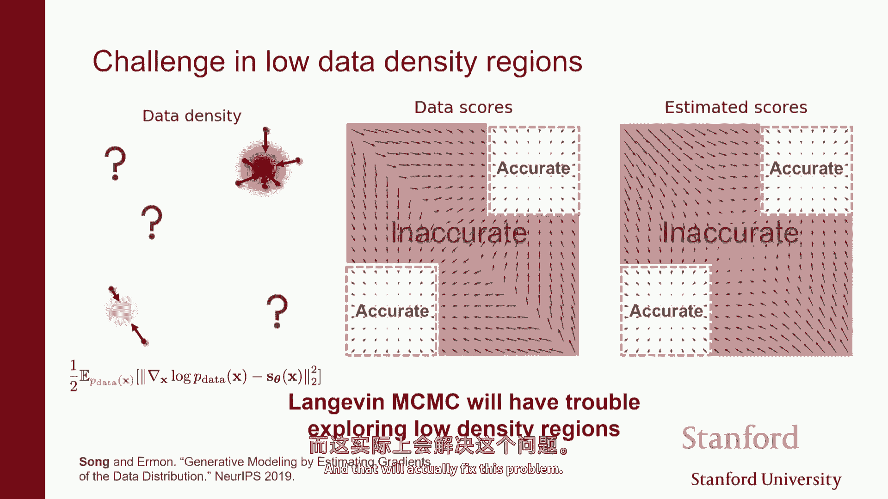
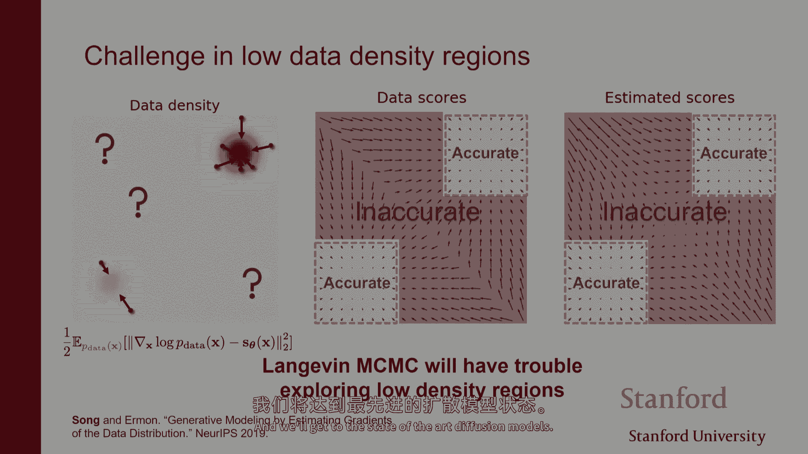

# P13：p13 Stanford CS236： Deep Generative Models I 2023 I Lecture 13 - Sc - 加加zero - BV1NjH4eYE1v

"今天我们要开始讨论基于分数的模型或扩散模型"，"我们将看到一种类似于最先进的状态。"，"图像生成模型的类"，"视频"，"演讲"，"音频"，"大量的不同类型的连续数据模式"，这是前进的方向。

"我们将看到它将建立在我们讨论的一些技术之上"，在昨天的讲座中，所以首先，你知道，这里的通常画面，嗯，有点像，我们课堂上讨论的主题概述，我们谈论了很多种模型家族，我们已经看到了两种主要的生成模型类。

我们看到了基于似然度的模型，其中基本上，你正在处理的关键对象是概率密度函数或概率质量函数，所以模型基本上就是一个函数，它接受输入，一些x，并映射到一些标量，这就是根据模型，x有多可能，我们已经看到。

概率质量函数或概率密度函数是难以建模的，因为在那里，你需要归一化，它们必须积分为一，所以我们看到一种方法是使用自回归模型，另一种方法是你的时间序列模型，但这总是限制了你可以使用的架构类型，啊，而且。

绕过这个问题的另一种方法是，有点像，放弃一些归一化的理解，并使用变分技巧来基本上评估似然度，所以我们看到了变分编码器，我们还看到了基于能量的模型，你需要处理这个归一化常数，这个归一化常数正常化概率密度。

嗯，我们已经讨论了很多技术，有点像，试图绕过你必须评估z theta的事实，也许应该避免基于概率的训练和各种能量基模型的训练方法，然后，你知道这里的优点是，你可以做最大似然估计，训练的原则是伟大的。

这是一个你可以监控的损失，你可以看到它进展如何，它是最优的，在某种意义上，你可以比较模型，但你不得不处理受限的架构，你不能插入一个任意的神经网络来模型似然。

另一种处理这个问题的方法就是简单地建模采样过程，所以这有点像一种隐式的生成模型，就像再次，我们只是描述你如何产生样本，例如，你将随机噪声通过神经网络，本质上。

你可以选择的任何神经网络作为生成器都定义了一个有效的采样程序，其他问题是，给定一个样本，给从这个网络得到的输出，评估模型生成样本的可能性，那非常困难，所以您不得不再次放弃可能性。

尽管这些模型通常工作得很好，关键问题是你不能以非常稳定的方式训练它们，您必须进行极小极大优化，这是一个问题，所以今天我们要讨论的是另一种方法，有点像表示概率分布，概率密度，嗯，这涉及到分数的处理。

这就是这些模型将要成为的，将会有，它们被称为基于分数的生成模型，而且这只是适用于概率密度函数的，所以连续类型的随机变量，但当我们处理连续随机变量时，然后我们可以开始考虑与对数密度的梯度的工作。

而不是直接处理密度本身，所以您知道我们在基于似然度的模型中见过，你通常应该与x的p以及基于分数的模型一起工作，你工作的对象是对数密度的梯度，并且梯度再次是关于输入的，它不是关于你模型参数的。

那就是得分函数，我们在之前的讲座中见过这个，但基本上是想法是它提供了一种替代，对概率密度函数的另一种解释，你可以把pdf视为一个将每个点映射到一个标量的函数，这是一个非负的函数。

所以你可以把它看作是在某种表面上的高度，这种表面跨越了两个二维空间，在这种情况下，它是两个高斯分布的混合，并且得分仅仅是一个向量值函数，在每个点上，它都给你对自然对数密度的梯度。

所以它是这样的一种像向量场一样的东西，或者每个点上你获得，箭头告诉你，你应该跟随哪个方向，如果你想要最快地增加对数似然，这些两个就像是等效的视图，所以，如果你再次喜欢使用与物理学的类比。

这就有点像用电势或电场来描述物理系统，它们有点像一样，但从计算角度来看，这可能是有利的，因为我们将看到如何与一个或另一个工作，嗯，特别是在，有点像我们在这门课程中谈论的主要挑战，当建模概率密度函数时。

你需要确保这些pdfs是归一化的，你差不多需要，需要找出一种参数化曲线的方法，理想上是灵活的，并且说它们可以具有任意形状，随着它们的改变，或者尽可能复杂，形状可以通过改变神经网络的参数得到。

但你需要确保曲线的总面积是固定的，它是等于一的，所以你有一个归一化的对象，或者一种计算曲线下任意参数选择面积的方法，这可能是棘手的，正如我们所见，通常这意味着你需要选择非常特定的架构，允许你。

基本上要么保证曲线下的面积是一等于，或者在正则化流中，你不能高效地计算它，现在，如果你考虑得分在1衰减，得分只是，这是梯度是，作为函数在log函数上的导数，你看在左边和右边的函数，嗯。

不再需要满足任何像归一化约束这样的约束，所以，并且它可能是大大简化的像工作，你看这里，你左边有一个相对复杂的曲线，而右边的对应得分函数可能是更容易工作的，所以，像，分数模型背后的直觉是。

我们不会像使用密度一样建模数据，我们将使用得分来建模数据，所以，那就是我们将使用的对象来，来定义我们的模型家族，嗯，我们已经看到，这在能量基模型的背景下是有用的。

能量基模型是一种定义非常灵活的概率密度函数的方式，通过说，好吧，我将选择一个任意的神经网络，我将使它非负，然后，我将通过除以，某种方式计算曲线的总面积，然后除以数字来归一化，得到有效的概率密度函数。

超级灵活，问题是，如果你想要评估某种似然度，涉及到对日志分布的计算，所以，如果你想要进行最大似然度训练，你知道你必须通过一种方式估计分布，或者你需要进行对比性差异，这种需要你从模型中采样的事情。

这是昂贵的，另一方面，这是你不想做的，另一方面，我们看到的是，我们可以通过匹配来训练基于能量的模型，而不是尝试使用KL散度来基本匹配密度比，我们可以尝试通过确保向量来拟合我们的基于能量的模型。

与梯度向量场相对应的向量，所以模型的得分匹配，数据的得分分布，因此，记住这基本上是你知道的费舍尔散度，我们通过积分部分完成了这个，我们成功地将目标函数重写为基本上只涉及，得分的。

正如我们在上一堂课中所见，不需要你计算分部函数，所以这里的核心，嗯，在这里需要注意的关键点是得分函数，对数密度的梯度，根据模型，当你对ebm取对数时，你得到你的神经网络，然后你得到分部函数关键地。

日志分区函数不依赖于x，对于每个点都是一样的，它就是曲线下方的面积，所以不管你在哪里，曲线下方都是一样的，所以当你以x为变量对函数求导时，那就是零，所以我们可以以原始能量来计算这个模型得分，模型的。

所以在这个表达式这里，我们可以基本上高效地计算这个术语，而不必处理归一化常数，嗯，所以我们有这种表达式，如果你想为基于能量的模型进行分数匹配，你有那个损失。

你可以从理论上优化并尝试最小化为theta作为函数的函数，嗯，你现在可能会问，我的意思是，我们可以只做基于能量的模型的分数匹配吗，如果仔细想想，嗯，你知道这是一种，如果你看损失，它是任何模型家族如。

只要你能计算这个梯度，根据模型，关于x对对数密度的，然后你可以做分数匹配，你可以通过最小化费舍尔散度来训练模型，所以，特别是哪种其他类型的模型家族，我们可以如何有效地应用分数匹配。

我们当然可以应用它到连续自回归模型上，如果你能计算对数密度，你可能可以使用通过那个来微分并计算得分，你可以在归一化流模型上做它，再次，我们可以计算对数似然，所以，我们也可以计算得分。

尽管这可能没有很大的意义，因为你有对数似然的访问，所以你可能最好通过最大似然来训练这些模型，但在原则上，你可以应用分数匹配到这些模型上，你也可以用这种方式训练它们，但你也可以 wonder，我的意思是。

我们最一般的模型家族是什么，我们可以使用分数匹配来训练它，你可以想，虽然你可以当然应用它到自回归模型上，到流模型上，你可以认为abbms是一种一般化，你知道，自回归模型和流模型是abbms的特定种类。

因为分布的归一化是肯定的，但或许还有更大的，像我们甚至可以优化过一个更广泛的集合，模式家族，这就是分数模型背后的想法，像不像我们不再模型能量啊，我们基本上直接模型得分函数，所以我们会定义我们的模型家族。

通过定义基本上指定对应的梯度向量场，所以模型不会是似然，模型不会是能量，模型会是一个向量值函数或一组向量值函数，随着数据的变化，你改变你的神经网络，你会得到不同向量场，这就是我们要用来描述。

基本上我们想要拟合的分布集的，我们通常以这种方式拟合数据分布，所以，基本上那个，与ebm的不同之处在于，那是否我们不必一定建模能量，然后取它的梯度，相反，我们将直接考虑我们可以得到的不同种类的向量场。

我们可以使用神经网络进行参数化，在这种情况下，神经网络对于每个x都是向量值函数，作为theta，在那个点的估计得分是一个与输入相同维数的向量，所以当theta实际上是从rd到rd的函数时。

所以如果你有d维，这个神经网络的输出也将有d维，因为，你知道，这就是，无论你需要指定多少坐标，嗯，在每个点都有一个箭头，所以这就是基本上的，这种非常高级的，嗯，故事在这里，像往常一样。

你知道我们想要拟合数据密度的模型，所以有一个真正的底层数据密度，但我们不知道，我们假设我们有访问大量来自数据密度的样本，然后，我们要尝试做的事情是，我们要尝试找到，嗯，一些，在我们的模型家族中的功能。

所以我们要尝试选择参数theta，或者我们试图选择一些梯度向量场，它应该是尽可能接近原始数据密度的梯度向量场的，所以这将是学习的目标，并尝试选择参数theta。

使得我们得到的对应函数向量值函数与真实数据密度的梯度向量场匹配，使从稀疏样本计算的梯度尽可能接近我们数据的底层分布，是的，所以这是一个很好的问题，我的意思是我们只有样本的访问权。

所以我们没有访问真实密度的权，所以，我们永远不会能够完美地做到这一点，而且在某种程度上，这是一个学习问题，你知道，我们只有样本的访问权，所以，我们需要确保我们不过拟合，我们需要确保你知道。

存在一些限制我们如何能做到这一点，但是，你知道你有同样的问题，即使你有一个，如果你通过最大似然进行训练，如果训练数据集足够大，你可能可以找到一个很好的模型，但是，即使你的训练数据集足够大。

你也无法保证找到最佳模型，你知道你只被给了样本，你可以尝试尽可能地接近经验数据的分布，希望通过拟合样本，你也在拟合真正的底层数据密度，所以从某种意义上说，我们将面临同样的问题，即我们只有样本。

我们只有有限的数据，但主要的区别是，而不是试图拟合一个，这个给我们提供似然度的标量函数，我们将尝试拟合这个向量值函数，它给我们提供的是，对自然对数似然度的梯度，本质上，是的，类似于那种构建，但是像这样。

例如，在这里我们有像两个簇一样的东西，对，但是在嗯像，但是你想要一个模型能够预测，甚至在分数精度边界的种类中，所有这些事情，但是嗯，这不是已经够多的问题了吗，像嗯，我知道你说可以，即使你在追求可能性。

没问题，但当你在追求可能性时，你，你基本上在合理的范围内，如果你试图推pmf，像你的样本在这里差不多准确那样，你基本上是在学习像，好的，我在这里有一些数据，我没有其他数据，还有一些像达利和，尽管如此。

人们似乎期待能学到一些，是的，所以我认为在两种情况下都是一个难题，就像我会说的那样，即使你使用似然度工作，你知道你不仅仅是想要围绕训练数据放置概率质量，因为你想要模型能够泛化到，你知道，未见的数据。

希望它来自与你用于训练相同的分布，但你不想仅仅拟合，你知道的训练分布，对吧，如果你正在对一个图像训练集的模型进行拟合，你不仅不想在训练集中的图像上集中概率质量，你想要分散它，你需要能够说。

或者我需要在其他的空间部分放置概率质量，即使我在训练期间没有见过它们，所以我们在某种程度上有类似的问题，有点像梯度和函数本质上是相同的东西，所以如果你有梯度，你可以积分它，并且你可以获取到这个函数。

因为所有的东西都必须被归一化，所以你知道那个，我的意思是你可以获取到这个，这个函数可以到一个常数，并且我们知道这个常数的值需要等于什么，因为它必须被归一化，所以从某种意义上来说，它就和原始问题一样难。

涉及到过拟合，就过拟合而言，我认为在这个方面会比我们看到的其他模型更强，我认为在这个右侧会比我们看到的其他模型更强，因为对我来说，它取决于你使用的损失函数，嗯，我们看看。

在训练过程中会出现一些非常特定的问题，由鱼者散度使它成为可能的，所以，就像做这些事情一样，这种 vanilla 或者像的方法并不完全有效，我们需要做很多事情才能在实践中实际使其工作，但到目前为止。

它更像是到这里，我只是说，它将是一种不同的对模型类型的表示，我们愿意考虑，甚至都没有说，我们如何进行训练，我们如何防止过拟合，而且等等，我只是在思考，能量基模型的情况，不是一般的。

更像是一种正方形匹配的模型，但是嗯，从我的理解，如果你在使用基于的，比如似然度，你根本不估计能量或分部，你只看分数，而且，那不是一种泛化吗，所以想法是潜在的，你模型中向量场可能不是标量函数的梯度。

所以它可能不一定是保守向量场，所以你可以想象这里，如果你这样做，θF是一个标量函数，这有点像，势能，如果你从物理学的角度考虑，就像这里有一个势能，甚至是电势能，这是一个标量。

你通过取那个的梯度来获取向量场，所以它是一种参数化向量场的方式，他们需要满足某种类型的属性，因为他们在这里是标量函数的梯度，我的意思是，哦，我甚至不再限制自己于标量函数的梯度。

我允许自己只是具有任意向量场的情况，可能没有 underlying 的标量函数，使得这个向量场是该函数的梯度，所以我们只是在建模原始的梯度，我们没有确切的功能参数，所以基于这个问题的是。

如果在基于能量的模型中我们试图建模，我们仍然试图直接建模，像似然度，与这里我们直接建模得分一样，是的，这些是梯度，是的，哦，我们似乎错过了什么，或者是不是 technically 不在 pm 中。

因为你甚至没有得到，是的，没有归一化常数，并且似然度来自一个积分，因为存在隐变量，这不直接适合这里，我的意思是，我想我只是在好奇，像似乎有一些语义上的重叠，像，我们为什么称这个为得分，而不是只是梯度。

为什么我们有不同的词汇做同样的事情，嗯，他们之所以被称为得分，是因为原因，这是因为在文献中它们被称为得分，并且人们使用得分匹配来计算损失，被称为 Fisher 得分，并且 uh。

这就是我们选择那个名称的原因，是的，查看梯度的成本是多少，因为如果什么都没有，那么你就可以只看第二导数，第三我可以继续添加，是的，虽然我还没有看到它被这样做过，但在原则上，你可能潜在地查看。

也许它会太高维或太复杂，但你可以，梯度是关于一个的，生成器，是的，所以我要谈谈如何进行推理，如何进行采样，以及我想回到这些类型的事情，当你首先谈论分数匹配时，就像我们为什么选择平方匹配一样。

这会导致两个完全相同的，或只是到这个分布，就像研讨会那样，是为小匹配设计的，如果我们思考它，它实际上是pdf的梯度，是的，没错，然后我们进行积分，但关于它必须积分到一的常数项呢，因为它是一个密度函数。

所以如果你积分一个函数，是的，当你积分时，你会得到函数到常数的值，并且这个常数必须被，是由事实决定的，即pdf的积分必须等于一，所以一般来说，当你从一个函数转换到导数时，你会失去关于移动的信息。

基本上因为你你不能恢复，你知道的，如果你取一个函数并移动它一个常数，它们将都有相同的导数，对吧，所以看起来你失去了信息，但这里你没有，因为我们知道函数必须集成到一，酷，所以这就是大致的想法。

我们试图直接拟合分数模型到数据，所以问题是这个，你被给予来自未知数据密度的独立样本，这是通常的学习设置，一个来自未知数据分布的训练样本集，你想要尝试估计这个数据分布的分数，所以我们会考虑一个模型家族。

所以，我们将考虑一个模型家族，这将是一个由神经网络参数化的向量值函数集合，当你改变theta时，你改变向量场的形状，目标是选择参数，使得向量场相似，所以你可以想象第一个问题是，我们如何比较两个向量场。

所以将有一种像是真实梯度向量场的东西，对应于数据密度，将有一个估计的梯度向量场，我们如何合理地比较它们，这基本上是在每个点上重叠这两个向量场，将存在真正的梯度，估计的梯度。

我们可以看这两个之间的差异并平均，在整个空间中，如果你这样做，你将返回那里，我们之前谈论的Fisher散度，所以如果你遍历每个x，你看那个点的真实梯度，根据数据密度，你在那个点看估计的梯度，根据模型。

会有一些差异，你看那个向量的范数，那就是一个标量值，告诉你有多远，你的模型离数据分布的真实向量场有多远，所以如果你能把这个量作为函数中的θ来逼近零，那么你就知道向量场匹配，"并且你有一个完美的模型"。

"因此，试图将此函数最小化为theta是一个合理的学习目标"，"我们知道，尽管它看起来像是你无法可能优化的东西"，"因为它取决于这个未知的量"，"在此回忆"，我们只有有样本的访问权限。

"我们可以使用分部积分的方法"，"你可以将其重写为客观的术语"，"那完全取决于你的模型"，"这仍然涉及到对数据的一种期望"，但是嗯，你知道，你可以使用样本平均来近似，所以为了训练这种模型。

你需要能够高效地评估数据，嗯，我们需要，某种方式，你知道，能够计算这个雅可比矩阵的迹，这基本上就是所有部分导数的和，然后，我们有一个问题，我们是否需要这个核心模型才能被视为正确的，嗯。

以对应某个能量函数的梯度，我们将看到，实际上这不真的需要一个新的实践，所以，参数化得分的最直接方式可能是，只是选择在神经网络中的值向量，所以假设你有三个输入和三个输出，因为我们知道在每个点。

这个神经网络需要估计梯度，它是一个与输入相同维度的向量，然后，我们需要能够基本上评估这个损失，这涉及到神经网络输出的范数，和雅可比矩阵的迹，所以，要评估第一个术语，也就是输出的范数，很容易，基本上。

你所做的就是你做一个前向传播，然后，你就可以计算作为theta，然后，你也可以计算出方差作为theta，更复杂的部分是雅可比矩阵的迹，所以，雅可比矩阵基本上就是这个矩阵，你在其中基本上有所有偏导数。

或者所有输出的梯度，相对于输入，这里的第一个术语是第一个输出对第一个输入的偏导数，然后，你知道，你有所有这些偏导数，你需要处理的，问题是，你知道我们正在尝试计算这个矩阵的迹。

这基本上就是主对角线的元素之和，所以你需要做的，你需要能够计算第一个输出的偏导数，相对于第一个输入，然后你需要计算这里主对角线上的元素，你需要计算第二个输出的偏导数相对于第二个输入。

然后你需要计算第三个输出的偏导数，相对于第三个输入，然后你需要将这些三个数字相加，"因为你需要加总这个矩阵对角线的这三个元素"，"尽管你知道我们可以进行反向传播"，"所以你可以相对高效地计算这些导数"。

嗯，天真地，"做这件事需要一系列反向传播步骤，这些步骤的规模线性增长。"，"基于你有的维度数量"，"而且我们不知道是否有一种更有效的方法基本上来做这件事"，"但是。

我们基本上只知道如何做这件事的方法是"，"当维度数量和规模都非常大时，基本上极其效率低下。"，因此，尽管这个损失不涉及分部函数，但它仍然与数据的维数成比例地增长得很慢，ebms有同样的问题吗。

像我们也需要计算树，是的，因此，ebms甚至更糟，因为在ebm中，你需要做一次额外的后向传播来获取得分，然后还需要一次来获取这些导数，因此，ibm甚至甚至更昂贵，这些是列表，它节省了一次后向传播。

因为你已经在建模某个东西的梯度，但它仍然昂贵，是的，我在ebm中引入了f theta，是的，所以你有f theta的hessian，当你以x关于f theta的梯度取第一阶时。

你基本上得到s theta，然后你有s theta的雅可比矩阵，因此，你需要做二次，基本上在那个情况下的导数，所以它甚至更昂贵，在输入和输出维度上，输入和输出维度必须相同或不同，它们必须相同在这里。

因为它们在模型得分，which is，嗯，反向，对对数似然度的梯度，因此，它的维度必须与您输入的维度相同，哦，我想，是的，你试图与梯度匹配，所以然后，是的，好的，嗯，那么这个方法。

只处理具有相同维度的数据，对，因为我们正在尝试，嗯，基本上比较每个点的单词，对，所以我们不能处理与相同图像具有相同数据的，数据，是的，所以这就是一个，是的，这是我们正在模型和联合分布过的一组随机变量的。

并且如果其中一些缺失，嗯，计算边际可能会很昂贵，是的，酷，所以这是一版基础的，这是我们在上一节课中短暂提到的，如果你记得，我们说，好的，这是一个声音，分部函数，但是使用部分积分仍然很昂贵啊。

因为这个激情项或这个雅各比矩阵的迹在这个情况下，所以我们需要更可扩展的近似方法，它们在高维中工作，这就是我们接下来要谈论的，这是如何将这个扩展到高维设置，其中d很大，我们即将讨论两种方法。

第一种被称为去噪得分匹配，想法是，而不是尝试估计数据的梯度，我们将尝试估计数据的梯度，扰动噪声，你可以想象，可能有一个数据分布看起来像这样，然后有一个扰动的数据分布，用橙色表示，标记为q sigma。

我们基本上只是在数据上添加噪声，卷积，在这种情况下，就像数据的密度一样，使用噪声分布，q sigma给定x的x tilde，这可能是像高斯一样的，在这种情况下。

我们实际上是通过添加噪声来平滑原始数据密度，结果，如果你估计这个分布的得分，在添加噪声后的分布，计算上要容易得多，因此，到你选择噪声水平相对较小的程度，这可能是一个合理的近似，所以像。

如果你没有添加太多的噪声，那么这个黄色的密度将非常接近蓝色的一个，所以你估计的黄色密度，扰动的密度，将与你想要的相当接近，嗯，所以，因为基本上q sigma将非常接近原始数据密度，当sigma很小时。

这就是基本想法，所以工作像这样，"你的数据密度可能超过图像"，"然后，使用高斯核q sigma对图像添加噪声。"，"然后，你会得到一个包含图像的新分布，再加上噪声。"，"我们试图估计那个的分数"，"嗯。

而且"，"方式"，"我们将尝试将我们的模型拟合到这个噪声扰动的数据密度上。"，"使用费舍尔散度"，"但现在不再使用模型和数据之间的鱼者差异"，我们计算模型与噪声扰动的数据密度之间的费舍尔散度。

所以和以前是一样的，只不过我们替换了p数据为qsigma，这相当于数据加上噪声，基本上，然后嗯，这仅仅是这个，所以嗯，预期的就是这個對qsigma的積分，所以像以前一樣。

它只是估计梯度與真實梯度之間差的范數，除了现在，我们不再使用真实数据密度，我们使用qsigma，这是噪声扰动的数据密度，然后嗯，我们做的就像当我们在做积分分部时一样，所以我们展开平方并得到三个项。

我们得到这个范数，第一个项的范数，第二个项的范数，然后我们有这个 uh 两个部分的内积，红色的术语uh，这将是一个复杂的一个，基本上就像在积分部分中一样，一种技巧，你可以看到。

蓝色的术语不依赖于theta，所以我们可以忽略它，绿色的术语以容易的方式依赖于theta，所以是，你知道，它基本上就是平时的事情，并且复杂的一件是红色的那一件。

在我们有噪音数据得分和估计得分之间的顶级产品这里，是的，你正在描述你从一开始就是如何的，你只知道你做过的事情，是的，所以q被定义为一个，是的，基本上你可以从q sigma中获取一个样本。

通过从数据中随机抽取，随机抽取一些高斯噪声，并将其添加到数据中，所以，其他问题，是的，这个队列给我们带来什么像什么，什么，什么，什么，我们实现什么正确，所以我们实现，这将是可追踪的，在意义上。

因为我们将消除那个雅可比术语的踪迹，所以我们将得到一个损失函数，这将在高维中可扩展，所以这就是，我们做这个，因为雅可比术语的踪迹太昂贵了，这引入了一个近似，因为你不再估计数据的密度得分。

或估计这个其他东西的得分，但结果是我们可以更有效地做到它，是的，难道不是这样，创建一些仍然依赖于它对x的梯度的东西吗，是的，看起来确实如此，但后来发现有一个。

我们将看到它实际上简化为某种非常直观和非常简单的形式，我们将，它将将这个问题减少到去噪，所以基本上这个得分匹配的目标函数，最终将等同于给定x tilde的问题，尝试去除噪声并尝试估计你开始时的原始图像。

基本上它将是数学上等价的，基本上我们将重新写这个红色术语为一些和，我的鼠标在哪里，我们将以某种方式重新写这个红色术语，并展示它将等价于去噪，哦是的，我们忽略蓝色术语，它不依赖于theta。

我们有这个绿色术语，很容易，然后我们有这个红色术语，很棘手，但我们将重新写它，所以专注于正确的术语，看起来像这样，嗯，就像在积分分部中一样，一种技巧，我们可以写对数函数的梯度为对数函数的论据分之一时。

对数论据的梯度的梯度，这是基本的，我只是基本上扩展了log q sigma的梯度，现在你可以看到这里和这里的q sigma，将与彼此抵消，因此我们最终会得到一些稍微简单的东西，它就是点积，基本上在。

被严重扰动的密度的梯度，和每个点的梯度和得分模型之间，现在我们可以写q sigma的表达式，这就是这个，嗯，这个积分，基本上，任何特定sigma x tilde的概率将是，采样任何数据点x次时的概率。

通过向x添加噪声生成x tilde的概率，基本上，这就是如果你考虑采样过程，生成x tilde的概率是什么，你必须考虑所有可能的x，并且你必须检查，通过向x添加噪声生成x tilde的概率是多少。

这就是这个积分在这里给你的基本概念，这只是我们在上一张幻灯片中定义的q sigma，现在我们可以看到，这是可线性的，因此我们可以将梯度推入积分，这就是事情变得简单的地方，因为现在您看到。

我们现在正在获取一个关于，嗯，基本上这个高斯密度的梯度，我们不再需要处理数据密度的梯度基本上，现在，我们可以进一步，你知道，推出，嗯，好吧，现在，我们可以再次使用这里的技巧。

即对数q的梯度的一除以q乘以q的梯度，我们可以重新写为高斯密度过渡的梯度，为q乘以对数q的梯度，如果你对对数q取梯度，你将得到q乘以1减去q的梯度，所以这两件事显然是相同的，现在您将期望值推出去。

我们基本上有一个看起来非常像我们开始时的原始表达式的表达式，但我们不再需要处理这个对数数据密度扰动的梯度，但我们必须看看这个给定x的x tilde条件分布的梯度，这就是高斯，一个高斯密度，所以总的来说。

基本上，我们在这里将复杂的对象重写了，使其稍微简单一些，因为现在它只涉及梯度，它基本上涉及给定x的q sigma的x tilde的得分，这将只是正态分布，所以将它们结合起来。

这就是我们开始估计数据被噪声扰动时的得分的地方，我们知道你可以，你可以这样写，并通过我们刚刚做的代数，我们也可以重写红色项，啊，就关于这个，现在你可以，嗯，基本上可以看到本质上，嗯，你知道。

你可以把它写成s theta的平方差，和这里我们有的这个高斯过渡核的梯度，因为那样会给我们，当你将这个术语的平方，它将给你红色的那个，嗯，这是成绩，这个术语的平方会给你棕色的术语，那个，然后我们减去。

然后这两个的点积正好是我们刚才得到的红色术语，所以总的来说，基本上，嗯，我们展示的是，如果你想要估计qsigma的得分，扰动噪声的数据密度，基本上相当于试图估计这个过渡核的得分。

我们在不同轴上添加噪声使用的高斯密度，并且从噪声分布中采样的不同轴仍然这样做，所以很多代数，但基本上嗯，直到常数，我们可以重写噪声扰动数据密度的得分匹配目标，扰动噪声的数据密度。

进入一个新的分数匹配目标，这个目标现在涉及到一些相对容易处理的术语，特别是，嗯，如果你看看这个表达式啊，你会发现这个对数q sigma x的梯度，即使给定的x也很容易计算，因为那就是一个高斯。

所以q sigma x tilde given x就是一个高斯，具有均值x和标准差和和和方差sigma squared，身份，你知道那就是，你知道，平方指数，当你取对数时，它就变成了二次形式。

当你取梯度时，你只是得到一个相对基本的表达式，看起来像这样，所以当你将这个表达式插入到这里时，嗯，你会得到一些东西，嗯，嗯，易于处理，嗯，我可能没有在这里，但是嗯，基本上你最终会得到一个目标函数，嗯。

不再涉及雅可比矩阵的迹，它类似于L2损失之间的一个tilde，S作为theta，与这个x tilde减去x除以x除以sigma squared相比，这基本上是一个去噪目标函数。

正如我们在接下来的几页中看到的，所以这里的关键要点是，你不再需要估计，嗯，雅可比矩阵的迹 anymore，如果你愿意估计得分，不是干净的数据，但如果你要估计这个q sigma的分数，这是数据加上噪声。

所以实际上的算法是这样的，嗯你有一个mini batch的数据点从数据中采样，你扰动这些数据点通过添加高斯噪声，所以实际上就是给每个xi添加噪声，与uh方差sigma squared，然后嗯。

你只是估计去噪得分匹配损失，这是基于mini batch的，这是基于这些数据点的损失，它只是，它基本上就是这个表达式，记住那个，你知道，如果这个q sigma是正态的，那么损失看起来像这样。

所以它有一种非常直观的解释，因为我们说的是，每个数据点，x tilde，分数模型都需要做什么，X tilde，所以分数模型在这个噪声数据点x tilde上进行评估，对于每个数据点，分数模型试图做什么。

它是试图估计添加到xi的噪声以产生xtilde的大小，限制于，像有多吵，像是你知道，标准说的大小，这里的sigma，我们试图在这里添加一些原始噪声，是的，所以你希望sigma尽可能小。

因为你希望qsigma尽可能接近p数据，另一方面，这些法律的方差ah趋于无穷大，当sigma趋于零时，所以你实际上不能选择sigma太小，因此在实际应用中，你需要尝试选择sigma尽可能小。

使得损失仍然能够优化，嗯，但是总是存在一种近似，这就是你没有的权衡，你知道海森堡矩阵或者雅可比矩阵的迹了吗，但你不再估计，清洁数据的得分，你正在估计噪声数据的得分，我通过其他方式理解好。

但这里我们获得的收益是消除了，导数得分的迹，因为我们知道噪声的闭合形式来摆脱，是的，是的，我们不再估计，我的意思是我们在改变目标线，我们不再估计，你可以把这个看作是基本数值逼近。

在某种意义上像我们在添加高斯噪声，我们试图通过这种方式估计导数，有点像有限差分，这样的东西，基本上这就是，那就是一个，得到同一结果的一种方法，如果你喜欢这种近似路线，它具有基本上通过扰动估计导数的味道。

嗯，为什么它是噪声分数匹配，因为嗯，我们在哪里与一个，我们在哪里匹配到一个扰动的数据点，对，这如何帮助减少噪声，所以如果你思考什么是，什么是，嗯，当损失为零时是什么时候，也许我在下一张幻灯片上有它。

嗯是的，所以如果你思考它，你知道损失函数看起来像这样，原始的损失函数是这样的，然后我们能够把它重写为这样，所以你在做什么，你开始以一个干净的图像，然后添加噪声生成x tilde，然后看看这个损失。

我们正在说，分数模型以x still作为输入，为了使l two损失尽可能小，你试图匹配这个x minus x tilde，这正是我们添加的噪声，所以为了使这个损失尽可能小。

S theta必须匹配我们添加到这个图像上的噪声向量，这就是为什么它是去噪器，因为它看到了x tilde，它需要找出我应该从x tilde中减去什么，以获取一个干净的图像，尽管我们不直接比较原始图像。

我们仍然成功地，那是，那被称为时间偏置风险估计器，那是，那是关键技巧被使用的，你可以仍然评估估计器的质量，而不实际知道真相，在某种程度上，是的，所以你理解正确，优化中的基本未知主要是头部。

你基本上有dx dx tilde，sigma是所有其他的一切，除了锚点，对吧，是的，所以轴和x tilde，你自己生成它们，但是，因为theta看不到干净的数据，所以x theta只能看到噪声数据。

你试图预测噪声，是的，是的，所以嗯，是的，就像我们添加了这个高斯分布扰动后，驴子试图基本上匹配那个高斯噪声分布的梯度，但训练目标是这个得分函数，应该是原始数据分布宽度的梯度。

所以它说这种趋势与原始目标偏离，例如，如果我们不使用分布中的文化来添加视觉，如果我们使用另一种噪声分布，那基本上改变损失函数为as和to成为一个不同的，正如正在发生的事情，你可以，是的，是的。

所以它不局限于高斯噪声，如，如果你看数学，你需要能够计算的只有这，嗯，基本上只要这个的梯度，你添加噪声的分布，你可以计算似然度，并且你可以得到封闭形式的梯度，然后你可以得到针对该的分布去噪损失。

你最终将估计，像我们估计q sigma的得分一样，是哪，嗯，如果你添加高斯噪声，将是基本上数据加上高斯噪声，如果你添加另一种干扰，你将得到另一种类型的数据，干扰数据，你在估计那个的分数，所以你的。

你的是，你说得对，像我们不是估计清洁数据密度的得分，我们估计的是数据加上噪声的得分，希望的是你需要添加一点，只需要一点噪声，所以这种像，如果sigma足够小，这些图像看起来完全一样，与清洁的毫无区别。

那么近似就不太坏，我们做这件事所获得的好处是它大大扩展了规模，因为感觉上，嗯，不像是收敛到清洁数据加上噪声的分布，它给我一种感觉，我们是收敛到噪声函数的分布，不是的，这是关键，所以你仍然是如果这两个。

尽管我的意思是，这就是匹配中的去噪魔法的魅力，基本上这两个目标等价，直到一个常数，所以通过最小化去噪的下一个，你实际上也在最小化顶部的目标，在那里你实际上是估计数据的，分布与基本与高斯卷积的分数。

或数据的平滑版本密度，尽管你可以只在个体条件的水平上工作，这就是这种去噪分数矩阵的美丽，也许退一步看看，这种方法的基本前提是，它更容易建模，然后回到梯度领域的基本，然后直接概率分布右侧，是的。

另一种说法可能是，去噪并不是一个太难的问题，所以我们有相当好的神经网络可以做去噪，因此，在某种程度上，我们已经将生成图像的问题减少为去噪问题，这对于神经网络来说是一个相对容易的任务，"因此。

只要你能做到很好地否认"，"你在估计分数方面会做得很好"，"我们知道，得分基本上在某种程度上相当于有某种可能性"，"所以，我们还没有讨论过如何从这些模型中实际生成样本。"，但实际上，我们会做mc mc。

"因此，在所有步骤之后，我们将生成性模型简化为去噪"，"这是一个容易的任务"，"可能这是你能想到的最容易的任务之一，就像一个大的"，这是否像所有匹配的点，"就像获取梯度"，结果是这个嘈杂的目标。

就像边距，是这个检查你的经验，有一些需要理解的底层东西，因为它不需要作为选项，只要机器像是的，基本上只要你能计算这个，嗯，你使用的噪声分布梯度的什么，数学计算正确，如果你想想在证明中发生了什么。

真正重要的是梯度必须是线性的且很好的，梯度是一个线性算子，因此整个机器都能正常工作，所以嗯我正在看关于优化目标的估计，所以如果我们在做最优优化，得分函数应该接近噪声过，像除以我们选择的标准差。

它应该也接近实际q的梯度，所以我们声称扰动，扰动的梯度，嗯，图像应该类似于噪声，所以让我们假设在到什么程度上这是真的，所以我们看到，分数匹配减少到去噪，所以估计分数就是估计添加到数据点的噪声。

所以这是为什么这是真的，或者另一种思考方式是，有一种叫做 tweeds 公式，这基本上是一种替代方式，用于得到相同的结果，这有点像是，它告诉你，确实像，像你建议的那样，最佳去噪策略是。

基本上跟随扰动后对数似然度的梯度，所以你可以想象，如果你有一个数据密度，它只有三张图像，所以它有点像三个delta，这有点像一个像玩具的图片，但只是为了可视化目的，你可以想象。

如果你对这些三张图像添加噪声，你将得到一个看起来像这样的密度，然后你可以想象，让我们说，你在尝试去噪，我们刚刚显示的，是去噪的最佳方式是跟随梯度，如果有人给你一个左在这里的数据点，你应该如何去噪它。

你应该跟随梯度，试图向高概率区域移动，这 makes sense，尝试去噪，尝试改变图像并推向高概率区域，实际上，最佳去噪策略是取噪声样本并跟随一步，我的意思加上适当的缩放。

但基本上跟随扰动后对数数据的梯度，这是基于假设噪声的期望是零的，或者类似的，如什么，我的意思，必须有一些，所以像你说的，必须真的很必须，它必须像某种，嗯，限制在其他地方，因为我可以考虑噪声的来源。

和梯度可能不在我的控制范围内，嗯，所以，这个去噪匹配的结果，嗯，仍然成立，嗯，这个好处是什么，高斯是，嗯，以下，嗯，也许这将澄清，所以本质上你可以看的是，你知道有数据清洁的数据，然后有嘈杂的数据。

然后有清洁数据的后验分布，给定嘈杂的数据，你知道，我们了解嘈杂数据分布的定义，基本上推文这个公式在告诉你一个，预期的，嗯，给定嘈杂的图像x，清洁图像的期望值由这个表达式给出，所以如果你想最小化l2损失。

你做的最好的事情是输出给定x的条件期望，给定x约等于，从那个角度来看，你想要跟随梯度，这个特定版本的公式仅对高斯有效，你只给它噪声，直到那个噪声，如果你保持噪声，你会想如果你继续保持噪声，你有的。

所以如果你在保持去噪，所以你在问，如果你有很多噪声，或者如果你重复这个过程，他们只是，你开始有很多噪声，然后只是继续添加噪声，是的，所以这就是我们从模型中采样的基本方式，所以这将很快出现。

但本质上这就是我们将如何继续跟随梯度，或者如果你一直在去噪，我们将，这将是mc在某种意义上，并且在动态中它将更大，这就是我们将产生样本的方式，如何像扩散模型，是的，酷，所以。

另一种使事情高效的方法是进行随机投影，嗯，也许软时间，所以另一个，嗯，替代方法来产生一种高效的近似，你知道，对于区域得分匹配损失，这不涉及，基本上取随机投影的雅各比元的痕迹是，所以你可以想象到最后一天。

我们试图做的事情是，我们试图匹配估计的向量场到真实的向量场，如果真实的向量，如果这些向量场确实相同，那么它们也应该相同，如果我们沿着任何方向的投影它们，所以你可以取这个方向和这个方向。

并且你可以沿着那个方向投影箭头，如果向量场相同，那么它们它们应该匹配投影应该匹配，所以特别是，如果这些投影只是轴对齐的，然后这些向量的个体成分应该匹配，想法是在工作在投影空间上会更有效率。

因为现在是一个一维问题，这就是基本上定义了一种鱼者分布的变体，我们称之为切片的鱼者分布，这正是我们之前有的，但在比较数据到模型梯度之前，我们沿着随机方向v投影它们，你随机选择一个方向v。

然后在每个数据点，你比较真实的梯度和估计的梯度沿着这个方向v，并注意在你取这个点积之后，这些是标量，所以这些不再是向量，它们是标量，你知道实际上你可以仍然做分部积分，你最终会得到一个目标函数。

它看起来像这样，它仍然涉及雅各比，但关键现在是它基本上涉及雅各比向量积，这基本上是方向导数，并且是您可以使用反向传播高效估计的东西，所以第二个术语只是通常的东西是高效的。

它就是网络的输出乘以与随机向量的点积，所以这是有效的评估的，现在我们有一个像这样的东西，我们有这个雅各比矩阵，左乘以向量v，右乘以相同的向量v，它实际上基本上这个东西就像一个方向导数。

这是您可以使用反向传播高效计算的东西，如果你想想，你知道这是我们开始的表达式，你可以等价地写为点积的梯度，这是您将计算像这样的东西，所以你有一个前向传播，它计算为theta，然后您与v进行点积。

这将给您一个标量，现在您进行一次后向传播来计算该标量的梯度，相对于所有输入，然后您进行另一个点积以获取回导数或量，因此，这可以大致在单个后向传播步骤的成本内完成，是投影操作，双射的。

我们或它是像向量点积一样，它是点积，点积，我明白了，所以v是非常精细的，v是从某些分布中采样的，嗯和嗯，让我看看我有没有在这里，所以这看起来是这样的，所以你将为每个数据点采样数据。

您将随机根据某些分布采样方向，然后您只是优化这个目标函数，正如我们看到的，它是可估计的，它不涉及雅各比矩阵的迹，您可以，您可以，在选择pv方面有很多灵活性，比如你怎么选择方向，嗯，您可以选择，例如。

高斯或拉姆克类型的向量，它们在理论上都工作，方差可以变化，但是嗯，基本上在选择这个方面有很多灵活性，随机方向，所以为什么，好的，对于这个，您可以运行一次后向传播，为什么在另一个情况下。

如果我们必须运行多个后向传播，因为您必须先计算，您必须计算每个输出相对于每个输入的偏导数，所以您需要d back props，在这里，您可以做一次，因为它基本上是一个导数的方向，是的。

是否 ever 有意义将您采样的投影偏向于某些，看起来我们尝试了很长时间，但在实践中从未看到任何差异，我没有任何结论性的说明，看起来这是一个好主意，但是从未工作得如此顺利，如果你有一个高维的。

像输出向量空间，但是然后像取决于那个输出空间的结构，像会有某些方向，在那里你有像大量的信号，然后可能还有很多其他方向，你在那里只有很少的信号，所以我已经习惯了，那就是像从高斯分布中挑选一个投影向量。

像不会很好工作，像你会得到，你知道有时候你会得到，你知道这个投影的高值，但是另一部分更大的时间你会得到一个投影，像你的信息信号非常非常低，所以我喜欢，是的，我想这种工作方式在训练或实践中是如何实现的。

是的，所以是的，基本上这些是原始目标的无偏估计器，你也可以这样想，你在引入方差，因为你在比较向量的投影，而不是完全比较向量，这是原始分数匹配损失会做的，所以这就是你基本上要付出的代价。

你可以使用方差减少技术来实际上使事情更加稳定，不同的分布，嗯，你可以做，如果你愿意付出一些计算成本，你可以对每个数据点取多个随机投影，你可以只是尝试匹配不仅仅是，不仅仅是沿着方向v1样本一个对一个。

但你可以取很多，然后平均它们，所以有自然减少方差的方法通过取更多的投影，但是然后它变得昂贵，最终如果你取n个投影，n是维度，你可以在每个坐标上进行比较，它回到原始的一个，在实际操作中。

你可以选择介于两者之间的任何一点，一个投影工作，所以是关键思想为什么这不会总是工作，嗯，哦，从不会总是工作，是因为，在每个反向传播步骤中，我们做向量积，它变得 kind of 变成了一个滑翔伞，是的。

是的，确实，是的，我们无需担心噪声就能进行所有这些投影，在这里没有噪声，是的，所以这，这个的优势是，实际上你在估计数据的密度得分，与数据密度加噪声相比，是的，而且，是的，这里有一些图表。

展示了如果你做基本的分数匹配，迭代时间与数据维度的关系如何，你知道它可以达到三四百维，然后你耗尽内存，这是大约几年前，但它与维度线性扩展不太好，如果你有切片版本，它们基本上与数据维度无关。

在模型质量方面，它实际上并不重要，这张图的意思是什么，但它有点像你使用分数匹配匹配的切片版本时得到的结果，基本上你会得到与精确分数匹配的结果，现在我想要谈论的最后一件事实际上是，我们如何进行推理。

我们如何生成样本，比如，假设我们 somehow 能够提问，是的，我对这个问题还有一个问题，就像基本上创建标量，然后做一次背景，类似，你为什么要用随机向量来做这个，而不是用，类似，只是一个标量。

与对应的向量的乘积，所以你预测了这个梯度，对，并且你知道基本上实际梯度的梯度，梯度，但我们不是取了像l2范数那样的吗，是的，所以您仍然需要使用积分部分技巧，所以这一项您不知道。

所以原始的损失基本上在每个x处都会取，您取真梯度的点积，估计的梯度，然后您平方差异，这还是，您不能评估这个损失因为它取决于真梯度，你并不知道的，但是然后你可以使用部分积分来重新写它，写成这个东西。

这有点像我们之前有的，它不再依赖于真实分数，是的，酷，所以，我想讨论的是如何进行采样，所以假设你 somehow 使用了真实的，比如 vanilla 分数匹配或 dinoscore 匹配。

或切片分数匹配，并且你能够训练你的神经网络作为 theta，所以，估计的梯度向量场接近真实的梯度向量场，数据密度的，问题是，你怎么使用这个，你不再有一个似然度，没有自回归类型的生成，你怎么生成样本。

所以，直觉是，分数基本上告诉你，你应该在哪个方向上扰动一个样本，以增加其似然度最迅速，所以你可以想象一个基本的程序，其中 mccmc，类似于我们之前讨论的程序，其中你初始化粒子在随机处。

我在这里显示多个粒子，但你可以想象从某个初始分布采样 x 零，然后你可以想象重复地，基本上采取这个更新，你基本上是朝着估计的梯度方向走，你只是使用估计的分数来确定方向，如果你这样做。

你将会得到类似于这样的东西，你知道粒子们会收敛到这个局部最优点，局部最大值，希望是这个密度的，它基本上是，你可以想象你从随机噪声开始，这是一张只包含噪声的图像，然后跟随梯度。

直到你达到无法再改进的局部最优点，我们知道这不是生成样本的正确方式，生成样本的正确方式是跟随噪声梯度，这就是为什么我们叫 lain mccmc，这正好是同一个程序。

除了在每个步骤中我们还添加一些高斯噪声，如果你这样做，你将看到实际上会生成，如果你运行它足够长，这个程序被保证会产生来自底层密度的样本，记住，这个向量场对应于一个密度，其中我们有大量的概率质量在这里。

在这里有大量的概率质量，确实，如果你看这些粒子的分布，它们，将会有正确的分布，因为，我们所看到的，是，这种懒散的动态采样在极限下是有效的mcmc程序，所以它是一种从密度中采样的方法，当你只有分数访问时。

所以我们知道，如果你初始化你的粒子，它不 matter你怎么做，然后重复这个过程，跟随嘈杂的梯度，嗯，在步长趋近于零且步骤次数趋近于无穷的情况下，这将给你来自底层密度的样本，所以字面意思上。

我们所做的只是替换真正的得分函数为估计的得分函数，嗯，基本上这就是一种生成样本的方法，你首先通过得分匹配估计一个得分，试图匹配这个，让这个神经网络，输出箭头，输出接近真实梯度的梯度。

然后你只需要按照指示走，到你估计梯度做得好的程度，到你知道这些技术条件得到满足的程度，这将产生一个有效的样本，嗯，所以这就是基本情况，完整的管道是，你以数据开始，你估计分数。

然后你通过基本上遵循分数来生成样本，这相当于去除噪声，因为我们知道分数在告诉你你应该跟随的方向，如果你想去除噪声，所以回到之前我们讨论的话题，它有一点去除噪声的味道，然后添加噪声。

因为那是lain在告诉你要做的，嗯，很遗憾，如果你只做这件事，这不起作用，所以这就是你得到的结果，如果你使用这个程序，你试图在一个甚至简单的数据集上训练一个模型，阿米庆祝，如果我能，我就只是，嗯。

这不起作用，并且大致上这就是语言学习过程的样子，你开始从纯粹的噪音开始，然后可能会在某个地方卡住，但是它不会产生好的例子，嗯，出现这种情况有几个原因，其中一个是基本上数据倾向于现实世界。

数据基本上倾向于存在于一个流形上，所以如果数据确实在一个流形上，得分可能无法定义，你可以直观地看到，就像，想象你有一个密度，大致上，我们集中在一个环上，随着环变得越来越薄，梯度的模量变得越来越大。

到某个点，它变得几乎无法定义，这就是一个问题，嗯，确实，真实数据倾向于存在于低维流形上，比如如果你只取mnist样本，然后取前595个pca组件，所以你把它投影到一个线性流形上，维度为585。

几乎没有区别，所以基本上意味着确实，即使你限制自己于线性流形，你也能得到pca，几乎没有损失，如果你取c为10，然后取一个2202165维的流形再次，数据投影后几乎没有区别，所以如果你看起来确实。

这是一个问题，你可以看到，如果你看c为10的训练曲线，这是匹配损失的切片，它非常非常颠簸，它并没有完全训练，另一个之前有所暗示的问题就是，如果你思考，嗯，我们在数据稀疏的区域会遇到问题。

因为如果你考虑可能位于数据分布下方的点，我们从那些区域将获取大量的样本，比如如果你考虑损失，损失是一个期望，相对于数据分布的差异，估计的梯度与真实梯度的差异，但是当我们知道这个期望时，嗯，你知道。

我们正在用它来近似一个样本平均值，而且我们的大多数样本都将来自这里和那里，让我们说，他们将来自这里和这里，我们永远不会在中间看到样本，所以如果你考虑损失。

神经网络在样本之间估计梯度的时候会遇到很大的困难，在这里你可以看到一个例子，中间面板显示了真实的数据得分，右侧面板显示了估计的数据得分，你可以看到箭头们在角落匹配得很好。

我们在这里可以看到大量的训练数据，但在离开高数据密度区域时，它们很糟糕，你可以这样，当你从cmc two这样做时，想要更大，想要直接获取更小的向量场，所以如果你设置整个东西，那就像。

哦 wait 顶部的底部有很多很小的箭头，所以 then 我想要更多的他们的，而且他们只是 tically，那就是更在那里，是的，问题，你怎么觉得，我想一种尝试去stash的方法，你正在寻找驻点。

正在尝试最大化，我猜测对数似然函数，并不清楚你怎么做，你可以做梯度上升并尝试找到一个局部最大值，但是问题在于梯度估计不准确，你知道如果你想象随机初始化一个数据点，非常有可能你会在红色区域初始化，然后。

你将跟随梯度，但是，颗粒并不准确，因为它们被估计得非常不准确，然后，你的发射动力程序将会丢失，基本上，这就像，发生的事情是，如果你考虑那些粒子，很多那些粒子从这里开始，你将跟随这些箭头，但是。

箭头指向错误的方向，所以，你永远无法达到这么高的数据密度区域，如果按照错误的指令，无论如何，是的，如果我们只是想初始化我们数据中的一个点，那样是否能帮助你，你可以尝试初始化为数据中的一个点，问题是，嗯。

仍然，那么它就不会混合，这就像接下来要出现的东西，那就是，你知道，尽管在理论上和rodynamics会收敛，但它可能需要很长时间，在这里，你可以看到极端的情况，如果你有数据密度，这有点像两种分布的混合。

你知道，混合权重是pi和一减pi，但关键地，p一和p二有分离的支持，嗯，所以基本上你有概率pi pi want ppp one当你在一个，当你在一个b时，你有一减pi p two，所以有两个集合。

它们是分离的，你有种像是两个支持分离的分布的混合，想象一下，两个支持分离的均匀分布的混合，如uh，如果你看分数函数，你看，你知道它有这种表达，它就是这个在支持第一个分布的对数的log。

和在支持第二个分布的对数的log，你可以看到，当你以x对分数函数求导时，pi消失，所以它不依赖于你放在两个混合模式上的权重，这就是问题，在这里，分数函数不依赖于权重系数，所以如果你只是使用分数函数采样。

你不能恢复，你分配给第一个模式与第二个模式的相对概率，这有点像一个极端情况，甚至不混合，基本上，是的，基本上，如果你不分支，它不会反映pi，在这里，你可以看到这个例子，真正的样本们是。

这里比那里有更多的样本，所以这就说，p一可能是，我不知道，三分之二的他们在这里，三分之一在下面，如果你只是运行它，你最终会得到一半一半，它不反映正确的权重，这基本上表明再次，所以像laine混合得太慢。

是的，那么在下一堂课中，我们将看到一种方法来修复它，这将实际上使它工作，那就是扩散模型的基本思想，即基本上找出一种方法，在整个空间中更准确地估计这个课程，并获得更好的指导，这将实际上解决这个问题。

然后我们将达到最新的状态。

