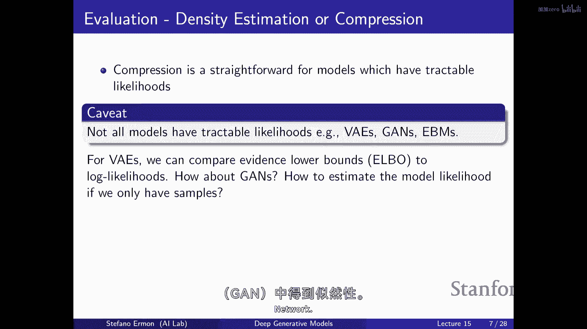
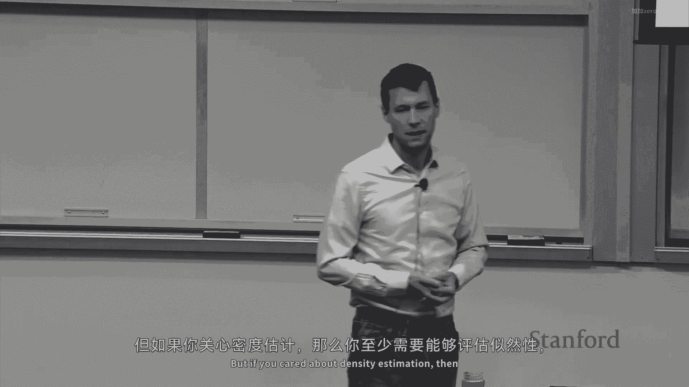
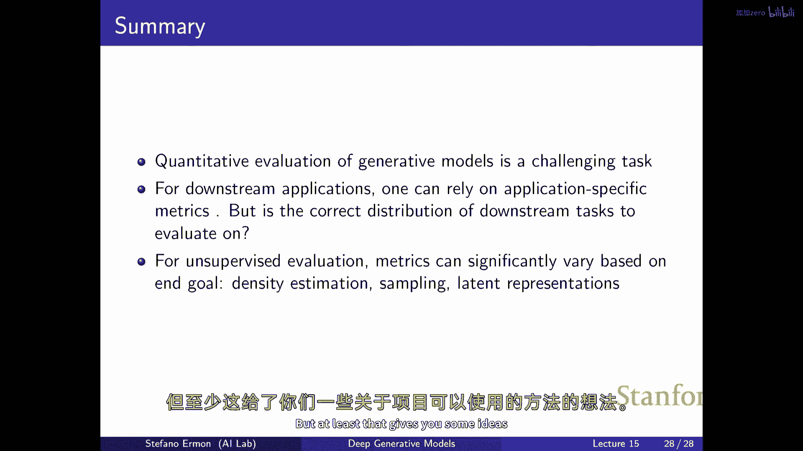

# P15：p15 Stanford CS236： Deep Generative Models I 2023 I Lecture 15 - Ev - 加加zero - BV1NjH4eYE1v

今天的计划是讨论评估，那么如何避免，而不是谈论如何构建新的生成模型类型，我们将讨论如何实际评估它们的好坏，这将是，这有点像一个具有挑战性的主题，在那里并没有关于如何做正确的共识。

但我们会尽力找到正确的覆盖范围，嗯，至少一些存在于那里的方法，目前并没有完美的方法，但嗯，我们将讨论一些，所以我们将覆盖一些，所以作为一个简短的概述，我知道我们已经谈论了很多模型，我们将讨论。

我们谈论了不同类型的概率，你可以使用的概率模型，你可以直接与概率密度或概率质量函数工作，在这种情况下，我们已经看到了自回归模型，正则化流模型，潜在变量模型，像变分自编码器，我们看到了基于能量的模型，嗯。

我们谈论了概率模型，或者，或者像生成模型，在那里，而不是代表概率密度函数，你直接代表采样过程，所以这有点像生成对抗网络将是一个例子，然后，我们谈论了基于得分的模型，在那里，而不是代表密度，你代表得分。

这就是像梯度本质上，这是另一个你可以使用的模型家族来模型你的数据，我们谈论了多种不同的训练目标，你可以用于拟合模型的目标，我们谈论了KL散度，这是同样的作为最小化，KL散度与最大化似然相同。

这是非常自然的目标，每当似然直接可访问时，如果你直接模型概率密度函数，概率质量函数，这是一个非常合理的目标使用，所以自回归模型，流模型，变分编码器的肘部也是像对最大似然目标的一种近似。

对最大似然目标的一种近似，到一定程度，对比性散度也是近似于或，或它是到何种程度精确，取决于你可以从模型中获取完美样本，我们已经看到了f分叉和两个样本测试，这在生成对抗网络的上下文中是非常自然的。

如果你只有你可以从分布中获取到我们的样本，那么当你通过模型运行时，这是合理的训练方式，然后我们看到了费舍尔分叉，这基本上是与核心匹配相同的，这，这使在任何你有分数访问的情况下都 make sense。

或者在你处理基于能量的模型时，因为它允许你绕过正常的归一化常数，我们看到了噪声对比估计，它对基于能量的模型有效，问题是，你知道，到这个阶段，已经有很多不同的部分，有很多不同的原料你可以使用。

你可以从许多不同的模式家族中选择，有不同的训练目标，一个自然的问题是，如何为你的数据集选择你应该使用的哪一个，最终，这归结为哪个模型更好的问题，如，你应该在你的数据上训练一个回归模型，返回一个流模型。

你再次训练，为了回答这个问题，你需要能够说，你知道，模型a本质上比模型b更好，这需要你能够基本评估生成模型的质量，嗯，那就是，嗯，你知道，"真的真的非常重要"，是的，"因为你能够"。

"并且它允许你进行比较并选择更适合你的模式"，"为你的问题"，"而且，它就像是我们这样想的。"，"从研究角度看"，"有点像一种超级重要的原料"，你知道，我们总是想要进步，我们想要构建更好的模型。

我们想要越来越好，但是，为了做到这一点，我们需要能够测量一个模型的好坏，因此，我们生活在一个世界里，人们很容易就能，将他们的模型开源，你可以在github上克隆，仓库，你可以改进。

你可以对一个模型做出改变，或者对于训练目标，你会得到一些新的，能够量化你提出的解决方案非常重要，比之前存在的东西更好，再次出现，这要求你能够评估不同类型的生成模型，并且，嗯，你知道。

与判别模型的情况不同，遗憾的是，典型的机器学习模型评估生成模型相当困难，对于用于分类任务的典型机器学习模型来说，假设你在训练分类器，为了标记数据，将输入映射到标签，或者是一种低维的简单输出空间。

这是一个被相当好理解的设置，如何衡量进步，有人提出了一种新的架构用于，让我们说，计算机视觉任务，你可以训练模型，你可以检查你知道模型达到了什么样的损失，你可以用在，你知道你会定义一些量化的流。

你关心什么，是顶部一的准确性，顶部五的准确性，或者是你知道的什么，决策问题你，你打算使用模型预测的结果在你可以，你知道指定一个损失函数，然后你可以尝试，你知道，给定两个模型。

你可以评估他们在保留未见数据上实现的损失，并且那给你一个相当好，嗯嗯，对模型性能的把握，告诉你基本上，嗯，你知道，如果你处于测试时间，那么当你部署模型时。

你应该将数据拟合成与你训练时看到的那种类似的数据，这看起来是你测试集中的那种数据，这就是你期待的性能，因此，你知道这允许你比较不同模型并决定哪一个更好，不幸的是，对于生成模型来说事情并不那么简单。

任务的性质并不清楚，本质上这就是，这就是主要挑战，嗯，你知道我们关心的是什么吗，你为什么在训练生成模型，而且有很多不同的选择和很多不同，而且所有这些现在都或多或少是有效的，也许你在训练生成模型。

因为你关心密度估计，你关心评估图像或句子的概率，也许你关心压缩，嗯，也许你关心在当天结束时生成样本，你正在训练一个，你知道图像融合模型，而你关心的是能够生成漂亮的输出，它们是审美上pleasing的。

也许你知道你实际上只是在尝试做表示学习，所以或无监督学习在当天结束时，就像你有大量的未标记数据，也许大型的图像或文本集合，你从互联网上抓取，你希望模型学习这个数据的结构，你希望能够，你知道。

从模型中获取表示，然后你可以使用这些表示来改进下游任务的性能，而不是直接工作在像素上，也许你可以工作在由生成模型获得的表示上，然后你可以得到更好的性能，你可以减少需要训练模型标记数据的数量。

也许你知道你在考虑许多不同的任务，你需要能够使用你的模式进行，嗯，也许嗯，你知道你有一个，你正在尝试训练一个能够在图像上工作的单一好模型，然后你可以使用它来进行压缩感知，一些监督学习的图像翻译。

或者你知道，如果你在考虑语言模型再次，你正在寻找一个已经被训练在大量文本上的单一模型，从互联网上收集的，你真正关心的是能够，你知道，利用这个大语言模型llm中编码的所有知识。

然后你真正关心的是能够提示模型解决任务，使用少量的类似于指令或例子的输入，所以有很多不同的事情你可以做，嗯，这些不同的事情将导致对于每个或一些它们，至少存在许多不同的度量方法你可以使用，所以。

即使你选择了其中一个任务，这些任务中的一个，你知道如何根据每个来衡量性能并不完全明显，最简单的可能是密度估计，如果你真的在乎密度估计，并且你真的在乎能够使用生成模型准确地量化概率。

那么似然度是一个相当好的那个度量，嗯，所以你可以做，你可以基本上使用，你可以将你的数据分为训练验证和测试，你可以使用你的训练集来拟合模型，你可能在验证集上选择超参数，然后可以在测试集上评估性能，其中。

性能只是模型对测试数据分配的平均对数似然度，这是对模型将分配给样本的平均对数似然度的相当好近似，你知道，本质上这是同一件事如压缩，我们已经看到，最大化似然度等于最小化差异，这是同一件事如尝试压缩数据。

所以知道，嗯，最终，我们在说如果我们使用那个度量，你在比较模型基于它们如何压缩数据的性能，并且我们看到，实际上，有一种方法可以将概率模型映射到压缩方案，嗯，你的做法是，你将数据点x编码为字符串，嗯。

该字符串可以唯一解码回，并且字符串的长度基本上取决于数据点的概率，所以如果你有非常可能的数据点，它们非常频繁，你想要分配短的代码，如果它们非常罕见，那么你可以负担得起分配非常长的代码。

你不会看到它们很频繁，这是，你知道，一种使用代码来压缩数据的方法，使用像它一样回到之前的直觉，如果你考虑莫尔斯码，它是基于这个原理的，所以如果你有像e和a这样的元音，它们很常见。

所以你想要分配一个短代码，然后如果你有字母频率较低的，你可以负担得起分配很长的代码，然后，你想要对一个长代码进行签名，如果基于最大似然训练生成模型，你基本上在尝试做到压缩的最佳程度。

如果根据似然性比较模型，你在比较它们如何压缩数据，这可能或不是你关心的事情，为了看到你知道，很清楚的是，如果你被分配给一个数据点的代码长度，X基本上与，非常接近对p的log分之一。

那么你可以看到你获得的平均代码长度将是这个量，这是大约一个定理，如果你去掉，嗯，你知道长度必须为整数的事实，如果近似，它大约等于负对数像，所以你试图最大化似然，最小化，你获得的代码的平均长度。

所以你最大化你可以实现的压缩，嗯，你知道，在实际中，你知道，如果你使用像Shannon或Huffman这样的代码，你可能以前见过，你知道它实际上很昂贵，而且不切实际地构建一个这样的代码。

但有方法可以得到实用的压缩方案，所以，到你能获得好的似然度为止，有一种实际的计算高效的方法可以构建压缩方案，这将表现得很好，只要你在数据上获得好的似然度，有一种叫做算术编码的东西，例如，你可以实际使用。

所以，如果你能训练一个深度生成模型，它能给你好似然度，那么你有可能非常压缩你的数据，这实际上是，你知道，如果你有，阅读，阅读关于语言模型的论文，GPT和那种东西。

实际上他们用的是同一个度量来比较语言模型，他们叫它困惑度，在，在设置中，嗯，但它本质上是似然度的一个缩放版本，但本质上是一样的，现在问题来了，嗯，为什么压缩是正确的，这不应该是一个合理的事情。

这就是我们真正关心的吗，嗯，你知道这是一，从某种程度上讲，它是合理的，因为你知道，正如我们所讨论的，如果你想要实现好的压力率，那么你需要基本上能够识别数据中的模式。

你只能通过识别像冗余这样的东西来获得良好的压缩，识别模式，识别数据中的结构，所以它是一个良好的学习目标，我们知道如果你可以将KL散度降低到零，那么这意味着你完美地匹配了数据分布，这听起来有道理，比如。

如果你在尝试构建，训练一个生成模型来，你知道，捕获关于世界的知识，你知道，这，这是一个合理的目标，我们正在训练模型来压缩数据，通过这样做，我们实际上在学习世界的工作方式，因为这是实现压缩方案的唯一方式。

对吧，所以，直觉可能是这样的，如果你想想你知道，像牛顿的定律这样的自然法则，你可以把它看作是一种数据压缩的方式，如果你知道你关心的变量之间有一种关系，如f等于ma。

那么知道这种关系允许你压缩你没有存储的数据，例如，如果你有一个加速度和力的序列，你不必存储两者，你可以只存储加速度，并通过方程式恢复力，例如，所以，任何数据中的模式或结构像这样都可以实现更好的压缩率。

因此，通过训练模型来压缩，你可能能够发现数据中一些有趣的结构，包括可能关于物理定律和这样的东西的知识，这就是有点像的，实际上有一个叫做胡特奖的东西，它是实际上的，有50万美元，嗯。

用于开发对维基百科的良好压缩方案，来自奖项网站的引言是，你知道，能够很好地压缩这个与智能密切相关，嗯，虽然智能是一个模糊的概念，文件大小是硬数字，维基百科是人类知识的广泛快照。

如果你能比前人更好地压缩维基百科，你解压缩器可能基本上更聪明，这个奖项的基本理念是，鼓励智能压缩器的发展作为达到agi的道路，所以这里的假设是，如果你真能非常 well 压缩维基百科。

那么你必须达到非常高的智能水平，嗯，你知道，确实，你可以实际上比较人类如何做这件事，如何，人类在压缩文本方面的能力如何，对吧，这是香农做的实验，嗯，很多年以前，他对这个主题非常感兴趣，没有同情心。

他发明了整个信息理论领域，他实际上进行了实验来检查，你知道如何如何好，你知道，人类有很多知识，有很多上下文，如果你看到一个字符串的文本，你可能对接下来会发生什么有很好的预测，所以你实际上进行了一个实验。

试图看到人们，参与者，并试图看到人们在预测英语文本中的下一个字符方面有多好，基本上，他发现他们达到了大约一点，二，一点，三位字符的压缩率，所以有，你知道，二十七个字符或什么的，所以有很多不确定性。

如果你不知道，你可能需要四个或五个位来编码一个字符，但是人们能够做到只有一或二，所以当你预测英语文本中的下一个字符时，不确定性并不大，人们做得很好，你可以想成一位信息，它编码了两个可能性。

因此这就是人们通常拥有的不确定性，当他们预测文本中的下一个字符时，所以有点像一个位将对应于，好的，有两种可能性，我对它们感到不确定，关于是哪一个，你知道你可能问，我们的大型语言模型如何，神经网络。

它们实际上已经比人类做得更好，你知道你可以得到像这样的东西，人们尝试在维基百科上，并且使用了这种更高价格的数据集，他们能够得到像0。94位/字符这样的东西，甚至比人类更好，你知道再次。

这是一个合理的目标，一种合理的比较模型的方式，人们用于训练大型语言模型的方法是最大似然，从某种程度上来说，比较它们基于困惑度是有意义的，或者尝试预测困惑度的好坏，如果你增加数据或增加计算的方式。

规模法则，这样的东西，但是存在压缩的问题，并且你知道主要的问题是它可能不是我们真正关心的任务，也不是完全反映我们关心的事情，问题是基本上不是所有的信息位都是相等的，所以从如果你考虑压缩。

你知道一个编码生死情况的位与可能不那么重要的情况值是一样的，比如明天是否会下雨，或否，所以压缩一个或压缩另一个给你相同的结果，从你知的角度，关心，差异或最大似然，但是显然你知道。

它不反映我们如何在下游任务中使用信息，所以存在一些严重的限制于你可以说的，仅仅通过比较模型来衡量压缩，考虑图像数据集，同样的，有一些信息对我们来说并不重要，比如你可以想到一个特定像素的轻微颜色变化。

并不重要，而关于图像的标签信息却非常重要，但从这个角度看，它们都是一样的，并不重要，但是图像的标签信息却非常重要，但是但从这个角度看，它们都是一样的，并不重要，所以，这就是我们密度估计或压缩的主要限制。

嗯，是的，我们稍后会讨论这个问题，嗯，你需要记住的另一件事是，压缩或似然度是具有可追溯似然度的模型合理的度量，但是，有许多模型甚至没有它，所以，嗯，如果你正在处理VAEs或GANs。

甚至不清楚如何根据似然度或压缩来比较模型，嗯，对于VAEs，至少你可以根据肘部值来比较它们，至少，你可以根据肘部值来比较它们，这我们知道是似然度的一种下限，所以它是数据压缩效果的下限，嗯。

但如果你有GANs，例如，你怎么比较，让我们假设再次达到了的似然度，与使用自回归模型或流模型实现的似然度相比，像你一样，你不能比较它们，因为从生成对抗网络中无法获取似然度，当我们再次学习时。

你提到的一种主要动机是，它很可能就像是的，所以，试着理解你的嗯，什么。

所以，这个评估矩阵，实际上取决于，你如何看待下游任务，这就是你关心的，是的，这是一个很好的问题，我的意思是，你真的关心压缩吗，可能不，但如果你想要比较再次的压缩能力与别的东西，你甚至无法做到这一点。

我们将看到是的，也许这不就是你关心的，也许你不关心，但如果你想要比较再次的压缩能力与别的东西，你甚至无法做到这一点，我们将看到是的，也许那不就是你关心的，也许你关心样本质量。

我们将看到有其他种类的评估指标，可能更合理，你可以说，好的，再次是否比训练在同一数据集上的自回归模型更好，但如果你关心密度估计。

然后，你需要至少能够评估概率，而且这不是你可以直接用罐子做的，所以嗯，一般来说，找出这个问题相当困难，如果你有一个生成对抗网络，并且你有，让我们假设你有一张图片。

你想要知道模型生成这张特定图片的概率是多少，这相当困难，嗯，即使你能从生成器中产生大量的样本，实际上，要想弄清楚这个挺困难的。"该问题的底层概率密度函数是什么？"，"通常来说，你需要使用近似值"。

"并且一个漂亮的叫做核密度估计的"，"那允许你基本上得到一个估计值"，"该问题的底层概率密度函数是什么？"，"仅给定模型的样本"，所以，它可能会看起来像这样，像这样，假设你有一个生成模型。

对于你不能直接评估似然度的模型，但你能够从它中采样，那么你可以在这里绘制一堆样本，我正在展示，嗯，我展示了六个，我只是为了简单起见，让我们假设样本只是标量，所以你生成了六个，第一个是负二点一，嗯。

负一点三，诸如此类，这些就像是代表，生成这个数据的，嗯，分布，嗯，问题就是我们可以对其他数据点的概率说些什么，所以假设你已经有了这些来自模型的六个样本，概率是多少。

让我们假设我们应该将指针分配给减去零点五，一个可能的答案是，嗯，模型从未生成，零点五或我们五不在我们拥有的六个样本中，所以可以说你知道，因为它不属于这个样本集，也许我们应该将概率设置为零。

这可能不是一个很好的答案，因为你知道，你知道我们只有六个样本，可能是由于偶然，我们在我们的样本集中并没有看到那个特定的数据点，所以做事情的一种更好方法是做一些构建。

一些种类的直方图过可能的这些样本可以取的值，例如，你可以构建一个直方图，让我们说，我们有两个在这里的桶，然后，你基本上计算数据点落在不同桶中的数量，然后，你差不多像，确保你得到的对象被正确归一化。

这样曲线下方的面积实际上是实际的一，所以因为我们有很多，我们有两个数据，两个数据点落在-2和2之间，然后我们有一点点更高，我们为那个区域分配一点更高的概率，然后，你可以看到直方图的形状与这个形状有关。

我们在这个集合中看到的样本在哪里，然后，你可以评估概率的，嗯，新数据点的概率，基本上通过检查，嗯，这个测试在哪个bin中，数据点减去0。5，落在这个bin中，在哪里有两个数据点。

所以我们为每个bin分配概率密度1/6，然后如果你取，假设是负一点九九，一点九九，我想这也在第一个，在这个桶里，那里有两个数据点，所以也应该是一点六，然后当你跨越到左边的下一个桶时。

那么概率下降到十二分之一或什么的，所以只是基本的直方图，作为一种基于样本构建概率密度函数近似的方法，嗯，这是一件合理的事情，但你可以看到，这些转换可能并不是非常自然，也许我们可以做更好的事情。

而且确实一个更好的解决方案是基本上平滑这个，这种因为我们使用了bins而有的硬阈值，所以核密度估计器的工作方式是，当我们评估测试数据点的概率时，我们基本上检查这个数据点是如何与所有训练样本相似的。

我们集合中所有样本，我们使用此函数来做到这一点，K 一个核函数，然后，我们通过基本上查看所有相同的方式来评估这个概率，查看所有我们访问的n个样本，检查，在测试数据点和我们访问的样本上评估核函数。

在样本上的密度和我们访问的样本上，然后，距离被这个参数sigma缩放，这是指内核的带宽，为了更具体，你可以把内核想象成一种高斯函数，具有那种形式的函数，所以，像相似性一样，嗯，两个数据点之间的相似性。

基于那个方程，像指数衰减一样，如果你这样做，那么你就会得到更平滑的结果，有点像插值，嗯，在我们有了这种网格之前，嗯，那些有点像不太自然的，现在，我们做的事情，如果你在使用高斯核的核密度估计器时。

我们基本上在每个数据点周围放置一个小型的高斯分布，在这个样本集中，然后我们基本上在加所有这些，所有这些高斯分布，然后我们得到一个对密度的估计，现在它变得更加平滑，对，所以，嗯，本质上，概率很高。

如果你靠近许多数据点，就像以前，但现在它被关闭，是平滑的，就好像不是你现在是否在垃圾桶里那么简单，你知道，而且有一些微小的影响，即使你离得很远，数据点的影响也会按照那个衰减，什么，你选择的核函数，是的。

我有一些关于你怎么选择的启发式，比如专门为你的核函数设计的变体，是的，是的，下一个，那是一个很好的问题，而且看起来，好的，你选择内核，内核基本上告诉你你应该是一个非负的函数，嗯，它是归一化的。

所以它积分为1，所以当你取这个，嗯，这种，嗯，n个内核的总和，总面积将是n，然后您将其除以n，您将得到一个归一化的对象，所以您将得到一个有效的概率密度函数，然后嗯，它必须是，我猜测它必须对称，嗯。

因为从直觉上看，它是一种对数据点对之间的相似性的概念，嗯，嗯，所以函数值将很高，当差异接近零时，带宽控制平滑度，基本上啊，这种插值看起来像，在这里的左边，您看到不同类型的内核函数，您可以选择。

您选择高斯，您也可以选择一种更像正方形的内核，它决定了如何，嗯，Uh，The，您认为比较数据点相似性的正确方式，所以，如果您选择高斯，您有那种函数形式，如果您选择某种类型的正方形内核，它看起来像这样。

然后它更接近于直方图类型的东西，如果两个点相似，如果他们的距离在您越过这个阈值后相对较小，然后距离变得极其高，带宽控制平滑度，所以你可以想象，嗯，理想情况下，您希望选择一个带宽，以便您获得分布。

像黑色的那个，曲线，这里显示的灰色曲线，它是尽可能接近生成数据的真实曲线的，在那里，但你可以看到，如果你选择了一个sigma值过小，嗯，那么你将得到类似于红色曲线的东西，它再次非常锯齿状，所以。

它就像下面平滑的，如果你选择了一个非常高的sigma值，"一切都有点相似于彼此"，"那么，你将得到一个非常平滑的插值类型"，"然后你会得到像绿色曲线这样的东西"，"再次这并不是一个好的近似值"。

"实际生成数据的密度"，所以回到问题，"你如何选择sigma？"，你想要尝试做的事情是，你可以通过尝试交叉验证来调整它。或者你省略一些样本，"然后，你就尝试看哪种西格玛适合这个"。

尽可能快地将您遗漏的样本留下，所以是的，那就是，嗯，对于这个，原则上，那就是，这是一种允许您计算的方式，以获取对底层密度的估计，仅给定样本，很遗憾，一旦进入高维，实际上它非常不可靠，嗯，只是因为，当然。

维度性，基本上，你需要一个非常大的数量的样本来覆盖整个空间，并且所有可能发生的事情，所以，你有的维度越多，你需要的样本就越多，在实际应用中，如果你在处理像图片这样的东西，效果可能不会太好，因此。

你能做的事情有一些限制，嗯，现在假设你有潜在变量模型，嗯，你又有一个潜在变量模型，但你希望某种方式得到似然度，嗯，你知道，理论上，你可以通过类似于对潜在变量z进行积分的方式来得到它，我们知道这有点像。

你需要的表达式是，如果你想评估数据点x的可能性，你可以原则上通过查看所有可能的潜在变量的值来获得它，然后检查生成那个数据点x的条件概率，不同的是，你在这里要积分过ah，因为我们知道这可能有很高的方差。

有点像如果先验分布的分布与后验分布有很大的不同，嗯和嗯，这基本上意味着再次，你需要大量的样本来，基本上得到那个可能性估计的合理值，是的，有一些方法基本上可以，使估计更准确，有一种叫做重要采样的产量。

这是一种程序来基本上进行重要采样，通过构建一系列分布来从这些z变量中抽取，这有点像在坏之间插值，有点像天真的，从先验中仅随机采样，z的分布和您希望做的事情的最优选择，那就是从后验中采样。

你知道我们不会深入讨论，让我直接跳过一些这个，但如果你有，你知道在你的项目中，你正在处理可变模型，你有vae，并且你需要计算似然度，你可能想要了解一下这些种类的事情，嗯。

因为它们可能会帮助你得到更准确的，大约的估计，来自你变分外编码的，嗯，现在不错，样本质量如何，在许多情况下都是正确的，我们可能不关心概率，我们不关心压缩，我们有两个生成模型，嗯，也许。

你知道我们可以从这些模型中生成样本，我们想要了解哪一个模型生成样本更好，所以如果你在处理图像，也许如果你有两个样本组，你想要知道哪一个更好，嗯，如何做到，这并不是很显而易见，实际上相当棘手，嗯，要说。

你知道，这种生成模型产生的样本是否比产生这些样本的生成模型更好，不明显，你怎么做，嗯，可能最好的方法是，涉及到人类，嗯，所以你知道，让一些标注者基本上比较样本并检查哪些更好，嗯，你知道，当然这不可扩展。

也许这不是你在训练时可以使用的东西，但你知道，如果，嗯，如果我们有预算，并且我们有时间去通过人类评估，这通常是像黄金标准一样的，嗯，实际上，在人机交互社区中有一些非常有趣的工作，人们已经探索了，嗯。

获取人类反馈的原则性方法，并试图找出，你知道，让他们比较质量的不同样本，或者不同类型的生成模型，这篇论文实际上是来自斯坦福的，嗯，类似于研究生成模型的感知评估，这是基于心理学的，认知科学，一类文献，嗯。

他们建议你应该做，你应该从你的模式中抽取样本，你有真实数据，然后你可以检查人们需要多长时间，准确地决定他们看到的样本是否是真是假，如果你只能看一个样本的时间非常短，你知道你可能无法感知到差异。

从真实和假象中，也许手的渲染不正确，但如果你没有足够的时间来实际上盯着照片看很长时间，你可能看不到它，所以他们建议我们需要看看这个时间来获取感觉，你知道，人们区分真伪所需的时间越长，所以。

我们可以通过这个时间来了解，样本质量越好，他们提出的另一个指标更传统，基本上就是欺骗人们的样本比例，当你给他们无限的时间来实际检查时，这些是真实的还是假的，所以你看网站，如果你感兴趣。

这就像它做什么工作像什么，如果你想确定人们需要多长时间才能确定，样本是否真实，你做的是，你可能从一个非常，也许一个相当大的数量开始，也许五百毫秒，你给他们到一边，无论图像是否真实。

也许他们总是能正确地得到它，因为他们有很多时间来找出如何，生成模型可能犯的错误是什么，然后你开始减少你给他们的时间，直到你可能达到三百毫秒左右，人们开始分辨不清真伪，我喜欢无法区分真实和虚假，到那时。

你知道那将是这个特定生成模型的炒作时间得分，然后嗯，如我所说，人们花费的时间越长来弄清楚，样本的质量就越好，在这里你可以看到一些例子，然后你也可以根据它们需要多长时间才能分辨出来来排名不同的样本。

为人类评估者基本区分不同类型的样本，嗯，你知道的问题，人类评估很棒，也许你可以用它们来为你的项目，人类评价的问题在于它们往往很昂贵，实际上，我们必须支付人们去通过这个过程，你知道，比较样本。

决定哪些看起来更好，嗯，他们很难复制，而且这些很奇怪，你知道你，你需要非常小心地控制你设置这些人类评估的方式，和你以前用来问他们的布局，问题会影响到你得到的答案，你提问的方式，会影响到你得到的答案。

所以实际上完全依赖人类评估是非常困难的，而且他们往往很难复制，所以，嗯嗯，你不能做的另一件事，你可能无法得到，如果你只做这件事，你可能无法实际评估概括，再次，如果你想象一个只刚刚记住训练集的生成模型。

它会给你非常优秀的样本，这是由定义决定的，你可能甚至无法使用人类，你可能无法实际上确定那个，确实模型实际上只是在记忆训练集，而且它实际上无法在任何有意义的方式上进行泛化，所以如果。

如果有一种自动评估指标来实际上确定样本的质量，和一些非常流行的，经常在文献中被使用的，你可能需要实现或使用，也为你的项目， inception scores，Fid scores 和 cascores。

实际上，我认为这在上次的讲座中某个时候出现过，你和那里讨论了他们实际上是什么，所以现在我们将看到它们是什么，它们实际上是如何计算的，以及它们实际上的含义，所以， inception 分数是你可以使用的。

嗯，当你在标记的数据集上工作时，所以，如果你在某种情况下处于图像有相关联标签的设置中，那么你可以做的是尝试基本上预测合成样本的标签，你可以检查标签分布的类型，你在合成样本与常规样本上的表现如何。

所以如果你有一个可以基本上告诉你，一张图片的标签的分类器，X是多少，那么你可以尝试做的事情是，你可以尝试，嗯，量化生成模型的好坏，通过观察分类器在其产生的样本上的行为，所以。

 inception score 考虑的是两个方面，第一件事看起来像是叫做锐度的东西，本质上你可以想象有两个样本集，所以有一个看起来像这样的，还有一个看起来像这样的，如果你做到这，这是一个标签数据集。

你知道每个样本都有一个标签，这就是数字，这是mnist，所以有点像一个玩具例子，但是嗯，每个数字，你产生的每一幅图像都可以映射到一个它代表的数字，你可以看到， somehow 这些。

真正的样本可能相对容易分类，而稍微模糊的合成样本，它们并不清晰，它们将更难，基本上进行分类，如果你有一个好的分类器，所以，直觉背后的，清晰度主要是看分类器在预测时多么自信，在合成样本上，在生成的样本上。

所以， 公式看起来像这样，它本质上与分类器的熵有关，当在样本上进行评估时，所以你从模型中生成样本，然后做预测，你看所有分类器在轴上产生的可能预测，那是合成的，那么这个量基本上与分类器的熵有关，所以。

 uh，当预测分布分类器的分布熵低时，所以，就像分类器把所有的概率质量都放在一个单一的，Y 它非常自信地做出预测，那么清晰度的值就会非常高，uh，我们还要检查的东西叫做多样性，想法是。

如果你正在与标签数据集工作，你希望模型，基本上产生训练集中所有代表的类图像，假设再次生成这样的样本，这将指示某种模式崩溃，它只产生一次，我们想要某种方式说，哦，这些这些不是良好的样本，因为多样性不足。

量化的方法是基本上看从分类器在样本上评估时得到的标签边缘分布，你试图确保， um，这个边缘分布有高熵，意味着所有可能的类都被分类器预测，在合成样本上，基本上，所以，它不仅仅是产生一次，模型再次的公式。

它，它基本上在看标签的边缘分布，它，它基本上是在看，嗯，边际分布的熵，那么，你得到 inception 分数的方法是乘以这两个数字，因此，高的 inception 分数是好的。

因为它意味着你有高的多样性，并且你有高的锐度，所以你评估多样性，因为像这样，似乎你可以只是取一堆滚出，然后只是平均预测的次数，零一、二、三、四、五或什么，只确保所有的分布都是关于相同的，但似乎有点难说。

在类内，我有几个不同的绘制，所以它不这样做，所以这是问题，是的，所以它不是完美的，是的，这是失败模式的一个例子，如果某种方式它确实代表了所有数字，但只有一种类型的数字。

你可能有一个非常高的 inception 分数，尽管你像是在类内丢弃模式，在簇中，对应于不同的标签，当然不完美，但仍然广泛使用，因此，更高的 inception 分数对应于更好的质量。

为什么它被称为 inception 分数，嗯，如果没有分类器，所以如果你不是在 mnist 或玩具，或情况下你可以做的，你可以训练一个分类器，在 imagenet 上训练，像 inception 网络。

人们通常使用它们来做这个，然后你计算这个矩阵相对于那个，你能解释一下这个多样性吗，多样性是如何精确评估的再次，它主要是检查到这个 c，或者为什么如果你看它，它基本上就是预测标签的边际分布。

当你插入合成样本时，所以如果你只产生一次，那么这个将是一个 one-hot 类型的向量，然后熵将非常低，所以你基本上会不满意，所以你想要高熵，意味着理想情况下它应该是均匀的，你看。

为什么需要在可能的不同y上均匀分布，所以这就意味着所有的类别都以相等的数量被代表，是的，那么这不意味着如果你想要增加多样性，你就需要减少尖锐度，是的，他们，他们正在竞争，他希望两者都有很高的价值，酷。

嗯，好的，所以这就是那个，经常被使用，但是，正如我们讨论的，不完美，远非完美，嗯，一个问题是你实际上并不真正，你更像是只关注合成样本的样本，但你实际上从未将它们与真实数据进行比较，如果你考虑这些公式。

你只是在看合成样本，你将它们传递给分类器，并查看分类器输出的统计信息，这看起来不太理想，因为你甚至从未将合成样本与真实样本进行比较，所以有一种叫做fid分数的东西。

它试图本质上比较一个大型模型提取的特征的相似性，在合成样本和真实样本上预训练的模型，所以你做的就是这个，你生成一大批样本从你的生成模型，并且你有一堆来自，让我们说测试集。

然后你将每个样本通过某种类型的预训练神经网络，例如，一个 inception 网络，例如，这就是为什么再次，它被称为 fid 分数，嗯，然后，你会为每个数据点获取特征，这些特征将分布在这些特征上。

因为每个数据点都将有一个不同的对应特征向量，你可以尝试做的是为每个特征拟合一个高斯分布，嗯，对于从合成样本中获取的特征，以及从真实样本中获取的特征，你将得到两个不同的高斯分布。

这意味着高斯分布将有不同的平均值和不同的方差，并且越靠近，嗯，这两个高斯分布是，越接近，样本的质量就越高，样本的质量本质上是因为如果来自合成模型的样本与真实样本有很大的不同，那么。

你可能期待一个由赞助者模型提取的特征，将与这些不同，因此，这两个高斯分布也可能不同，你可能有不同的均值，或者你有不同的标准差，不同的可变性，然后，从这个中你会得到一个标量。

通过计算这两个高斯分布的时间跨度，它们之间的距离，你可以在封闭形式中计算出来，它本质上是在查看，是的，高斯分布的均值之间的差异，以及一个基本量化的量，用于测量，这两个有多不同。

你通过拟合高斯模型得到的方差，到真实数据和假数据，它们的差异是如何相对于彼此的，所以，使用多维高斯分布的直觉是什么，嗯，比如，为什么不是其他统计，但你可以使用其他东西。

他们使用多维高斯分布的原因是因为这个一和二之间的距离可以在封闭形式中计算出来，但是，不是特别原理，是的，嗯，这个取决于被抽取的样本，嗯，这个，嗯，取决于从哪个样本中抽取的，嗯，所以，比如，嗯，嗯。

在考虑成像模型时，样本可能指的是在其他领域也可能适用的其他主题，主要的可能是其他的一些，所以我们真的在比较苹果与苹果吗，嗯，如果我们的模型成功地拟合了数据分布。

那么你应该期待一个预先训练的网络提取的统计也将相似，例如，如果这个预先训练的网络正在考虑的是提取统计，那么，如果，这个预先训练的网络看到的是提取的特征，高级特性如图像中的什么，物体所在的位置。

以及类似的东西，你可能期望这些网络能做的，因为它们在精细调整时表现良好，在不同的任务上进行调整，在某种程度上，你希望通过查看统计数据能了解样本在特定特性上的相似性，它们捕获的分布是否相似。

所以与未来相关的两个问题，第一个问题是我们为什么喜欢，你知道，为海滩安装多个警报，关于检查，嗯，直接比较生成样本和测试样本的平均值和方差，第二个问题是像，是的，可以详细解释作业，如如，例如。

变分自编码器，我们都试图计算的特征表示，所以你在说'任何事情'时指的是什么，所以第一个问题，嗯，特征是由预训练模型提取的，这可能是任何在Ficase中的东西，它是Inception网。

这就是为什么它被称为Inception距离，所以这是一款预训练模型，通常在大规模的图像数据集上进行训练，嗯，其中包含许多不同的分类，为了表现良好，分类可能必须提取合理的特征，在特征空间中进行比较。

这很有道理，第二个问题是为什么不直接比较样本自身的平均值，这将是一种非常简单的特征，你只是看单个像素，你可以，但它可能不是我们关心的，更感兴趣的是比较由模型提取的高级特征，当你使用Fido时。

人们有时会问关于训练部分的cosbox，但我知道，嗯，或者什么可以使这个指标更好，三个更多，它是否分离的，是的，我的意思，你可以在Fitthen上进行训练，你不能再使用它作为评估指标。

所以不是开始训练的时候，或者有一些东西阻止它变得优秀，嗯，你知道的，但你可以，是的，到它计算起来不过于昂贵的程度，我认为这可能是可以的，但你至少可以尝试，然后嗯，嗯，在这种情况下，较低的fid更好。

另外，你可以做的事情是做一些叫做核 inception distance的事情，嗯，想法是基本上做两个样本测试，有点像我们为训练模型使用的东西，但不是在样本自己的水平上，我们又将。

在预训练模型提取的特征水平上进行，因此，md是另一种两样本测试，其中您有两个来自不同分布的样本，P和q，您做的事情是，嗯，嗯，您比较不同时刻的差异，有点像，这是什么建议，但是按照德布现在。

我们可以贬低方差等等，更具体地说，你做的方式回到了内核的概念，你使用内核来测量数据点之间的相似性，你做的就是这个，如果你有分布p和q，你检查，两个样本与真实样本的平均相似性是多少。

假设两个假样本的平均相似性是多少，然后，你将其与真实样本和假样本的平均相似性进行比较，如果p再次等于q，那么你可以看到这个东西评估为零，嗯，因为嗯，你知道，真实样本和伪造样本之间的差异与，嗯。

两个真实样本或两个伪造样本之间的差异，以及我们的想法是现在我们被允许使用核函数来，基本上比较样本的相似性，所以，我们并不知道。

我们并不 necessarily 必须啊 比较样本在像它们的原始像素值这样的基础上，但我们可以做的是，我们可以再次在分类器的特征空间中像做MMD一样进行排序，因此，你会使用核来比较特征或两个样本。

与真实样本，与伪造样本，和一个真实和伪造的样本，基本上，嗯，它与fiuh相似，关键区别在于你知道k稍微更有原则，嗯，但它更昂贵，因为你需要像，嗯，如果你有n个样本，那么它有一种像二次成本的成本。

与线性的相反，因为你必须对所有两组样本之间的所有对进行比较，但与fid有类似的风味，比较两个分布的矩，是的，这是因为从这个角度看来并不明显，但你也可以把它想成基本上。

核的核可以基本上将样本映射到复现核的希尔伯特空间，所以，它基本上是，如果核基于某些特征比较数据点，那么这个基本上与像，将数据点和伪造数据点嵌入到核的特征空间中，然后将这些两个对象进行比较，一样。

但nice的是，核可以，可以查看无限的特征，所以，它类似于核技巧，允许你使用无限的特征来比较数据点，而不必计算它们，好的，所以那是，嗯，三种主要像样的用于评估样本质量的度量，可能有更多的你需要考虑。

特别是如果你在考虑文本到图像模型，嗯，然后有许多事情你需要担心，如果生成模型应该接受一个标题并生成图像，那么你确实关心图像质量，但你也关心其他事情，例如，你关心你生成的图像是否与用户提供的标题一致。

但你可能还关心其他事情，你可能关心模型显示的偏见，你可能关心它是否产生需要过滤的毒性内容，你知道它关于推理有多好，如果你提到的标题涉及到不同的对象和他们的空间关系，你可能关心其他事情。

你知道模型关于理解有多好，"这个理解类别的模型有多好？"，"空间关系和空间推理"，"种类的问题"，所以，实际上这也是我从斯坦福参与的一项相当新的成果。因此。

我们构建了一个名为heim的全面文本到图像模型评估基准，"我们已经考虑了所有可能的度量标准"，"我们能够想到的"，"我们已考虑了不同种类的评估场景"，嗯和啊，"所以你可以看到一些例子在这里。

试图看质量"，或者也许是的，我们使用通常的fiand，就是我们刚刚讨论的Inception和钥匙，然后但是然后我们也会看其他东西，模型的 robustness 如何，如果你在标题中更改单词。

以及你生成的图像和标题之间的对齐度，各种种审美得分或原创性得分，所以有很多不同的评价标准，我们实际上尝试做，是的，"但我认为今天这是对现有文本到图像模型的最全面评估"，"我们采用了许多现有的模型"。

"然后我们尝试根据所有这些不同的指标来比较它们"，"是的"，"如果你感兴趣，就可以去，看看结果，看看哪个模型能产生最高质量的图像。"，"按照所有这些不同的标准来衡量"，"两者都真实"。

"人类和如何自动化它"，或者，或者你知道的其他事情，"如果你关心这些模型所具有的偏见"，你知道我们有一堆指标来测量那个，所以这可能又是一种有用的资源，随着你现在开发项目。

另一个你可能想要做与模型有关的事情是获取特征，你知道我们谈论过这个想法的，就像对大量的未标记数据进行无监督学习一样，你可能能从模型中获取好的特征，你怎么评估，嗯，你是否有良好的特征，嗯，你已知道这一点。

你在思考什么任务，你在训练，你在试图获取特征，因为最后你关心的是分类，你心中有分类问题，那么你总是可以测量在下游任务上的性能，所以在这种情况下并不难，要获取特征比这要困难得多，你知道我。

如果你没有特定的任务，并且你只是想说，好的，这个模型是否比这个其他模型产生更好的特征，那么确定地看到一些东西就会变得更加困难，嗯，而且嗯，你知道，存在不同的，嗯，嗯，嗯方面你可能想要考虑。

如果你处于无监督的设置中，没有任务，没有标签，所以没有基本的方法来比较你可能得到的不同种类的表示，你知道你可能关心模型的聚类能力，也许你关心压缩，也许你听说过这种纠缠。

所以也许你关心我们刚刚谈论的这个想法，你知道你有一个潜在变量模型，你希望潜在变量有一些意义，也许你可能想要能够控制不同的变化因素，通过单独改变变量，这就是所谓的解耦，其中不同的变量有一些像样的意义。

它们控制数据的生成过程的不同方面，如果你关心聚类，理想情况下，你希望能够将具有某种相似意义的数据点分组在一起，或者它们在某种方式上相似，这是非常循环的，但这是未监督学习的问题，你可以做的一件事是。

你可以取你的ae或模型，它给你潜在表示，你可以将数据点映射到这个特征空间，然后你可以应用一个某种类型的聚类算法，如k-means来将它们分组，这就是一个例子，你训练两个生成模型在mnist上。

然后你将数据点映射到一个二维的潜在空间，在这里，呼叫者代表了不同的类，我不知道确切的b和d是什么，但这是两个不同的模型，它们产生了两种不同的数据嵌入，数据的嵌入，你知道哪一个更好，是b更好还是d更好。

这还不清楚，它们似乎都在做一些合理的事情或某种程度，像，同一类的数据点最终会被分组在一起，在这个潜在空间中并不明显，你更喜欢哪一个，嗯，所以您知道，对于标签数据集，再次，有许多定量的度量，嗯。

所以如果您有标签，用于那个，您知道，所以您使用未标记的数据来生成簇，然后您使用标签来评估簇的质量，然后有许多度量，如完整性得分，同质性得分v度量，我将快速浏览它们，但大致来说，有许多度量您可以使用。

如果您有标签数据集，您假装没有标签，您获得表示，您检查进行聚类，然后您可以使用标签来查看，我知道簇的质量如何，嗯，您得到的簇如何，直觉上您想做的是，您希望能够将属于同一类的点分组在一起，因此。

也许您关心确保所有属于同一类的点，最终都落在同一个簇中，或者您可能关心簇内的同质性，因此，您希望确保所有落在同一个簇中的点，具有相同的标签，或者可能，这两种分数的组合，所以有各种度量您可以使用，再次。

如果您的项目涉及到像这样的东西，嗯，您可以深入研究这个，另一个您可能想要考虑的事情是检查到何种程度，基本上，潜在表示保留了原始数据点的信息，所以到何种程度，基本上，您可以根据潜在表示重构数据。

这是你关心的任务，如果您试图进行有损压缩，所以您有数据，它可能有意义将其映射到潜在表示，特别是如果这个潜在表示是较低的维度，在这种情况下，可能您关心能够重构，尽可能准确地原始数据点。

所以这里你看到了一些例子，嗯，有点像不同的表现形式，你在顶部有原始图像，然后你可以，你看到的就是你得到的，是将它们映射到潜在空间，然后您尝试从潜在表示中重建图像，所以您希望重建结果尽可能接近原始。

原数据，基本尽可能减小潜在空间的大小，所以这里，例如，他们正在考虑不同种类的表示，或者如果你使用jpeg压缩，你将在你的图像中得到大约17x的压缩，同时伴随着准确性或质量的微小损失。

而训练得到的其他表示方式是，生成模型，"可能在这里你可以找到像九十倍压缩的东西"，"意味着通过将数据映射到潜在空间得到的潜在向量"，"远小于原始数据点"，"但是，你仍然能够非常成功地重建原始数据点"。

"按照一种像平均值这样的重建指标来衡量"，"平方误差"，"或者PSR SSI"，"我们不已经在尝试这样做了吗？"，当我们在讨论瓦斯和其他晚近发明的模型时，是的，所以是的，它们内部嵌入了重建损失，因此。

它们做这件事做得相当好是有道理的，但如果你有不同的模型，也许你在看，你知道你从再次获得的表示中获取的东西，并且你想要知道这些是否比我从vae中获取的更好，这取决于你想要做什么用这个表示，你关心聚类吗。

你关心你知道的重建质量，因此，这可能是你关心的一个方面，如果你正在尝试比较你现在生成的两种不同类型的表示形式，你可能还关心潜在空间的另一个方面，那就是这种纠缠，嗯，我们想要这些潜在表示的想法。

潜在变量应该能够捕获，观察数据的独立和解释性属性，例如，如果你有一个面部生成模型，也许如果你改变一个潜在变量，你改变你产生的图像的皮肤颜色，或者也许有一个拉丁变量，就像。

控制通过这个生成模型生成的人的年龄等，嗯，所以，例如，嗯，也许存在一个潜在变量，Z一，它在控制你产生的物体大小，所以，如果你不改变Z一，那么物体的大小永远不会随着时间的推移而改变，即使你改变了Z一。

然后您更改生产对象大小的方式是为了，或者嗯，是的，这有点像，这将是理想的结果，嗯有点像，主成分分析，嗯，有点像，但在非线性方式中，您找到重要的方面，嗯，数据的隐含变异因素，然后你能够单独控制它们。

本质上，人们又提出了许多指标，例如，一个试图预测固定变异因素的线性分类器的准确性，还有许多其他的，我不打算详细介绍，嗯，但有些库将允许你计算这些指标，所以，如果你在做一个关于解耦的项目。

这可能是一个值得探索的资源，而且，像不幸的一面是，这里是它证明不可能从学习，这是一个解耦的生成模型，如果你只有未标记的数据，所以，如果你从未有机会看到真正的潜在变异因素。

这些因素与你试图从数据中发现的没有任何标签关联，实际上，它证明不可能做到这一点，有一些实证成功，但为什么这些方法工作并不清楚，并且有一些理论结果表明实际上这不可能，所以我猜那里有一些限制，嗯，酷，现在。

当然，另一个非常流行的想法是，如果你正在与一个语言模型工作，在这些天里非常受欢迎，如果你在使用一个语言模型，也许你不关心通过关键字提取等过程，让我们来处理数据，让我们将其映射到一个潜在空间。

然后让我们尝试使用这些表示来提高性能，在某些下游任务中，如果你有一个语言生成模型，那么你可能能够直接使用模型来解决涉及语言的任务，基本上通过指定任务以自然语言来询问，所以，使用生成模型的方式有两种。

你可以尝试在不监督的方式中训练生成模型，然后尝试利用他们在这个潜在空间中发现的知识，通过映射数据点，然后按照常规方式训练分类器在这些潜在表示上，或者你知道，如果你正在处理一个与语言模型相关的潜在空间。

那么有一种想法是预先训练模型，使用大量的未标记数据，然后尝试适应它，例如，通过提示来实际上让它解决各种不同的任务，尽管这些模型已经被最大似然训练，我们知道这只是压缩，我们知道它们正在执行。

如果他们在压缩方面做得好，这意味着他们已经学习了数据的结构，他们记住了很多有趣的事情，然后希望我们可以利用知识在不同的下游任务中，例如，假设你在做情感分析，其中，你基本上被给予，嗯。

让我们说一个评论或可能是一部电影的评论，目标是预测该评论的情感是积极的还是消极的，这是一种经典的NLP任务，你如何使用语言模型来解决这个问题，因为咱们在处理自然语言，你可以尝试，所以我们有一个。

我们的界面是一个模型，它接受一个句子并预测下一个词，让我们说它是自回归模型，它接受一段语言，然后预测下一个，下一个词，然后你可以这样做，构造这个句子在这里，使得这个预测是模型唯一能做的预测下一个词。

给定之前的文本实际上是在为你解决问题，所以你可以构造一个句子，如，对以下电影进行情感分类，要么是积极的，要么是消极的，然后给你一个电影的评论例子，你知道这是积极的，这可能是这部电视剧中最好的一集。

巴拉巴拉巴拉，具有积极的情感，然后给你另一个例子，可能是消极的情感，然后，你有这个想要分类的评论，然后，你将评论的文本输入，然后，你有情感，然后，空白，然后，你用模型预测下一个词。

你用模型预测会发生什么，你应该将blank替换为什么，这正是模型预测下一个词API的精确描述，给定一些上下文，然后，如果模型预测积极，然后，你将将其分类为正例，如果模型在那里输出负例，然后。

他们将将其分类为负例，这就是提示的例子，当然，有许多更聪明的方法来做，有一种叫做提示工程的工作，人们据说通过精心构造提示来从模型中提取知识，做得很好，但这基本上是想法，从这些生成性模型中获取知识。

就像构造提示一样，这样，它就编码了你想要解决的问题的类型，而不必实际通过表示，当然，也可以仅仅对模型进行微调，这更接近于获取表示的概念，你知道，你也可以只是取模型，然后微调它来解决你关心的任务，所以。

预训练的模型可能已经将输入映射到，比如这里一句话，到一个对于预测下一个词很好的表示，所以你可能能够微调模型来做一些有趣的事情，这也是相当成功的，嗯，我认为提示可能更好。

因为它不涉及任何对语言模型有些特殊的训练，而且它通常工作得很好，尤其是如果，如果语言模型非常，它是一个非常强大的一个，再次，并且你打算考虑什么样的任务，嗯，这还是一个相当开放的问题。

在 terms of like 哪种生成式的，哪种语言生成模型更好，正确的人，外面有很多这样的人，你怎么，你怎么能说模型a比模型b好，你知道你可以计算困惑度，这是同样的意思，如可能性。

但它并不完全反映我们关心的事情，也许我们关心的是所有这些种情况，你知道我们可能想要能够问语言模型问题，或者我们可能想要它为我们做电影评论，或者我们关心的事情，我们做数学，解决谜题，或者是做问答系统。

或者是做问答系统，所以再次，这是一个不清楚应该考虑什么任务的空间，所以一种方法是，考虑很多不同的任务，很多不同的场景，很多不同的评价指标，因为你知道也许你关心准确性，但是也许你关心其他的事情。

你可以尝试看看在外面的这些不同模型如何执行所有这些不同的任务，所以，你可以考虑不同的场景，你可以考虑不同的策略，你可以考虑不同，嗯，适应策略，假设，不同的提示策略，你可以有不同的指标，我不知道，例如。

准确率或者任何其他指标，当你用这种方式使用模型来解决任务时，然后你可以比较许多现有的模型，这些模型在外面，就所有这些指标而言，这允许你，也许可以说得更精确地，这个模型相对于这些指标比这个其他模型更好。

在这种情况下，所以然后外面就有不同的力，有一个来自斯坦福的，看着很多不同指标的舵，很多不同的场景，很多不同，嗯，哪个是哪个非常详细，有一个由谷歌领导的，他们也在那里，更像是一个协作的努力。

他们让全世界的人提出很多任务，然后，嗯，它们全都是这个大长椅基准的一部分，或者你有超过两百个任务可以问你的语言模型来解决，你可以看到，就像在这些不同的任务中，你获得的性能如何。

我们如何将这个提示的概念适应到，嗯，任务，抱歉，像嗯，输入，在没有自然序列化数据的方式下，所以你在考虑一些像图片那样的东西，是的，那是一个，我认为那是一个，那是一个好问题，某种程度来说。

提示的想法还没有被广泛应用到这个领域，所以如果你有一个好的图像生成模型，你怎么能用它来解决任务通过提示，而且它不是那么自然，因为输出是一张图片，相反于，很容易想到一个，你知道的，如何将，标签映射到文本。

甚至是边界框到文本，所以如果你的模型的API有文本作为输出，使用它来解决各种任务相对容易，我认为如果你认为，如果API有图片作为输出，但是可能是可能的，我认为这是一个人们仍在探索的有趣类型的区域，是的。

我不认为那里有什么特别的好地方，是的，所以gbgp四号实际上回答关于，零枪答案的问题，就像没有提示的概念，你对它工作原理有想法吗，他们没有说，是的，但是嗯，是的，我的意思是，这可能是底层机制。

就是你知道，预测下一个词，对，然后它可能已经被做了一些指令微调，所以实际上它已经被预训练在大量的无监督文本上，只是预测下一个词，嗯，这就是压缩并不完全是，它可能不会做得很好。

如果你开始以零-shot的方式提问，所以你必须做，你必须在稍微不同的数据集上微调它，那就是强调更多的，这种我们可能在推理时预期模型会被问到的任务，再次，有一个问题，或者正确的方法是什么，你知道。

什么样的，正确的分布是什么样的，我们关心电影评论吗，还是关心问题解答，我们如何期待这两个啊，不清楚尘埃似乎能帮助什么，但我们还没有，在评估或看到哪些有效哪些无效方面有很好的把握，目前还很粗糙。

我认为正在逐渐来这里，当涉及到文本时，"也许但是嗯"，"也许我需要看看图像模型"，"但是，所有这些东西，开始尝试吧。"，"因此，这里的重复就像羊驼一样确定。"，"然后从那以后还有其他模型"，"但是。

关于我们实际上喜欢使用相似东西的形象呢？"，所以，就像那样，"目前我们主要正在努力应用它"，我的意思是不要，我们不是唯一的，但是，人们正在努力做，嗯，基本上你知道，你训练一个模型。

并在互联网上使用大量的图像，但是，也许你真的有一些，有一种像样的偏好，我们希望模型能够生成，你知道，具有更高审美价值的图像，或者我们可能希望模型是无毒的，或者我们可能希望模型更加公平，更无偏见。

那么您如何将模型适应于这种下游使用，所以您可以做的是，您可以收集偏好数据，也许您可以展示您可以有一个标题，您产生两张图片，您问用户哪一张您更喜欢，您获得关于我们喜欢和不喜欢的偏好数据。

然后您可以微调扩散模型以更一致地符合这种偏好数据，所以这可能，是的，我的天啊，所以，什么是"um pro"？"关于通过寻找大内存模型来解决测试的优缺点"，或者从是的，所以，鼓励是非常棒的。

"因为你不需要真正地"，你知道，你不需要任何计算资源的访问权限，"而且你甚至不需要知道如何编程"，你需要做的唯一件事是你需要能够用自然语言指定，你想要模型做什么，这样它就可以完全完成。

有点像在一个黑箱的方式，甚至不需要知道模型在做什么，权重是什么没关系，调整需要你实际上训练模型一段时间，至少在一些新数据或新任务或什么东西上，所以买家在成本和专业知识方面都处于更高的地位，在，成本和。

以及为此所需的专业知识方面，通常这是一种更好的方法，我认为，尽管人们已经变得相当擅长提示，所以，是的，我认为这取决于任务，哦是的，所以我猜我们时间到了，正好，但基本上我认为这是应该采取的。

他们提取非常高级别的消息，它仍然处于，基本上它还是一个相当开放的领域，如何评估生成性模型，嗯，我们还知道有很多，我们并不清楚的粗略的方式来比较模型，我们有一种感觉，哦，我们多年来取得了进步。

但在这个空间里还有很多工作要做，在 terms of 如何提出更好的指标，你知道，即使你有所有这些大规模的基准，我们有很多任务，有很多指标，它仍然不明显，你怎么权衡它们，以及正确的任务分布是什么。

你可能期望使用模型在，所以呀，在这个空间里还有很多工作要做，但我希望这有帮助，我知道你们许多人已经开始深入研究这个项目，你知道，进入了细节的层面，所以我相信你们有很多关于如何评估模型的问题。

所以希望你们对现有的有了一些了解，幸运的是，我们还没有明确的答案。

