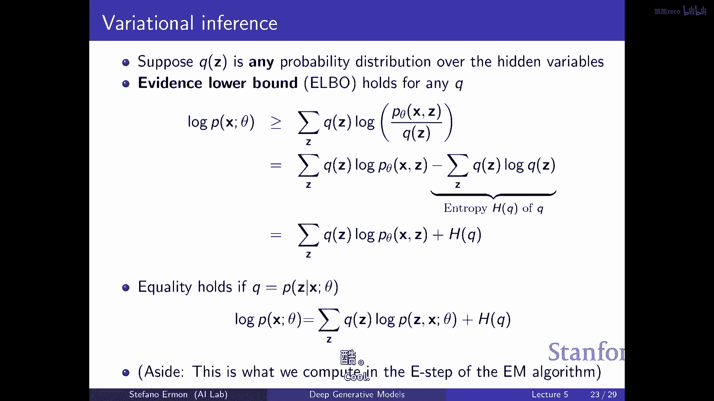

# P5：p5 Stanford CS236： Deep Generative Models I 2023 I Lecture 5 - VAEs - 加加zero - BV1NjH4eYE1v

今天的计划是讨论潜在变量模型，作为回顾，我们已经看到的是生成模型的第一种家族，所以自回归的，嗯，其中关键的想法是我们使用链规则来描述联合概率分布，作为条件的乘积。

然后我们基本上尝试使用某种神经网络来近似条件，我们已经看到了几种这样做的方法，包括rnn，cnns，一天结束时的变压器，核心理念实际上是这种对外部侵略性因子的联合分解，我们已经看到自回归模型是好的。

因为它们给你访问可能性，相对容易评估任何数据点的概率，你只需要乘以条件，这意味着你可以通过最大似然来训练它们，你可以，你知道你有一个训练数据集，你可以评估你模型分配给数据的概率。

并且你可以优化你概率分布的参数，以最大化你数据集的概率，你，你被给予的，并且你可以使用似然度来做其他事情如，例如，异常检测，类似于自动回归模型的缺点，首先是你必须选择一个顺序，有时它很容易做到。

有时候它可以是，确定正确的顺序来构建链规则可能会很困难，你打算使用的排序是什么，以便构建链规则，因式分解生成速度慢，即使你使用允许你计算所有条件的架构，基本上在并行中，像变压器一样，挑战在于。

你需要生成基本上一个变量一个变量，这可能会慢，另一个问题是，它并不明显，如何从无监督数据中提取特征，这就是我们要看到的，是我们将能够使用潜在变量模型做到的事情之一，所以今天的计划是覆盖。

开始谈论它和变量模型，我们将从简单的模型如混合模型开始，然后我们将，嗯，开始讨论变分自编码器或vae的讨论，我们将看到如何当你有潜在变量时进行推断和学习，所以，建立或使用潜在变量模型的高级动机是。

"当你试图建模一个复杂的数据集时"，例如，"像这样一张人的图像数据集"，"这个问题通常很难，因为需要处理的变异性很多。"，"你必须捕获"，例如，在这种情况下，你知道可能会有很多变异性。

"因为每个人的年龄都不同"，"人们有不同的姿势"，人们有不同的头发颜色，眼睛颜色，因此所有这些事情都导致非常不同种类的，就像数据集中的像素值一样，因此，问题在于如果你 somehow有了这些种类的注释。

也许你可以提取，建模分布会更容易，因为你可以像，构建单独的模型，其中你基本上是根据头发颜色进行条件化的，或眼睛颜色，或者你拥有的年龄或其他属性，但是如果你没有一种注释，你所拥有的只有一堆图像。

尽管你相信你可以大致看到存在这种潜在的结构，但它没有被注释，所以如何利用这一点并不明显，因此，潜在变量模型的想法是基本上添加一些随机变量，我们将其标记为，Z uh，它们应该捕获所有这些潜在的变异因素。

所以即使我们只关心在图像中建模像素，我们也将在模型中集成许多其他随机变量，我们将这些随机变量称为潜伏的或隐藏的，因为它们在数据集中未被观察，我们只能看到这些像素值，x部分。

但我们看不到对应于变异性潜伏因素的值，嗯，通过这样做，所以我们有许多优势，我们将变得更加灵活，有点像，嗯，模型家庭，如果你能大致地适应一个模型，那么我们也可能根据像素值提取这些潜在变量，并且。

如果你在模型这些不同数据点共有的特征方面做得好，那么你可能会使用这些特征来做其他事情，你可能，你知道，尝试预测，你知道，如果你有一个分类任务，训练一个在这些潜在变量级别工作的模型可能会更容易。

相对于直接的像素值，因为往往你可以，你知道，你可能只需要少数几个潜在变量来描述更多的，高维数据集，如图像，例如，所以，高级排序就像是，试图稍微正式化一些这种直觉。

我们要做的就是我们想要有一个x和z之间的联合概率分布，这些基本上是我们在图像中所有像素值的集合和潜在变量，所以这里我显示了x，意味着它是观察到的，而z变量是白色的，它们是未阴影的。

因为这基本上意味着对于每个数据点，我们无法看到，我们无法，我们对应的潜在变量没有注释，从概念上，你可以这样思考，可能看起来像这样的贝叶斯网络，其中包含你可以看到的像素值，然后有一堆变异的潜在因素。

这将有助于描述你可能在你的数据集中访问的不同类型的图像，在你的数据集中，嗯，你知道这些潜在变量再次，它们可能对应于这些高级特征，然后嗯，如果选择得当，你将获得许多优势，因为它可能更容易建模p(x|z)。

与边际分布p(x)相比，如果你能够某种方式聚类数据点并将其分为不同的组，然后单独建模属于每个特定组的图像，这有点像这个p(x|z)会做的，因为在那个点上，你有要捕获的变数要少得多。

一旦你条件于这个潜在特征表，并且你有访问的另一个好处，如果你，如果你这样做，那么，如果然后你试图推断新数据点x的潜在变量，那么你就可以像识别这些特征一样，所以再次，这有点像朝着表示前进，学习角度，或。

你知道，计算机视觉作为逆向图形，某种方式，如果你有一个能够基于一组潜在变量生成图像的生成性模型，如果你能够推断出这些潜在变量，然后嗯，你可能发现一种特征结构，你可以用于不同种类的问题，而且嗯。

问题是你知道这可能非常难指定，比如像这样的图形模型，并指定所有条件和所有通常的情况，而不是采取我们 here 拥有的图形模型视图或贝叶斯网络视图，我们将尝试使用深度神经网络来做这项工作，对。

所以我们接下来要做的是，我们仍然会保持这种结构，其中我们有一组观察变量x和潜在变量z，但我们不再有任何可以解释的，比如随机变量如何相互关联，或者它们意味着什么，嗯，我们只是假设存在一组随机变量z。

它们有些简单，例如，它们可能按照简单的高斯分布分布，然后我们再次模型x给定z的条件分布，基本上使用某种类似于深度生成模型的方式，我们有一个简单的分布，让我们假设是一个高斯分布，但是。

这个分布的参数依赖于一些，以某种可能复杂的方式依赖于潜在的变量通过，让我们假设有几个神经网络，Mu theta和sigma theta，这些基本上给我们提供了x的均值，和标准差，我们应该期待的。

给定潜在的变量取一个特定的值，所以再次，嗯，因为到这个点，他们没有预先指定任何语义的变量，然后，我们基本上是希望通过拟合这个模型，嗯，假设是最大似然，我们最终会某种程度地发现有趣的潜在结构，像往常一样。

这基本上，你知道，这是一个无监督学习问题，所以这就有点像定义不明确，因为你知道，结构有意义意味着什么，我们在这里实际上在追求什么，这不是显而易见的，但是直觉是希望，通过尝试使用这些潜在变量来建模数据。

我们可能会发现一些有趣的结构，一些有趣的，嗯，x和z之间的一种联系，嗯，这将首先使学习更容易，因为我们能够使用像高斯分布这样的东西来建模图像x的分布，然后你知道，通过推断潜变量，给定观察到的一个。

给定x，我们可能发现一些有趣的，嗯，特征，然后我们可以使用这些特征来分析数据，进行迁移学习，学习，你想要什么，你能看到如何如何我们，如何成功地更新数据变量，所以问题是，我们如何改变z。

但当我们拟合神经网络时，是的，所以我们将看到如何进行学习，这是挑战，挑战是z变量在训练时不被观察，因此，不清楚你应该如何更新这个神经网络的参数，这基本上给你x作为z的函数，当你不知道z是什么时。

所以你直觉上必须像，猜测给定x的任何z值是什么，你将使用某种程序来尝试拟合这个模型，如果你见过，它将有m像的味道，我们试图猜测潜变量的值，然后尝试拟合模型，所以，这里的图像x是否被积极地生成。

问题是x是否被积极地代表，在这种情况下，没有积极结构，所以x给z只是正态分布，所以非常简单，这个正态分布的参数是通过可能非常复杂的非线性关系确定的，与z有关，正如我们将看到，尽管p(x|z)非常简单。

只是正态分布，你永远不会期待一个单一的正态分布，足够灵活来模型任何有趣的事情，因为你知道你有这些潜变量，如我们之前讨论的，如果你能够以某种方式聚类数据点，那么，就像这样，在一个簇内，然后，在这个簇内。

就像这样，这个对象是什么，你可能能够用非常简单的分布类型来逃脱，这就是隐含变量模型的基本思想，在上一节课中，我们讨论了如何基本上将这些联合分布重构为这些个别条件，然后学习这些个别条件的网络，对吧。

像这些个别条件通常不是用高斯分布，或者是像其他方法，像一类常见的方法，我们在哪里使用，就像大多数任务和像，也然后这些我们为平均值和变异性有的模式它们是像，是这个模型吗。

还是像对于每个条件是一个不同的模式，是的，所以问题是，你知道，嗯我猜想是什么种类的缪斯和z，嗯，我们在这里使用哪些函数，并且它们是否对于每个z都不同，在这种情况下，函数是相同的，所以有一个单一的函数。

那就是当你插入不同的不同z值时，它将会给你不同的输出，所以函数是固定的，另一个问题是，它必须必须是高斯分布吗，不一定，你可以在那里使用自回归模型，如果你想要像潜伏变量模型的策略一样。

是用来通常选择这些条件式的，因为再次你有这种簇类的行为，所以你可能能够用给定z的简单p(x)来逃脱，但你可以肯定这种有点像混搭，这是这门课程的一部分，通过替换给定z的p(x)。

你可以得到一种不同的分布式模型，以一个自回归模型来替换，它将给你更多的左边，但是变分外编码器的故事是保持那个的，我可能没有完全理解，但是能否你能够稍微澄清，就像大图片的激励一样。

我们为什么想要基于z和像这种情况下的x来建模p(x)，所以目标如往常一样，所以问题是，我们为什么需要基于z和x的p(x)，所以目标总是只是建模p(x)，所以这与名词回归模型的情况相同。

你想要能够对这些x变量拟合一个概率分布，这些是你可以访问的像素，使用z变量的动机无论如何，好吧，一种，这可能会使你的生活更容易，从意义上说，如果你能够 somehow 使用 z 变量来聚类数据。

那么学习就会变得更容易，第二个是，能够推断出潜在变量本身可能有用，因为实际上你可能追求的不是生成图像，而是像理解你数据集中存在的何种潜在变异因素，所以这里优先级越高，在这种情况下就非常简单。

就是正态分布，是的，你可能有更复杂的先验，如何直观地想到这边的独特特征，是不是一种方式，可以大致了解这些学习特征是什么，是的，所以我在说，大致就是这样，你知道你只是希望发现一些有意义的东西。

一旦你训练了模型，你可以当然进行测试，你可以当然改变，假设一个 z 变量，看一下它对你生成的图像有什么影响，所以你可以当然测试你是否发现了一些有意义的东西或不是，它可能不是，你知道可能不是。

你发现一些有意义的东西或不是，并不保证由学习目标决定，嗯，它是由多个潜在变量组成的，只是一个超参数，所以问题来了，是的，是潜在变量的数量，是一个超参数吗，是的，所以在这个模型中，如何处理所有影响。

并且基于这些进行条件，是的，所以在这个模型中，如何处理所有影响，并且基于这些进行条件，嗯，所有的效果，并且基于这些进行条件，是的，所以我很困惑，我们如何，我们。

我们 supposed to stand tall and then go，那就是它，是的，所以问题来了，如果我们使用这种模型，我们如何采样，我们如何做那个估计，采样很容易，因为你做的只是首先采样。

因为什么你只是首先采样，这可以被视为一个对两组变量的自回归模型，疾病和轴，所以，你会做的事情是你首先会选择一个变异的潜在因素，所以你从高斯中采样z，我们知道如何用简单的方式做，然后。

你将z通过这两个神经网络，并得到均值和协方差矩阵，然后，那定义另一个高斯，然后，你从高斯中采样，所以采样非常容易，评估x的p值，我们将看到，这是挑战，这有点像免费午餐的部分，一切都看起来很好。

我接受评估x的p值，这是关于估计变得不容易的时候做的事情，这有点像，接下来要出现的是什么，是的，这不像端到端的可微，是的，所以问题是这是否可微，我们如何训练它，是的，这将是这次讲座的主题，是的，好的。

让我们先作为热身，类似于你可以想到的最简单的潜在变量模型，你可能以前见过作为高斯混合的，所以再次，我们有这个简单的贝叶斯，贝叶斯网z指向x，你可以认为高斯混合物是一个浅层的潜在变量模型。

其中不涉及深度神经网络，在这种情况下，z只是一个类别随机变量，它确定混合物组件，假设这里有k个混合物，然后，给定z的p(x)又是高斯，在这里，你有一个查找表，它将告诉你混合物组件k的均值和协方差。

这个k混合物，因为我们有k个均值和k个协方差，这定义了一个生成模型，所以再次采样，你将首先采样混合物组件a的z，然后，你将从与相应均值和协方差对应的高斯中采样x，所以它看起来像这样，如果x是二维的。

所以有x一个和x两个，然后这些高斯分布将是二维高斯分布，并且这些高斯分布将有不同的均值，所以我说你一个，你两个和我三个，它们将有不同的协方差，所以可能会看起来像这样，嗯。

所以生成过程再次是你选择一个组件，然后你从那个高斯中采样一个数据点，也许你均匀选择，或者任何是前面的概率分布，Z，也许你采样kk，你可以采样z，你得到两个。

然后你必须从一个根据这里均值为中心的高斯分布中挑选一个点，并且协方差形状像这样，等等，嗯这又有用，有点像，如果你考虑聚类解释，你可以想，嗯，这种模型可以视为你执行聚类的一种方式。

或者可以说是一种基本的无监督学习任务，这是一个例子，你有一个数据集，嗯，收集用于黄石国家公园的老忠实间歇泉的，然后这里的每个数据点都对应一次间歇泉的爆发，然后你可以看到这里有两个特征。

爆发的持续时间和两次爆发之间的时间，你知道数据集看起来像这样，所以你可以看到这两者之间存在某种关系，并且两次爆发之间的间隔越大，接下来的爆发就越长，你试图使用单个高斯模型来模拟这个，如果你拟合参数。

它会看起来像这样，你会在这里放置平均值，你会选择一种协方差，类似于，捕获特征之间的相关性，你可以看到它做得并不好，就像你在没有实际数据的地方放了大量的概率质量，但这就像是你能做到的最好的。

如果你被迫选择高斯模型，但如果你看数据，它看起来像有两种类型的爆发，有一种类型行为像这样，另一种类型行为像这样，所以你将对数据有更好的拟合，如果你有两个高斯，一种由两种高斯分布组成的混合物，有点像。

看起来那样，如果你能 somehow 自动地拟合这个模型，嗯然后通过推断 z 变量给定 x 找出，如果一个点属于蓝色或红色的混合物，你可以 kind of like 识别你正在处理的哪种类型的爆发。

所以再次，这是关于基于观察数据的特征识别的一种想法，再次你可以看到它是这种 kind of 不良定位，因为它是无监督学习，"我们期望发现一些有意义的结构"，"但是，这并不是总是可能的"。

"找到好的结构并不清楚意味着什么"，或者你知道什么是一个好的聚类算法，正确，"你可能对什么是一个好的聚类有不同的定义"，"这将给你一个聚类"，"无论那是你想要的"，或者，最好的一个并不一定被保证。

"所以是的"，你可以想象，你可以用它来做无监督学习，你可以有更多的混合组件，你有一个数据集看起来像这样，然后你可能想要，你知道，建模它，让我们说，使用三个高斯混合的组合，再次，有点像识别混合组件。

这里的颜色是什么，我会告诉你大致是哪个组件的数据点来自，它告诉你如何以不同的方式聚类数据点，猜测这是否感觉非常困难，嗯，比如图像分类，所以问题来了，是的，在图像上失败非常严重，你可能不会期待。

除非k非常之大，如果你有类似的，我说一种混合两种高斯分布的方式，那么假设你有一个单一的高斯分布，那么你会选择平均值作为所有图像的平均值，然后添加一种标准差，你可以想象你将得到一个球体，它不会很好。

即使你能够将你的训练集，分成两组并拟合两个单独的高斯分布，仍然不会工作得很好，如果k变得极其大，理论上你可以近似任何事情，所以最终它会工作，但是嗯，在实际应用中，它需要一个极其大的k，酷嗯。

这里是实际上的一个例子，再次在图像数据上，这是关于mnist的，并且这是关于像样的潜在空间，Z是该空间的投影，但你可以想象，一个轴是z1，另一个轴是z2，然后，你将mnist数据集，然后。

你试图找出每个数据点在哪个数据点中落地，它在这个空间中落地的地方，你可以再次看到，它能够做一些合理的聚类，在意义上，实际上属于同一类的数据点，你知道，这个生成模型并不知情，例如。

这里的红色点对应于数字二，你可以看到它们像是被分组在一起，它们所有的z值在训练这个模型后都是相似的，所以你知道，这里有没有关于二的单一簇，有一种两种，也许这个簇的风格与这个簇的风格略有不同，我的意思是。

很难确切地说这里聚类的工作在做什么，再次，它暗示了无监督学习的困难，但这是关于你可能希望的直觉，如果你试图在图像数据集上进行这个，你可能希望发现不同的类，你可能发现不同的风格。

你希望自动地发现这通过拟合潜在变量模型来实现，并只看看您发现的z的值，我没有同时工作过浅层和深度模型，您如何学习这些后验分布，是的，所以问题来了，您如何学习它们，我还没有谈论过它，它将要来。

我们将讨论这个，是的，在这个讲座中，为了将维度减少到两个维度，然后您绘制了，但实际上，它看起来更好，如果，它更有意义如果你首先进行维度减少，然后尝试学习高斯混合的组合，看起来更像它可以这样表达。

所以这里没有学习到高斯混合的情况，所以这有点像展示的，这更像是深度生成模型训练的结果，其中疾病甚至不是类别的，像这里的疾病变量是或像高斯，或或像实数值的，所以我在这里绘制的是每个数据点。

对应的推断值是多少z，它不再是一个数字，它更像是这个二维空间的一个点，而且刚好它找到了一些合理的东西，嗯，但是再次，这不保证，是的，所以当我们从水龙头开始采样时，我们将其归一化为某种马的平均偏差。

但在这种情况下我们可以做的一件事是降维，然后我们在 đó拟合一個模型，以然後有 tmc，來自不的樣本，是的，是的，所以我认为问题在于，我想在我这里有的模型中，z的p是一个简单的分布，比如正态分布。

也许如果你看看这个潜在空间，例如，这并不是一个va，我认为，但是那就是为什么它可能看起来像高斯分布，它有许多洞，因此你可能更好有一个高斯分布的混合，例如对于z的p。

你可能实际上尝试将z的p作为模型的一部分来学习，你当然可以做到这一点，酷，所以另一种动机是它是一种非常强大的组合简单模型的方式，并得到一个更表达的一个，例如使用潜在变量允许你有这种混合模型行为。

这是一种非常良好的构建非常灵活的方法，有点像生成模型，而且在例子中的，高斯混合的，如果你有三个高斯，一个蓝色、橙色和一个绿色，你知道，你可以看到他们有不同的均值和不同的标准差。

所以他们都有所有这些钟形曲线，如果你考虑对应的边际分布在x上的形状，它有一个非常有趣的红色形状，所以即使每个单独的组件都很简单，它只是钟形曲线，而且你不能做太多来改变函数的形状，当你开始混合它们时。

你可以得到更多有趣的概率密度形状，原因是当你想要评估这个混合模型下的概率时，数据点x的概率，那是什么对象，你需要说的基本上就是边际，在蓝色曲线下生成那个点的概率是多少。

再加上在橙色曲线下生成那个点的概率，再加上在绿色曲线下的概率，你知道，这就是边际概率的定义你整合，你边缘化出z，在这种情况下，联合只是看起来像这样，其中p of z只是分类分布。

并且p of x given z又是非常简单的，只是具有不同均值和标准差的高斯，所以你可以看到，尽管p of x given z的组件非常简单，只是高斯，你得到的边缘，在形状上更有趣，这有点像。

你可以这样思考为什么这些变分编码器如此强大，因为它基本上是一样的， except 现在你不再有一个有限的混合组件，所以z变量不再是分类随机变量，一、二、三、四、五k，现在z可以取无限多个不同的值。

有一个高斯分布你从中采样z，所以可以说你有一个本质上是无限数量的混合组件，尽管p of x given z仍然是高斯，现在我们有一个无限数量的高斯的混合，所以我们失去了那种像，嗯。

在这个混合高斯混合模型中，我们以前能够选择这些高斯的均值和标准差，任我们想要，因为你基本上有一个查找表，所以你有完全的灵活性在选择均值，和标准差这些高斯时，在vae世界中。

所有这些高斯的均值和标准差并不是任意的，它们被选择通过将这个z喂入神经网络，通过两个神经网络，让我们说mu和sigma，这些高斯的均值和标准差并不是随意选择的，它们由通过这个神经网络喂入z来选择。

那基本上会给你该高斯组件的平均值和标准差，现在已经没有查找表，现在是你可以描述的任何，使用神经网络，所以描述有多难，嗯，然后对于另一个警告，我从工资中得到的，嗯，所以基本上z可以取无限多个值。

因为这个会继续，在我能取k个不同值之前，是的，你喜欢制服，问题是，是的，我们不能直接用均匀分布吗，是的，你可以，这只是我在展示高斯分布，但是，是的，均匀分布可以工作，是的，所以z是他们包括神经网络。

所以我的意思是我们首先从mc采样，然后神经网络采样，采样过程，它将与以前相同，就像在高斯混合模型中，你选择一个组件，采样z的值，然后您进行查找，您获取均值和标准差，然后您从高斯分布中采样。

这里的采样过程相同，您采样一个z，现在是高斯分布，然后您将其通过两个神经网络以获取均值，和相应的高斯分布的标准差，然后您从x的p中采样，Q和z，所以你从具有假数据的高斯分布中采样，那不是。

对混合为什么有意义有些困惑，比如假设你有一个对应于六的独特簇，另一个对应于七的簇，你现在正在创建一个介于两者和现实之间的混合，可能没有数字，那是六和七之间的一半，所以为什么在实际应用中这更有效。

在金融之外，什么比混合更好，是的，所以，我的意思是，你知道，你想要它离散吗，我想或者继续，你知道，如果你试图建模，有点像离散的种群，这样做对不对，嗯，是的，你说得对，这有点像你的连续。

所以你有一些方式从群组中过渡，这可能或可能不有意义，它可能需要找到一种奇怪的变异轴来使这发生，你也可以有离散和连续的混合，这就是vae使用的设置，在实践中通常工作得很好，我想，直觉上意味着有许多服装。

嗯，我的意思是，直觉上，它只是意味着z不再是一个类别随机变量，所以没有有限的选择可以制作，但它更像是我在这里的，你知道，z变量可以取这个二维空间的值，所以甚至没有必然的概念，嗯。

或者你必须在这里或这里选择，你可以像处于中间一样，它是像一点一样，无论是3。2还是什么，是的，不，是的，因为uz是正态分布的一部分，嗯，这意味着，就像我，它是一些可能变量的平均值。

或者是在所有轴上的所有东西，嗯，你有一个问题，是的，你能解释像c的平均值吗，那就是一些平均值，像所有数据的代表，是的，在某种程度上，是的，然后通常平均值是零。

所以你基本上是迫使所有数据点的潜在表示的平均值，被中心在零上，所以是的，我的意思是，这取决于训练目标，但是，使用我们在这次讲座中看到的训练目标，是的，那会是效果，当你在分布中对z有一个类别表示时。

它是否像类别之间均匀的概率分布，嗯，是的，问题是，混合高斯中的z，z是否必须均匀分布，它不需要知道，你可以好奇为什么，它如何对你在这里成为一个正态分布起作用，或者是相对于均匀的。

或者是你选择似乎成为一个正态分布的方式，是的，所以这有点像一种，在某种程度上是一种任意选择，就像你可以选择其他先验，有点像，关键的洞察是，它只需要是一种简单的东西，是你将从其中采样的效率高的东西。

并且给定z的条件概率p(x|z)也是那种简单的东西，我在这里使用高斯，但你会使用逻辑的，像因子化的逻辑，或者是它可以是任何东西，只要它是简单的，所有的复杂性实际上都在这些神经网络中。

它将会找出如何映射参数，如何将潜在变量映射到这个简单分布的参数，你将得到不同的结果，取决于你的选择，这有点像最简单的高斯和高斯，但是，在gmm中，我们有，嗯，对于每个值c都有一个神经网络，或者是我们有。

这将是一个用于主要一个的，在gm中的主要指示，并且没有神经网络，它是研究的，所以这是一种你可以想到的最灵活的映射方式，因为你被允许为z可以采取的不同值选择任何值，所以它更像是一个贝叶斯网络世界。

你在那里被允许，它是一个查找表，这很棒，因为它非常灵活，它不好，因为它不扩展，当你有很多很多的时候，那么如何适应它，是的，我会很快看到，所以嗯，只是澄清一下，我们将更新之前的电脑。

在我们这个世界的团队中，我们是这样的，我假设之前的已经修复，关于参数的学习通常没有，关于参数的学习是theta，在这种情况下，将是这两个神经网络的参数，你可能有一个非常简单的，一个非常浅的线性神经网络。

从哪里获取平均值，你只需要对z变量进行线性组合，然后应用一些非线性，然后你知道另一个简单的神经网络，这将给你协方差矩阵的参数，可能是主对角线，像这样，我只是想要澄清直觉，所以确保你说。

你在对一堆正态分布进行求和，切换到这里，你说你可以将这个求和表示为一个正态分布，你直接预测这个正态分布的免疫和方差，所以边缘，我会看看是否有，所以边缘基本上成为一个积分。

所以不像是对所有可能的d进行求和，你有对所有可能z值取值的积分，但它是同样的机器，是的，嗯，在实际应用中，d的维度可能是比x低得多，也可能是高得多，好问题，是的，所以z的维度在实际应用中是多少。

通常z的维度会比x的维度低得多，我们希望，是的，你可能发现描述你数据的几个潜在因素变数，我会训练它，是的，我们很快就会讨论，是的，即使t大于像维度这样的东西，它需要超过x，是的。

我们将看到另一种生成模型，它基本上与这个相同，除了z的维度与x相同之外，例如，扩散，一个扩散模型可以做到这样，但现在你可能不一定总是想要减少维度，具有相同的维度将允许您具有良好的计算属性，嗯，是否可能。

将更多的信息放入火中，我想，只是我知道，一些喜欢站立的人，是的，是的，你可以获取更多信息，我认为可以从两个角度来看待这个问题，一种是如果先验更复杂，比如不像有高斯分布。

你可以在潜在变量上放置一个自回归模型，你将得到一个更加灵活的分布类型，另一种方法是如果你已经对类型的先验有一些知识，你知道，也许你知道存在大量的类别，有一千个类别或十个类别。

那么也许你想要有一个分类随机变量，所以如果你有一些关于你希望在数据中存在的潜在变异因素的先验知识，你可以期待这些因素存在，你可以通过选择合适的先验来捕捉这一点，所以，你的影子，模型。

你的钱币数量等于这里，因为这是一个正态分布，你的数量k是那是，酷的，所以然后那么什么你会做，那么，如果你试图以某种方式将此模型拟合到数据中，在这种情况下，你可以从选择的参数中。

你可以选择的都是这些神经网络，这两个神经网络的参数，如你，再次， takeaway 是一样的，如高斯混合模型，尽管给定 z 的 x 概率 p 非常简单，它只是高斯，你在 x 变量上的边际非常灵活。

有点像一个大型混合模型，所以这就是一种总结，两种思考它的方式，一种是将复杂的边际分布定义为简单的条件分布，然后，使用潜在变量的概念来像聚类数据点一样处理数据，再次。

像能够通过相对简单的条件分布来建模它们一样，一旦你在前一张幻灯片上聚类了他们，或者有了协方差矩阵，我们为什么实际上知道，哦，只是因为它必须为正，某种东西，并且就像背面，是的，这又是一个建模选择。

但你可以这样做，酷，现在我们将看到足够的信息来准备午餐部分，与外部侵略性相比，学习这些模型将更加困难，我们之前见过的完全观察类型的模型，问题是基本上你具有缺失值，所以有点像，发生的事情是这样的。

想象一下，你还想训练一个自回归模型，但现在你的一些数据是缺失的，所以你仍然想要填充一个回归模型过像素值，但现在你不知道图像的上半部分的值，所以你需要做得好，这里有两个随机变量集，有部分你可以看到。

然后有部分你看不到，那是隐含的，然后有联合分布，所以，你的像素CNN将告诉你x变量和z变量之间的关系，所以你可以选择，你知道你可以完成绿色部分，缺失的部分任你怎么填都可以。

假设你的自回归模型将告诉你完整图像的可能性，因为你有一个关于z和x的联合分布啊，挑战是，你知道你只能看见观察部分，所以你只能看见x部分，所以你需要能够评估观察到的可能性，嗯，让我们说这个数字的下半部分。

为了再次做到这一点，我们需要边缘化，所以你基本上需要查看所有可能完成那幅图像的方式，你需要对所有这些可能的完成进行求和，尽管联合是容易评估的，因为它可能只是条件的乘积，或者在VAE的情况下。

它是两个高斯产品的乘积，基本上你有这种行为的混合，就像在混合高斯中，当你想要评估超过超过，仅x部分的概率时，你需要，你需要对所有事情进行求和，所有可能的nobbs over，所有可能的未观察到变量的值。

你需要查看所有可能的完成永远，并检查不同完成的可能性如何，然后您将它们相加，就像在混合高斯情况下，您需要计算每个混合组件的概率下的总和，相同的事情，问题是，可能有太多的可能完成，就像在正态分布的混合中。

也许你只有有k个可能的值，z变量可以取，所以这东西很容易评估，你可以简单地暴力破解它，但如果你有一种高维的，就像潜在变量，Z这个和可以极其昂贵地评估，你获得灵活性因为你混合了很多，分布。

但然后你付出代价因为它很难评估你已知的量，那就是6，你想要在这井上撒些吗，你计算所有可能的完成情况，所以你必须放，你将所有所有的白色像素放在一起，然后您检查这可能非常低的可能性。

然后您尝试所有可能的黑色像素，然后您将尝试所有可能的组合，然后您检查这些可能性中哪一个的可能性最大，您将它们相加，而不是让z成为完整的完成，z能否仅仅是一些数字，就像真正的数字，我的意思是。

就像你可能知道的真相，那就是九或六或什么的，是的，是的，在这种情况下，你将有一个小变量，这可能是类别的，这就是你要做的，是的，如果如果你试图推断像数字身份一样，酷的，嗯，在一个变分山丘部分。

你有同样的东西，嗯，在训练时间，z的观察值不可用，所以，在训练时间，你只能见到x部分，所以，当你想要评估观察特定x的概率时，你基本上必须遍历所有z变量可能取值的可能值。

并且你需要找出我生成特定x的可能性有多大，而且z变量甚至不是离散的，所以如果你想评估生成特定x的可能性，你需要实际上对z变量可能取值的所有可能值进行积分，你需要遍历z变量的所有可能选择。

你需要看它映射到什么，你将检查在那个高斯混合组件下的概率，然后您再次将它们整合起来，你可以想象这超级昂贵，嗯，因为是的，特别是如果你有合理的潜在变量数量，维度诅咒，甚至要数值近似这种积分是非常昂贵的。

但这里是灵活性的来源，对无限数量的混合组件进行积分，这是因为我们需要考虑可能的原因，不仅仅是对于每个z，让我们只计算x的概率，是的，对于每个z，你可以做，你可以评估联合概率，就像这里对于每个z的值。

我可以评估x的p，逗号z，我可以检查z，我把它映射到我的直觉，通过神经网络，我得到一个高斯分布，我可以评估概率，这是因为我不知道那个数据点的z对应什么，对，z未被观察，所以我必须尝试所有的，就像这里。

就像，我只能看到底部部分，我不知道特定的图像的顶部部分是什么，我必须猜测我必须尝试所有可能的方式，所有可能完成那个数据点的方式，我必须将它们相加，疾病不是这样，哦。

所有可能的z视图如何与计算所有可能的相关联，为什么在这种情况下，我假设z变量代表顶部部分，未被观察的部分，酷，所以这有点像评估这个边缘概率x的挑战，你需要对z变量的所有可能值进行积分，嗯，所以像。

你有一个关于x和z的联合分布，对，我们正在考虑密苏里州的x_bar，所以你不知道何时到期，你想要预测最可能的是什么，我认为应该在那里，你将不得不遍历所有可能的，激动，嗯，点击这里。

你正在查看x等于xy的概率，现在，你需要所有可能的，但如果你实际上不知道训练数据点是xy，你实际上不会解决这个问题，所以这也可以工作，所以，我们将考虑的设置是数据集中一个情况，在那里，x变量总是被观察。

你也可以考虑一个设置，你有一些缺失数据，和一些的，你知道，一些的x变量是缺失的，你必须，是的，是的，所以在上一张幻灯片中，大写字母Z与，嗯，正态分布，是的，是的，嗯，所以我们必须，所以，而不是求和。

我们必须，我们应该怎么贡献来增长，像那样，我们将看到如何做，所以，这就是一种设置，但我们有一个数据集，但对于每个数据点，我们只能见到x变量，而z变量是缺失的，它们是未被观察的，嗯，然后。

所以你可以认为数据集是一组图像，x1到xm和嗯，我们想做的是，我们想要仍然做最大似然学习，所以，我们仍然想要尝试找到一组参数，那最大化基本上生成该特定数据集的概率，这是我们之前有过的目标。

让我们尝试找到θ，那最大化概率，的数据，最大似然估计和嗯，或等价地，数据点的平均对数似然，如果你应用一个对数，问题是，评估数据点在这种混合模型下的概率是昂贵的，因为你必须对所有可能的值求和。

那个变量可以取为该数据点，因此，评估数量可能会变得难以处理，就像一个例子，假设你有三十个二进制潜在变量，然后，嗯，这个和涉及到由于三十个项，所以计算这个东西太昂贵了，如果z变量只能取k个不同的值。

比如高斯混合模型，你可以做，你可以暴力破解它，但如果你有很多隐藏变量，你不能高效地评估那个数量，对于连续变量，你有一个积分，再次，这是一个难以评估的，如果你希望也许得到，我们只需要梯度，因为最终。

我们只关心优化梯度也是昂贵的来计算，所以试图在那个数量上进行梯度上升直接是不可行的，所以我们需要一些种近似，并且必须非常便宜，因为想想看，你需要能够多次遍历数据集，你需要能够，你知道。

评估每个数据点的梯度，可能很多次，所以这里的近似必须非常便宜，一种自然的尝试方法是尝试做蒙特卡罗之类的事情，基本上，这个量需要我们对所有可能的z值进行求和，相反，我们可以尝试只采样几个并得到近似。

这就是我们在上一堂课看到的通常配方，想法是，你可以，你知道我们正在尝试计算的求和，我们可以尝试将那个求和重写为期望，基本上，所以我们可以，你知道，如果存在可能的大z值，那就是这个，嗯，Z变量可以取的。

我们可以乘以和中的项数，然后除以这个和的总项数，然后，这个对象就变成了与均匀分布相关的期望，现在，我们可以应用蒙特卡洛，每当你有一个期望时，你可以用它的样本平均来近似。

所以你可以说让我们用样本平均来近似求和，所以本质上，你将随机采样大量的z值，然后，你将用样本平均来近似期望，所以，实际上，你将随机采样大量的z值，你检查在这些联合下这些完成的可能性如何。

然后您适当地缩放，这将因为嗯，你知道，您只需要检查k个完成而不是所有可能的完成，那是您需要处理的所有，是的，嗯，是疾病，现在我们看到，这只是所有可能值中再次看到您的一个子集吗，嗯，那就是所有可能值，你。

是的，是的，我只是需要一个集合，我们在采样，是的，所以我们从均匀分布中随机采样，然后缩放，这比我们从实际需要的东西中更容易处理，因为我之前有一个从身体中离散的，和一个较小的，这就是关键。

你可能只需要其中的k个，但它们可以是一个，最便宜的方法是在这里选择k个，只是采样一个，您看看这个完成的联合概率，然后适当地缩放，这将是一个对感兴趣量的有效估计者，在这里，您从均匀分布中采样。

我想当我们在上节课不想卷曲时，我们正在从概率分布的样本中采样，所以，我们有什么原因要像以前那样对待每个c一样平等吗，是的，只是因为我们有一些真的很，它是这样，如果你能看，我正在乘以和除以总事物数量。

这样，这就变成了与均匀分布相关的期望，这是技巧，基本上，我喜欢那个，那是问题，这就是为什么这不会工作，基本上，是的，是的，嗯，我只是在尝试理解尝试从均匀分布中采样z的 rationale，就像均匀分布。

这是因为因为我们知道我们永远不会看到z，所以我们基本上放弃了那个，所以我们只是去做，就像制服，这基本上是没有任何先验的，是的，所以这不是一个，我意思是你正在触及为什么，这不是一个伟大的解决方案。

这基本上是一个初次尝试，统一做事，它便宜，它是无偏的，但它在实践中不会工作，因为它基本上像什么，我认为，你所建议的是，如果你考虑随机猜测疾病，最有可能的是你，你不会击中，具有足够值的z。

就像在联合概率下的概率，所以通过随机选择均匀，你得到的大部分完成，没有意义，所以它们将具有非常低的p theta值，尽管这，从技术上讲，是一个无偏估计器，方差将如此之大，以至于在实践中不工作。

所以某种程度来说，就像，我认为我们，你建议，我们需要一种更聪明的方法来选择这些潜在变量，我们不想均匀采样，我们想要采样它们，试图猜测那些有意义的，嗯，抱歉，这基本上是一个大问题，当我们开始时。

你描述z作为i的重要特征，我认为像，当我们通常想到一个人可以具有的特征，如眼睛颜色和头发颜色，但我感觉我们到目前为止对待z的方式，就像是，像是一个类别，或像是一个群体的成员，所以像，例如。

甚至在变分自编码器中，就像是你选择一个介于零和一之间的标量值，但它就像是一个值，是，它们是，我们只是不喜欢在那里，但在喜欢不同模型的方面，我们将到达特征表示，或者是否，是的，所以问题，我的意思是。

我认为这是一个伟大的问题，并且它是，嗯，你知道这个疾病最终将代表什么，并且第一个问题，我们是离散还是连续的，这取决于你如何建模它们，这不太重要，嗯，无论它们最终代表什么重要的事情，像头发颜色或眼睛颜色。

这是值得质疑的，就在这里，我们只是在说，我们只是试图做最大似然估计，我们只是试图尽可能地拟合数据，我们将尝试使用这些潜在变量来拟合数据，这就是模型的目标，如果你使用这个目标函数。

你是否最终得到有意义的东西并不重要，嗯，这不一定被保证，你最终会得到一些潜在变量，这样如果你从它们中采样并喂给它们通过这个模型，你希望得到好的照片或好的结果，一个分布非常类似于训练集中的分布。

这意味着这些潜在变量捕获了数据中的重要潜在因素的变化，它们是否对应于某种语义上的意义，这绝对不能被保证，这回答了你的问题吗，或者嗯，不是很，但我只会再听一次，我相信有其他人有与你相同的问题，哦。

你想要再做一次，当然，抱歉占用大家的时间，我想想法子就像，即使有变分cu，我们从一个分布中采样z，但最终z就像一个标量值正确，是的，但我感觉当所有的时候，例如，使用mnist数据集，就像是嗯。

也许只是想回到分类z模型，你采样像是哪个数字，这是你试图代表的，然后那给你一些高斯分布，但如果它是像某人的照片，不是那种只有一类的情况，他们落入，有许多特征可以共存。

所以像某人可以有蓝色的眼睛和黑色的头发，某人可以有棕色的眼睛和黑色的头发，像我们在这里如何代表它，或者是否我们没有代表它，但我们在某种程度上是，除了事实是他们可能不具有意义。

但我们正在使用多个潜在变异的因素，所以每个x基本上都会被映射，我想有很多，但是有许多不同的z的向量可以生成那个特定的x，有一些比其他的给定x更有可能，当你试图推断z给定x时。

你基本上是在猜测这个特定数据点的潜在特征，如果你看看你得到的结果，你最终会得到一种柔软的，如果z变量是连续的，那么你不会得到一种离散的聚类东西，你会得到两个值，你会得到一个点，5。5。

像这些黄色点最终会有z，一个点大约在5。5点左右，它没有特定的意义，除了所有对应于那个类的点，数字最终都会有相似的z变量的值，我并不是在回答问题，所以如果我理解得对，你现在正在处理的。

不一定是一个标量因素，所以像z向量的第一个元素的向量，如果它合理，它可以像颜色，这不会是颜色，是颜色的组合，是的，是的，我真的想要，是的，是的，是的，所以没有单个的z，有多个z就像。

在这种情况下有两个z，一个是z1，另一个是z2，他们捕获到变异的一些显著因素，那么是的，这就是你面临的问题，我在这里有的你有30个二进制特征，那是你的二进制潜在特征，它们可以 all 只能是零一。

然后你有两个到三十，基本上不同的簇分配可能性，然后你不能将它们相加，基本上这就是问题，疾病的语义意义，你能做些什么来增加，比如他们是否独立，或者是否基于参数，是的，所以如果你尝试。

有一个整个领域像解耦表示学习，人们在尝试许多不同的方式来尝试解决这个问题，提出模型，其中隐变量具有更好的，更有意义的表示，不幸的是，有定理表明在普遍情况下无法做到，实际上。

人们已经能够做到以获取合理的结果，但你可以做到的一些基本限制，因为问题本质上是欠定的，解耦表示，考虑一个例子，我们有三十个二进制的隐变量，所以我们有三十天，我们也看到这三十天遵循正态分布。

或者像每一天都遵循，所以这，如果这些是离散的，那么它就不可能是正态的，它将像它们每一个都可以从一个简单的伯努利分布中来，嗯，如果它可以是一个高斯随机向量，在这种情况下，你将有积分，两个情况都相当困难。

因为，是的，所以像大图问题，所以如果我们有我有的数据集，标签，并且我可以说因为我们在这里，就像我们正在利用这些潜在变量，尝试使计算边际分布更容易，对，所以我只是在尝试思考，联系，是的。

所以我猜测这里有两个答案，如果偶尔你看到z值，也许你有一个愿意为这些事物标记的注释者，你可以基本上想象你可以，修改这个学习目标并不难，你知道，当你知道那个变量的值时，你不对它求和，你只是插入真实值。

所以你可以做一些半监督学习，其中偶尔这个变量被观察，有时它不被观察，我们以面向学习的方式进行，是的，这是纯粹的，但是很容易调整，非常容易调整到这个，有时看到变量，或者用符号表示变得丑陋。

因为那时你有一些点有它，一些你没有，但它可以学习一些具有语义意义的线性变量，或者它们不能，它就对了，但如果你有标签，这是一个很好的方法将它们引导到你想要的方向，酷，所以好，所以这是大多数情况下的设置。

你可以尝试许多，你知道，随机变量的选择，希望得到一些东西，但这不太可能工作，因此我们需要一种更好的方式来猜测每个数据点的潜在变量，所以做这件事的方法是使用叫做重要采样的东西，而不是均匀随机采样。

我们将尝试更频繁地采样重要的完成，记住，这是我们想要达到的目标，是边际概率，你必须对所有可能的潜在变量值进行求和，我们现在可以做的是乘以并除以这个q的z，其中q是您可以使用的任意分布，以选择完成。

以选择潜在变量的值，你知道，这是一个，所以乘以并除以q是可以的，我们再次回到设置，我们以q的期望来计算这个比例的概率，在真实模型下的概率和在您使用的提议分布下的概率，或者您用来填充的方式。

对于潜在变量的，对于潜在变量的，对于潜在变量的，现在，我们可以再次做蒙特卡洛，我的意思，这仍然只是一个期望，一般来说仍然难以处理，但是我们可以尝试做通常的伎俩，让我们采样一堆z的。

现在我们不均匀地采样它们，我们按照这个提议分布队列采样它们，这可以是你想要的任何东西，然后，我们像以前那样用样本平均值来近似期望，现在，样本平均值有这，嗯，这个，等待你需要在分母中考虑的重要性权重。

因为期望表达式中有这个队列在分母中，所以我们必须把它放在这里，所以它非常大，是一些事情，所以，我们现在将看看你如何选择它，目前这个工作，无论你如何选择q，我认为q的一个好选择是，像，直觉上。

你想要将概率质量放在可能位于联合分布的疾病上，你想要，在某种程度上能够采样出有意义的疾病，所以你有一个当前x和z之间的联合分布，你想要选择那些有意义的疾病，那些生活，那些与您观察到的一致的完成。

这并不意味着你只是在从c中采样，理想上想要从给定z中采样，所以这是为了一个特定的数据点，所以我正在为一个单独的行动做它，你完全正确，这个q的选择必须依赖于x，取决于你所看到的，但对于现在。

这是一个单个数据点，所以我可以有一个单一的队列，它应该工作，无论，基本上，你怎么选择q，这是一个无偏估计器，意味着即使你选择了一个样本，我们知道这，我的意思是，样本平均值的预期值是，我们想要得到的对象。

所以，或者等价地，如果你想这么想，你可以说如果你重复这个实验，一个非常大的数量的时间，一个结果的平均值，你将得到真正的，真正的值，所以这是一种合理的，嗯，大概的估计，嗯，现在，问题是。

轻微的问题是我们关心的不是数据点的概率，但我们关心的是数据点的对数概率，记得，我们关心的是优化数据点的平均对数似然，因此，我们需要对这个表达式应用对数，因此，我们可以尝试在等式的两边都应用一个对数。

从而得到对数似然度的这种估计，但是，有一个问题，所以，例如，如果你选择了一个数据点，一个样本，所以，如果k在这里是1，所以你只是采样一个可能的完成情况，然后评估那个，嗯，那样估计的。

所以只是两种概率的比率，你可以看到那种，啊，这已经不再是无偏的，对数期望不等于期望对数的对数，所以取这个的期望，嗯，这里有一个对象，尽管这里右侧的预期是我们想要的，嗯，当你应用一个对数，存在偏差，嗯。

那就是，有点像，我们实际上可以找出偏差，所以记住我们想要的是这个，我们想要日志边际概率，这可以写成这种重要的采样类型的分布，我们知道日志是凹函数，这意味着如果你有两个点，X和x'。

如果你取这两个点的组合并评估日志，这高于两个函数值的线性组合，这意味着由于凹性性质，我们可以基本上计算出如果你，如果我们交换对数和期望的顺序，所以如果我们将期望放在日志之外。

我们将得到一个我们想要数量的上限，所以有一个叫做詹森不等式的东西，它基本上说对于一些函数的期望的对数，任何只是这个数量的函数，并且至少等于预期的对数，嗯，预期的对数，在图中再次是，你有一个对数。

它是一个凹函数，所以如果你有两个点，嗯，F z one和f c two，并且你取那个的线性组合，你总是低于如果你应用了对数，你将得到的结果，所以在我们的世界中，嗯。

这意味着对于这个特定的f of z的选择，这就是我们这里有的，这个密度比率，估计量的对数，嗯至少等于估计的平均值对数，所以我们这里有，如果我们这样做，这是一个对目标对象的下限。

所以在左边我们有我们要的东西，这是数据点的边际概率对数的对数，在右边我们有一个我们可以估计的量，我们从q中抽取一堆样本，并评估这个对数是一个下限，这不坏，因为这意味着如果我们优化右边的量。

我们关心的东西也会像样地增加，希望它至少至少等于我们找到的什么，通过优化右边的量，我们为什么关心这么多，而不是数量的歌曲，是的，因为你记得我们想要干什么，我们关心做最大似然，所以我们关心的是，我有什么。

我们关心的是这个，所以我们要遍历所有数据点，对于每个数据点，我们要评估那个数据点的对数概率，所以那是我们喜欢取梯度的量，并希望，我希望优化，好消息是，我们可以得到一个界限，通过这个的量下限，嗯。

通过这个设备，它在哪里，我想在这里，然后策略的基本上是，让我们尝试优化这个下限，我们即将看到的是，q的选择，你决定如何采样潜在变量的方式基本上控制着多紧，这个下限是如此的，如果你有一个对于q的好选择。

那么下界就紧致，这基本上就变成了对我们真正关心的量的一个非常好近似，那就是对数边际概率，什么阻止我们从对数取样平均值，这就是我们要去的，所以，我们基本上，这个很容易评估，是的，这就是右边。

这就是我们要实际优化的，哦，哦，左边，我们要的是对数，正是对数边际概率，右边是我们可以实际容易评价的东西，为了采样一堆线索，然后获取这个区块是否起作用，取决于我们如何选择两个，你看到在右边的这个东西。

你可能以前见过，你可能以前听说过的是证据的下限肘部，这是一个证据概率的下限，这基本上是x的概率，所以x是证据，x是你能看到的东西，是观察的部分，概率对数证据的概率，是你想要优化的东西，但是评估那很困难。

因此，我们有这个证据来下限肘部，这是我们实际上可以，计算和优化的，你能提醒我我们为什么在这里得到一些质量吗，因为最初的函数我们具有，嗯，它不是我们很容易计算的最小值的东西，嗯，是的，所以。

你想要的原始东西是，嗯，你知道，这就是，这还是，你知道，棘手，你可以尝试直接评估期望本身，这不是你可以评估的东西，所以你必须做样本平均，你可以在内部或外部做样本平均能量，如果你喜欢。

让我们假设你选择k等于一，那么你看到，你基本上结束 up，这将是最便宜的做事的方式，你取一个样本，是实践中人们会做的，嗯，如果你取那个的期望，你最终会得到对日志的期望，而不是对期望的日志。

所以它不是一个正确的近似，它是一个，它是一个近似，它恰好是一个不错的一个，因为它是一个下界，所以它不会对我们造成太大的伤害，你在优化一个下界，如果你最大化下界，真实的量总是高于，所以也会上升，是的。

所以从这里你可以设置关于，这不是我们想要的，所以我们可以使用Jensen的不平等性来描述函数作为对日志的期望，我们可以解决任何，它是最小化，这也是中耳函数的功能，所以基本上只是告诉你如果你这样做。

如果你这样做这个近似，你取期望，然后取对数现在我可以，来找到这个最大值的中间，在这里我们最大化，我们有这个，你是，这与最大化上面的一个相同，所以我们会看到，这个差距并不是太坏，嗯。

只要你选择一个好的信号，最后一个问题，谈谈对抗性的东西，在这种情况下，如果你的目标是最小化左边的量，那么你可以使用Jensen的不平等性，那是这样的想法对吗，只有最大值才能在这个范围内工作。

最大化你想要函数的下界是有道理的，否则，是的，不清楚关系将如何看起来，如果你想学习相反的，很难推动，嗯，有提示弓，有很多，有肘部，红球，然后还有一帮人，人们想出的一些技巧，正好触及到这些数量的上限。

但在上限和下限上都更难，我需要直觉上，因为如果你只是随机采样一些这些，嗯，你可能，很难知道你是否错过了一些非常重要的，这就是你需要来获取上限的，"很好"，"说这句话相对容易"。

"如果我见过这么多具有特定概率质量的这些"，"必定还有其他人"，所以，总是更容易得到下限和上限，"因为上限需要你说"，"大致排除存在许多在某处概率非常高的疾病"，"你没有看到它"，"那就是直觉"，是的。

我猜测这有关，但是有方法改变绑定的紧度吗，是的，所以有方法量化绑定的紧度，所以我们知道对于任何q的选择，你对我们关心的量有一个漂亮的下界，这是我们关心的量，对于任何q的选择，我们都有一个下界，嗯。

如果你展开这个东西，你将得到分解，在这里你有这个，只是比率的对数，是对数差的，你可以看到这里的数量就是我们在上一节课看到的，它是q的熵，所以你也可以将这个表达式重写为两个术语的和。

在队列下的平均对数联合概率，然后你有在队列下的熵，结果发现，如果q被选择为z的条件分布，在模型下，给定x，然后，这个不等式变为等式，所以，界限变得紧密，在那个点基本上没有近似，所以，基本上。

这说的是什么，猜测z变量的最好方法是实际上使用后验分布，根据模型，所以你有一个x和z之间的联合分布，它定义了z变量的条件，给定x值，那就是猜测潜在变量的最优方式，所以问题在于这并不容易评估。

这就是我们需要其他东西的原因，但这将是选择q分布的最佳方式，选择q分布的方法，顺便说一句，如果你见过EM算法，那就是你在e步骤需要的，AM和我们在这里做的事情有一些非常密切的关系。

有时这可能是最好推断潜在变量的方法，是使用真正的后验分布，最初我们有一个z，我们将去x，但如果你也需要从x到z，那么你有一个循环像，你怎么考虑计算图行业，是的，所以本质上这需要你说，给定一个x。

你有vae，你需要找出我应该将哪些输入类型放入我的神经网络中，这将产生这种x，所以你需要对神经网络进行反向传播，你需要找出，嗯，产生x的神经网络可能接受的输入是什么，就是我被给的输入。

这在一般上是很难的，因为我们会看到，但我们可以尝试近似那个，酷。

我认为我们时间可能不够，所以这可能是我们停止看到内容的好地方，那么训练vae的机器将涉及优化p和q。

