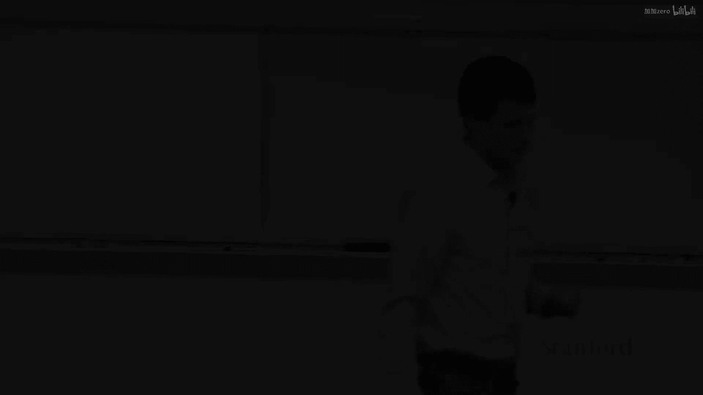
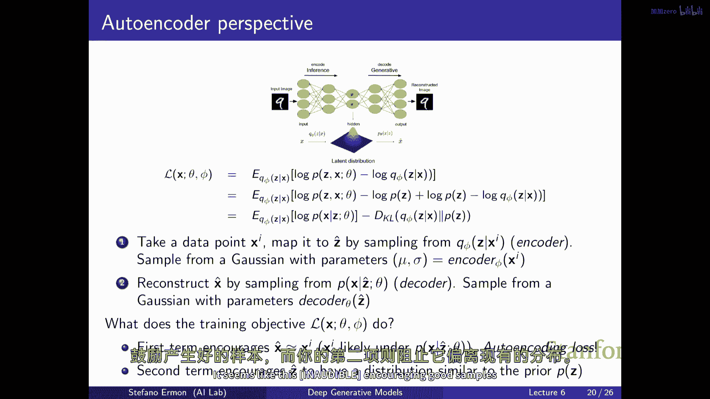
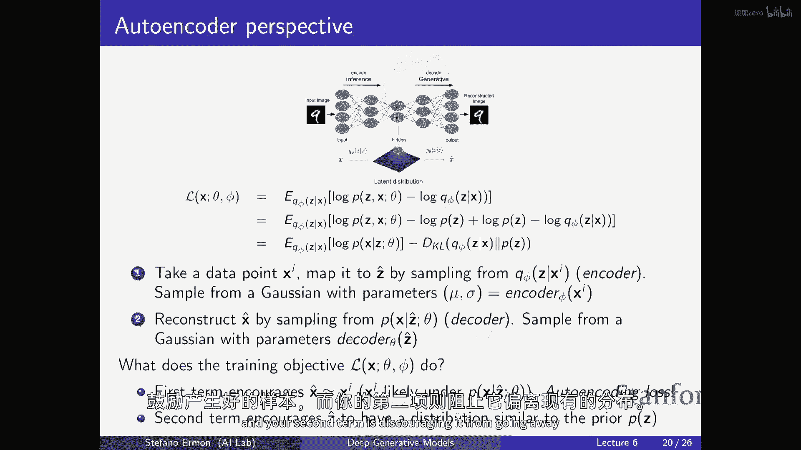

# P7：p7 Stanford CS236： Deep Generative Models I 2023 I Lecture 7 - Norm - 加加zero - BV1NjH4eYE1v

所以今天的计划是完成vae的幻灯片，"我们周一没有讲到的"，"然后我们开始讨论流量模型"，"哪些又将是一类与现有模型有所不同的生成模型，涉及到不同的权衡"，所以，我真正想讨论的事情是。

"这种变分自编码器的解释"，"或者一个vae作为外编码器"，正确，所以我们就是从"好的"这个角度来看待它的，"存在一个潜在的变量模型"，然后，我们还有关于模型训练推断技术的一种变体，其中，你有一个。

你知道解码器，它定义了生成过程p，然后，你有这个编码器，一个网络队列，用于基本上输出应该来自的变异参数，给你一个对真实生成模型的后验的相当好的近似，我们提出了这种训练目标，对于每个数据点，你有一种函数。

它依赖于解码器的参数，并且，真实生成模型的数据和编码器phi，并且，我们已经看到，这种主观函数是真实数据点边际概率的下界，并且它好像有点道理，试图同时优化和最大化这个，作为数据和phi的函数。

你可以直观地看到在这里发生了什么，我们正在说，对于每个数据点x，我们将使用q来尝试猜测可能的完成，潜在值对于潜伏变量z，这就是为什么这里有对这个分布的期望，然后我们基本上看数据点的对数似然性。

在我们猜得很好之后，我们无法使用这一分布进行推断，这个编码器，这个q分布，嗯，如果你只是优化这些前两部分，本质上，q将被激励尝试找到最可能在原始生成模型下完成的完成项，这些完成项是最可能的。

而且还有一种像这样的正则化方式，这里的另一个术语，但我们也考虑在队列下完成情况的概率，这基本上对应于变分分布的熵，Q项类似于鼓励队列分布的一种方式，推断分布用于分散概率质量。

所以不仅仅是试图找到最可能的z，但也差不多，我试图找到所有可能的z，它们与您所拥有的x一致，嗯，我们已经看到，你知道到一定程度，如果你的队列足够灵活，那么你可能实际上能够。

并且它实际上能够等于给定x的真实条件分布p的z，那么这一目标函数实际上变得完全等于对x的边缘概率的log，这是传统的最大似然目标，所以我们从那个角度来激励它，并且一切都变得合理。

我们实际上没有讨论为什么它被称为变分自编码器，像，这里的自编码器风味是什么，我们可以看到如果你稍微解包这个损失一点，你可以做，你可以添加和减去在生成模型中使用的潜在变量的分布。

通常它只是z的一个高斯分布，所以当你在你的变分自编码器中采样时，你根据一些潜在z的分布p采样一个潜在变量，然后你将z拟合到产生给定z条件下x参数的解码器中，然后你从p给定z的x采样。

所以如果你在这里添加和减去这个量，嗯，然后你最终会，然后你看待x和z的联合除以z的边缘，就是x的条件分布，Q和z，就是解码器，然后你可以看到你最终会得到另一个术语在这里。

这是推断分布和先验之间的KL散度，那么这个目标看起来像什么，如果你实际上去评估它，并且做一些像蒙特卡洛近似这样的事情，你会做什么是你有一些数据点，它们给你提供了x组件，所以它可以是一张图片。

像左边你看到的那一张，那是输入，那是，那是第i个数据点，然后当你想要计算这个期望与q有关时，你会做什么你可以通过蒙特卡洛来近似它，所以你会从q给定x的z中抽取一个样本。

记住q给定x的z就是从另一个神经网络中抽取的，这个神经网络基本上接受xi作为输入，你喂给它，然后作为输出，它产生关于分布和分布过潜在变量的变分参数，对，如果q给定x的z描述高斯分布。

这个第一个神经网络的输出，也就是编码器，可能是μ和σ，它基本上定义了你要使用的高斯类型来猜测，如果q给定x的z是高斯分布，这个第一个神经网络的输出，也就是编码器，可能是μ和σ。

它基本上定义了你要使用的高斯类型来猜测，潜在的、合理的隐变量值可能是什么，基于你所知的x_i，然后，你可以从这种分布中采样，所以你以高斯分布采样，具有均值和方差，由通过编码器将图像拟合得到的结果定义。

然后，我们可以看到这样，是的，这就是我刚刚说的，所以，有这个编码器，一个神经网络，它将给你参数，然后你从高斯分布中采样，然后我们可以基本上看这里损失的第一项，你可以把它看作是重构损失。

所以本质上我们做的是，我们正在评估p(x_i)，给定我们采样的潜在变量z，基本上，嗯我们说的是，我们，如果你知道，如果你从这个分布中采样，你将从参数由解码器得到的高斯中采样一个数据点，由解码器得到的。

那就是基本上会产生另一个图像，如果你实际上看看这个可能性术语这里，它将基本上告诉你根据这个方案，原始数据点的可能性是多少，所以，它就像如果p(x|z)是正态分布的，它是一种重建损失，告诉你。

给你潜变量z的情况下，你能够多重建原始图像的好坏，所以，第一个术语有一些编码的味道，如果你没有第二个术语，它将基本上对应于一个稍微随机的自编码器，所以，在一般的编码器中，你将输入一个输入。

你将将其映射到一个确定性的向量中，然后您将尝试从向量返回输入，这是一种类似于随机外编码器的类型，其中您输入一个值，您将其映射到一个潜在变量的分布上，然后从分布中采样的潜在变量应该有用。

应该能够很好地重构原始输入，嗯，所以是的，第一个术语基本上鼓励您通过喂入这些潜在变量得到的结果，类似于，类似于这种外部编码目标，所以类似于你输入到重构部分的数据，输出的结果也会相似，我感兴趣。

类似于在训练目标中，什么原因导致隐藏表示像高斯分布，是的，所以这就是，所以这只是第一个，所以如果你只是那样做，那是一种很好的训练模型的方式，那么你将获得一种输出编码器，现在这里有一个第二个术语。

这里有一个q和先验分布之间的KL散度术语，我们是用这个术语，来定义VA的，那个术语啊，所以那是输出编码损失，第二个术语，基本上是鼓励你通过编码器生成的这些潜在变量，以KL散度的方式分布。

与这个高斯分布相似，我们正在使用生成过程，所以这就像是 saying 那样，你不仅应该能够重建得很好，但你用于重建的种隐变量，应该作为高斯随机变量分布，如果那是这样，那么这就是你 kind of。

你 kind of 看见为什么我们会用这种方式得到生成模型，因为如果你只有第一个部分，你知道你有一个出色的解码器，但是你不知道如何生成新的数据点，但是如果你有某种方式可以生成。

这些只是来自高斯分布或简单分布的采样，然后你可以像欺骗解码器一样生成合理的样本，因为它已经被训练来在疾病来自时重建图像，是由编码器产生的，而现在如果疾病有一些简单的分布。

所以你有一些方式可以生成疾病自己，只是来自高斯的采样，那么你实际上有一个生成模型，这就是为什么它被称为变分外编码器，你可以把它看作是一个被正则化的外编码器，所以，潜在变量有一个特定的形状。

有一种特定的分布，这就是你VA的先验，所以，你也可以生成，你可以用它作为生成模型，基本上与自编码器的经典设置相同，而且，你也可以只重构我之前见过的图像或输入说好，如果你训练一个外编码器。

你知道你训练它在训练集上，然后希望你它能够泛化，所以，你希望它可能仍然能够重构图像，那些与你在训练期间看到的相似，这将仍然由这个第一个术语实现，到模型泛化的程度，这总是很难量化，但到外编码器泛化的程度。

就足够了，但是你仍然没有生成新鲜数据点的方法，这是因为你没有开始过程的方法，过程总是从数据开始并产生数据，但是，你必须 somehow 劫持这个，这个过程通过从这个先验分布中采样来融入潜在变量。

并且这个术语在这里，这里的KL散度术语，鼓励这个事实，即这不会导致太多的麻烦，因为从先验中采样得到的疾病，与你在训练自编码器时看到的类似，是的，对这个有什么评论吗，嗯，对自编码器，本质上，嗯。

当我们训练时，为什么训练，我们只有有一个确定性的模型，无论我们给什么图像，然后，我们将信息压缩到这个较低的数字，它不是，所以问题在于，训练在常规自编码器或变体自编码器后的输出是否相同。

就像常规的常规气体是终点三气体，但是，这是一些分布，是的，所以这就是一个随机编码器，从意义上说，这里映射的q是随机的，因为从技术上，你可以使它几乎完全确定，就像你被允许选择任何分布，但是。

那可能不是最优的最优方式，因为可能存在对于，就像是如果你记得这个q应该接近z的真实条件分布，在p下给定x，所以，到你相信那个条件分布不是非常集中的程度，那么你可能想要使用一个也捕捉到那种不确定性的线索。

是的，看起来它不像是一个艺术家的结合体，非常接近鼓励你的第二部电影。

是阻止它远离现有的分布。

我之前提到过你可能使用强化的原因，但这是否也导致这个，谢谢，所以，力算法只是一种通向不同优化算法的途径，用于这个损失，这更普遍地工作，比如，对于任意队列，并且，它适用于当例子的潜在变量z是离散的情况。

它与像杆子这样的东西有一些相似性，在意义上，那一个也有这种风味的，像优化奖励一样，受到一些KL约束，这是一个，这就是它有常规化风味的原因，嗯，什么，嗯，所以，是的，如果你只是优化第一个部分。

它不能被用作生成模型，或者不一定，然后，你需要添加一个正则化项来允许你做某事，但这不是另一半情况，其中p和q都是生成模型，从某种意义上说，这有所不同，因为我们只是在常规化潜在空间，本质上是一个外部。

我只是在尝试理解，比如对于第二个学期，菠菜离散化项，并且有一个，你知道，比如队列强制之间的理由是什么，让我们吃这个例子，也许轴是数字的可观察部分，并且z是可观察部分，并且都像知道x。

什么给一人以关于z的指示，但是，强制z给定x的q非常接近的依据是什么，就像无条件的p对c，是的，所以那就是这样，我们做这个的原因是基本上允许我们，然后基本上通过从先验中采样来生成新的潜在变量。

而不实际需要一把斧头来适应和插入队列，所以这就是允许我们基本上使用这一代生模型的原因，我想你们都在暗示，这似乎看起来，也许比较在q下z的边缘分布到，在p下z的边缘分布，这也是一个非常合理的目标。

但它是不可行的，所以啊，这意味着再次，你最终会得到一种非常困难的，有点像你不能必然地评价的积分，但是有其他的方式可以像样地强制执行这个，所以你可以使用判别器来像样地，有各种口味。

VAE使用的这种特定的正则化方式并不是实现这种行为的唯一方法，所以，要在推断中实现这种行为，所以，在生成时，如何处理，我们如何得到，我们如何从它采样，因为我们没有确切的，所以，例如，我们没有访问权。

所以，你不能仅仅使用编码器和解码器，所以为了采样召回，我们只有解码器，所以为了生成样本，你不再需要编码器了，而且与训练期间的疾病不同，在推断时间采样时，z是由编码真实数据点产生的。

z仅由从这一先验分布中采样产生，z的p但嗯，像你有这样的神经网络一样，你知道一些超级简单的东西，你知道在自动机器人中，它可能只是一个高斯分布，带有零，均值和相同的方差。

这有点像我们总是使用的那种简单先验，我们回忆采样过程，是你从简单先验中采样z，然后你将其通过此神经网络传递给解码器以绕过，好的，只是还好，我们得到了，是的，pfc实际需要多近才能使用高斯分布。

我知道你喜欢星期一，你提到我们使用高斯分布来参数化，但是就像那样，它是像金融数据一样，尾巴更大，用这种方法，或者你需要使用不同的，是的，所以这种方法的有效性取决于再次，它是有点像与卷心菜相关的。

真后验分布和近似后验分布之间的差异，就像是如果你相信大概的，真正的后验分布不是正态的，它是一些复杂的，你可能想要使用更灵活的分布来描述q，或者一些具有重尾的分布，所以设计模型的自由度有很多。

我认为理解肘部的来源，告诉你大致上什么应该工作，什么不应该工作，但是，它不一定是正态的，那就是最简单的实例，但是，在选择这个方面有很多自由度，嗯，谁先，是的，所以，第一个术语被称为自动编码块。

我以为pel是狗块，不是最后一个函数啊，第一个术语基本上就是一个外编码损失，因为它在说，如果你想想，你在说你能塞进一把斧头，然后你检查你产生一个z，然后你检查，给定z，x的原始值有多可能，哪。

如果p(x|z)是正态分布，它基本上就是一种l2损失，嗯在，嗯在真正的，基本上在你塞进的和你从中得到的部分之间，嗯，从这个意义上说，这是一种外编码损失，但我们优化的真正损失不仅仅是它是这个肘部。

这是外编码损失加上正则化，因为我们想要使用它作为生成模型，所以，因为我们正在使用KL，条件概率q与无条件概率p之间的散度，那不是只会鼓励编码模型生成相同的吗，相同的分布，就像对于每个是的。

所以有那个是的，那是一个有效的观点，就像，它是一种相当强的正则化，而且这基本上是迫使它尽可能地尝试生成相同的，然后还有另一个术语，这基本上是迫使你尝试为不同类型的输入找到不同的表现形式。

你可以很好地重建它们，所以这两个术语在相互斗争，你试图找到最佳解决方案，你可以，所以如果我们只考虑生成质量，但是，因为看起来如果我们只选择平均值，并且我们可以只设置为零，总的来说。

当我们开始从这个中采样时，我们就会重建它，所以我的问题，我们可以不是从随机噪声开始吗，然后重建它，并且忘记所有的编码，所以他们建议一种不同的训练目标，你从哪里采样新鲜的，是的，所以如果我们基本上要。

占据车道并使它在零和一的标准差之间流动，那么我们为什么不就从这个开始，你可以，基本上我认为这将最终成为某种非常相似的东西，像最初的一种像蒙太古·卡罗的近似，边际似然度的近似。

你在哪里只是猜测疾病并试图看到，你获得结果的可能性是多少，问题是大多数这些并不成立，所以就像是的，这可能是一个潜在的，如果我理解得对，你可能可以烹饪出一些东西，如果在疾病足够低维的情况下。

它们可能会工作，但我认为问题在于，如果你只是直接从先验中采样疾病，它可能不会，他们可能不会只是，所以当我们首次学习时，我们的目标是让ps知道，你知道，向一些特征，所以像在现实生活中。

如果我们训练一个模型，然后你知道找出z或疾病是什么，例如，一张图像，做这样，我们只是定性地看它，如果我改变这个，在发生了什么，我认为是，是的，所以如果你想解释疾病的意义，你可以做，你可以。

让我们说从一张图像开始，甚至从一个随机的z开始，然后看看你得到的输出，然后你尝试改变一个轴，一个我们称为z的潜在变量是向量，所以有多个你可以尝试看，如果我改变一个，我可能会得到更厚的数字。

或者如果我改变数字的位置，如果tau是数据变异性的因素之一，但并不一定保证那样发生，但在下一页上，我们将看到它确实有类似的效果，这是非常鼓励的，所以当我们完成训练后，现在我们想要生成东西，对，嗯。

然后重复，你确切地做什么，就像你再次从q的z中采样，或者你做，是的，所以生成时，你可以忽略q，你可以扔掉队列，而你做的事情是，你不再通过从q中采样来生成疾病，你可以丢弃队列，而你做的事情是，相反。

你不再通过从q中采样来生成疾病，这就是你在训练期间会做的事情，你通过从q中采样来生成疾病，这是的先验，所以，而不是从左到右，在这个计算图中，你从中间开始，你通过从先验中采样来生成疾病。

我们确实有玩家作为生成模型中的一部分，这里的术语鼓励你所知道的事实，你从左到右得到的疾病，与直接从先验中采样注入它们相似，所以你可能会期待类似的行为，所以如果这里的近似是这样的，如果近似过于接近先验。

可能会有，我记得有一种现象叫做零坍缩，我记得几年前，人们试图设定一个最小距离，所以让我们假设我们想要票房系列不应该太接近，以至于需要，嗯，不像，嗯，对于这个的进展，是的，所以这就像。

如果这里的后验太接近先验，那么你就像是忽视了x，这可能不是你想要的，因为记住我们正在尝试找到数据数据的好潜变量表示，所以如果z和x之间没有互信息，这可能不是你想要的，另一方面，你只能实现那个。

如果你在某种程度上并没有真正利用混合，所有的模型数据混合，当你在模型数据时可以访问的，所以您可以鼓励，通过选择简单的p(x|z)，您可以避免这种行为，因为那时您被迫使用z来模型不同的数据点。

如果p(x|z)已经是一个非常强大的自回归模型，那么您不需要混合复杂的自回归模型，您可以使用相同的z来模型整个数据集，然后您就不会使用潜在变量，您将面临这个问题，您知道您可以选择队列q作为先验。

完全忽略x，一切都会正常工作，因为你在忽略z，你完全没有使用它，并且有方法尝试鼓励vae具有更多或少的相互信息，在x和z之间有尊重，有时你想要更多的相互信息，你想要潜在变量对输入高度信息化。

有时你想要丢弃信息，如果你有敏感属性，你不想让潜在表示捕获数据中的敏感属性，那是你数据中拥有的，所以也许你想要减少相互信息，所以这种训练目标的口味有很多。

其中你可以鼓励更多的或少的相互信息在潜在变量和观察者之间，我们实际上并没有训练，P(z|x)并没有被训练，这里你可以固定，但这里不是，对，所以也许那就是一种像，另一种思考关于变分自编码器在做什么的方式。

这种像触及了压缩行为的一种方式，我们为什么有点像发现了一种可能具有重要意义的潜在结构，想象一下这种设置，爱丽丝是宇航员，她踏上了太空任务，她需要向地球发送图像，发给鲍勃，图像太大。

所以可能她唯一能做的就是她只能发送一个位信息，或者只是一个实数，像这样，所以她这样做的方法是使用编码器q，给定一个图像，她基本上通过获取紧凑的表示来压缩它，Z 正确，所以如果你想象 z 是一个简单的。

是 a 只是一个二进制变量，然后你可以将图像映射到一个零或一个一，所以如果你只能发送一个位，这就是你唯一能做的事情，如果这些是真数，然后你可以将不同的形象映射到不同的真实数。

但是你只能向 Bob 发送一个真实数，然后 Bob 做的什么，Bob试图重构原始图像，而你通过这种方式做到这一点，这个解码器试图根据他收到的消息推断出x，如果你考虑这种模式会工作得很好。

如果自编码损失很好，如果损失低，如果如果这个术语很大，那么这意味着bob实际上做得很好，但在为Alice发送的图像分配高概率时，给他收到的消息，所以通过发送消息，并没有失去很多信息。

通过压缩到一个单一的z变量，你可以想象你知道，如果你只能发送可能只有一比特的信息，那么你知道会有一些信息损失，但你可以大致知道你要尝试做什么，是你试图将看起来相似的图像聚类在一起，你知道你只有两组图像。

然后你取一组，你说，好的，这些只是零位，其他组将是一位，而且这就是你能用那种设置做到的最好的，所以，事实是，这个微小的，它有点像迫使你可能发现特征，你可以说，好的，有只狗，它在与飞盘一起跑，有草。

这是对输入的一种更紧凑的表示，那就是z变量，和术语，尺度分歧项基本上迫使我们消息的分布具有特定的分布，如果这个项很小，那就意味着基本上bob可以自己生成消息，而不必实际接收它们。

他从alice那里接收不到，他可以从先验中采样，生成一条看起来真实的消息，因为它的分布非常接近alice可能发送给他的分布，然后，仅仅通过解码他生成的，他就可以生成图像，而不是接收消息。

Malhe只是通过从先验中采样来生成描述，这就是如何生成图像，这就是目标真正在做的，他说了，但在训练时，你怎么知道，嗯，像，你怎么计算这个分歧，我感觉它假设，你知道，P of z，是的，你怎么计算分歧。

所以记住，这只是肘部，所以我只是在以稍微不同的方式重写肘部，但如果你看第一行，一切都可以计算，一切都可追溯，一切都，这是我们得出的同样的东西，好的，有什么问题吗，是的，所以，比如。

假设你有一个包含一千只狗和五只猫的数据集，你的潜在表示是否会开始分配更多的位给，我猜你见到的类越多，你更好地能够重建那个，你需要手动，在这种情况下，如果你有一些属于某个类别的数据点非常多。

那么模型会更关注这些，因为你会看到它们经常出现，所以你想要能够很好地编码它们，所以如果某个特征非常罕见，你永远不会看到它，那么你对编码它并不在意，因为你只关心数据集中的平均性能，我明白了。

我想那个问题的另一个方面是，假设有一些语义类别的特征，Shery，你想要更加重视的，我在想，如果有工作已经完成，使得模型特别关注图像的这些部分，比其他部分更多，是的，所以有各种方法可以做到。

比如一种是如果你知道你关心的是什么，它会尝试改变这个重构损失，以更加重视重要的事情，因为目前重构损失只是l2，这可能不是你想要的，也许你有，你知道有一些特征，你更加重视，所以你可以改变重构损失。

以更加重视这些事情，这是同样改变这个分布的形状，本质上来说，好的，我更加重视某些事情，而不是其他事情，另一个你可以做的事情是，如果你有标签，因为你知道现在这只是一种假设，没有，它是发现的。

无论它发现什么，没有保证它发现任何语义上的意义ful的东西，所以唯一强迫这一点的方法是你有一些标记的数据，所以如果你有人给你标注图像，或者什么，那么你可以尝试改变打印目标，以确保。

有时候当你知道z变量的值时，那么你的生活就会变得更容易，你可以只是针对那些进行最大似然估计，这将迫使模型使用，以某种方式使用他们，真的很奇怪，那么当我们训练时，我们应该总是采样最可能的z值吗。

只是某种随机需要帮助，是的，所以问题是我们是否总是应该选择最可能的z值，如果你考虑肘部推导，答案是不，我们不应该总是选择最可能的z值，如果你思考肘部推导，答案的确是不。

你总是希望根据给定x的z概率来采样，所以你希望真正反转生成过程，并尝试找到这些可能在后验下的可能性，这在计算上是不可解的，但我们知道这对你来说是最优的选择，我会说应该总是根据编码器采样最可能的。

我们应该知道目标函数在，你只需要从它采样，因为可能会有很多，并且它们可能是你，可能会有其他可能的解释可能的完成，并且你真的希望覆盖所有这些，所以对于每个输入x，更好的实践是，召集更多的人并做多代生成。

是的，所以问题确实是真的，你会得到多个吗，是的，在蒙特卡罗的意义上，就像那样，所以这些你获得的越多，你获得的样本就越多，记住那个，你知道，你真正需要一个期望在这里，我们不能做期望。

你只能以其样本平均来近似它，你样本的平均值越多，它就越接近真正的预期值，所以，更好的，更准确的估计，你对损失和梯度的估计就越好，但这将更昂贵，所以在实践中你可能只是想要一个，是的，嗯，我只是好奇，嗯。

如果我没有太多的数据，我可以使用像指令这样的，这就是这里的训练开始，所以你将增强训练数据以来自模型的样本，实质上，这是一些人开始探索的，他们使用合成数据，再生模型。

并且有一些理论研究显示如果开始使用合成数据来，并将其放入训练集中，有一些理论结果表明在某些假设下，这种程序发散，我认为这叫做生成模型，发疯或什么的，如果你开始做那种事情，就需要一些不好的事情发生。

但如果你开始做那种事情，但这是在实践中并不真的很实际的一些假设，嗨，彼得，我猜测对前一个问题的一个问题，我被问到了，他说，在推理阶段我们不进行重要的抽样，啊，我认为我们不从更有可能的结果中采样，我们从。

我们从条件上采样，我们不选择最有可能的，我明白了，仍然更有可能选择更有可能的，是的，他们越可能，我们选择他们的可能性就越大，但我们不仅仅选择最可能的一个，我们只是停止，好的。

所以今天我要谈论的另一件事是开始谈论流动模型，这是其他变种，另一种绕行的方式，就像在潜在变量模型中的难以处理的边际概率，那么到目前为止，我们已经看到了自回归模型，我们看到了变分外编码器，其中边际概率。

边际似然由这个混合模型给出，这个对潜在变量的积分，我们已经看到自回归模型很好，因为你不需要使用变分推断，你直接有访问数据概率的途径，你不必处理这个，你知道编码器和解码器以及v's很好。

因为虽然你获得了表示z，并且你知道，实际上，你可以定义非常灵活的边缘分布，你可以一次性生成，因此，它们有一些回归模型没有的优势，但是嗯，与潜在变量模型有关的挑战是，我们不能评估这个，嗯，边缘概率。

所以我们的训练很痛苦，所以我们必须找到肘部，所以流模型做什么，它是一种潜在变量模型，有点像一个具有特殊结构的vae，这样你就不需要做变分推断，你可以以更直接的方式训练它们，所以实际上。

评估观察数据x的概率非常效率，即使你有隐变量，这意味着你可以通过最大似然来训练它们，所以这种，嗯，嗯，想法是，你知道我们想要一个在可见数据上的分布模型，在可以轻易评估和从观察数据中采样的分布上。

因为那时我们可以在推理时高效地生成，我们知道有许多简单的分布可以满足这些属性，比如正态分布或均匀分布，但我们想要的是一种形状复杂的分布，有点像你看到的这种，所以这里，颜色代表概率密度质量。

所以你知道你有一个正态分布，你知道它具有这种相对简单的形状，所有的概率质量都像是以均值为中心的，所以如果你考虑用高斯模型来描述图像，那么它的效果不会太好，因为只能有一个点。

所有的概率质量都像是以它为中心的形状，再次考虑均匀分布，它不会很实用，对于实际数据来说，你想要一种多模态的东西，看起来像这样的东西，你在哪里可以拥有一些概率质量，然后noa，概率大大降低，然后上升。

然后像你想要的复杂形状一样降低，对于这个p theta的x，这基本上是同样的原因，我们使用混合物作为实现这种复杂形状的一种方式，通过取许多简单分布的混合，流模型做的方式是它们相反地试图。

将本质上简单的分布转化为更复杂的分布，通过应用可逆的变换，这基本上就像一种变分自编码器，所以这将是一个非常相似的生成模型，其中你有一个变量z，你从中采样，再次从简单的先验分布中采样，比如一个嗯。

你需要高斯，固定的高斯，具有固定的均值和一些种，让我们说相同的方差，然后你在vae中转换它，你将做的事情是，你将计算，给定z，通过两个神经网络传递z后，x的条件分布。

我们看到的是这个是获取可能复杂的边际分布的一种方式，由于这种混入行为，但你有这个问题，你知道当你想要评估一个x的概率时，你必须遍历所有可能的，Z's，以确定哪些可能产生特定的应用图像。

假设你有权访问的x，并对所有可能的，这些进行枚举，这是困难的部分，是困难的部分，并且可能会有多个，产生这些的，图像甚至只是找到产生图像z的，你目前有访问的图像x是由哪些产生的可能并不容易。

而且va的方式有点像是绕过，这是通过使用编码器实现的，基本上是在尝试猜测，给定x，哪些可能是产生你目前有访问的图像的，一种方法是，嗯，到达某种程度就像，尝试绕过，问题的设计是某种程度像构造条件语句。

使得反转它们容易，一种方法是，那就是将确定可逆函数应用于潜在变量z，所以，而不是将z通过这两个神经网络，然后从由神经网络定义的高斯分布中采样，我们直接变换潜在变量，通过应用单个，一个确定可逆函数。

这是因为如果我们这样做，然后，找出产生x的z就会变得简单，产生x的z是什么，因为我们知道只有一个，你所需要做的就是能够反转映射，因此，只要我们设计的函数是可逆的，并且很容易逆转，希望且确定，所以。

总是只有一个z可能产生特定的x，这就像解决了根问题，就是我们在处理变分自编码器时遇到的问题，这就是流模型这一类生成模型的整体想法，你可以把它看作是一个vae，其中，从z到x的映射是确定的和可逆的。

这使得，正如我们将看到，学习变得更加容易，我们看到我们选择的layton先验具有相同的维度，我们说，是的，所以这将是其中之一，将会出现，但这是一个伟大的观察，如果我们想要这个映射可逆。

然后我们就像是要求z和x具有相同的维数，因此，如果你这样做，你将失去一些东西，那就是不再有这个压缩类型的想法，因为现在z和x最终将具有相同的维数，好的，所以这就是一种高层次的动机。

现在是一种高层次的想法，让我们看看如何在实践中实际做到，所以就像，然后让我们从简单的复习开始，如果你对随机变量进行随机变换，会发生什么？让我们假设这些函数是可逆的，只是为了开始。

假设我们有一个连续的随机变量，X，你可能记得一种描述随机变量的方法是通过cdfs，社区累积分布函数，它基本上告诉你对于每个标量a，随机变量小于或等于a的概率是多少。

另一种描述随机变量的方法是通过这个pdf，它就是cdf的导数，对，嗯，你知道，通常我们描述随机变量通过指定这种概率密度函数或累积分布函数的形式，在正态分布的情况下，它可能看起来像这样，你有两个参数。

均值和标准差，然后你，你知道PDF的形状，通过应用函数，并且可以是均匀的，在这种情况下，pdf将具有以下方式，其中它为，嗯啊，你知道，如果在a和b之间均匀分布，那么pdf在该区间之外为零。

并且在区间长度上为1，当轴位于a和b之间时，你知道，当你有随机向量时，同样的情况也适用，所以如果你有一个随机变量的集合，我们可以通过联合概率密度函数来描述这个随机变量的集合，再次以一个例子来说。

如果这些随机变量共同遵循正态分布，那么pdf将具有那种函数形式，所以现在x是一个向量，所以它是一个，它是一个数字序列，你可以通过评估这个函数来获取特定点的概率密度，再次，这里的问题是这种简单的pdfs。

他们易于评估，他们可以从样本中轻易地抽取，但他们并不很复杂，就像形状很简单，我的意思是，就像概率仅取决于x离这个均值向量mu的距离，有点像，这决定了形状，你不能，你没有很多参数可以改变这个函数的形状。

好的，现在让我们看看当我们将随机变量通过应用它们到函数来变换时发生了什么，所以假设z是一个在零和二之间的均匀随机变量，并且pc是这个随机变量的密度，现在pdf在1处的值是多少，毫无疑问，是的，所以一半。

这只是一个预检，如果你对pdf在零到二区间上进行积分，你将得到1，这就是你想要的，现在，假设我们定义一个新的随机变量bags通过将其乘以4，所以现在我们有两个随机变量，X和z，x只是x的。

现在假设我们要评估，我们想要找出，这个新随机变量的pdf，我们通过乘以4构造的这个，你可能想要做的一件事是像这样做啊，这将是错误的，所以概率，假设如果你想要评估这个，有点像x取值的概率。

我们知道x是z的函数，所以这有点像z取值1的概率，这是我们之前有过的，这是一半，这是错误的，这不是正确的答案，很明显，对于z来说，它将是一个在零和八之间的均匀随机变量，所以密度实际上是八分之一。

因为它必须在零到区间的积分上等于1，所以这种在pdf计算中替换变量的方法不是，它不是正确的，你需要做的是使用变化变量公式，你可能在以前的课堂上见过，想法是当你应用一个可逆的变换，并定义。

Z x为f(z) f是可逆的，所以等价于，你可以通过应用f的逆函数来获取z，我们称之为h，所以h是f的逆函数或h应用到f上是，它等于身份函数，如果你想要得到这个我们通过变换得到的随机变量z的密度。

通过这种可逆映射，它是p(z)评价的一种形式，h(x)所以这就是我们之前在做的事情，但你必须按这个函数的绝对值缩放这个导数，在之前的例子中，假设函数只是乘以4，那么在这种情况下，如果你应用这个公式。

逆函数就是除以四，然后h的导数就是四分之一，这是一个常数，所以如果你想要评估这个变换随机变量的概率，评估者，你做的是评估z在四处的概率除以四，这是一，然后你需要乘以这个缩放因子，这是四的导数评估者。

这是uh或导数的绝对值，这给我们提供了正确的答案，八分之一，这部分这里，Pz等于一，它有点像我们试图做的天真的事情，那是错误的，它变得正确，如果你考虑到这个h的导数项，那是自由缩放的。

所以我们得到了八分之一，一个更有趣的例子可能是如果 instead of 乘以四，或我们取，我们应用一个指数函数，所以有z，再次是简单的，一个均匀随机变量在零和二之间，但现在我们定义x为z的指数。

现在我们可以工作出，这个新随机变量通过这种变换得到的密度是什么，指数函数的逆函数是什么，对数 right，所以h of x是对数，然后我们可以应用，如果你想要评估这个随机变量x在某个点的密度。

我们做的是评估z在逆数处的密度，然后我们缩放由导数 right，所以取x，我们逆它来获取对应的z，只有唯一一个z映射到那个x，我们评估z在先验分布p(z)下的密度，然后我们总是缩放由这个，Uh。

由这个导数，所以在这种情况下，Uh，p(z)是均匀的，所以是 uh，它是 uh，在任何地方都是一半，因为它在零和二之间是均匀的，然后对数的导数是1除以x，所以现在我们看到。

这个随机变量x的pdf具有更有趣的形状，这就像1除以2乘以x，所以我们从一个非常简单的东西开始，基本上就是一个常数，通过应用可逆的变换，我们得到了一个新的随机变量，这是一种更有趣的形状，再次，希望。

这是对你之前见过的公式的回顾，但这就像是我们在这里进行的变量变换，你需要考虑到这一点，嗯，导数，当你在这里应用变量变换时，关于这个问题的问题，这听起来很熟悉，好的，现在，让我们看看，嗯。

你知道这是衰变的公式，你可以看到证明，实际上它实际上非常简单，嗯，你知道我们可以在CDF的水平上工作，所以新变换随机变量的概率小于或等于特定数字，就是CDF在单一点上的评估，我们现在知道x只是z的f。

所以x小于或等于某些数字的概率，是f(z)小于或等于那个数字的概率，然后如果你在两侧的应用f的逆，因为你可以因为它是单调的，它是单调函数，那么你就得到这个表达式，这就是z的CDF在x的h处评估的表达式。

现在我们知道PDF是CDF的导数，所以如果你想得到这个随机变量的密度，你只需要取左边的导数或等价物，你可以取这里我们有的表达式的导数，然后您就使用链规则，所以你得到我们之前有过的表达式。

你需要评估的原始变量是h(x)，你取x，你倒置它，你在对应的z点上评估密度，但由于链规则，你需要乘以h的导数，这就是公式来自的地方，你可以看到您需要绝对值，因为是的，我猜测它可能在减少。

现在存在一个等价物，嗯，一种写法，它将变成有些有用的表达式，嗯，如果你想计算一个函数的逆函数的导数，实际上，你可以用原始函数的导数来表示它，有一种简单的微积分公式，你可能以前见过，所以。

如果你想计算一个函数的逆函数的导数，那就是h'，这就是我们这里所拥有的，你可以把它理解为f的导数的形式，这是指原始函数在逆点处的值，所以写这个的等价方式是，我们这里所拥有的是。

你可以直接评估原始pdf在逆点处，然后乘以z的f'分之一，其中f是种向前映射，所以你基本上可以写它以逆函数的导数的形式，或者你可以写它以向前映射的导数的形式，然后你只需要做分之一。

而不是这两件事是一样的，是的，我们仍然抬起尸体，是的，为什么它会有问题，如果APIs，零接近的方法，然后到分母，是的，所以它必须是可逆的，所以那件事不会发生，但是嗯。

我意思是你需要能够以某种方式计算这些导数，而且这不一定容易，嗯，是的，如果一阶导数是零，我意思是它是一个常数，然后它就不再被反转，好的，这就是容易的部分。

现在让我们看看当我们对随机向量进行变换时发生了什么，因为如果你考虑vae，我们想要将随机向量转换为随机向量，所以我们需要理解会发生什么，如果我们对一个具有简单分布的随机变量应用可逆变换。

但假设我们的随机变量是随机向量，Z现在是在这个类型的单位超立方体上均匀分布的，所以我们有n种维度，并且每个维度都是均匀的，我们想要理解如果我们变换那个随机变量会发生什么，为了得到一些直觉。

我们可以从线性变换开始，就像以前我们开始说乘以四，看看会发生什么一样，我们可以做同样的事情，相反，我们来看看如果我们线性变换一个随机向量会发生什么，这意味着我们基本上只是乘以一个矩阵a。

我们想要这个变换是可逆的，这在这种情况下就意味着矩阵本身必须是可逆的，这样你就可以回去了，x和z之间存在唯一的对应关系，我们将h的逆表示为uh，W，问题是x如何分布，好的，如果你从基本上uh开始，均匀。

然后你将其通过矩阵传递并乘以矩阵，你将得到另一个随机变量，它如何分布，你可以看到a基本上是线性的，它会在某种程度上拉伸东西，本质上发生的事情是它将超立方体映射到一个与顶部平行的平行线。

所以这只是一种像平行四边形的形状，所以在二维中，它可能会看起来像这样，所以你有一个均匀的，所以如果n是2，那么你有一个z在零和一之间的两个方向上均匀分布，所以它只是在这个正方形中是均匀的，然后。

如果你乘以这个矩阵a，这就是a b c d，你将获得这个并行，你将获得平行多边形上的均匀分布，你可以看到，顶点对应于你将得到的，如果你将矩阵乘以零零，你将得到零零，你乘以这个矩阵由一零组成，这个角落。

你将得到这个角落a b，如果乘以零一，你将得到这个角落cd，"如果你乘以一"，"你把这个角落放在这里"，"然后其他就都是这些点"，"你向我们展示了从单位正方形到了这个形状的转变"，嗯，你知道。

"并且这样一个过程是线性的"，正确，"但是，当我们应用这个ae时，你展示给我们的那个"，我认为那是一个非线性过程，我正在尝试想象这个变换矩阵是什么，它是否像线性操作一样，在这里，它是线性的。

一切都是线性的，到目前为止，这将足以处理非线性的，因为我们想要使用神经网络，但结果是，首先理解线性情况更好，嗯，但到目前为止，一切都是线性的，我们只是在乘以一个，并且那是一个线性变换，好的。

甚至像a矩阵本身，也是一个线性系统，并且是固定的，所以它只是，它只是一个，你知道它只是线性映射，并且它也是一个，好的，所以现在我们对这里发生了什么有一些理解，Z x，这是我们在乘以z后得到的。

它应该基本上是一个均匀随机变量在这个红色区域，那么密度是什么，我们需要找出那个物体的面积或体积，因为如果它是均匀的，那么它只会是总面积的那个分之一，对于这个红色的东西这里，你可能见过这个。

但你可以计算平行四边形的面积，基本上通过计算矩阵的 determinant，在这里有一个几何证明表明，确实，如果你可以计算出平行四边形的面积，通过计算这个矩形的面积，并减去一堆部分，你会得到这个表达式。

所以这是 determinant a 减去 c b，这就是平行四边形的面积，这意味着 x 将在这个平行四边形的面积上均匀分布，绝对值 of determinant a 的绝对值。

这意味着 x 的分布密度将是原始变量的分布密度，在逆向处评估，再次，我们基本上需要除以总面积，这就是 determinant 的绝对值，这个矩阵的，正确，并且，或者等价地，嗯，因为嗯，因为嗯，你知道。

如果w是a的逆元素，那么w的 determinant将是a的 determinant的倒数，所以你可以像以前一样，相当于地写它以关于a的derivative的，关于逆元素的，由a定义的映射。

这就是这里那个的determinant，所以您取xe，您映射，您在这里取一个点，您将其映射回单位立方体，但是通过乘以它，由w得到对应的x，对应的z，抱歉，您评估密度，然后您必须考虑到基本上体积被拉伸了。

通过应用线性变换，所以事情必须被归一化，因此您必须除以总面积以获取均匀随机变量，就像以前一样，您必须考虑到基本上体积被压缩或拉伸了，当您应用一个线性变换时，立方体问题在于。

是否仅适用于单位类型的立方体不，它适用于这个公式，这里是一般情况啊，无论您开始的密度是多少，只要您应用一个可逆的变换，您基本上可以得到wx或w的密度，抱歉，我想我在这里，是的，或z。

所以如果z有一个任意的密度，Pz，您可以通过此公式获取x的密度，在这种情况下，pc可能不均匀，它可以是正态分布或什么的，这仍然可以使用，所以再次，我们正在接近这个想法，从简单的开始，变换z。

然后能够某种程度地评估变换后随机变量的密度，我们称之为这种像vae的东西，我们有一个潜在变量z，我们有观察到的变量x，但现在通过这些公式，我们能够评估数据点的边际概率，而不必计算积分，无需进行变分推断。

我们如何通过这个数学公式得到它，但基本上通过这些公式，关键思想是，给定一个x，只有唯一一个对应的z，所以，这只是一个找到它的问题，通过乘以x，在这个情况下，是乘以w，然后考虑到几何形状稍微改变了一点。

现在，嗯，你知道，注意哦，这就是同一种类型的，毫不意外，这比我们在一个衰变中以前有过的更严格地一般化，所以但是，它 kind of 就像同一件事，是的，一旦我们做了这个线性变换，你能保证我们一个分布吗。

因为知道它从分布开始，哪是一些，你知道这个区域的声音应该是一个，然后我们做线性变换，你可能不一定是概率，是的，所以问题是这是不是p(x)，这是不是pdf，就像，如果你对x的所有可能值进行积分。

你会得到一，你基本上有应用这个的原因，你需要通过除法来确保它确实是均匀的，因为如果你不这样做，那么你可能会觉得，它就像那个，我们在开始做的错误计算，就是您刚刚映射回来的地方，并评估。

但是为了确保事情被归一化，你需要考虑到那个平行四边形的面积可能会增长很多，通过应用一种种辅助工具，或者，如果你应用一个非常小的系数类型，那么它可能会缩小很多，所以。

你必须通过这个行列式重新归一化所有事物，这就是他们被称为正则化流的原因，因为这个变量变换公式会为你处理归一化，并保证你得到的确实是一个有效的pdf，现在走，嗯，你知道。

我们知道如何做这些事情对于线性变换，嗯，我们要做的事情是我们想要使用深度神经网络，所以我们需要理解如果我们应用了非线性变换会发生什么，可逆的非线性变换，现在，而不是只是乘以矩阵。

我们想要输入x到某种类型的神经网络并得到输出z，然后我们，并且假设在某种程度上，我们能够构建一个可逆的神经网络，我们仍然需要理解这如何改变变量的分布，所以如果你有一个简单的随机变量z。

你通过神经网络f喂给它，输出是其他随机变量x，我们需要某种方式理解那个对象的pdf，结果发现它基本上与，如果你理解线性情况下发生的事情，你所需要做的就是基本上线性化函数。

通过做essentially一个泰勒近似，所以你计算函数的雅可比矩阵，然后它是同样的公式，它是雅可比矩阵的 determinant，这是一个线性化的函数近似，所以再次。

这可能是你在一些微积分课程中见过的东西，但它本质上是相同的公式，如果你又有一个随机变量，X，它通过某种可逆的神经网络从简单随机变量中获取，F，你可以计算出神经网络的输出密度，这是x，基本上通过计算。

通过反转它，并计算产生特定输出的输入密度，和往常一样，你必须考虑到局部体积是如何拉伸的，这就是逆映射雅可比矩阵的 determinant，就像以前我们总是看逆映射的 derivative 一样。

在一种情况下，多变量扩展是雅可比矩阵的 determinant，所以又再次，作为检查的标志，记住我们证明的简单公式像这样，这正是如果你只是将 f 视为一个标量函数时你会得到的，所以。

而不是有雅可比矩阵的 determinant，你只需要或绝对值函数雅可比行列式的值，你只需要绝对值函数的逆函数的导数的值，嗯，让我们看看，就像以前那样，你知道，如果你有一个可逆的矩阵。

逆矩阵的 determinant 是，它是，它是1/，原始矩阵的 determinant，所以你可以像以前那样等价地写东西，以前进行映射的 Jacobian 来表示，所以这里情况是这样的。

如果你从 z 转换到 x，然后公式基本上涉及从 x 到 z 的映射的 Jacobian，你也可以以前进行映射的 Jacobian 来表示，嗯，像以前那样，你只要做倒数，相反。

我们也可以直接计算 f 的 Jacobian，然后你可以计算那个的 determinant，然后做倒数，这就是和以前相同的东西，记得以前我们有一个公式，你可以以 h 来表示东西。

或者你可以以 f 来表示东西，这是一样的东西，但这可能在计算上，如你所见，有时取决于你是否模型 f，你知道，当你开始使用神经网络来模型 f 时，可能更方便使用其中一个或另一个。

这就是为什么这些公式是有用的，好的，关于这个问题有任何问题吗，是的，我们之前讨论的疾病是其他潜伏变量在前一种变体的变化中，是的，对，所以你应该仍然认为，我的意思是，这只是数学，到目前为止。

我们并没有真正构建一个生成模型，但是，你应该认为 z 有一些简单的分布，然后通过很大的解码器传递它们，现在 f 是一种可逆的变换，然后你得到你的样本，x 图像出来了，现在你可以评估图像上的密度。

这就是你需要如果 want 通过这个公式做最大似然，所以你不需要做变分推断，你不需要计算肘部，你不需要使用编码器，到 extent 你可以通过构造逆映射来逆转它，那么你就完成了。

你只需要逆转并考虑这个变化的体积，本质上由线性变换给出，似乎需要连续，并且我有相同的维度，那么这如何适应图像生成，当x是离散值时，所以是的，问题是否，它们必须具有相同的维度，它们是否，它们需要连续。

所以是的，它们需要具有相同的维度，这有点像我们之前讨论的，如果你想要事物可逆，这对图像有何应用，哦，你可以把图像看作是连续的，我想你获得的测量通常是离散的，因为你知道你可能有一种固定的分辨率啊。

但你知道你可以假装事情是连续的，或者你可以在训练数据中添加一些噪声，如果你想，基本上不是问题，你可以在这些模型上训练图像，当f是一个神经网络时，我们将应用一个实际上可以美化的更改，是的。

如果我们稍微作弊一下，而且他们实际上有惊人的想法，例如，一般来说，首先，然后像x到x一样，在第二个中，我们实际上不需要import map，所以我们有一个应用，但它不可逆。

我们仍然可以计算出'是'的概率，所以是的，所以如果f真的不可逆，那么公式就不太起作用，然后你又回到了一种vae的土地，这基本上意味着可能会有多个这些，映射到相同的x。

所以如果你想要计算出生成这个特定x的概率，你现在不再保证只有一种z，你只需要计算它，然后你应用它，你仍然需要 kind of 工作通过所有产生这些z的可能的z，那就是x和人们已经看过这些模型的扩展。

可能在那里你保证只有有最多k个， kind of ，它几乎可逆，就像如果你知道所有可能的，你所需要知道的就是，基本上所有可能的x，能够产生所有可能的z，能够产生任何特定的x，只要你构造东西。

使得这种情况总是成立，那么你就可以仍然应用类似的技巧，但一般来说，如果可能很多，如果非常，那么它的非逆性非常高，那么你就回到了vae的土地上，然后你需要一种编码器，我猜测这种就像，为函数反向你。

并且你必须一起训练他们，以便编码器能做好工作，但反向解码器，所以然后然后你可能最好使用肘部，酷和嗯，就让我们看一个例子，刚刚算出这实际上意味着什么，只是为了更明确一点，你可能想象你有先验。

那就是两个随机变量，Z一和Z二有一些联合密度，也许它可以是正态的，嗯，然后我们有这个可逆变换，这是一个多变量函数，两个输入到输出，所以你可以，例如，用两个标量函数来表示它，并且你两个。

所以每个一个都接受两个输入并映射到一个标量，所以它是多变量的两个输入到输出，我们假设这些东西是可逆的，所以有逆映射v，它总是将你映射回来，再次它是两个输入到输出在这个情况下，然后我们可以定义输出。

如果你取这个简单的随机变量，Z一和Z二，并将它们通过神经网络喂入，哪个接受两个输入并产生两个输出，你将得到两个随机变量，X一为网络的第一个输出，和X二为网络的第二个输出，只要应用了u一和u二，同样。

你可以从输出返回，你可以通过使用v函数获取输入，再次是两个输入到输出，你可以尝试做，你可以尝试获取这个神经网络输出的密度，你如何知道在x1和x2处的密度是多少，当这些随机变量通过神经网络进行变换后获得。

U，通常总是一样的，你所做的是取输出，这些输出是x1和x2，你反向网络，所以你找出产生了我们输出的两个输入，然后评估密度，原始密度，在这些点处的输入密度，这有点像我们之前做的计算。

我们开始时做的错误计算，只是反转并评估原始密度在反转点处的值，然后，像往常一样，你需要通过查看来修复事情，基本上，体积是如何拉伸的，在这种情况下，你会做，你会得到逆映射雅可比矩阵的绝对值，逆映射是v。

雅可比是这个数组偏导数矩阵，所以我们有两个输出，两个输入，所以你有四个，你可以首先得到第一个输出相对于第一个输入的偏导数，第一个输出相对于第二个输入，第一个输入相对于第二个输入的偏导数，依此类推。

那是一个矩阵，你获得矩阵的 determinant，你获得绝对值，那给你你想要的密度，到何种程度，你可以计算出你有一种方法评估输出密度，或者等价地，你可以以你的网络的雅可比矩阵来描述它。

这是你用来将简单变量转换为这种网络的网络，所以再次，你可以像在疾病处直接评估它一样，对应的输入，然后，你将应用这种网络的雅可比矩阵，反向映射，我们将看到，有时一个相对于另一个可能更方便，计算，是的。

这个问题比较广泛，但是，是否存在一些领域，流模型比aso更适合呢，比如，令人印象深刻的，比如，像哪些应用，在这些大项目中，学习问题的是哪些，是的，所以，流模型的问题是，流模型在何时适合。

以及流模型在许多方面都非常成功，实际上，你可以将扩散模型视为一种特定的流动模型，如果你想要评估哪个是未来，你的模式有点像当前最先进的技术，对于图像来说，目前，视频语音，对未来模型的一种解释是。

它们像慢速模型，有点像无限深度的流动模型，这些公式就是你需要的，你用来，或者公式扩展的基本是你用来，在扩散模型中评估似然性，我想你说过，你也可以把扩散模型看作是堆叠正确的东西，是的。

所以对它们有两种解释，流模型可以帮助你，如果你想要评估似然性，因为如果你有一个，如果你把它看作是堆叠vae，我们并没有似然性，如果你想要似然性，那么你可以 think of them as 角色模型。

然后，你可以通过这种方式获取似然度，所以，基本上在说扩散模型方法基本上统一了这个流动建模方法，并且，是的，是的，好的，嗯，你可能已经覆盖了这个，但是嗯，我们正在处理你的高维问题。

那么对于我们正在尝试解决的问题的线性系统，将会变得难以处理，但是像理论保证的那样，它是不可思议的函数，但是从实用性来看，在它里面很难解决它们，是的，所以问题来了，是的，像你怎么，我想，你知道。

看起来我们需要做很多事情，我们需要能够反转函数，你需要能够计算，嗯，你知道，你需要得到雅可比矩阵的 determinant，并且你需要得到雅可比矩阵的 determinant，一般来说。

矩阵的 determinant 就像是一个 n 的立方，一种操作，接下来我们将讨论如何使用神经网络参数化函数，这些函数具有我们要求的特性，所以他们很容易反转，并且它们使计算雅可比矩阵变得容易。

并且计算开放的行列式也很容易，因为我们不需要做整个游戏。

它更像是混合出来的，就像，未来模型的纯版本将是定义像素空间，并且隐变量的维度与输入相同，这就是你为什么可以认为它是作为流模型，所以这里我们不会降低维度，他们不，是的，是的，这是对潜在状态空间的一种解释。

仍然被视为某种内在变量，在他们大小相同的时候仍然适用，或者是不是，看起来你并没有减少问题，是的，所以问题是，你还能把它们视为潜在变量吗，还是，我的意思是，从某种程度上说，它是一个潜在变量，但是。

它有相同的维数，所以，它实际上并没有任何压缩，它有一个简单的分布，它以简单的形式分布，这对某些人来说是有吸引力的，但实际上，它更像是变量变换，有点像，你知道，就像你在用像素或米来测量东西，然后改变。

然后你开始用英尺来测量，但它实际上并没有改变什么，你只是在某种程度上改变了测量单位，至少如果你只是进行线性缩放，那就是在这里改变测量单位，你正在非线性，所以你在以一种更复杂的方式改变坐标系统。

但是这里并没有信息的损失，一切可逆，因此，实际上就是在从不同的角度看数据，这使得建模更加简单，因为如果你开始看事情，通过f的逆透镜，然后事情变得高斯分布，所以某种程度，嗯，但是，通过使用正确的测量单位。

或者通过以正确的方式改变坐标轴并拉伸它们，因此，正确的方法，使事情更容易建模，这样我们就有了一种更好的方法来可能思考流模型实际上在做什么，所以对于某些人喜欢的函数，虽然它们并不特别连续，例如。

在潜在空间中像这样，等等，我们可以使用哪些技巧来近似这种连续性呢，是的，所以我猜问题是否可以将此应用于离散，或者是否，所以有这种想法的扩展可以应用于离散，但是然后您会失去很多数学，很多数学计算的优势。

真正依赖于连续性，所以人们已经考虑过，我的意思是，可逆映射的等价物，在离散空间中，它将是某种排列，某种，嗯，是的，基本上就像是一种排列，因此，人们已经尝试发现一种方式，使得它们更容易建模。

但你会失去很多数学结构，所以，所以，实际上很难，在你训练模型后，那么你可以考虑重新采样，嗯。

