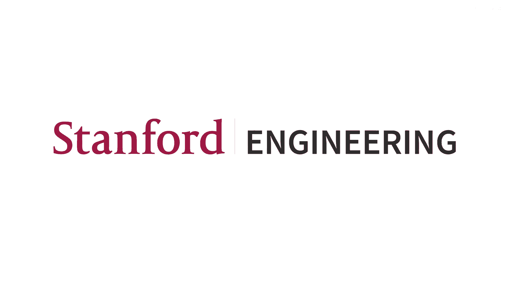
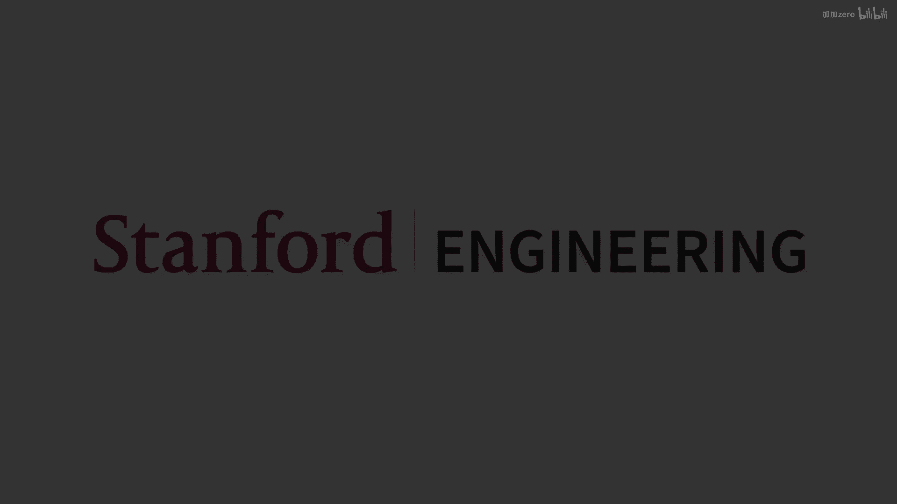
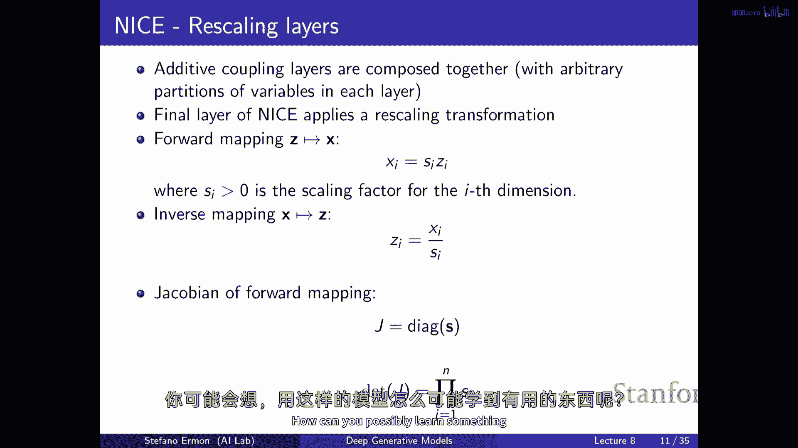
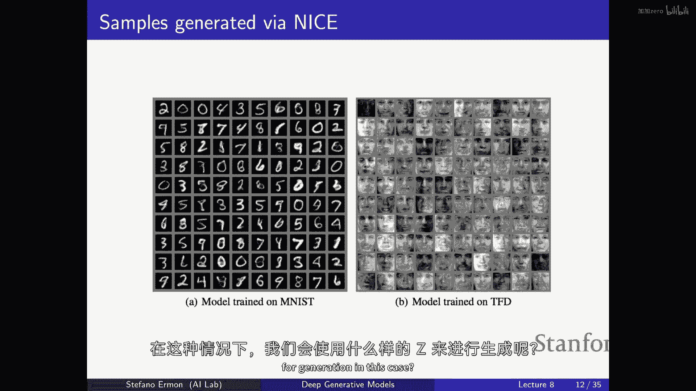
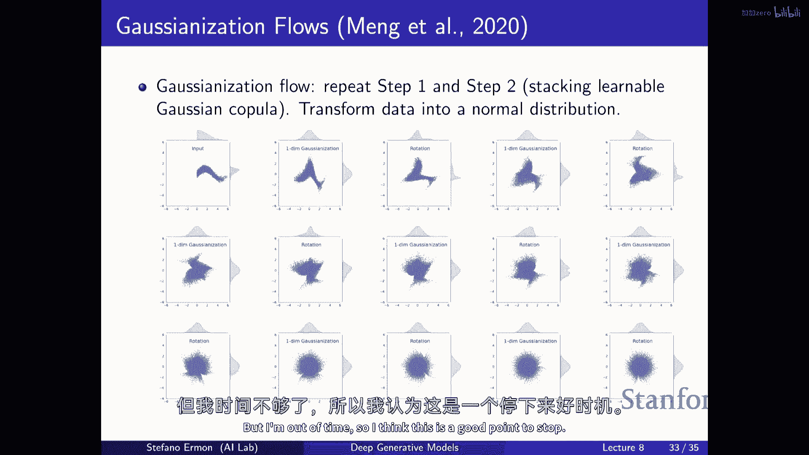

# P8：p8 Stanford CS236： Deep Generative Models I 2023 I Lecture 8 - GANs - 加加zero - BV1NjH4eYE1v

今天的计划是继续讨论正则化流模型，所以记得在上一节课中，嗯，我们大致介绍了构建潜在变量模型的想法，这将允许我们精确地评估似然度，而不必依赖于变分推断，所以它将与变分编码类似，从意义上说，将有两个变量集。

将被观察变量x和潜在变量z观察到，关键区别在于，这些两个随机变量集的关系是确定的，所以，在变分推断中，你会说样本x给定z是通过使用某种简单的分布来获得的，比如高斯分布，其中。

x给定z的参数可能取决于特定的潜在变量值，在流模型中，这种关系是确定性的且可逆的，所以你通过应用这个变换得到x，我们称之为这里为theta，嗯，因为映射是可逆的，所以你也可以回溯，所以推断出潜在变量。

给定观察到的一个，只需要你，在某种程度上能够计算这个映射的逆，在这里我们表示这些映射为f theta，因为它们将使用神经网络进行参数化，并且，我们今天将要看到的是，我们将考虑如何使用神经网络参数化这种。

如可逆变换，然后从数据中学习它们基本上，并且我回忆起使用可逆变换的一个好处，那是否该可能性是可追踪的，所以您可以通过，基本上使用变量变换公式，来评估这个特定模型生成数据点x的概率。

尤其是第一个部分非常直观，您在说，如果您想要评估生成图像的概率，让我们说x，您所做的是反向计算出相应的z，然后您评估z在先验下的可能性，这是哪种分布，Pz，然后记住，这只是不够的，如果你只做那个。

你不会得到一个有效的概率密度函数来获取被归一化的东西，所以它积分为1，如果你遍历所有可能的轴，你必须通过绝对值乘以雅可比行列式的值来缩放东西，逆映射的，这基本上在告诉你直觉上。

你做的就是在本地线性化函数，通过查看雅可比矩阵，然后雅可比矩阵的 determinant 告诉你多少，或者多小那个变换膨胀或收缩，有点像在数据点 x 周围的单位体积，所以非常相似。

记得我们在上一堂课中计算过线性映射的例子，在哪里我们定义一个随机变量通过将一个简单的，一个随机向量通过乘以一个矩阵进行变换，本质上这就是在这里发生的事情，你有同样的表达式，所以需要注意的是。

这可以精确计算，基本上，你不需要引入任何近似，到你可以计算这些事情的程度，你可以反转映射，你可以计算雅可比行列式的值，你可以做这些事情，然后，你可以精确地评估似然度，所以，你不必依赖于变分推断，在那里。

你知道你必须使用这个编码器，有点像，尝试根据x猜出z，然后你必须做一些这种积分，因为存在许多可能的z，可以给出任何给定的x，所以你不需要做任何这些，所以这就像有一个像另一个退化模型一样的东西一样好。

在那里，你可以精确地评估似然性，只使用这 这个方程和，你知道，这种模型的一种限制之一是，x和z的家庭需要有相同的维数，这与变分外编码不同，我们知道z可以非常低维，你可以用它来发现数据的某种紧凑表示。

这在流模型中不再可能，因为为了映射可逆，Z和x需要具有相同的维数，酷的所以现在，我们实际上如何，嗯，做这件事，我的意思是，我们如何将这个数学，这个一般想法转化为你可以在实际中实际使用的模型，嗯。

想法是通常的故事，类似于深度学习是将相对简单的构建块组合起来定义灵活的架构，因此，正则化流本质上是基于，但我们将使用基本上的神经网络来代表这个 theta 的映射，这实际上是唯一的事情，我的意思。

你有对 z 的先验和 f theta 映射，这就是你实际上可以改变的唯一东西，它被称为正则化流，因为变化变量公式给我们提供了一个归一化的密度，如果你稍微喜欢，考虑雅可比行列式的确定，它被称为流动。

就是我正在说的，因为它有点像深度学习中定义，我们需要的映射通过组合单个块来定义，这可能相对简单，所以我们将基本上定义一个架构，其中将有多个可逆映射的层，我们基本上从开始，随机向量z零，这可能是。

让我们假设，由先验高斯分布或类似的描述，然后我们做的事情是或者或者甚至可能是，是的，但是取决于你想要怎么看，我们从一端开始以一个随机向量z零，然后应用这些变换f一f二f三fn，一直延伸到m。

在这种情况下和嗯嗯，基本上，这种标记的含义是我们做的事情是，我们取一个z零，我们将其传递给第一个神经网络，然后，我们取那个输出，并将其传递给第二个神经网络，等等，我们表示这种。

通过堆叠多个可逆层f theta得到的架构，很容易说，只要每个单独的层是可逆的，通过这种操作得到的多个层的组合也是可逆的，因此，到我们能够想出合理的程度，定义单个层的神经网络架构。

我们将能够像堆叠它们一样，得到更灵活的东西，在那里的函数中，数据并不相同，是的，所以这是一个好问题，我认为这种符号有点，在这里有些过度加载，theta的含义，单个映射的参数将不同。

所以它们并不一定相互关联，即将发生，我们将使用theta来表示，所有需要您为每个单独层指定的参数集合的 union，所以这有点像这个故事，这个变换流的开始，你从一个简单的分布开始z零，第一个。

让我们说在你的流顶部最顶层，例如，通过从高斯分布采样，这是通常的 prior，与变分自编码器中的变分输出编码器相同的东西，然后，你将这个可逆变换序列应用到你的最终样本上，因此，你将它通过所有这些不同层。

然后假设经过了m层，嗯，你将得到最终样本x，幸运的是，是的，如果每个单独的映射是可逆的，那么组合也将是可逆的，你可以实际上计算出相应的变化变量公式，到 extent 你对每个单独层的雅可比矩阵的理解。

然后你可以计算出相应的，组合这些映射的雅可比矩阵的 determinant，所以 all you have to do is，你需要能够反转这个函数 f theta，由所有这些神经网络组合得到的。

如果可以反转每个单独层，你可以，当然，你可以反转整个函数，到 extent 你可以线性化基本，并理解每个单独层的局部行为，所以你理解雅可比矩阵的 determinant 看起来像什么。

然后你可以得到全映射的雅可比矩阵的 determinant，这是因为 yeah，基本上，产品的 determinant 等于 determinant 的产品，或者等价于你也可以得到这个规则 like。

如果你像递归地应用变化变量公式，你得到这种表达式或要找出，但基本上通过全映射像样地扭曲本地体积，你只需要找出单个层如何扭曲空间，然后您就组合这些各种层的累积效果，所以这说的是。

如果我们能够定义一些理想的可逆神经网络类，我们可以高效地反转它们，并且可以高效地计算雅可比矩阵的 determinant，并且 uh 这里是一个关于这种 like 可视化，uh 这个如何正则化流工作的。

这是一类特定的正则化流叫做平面流，它不是很重要，我想给你一些直觉，你从一端开始与这个随机变量 z 零，假设它是高斯分布的，然后您得到另一个随机变量，Z one 通过第一个层变换它。

和 z two 通过另一个简单的层变换 c one，等等，并且如此，你可以看到这些变换的效果，所以您开始，让我们假设有一个二维随机变量 z 零，这只是一个单位高斯，所以这就是一个具有球形协方差的高斯。

基本上有一个密度，看起来像这样，中间有平均值，概率质量分布大致有一个相对简单的形状，你不能用它来建模复杂的数据集，然后应用，假设一个可逆的变换，你会得到一个新的随机变量z一，嗯。

它现在具有更复杂的一种密度，然后，你再应用一个，然后你会得到更复杂的东西，然后经过十层，经过十种类型的个体，经过十种可逆的变换，你可以再次得到一些非常有趣的东西，它 kind of 有混合分布的味道。

在那里，你可以以更灵活的方式分散概率质量，有没有证明我们不能去时态变换，使用一些可以同时代表所有这些的神经网络，因为如果我从简单的人的角度考虑，就像函数和矩阵一样，我不显示你知道S像折扣一样，是的。

所以我的意思是，当然存在一种映射，这可能是一种可逆的映射，这将你从开始带到结束，这就是神经网络的组合，美丽的地方有点像深度学习策略，是单个层将相对简单。

所以我们看到的f theta i实际上是相对简单的变换，考虑一下，这并不是完全线性的，而是几乎线性的，即使这样，通过将它们堆叠在一起，它也很简单，你可以得到一些非常灵活的变换，所以它类似于深度神经网络。

也许单个层并不特别复杂，也许它就是线性组合和非线性的结合，然后，如果你将它们堆叠在一起，你可以得到一个非常灵活的映射，是的，这就是这里正在发生的事情，是的，你知道如果有一个限制是，实际上关于他们自己的。

因为你可以有一个sigmoid，就像一种一对一映射，但像什么又再次，强制一个四，因为我相信这就是你真正有问题的地方，是的，是的，所以我想问的是，你知道，如何确保，如果你学习这个theta啊。

你能得到一个可逆的映射，所以我们必须做的就是，我们必须设计架构在非常特殊的方式，这样无论你如何选择参数，映射是可逆的，不仅仅是这样，而且还需要能够高效地反转它，理想地因为你如果想要，你需要能够双向移动。

而且这也不够，你还需要能够计算雅可比行列式的确定值，相对高效地，因为 naively 它可能会花费你 n 的立方，其中 kind of n 是变量的数量，维度的数量，像素的数量，这太糟糕了。

基本上这就是接下来要出现的，有点像定义这些映射的方式，然后如何从数据中学习它们，这将是微不足道的因为我们有访问似然度的权限，是的，所以这里是另一个例子，这是你在下面看到的不同的东西，同样的想法。

但是先验是均匀的，所以这里先验是正态分布的，我们将其转换为像这样的东西，其中先验又是均匀随机变量，二维，所以所有的概率质量，如果我们假设在零和一之间，零和一，所以它就有点像一个正方形。

然后通过应用可逆的变换，你可以将它映射到再次非常有趣的东西，你可以看到，所以它是，它是归一化的，因为每个个体，一个通过应用可逆变换得到的随机变量，由变量变换公式自动归一化，它是一种流。

因为您正在一连串地应用变换，所以有点像您的，概率质量函数就像是在这些变换中流动，他们应用的每一变换都像是相同的变换，或者是对于每个不同变换的不同交易，是的，好问题，所以这是一张规划流。

这是一种定义它的方式，有点像神经网络中的一个可逆层，因此，每一层的函数形式都是相同的，但参数是不同的，有点像之前问的问题，所以，它是有点像相同的，嗯，变换是同一层，但参数是不同的，是的，所以。

你可以看到，主要的收获是，这有点像直觉，这是唯一容易可视化的东西，但你可以想象我们试图做类似的事情，在一个更高的维度空间中，你知道我们试图建模，让我们说，右侧的图像，酷，所以，我们如何做第一件事是，嗯。

我们需要以某种方式参数化这个映射，这将是这个讲座的主要主题，我们需要做的事情之一是我们需要能够进行学习，所以一旦你定义了一个可逆映射的空间，你如何理想地选择这些参数theta来拟合一些数据分布。

结果发现这非常容易因为我们有访问似然度的权限，我们可以基本上做与自回归模型相同的事情，所以训练流模型的最自然方式就是只是选择参数theta，那最大化给定数据集的概率或者特定数据集的对数概率。

或者等价于你遍历你的数据集，D，你试图找到分配给数据的概率的最大值，或者数据集中的所有点数的平均对数概率日志，所以直觉上，你更像是在试图找到，你可以把它想成在这个空间中的点。

然后你像是在试图找到流参数的值，以尽可能多地将概率质量集中在你训练集中的数据点上，嗯，再次，好的是，与变分自编码器不同，我们可以实际上评估这个似然度，我们可以找出生成任何特定数据点的概率。

你所需要做的就是使用变量变换公式的常规公式，所以你取一个数据点，你倒置它，你找到与先验相关的概率，这是哪里简单，Pz再次有点像你在左边这里可能有的，可以是高斯分布，它可以是均匀的，一些简单的事情。

然后你考虑到这一点，嗯，雅可比行列式的确定值，因为向上，它是对产品的对数，它变成对数的和，所以再次，你所需要做的就是，嗯，基本上，好吧，我有，也许它在下一个，不，好的，这不是在这张幻灯片上，但基本上。

你需要找出多少，什么是对数，全变换的雅可比行列式的确定值，这也可以分解为对数，雅可比行列式的确定值，定义你流动模型的各个部分，嗯和嗯，然后，如果你能评估这个损失，或者我猜这不是损失。

因为我们正在尝试最大化这些，但如果你可以将这个函数视为关于theta的函数，然后，你可以取梯度并尝试优化它，本质上，因此，到你能够反向这个函数的程度，以及到你能够有效地评估这些雅可比行列式的确定值。

雅可比项的程度，我们有一个损失，我们可以尝试作为函数优化theta，嗯，所以，你可以通过使用逆映射来精确地评估损失似然度，所以，从数据到先验，然后，在你训练了模型之后，你可以生成新的样本。

所以你想要生成新的图像，或者你想要生成新的，嗯，语音或声音，或者你正在尝试建模的任何其他东西，那么我们不需要这样做，它基本上只是向前的方向，就像在VAE没有改变的情况下，你从先验中采样z，然后。

你将其通过你的映射传递，这产生了输出，如果你关心获取类似于VAE的潜在表示，在VAE中，你将使用编码器尝试推断z，在流模型中，给定x相对容易找出，对于任何特定的x，对应的z是什么。

你所需要做的就是你需要逆映，但是，再次，这是否可以被视为潜在变量是值得质疑的，因为它与数据具有相同的维度，因此它不会被压缩，就像是任何方式，是的，但就像那样确实就像是一些结构，因为毕竟我们。

即使它是一对一的，它不再是你知道的随机的，所以所以可能会有一些，是的，所以很好，我会让你知道，训练图像模型时，然后在潜在空间中进行插值，并得到合理的结果，所以它无疑在做一些有意义的事情。

但它可能不具有压缩性，正如您期望的vae，例如，所以它是一种不同的潜在变量，但它仍然是一个潜在变量，当然，是的，我们，嗯，错误地翻转了，嗯，数据和逆过程，所以这是一个好问题，我的意思是。

我们是否参数化f theta，还是参数化f theta的逆，你只参数化一个，因为另一个是通过某种方式获得的，你知道，直接由，希望它真的很可逆，所以希望你可以实际上你可以做到。

但这是一个 good question，你是否应该参数化f theta，像您需要采样的方向，还是直接参数化逆，因为那就是您在训练时要做的，所以这些都是有效的选择，而且可能。

如果你必须让的 say 数值地反转一个函数，也许你知道它是可逆的，但可能它不廉价，而且可能计算逆需要您解决一个线性系统方程组或什么的 right，它是可逆的，有可能计算这个f theta减去最小逆。

但可能如果需要这样做多次在训练中，它就太昂贵了，也许取决于你想要做什么，你可能想要参数化其中一个或另一个，或者你可能选择一种可以快速逆变的f theta，因此。

我们将看到通过做其中一个或另一个theta，你会得到哪些类型的权衡，或者另一个theta，并且像'有'这样的词汇的形式与我们之前讨论的一样，我们有一个想法，这些法律确保它会做同样的事情。

那是你可以做的事情，你可以，是的，是的，所以问题来了，如果它不是完全可逆的，或者你能否参数化两者，并尝试使它们成为一个对方的逆变，人们已经探索过这种类型的事情，然后，他们试图确保你可以在两个方向上都做。

那么，另一种提取模型的方式是什么，那些可以在一个方向上高效评价的模型，可以被转化为可以在另一个方向上高效评价的模型，所以是的，我们将谈谈这个，酷，好的，我们从一个流模型中想要什么。

我们有一个简单的优先事项，你可以高效地采样，并且你可以评估概率，因为我们需要这里的pz，嗯，当你做这个公式时，你需要能够评估在先验下的概率，所以通常来说，像高斯这样的，被使用，我们需要可逆的映射。

可以被追踪，评估的，所以如果你要评估似然度，你需要能从，让我们说x到z，并尽可能高效地或尽可能高效地，但如果你想要一个样本，那么你需要做相反的事情，所以再次，回到我们刚刚谈论的两件事。

取决于你想要做什么，或者取决于你想要它多快，你可能想要这样做或那样，然后另一个大的事情是，我们需要能够计算这个雅可比矩阵的 determinant，嗯，这些雅可比矩阵非常大，它们就像是m by n。

其中n是数据维度，如果你记得，计算一个m by n矩阵的 determinant需要O(n^3)次操作，所以即使n相对较小，比如一千，这非常昂贵，所以直接计算这种确定式，是非常，非常困难的。

所以我们必须做的，我们必须选择变换，使它们不仅可逆，但雅各比有特殊的结构，然后我们可以更有效地计算确定式，做这件事的最简单方法是选择基本上三角形的矩阵，因为在这种情况下。

那么你基本上可以以线性时间计算确定式，你只需要乘以矩阵对角线上的元素，所以有一种方法可以做到，嗯，是定义函数f，基本上使得雅各比，我们想要确保我们定义函数f，基本上又是有n个输入和n个输出的。

这样对应的雅各比，也就是这个部分导数矩阵，是三角形的，所以矩阵中需要有很多零，基本上，一种方法是，记住雅各比看起来像这样，对于这个函数，你知道，F是向量值函数，有n个不同的输出。

所以有n个标量函数f1到fn，雅各比需要你计算基本上梯度，相对于每个函数的输入，我们可以把每个列看作是一个标量值函数的梯度，相对于输入，现在关于参数，三角形矩阵基本上就是一个矩阵，其中所有上面的元素。

让我们说都是零，那么如何猜测，我们如何使，我们如何使，让我们说f1对zn的导数为零，是的，这不取决于它，对吧，所以如果你选择一种计算图，使得i，Th，输出仅依赖于之前的输入，就像在自回归模型中一样。

那么由定义，许多导数，许多导数都将是零，然后你得到一个具有正确结构的矩阵，所以它是下三角的，如果是下三角的，你可以通过乘积所有对角线上的项来获取行列式，并且有n个，因此它变得线性时间。

因此这是获取效率的一种方式，对这种操作的一种效率是选择计算图，使得它稍微提醒我们一些外向侵略性模型，在意义上，存在一个顺序，然后，i的输出仅取决于它前面的所有输入，按照这个顺序，是的，"当然。

你也可以将其转换为上三角矩阵"，所以如果嗯，"如果x_i仅依赖于第i个输入项"，"它是否接受后续的输入"，"然后，你将得到一个上三角矩阵"，"这也是你可以在线性时间内评估行列式的一件事"，"所以。

简单来说，品牌规范化流"，将简单分布转化为复杂分布，使用可逆的变换序列，你可以把它看作是一个具有精确似然评估的潜在变量模型，我们需要可逆的映射和一些方式，使得雅可比矩阵具有特殊的结构。

这样我们就可以计算雅可比矩阵的 determinant，并且高效地应用变化变量公式，我们今天要看到的是实现这一目标的各种方法，有许多不同类型的神经网络架构或层，嗯，你可以基本上使用那种，实现这种性质的。

最简单的一种是被称为好的，嗯，然后这里你可以看到更多，嗯，让我们看看好的，做这件事的最简单方法是像这样，这是一个加性耦合层，所以你做的就是将这些z变量分成两组，并且有z变量的顺序。

你取第一个d z的变量从z d到z d，然后剩余的n减去d，所以我们有两个z变量的组，你可以选择一个d可以是任何值，然后定义从z到x的前向映射，你做的就是保持第一个d组件不变，所以你只是通过他们。

然后修改剩余的组件，剩余的m-d组件以最简单的方式修改，那就是你只是移动他们，所以有一个神经网络可以基本上任意，我称之为m theta，它接受这个层的第一个d输入并计算n-d的偏移，然后。

你对剩余的n-dz变量进行申请，所以你可以看到，它们是你刚刚传递的第一d组件保持不变，剩余的n-d组件，你只需通过稍微移动输入来获得它们，以及你如何移动输入可以学习到参数，现在是否这个映射可逆。

很容易看到它是可逆的，你如何得到z，如果你有x的访问权，所以如何做，如何从d到z获取z，如果你有x的访问权，那么前d组件没有改变，所以只需保持它们，又是，它们不是身份变换，我们如何获取剩余的。

如果你想计算z_d，你需要n-d输入，给定所有输出，你如何得到它们，你基本上只需要减去，你知道，你只是逆转这个东西，你写z等于x-m*θ，关键地，我们不能计算θ，因为我们知道。

因为输入和输出的第一个d组件是相同的，当我们进行逆变时，我们知道应该移动多少，因为我们总是只是传递第一个d组件，所以我们可以应用这个移动，通过这样做，你可以减去m*θ。

我们可以计算m*θ作为x_1到d的函数，因为x_1到d等于z_1到d，这是我们用来计算移动的，我有θ，这里可以是一个任意函数，可以是一个任意的神经网络，基本上，现在我们需要找出其他东西，我们需要找出。

我们是否可以计算前向映射的雅可比矩阵，所以什么是什么部分导数的矩阵，啊，它有一种像右三角形的结构，你可以看到，我们只是在做移动，所以当你看部分导数在主对角线上发生了什么，它将都是身份矩阵。

所以如果你看如何，如何像第二种线函数在这里依赖各种z的，它如何依赖于各种z的，在更晚的z的时点，你看到这只是一个偏移，所以，你在这里底部得到的偏导数矩阵，右边只是一个单位矩阵，这意味着什么？

雅可比行列式的值是多少，这个矩阵的值，就是它是所有对角元素的乘积，他们都是一，所以杰弗安的行列式是一，这意味着它是一些琐碎的事情，就像，在变量变换公式中计算这个术语，看起来z和x是，如此紧密相连。

我们如何找到像一种简单的分布，我们从哪里可以采样，我们将为你种植一个花园，所以是的，所以这是一个很好的问题，我的意思是，这是否足够灵活，我会展示一些你知道这个模型不是最好的实证结果。

它很可能是你能想到的最简单的，但它已经相当强大，实际上，你已经可以使用这个来建模图像，这相当令人惊讶，因为它意味着通过堆叠足够的这些非常简单的层，你可以实际上转变一个复杂的分布，比如对图像。

让我们说一个高斯分布，是的，很好，我们得到的输出总是零，除非对角线是七个零，否则对角线总是零，我再说一遍，如果我们有一个对角线树，那就是零，然后术语总是零，所以它是一个。

它基本上意味着如果你在对角线上有零，那么它就是不可逆的，现在，这叫做体积保存的变换，因为我们称那基本上如果行列式是一，这意味着你没有扩张，你需要超立方体，或者你没有缩小，它只是保持不变。

但你可以围绕概率质量移动，嗯，现在，最后的组成部分，你知道在这个模型中你使用的，被称为nice，是缩放，所以你知道，你可以基本想象这些耦合层中的很多，在那里，你可以改变变量之间的顺序。

所以你在每个层中不需要保持相同的顺序，你可以在任何地方选择它们，你想要的任何顺序都是好的，只要满足我们之前有过的那种性质，然后最后的一层是我们的归一化，所以再次，非常简单的东西。

你只需要按照一些参数对所有的条目进行元素级别的缩放，我将要学习的是这些，这就是你应用到的缩放，所以再次是最简单的一种变换，你可以再次思考什么是逆，你只需要除以一除以，S。

所以计算逆映射和雅可比行列式的逆是非常简单的，如果你考虑，偏导数矩阵是一个对角矩阵，在元素的上，我们有，对角线是由这些si项组成的，所以，这个对角矩阵的 determinant 又是什么。

所有这些的乘积，我基本上所以如果你嗯，你知道，你知道，你可能认为这超级简单，你怎么可能从一个像这样的模型中学习到有用的东西。

但如果你堆叠足够的这些层，你可以实际上学习到一些不错的模型，所以如果你在mnist上训练一个漂亮的模型，然后生成样本，它们看起来像这样，你在脸上训练它，你可以得到一些类似于，看起来那样的样本。

所以不是最好的生成模型，当然，但已经相当有希望，这样一个简单的东西，已经大致知道如何将一个复杂的像素分布映射到一个高斯分布，基本上就是通过堆叠足够的简单耦合层，就像我们之前看到的那样，是的。

与z我们通常使用的值取决于您对先验的选择。

这个模型您通常会使用高斯分布，您需要变异，就像单位高斯分布，所以这就是您将使用的图像尺寸相同的图像，相同尺寸，每个条目都是高斯分布，如果如果你有一个单位协方差，那么你可以独立地采样每个组件。

然后所以你从纯噪声开始，然后你将其喂入，我猜测的逆映射，我们知道如何计算，因为我们知道如何，如果你想要，你知道，你只需要一层层地反转，最后的一层你像这样反转它，前面的层你通过应用这个变换来反转它们。

然后你逐渐将那个噪声转化为图像，本质上，是的，它的前半部分与前半部分相同，变换意味着当它生成图像时，是要提供前半部分作为给定的信息，是的，它确实这样做，是的，我的意思是，问题在于，是的。

因为第一个d组件没有改变，那么是的，我们基本上在通过它们，它不一定是一半，它可以是，它可以是任何，你可以是，是的，一个任意的份额，你是基本上保持不变的，然后你修改其余部分，但只是移动，本质，好的。

这可能是更简单的，在这里，你可以看到其他例子，如果你在它上训练一个SVN数据集，这些就像，嗯，门牌号，嗯，再次在CFR10上进行训练，不是最好的样本类型，但它在做一些它擅长的事情，你可以在这里看到数字。

在左边有不同的颜色，你可以在右边看到样本，嗯，现在，这个的像自然延伸是什么，而不是只是移动，这就是一种更强大的模式，被称为真实MVP，基本上与nice相同，所以，前向映射就像是在我们通过组件之前。

所以我们应用一个身份变换，对于剩余的，而不是仅仅平移，我们平移，现在是这个神经网络，Mu theta，这与我之前的m相同，但现在我们也进行元素wise缩放，每个条目，再次。

缩放系数允许以复杂的方式依赖于第一个，D组件，只要并且我是并且我正在取指数这里，所以我可以保证缩放因子是非零的，然后我可以倒置它们，但本质上这些矩阵，Mu theta，Alpha theta可以是任何。

我们如何倒置映射，再次，是一样的，对，嗯，所以是的，这些都是这些是神经网络，任意参数，基本上任意神经网络，它们由theta参数化，这就是你实际上学习的，嗯，我们如何得到映射，逆映射。

我们如何再次从x得到z，第一个decomponents你不做任何事情，你只是查找它们，再次是一个身份映射，对于第二个，你需要找出，如何从x恢复z，所以你做，你将x，然后除以x的alpha，这将给你z。

元素wise正确，所以，相当于这样，你取axe，你将其偏移了mu，然后您乘以e的负alpha，这相当于除以e的alpha，这是被您在这里乘以的系数所除的，所以再次微不足道，做正向的非常容易。

做逆向的也非常容易，那么关于，嗯，雅可比行列式的确定，嗯，雅可比矩阵又长什么样子，它有一个美好的性质，那就是它是下三角的，现在稍微复杂一些，你对这个操作的方式，嗯，这是因为现在出现了偏移，有一个尺度。

有点像最后的一层美好，除了它是学习的，所以有点像我们以前做的，在我们之前，我们只是变换，现在，我们正在变换和缩放，所以你有了所有这些额外的缩放因子，你正在应用到最后的，N减去数据的维度，嗯，再次。

这就是如果你应用它们，你会得到的，如果你计算这些输出的偏导数相对于输入，你将得到这种，嗯，你怎么得到行列式，好的，那么你就乘以一堆一，然后，你将这个对角矩阵的对角元素的所有元素相乘，所以。

它就只是您应用到每个维度的个体缩放因子的乘积，嗯，或者等价地，就像是这个对数和的指数，种参数化，种，所以基本上你可以选择任意的神经网络，Mu theta，Alpha theta，如果你应用这种变换。

你会得到一些可逆的东西，前向映射很容易计算，反向映射也很容易计算，而且很容易知道它缩放或扩大了多少，嗯，它缩小或扩大，有点像本地的体积，这就是这些缩放，所以如果所有的缩放都是一的话。

那么它就和我们以前有过的耦合层是一样的，但是因为alpha thetas是被学习的，这比以前我们拥有的更严格地灵活，因为它可以学习到收缩或扩张某种维度，当然，这一般来说是非体积保存的。

因为一般来说这个雅可比行列式的确定式并不总是一，所以它可以进行更多有趣的变换，你可能采样隐含图像，所以基本上坐在那里，对于这个种子，就像那样采样，并且c是每个它们的关联图像，因为对我来说。

它似乎如果你已经到达了一个变换，并且你需要实际上也采样并关联每个它们一个图像，这将在这里是一个问题还是不是，所以采样，你做的事情是随机抽取一个z，然后你将其通过逆映射传递，我想我现在在参数化前向。

所以我们只是将其通过前向映射传递，我想在训练期间，你增加采样，例如，这样做在训练期间，你不必啊，疾病由反向映射计算，所以z的来自数据，所以你只需要将你图像的类型喂入，在这个大的可逆神经网络的一端。

然后希望你们能够逆它，如果每个单独的层有这种形状，那么你就知道如何逆它，然后你在最后得到z，你评估z在先验下的可能性，然后您考虑通过动词获得的低成本偏移和变化，所以它不像vae，你不必猜测z。

你通过可逆映射得到它，是的，我可以说，嗯，在推理过程中，当我们采样一个z时，然后生成过程实际上是确定的，是的，所以，确定的，生成过程给定z是确定的，因为映射本身是确定的，这是一个大的限制，但是。

这也是给你可追溯性的原因，基本上，好的，现在，这是一个在这里工作得更好的模式，你可以再看一些例子，这可能看起来是你对数据应用的一种非常简单的变换，但如果你训练这些模型在图像数据集上。

这已经开始生成质量上大大提高的样本，比如，你可以看到像卧室或人这样的图像，嗯，这些，这些模型相当不错，分辨率较低，一切都有，但它正在生成具有某种类似正确结构的样本，它们已经相当不错，哪，嗯。

我想你已经理解了样本，这些是训练样本，和这些是，你在右侧看到的生成样本，也许第一条，第一行，不太好，但对于卧室，我认为这也是，这是 sabe，我认为你可以看到，这相当不错，是的，这层的最，当然。

我不记得他们使用了多少层，但是一个数量相当不错，是的，是的，你提到了像，并且不同的层将有不同的超参数，所以它们不是共享的，它们不确定，哦是的，回到关于你知道的问题，疾病实际上意味着什么。

你可以尝试做的一件事是，你可以尝试在z之间插值，根据这篇论文，如果你从图像的角落开始，有四个实际样本，然后，你得到相应的z向量，它们是，你知道z1 z2是3 4，只是通过后向传播网络，然后。

你将它们使用这种奇怪的公式进行插值，这是因为潜在空间是正态的，这不太重要，然后，你将得到新的这些，然后，你将它们通过前向映射传递来生成图像，你基本上可以得到合理的插值，你看到你从一个图像，从一个人。

过渡到另一个人，它慢慢地像是从一个漂移到另一个，在这里，你可以看到一些例子，如建筑物，在每一幅图像中，基本上，四个角落是真实的图像，你在中间看到的就是你得到的，如果你要插值两个真实图像的z向量。

然后解码它们回到一个图像，所以即使，潜在变量不是压缩的，它们有相同的变量数量，它们有一种有意义的结构，就像我们之前讨论的那样，这是指如果你做插值，你将得到合理的结果，嗯，好的，现在我们可以看到的是嗯。

或者实际上是自回归模型或某种类型的自回归模型，你也可以将它们视为归一化流，所以只是为了看看这个，你可以考虑一个自回归模型，一个连续的，我们定义密度，全联合作为条件分布的乘积，让我们说每个条件都是正态的。

与参数由一些神经网络计算出来相同，该神经网络接受前一个变量作为输入，并计算均值和标准差，这就是你定义条件分布的方式在你的外自回归模型中，这不像语言模型的版本，其中每个条件都是类别分布，这是连续版本。

其中条件本身是，让我们说正态的，在这种情况下，接下来我将展示给你，你可以将这个动作视为自回归模型，作为流模型，就像你知道的那样，你可以这样做定义，就像这只是一个自回归模型。

你可以思考如何从该模型生成样本，你生成样本的方式是这样的，你可以想象从一个标准的，正态分布中生成一个样本，对于每个i，对于每个组件，对于每个随机变量，你正在建模的个体随机变量，然后嗯。

你做的是采样条件分布，你必须，你知道条件分布是正态的，具有某些均值和标准差，所以使用重参数化技巧，你可以从为，你知道通常的样本，第一个随机变量，然后第二个样本，第二个给定第一个，为了做到这一点。

你需要从这些正态分布中采样，这些分布具有某些均值，某些标准差，所以你将生成一个样本从，让我们说第一个像素或第一个，一个随机变量，只是，嗯，你知道，对这个单位标准随机的正态随机变量进行偏移和缩放。

它只是正态分布的，所以它开始看起来有点像一个真正的mvp类型的模型，在你有疾病的地方，然后您偏移和缩放它们，如何采样x two well，您采样x two给定x one，所以您取x one的值。

您将其插入到这两个神经网络中，您计算下一个条件的均值和标准差，然后您采样，所以您这样做，然后您采样x two通过偏移和缩放这个单位随机变量z two right，记住，如果z z i是一个正态分布。

均值为零，标准差为1，如果您将其偏移为mu two，并按此常数缩放，您将得到一个具有正确均值和正确标准差的正态分布，再次感觉像是一个，像是一个嗯，我们看到之前的归一化流模型给定x one和x two。

我们可以计算，嗯，下一个条件的参数，我的意思是，和标准差，我们可以计算，我们可以采样第三个，让我们说，像素通过偏移和缩放这个基本的随机变量，Z，我们有访问权，因此，总的来说。

我们可以大致认为采样到你得到的结果，通过从这个外向回归模型中采样作为流，意味着你开始以一个随机向量的简单形式，嗯，正态分布，然后你移动它们并缩放它们，以一种有趣的方式，使用这些条件，使用这些神经网络。

μ和α定义外向回归模型的条件，就像这些两个一样，只是通过条件采样自回归模型，一次一个条件相当于这样做，你可以把它想成取一堆简单的随机变量，Z只是所有相互独立的高斯分布。

然后您只需将它们通过这种有趣的变换喂入，以获取最终输出，X从一至n，对这个有任何问题吗，我看到一些困惑的脸庞，是的，好的，我们如何得到所有这些反向的，我们不需要像不像需要一个，是的，让我们看看。

如何反转它，是的，这是一个很好的问题，我想这就是我下次来的时候，你知道前向映射，你知道再次，你可以把它想成一个作为一个流，基本上做这件事，您使用z的计算第一个轴，然后您计算新的参数。

然后您得到新的x什么的，你可以看到在这个模型中采样是慢的，在所有自回归模型中一样，因为在计算您需要变换的参数时，类似于i简单的先验或随机变量，Z i，您需要所有之前的轴来确定如何。

应用什么样的偏移和缩放，嗯，逆向映射是什么，如何从x到z，嗯，好吧，好消息是，您可以并行计算所有这些μ和α，因为一旦您有了图像，您就有了所有轴，所以你可以计算所有缪斯和阿尔法，或者并行计算偏移和缩放。

然后，当你计算相应的z时，只要反转那个偏移和缩放变换，所以如果你记得，如果你想，你知道，从x1计算z1，你做的是取x1，你减去我1，并除以这个，除以这个指数，除以缩放，就像在真实MVP中。

这就是你如何做变换和采样，你可以看到你从z到x，你可能需要一个一个做，但由于这些阿尔法和缪斯依赖于轴在推断中的变化，时间或学习期间，你可以并行计算所有缪斯和阿尔法，然后你可以再次计算疾病活动。

全部并行只需通过偏移和缩放，然后嗯，你知道雅可比矩阵仍然是下三角的，所以你有一个高效的行列式计算，所以你可以高效地在并行中评估似然度，就像在外部回归模型中，如果你记得，自回归模型的一个好处是，原则上。

你可以并行评估所有条件，因为你有所需的一切，像你，你知道如何计算，一旦你有整个x向量，你可以计算所有条件，你可以评估每个个体的损失，在每个随机变量的组成部分上，在这里也是一样的，所以啊。

你可以基本上定义一个模型，灵感来自自回归模型，被称为它们must out to regressive flow，如果ah，基本上将这个简单的随机变量z转换为x，或者等价地x转换为z是。

如果你这样参数化它，嗯，那么你可以得到高效的，嗯，学习，因为可以从x到z非常高效地在并行中，但是，正如预期，采样率较低，因为它最终是一个自回归模型，如果你想采样，你基本上必须通过这个过程，你知道。

基本上将每个个体转化为，i变量一个接一个地，所以这基本上就是解释自回归模型为流量模型的方式，并继承了自回归模型的属性，这是同一个模型，所以采样是序列律，但正如你所期望的，你可以评估似然度。

因为它基本上就是变化变量公式，所以实际上可以计算所有这些，嗯，概率分布与外向回归模型中的完全相同，因此，这也是一种构建流量模型的方法，基本上，你从自回归模型开始，一个连续的，然后，你可以基本上把它想成。

至少如果它是，它是，它是一个高斯自回归模型，你可以把它解释为连续的正则化流动模型，另外一件事是你可以做的，如果你需要一个模型，嗯，你可以高效地从中采样，所以我的意思是，我们以前知道。

没有回归模型的一个问题是，采样有点慢，因为你必须一次生成一个变量，如果你开始考虑自回归模型作为流模型，你可以把这个图片倒过来，叫轴为z，z轴为x，到那时，你就知道这只是另一个。

你知道这只是另一种可逆的变换，那么输入是哪一个，输出的哪一个实际上并不重要，这只是一个可逆的神经网络，然后你可以用它一种方式，或者你用它另一种方式，它仍然是一个可逆的神经网络，如果你这样做。

你会得到一个叫做逆向自适应流的东西，这基本上就是反向使用的同一种神经网络，"如果你反过来做呢"，"现在，你可以并行地从z映射到x"，所以，你可以实际上在一次射击中产生，"本质上。

你可以在没有等待前一个或前一个条目的的情况下，并行生成输出的每个组件。"，"因为我们知道在那个方向上的计算是并行的"，"基本上，你可以独立地从先前的信息中采样所有疾病。"，"如果mu依赖于疾病。

那么它就是阿尔法"，"那么你们已经拥有了它们"，"并且你可以并行计算所有这些"，然后嗯，然后，你就需要将所有输出向右移动并缩放适当的量，然后，你会生成一个样本，所以，如果你基本上翻转东西。

你会得到一个模型，你可以非常高效地采样，它不再序列化，像回归模型，但所有事情都可以并行完成，当然，这对此的缺点是，现在反转模型是序列化的，所以它仍然是一个可逆的映射，但现在如果我们要从x到z。

让我们说因为我们想要训练这个模型，所以我们想要做最大似然训练，然后，我们需要能够从图像，让我们说从x到潜在变量，并且你知道你必须能够为每个数据点做它，如果你试图找出计算图的样子，你可以看到它变得序列化。

因为什么是你需要做的，你需要移动，你需要计算z一个接一个地通过这些关系反转，你取第一个像素，你移动它并缩放它，然后你得到新的潜在变量，现在，你可以使用那个潜在变量来计算第二个维度的新移动和缩放。

这些必须，嗯，它们仍然依赖于alpha和必须依赖于之前的变量，所以现在你有z一，你可以计算mu二和alpha二，现在，你可以移动并缩放x二来获取z二，现在，你可以使用z一和z二来计算新的移动和缩放。

等等，所以，这就是你当您，当您将，当您通常做时，您从外向回归模型采样，所以你必须一种变量一种变量地生成，在这里，你必须一个变量一个变量地反转，在你可以反转下一个变量之前，所以。

这是一个允许你非常高效采样的伟大模型，但它实际上计算数据点的似然性非常昂贵，所以，这将是一个在训练中使用起来很困难的模型，因为你必须通过每个单独的变量来才能反转，并且要能够计算，要能够计算似然性。

好事是，实际上，评估生成点的似然性非常快，如果你自己生成数据，那么评估似然性就很容易，因为你基本上已经有了所有的数据，然后，你将它们映射到x，如果你存储用于生成特定数据点的潜在向量，那么。

你可以高效地完成它，那么你就知道你不必重新计算它，你已经有了它，因此你可以实际上评估数据点的可能性，以非常高效地生成自己，因为所有的你需要的是，你需要能够通过n评估这个z的 likelihood。

在先验下，你需要能够评估雅可比行列式的值，这取决于这些alpha，嗯，你可以计算这个，因为你如果生成一些数据，一开始就会有所有的疾病，指向那里，然后我们会看到这将有些用处，嗯，当我们谈论如何，嗯。

这些仍然是模型，所以你知道，如果你有一个模型，这可能过于激进，而且从样本中采样较慢，我们，我们将看到那个，有可能将其提炼成这种模型的形式，所以，这是一种不同的工作流，在你训练模型后，有点像学生模型。

它比教师模型快得多，是你为了生存而训练的，并且可以生成类似于一次性在并行中，看起来有点像这样，是的，这里的这栋房子，你生成自己的点时可以评估其可能性的事实，在我们讨论这个时将会很有用，当我们再次讨论时。

这有点像这两个归一化流，嗯，我f，我f实际上是同一个模型，基本上正确，如果你交换x和z的角色，它们本质上是一样的，同样的东西，从mf的角度来看，然后计算x，阿尔法和缪作为轴向的函数。

这就有点像你在自回归模型中会做的方式，如果你只是颠倒东西，你可以得到一个外向自回归，仅凭有灵感，就可以得到一种反向的外部侵略法，阿尔法们依赖于z，这基本上是如果你在图中是z和x，你将得到的结果，因此。

这也是另一种获取出的方法，流模型基本上是从高斯模型开始，回归模型，然后你可以得到，嗯，用这种方式得到了一个流模型，嗯，是的，因此，他们，他们基本上都做同样的事情，他们基本上做同样的事情，嗯，所以。

权衡就像我们的mf，它基本上是自回归模型，所以你有快速的似然度评估，慢速采样，一次变量，我有相反的，因为它是相反的，所以你可以获取快速的采样，但然后你有低的似然度评估，嗯，它对训练很好。

因为你知道我们需要什么，是，我们需要能够高效地评估每个数据点的似然度，如果你想做最大似然训练，所以f对于那更好，另一方面，如果你需要一些地方，你需要能够生成非常快速，我会是更好的一种解决方案，嗯。

你知道，不是问题，我们能否得到两者最好的部分，这就是他们与这个并行波网所做的类似，以前是像一种状态-of-the-art，一种语音生成模型，基本的想法是首先从一个非常好的自回归模型开始，然后提取它。

这就是mf基本上，然后提取到一个，如果学生模型，希望接近教师，它将从生成样本方面更快，所以这就是他们使用的策略，他们使用了mf，这只是一个自回归模型来训练学生，一个教师模型，这，你知道。

你可以高效地计算似然度，这只是一个自回归模型，所以它是容易按照常规方式训练的，一旦你训练了这个教师，你可以训练一个学生模型，使其接近教师，嗯，但由于它是由设计为iaf的模型，它将允许你更有效地采样。

我们之前提到的关键观察是，实际上，你可以在你的样本上评估似然度，所以如果你自己生成样本，你可以实际上高效地评估似然度，然后基本上一种方法是客观化这个目标函数，这基本上基于KL散度，嗯，当你做什么时。

首先，通过最大似然训练教师模型，这是你的外层回归模型，采样成本高昂，然后，你定义学生分布和教师模型之间的某种KL散度，这是由if模型高效采样的学生分布和一个教师模型，这就是学生和教师之间的KL散度。

重要的是我们在这个方向上做，你也可以做教师到学生的散度，但在这里我们做，反向的学生到教师散度，嗯，看散度，如果你展开它，它基本上有这形式，你可以看到，这个目标对于训练是有益的。

因为我们需要做什么来评估这个目标并优化它，我们需要能够高效地从学生模型中生成样本，学生模型是if模型，所以很容易采样，我们需要能够评估样本的日志概率，根据教师模型，再次容易做，因为它只是自回归模型。

所以评估似然度容易，要评估你生成的数据点自己的似然度，使用学生模型，这是你需要的这个术语，再次，如果你有iaf模型，那是高效的，因为你自己生成了样本，所以你知道z，所以你知道如何评估似然度。

所以这种目标对于这种设置非常，非常适合，在这种设置中，学生模型是你可以高效地从中采样的，你可以在你的样本上高效地评估似然度，然后，你有一个教师模型的那个，你可以评估似然度，也许它采样成本高昂。

但我们不关心，因为我们从不从教师模型采样，你只需要能做好mami训练，我们知道我们可以在没有回归模型的情况下做到这一点，并且到规模差异小的程度，那么学生分布将接近教师分布，所以如果你从学生模型中采样。

你将得到类似于你从中采样时将得到的东西，如果你从教师模型中采样，但它要快得多，而且，你看到的所有操作，都可以高效实现，这就是他们为这个并行波网做的，你通过最大似然训练教师模型。

然后训练学生模型以最小化尺度差异和测试时间，然后你在测试时间丢弃教师模型，你在手机上用于生成样本的东西，高效地使用学生模型，我正在思考在，我们使用iaf首先采样它们时，来分配密度，在做反向传播时。

我们是否也像更新密度计算的参数一样更新，学生模型的一部分，不仅仅是一些，是的，所以你优化这个函数，所以你需要优化采样和，但这不需要优化t，因为t是固定的，并且因为所有事情都可以参数化。

所以你仍然可以通过那个进行反向传播，因为基本上，这更像是你在学生模型上做的一个大参数化技巧，学生模型开始与简单的噪声，然后转变它，所以很容易知道如果你更新学生模型的参数，样本如何改变。

你可以在这种情况下做，因为它与参数化相同，是的，这就是他们做的，他们得到了非常显著的速度提升，嗯，这是谷歌几年前的一篇论文，这就是他们如何能够在生产中部署模型，他们训练了一个非常好的，嗯，教师模型。

通过训练它到非常激进的程度，生成样本的速度太快了，但从这个流模型视角来看，他们想它作为一个，像从流模型这样的东西，然后通过这种方式，他们可以避免这个问题，这是一篇来自谷歌几年前的论文。

并且有一种自然的方法可以将其压缩为某种形式，嗯，类似的，但是，它有一种类似于能够高效采样的对立性质，尽管你不能获取概率，如果你只关心推断，你只关心生成，这是一种更方便的方式，嗯。

类似于参数化分布家族的方法，对于语言模型，有可能做一件事，这将非常棒，问题在于，你知道问题是，我们能否为语言模型做这件事，问题是，如果你有一个语言模型，它是离散的，所以没有。

你不能必然地将其视为一种流动模型，因此，我们不能真正地想象从我们的语言模型中采样，作为变换一个简单分布的方式，至少不是以可逆的微分方式，因为x是离散的，所以没有真正的方法将连续分布转换为离散分布。

所以你不能这样做，基本上很遗憾，就像，为什么不是连续的，使用，嗯，在这个角色模型中，是的，我的意思是，对于流动模型，流动模型仅适用于概率密度函数，所以你不能应用它们于概率质量函数。

在那里你将有离散随机变量，所以它仅适用于连续随机变量，因为否则它们会改变变量格式，不适用，所以你不能再使用它们，所以你无法获得任何，基本上是的，酷，嗯，这是另一个家族，现在。

剩余的几分钟我们可以简单地浏览一些其他有的选择，如果你想构建可逆的映射，嗯，如果你开始思考，一个自然的事情你可能想做是，自回归模型基本上是流动模型，我们知道你可以构建。

你可以使用卷积神经网络在我们的回归模型中，只要你必须它们以正确的方式使用，所以，你可以做的事情，你可以问是否，如果存在可以定义为可逆的一些卷积层，以一种方式，因为我们知道卷积是非常棒的。

并且单独一个卷积本身不会是可逆的，但如果你以正确的方式遮蔽它，你可以像获取自回归模型的结构或计算结构一样，并且你可以构建起一个实际上是可逆的层，如果你做正确的事情，你可以实际上使它不仅可逆。

但你可以实际上高效地评估雅可比矩阵的 determinant，嗯，就像，嗯，像自回归模型一样，在像素，Cnn，实际上你所需要做的就是你有必要遮蔽卷积，以便有一些顺序，那么这将给你。

它将不仅允许你更有效地反转事情，但它也将允许你高效地计算雅可比矩阵的 determinant，因为它基本上使雅可比矩阵下三角化，所以然后我们有计算雅可比矩阵 determinant 的高效方法。

嗯 yeah，这就是我刚刚说的，基本上你可以做，你可以尝试对神经网络的参数施加某些条件，以确保变换是肯定的可逆的，你可以阅读论文以获取更多详细信息，但本质上它归结为像这样，如果你有一个三通道，输入图像。

像您左边的图像，假设有一个3x3的卷积核，例如，让我们说r，g和b，你可以遮蔽核的参数，在这种情况下，这只是一个立方体，对于三个通道，有一个立方体，你可以遮蔽它们，以便你只查看。

因为你只查看基本在前的像素，基本上在顺序中，所以你可以看到这些核的接收场域在这里，在右边，当你产生三个通道的值时，它们由一个基本与这个顺序一致的计算产生，你可以看到，就像在像素Cnn中，你必须，你知道。

决定从哪个颜色开始，然后，你必须以一种因果关系的方式进行，也相对于图像中的颜色通道，然后嗯，是的，所以基本上，你可以定义卷积核的方式有很多，这将给你可逆的映射，你知道你失去了一些东西，因为你是感受野。

你现在知道你不能再像那样，看整个图像，你被限制了，你可以看到的东西，但你获得的是，你得到一个可处理的雅可比矩阵，基本上，你可以通过堆叠这种层来构建流模型，这工作得相当好。

以下是一些关于训练十个imagenet样本所需的样本数c的例子，基本上，流模型，其中，你有所有这些卷积层，它们以某种方式被构建，所以，滤波器基本上是可逆的，嗯，我还想提到的一件事是嗯，嗯。

从另一个角度看当你训练一个流模型时发生的事情，这个想法是你可以要么考虑训练一个模型，使得你获得的样本分布接近数据分布，或者你可以考虑训练模型基本上说，如果我按照逆映射变换我的数据。

我应该得到接近流模型先验的东西，例如，高斯分布，所以你可以使用这个双重视角来构建其他种类的层，它可以让你，基本上尝试，其中，每层都像，试图使数据看起来更接近高斯，基本的直觉是这样的，如果你有一个流模型。

你将一个高斯随机变量变换为数据x，然后你有一些真实数据分布，所以，要运行随机变量x tilde，它实际上是按照数据分布分布的，如果你进行最大似然训练。

你做的是你最小化数据分布和由这个模型采样得到的分布之间的kl散度，通过这个模型变换高斯噪声f theta，或者等价地。

你正在最小化真实x tilde的分布与通过应用这个可逆映射得到的新随机变量x之间的kl散度，你知道x tilde，它是按照数据分布的，和由应用高斯噪声并变换得到的随机变量x，你知不知道，这是说。

如果你取高斯样本并通过这个映射变换它们，嗯，你知道，这基本上是，这是说，如果你取高斯样本并通过这个映射变换它们，你应该得到接近数据的结果，换句话说，你也可以因为KL散度的性质，它是可逆变换不变的。

你也可以把这看作是试图最小化KL散度，的什么，你得到的真数据根据逆映射变换后的结果，以及通过逆映射变换的样本，我们已知如果我们通过逆映射变换样本，我们将得到先验，因此等价地。

你可以把训练流模型看作是将这个转化为那个，真正的这个随机向量x tilde，它按照数据分布被映射到一个按照高斯分布的，所以你可以认为流模型基本上就是高斯化数据，你开始时有一个复杂的分布，如果继续。

如果通过流在反向方向，你在将其映射成必须看起来像高斯的东西，并且如何实现这一点一种自然的方法是基本上，至少如果你有一维数据，是通过逆cdf，因此快速地走过，因为我没有时间，但是如果嗯，你有一个随机变量。

它具有某种数据分布，如果你嗯应用，嗯，逆函数，好的，我想说那个，那个数据集的cdf将是数据分布的cdf，"如果将数据分布的cdf应用到这个随机向量上"，"随机变量"，"你将得到一个均匀随机变量"。

"那就是你从那个中采样的基本方式"，嗯，"你知道这是其中一种从无累积分布函数的随机变量中采样的方法"，"你均匀采样"，"你逆向CDF，就得到一个从x tilde的样本"，"所以。

基本上这种转变是你在转变"，"通过cdf的数据样本"，这就像是某种方式，可以使这里的数据稍微变白一些，这就像是您通过减去平均值来做的事情，除以标准差，类似的东西，如果您应用这种变换。

您将得到一种均匀的分布，所以，它保证在零和一之间，一旦你有一个均匀的随机变量，你可以应用一个正态分布的逆累积分布函数，并将它转化为精确的正态分布，并且这，嗯，所以基本上，数据的真cdf组成。

以及正态分布的逆cdf会将任何随机向量转化为正态分布，一，这就是正态化流的基本思想，是堆叠一堆变换，嗯，试图使数据越来越正态，你知道这些是，我想我会跳过这个，但如果你知道关于共轭模型的知识。

这就像一种在华尔街经常被使用的著名统计模型，你可以把它看作是一种非常像浅层的正态化流，在哪里你只对每个单独的维度应用一层正态化，所以你开始与非正态分布的数据。

然后应用这个正态cdf技巧来基本上使每个单独的维度正态化，尽管联合上不是正态的，那就是你的数据模型，然后你可以堆叠它们，然后继续做这件事，然后应用一些旋转，然后你可以将任何东西转化为正态。

这是另一种基本构建可逆变换的方式，但我的时间到了。

