# 1：深度生成模型导论 🚀

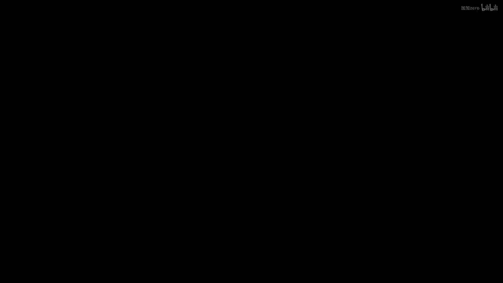

在本节课中，我们将学习深度生成模型的基本概念、哲学背景、广泛应用以及课程的整体结构。我们将探讨为什么生成模型是理解复杂数据的关键，并了解它们如何推动人工智能领域的发展。

## 概述

深度生成模型旨在学习数据的概率分布，并能够从中生成新的、类似的数据样本。其核心哲学是：**真正的理解意味着创造的能力**。如果我们声称理解一个概念（例如“苹果”或“意大利语”），那么我们应该能够生成与之相关的内容（例如画出一个苹果或说出一句意大利语）。生成模型正是将这种哲学转化为统计和计算框架，通过大量数据学习世界的潜在规律。

## 生成模型的哲学与动机

上一节我们概述了生成模型的目标。本节中，我们来看看其背后的核心思想。

理查德·费曼曾说过：“我不能创造的，我就不理解。” 生成模型将这一理念逆向应用：如果我们能生成逼真的图像、文本或语音，那就意味着我们对这些数据背后的结构和含义有了一定程度的理解。这种“通过生成来理解”的范式，为计算机视觉、自然语言处理等领域的许多任务提供了统一的框架。

例如，计算机图形学通过编写渲染器来从高级描述生成图像，这需要理解形状、颜色、光照等概念。深度生成模型则采用更数据驱动的方式，试图用最少的先验知识，从海量数据中直接学习如何生成。

从统计视角看，生成模型本质上是对数据 `x`（如图像、文本序列）的概率分布 `p(x)` 进行建模。这个模型是一个函数，为任何可能的输入 `x` 分配一个标量概率值，表示该数据出现的可能性。训练完成后，我们可以从这个分布中采样，从而创造出新的数据。因此，生成模型可以被视为**数据模拟器**。

## 生成模型的广泛应用

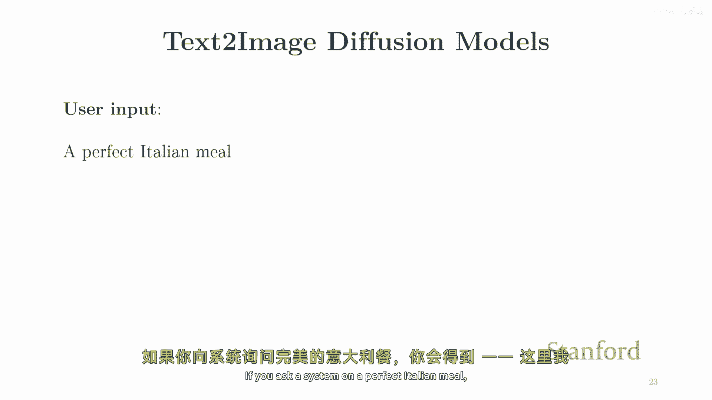

理解了基本概念后，我们来看看生成模型在各个领域带来的革命性进展。以下是其主要应用方向：

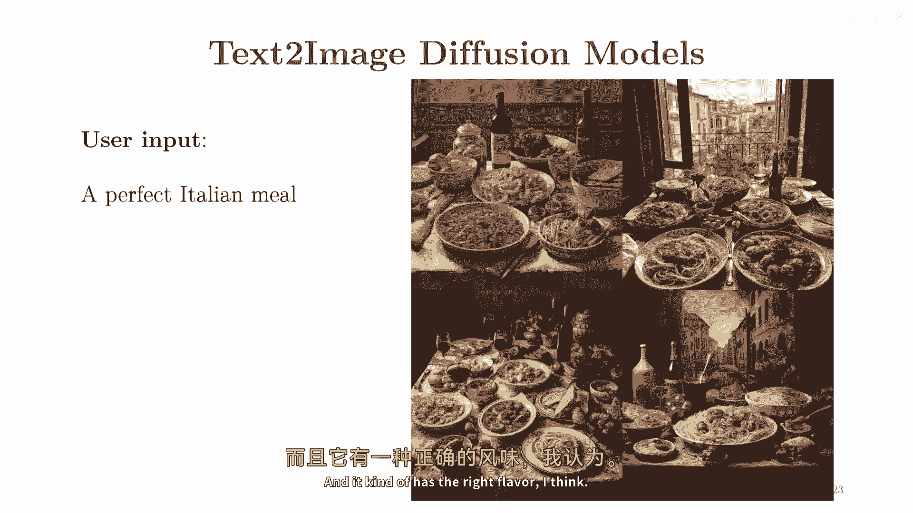

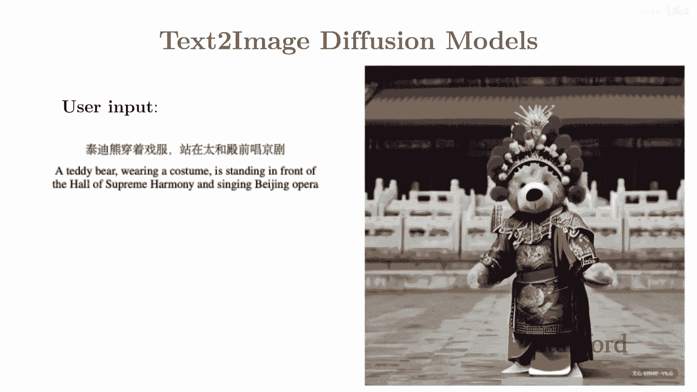

### 图像生成与编辑
生成模型在图像领域取得了令人瞩目的成就，从生成模糊的人脸到创造高分辨率、逼真的全新图像。

*   **文本到图像**：用户输入文字描述（如“一个骑在马上的宇航员”），模型能生成符合描述的图像。这展示了模型对概念及其组合方式的理解。
*   **图像编辑**：基于草图生成精美图像、为黑白照片上色、提升图像分辨率（超分辨率）、或根据文字指令修改图像（如“让鸟展开翅膀”）。
*   **医学成像**：减少获取清晰医学影像（如CT扫描）所需的辐射剂量或测量次数。

### 音频生成与处理
在音频领域，生成模型同样能合成高质量、自然的语音。

*   **文本到语音**：将文字转换为带有情感、语调自然的语音。
*   **音频超分辨率**：从低质量音频信号中恢复出高质量音频。

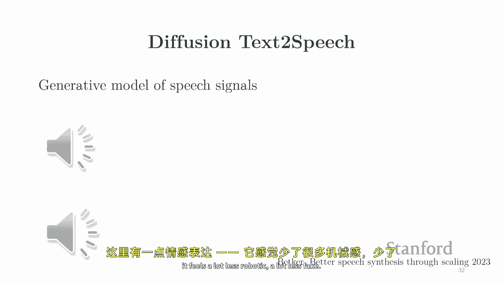

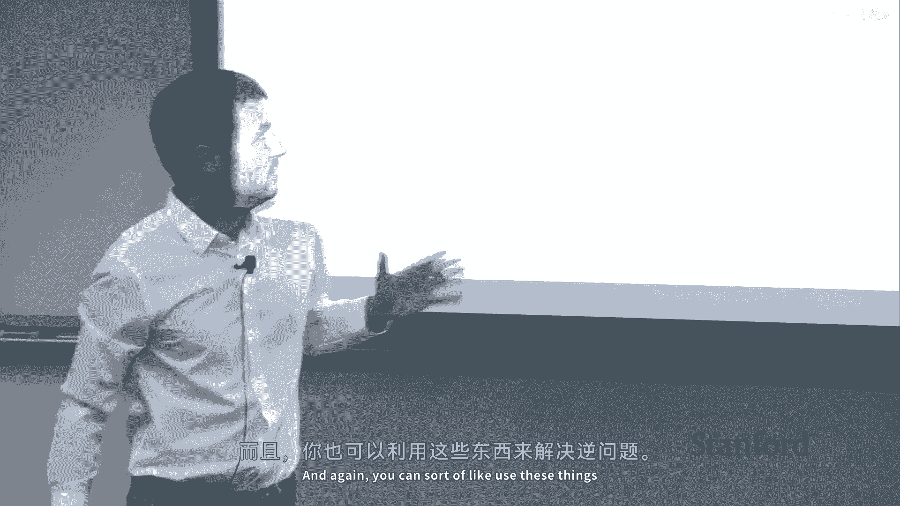

### 文本与代码生成
大型语言模型是文本生成模型的典型代表，它们不仅能生成流畅的文本，还能完成复杂任务。

*   **对话与内容创作**：根据提示完成句子、回答问题、撰写文章。
*   **机器翻译**：将一种语言的文本转换为另一种语言。
*   **代码生成**：根据自然语言描述自动生成代码片段。

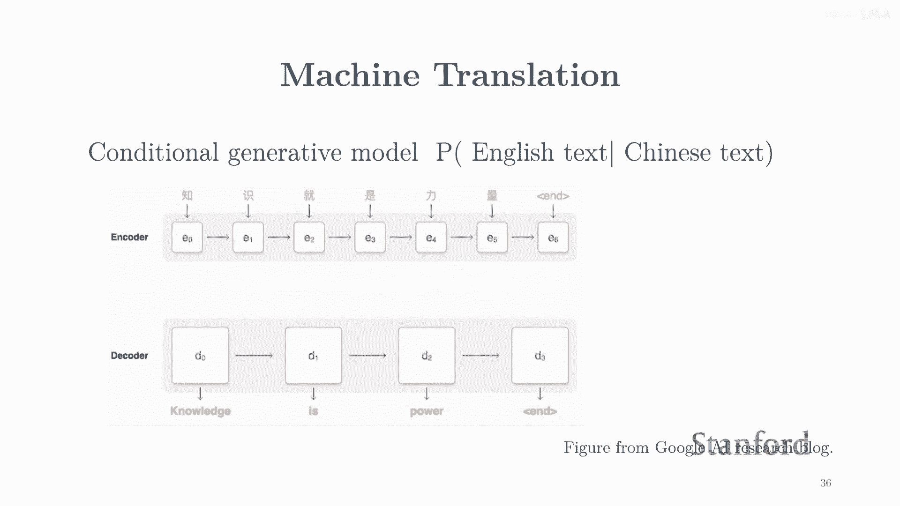

### 视频生成
视频可视为一系列连贯的图像，视频生成模型正朝着生成高质量、长篇幅内容的方向快速发展。

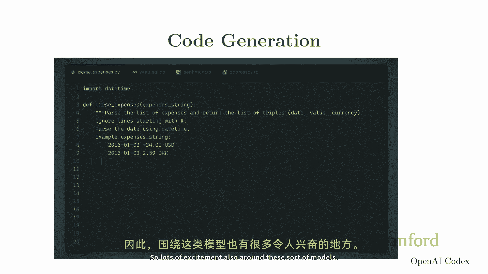

*   **文本到视频**：根据描述生成短视频片段。
*   **图像动画化**：让静态图像动起来。

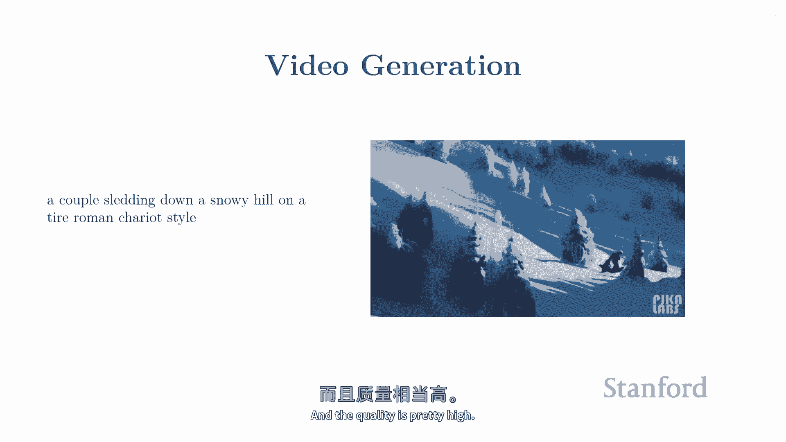

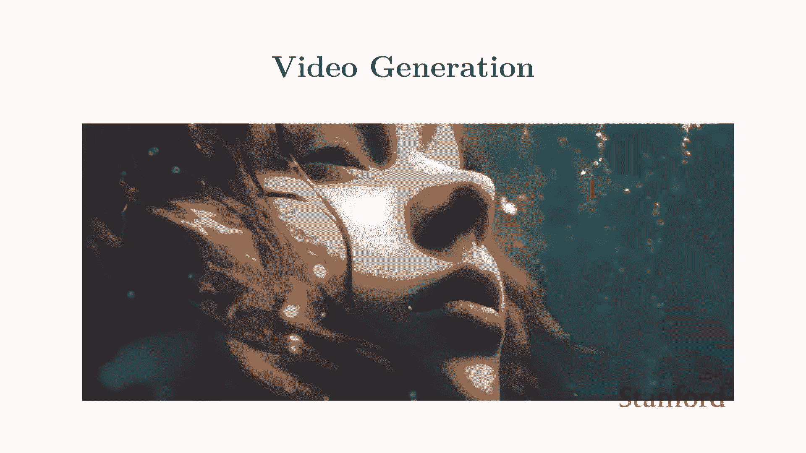

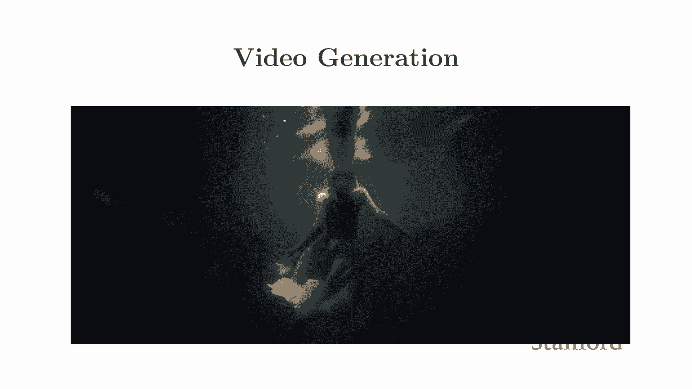

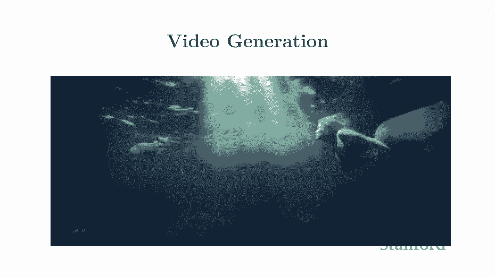

### 科学发现与决策制定
生成模型的应用已超越常见的媒体模态，进入科学和决策领域。

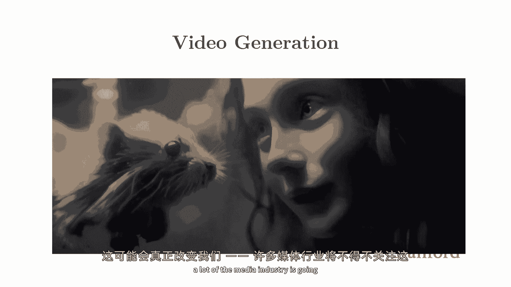

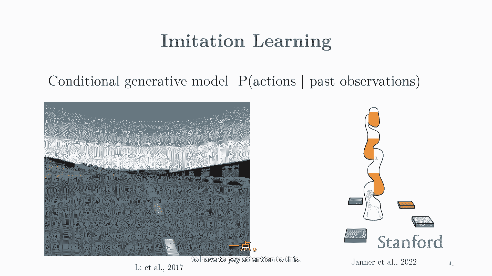

*   **分子与蛋白质设计**：生成具有特定属性或功能的新分子结构，用于药物研发。
*   **机器人模仿学习**：学习人类演示的行为，生成合理的动作序列，用于机器人控制（如驾驶、抓取）。

## 核心概念与课程路线图

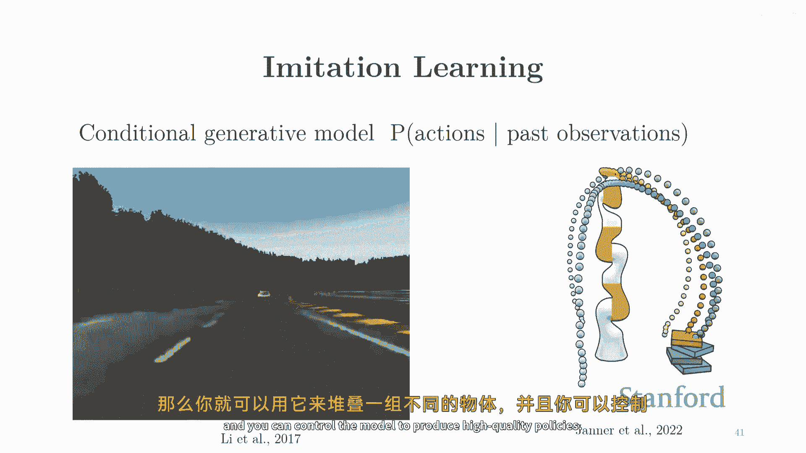

领略了生成模型的强大能力后，我们需要了解构建它们所需的核心构件。本课程将深入探讨以下三个关键概念：

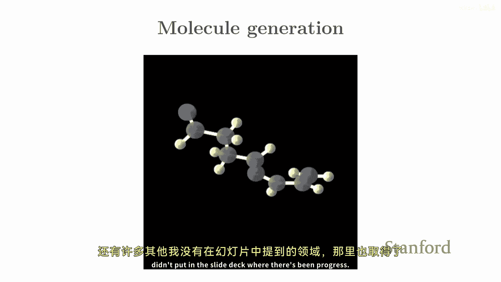

1.  **表示**：如何用神经网络等参数化模型来表示复杂的高维概率分布 `p(x)`。
2.  **学习**：如何利用数据来训练模型，即如何衡量并最小化模型分布与真实数据分布之间的差异。
3.  **推断**：如何从训练好的模型中高效采样，以及如何通过生成过程反推数据的潜在表示（逆向过程）。

基于这些概念，课程将系统性地讲解以下几类主流的深度生成模型：

*   **似然模型**：直接对概率分布 `p(x)` 进行建模并计算似然。
    *   **自回归模型**：将联合分布分解为条件分布的乘积，`p(x) = ∏ p(x_i | x_<i)`。常用于文本（如LLMs）。
    *   **标准化流模型**：通过一系列可逆变换将简单分布转换为复杂分布。
*   **隐变量模型**：引入隐变量 `z` 来增加模型表达能力，建模 `p(x) = ∫ p(x|z)p(z) dz`。
    *   **变分自编码器**：使用变分推断进行近似学习和推断。
*   **隐式生成模型**：不显式定义 `p(x)`，而是定义一个生成样本的随机过程。
    *   **生成对抗网络**：通过生成器和判别器的对抗博弈进行训练。
*   **基于能量的模型与扩散模型**：
    *   **扩散模型**：当前图像生成领域的核心技术，通过逐步去噪的过程生成数据。

## 要求与安排

为了顺利完成本课程，你需要具备以下基础：

*   **机器学习**：至少完成一门机器学习课程。
*   **数学**：熟悉概率论、微积分、线性代数、贝叶斯规则。
*   **编程**：熟悉Python，我们将使用PyTorch框架。

课程评估将包括：
*   **作业（15%）**：包含理论与编程任务。
*   **期中考试**：在课堂进行。
*   **课程项目（40%）**：是课程的核心部分，鼓励学生进行探索与创新。

## 总结

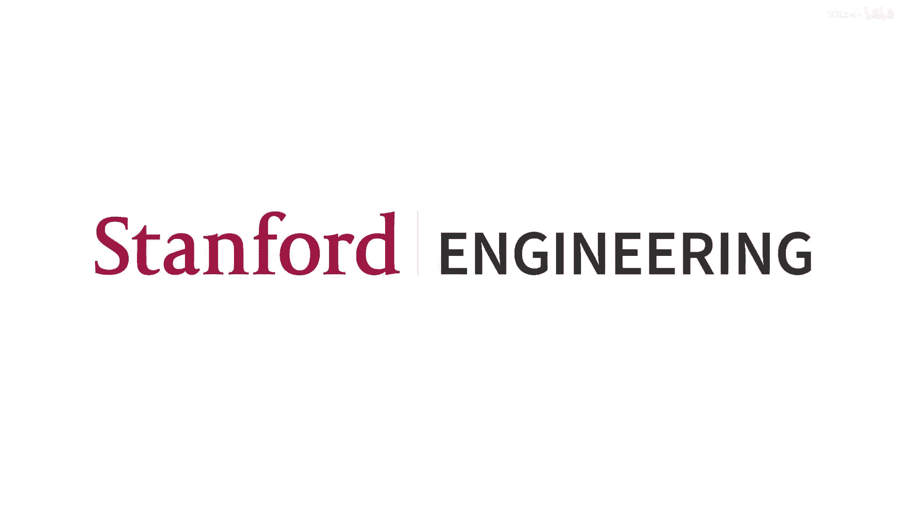

本节课中，我们一起学习了深度生成模型的宏伟图景。我们从“理解即创造”的哲学出发，探讨了生成模型作为数据模拟器的本质，并展示了其在图像、音频、文本、视频乃至科学发现中的广泛应用。最后，我们概述了构建这些模型所需的核心概念——表示、学习与推断，以及本课程将涵盖的具体模型类型和技术路线。这是一个充满活力与机遇的领域，希望本课程能为你打下坚实的基础，使你不仅能理解现有的强大系统，更能参与构建下一代生成模型。