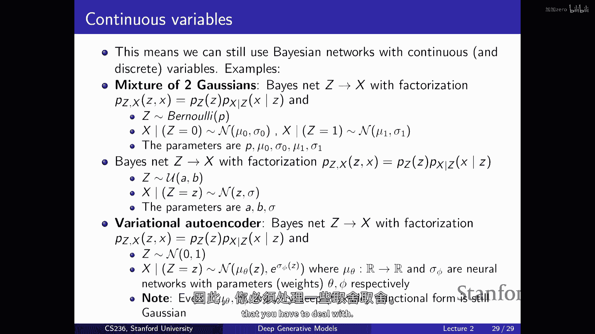

# 2：深度生成模型基础 🧠

在本节课中，我们将学习生成模型的基本概念，特别是如何应对高维数据建模中的“维度诅咒”挑战。我们将从概率图模型的高层概述开始，探讨生成模型与判别模型的区别，并最终了解如何利用神经网络来构建深度生成模型。

---

## 概述：生成模型的核心问题

生成模型的核心目标是：给定一组来自未知真实数据分布 \( p_{data} \) 的样本（如图像、文本），我们需要找到一个模型分布 \( p_{\theta} \) 来近似这个真实分布。一旦获得一个好的近似，我们就可以从中采样，生成新的、类似训练数据的数据。

为了实现这个目标，我们需要定义三个关键部分：
1.  **模型族**：一组由参数 \(\theta\) 索引的概率分布。
2.  **损失函数/相似度度量**：用于衡量模型分布 \( p_{\theta} \) 与真实数据分布 \( p_{data} \) 之间距离的方法。
3.  **优化**：在模型族中找到最接近真实分布的参数 \(\theta\)。

通过改变这三个部分的选择，我们可以得到不同类型的生成模型，如自回归模型、扩散模型和生成对抗网络。

---

## 维度诅咒与表示挑战 🧩

上一节我们介绍了生成模型的基本框架，本节中我们来看看构建模型时遇到的首要挑战：如何表示复杂的概率分布。

当我们处理低维数据（如单个伯努利随机变量）时，描述其分布很简单。然而，对于高维数据（如图像的像素或文本的单词），可能的状态空间会呈指数级增长。

例如，一个简单的黑白图像（28x28像素，每个像素是二进制的）有 \(2^{784}\) 种可能的状态。我们无法为每一种可能的状态存储一个概率值。因此，我们必须做出一些假设来简化表示。

一种极端的简化是假设所有随机变量**相互独立**。这样，联合分布可以分解为边缘分布的乘积：
\[
p(x_1, x_2, ..., x_n) = \prod_{i=1}^{n} p(x_i)
\]
这大大减少了参数数量（对于n个二进制变量，只需n个参数）。但此假设通常过强，无法捕捉数据中复杂的依赖关系（如图像中相邻像素的相关性）。

---

## 概率图模型：利用条件独立性 🔗

为了在表示能力和计算可行性之间取得平衡，我们引入**条件独立性**假设，这可以通过**概率图模型**（特别是贝叶斯网络）来形式化描述。

贝叶斯网络使用有向无环图来表示随机变量之间的依赖关系。每个节点的条件概率只依赖于其父节点。联合分布可以分解为一系列条件概率的乘积：
\[
p(x_1, x_2, ..., x_n) = \prod_{i=1}^{n} p(x_i | \text{parents}(x_i))
\]
通过精心设计图的结构（即限制每个节点的父节点数量），我们可以用相对较少的参数来表示复杂的联合分布。

例如，在**马尔可夫模型**中，我们假设当前状态只依赖于前一个状态，这对应一个链式图结构，显著降低了模型复杂度。

---

## 生成模型 vs. 判别模型 ⚖️

上一节我们讨论了如何利用图结构简化模型，本节我们来看看生成式建模与更常见的判别式建模有何不同。

两者都旨在从数据中学习，但关注点不同：
*   **生成模型**：尝试对**特征 \(X\)** 和**标签 \(Y\)** 的**联合分布** \(p(X, Y)\) 进行建模。它学习数据是如何“生成”的。
*   **判别模型**：直接对**条件分布** \(p(Y | X)\) 进行建模。它只关心给定输入 \(X\) 时，输出 \(Y\) 是什么。

**举例**：在垃圾邮件分类任务中（\(Y\)：是否为垃圾邮件，\(X\)：邮件中的词）。
*   **朴素贝叶斯（生成式）**：先建模 \(p(Y)\) 和 \(p(X|Y)\)，然后利用贝叶斯定理计算 \(p(Y|X)\)。它假设在给定 \(Y\) 的条件下，\(X\) 中的各个特征是独立的。
*   **逻辑回归（判别式）**：直接建模 \(p(Y|X)\)，通常假设其为 \(X\) 的线性函数经过sigmoid变换后的形式。

判别模型通常更简单高效，因为它无需对 \(X\) 的复杂分布进行建模。然而，生成模型功能更强大，一旦学得联合分布，不仅可以进行分类，还可以生成新数据、处理缺失值等。

---

## 神经网络的引入：从逻辑回归到深度生成模型 🧠

无论是生成模型中的条件概率 \(p(x_i | \text{parents}(x_i))\)，还是判别模型中的 \(p(Y|X)\)，当依赖关系复杂时，我们都难以用简单的表格或线性函数来刻画。

这时，**神经网络**成为了强大的工具。我们可以用神经网络来参数化这些复杂的条件分布。

以下是神经网络如何逐步增强模型表达能力的例子：
1.  **逻辑回归**：\( p(Y=1|X) = \sigma(\alpha^T X) \)，其中 \(\sigma\) 是sigmoid函数。这是一个线性决策边界。
2.  **单层神经网络**：\( p(Y=1|X) = \sigma(\alpha^T \text{ReLU}(AX + b)) \)。这引入了非线性变换，允许更复杂的决策边界。
3.  **深度神经网络**：堆叠更多层，可以拟合极其复杂的函数关系。

在生成模型中，最直接的应用是**神经自回归模型**。我们利用概率的链式法则分解联合分布，然后用神经网络来建模每一个条件概率 \(p(x_i | x_1, ..., x_{i-1})\)。现代的大型语言模型（LLMs）本质上就是深度的神经自回归模型。

---

## 连续变量与混合模型 🌊

到目前为止，我们主要讨论了离散变量。但许多数据（如图像像素值）本质上是连续的。

对于连续随机变量，我们使用**概率密度函数（PDF）** 而非概率质量函数。好消息是，之前讨论的所有原理（链式法则、贝叶斯网络、神经网络参数化）对连续变量同样适用。

我们可以构建包含连续和离散变量的混合模型。例如，**高斯混合模型**可以看作一个简单的贝叶斯网络：
*   隐变量 \(Z\) 是一个离散的类别变量（如伯努利分布）。
*   观测变量 \(X\) 的条件分布 \(p(X|Z)\) 是一个高斯分布，其参数依赖于 \(Z\) 的值。

更一般地，我们可以用神经网络根据隐变量 \(Z\) 来输出高斯分布的参数，从而得到非常灵活的条件分布。这就是**变分自编码器（VAE）** 等模型生成部分的核心思想。

---

## 总结 📚

本节课我们一起学习了深度生成模型的基础：
1.  **核心目标**：学习一个近似真实数据分布的模型分布，以用于生成、密度估计等任务。
2.  **核心挑战**：“维度诅咒”使得直接表示高维联合分布不可行。
3.  **关键工具1：条件独立性**：通过概率图模型（贝叶斯网络）做出结构化假设，简化联合分布的表示。
4.  **关键工具2：神经网络**：用于参数化复杂的条件概率分布，极大地提升了模型的表达能力。
5.  **建模范式**：生成模型学习联合分布 \(p(X,Y)\)，功能强大但计算复杂；判别模型学习条件分布 \(p(Y|X)\)，通常更高效直接。
6.  **统一视角**：许多现代深度生成模型（自回归、VAE、扩散模型）都是**链式法则分解**、**条件独立性假设**与**神经网络参数化**这三者以不同方式结合的产物。

在接下来的课程中，我们将深入探讨这些具体的深度生成模型。