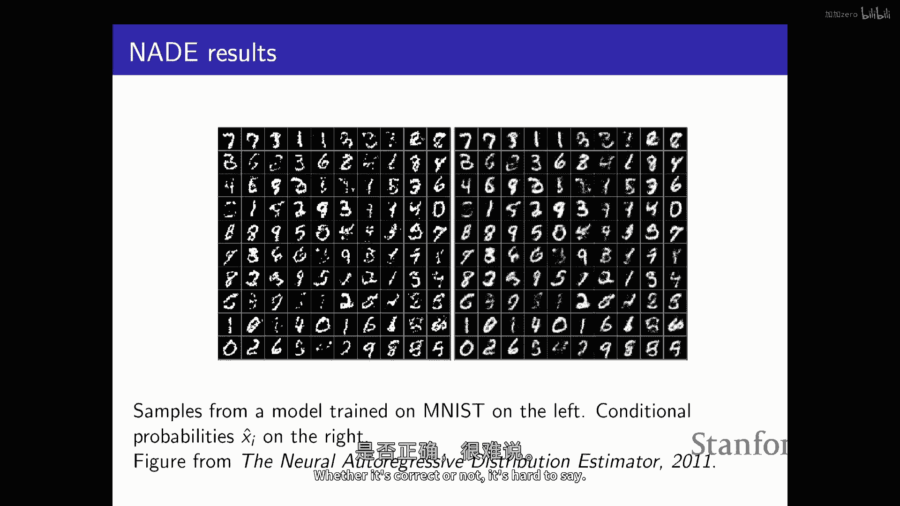
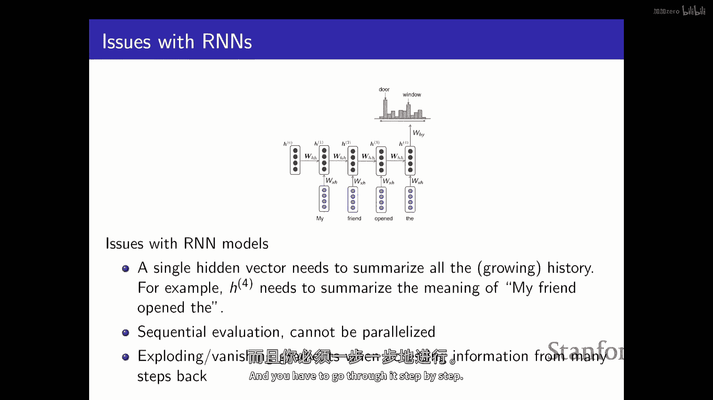

# 3：自回归生成模型 🧠


在本节课中，我们将要学习**自回归模型**。这是生成模型家族中的第一种类型，也是支撑像GPT这样的大型语言模型的核心技术。我们将从基本概念出发，逐步理解如何利用链式法则和神经网络来构建能够生成新数据的概率模型。

---

## 概述

生成模型的目标是学习一个能够近似真实数据分布的模型分布。我们拥有来自某个未知分布 `p_data` 的独立同分布样本。我们需要定义一个由参数 `θ` 决定的模型分布族 `p_model(x; θ)`，并优化这些参数，使模型分布尽可能接近数据分布。自回归模型是实现这一目标的一种有效方法。

---

## 链式法则与概率分解

上一节我们介绍了生成模型的通用框架，本节中我们来看看如何具体表示一个复杂的联合概率分布。

根据概率论中的链式法则，任何包含 `n` 个随机变量 `X1, X2, ..., Xn` 的联合分布都可以分解为一系列条件概率的乘积：

```
p(x1, x2, ..., xn) = p(x1) * p(x2 | x1) * p(x3 | x1, x2) * ... * p(xn | x1, ..., xn-1)
```

这种分解是完全通用的，不依赖于分布的任何特性。关键在于，我们需要为这些条件概率 `p(xi | x1, ..., xi-1)` 找到一个好的参数化表示方法。直接使用条件概率表在变量很多时是不可行的。

---

## 从分类器到生成模型

解决条件概率表示问题的一个核心思路是：**将每个条件概率的预测视为一个分类或回归问题**。

例如，预测像素 `Xi` 是黑色(0)还是白色(1)，可以看作一个二分类问题。我们可以使用逻辑回归模型：

```
p(xi = 1 | x1, ..., xi-1) = σ(α_i^T * [x1, ..., xi-1])
```

其中 `σ` 是sigmoid函数，`α_i` 是模型参数。这样，建模一个包含 `n` 个像素的图像联合分布，就转化为了 `n` 个相关的分类问题。

然而，为每个位置 `i` 都训练一个独立的逻辑回归模型（参数为 `α_i`）会导致参数数量庞大（与 `n^2` 成正比），且无法共享不同位置学到的特征。

---

## 神经自回归模型

为了构建更强大、参数更高效的模型，我们使用神经网络来参数化这些条件概率。



我们可以构建一个共享权重的神经网络。该网络以序列中之前的所有变量为输入，并输出下一个变量的条件分布参数。对于二值数据，输出是伯努利分布的参数（一个介于0和1之间的概率）；对于多值数据，输出是类别分布的参数（通过softmax获得）；对于连续数据，输出可以是高斯分布等连续分布的参数。


以下是构建块示意图（以全连接网络为例）：
```
输入: [x1, x2, ..., xi-1]
    ↓
隐藏层: h = f(W * [x1, ..., xi-1] + b)
    ↓
输出层: p(xi | ...) = g(V * h + c)
```
其中 `f` 是非线性激活函数，`g` 是sigmoid（二值）、softmax（多类）或线性层（连续分布参数）。

这种结构的优势在于：
1.  **权重共享**：同一个网络处理所有位置 `i` 的预测，大大减少了参数量。
2.  **计算高效**：评估一个数据点的概率时，可以顺序计算并重用部分中间结果。
3.  **采样简单**：生成新样本时，可以按照链式法则顺序采样：先根据 `p(x1)` 采样 `x1`，再根据 `p(x2|x1)` 采样 `x2`，依此类推。

---

## 掩码自编码器

我们注意到，上述神经自回归模型的计算图与**去噪自编码器**类似，但有一个关键区别：自回归模型在预测 `xi` 时，不允许“看到”未来的信息 `xi, xi+1, ..., xn`。

为了实现这一点，我们可以通过对神经网络权重矩阵应用**掩码**来强制实施这种因果依赖关系。具体做法是：
*   为网络中的每个神经元分配一个“依赖索引”。
*   在连接权重时，只允许神经元接收来自索引小于或等于其自身依赖索引的神经元的输入。
*   这样，网络的输出层在预测第 `i` 个变量时，其计算路径只会经过代表前 `i-1` 个变量的输入。

这种方法将自回归模型变成了一个**单次前向传播**就能输出所有条件概率参数的单一神经网络，极大提升了训练效率。

---

## 递归神经网络（RNN）方法

对于序列数据（如文本、语音），使用RNN来构建自回归模型是非常自然的选择。

RNN通过一个不断更新的隐藏状态 `h_t` 来总结历史信息：
```
h_t = f(W * h_{t-1} + U * x_t + b)
```
然后利用这个隐藏状态来预测序列中的下一个元素：
```
p(x_{t+1} | x1, ..., x_t) = g(V * h_t + c)
```

以下是RNN用于字符级文本生成的流程：
1.  将字符进行独热编码。
2.  初始化RNN隐藏状态 `h0`。
3.  对于序列中的每个位置 `t`，根据当前隐藏状态 `h_{t-1}` 和当前输入字符 `x_t`，计算下一个字符的概率分布 `p(x_{t+1})`。
4.  同时更新隐藏状态到 `h_t`。
5.  训练目标是最大化真实序列中下一个字符的对数概率。

RNN的优点是其参数数量固定，与序列长度无关，并且理论上可以处理任意长的依赖关系。它在字符级语言建模上取得了令人印象深刻的效果，可以生成类似莎士比亚文风的文本或格式正确的伪维基百科页面。

然而，RNN的缺点是训练和推理必须**顺序进行**，无法充分利用GPU的并行计算能力，并且长程依赖难以学习。

---

## 总结

本节课中我们一起学习了**自回归生成模型**的核心思想与方法。

*   **核心思想**：利用概率的链式法则，将高维联合分布的建模问题分解为一系列顺序的条件概率预测问题。
*   **基本方法**：使用神经网络（如逻辑回归、全连接网络、RNN）来参数化每个条件概率。
*   **关键优势**：
    *   提供了一种清晰且易于理解的生成模型框架。
    *   采样过程简单直接（顺序采样）。
    *   概率计算和训练目标（最大似然）定义明确。
*   **主要挑战**：
    *   需要选择一个变量顺序，这对于没有天然顺序的数据（如图像）可能是个问题。
    *   生成过程本质上是顺序的，无法并行化，导致生成速度较慢。
    *   对于RNN，存在长程依赖学习困难的问题。




自回归模型是理解现代生成式AI的重要基石，它为后续更复杂的模型（如Transformer）奠定了基础。