# 4：自回归模型与最大似然学习 🧠

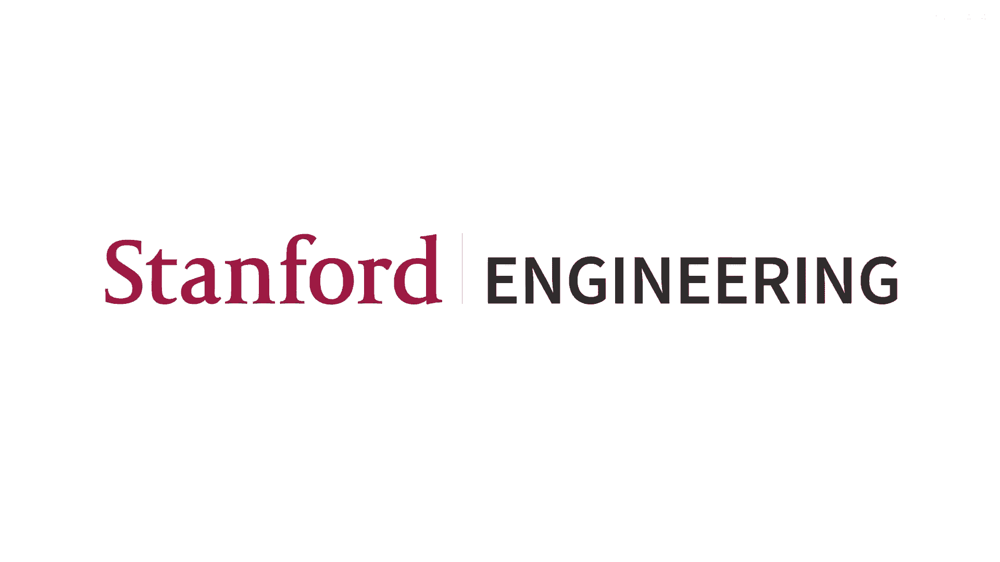

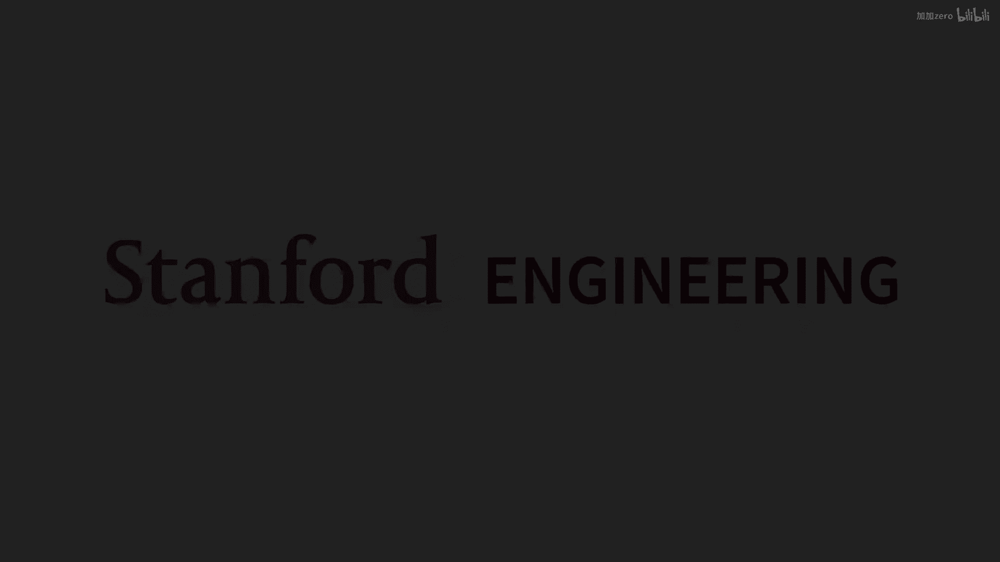

在本节课中，我们将学习自回归模型的核心概念、其面临的挑战，以及如何使用最大似然法来训练这些模型。我们将从回顾递归神经网络（RNN）开始，探讨其局限性，然后介绍注意力机制和Transformer架构如何解决这些问题。最后，我们将深入探讨如何通过最小化KL散度来定义学习目标，并将其转化为可计算的最大似然估计问题。

---

## 回顾：递归神经网络（RNN）的挑战 🔄

上一节我们介绍了自回归模型的基本思想。本节中，我们来看看递归神经网络（RNN）作为参数化自回归模型的一种方式。

RNN的关键思想是使用一个恒定数量的参数来建模序列，通过一个隐藏向量来跟踪并总结已看到的所有上下文信息，并用它来预测序列中的下一个元素（如标记或像素）。

例如，在构建文本模型时，RNN会处理序列“我朋友打开了”，更新其隐藏状态，最终得到一个隐藏向量 `h4`。然后，使用这个向量来预测下一个合理的标记（如“门”或“窗户”），并对不合理的续写赋予低概率。

尽管基于字符级别的RNN可以工作得相当好，但它面临几个主要挑战：

*   **信息瓶颈**：单个隐藏向量必须总结整个历史序列的全部含义，这可能是困难的。
*   **计算效率**：训练时需要展开计算图，导致速度较慢。
*   **长程依赖问题**：梯度在长序列中可能爆炸或消失，使得模型难以学习早期的依赖关系。

因此，RNN并非当前最先进语言模型的首选架构。

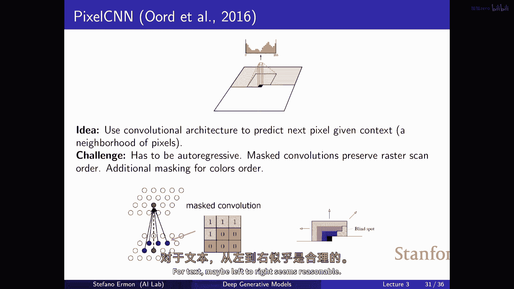

---

## 注意力机制与Transformer架构 ⚡

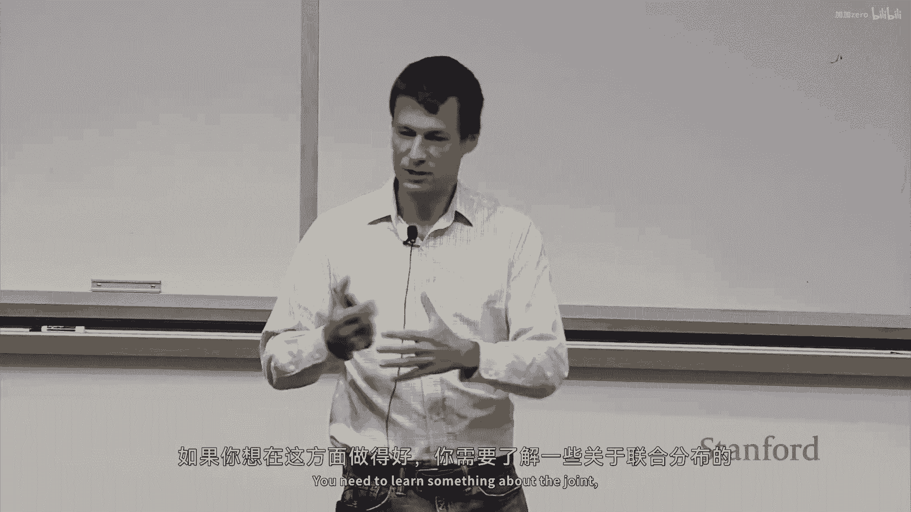

为了解决RNN的瓶颈问题，现代模型采用了注意力机制。其核心思想是：在预测下一个元素时，不是仅依赖最后一个隐藏状态，而是考虑整个过去序列的所有隐藏状态，并通过注意力机制有选择地关注最相关的部分。

注意力机制的工作原理类似于数据库查询。它计算一个**查询向量**（当前状态）与一系列**键向量**（历史状态）的相关性得分（例如通过点积）。这些得分经过softmax函数处理后，形成一个**注意力分布**，指明了序列中哪些部分对当前预测更重要。

以下是注意力得分的简化计算方式：
`attention_scores = softmax(query · key^T)`

通过注意力机制，模型在预测时能够利用整个历史上下文，同时又能选择性地忽略不相关信息。例如，在理解“机器人必须遵守给它的命令”时，注意力机制可以帮助模型聚焦于“机器人”和“命令”这两个关键标记。

在实际应用中，需要确保模型不会“窥视”未来的信息，这通过使用**掩码（Mask）** 来实现，强制模型只能关注当前位置之前的元素。

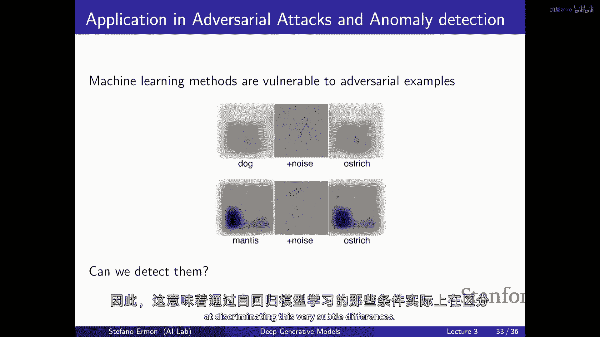

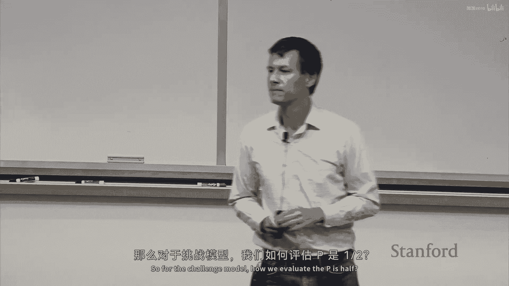

Transformer架构完全摒弃了循环结构，仅使用前馈计算和堆叠的注意力层。其关键优势在于**并行计算能力**：在训练时，可以并行计算序列中所有位置的预测，这极大地提升了训练效率，使得将模型扩展到巨大规模（如GPT系列）成为可能。

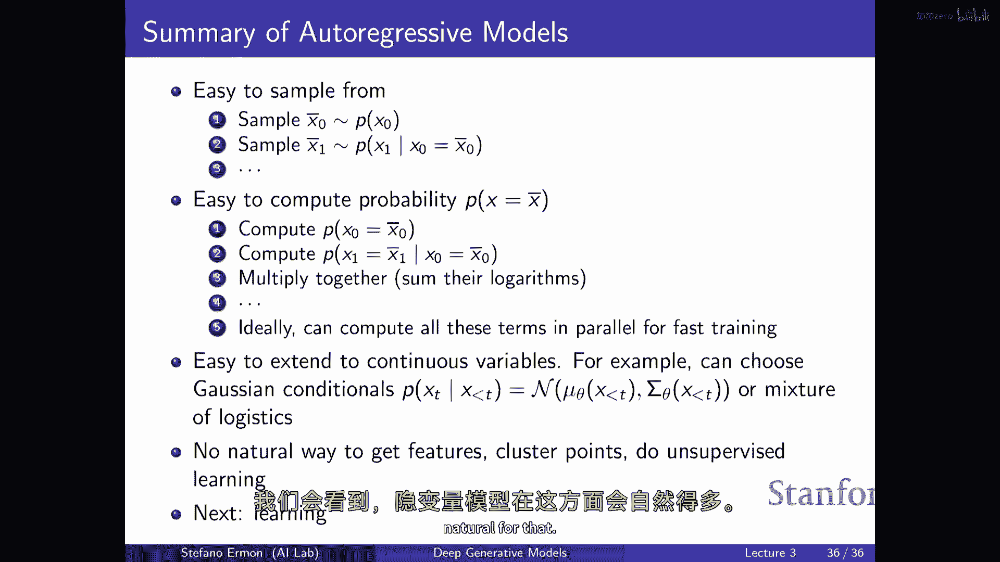

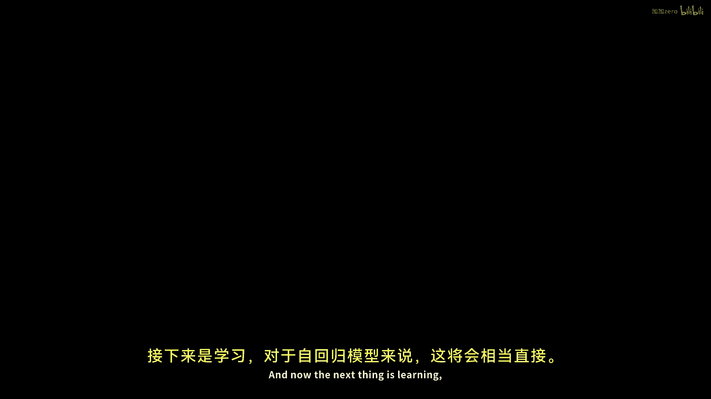

---

## 自回归模型在图像生成中的应用 🖼️

自回归模型不仅可用于文本，也可用于图像。我们可以将图像视为一个像素序列（例如从左到右、从上到下），然后逐个像素地生成。

对于RGB图像，每个像素包含红、绿、蓝三个通道。我们可以按顺序（如先红、后绿、再蓝）为每个通道建模条件概率分布。这同样可以使用带有掩码的RNN或CNN架构来实现，确保在预测某个通道时，只允许使用之前像素和当前像素已生成通道的信息。

使用卷积神经网络（CNN）构建图像自回归模型时，需要通过设置卷积核的权重为0来实施掩码，确保感受野只包含“过去”的像素，这与Transformer中的因果掩码思想一致。

尽管自回归图像模型可以生成结构合理的图像完成样本，并能用于异常检测（例如区分自然图像和对抗性攻击图像），但由于需要逐个像素顺序生成，其采样速度通常较慢。

---

## 最大似然学习：理论基础 📈

现在，我们转向如何训练自回归模型。我们的目标是找到一个模型分布 \( p_{\theta} \)，使其尽可能接近真实的数据分布 \( p_{data} \)。

我们使用**KL散度（Kullback-Leibler Divergence）** 来衡量两个分布之间的差异：

`D_KL(p_data || p_θ) = E_{x~p_data} [ log( p_data(x) / p_θ(x) ) ]`

KL散度是非负的，且仅在两分布完全相同时为零。它有一个直观的信息论解释：它衡量了使用基于模型 \( p_{\theta} \) 的压缩方案来压缩来自真实分布 \( p_{data} \) 的数据时，所损失的平均信息量（即效率低下程度）。

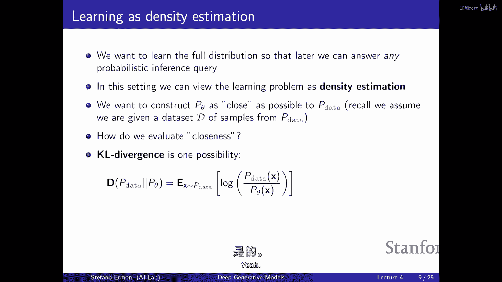

我们的学习目标是最小化这个KL散度。将其展开后，我们发现最小化 \( D_KL(p_{data} || p_{\theta}) \) 等价于**最大化模型在数据分布下的期望对数似然**：

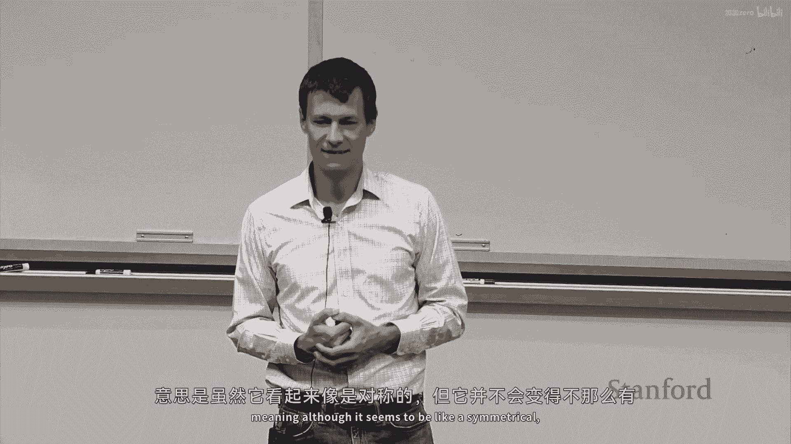

`argmin_θ D_KL(p_data || p_θ) = argmax_θ E_{x~p_data} [ log p_θ(x) ]`

由于我们无法直接计算关于 \( p_{data} \) 的期望，我们使用从数据集中采样的**蒙特卡洛估计**来近似，即用训练集上的平均对数似然来代替期望：

`E_{x~p_data} [ log p_θ(x) ] ≈ (1/N) Σ_{i=1}^{N} log p_θ(x^{(i)})`

其中 \( x^{(i)} \) 是训练集中的样本。最大化这个平均对数似然，就是经典的**最大似然估计（MLE）**。

对于自回归模型，单个数据点 \( x \) 的似然可以通过链式法则轻松计算：
`p_θ(x) = Π_{j=1}^{D} p_θ(x_j | x_<j)`

因此，整个数据集的对数似然就是所有数据点、所有位置上条件对数概率的总和。这实质上等同于训练一系列分类器（每个条件概率对应一个），让它们尽可能准确地预测序列中的下一个元素。

---

## 实践优化与挑战 ⚙️

在实际训练中，我们无法直接计算整个数据集的精确梯度（计算量过大）。我们再次使用蒙特卡洛思想，采用**随机梯度下降（SGD）** 或**小批量（Mini-batch）** 梯度下降。我们通过从数据集中随机采样一小批（Batch）数据来计算梯度的无偏估计，并以此更新模型参数。

在优化过程中，需要注意机器学习中的经典问题：

*   **过拟合（Overfitting）**：模型可能只是记住了训练集，而在未见数据上表现不佳。
*   **偏差-方差权衡（Bias-Variance Trade-off）**：模型过于简单（高偏差）可能无法捕捉数据规律；模型过于复杂（高方差）则容易过拟合。

以下是应对这些挑战的常见策略：

*   **使用验证集**：留出一部分数据不参与训练，用于监控模型在未见数据上的性能，判断是否过拟合。
*   **正则化（Regularization）**：在损失函数中添加惩罚项（如L1/L2正则化），偏好参数更小或更简单的模型。
*   **调整模型容量**：通过减少网络层数、神经元数量或增加参数共享来控制模型复杂度。

---

## 总结 🎯

本节课中我们一起学习了：

1.  **自回归模型的核心**：使用链式法则将联合分布分解为一系列条件分布的乘积。
2.  **RNN的局限性**：存在信息瓶颈、训练慢和长程依赖问题。
3.  **注意力与Transformer的优势**：通过全局上下文和选择性关注解决了RNN的瓶颈，并利用并行计算实现了高效训练与扩展。
4.  **图像上的自回归模型**：将图像视为序列，可以用于生成和异常检测，但采样较慢。
5.  **最大似然学习理论**：通过最小化KL散度，我们将学习目标转化为最大化数据对数似然，这等价于优化一系列条件预测分类器。
6.  **实践优化方法**：使用随机梯度下降和小批量训练来高效优化参数，并需要注意过拟合和偏差-方差权衡问题。

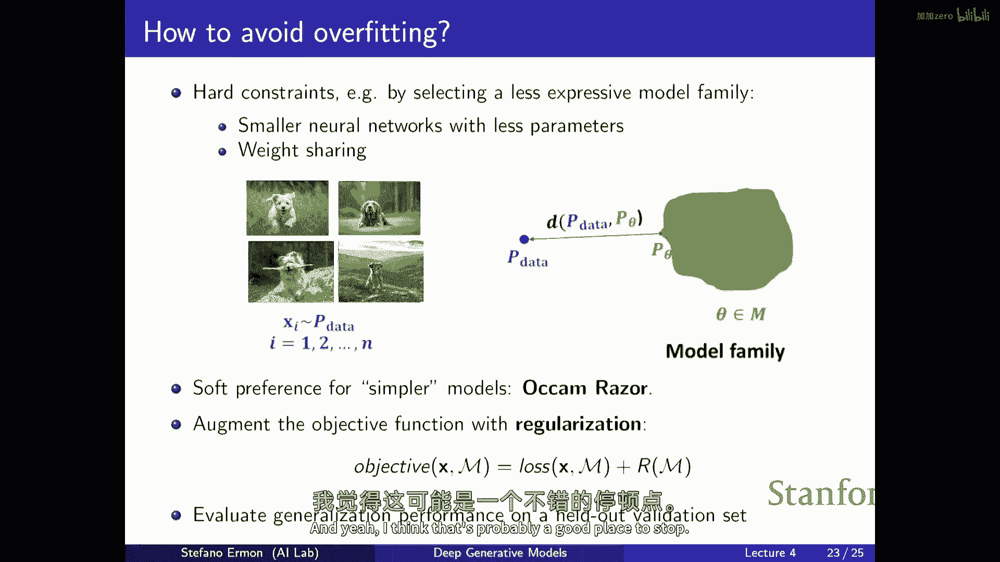

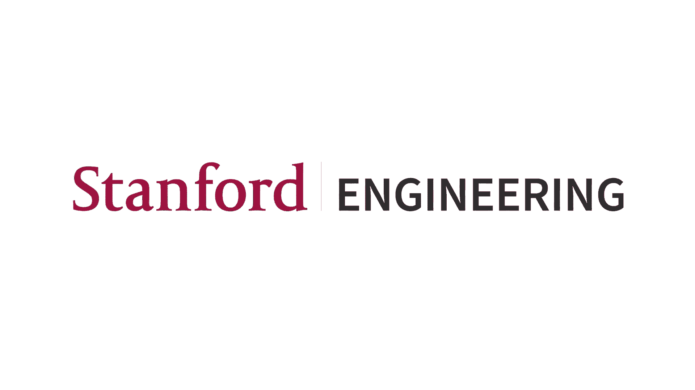

自回归模型提供了可计算的似然和直接的采样过程，是生成模型中的一个强大工具。在接下来的课程中，我们将探讨另一类重要的模型——隐变量模型。