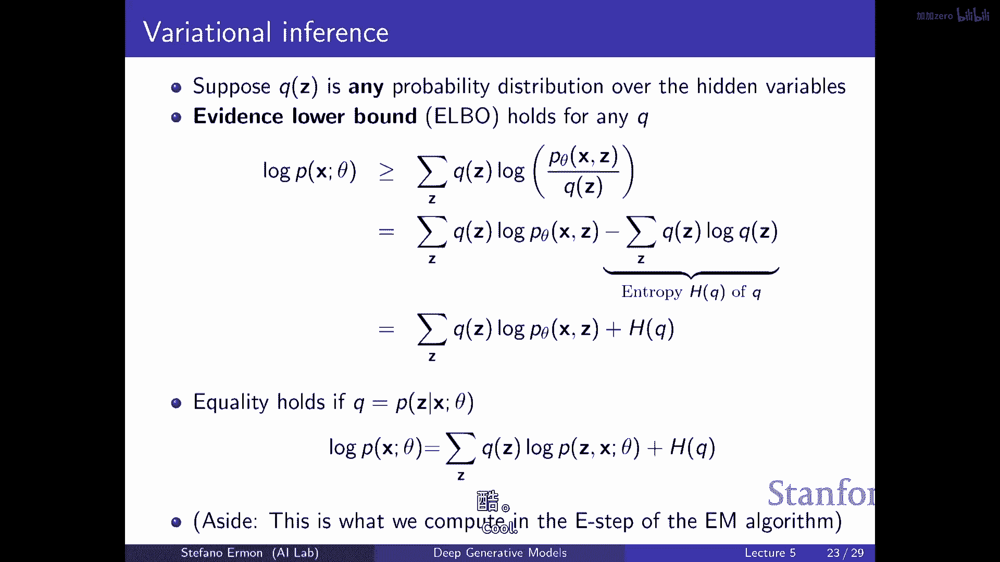

# 5：深度生成模型 I - 变分自编码器 (VAEs) 🧠

在本节课中，我们将要学习一种新的生成模型家族——潜在变量模型，特别是变分自编码器。我们将从简单的混合模型开始，理解其核心思想，然后逐步深入到如何利用深度神经网络构建更强大的模型，并解决其中的学习和推断难题。

---

## 概述：为什么需要潜在变量模型？ 🤔

在之前的课程中，我们介绍了自回归模型。它们通过链式法则将联合概率分解为一系列条件概率的乘积，并使用神经网络来近似这些条件。这类模型易于评估似然，便于通过最大似然进行训练。

然而，自回归模型也存在一些缺点：需要预先确定变量顺序、生成速度较慢（通常需要逐个变量生成），并且难以从无监督数据中直接提取有意义的特征。

当我们试图建模复杂的数据集（例如人脸图像）时，数据中存在大量潜在的变异因素（如年龄、姿势、发色）。这些因素没有被明确标注，但直觉上它们构成了数据的“潜在结构”。潜在变量模型的核心思想就是引入一组未被观察的随机变量 **Z**（即潜在变量），来捕获这些隐藏的变异因素。

通过建立 **X**（观测数据，如图像像素）和 **Z** 的联合概率分布，我们期望模型能变得更灵活，并且能够从数据中推断出这些潜在变量，从而获得可用于下游任务（如分类）的特征表示。

---

## 从简单模型开始：高斯混合模型 (GMM) 🎯

上一节我们回顾了自回归模型的优缺点，本节中我们来看看最简单的潜在变量模型——高斯混合模型。它可以被视为一个“浅层”的潜在变量模型，不涉及深度神经网络。

在这个模型中，潜在变量 **Z** 是一个类别随机变量（例如，有 K 个类别，代表 K 个混合成分）。给定 **Z** 的取值，观测数据 **X** 的条件分布是一个高斯分布。每个类别 **k** 对应一个具有特定均值 **μ_k** 和协方差 **Σ_k** 的高斯分布。

**生成过程如下：**
1.  从类别分布 **P(Z)**（如均匀分布）中采样一个混合成分 **z**。
2.  根据采样到的 **z**，从对应的高斯分布 **P(X|Z=z)** 中采样数据点 **x**。

**公式描述：**
*   **P(Z=k)** = π_k （混合权重）
*   **P(X|Z=k)** = N(X; μ_k, Σ_k) （第 k 个高斯成分）
*   **P(X)** = Σ_{k=1}^{K} π_k * N(X; μ_k, Σ_k) （边际分布，即观测数据的分布）

尽管每个混合成分（**P(X|Z)**）只是一个简单的高斯分布，但它们的混合（边际分布 **P(X)**）可以形成非常复杂、多模态的概率密度形状。这展示了潜在变量模型的核心优势：**用简单的条件分布组合出灵活的边际分布**。

GMM 也可以用于聚类。在拟合模型后，对于一个新数据点 **x**，我们可以计算其后验概率 **P(Z=k|X=x)**，来判断它最可能属于哪个簇。

然而，GMM 的表示能力有限。对于像图像这样的复杂数据，除非混合成分数量 **K** 极大，否则很难很好地拟合数据分布。

---

## 迈向深度：变分自编码器 (VAE) 的直觉 🏗️

上一节我们介绍了浅层的混合模型，本节中我们来看看如何用深度神经网络构建更强大的潜在变量模型，即变分自编码器。

在 VAE 中，我们依然保持 **Z** -> **X** 的生成结构。但关键变化在于：
1.  **Z** 通常是连续的多维变量，例如从一个简单的先验分布（如标准高斯分布 **N(0, I)**）中采样。
2.  条件分布 **P_θ(X|Z)** 的参数（例如高斯分布的均值 **μ** 和方差 **σ^2**）不再是一个查找表，而是由神经网络（生成网络）根据 **Z** 计算得出。这个神经网络可以是非常复杂的非线性函数。

**生成过程如下：**
1.  从先验分布 **P(Z)**（如 **N(0, I)**）中采样一个潜在向量 **z**。
2.  将 **z** 输入生成网络，得到条件分布 **P_θ(X|Z=z)** 的参数（例如 **μ_θ(z)** 和 **σ_θ(z)**）。
3.  从该分布中采样，生成数据 **x**。

**公式描述：**
*   **P(Z)** = N(Z; 0, I) （先验分布）
*   **P_θ(X|Z)** = N(X; μ_θ(Z), σ_θ(Z)²) （由神经网络参数化的似然）
*   **P_θ(X)** = ∫ P_θ(X|Z) P(Z) dZ （边际分布，需要对所有 Z 积分）

这可以理解为一种 **“无限混合模型”**：先验分布 **P(Z)** 定义了无限多个混合成分（每个 **z** 值对应一个成分），而神经网络决定了每个成分对应的简单分布（如高斯）的参数。尽管每个成分很简单，但无限多个简单分布的混合可以产生极其复杂的边际分布。

**VAE 的目标依然是最大化观测数据的对数似然（边际似然）**。但问题在于，计算或估计这个边际似然 **log P_θ(X)** 非常困难，因为它涉及对潜在变量 **Z** 的积分（或求和），这在计算上是难以处理的。

---

## 核心挑战：如何学习与推断？ 🧩

上一节我们建立了 VAE 的生成模型，本节中我们来看看训练这个模型面临的核心挑战以及解决思路。

我们的目标是最大化训练数据的平均对数边际似然：
**目标：max_θ (1/M) Σ_{i=1}^{M} log P_θ(x_i)**

困难在于，对于单个数据点 **x**，其对数边际似然 **log P_θ(x)** = log ∫ P_θ(x, z) dz 难以直接计算。

**一种天真的尝试：均匀采样蒙特卡洛估计**
我们可以将积分写成期望形式：**P_θ(x) = ∫ P_θ(x, z) dz = |Z| * E_{z~Uniform(Z)}[P_θ(x, z)]**。
然后通过从均匀分布中采样 **z** 来用样本均值近似期望。但这种方法方差极高，因为绝大多数随机采样的 **z** 与当前 **x** 不匹配，导致 **P_θ(x, z)** 的值极小，估计效率低下。

**更好的方法：重要性采样**
我们引入一个提议分布 **q(z)**（可以依赖于 **x**），并重写边际似然：
**P_θ(x) = ∫ [P_θ(x, z) / q(z)] q(z) dz = E_{z~q(z)}[P_θ(x, z) / q(z)]**。
现在我们可以从 **q(z)** 中采样来估计期望。关键在于选择一个好的 **q(z)**，使其能将概率质量集中在那些与 **x** 兼容的、**P_θ(x, z)** 值较大的 **z** 区域。

然而，我们最终需要优化的是 **log P_θ(x)**，而不是 **P_θ(x)**。对重要性采样估计量直接取对数会引入偏差（因为 **log E[·] ≠ E[log ·]**）。

**解决方案：证据下界 (ELBO)**
利用 Jensen 不等式，我们可以得到对数边际似然的一个下界：
**log P_θ(x) = log E_{z~q(z)}[P_θ(x, z) / q(z)] ≥ E_{z~q(z)}[log (P_θ(x, z) / q(z))]**
右边这个量被称为 **证据下界**。我们可以通过从 **q(z)** 中采样来估计并优化这个下界。

这个下界可以进一步分解为两项：
**ELBO(θ, q; x) = E_{z~q(z)}[log P_θ(x|z)] - D_KL(q(z) || P(z))**
*   第一项是 **重构项**：期望在 **q(z)** 下，由 **z** 生成 **x** 的对数似然。它鼓励模型能够很好地从潜在变量重建数据。
*   第二项是 **KL 散度项**：衡量提议分布 **q(z)** 与先验分布 **P(z)** 的差异。它鼓励 **q(z)** 不要偏离先验太远，起到正则化作用。

**关键洞察：**
*   对于任意 **q(z)**，ELBO 都是 **log P_θ(x)** 的一个下界。
*   当 **q(z)** 恰好等于真实后验分布 **P_θ(z|x)** 时，这个下界是紧的，即 **ELBO = log P_θ(x)**。
*   因此，训练 VAE 的策略就变成了：**同时优化生成模型参数 θ 和推断模型（即提议分布）参数 φ**，以最大化 ELBO。推断模型 **q_φ(z|x)** 通常也用另一个神经网络（编码器）来参数化，它接收 **x** 并输出 **q_φ(z|x)** 的参数（例如高斯分布的均值和方差）。

---

## 总结 🎓

本节课中我们一起学习了潜在变量模型，特别是变分自编码器。

1.  **动机**：为了建模复杂数据中的隐藏结构，并学习有意义的特征表示，我们引入了潜在变量 **Z**。
2.  **从简单到复杂**：我们从高斯混合模型入手，理解了用简单条件分布混合得到复杂边际分布的思想。
3.  **VAE 框架**：在 VAE 中，我们使用深度神经网络（生成器）将连续潜在变量 **Z** 映射到观测数据 **X** 的条件分布参数。
4.  **学习挑战**：直接最大化数据的边际似然难以处理，因为涉及对 **Z** 的积分。
5.  **解决方案**：我们引入了证据下界作为边际似然的一个可优化的替代目标。ELBO 包含重构项和正则化项。
6.  **推断与学习**：VAE 通过另一个神经网络（编码器）来近似潜在变量的后验分布 **q_φ(z|x)**，并联合优化编码器和解码器（生成器）的参数以最大化 ELBO。

VAE 为我们提供了一种原则性的方法，能够同时学习一个生成模型和一个将数据映射到潜在空间的推断模型，是无监督学习和表示学习中的一个强大工具。