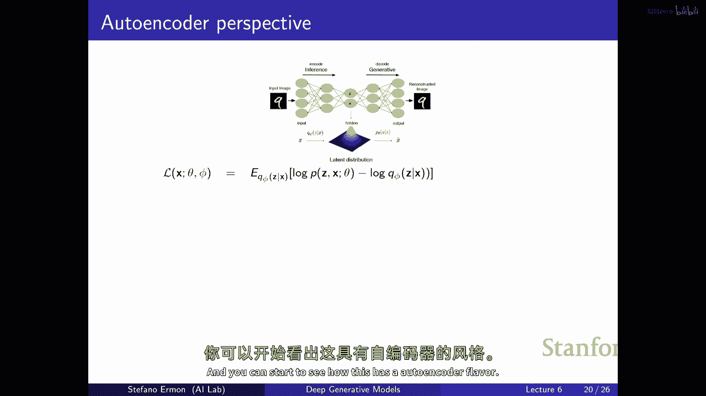

# 6：变分自编码器 (VAEs) 核心原理与训练 🧠

在本节课中，我们将学习变分自编码器的完整模型。我们将再次讨论证据下界，并了解如何解决相应的优化问题。最后，我们将解释为何该模型被称为“变分自编码器”，并展示其与自编码器的联系及如何将其推广为生成模型。

## 模型回顾与核心思想

上一节我们介绍了生成模型的基本概念。本节中，我们来看看变分自编码器的具体形式。

变分自编码器是一种生成模型，通常简称为 VAE。其最简单的形式如下：首先，从一个简单的潜在变量 **z** 中采样，例如从一个均值为零、协方差矩阵为单位矩阵的多元正态分布中采样。这可以看作是最简单的先验分布。

然后，将采样得到的 **z** 通过两个神经网络：**μ_θ** 和 **σ_θ**。这两个网络输出另一个高斯分布的参数（均值向量和协方差矩阵），这些参数依赖于 **z**。最后，从这个条件分布 **P(x|z)** 中生成数据点 **x**。

这种模型的好处在于，尽管构建模块简单（简单的高斯先验和条件分布），但得到的 **x** 的边缘分布 **P(x)** 可以非常灵活和通用。因为它可以被视为一个无限大的高斯混合模型，每个 **z** 对应一个高斯分量。为了计算生成某个数据点的概率，我们需要对所有可能的 **z** 值进行积分。

**核心公式**：
先验分布：`z ~ p(z) = N(0, I)`
生成过程：`x|z ~ p_θ(x|z) = N(μ_θ(z), σ_θ(z))`
目标：最大化数据的边际似然 `p_θ(x) = ∫ p_θ(x|z) p(z) dz`

然而，其代价是模型训练困难，因为评估边际似然 `p(x)` 的计算成本很高，这导致无法直接通过最大似然估计来优化参数。

## 变分推断与证据下界 (ELBO)

由于直接优化边际似然不可行，我们需要借助变分推断技术。其核心思想是引入一个由参数 φ 控制的辅助分布 **q_φ(z|x)**，来近似真实但难以计算的后验分布 **p_θ(z|x)**。

我们可以利用 Jensen 不等式，为对数边际似然构建一个下界，即证据下界。

**核心公式**：
`log p_θ(x) >= ELBO(θ, φ; x) = E_{z~q_φ(z|x)}[log p_θ(x, z) - log q_φ(z|x)]`

这个下界可以进一步分解为两项：
1.  重构项：`E_{z~q_φ(z|x)}[log p_θ(x|z)]`，衡量模型根据推断出的 **z** 重构 **x** 的能力。
2.  正则化项：`-D_KL(q_φ(z|x) || p(z))`，衡量近似后验 **q_φ(z|x)** 与先验 **p(z)** 之间的 KL 散度，促使 **q** 的分布不要偏离先验太远。

当 **q_φ(z|x)** 等于真实后验 **p_θ(z|x)** 时，这个下界是紧的，即等于对数边际似然。但真实后验通常无法计算，因此我们的目标是优化 **q_φ** 使其尽可能接近真实后验，从而最大化 ELBO。

## 训练 VAE：优化 ELBO

我们的目标是最大化整个数据集的平均对数似然。通过对每个数据点的 ELBO 求和，我们可以得到数据集对数似然的一个下界。

**优化目标**：
`max_{θ, φ} Σ_{x_i in D} ELBO(θ, φ; x_i)`

这涉及到同时优化生成模型参数 **θ**（解码器）和推断模型参数 **φ**（编码器）。优化过程通常使用随机梯度上升。

关于 **θ** 的梯度计算相对直接，因为期望内部的项不依赖于 **θ** 的采样过程。困难在于计算关于 **φ** 的梯度，因为期望是基于依赖于 **φ** 的分布 **q_φ** 计算的。

## 重参数化技巧

为了解决关于 **φ** 的梯度问题，我们使用重参数化技巧。这个技巧要求潜在变量 **z** 是连续的（例如高斯分布）。

其核心思想是将从 **q_φ(z|x)** 中采样 **z** 的过程，重写为一个确定性变换：首先从一个固定的简单分布（如标准正态分布）中采样噪声 **ε**，然后通过一个依赖于 **φ** 的确定性函数 **g_φ** 得到 **z**。

**核心公式（以高斯为例）**：
原始采样：`z ~ q_φ(z|x) = N(μ_φ(x), σ_φ(x)^2)`
重参数化：`z = μ_φ(x) + σ_φ(x) · ε`，其中 `ε ~ N(0, I)`

通过这种变换，关于 **φ** 的梯度就可以通过蒙特卡洛采样和链式法则进行计算，因为梯度路径现在是确定且可微的。

**梯度估计**：
`∇_φ E_{z~q_φ}[f(z)] ≈ (1/L) Σ_{l=1}^L ∇_φ f(μ_φ(x) + σ_φ(x) · ε^{(l)})`，其中 `ε^{(l)} ~ N(0, I)`

## 摊销推断与编码器

理论上，每个数据点 **x_i** 都应有自己独立的变分参数 **φ_i** 来获得最紧的下界，但这在大数据集上不可扩展。

因此，我们引入摊销推断：使用一个共享的神经网络（编码器）来为所有数据点预测变分参数。这个编码器以 **x** 为输入，输出近似后验 **q_φ(z|x)** 的参数（例如高斯分布的均值和方差）。

**编码器-解码器结构**：
*   **编码器 (推断网络)**：`q_φ(z|x)`，将数据 **x** 映射到潜在空间分布参数。
*   **解码器 (生成网络)**：`p_θ(x|z)`，将潜在变量 **z** 映射回数据空间。

这样，我们只需要同时优化编码器参数 **φ** 和解码器参数 **θ**，大大提高了计算效率。虽然这可能会损失一些灵活性（因为所有数据点共享同一个编码器），但通过编码器的泛化能力，模型在新数据上也能进行有效推断。

## 自编码器视角与总结

本节课中我们一起学习了变分自编码器的核心原理和训练方法。

从结构上看，VAE 很像一个自编码器：编码器将数据压缩到潜在空间，解码器从潜在表示重建数据。然而，VAE 的关键区别在于：
1.  编码器输出的是潜在空间的**分布参数**，而非固定的点。
2.  训练目标不是最小化重建误差，而是最大化 ELBO，它同时包含了**重建精度**和**潜在空间正则化**（KL 散度项）。

因此，VAE 是一个**概率生成模型**，其潜在空间具有良好结构（接近先验分布），允许我们通过从先验 `p(z)` 中采样并经过解码器来生成新的数据样本。

总结来说，VAE 通过变分推断和重参数化技巧，巧妙地解决了含复杂潜在变量生成模型的训练难题，将推断和学习过程统一在一个端到端的神经网络框架内，同时实现了数据生成和潜在表示学习。