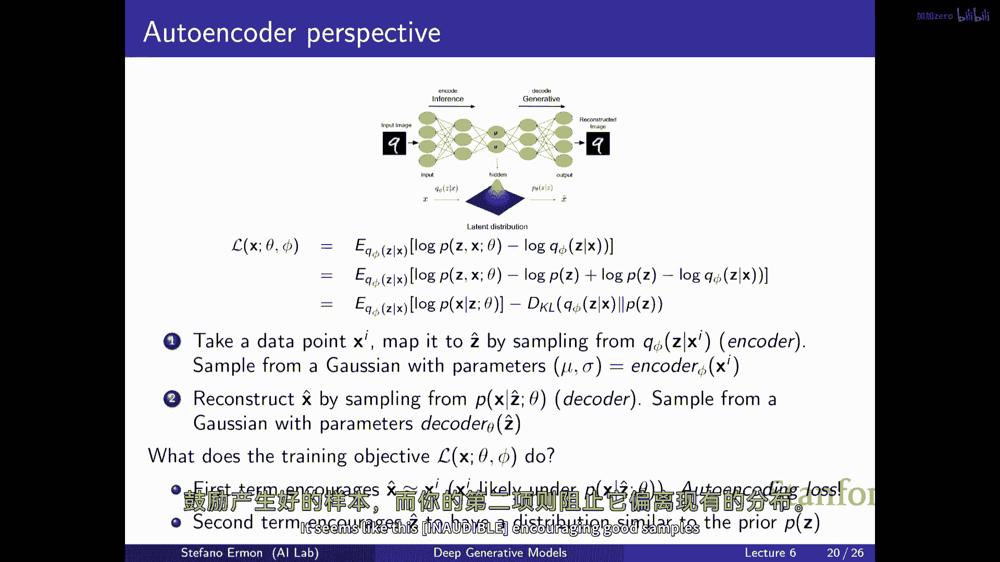
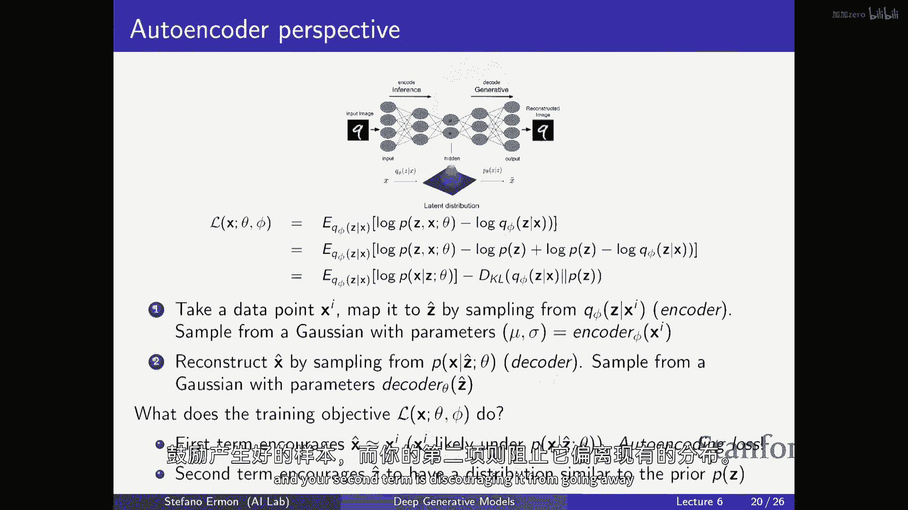
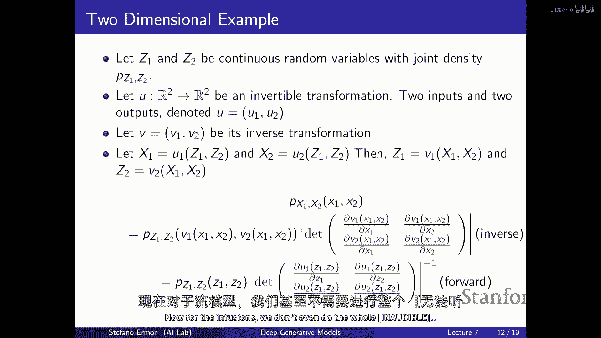
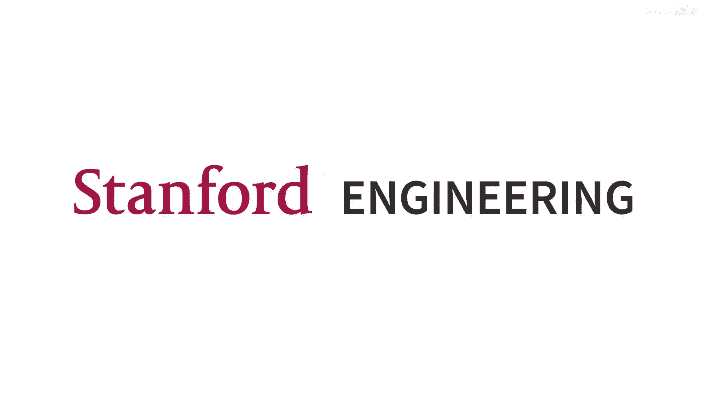

# 7：斯坦福 CS236 深度生成模型 I 2023 - 第七讲：从 VAE 到流模型 🧠

在本节课中，我们将完成对变分自编码器的讨论，并开始介绍一种新的生成模型——流模型。我们将探讨它们的基本原理、训练目标以及与 VAE 的区别。

***

## 概述：从 VAE 到流模型

上一节我们介绍了变分自编码器的基本框架和训练目标。本节中，我们将深入理解 VAE 为何被称为“自编码器”，并开始探讨流模型如何通过可逆变换来解决 VAE 中难以处理的边际概率计算问题。

***

## VAE 的自编码器视角

我们已经知道，VAE 的训练目标是最大化证据下界。这个目标函数可以重新表述，以揭示其自编码器的本质。

### 损失函数的分解

VAE 的损失函数可以分解为两部分：重构损失和正则化项。具体公式如下：

`ELBO = E_{z~q(z|x)}[log p(x|z)] - KL(q(z|x) || p(z))`

以下是该损失函数中各项的含义：
*   **第一项 `E_{z~q(z|x)}[log p(x|z)]`**：这是重构损失。它鼓励编码器 `q(z|x)` 产生的潜在变量 `z` 能够通过解码器 `p(x|z)` 很好地重建原始输入 `x`。如果 `p(x|z)` 是高斯分布，此项近似于输入与重建输出之间的 L2 损失。
*   **第二项 `KL(q(z|x) || p(z))`**：这是正则化项，即 KL 散度。它鼓励编码器输出的潜在变量分布 `q(z|x)` 接近我们预设的简单先验分布 `p(z)`（通常是标准高斯分布）。

### 训练与采样过程

在训练阶段，对于一个数据点 `x_i`：
1.  编码器 `q(z|x_i)` 输出变分参数（如均值和方差）。
2.  从该分布中采样一个潜在变量 `z`。
3.  解码器 `p(x|z)` 尝试重建 `x_i`，计算重构损失。
4.  同时，计算 `q(z|x_i)` 与先验 `p(z)` 之间的 KL 散度作为正则化。

在生成（采样）阶段，我们不再需要编码器：
1.  直接从简单先验分布 `p(z)`（如标准高斯）中采样一个 `z`。
2.  将 `z` 输入解码器 `p(x|z)`，生成新的数据样本 `x`。

KL 散度正则化项的关键作用在于，它确保了训练时编码器看到的 `z` 的分布与生成时我们从先验采样的 `z` 的分布是相似的，从而使生成过程成为可能。

***

## 流模型的基本动机

VAE 虽然提供了潜在表示，但其边际似然 `p(x) = ∫ p(x|z)p(z) dz` 难以直接计算，导致训练需要使用变分推断和近似下界。流模型旨在解决这个问题。

### 核心思想

流模型也是一种潜在变量模型，但其结构特殊。它要求从潜在变量 `z` 到观测数据 `x` 的映射函数 `f` 是**确定且可逆的**。这意味着：
*   **可逆性**：对于每个 `x`，都存在唯一的一个 `z` 使得 `x = f(z)`。我们可以通过逆映射 `z = f^{-1}(x)` 轻松找到它。
*   **维度一致**：为了保证可逆性，`z` 和 `x` 必须具有相同的维度，因此流模型通常不进行维度压缩。

### 变量变换公式

流模型的理论基础是概率论中的变量变换公式。对于一个已知分布的随机变量 `z`（其概率密度函数为 `p_z(z)`），通过一个可逆变换 `x = f(z)` 得到新的随机变量 `x`。那么 `x` 的概率密度 `p_x(x)` 为：

`p_x(x) = p_z(z) * |det(J_{f^{-1}}(x))| = p_z(f^{-1}(x)) * |det(J_{f^{-1}}(x))|`

其中，`J_{f^{-1}}(x)` 是逆变换 `f^{-1}` 在点 `x` 处的雅可比矩阵。`|det(·)|` 表示雅可比矩阵行列式的绝对值，它衡量了变换 `f` 在 `x` 点处引起的局部体积缩放比例。

等价地，也可以用正向变换的雅可比矩阵表示：

`p_x(x) = p_z(f^{-1}(x)) * |det(J_f(z))|^{-1}`

### 流模型的优势

通过这种设计，流模型实现了：
1.  **精确的似然计算**：我们可以直接计算任何数据点 `x` 的精确对数似然 `log p(x)`，而不需要像 VAE 那样求积分或用下界近似。
2.  **直接的最大似然训练**：模型可以通过直接最大化 `log p(x)` 来训练，训练目标更简洁。
3.  **易于采样**：生成样本时，从简单先验 `p_z(z)` 采样 `z`，然后通过正向映射 `x = f(z)` 即可得到 `x`。

***

## 总结

本节课中我们一起学习了：
1.  **VAE 的自编码器本质**：其损失函数由重构损失和 KL 散度正则化项构成，前者鼓励重建输入，后者鼓励潜在分布匹配简单先验，从而使得模型既能重建也能生成。
2.  **流模型的动机**：为了克服 VAE 中边际似然难以计算的困难，流模型引入了确定的可逆变换，使得数据的似然可以精确计算，并支持直接的最大似然训练。
3.  **流模型的核心**：基于变量变换公式，通过可逆函数将简单分布（如高斯分布）“流动”成复杂的数据分布。其关键是需要计算变换的雅可比矩阵行列式。

下一讲，我们将深入探讨如何具体设计这些可逆的变换函数，以及如何高效地计算雅可比行列式，从而构建出实用的流模型。