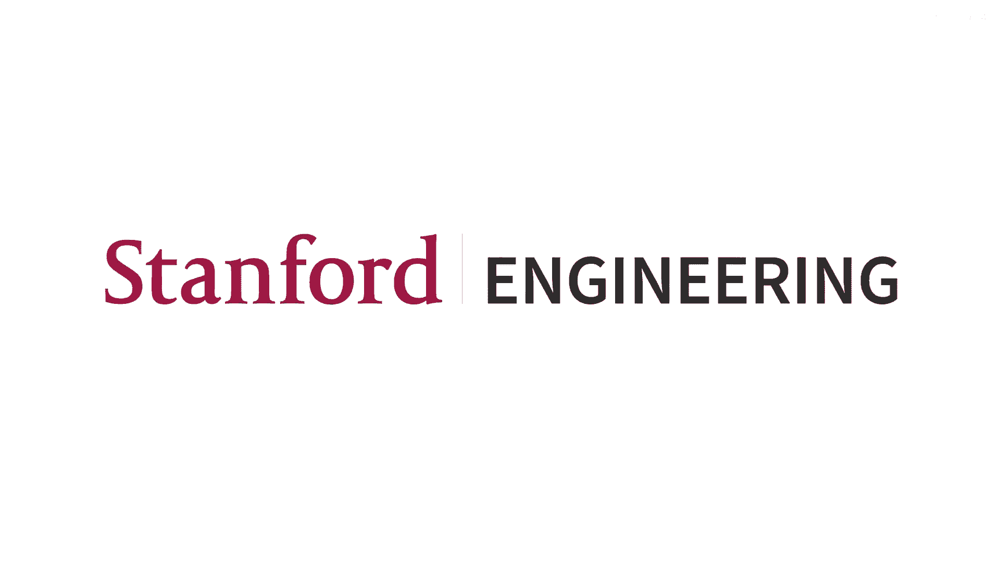
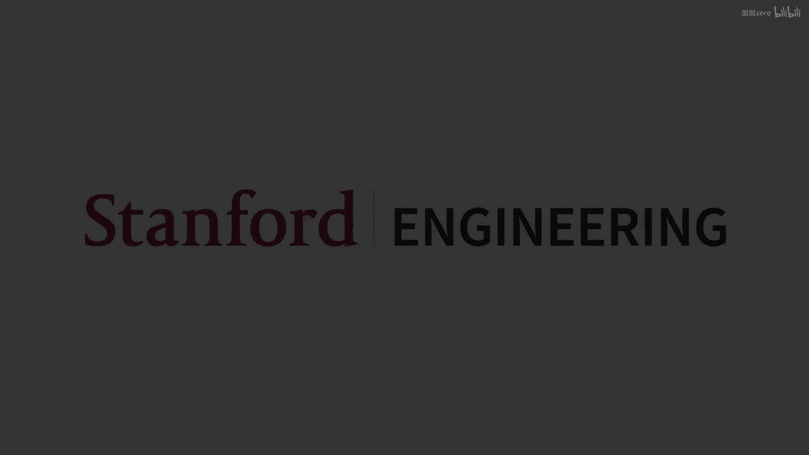
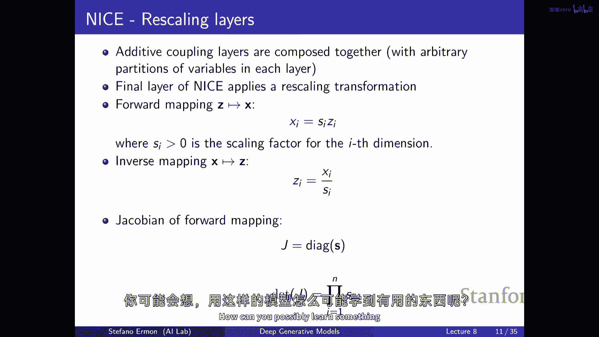
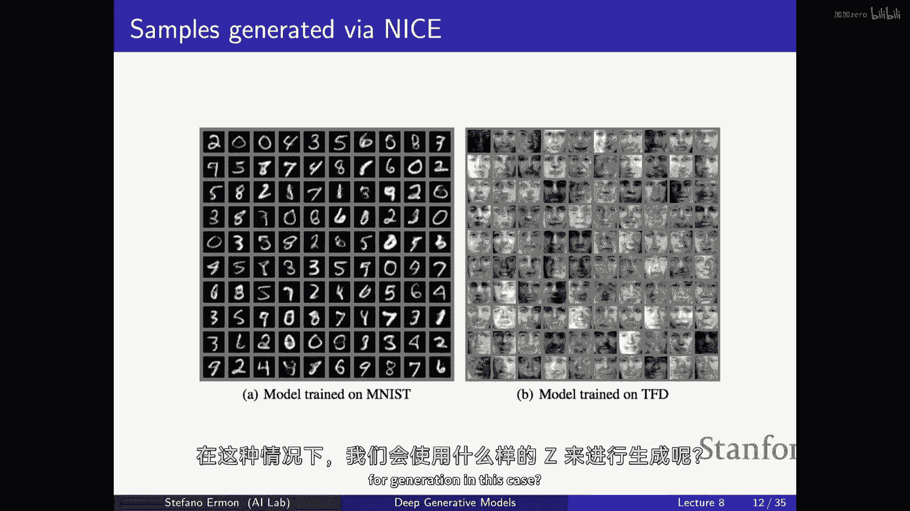
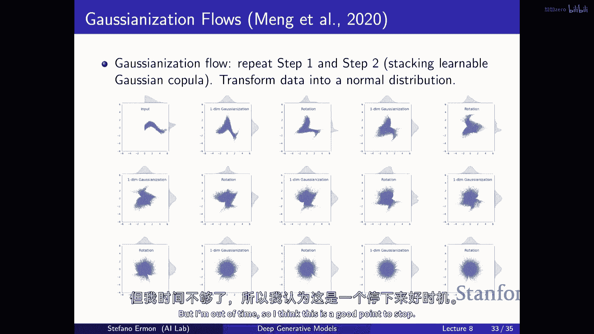

# 8：正则化流模型详解 🧠

在本节课中，我们将要学习一种称为“正则化流”的生成模型。与变分自编码器类似，它也是一种潜在变量模型，但关键区别在于，它允许我们精确地计算数据的似然度，而无需依赖变分推断的近似方法。我们将探讨其核心思想、如何构建可逆的变换，以及如何高效地训练这类模型。

---

## 核心概念与动机

上一节我们介绍了构建能够精确评估似然度的潜在变量模型的想法。本节中我们来看看正则化流的具体实现。

正则化流模型包含两个变量集：观测变量 **x** 和潜在变量 **z**。与变分自编码器不同，这两个变量之间的关系是**确定性的且可逆的**。我们通过一个可逆变换 **f_θ** 从 **z** 得到 **x**，反之亦然。

由于映射是可逆的，我们可以使用**变量变换公式**来精确计算观测数据 **x** 的概率密度：

**p_θ(x) = p_z(f_θ^{-1}(x)) * |det J_{f_θ^{-1}}(x)|**

其中：
*   `p_z(·)` 是潜在变量 **z** 的先验分布（例如高斯分布）。
*   `f_θ^{-1}` 是从 **x** 到 **z** 的逆映射。
*   `|det J_{f_θ^{-1}}(x)|` 是逆映射的雅可比矩阵的行列式的绝对值，它衡量了变换对局部空间的“拉伸”或“压缩”程度。

这种方法的优势在于可以精确计算似然度，但一个限制是 **x** 和 **z** 必须有相同的维度，因此无法像 VAE 那样得到低维的压缩表示。

---

## 构建流模型：组合简单层

我们如何将上述数学思想转化为实用的模型呢？想法是组合多个相对简单的、可逆的层，来构建一个灵活的映射。

我们从一个简单的先验分布（如高斯分布）中采样得到 **z_0**，然后顺序应用一系列可逆变换层 **f_θ1, f_θ2, ..., f_θm**，最终得到观测数据 **x**。

**x = f_θm ◦ ... ◦ f_θ2 ◦ f_θ1 (z_0)**

只要每一层都是可逆的，整个组合映射也是可逆的。整个变换的雅可比行列式也可以分解为各层雅可比行列式的乘积，这使得计算成为可能。

因此，构建流模型的核心挑战是：设计神经网络层，使其满足：
1.  **可逆性**：可以高效地进行正向和逆向计算。
2.  **高效雅可比行列式计算**：雅可比矩阵需要有特殊结构（如下三角矩阵），以便能在线性时间内计算其行列式。

---

## 具体的流层设计

以下是几种实现可逆变换层的经典方法。

### 加性耦合层 (NICE)

这是一种简单而有效的设计。其核心思想是将输入向量 **z** 分成两部分 **z_{1:d}** 和 **z_{d+1:n}**。

**前向变换**定义为：
*   **x_{1:d} = z_{1:d}** （前一部分直接复制）
*   **x_{d+1:n} = z_{d+1:n} + m_θ(z_{1:d})** （后一部分加上一个由前一部分计算出的偏移量）

其中 `m_θ` 是一个任意的神经网络（如 MLP），输入是 **z_{1:d}**，输出是维度为 `n-d` 的偏移向量。

**逆向变换**非常容易：
*   **z_{1:d} = x_{1:d}**
*   **z_{d+1:n} = x_{d+1:n} - m_θ(x_{1:d})**

这种设计的雅可比矩阵是下三角矩阵，且对角线元素全为 1，因此其行列式恒为 1。这意味着该变换是**体积保持**的。虽然简单，但堆叠足够多的此类层可以产生相当复杂的分布。

### 仿射耦合层 (RealNVP)

这是对加性耦合层的增强，不仅进行平移，还进行缩放。

**前向变换**定义为：
*   **x_{1:d} = z_{1:d}**
*   **x_{d+1:n} = z_{d+1:n} ⊙ exp(α_θ(z_{1:d})) + μ_θ(z_{1:d})**

其中 `⊙` 表示逐元素乘法。`μ_θ` 和 `α_θ` 是两个任意的神经网络，分别计算偏移量和缩放量的对数（使用指数保证缩放因子为正）。

**逆向变换**为：
*   **z_{1:d} = x_{1:d}**
*   **z_{d+1:n} = (x_{d+1:n} - μ_θ(x_{1:d})) ⊙ exp(-α_θ(x_{1:d}))**

其雅可比矩阵同样是下三角矩阵，行列式是缩放因子 `exp(α_θ(z_{1:d}))` 所有元素的乘积。这不再是体积保持的，因此建模能力更强。

---

## 自回归模型作为流模型

有趣的是，连续型的**自回归模型**可以看作是一种特殊的流模型。

考虑一个自回归模型，其中每个条件分布 `p(x_i | x_{<i})` 是高斯分布，其均值和方差由神经网络根据 `x_{<i}` 计算得出。从这个模型采样可以重新表述为：

**x_i = μ_θ(x_{<i}) + σ_θ(x_{<i}) ⊙ z_i**

其中 **z_i** 来自标准高斯分布。这可以视为将一个简单的噪声向量 **z** 通过一系列依赖于先前输出的变换，映射为数据 **x**。

*   **前向评估（似然计算）**：给定 **x**，可以并行计算所有 `μ_θ` 和 `σ_θ`，然后反向计算出所有 **z_i**，从而高效计算似然度。
*   **逆向采样**：采样时必须按顺序进行 `i=1, 2, ..., n`，因为计算 `x_i` 需要知道 `x_{<i}`，因此采样较慢。

这种视角引出了两种对偶的流模型：
*   **自回归流 (MAF)**：对应上述自回归模型，**似然计算快，采样慢**。
*   **逆自回归流 (IAF)**：如果将上述计算图完全反转（即让偏移和缩放量依赖于 **z** 而非 **x**），则得到 IAF。此时**采样快**（可并行生成所有 `x_i`），但**似然计算慢**（需要顺序计算 `z_i`）。

这种对偶性可以被巧妙利用。例如，可以先训练一个采样慢但精度高的 MAF 作为“教师模型”，然后训练一个采样快的 IAF “学生模型”去匹配教师模型生成的样本分布，从而实现高质量且快速的生成。

---

## 训练与应用

训练正则化流模型非常直接，因为我们能精确计算似然度。我们只需最大化训练数据的对数似然：

**θ* = argmax_θ Σ_{x∈D} log p_θ(x)**

通过反向传播优化该目标即可。

模型训练好后：
*   **生成样本**：从先验分布采样 **z**，然后通过正向映射 **f_θ** 得到 **x**。
*   **推断潜在变量**：对于任何数据点 **x**，通过逆映射 **f_θ^{-1}** 即可得到对应的 **z**。虽然 **z** 与 **x** 同维，但它在流形上通常具有有意义的连续结构，可以进行插值等操作。

---

## 总结

本节课中我们一起学习了正则化流模型。它是一种通过堆叠可逆变换层，将简单先验分布（如高斯分布）转换为复杂数据分布的生成模型。其核心优势在于能够**精确计算似然度**，从而支持直接的最大似然训练。

我们探讨了构建可逆层的关键技术，如**耦合层**，并理解了如何通过设计使雅可比行列式能被高效计算。我们还发现了**自回归模型与流模型之间的深刻联系**，以及如何利用这种联系（如 MAF 和 IAF 的对偶性）来权衡计算效率。

尽管流模型要求数据维度与潜在维度相同，但它提供了似然计算的精确性和潜在空间的可解释性，是生成模型工具箱中一个强大而独特的工具。