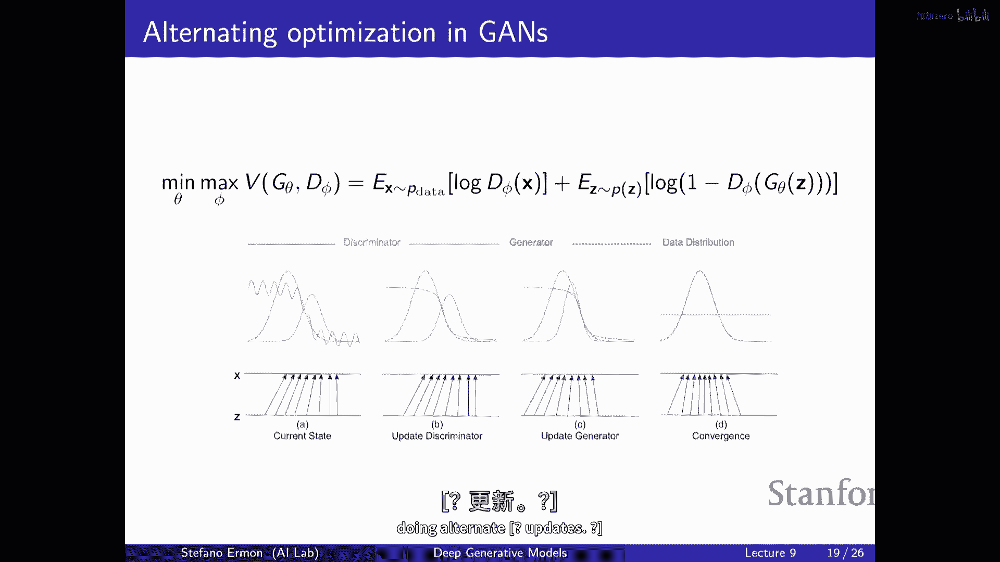
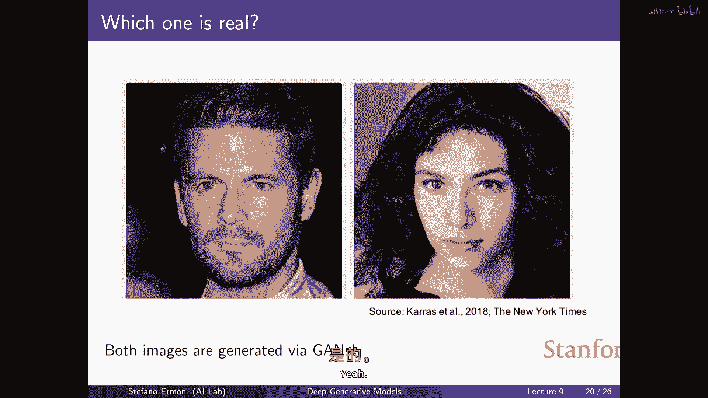

# 9：生成对抗网络 (GANs) 🎭


在本节课中，我们将学习一种全新的生成模型——生成对抗网络。我们将探讨其核心思想、工作原理、训练目标以及在实际应用中的挑战。

## 概述

回顾之前的课程，我们构建生成模型的基本思路是：从数据分布 `p_data` 中获取独立样本，定义一个由神经网络参数化的模型分布族 `p_θ`，然后通过优化某种相似性度量（如KL散度）来寻找最接近数据分布的模型分布。我们已经学习了自回归模型、变分自编码器和正则化流模型，它们都致力于建模数据点的概率，从而可以进行最大似然训练。

然而，最大化似然度并不总是与生成高质量样本的目标完全一致。本节课，我们将改变比较概率分布的方式，引入一种不依赖于似然度的新方法——生成对抗网络。

## 从最大似然到新目标

### 最大似然的优势与局限

最大似然训练是一种原则性强的方法。如果我们能根据模型评估数据点的概率 `p_θ(x_i)`，就可以通过最大化训练集的平均对数概率来选择参数：
`θ* = argmax_θ (1/N) Σ_i log p_θ(x_i)`
这等价于最小化数据分布与模型分布之间的KL散度。在理想条件下，这是最有效利用数据的方式。

然而，高似然度并不总是对应高质量的生成样本。反之，高质量的样本也可能来自似然度很差的模型。

**示例1：高似然度，差样本**
考虑一个混合模型：以99%的概率生成纯噪声，以1%的概率从真实数据分布 `p_data` 中采样。对于数据点 `x`，其模型概率为：
`p_θ(x) = 0.99 * p_noise(x) + 0.01 * p_data(x)`
其对数概率至少为 `log p_data(x) - log(100)`。在高维空间中，该模型能达到接近最优的似然度，但99%的时间都在生成垃圾样本。

**示例2：好样本，差似然度**
过拟合训练集：构建一个模型，将所有概率质量均匀分配给训练样本。从这个模型采样会得到完美的训练样本，但会给任何未见过的数据点分配零概率，导致测试似然度极差。

这表明，样本质量与似然度可以解耦，这为我们探索基于不同比较方法的训练目标提供了动机。

## 两样本测试：比较分布的新思路

生成对抗网络的核心思想是改变性能度量方式。我们不再使用KL散度，而是尝试其他比较两个概率分布 `P` 和 `Q` 的方法。

一个直观的想法是：如果我们有两组样本，一组来自 `P`，一组来自 `Q`，我们能否判断它们是否来自同一分布？这就是**两样本测试**问题。
*   **零假设 H0**: `P = Q`（样本来自同一分布）。
*   **备择假设 H1**: `P ≠ Q`（样本来自不同分布）。

传统的两样本测试需要手工设计检验统计量（如比较样本均值、方差）。但手工设计很难捕捉高维数据中所有的分布差异特征。

## 判别器：学习差异的神经网络

与其手工设计统计量，不如**学习一个分类器（称为判别器）**来自动识别两组样本的差异。

设置如下：
*   一组真实样本：来自数据分布 `p_data`（标记为1）。
*   一组生成样本：来自当前模型分布 `p_θ`（标记为0）。

我们训练一个判别器 `D_φ`（通常是一个神经网络），其目标是准确区分这两组样本。这通过最小化标准的二分类交叉熵损失来实现：
`L(φ) = -E_{x~p_data}[log D_φ(x)] - E_{x~p_θ}[log(1 - D_φ(x))]`
判别器试图**最大化**这个目标（即最小化损失），以最好地区分真假样本。

如果判别器很难区分两组样本（即损失很高），则说明两组样本相似，分布 `p_θ` 接近 `p_data`。反之，如果判别器能轻松区分（损失很低），则说明分布差异较大。

## 生成对抗网络：最小最大博弈

现在，我们引入**生成器** `G_θ`。它从一个简单的先验分布（如高斯分布）中采样噪声 `z`，并通过一个神经网络将其映射为样本 `x = G_θ(z)`。关键的是，对这个神经网络没有任何限制（如可逆性），因为它只用于采样，不用于计算似然度。

训练过程是一个**两人博弈**：
*   **判别器 `D_φ`**：试图最大化上述目标，更好地区分真假样本。
*   **生成器 `G_θ`**：试图最小化上述目标，即生成能“欺骗”判别器的样本，使其难以区分。

这形成了一个**最小最大优化问题**：
`min_θ max_φ V(θ, φ) = E_{x~p_data}[log D_φ(x)] + E_{z~p(z)}[log(1 - D_φ(G_θ(z)))]`

### 理论最优解

可以证明，对于固定的生成器 `G_θ`，最优判别器为：
`D*(x) = p_data(x) / (p_data(x) + p_θ(x))`
将其代入目标函数 `V`，经过推导，生成器的优化目标等价于最小化数据分布 `p_data` 与模型分布 `p_θ` 之间的 **Jensen-Shannon散度 (JSD)**：
`JSD(p_data || p_θ) = 1/2 KL(p_data || M) + 1/2 KL(p_θ || M)`
其中 `M = (p_data + p_θ)/2`。

JSD是对称的、非负的，且当且仅当 `p_data = p_θ` 时取得全局最小值0。因此，在理想情况下，GAN的博弈均衡点对应于生成器完美复现数据分布。

## 训练过程与实践挑战

### 训练算法

在实际训练中，我们交替优化判别器和生成器：

1.  **训练判别器**：从真实数据和小批量噪声 `{z_i}` 中采样，通过生成器得到假样本 `{G_θ(z_i)}`。固定生成器参数 `θ`，对判别器参数 `φ` 执行梯度**上升**，以最大化 `V`。
2.  **训练生成器**：固定判别器参数 `φ`，对生成器参数 `θ` 执行梯度**下降**，以最小化 `V`。注意，第一项与 `θ` 无关，梯度仅通过第二项（假样本）传递。

以下是核心训练循环的简化代码表示：
```python
for epoch in range(num_epochs):
    # 1. 更新判别器
    real_data = sample_from_p_data(batch_size)
    noise = sample_from_p_z(batch_size)
    fake_data = generator(noise)
    d_loss = - (log(discriminator(real_data)) + log(1 - discriminator(fake_data))).mean()
    d_loss.backward()
    optimizer_D.step()

    # 2. 更新生成器
    noise = sample_from_p_z(batch_size)
    fake_data = generator(noise)
    g_loss = - log(discriminator(fake_data)).mean()  # 或使用 log(1 - D(G(z))) 的变体
    g_loss.backward()
    optimizer_G.step()
```

### 主要挑战





尽管GAN思想强大，但训练非常困难且不稳定：

1.  **优化不稳定**：最小最大博弈本质上是非凸的，容易导致训练振荡，难以收敛。损失值波动大，缺乏可靠的停止准则（不像似然度可以监控）。
2.  **模式坍缩**：生成器可能只学会生成少数几种“成功”骗过判别器的样本，而忽略数据分布中的其他模式（多样性不足）。这与最大似然训练（会因忽略某个模式而受到巨大惩罚）形成对比。
3.  **评估困难**：缺乏像似然度这样的内在评估指标，通常需要人工检查生成样本质量。

由于这些挑战，训练GAN需要大量技巧（如特定的网络架构、正则化方法、损失函数设计等）。这也是近年来扩散模型等更稳定方法兴起的原因之一。然而，GAN的核心理念——通过对抗性训练来学习分布——仍然极具影响力，并被融合到其他先进模型中。

## 总结


本节课我们一起学习了生成对抗网络。我们从最大似然训练的局限性出发，引入了通过两样本测试来比较分布的新视角。通过使用一个可学习的判别器来自动发现分布间的差异，并构建生成器与之进行对抗性博弈，我们得到了一个灵活且强大的生成模型框架。尽管GAN在理论上优雅，并在图像生成等领域取得了显著成果，但其训练过程的不稳定性和实践难度也是不容忽视的挑战。理解GAN的原理为我们探索更鲁棒、更高效的生成模型奠定了重要基础。