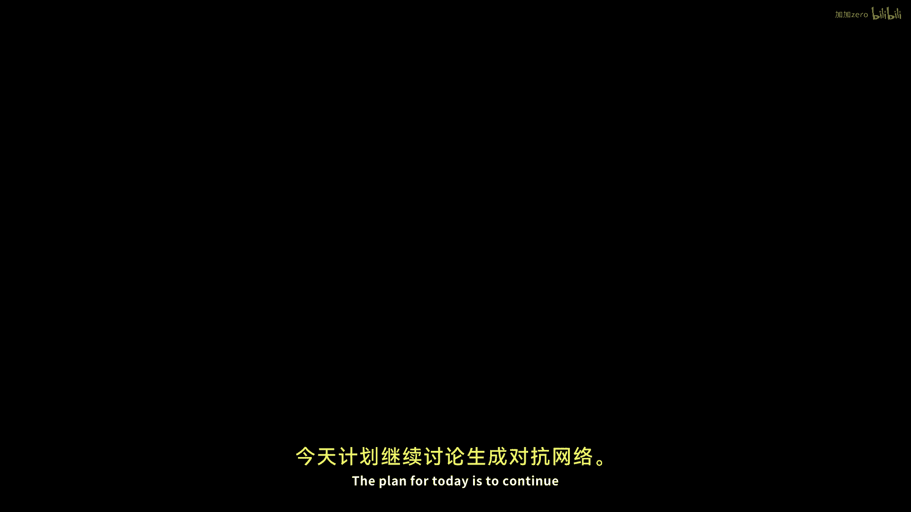
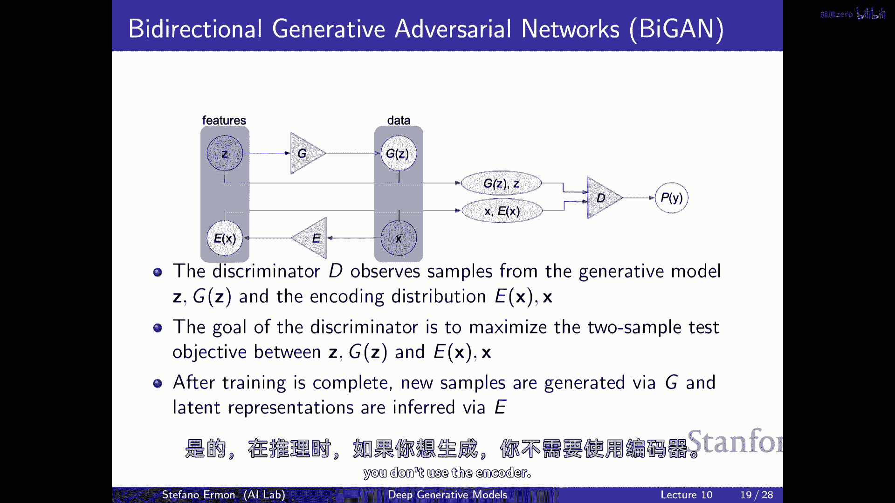

# 10：生成对抗网络（GAN）🚀

在本节课中，我们将要学习生成对抗网络（GAN）的核心概念、数学原理及其扩展。我们将从GAN的基本思想出发，探讨如何通过对抗性训练来优化模型，并介绍更广泛的散度概念，如f-散度和Wasserstein距离。最后，我们会简要讨论如何在GAN中推断潜在表示。

---

## 概述 📖

生成对抗网络（GAN）是一种强大的生成模型，它通过对抗性训练来学习数据分布。与基于似然的模型不同，GAN不需要显式地评估数据点的概率，这使得它能够使用更灵活的模型架构。在本节中，我们将深入探讨GAN的训练目标、数学原理及其扩展。

---

## GAN的基本思想 🧠

上一节我们介绍了基于似然的生成模型，本节中我们来看看生成对抗网络（GAN）。GAN的核心思想是通过一个判别器（Discriminator）和一个生成器（Generator）之间的对抗性游戏来训练模型。

生成器试图生成与真实数据相似的样本，而判别器则试图区分真实样本和生成样本。如果判别器难以区分这两种样本，那么生成器的表现就很好。

### GAN的训练目标

GAN的训练目标是一个极小极大游戏（Minimax Game），其中生成器试图最小化判别器的性能，而判别器试图最大化其区分能力。数学上，这个目标可以表示为：

**公式：**
\[
\min_G \max_D V(D, G) = \mathbb{E}_{x \sim p_{\text{data}}(x)}[\log D(x)] + \mathbb{E}_{z \sim p_z(z)}[\log(1 - D(G(z)))]
\]

其中：
- \( D \) 是判别器，输出样本为真实数据的概率。
- \( G \) 是生成器，将随机噪声 \( z \) 映射为数据样本。
- \( p_{\text{data}} \) 是真实数据分布。
- \( p_z \) 是噪声分布（如高斯分布）。

### GAN的优势

以下是GAN的主要优势：
- 不需要显式评估数据点的概率。
- 可以使用灵活的模型架构（如神经网络）。
- 生成的样本质量通常较高。

---

## 从Jensen-Shannon散度到f-散度 🔄

上一节我们介绍了GAN如何优化Jensen-Shannon散度，本节中我们来看看更一般的f-散度（f-divergence）。f-散度是一类用于衡量两个概率分布之间差异的函数。

### f-散度的定义

f-散度定义为：

**公式：**
\[
D_f(p \| q) = \mathbb{E}_{x \sim q}\left[ f\left( \frac{p(x)}{q(x)} \right) \right]
\]

其中：
- \( p \) 和 \( q \) 是两个概率分布。
- \( f \) 是一个凸函数，且满足 \( f(1) = 0 \)。

### 常见的f-散度

通过选择不同的 \( f \) 函数，我们可以得到不同的散度：
- **KL散度**：\( f(u) = u \log u \)
- **反向KL散度**：\( f(u) = -\log u \)
- **Jensen-Shannon散度**：\( f(u) = -(u+1)\log\frac{u+1}{2} + u\log u \)
- **Hellinger距离**：\( f(u) = (\sqrt{u} - 1)^2 \)

### GAN与f-散度的关系

GAN的训练目标可以看作是在优化某种f-散度。通过选择不同的 \( f \) 函数，我们可以使用类似的对抗性训练框架来优化不同的散度。

---

## Wasserstein距离：另一种衡量差异的方式 🌊

上一节我们讨论了f-散度，本节中我们来看看Wasserstein距离（Earth Mover‘s Distance）。Wasserstein距离通过衡量将一个分布“移动”到另一个分布所需的最小成本来定义差异。

### Wasserstein距离的定义

Wasserstein距离定义为：

**公式：**
\[
W(p, q) = \inf_{\gamma \in \Pi(p, q)} \mathbb{E}_{(x, y) \sim \gamma}[\| x - y \|]
\]

其中：
- \( \Pi(p, q) \) 是所有边际分布为 \( p \) 和 \( q \) 的联合分布 \( \gamma \) 的集合。
- \( \| x - y \| \) 是 \( x \) 和 \( y \) 之间的距离（如L1距离）。

### Wasserstein距离的优势

Wasserstein距离在处理分布支持集不重叠的情况下表现更好，因为它提供了平滑的梯度信号。这使得训练更加稳定。

### Wasserstein GAN（WGAN）

WGAN使用Wasserstein距离作为训练目标，并通过一个判别器（称为批评器，Critic）来近似计算距离。训练目标为：

**公式：**
\[
\min_G \max_{D \in \mathcal{D}} \mathbb{E}_{x \sim p_{\text{data}}}[D(x)] - \mathbb{E}_{z \sim p_z}[D(G(z))]
\]

其中 \( \mathcal{D} \) 是所有满足Lipschitz约束的函数集合。

---

## 在GAN中推断潜在表示 🧩

上一节我们讨论了如何训练GAN生成样本，本节中我们来看看如何在GAN中推断潜在表示。潜在表示可以帮助我们理解数据的结构，并用于下游任务（如半监督学习）。

### BiGAN：双向GAN

BiGAN通过引入一个编码器（Encoder）来将数据映射回潜在空间。训练目标包括：
- 生成器 \( G \) 将潜在变量 \( z \) 映射为数据 \( x \)。
- 编码器 \( E \) 将数据 \( x \) 映射为潜在变量 \( z \)。
- 判别器 \( D \) 试图区分真实数据-潜在对和生成数据-潜在对。

### BiGAN的训练目标

BiGAN的训练目标为：

**公式：**
\[
\min_{G, E} \max_D \mathbb{E}_{x \sim p_{\text{data}}}[\log D(x, E(x))] + \mathbb{E}_{z \sim p_z}[\log(1 - D(G(z), z))]
\]

### BiGAN的应用

训练完成后，编码器可以用于推断输入数据的潜在表示，这些表示可以用于聚类、分类或其他下游任务。

---

## 总结 🎯

本节课我们一起学习了生成对抗网络（GAN）的核心概念及其扩展。我们从GAN的基本思想出发，探讨了如何通过对抗性训练优化模型。接着，我们介绍了更一般的f-散度和Wasserstein距离，并讨论了它们在GAN中的应用。最后，我们简要介绍了如何在GAN中推断潜在表示，为下游任务提供有用的特征。

通过本节课的学习，你应该对GAN的原理、训练方法及其扩展有了更深入的理解。这些知识将帮助你在实际应用中设计并训练高效的生成模型。