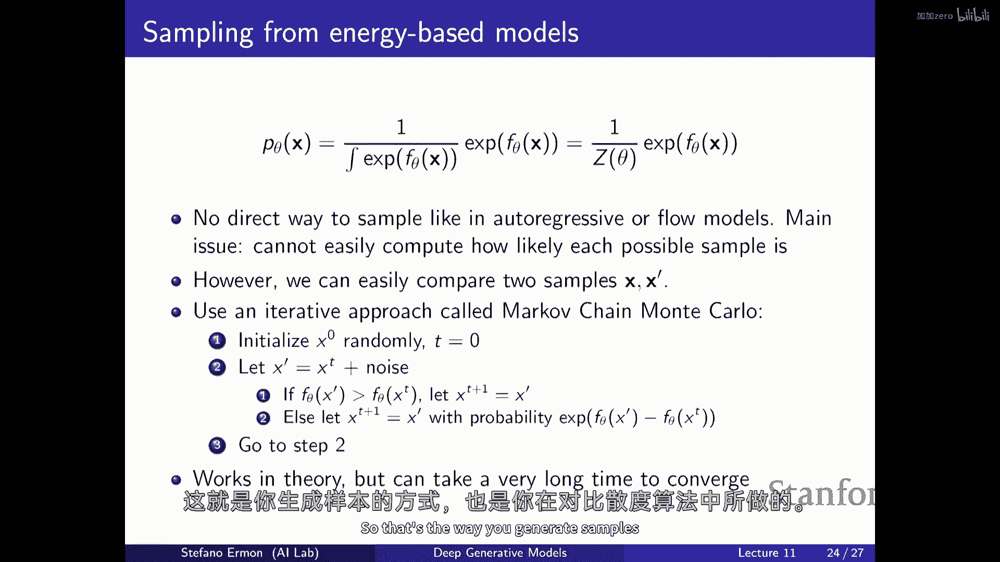

# 11：基于能量的模型 (EBMs) 🧠

在本节课中，我们将学习一种新的生成模型家族——基于能量的模型。我们将了解其核心思想、优势、挑战以及如何训练和从这类模型中采样。

---

## 概述

基于能量的模型是一种非常灵活的生成模型。它允许我们使用任意的神经网络来定义概率分布，而无需像自回归模型或流模型那样受到归一化约束的严格限制。然而，这种灵活性也带来了计算上的挑战，特别是涉及难以计算的配分函数。本节课将探讨EBMs的基本原理、其与之前模型的关系，以及应对这些挑战的方法。

---

## 生成模型的设计空间

上一节我们讨论了各种生成模型。在设计生成模型时，我们通常面临两个核心问题：定义模型族和定义损失函数。

*   **模型族**：我们需要定义一个由参数θ参数化的概率分布集合 `p_θ`。
*   **损失函数**：我们需要一个衡量模型分布 `p_θ` 与真实数据分布 `p_data` 之间差异的方法。

一种非常自然的方法是使用最大似然估计，它等价于最小化KL散度。这种方法要求我们能够（精确或近似地）评估模型分配给数据点的概率 `p_θ(x)`。自回归模型、正则化流和变分自编码器都提供了实现这一目标的不同途径。

---

## 灵活性与约束的权衡

本节中，我们来看看定义模型族时的核心矛盾：灵活性与归一化约束。

我们希望模型族尽可能灵活，例如使用任意的神经网络架构。神经网络可以将高维输入 `x`（如图像、句子）映射到一个标量。然而，一个有效的概率密度函数（PDF）或概率质量函数（PMF）必须满足两个约束：
1.  **非负性**：对于所有输入 `x`，输出必须非负。`p_θ(x) ≥ 0`。
2.  **归一化**：所有可能 `x` 的概率之和（或积分）必须为1。`∫ p_θ(x) dx = 1`。

非负性约束相对容易满足（例如，在神经网络输出后加一个 `exp` 或 `square` 操作）。真正的困难在于归一化约束。它要求无论参数θ如何变化，模型分配的“总概率质量”必须保持恒定（总和为1）。这就像切一个固定大小的蛋糕：如果你给某一块切得更大，其他部分就必须变小。

自回归模型和流模型通过特殊的设计（如分解为条件概率乘积或使用可逆变换）来**保证**模型天生就是归一化的。而基于能量的模型则采取了一种不同的策略。

---

## 基于能量模型的核心思想

基于能量模型的核心思想是：**将难以满足的归一化约束，转化为一个可以（近似）处理的常数计算问题**。

具体做法如下：
1.  我们用一个任意的神经网络 `f_θ(x)` 来定义一个“能量”函数。通常，能量越低表示该配置 `x` 越可能。
2.  通过指数函数将其转换为非负的“未归一化概率”：`g_θ(x) = exp(-f_θ(x))`。使用指数函数可以方便地捕捉概率的巨大变化。
3.  为了得到一个有效的概率分布，我们除以一个归一化常数，即**配分函数 Z(θ)**：
    `p_θ(x) = g_θ(x) / Z(θ) = exp(-f_θ(x)) / Z(θ)`
    其中，`Z(θ) = ∫ exp(-f_θ(x)) dx`（连续）或 `Σ exp(-f_θ(x))`（离散）。

这样一来，**只要我们能定义 `f_θ(x)`，我们就定义了一个有效的概率模型**。灵活性达到了极致，因为 `f_θ(x)` 可以是任何神经网络。代价是，配分函数 `Z(θ)` 通常没有解析解，计算极其困难，这就是“维度诅咒”的体现。

---

## EBM的实例与优势

以下是EBMs的一些具体实例和其独特优势：

*   **经典分布**：许多常见分布（如高斯分布、指数分布及整个指数族）都可以写成EBM的形式。例如，高斯分布 `N(x; μ, σ)` 对应 `f_θ(x) = (x-μ)²/(2σ²)`，且 `Z(θ) = √(2πσ²)` 有解析解。
*   **Softmax函数**：分类模型中的softmax层就是一个离散情况下的EBM，其配分函数是对所有类别的求和，可以精确计算。
*   **组合模型**：EBMs允许以有趣的方式组合不同模型。例如，将多个专家模型的概率相乘，可以得到一个新的EBM，其能量是各专家对数概率之和。这类似于一个“与”操作，只有所有专家都认为某个样本可能时，它才被赋予高概率。
*   **受限玻尔兹曼机 (RBM)**：这是一个经典的、包含隐变量的EBM例子。它定义了可见单元 `v` 和隐单元 `h` 的联合分布，形式为 `p(v, h) ∝ exp(-E(v, h))`，其中能量函数 `E(v, h)` 是简单的二次型。训练RBM是深度学习早期成功的关键之一。

---

## EBM的挑战与应对策略

EBM的主要挑战源于难以处理的配分函数 `Z(θ)`。这导致两个直接困难：
1.  **评估似然困难**：计算单个数据点的概率 `p_θ(x)` 需要知道 `Z(θ)`。
2.  **采样困难**：没有高效的方法直接从 `p_θ(x)` 中生成样本。

然而，许多任务并不需要完整的 `p_θ(x)`，我们可以采用以下策略：

*   **相对比较**：比较两个样本 `x` 和 `x’` 的相对概率只需要计算比值 `p_θ(x)/p_θ(x’)`，配分函数 `Z(θ)` 在比值中会被约去。这对于去噪、异常检测等任务已经足够。
*   **基于MCMC的采样**：虽然不能直接采样，但我们可以使用马尔可夫链蒙特卡洛方法。例如，使用**Metropolis-Hastings算法**：
    1.  从随机初始样本 `x_t` 开始。
    2.  提议一个新样本 `x’`（例如，给 `x_t` 加噪声）。
    3.  计算接受概率 `A = min(1, p_θ(x’)/p_θ(x_t))`。由于是比值，无需 `Z(θ)`。
    4.  以概率 `A` 接受 `x’` 作为下一个状态 `x_{t+1}`，否则保持 `x_t`。
    理论上，经过足够多的步骤后，链的状态将服从分布 `p_θ(x)`。
*   **对比散度训练**：最大似然训练的目标是最大化数据的对数似然 `log p_θ(x)`。其梯度有一个优美的形式：
    `∇_θ log p_θ(x) = -∇_θ f_θ(x) + E_{x~p_θ}[∇_θ f_θ(x)]`
    梯度包含两项：一项降低数据点的能量（正例），另一项升高模型分布中**典型样本**的能量（负例）。我们无法精确计算第二项的期望，但可以用MCMC采样得到的样本来近似。这就是训练RBM等模型的**对比散度算法**的核心思想：推动数据，拉低模型生成的样本。

---

## 总结

本节课我们一起学习了基于能量的模型。
*   **核心思想**：通过引入配分函数 `Z(θ)`，将归一化约束与模型表达能力解耦，允许使用任意神经网络 `f_θ(x)` 来定义概率分布 `p_θ(x) = exp(-f_θ(x)) / Z(θ)`。
*   **优势**：提供了极大的建模灵活性，并能以乘积等方式组合不同模型。
*   **挑战**：配分函数 `Z(θ)` 难以计算，导致评估似然和采样困难。
*   **解决方案**：利用概率比值进行相对比较；使用MCMC方法进行近似采样；采用基于对比散度的策略进行近似训练。

EBMs代表了生成模型中灵活性的一个极端，虽然其训练和采样过程可能较慢，但其思想为后续更强大的模型（如扩散模型）奠定了基础。