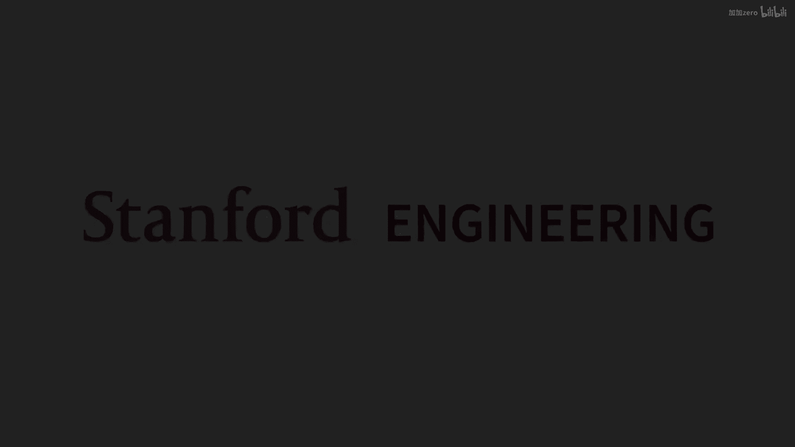
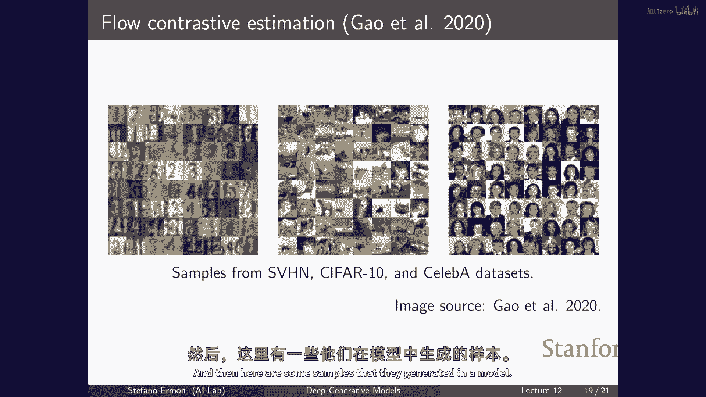
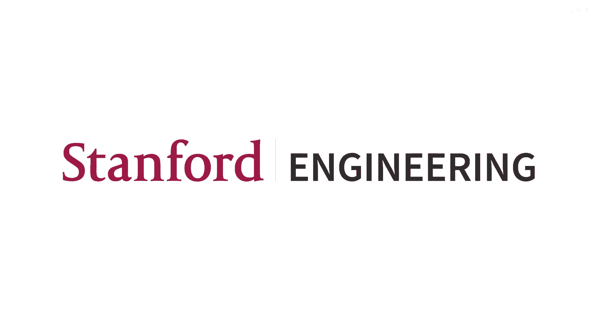

# 12：斯坦福 CS236 深度生成模型 I 2023 - 第12讲 📚

在本节课中，我们将要学习基于能量的模型（EBMs）的进一步内容，特别是其训练方法。我们将重点讨论如何在不依赖难以处理的配分函数或昂贵采样过程的情况下训练这些模型。我们将介绍分数匹配和噪声对比估计等关键技术，这些技术为高效训练EBMs提供了基础。

## 基于能量模型回顾 🔄

上一节我们介绍了基于能量模型的基本概念。本节中我们来看看其核心定义和面临的挑战。

基于能量的模型提供了一种定义非常广泛概率分布的方式。它通过一个能量函数 \( f_\theta(x) \) 来定义概率分布：
\[
p_\theta(x) = \frac{e^{-f_\theta(x)}}{Z(\theta)}
\]
其中 \( Z(\theta) = \int e^{-f_\theta(x)} dx \) 是归一化常数（配分函数）。

这种模型的好处在于，能量函数 \( f_\theta(x) \) 可以是任何神经网络架构，从而提供了极大的灵活性。然而，关键问题在于评估配分函数 \( Z(\theta) \) 通常是难以处理的，因为我们需要对所有可能的 \( x \) 进行积分或求和，这在数据维度很高时几乎不可能。

虽然直接评估数据点的概率很困难，但比较两个数据点的概率相对容易，因为概率比值的计算中配分函数会相互抵消。

## 训练挑战与对比散度 🎯

训练基于能量的模型通常采用最大似然估计。对数似然函数的梯度表达式为：
\[
\nabla_\theta \log p_\theta(x) = -\nabla_\theta f_\theta(x) - \nabla_\theta \log Z(\theta)
\]
其中，第一项是数据点能量函数的梯度，容易计算。第二项是配分函数对数的梯度，它等于模型样本能量函数梯度的负期望：
\[
\nabla_\theta \log Z(\theta) = \mathbb{E}_{x \sim p_\theta} [-\nabla_\theta f_\theta(x)]
\]
这意味着要计算准确的梯度，我们需要从当前模型 \( p_\theta \) 中生成样本。

**以下是使用马尔可夫链蒙特卡洛（MCMC）从EBM中采样的基本思路：**
1.  初始化一个样本 \( x_0 \)（例如随机噪声）。
2.  重复以下步骤多次：
    *   对当前样本 \( x_t \) 进行一个小的随机扰动，提出一个新样本 \( x' \)。
    *   计算接受概率 \( A = \min(1, \frac{p_\theta(x‘)}{p_\theta(x_t)}) \)。由于我们只需要概率比值，这可以计算。
    *   以概率 \( A \) 接受 \( x‘ \) 作为新状态 \( x_{t+1} \)，否则保持 \( x_t \)。
3.  经过足够多的步骤后，样本将近似来自分布 \( p_\theta \)。

一种更高效的MCMC变体是朗之万动力学，它利用能量函数的梯度信息来提出新样本：
\[
x_{t+1} = x_t + \epsilon \nabla_x \log p_\theta(x_t) + \sqrt{2\epsilon} z_t, \quad z_t \sim \mathcal{N}(0, I)
\]
其中，\( \epsilon \) 是步长。这里的关键是，对数概率的梯度 \( \nabla_x \log p_\theta(x) = -\nabla_x f_\theta(x) \) 不依赖于配分函数，因此可以高效计算。

尽管MCMC提供了理论上的采样方法，但在训练过程中需要不断生成样本以估计梯度，这使得基于最大似然的训练非常昂贵。因此，我们需要寻找不需要在训练循环中进行MCMC采样的替代方法。

## 分数匹配：绕过配分函数 🧮

本节我们将介绍分数匹配，这是一种通过匹配“分数”而非概率本身来训练模型的方法。

分数函数定义为对数概率密度关于数据的梯度：
\[
s_\theta(x) = \nabla_x \log p_\theta(x)
\]
对于基于能量的模型，分数函数为 \( s_\theta(x) = -\nabla_x f_\theta(x) \)，它**不依赖于配分函数** \( Z(\theta) \)，因此可以高效计算。

核心思想是：如果模型分布 \( p_\theta \) 与真实数据分布 \( p_{data} \) 相似，那么它们的分数函数也应该相似。因此，我们可以定义一个基于分数差异的损失函数——费舍尔散度：
\[
J(\theta) = \frac{1}{2} \mathbb{E}_{p_{data}(x)} [\| \nabla_x \log p_{data}(x) - \nabla_x \log p_\theta(x) \|^2]
\]
最小化这个散度可以迫使模型分数匹配真实数据分数。然而，这个表达式仍然包含未知的真实数据分数 \( \nabla_x \log p_{data}(x) \)。

通过分部积分技巧，我们可以将上述目标转化为一个等价的、不依赖于真实数据分数的形式。以一维情况为例，经过推导可得：
\[
J(\theta) = \mathbb{E}_{p_{data}(x)} [\nabla_x \log p_\theta(x)^2 + \nabla_x^2 \log p_\theta(x)] + \text{常数}
\]
其中 \( \nabla_x^2 \) 是二阶导数。对于高维数据 \( x \in \mathbb{R}^D \)，推广形式为：
\[
J(\theta) = \mathbb{E}_{p_{data}(x)} [\frac{1}{2} \| s_\theta(x) \|^2 + \text{tr}(\nabla_x s_\theta(x)) ] + \text{常数}
\]
这里 \( \text{tr}(\nabla_x s_\theta(x)) \) 是分数函数雅可比矩阵的迹，即 \( \log p_\theta(x) \) 的Hessian矩阵的迹。

**以下是分数匹配的训练流程：**
1.  从训练集采样一批数据 \( \{x_i\} \)。
2.  对于每个样本 \( x_i \)，使用自动微分计算：
    *   模型分数 \( s_\theta(x_i) = -\nabla_x f_\theta(x_i) \)
    *   分数函数的雅可比矩阵迹 \( \text{tr}(\nabla_x s_\theta(x_i)) \)
3.  计算损失 \( \hat{J}(\theta) = \frac{1}{B} \sum_{i=1}^B [\frac{1}{2} \| s_\theta(x_i) \|^2 + \text{tr}(\nabla_x s_\theta(x_i)) ] \)
4.  通过梯度下降更新参数 \( \theta \) 以最小化损失。

迹的计算在高维下可能昂贵，但可以通过 Hutchinson 迹估计器等技巧进行近似。分数匹配的优势在于，它完全避免了配分函数的计算和在训练时从模型采样。

## 噪声对比估计：转化为分类问题 🎲

现在，我们来看另一种流行的训练方法——噪声对比估计（NCE），它将密度估计问题转化为一个二分类问题。

我们引入一个已知的、易于采样的噪声分布 \( p_n(x) \)（例如高斯分布）。目标是训练一个分类器来区分来自真实数据分布 \( p_{data}(x) \) 的样本和来自噪声分布 \( p_n(x) \) 的样本。

我们定义分类器 \( D(x) \) 为数据样本（而非噪声样本）的概率，并将其参数化为：
\[
D(x) = \frac{p_\theta(x)}{p_\theta(x) + p_n(x)} = \frac{e^{-f_\theta(x)}/Z}{e^{-f_\theta(x)}/Z + p_n(x)}
\]
这里，我们使用基于能量的模型来参数化 \( p_\theta(x) \)，并将配分函数 \( Z \) 也视为一个可学习的标量参数，而不是通过积分计算。

**以下是NCE的训练目标：**
我们训练分类器最大化其区分能力，即最小化以下交叉熵损失：
\[
\mathcal{L}(\theta, Z) = -\mathbb{E}_{p_{data}}[\log D(x)] - \mathbb{E}_{p_n}[\log (1 - D(x))]
\]
通过将 \( D(x) \) 的表达式代入并优化 \( \theta \) 和 \( Z \)，分类器为了更好地区分数据与噪声，就必须学习到一个使 \( p_\theta(x) \) 逼近 \( p_{data}(x) \) 的能量函数 \( f_\theta \)。理论上，当最优分类器被找到时，学习到的 \( Z^* \) 就会是模型真实的配分函数。

**NCE的训练步骤：**
1.  从训练集采样一批真实数据 \( \{x_i^d\} \)。
2.  从噪声分布 \( p_n \) 采样一批噪声数据 \( \{x_j^n\} \)。
3.  计算分类器对两类样本的输出 \( D(x_i^d) \) 和 \( D(x_j^n) \)。
4.  计算交叉熵损失 \( \mathcal{L} \)。
5.  通过梯度下降同时更新能量函数参数 \( \theta \) 和配分函数估计 \( Z \)。

NCE的优点同样是在训练过程中不需要从 \( p_\theta \) 中采样。噪声分布 \( p_n \) 的选择很重要，一个更高级的变体是“对比性散度流”，其中噪声分布 \( p_n \) 本身也是一个可学习的流模型 \( p_\phi(x) \)，并通过对抗训练的方式与判别器一起优化，使分类任务更具挑战性，从而学到更好的生成模型。

## 总结 📝

本节课中我们一起学习了训练基于能量模型（EBMs）的几种核心方法，以克服配分函数难以处理和采样昂贵的挑战。

*   **对比散度与MCMC**：提供了理论上的采样和训练方法，但依赖于内部循环采样，计算成本高。
*   **分数匹配**：通过匹配模型与数据分布的分数函数（梯度场）来训练。它绕过了配分函数，损失函数仅依赖于能量函数 \( f_\theta(x) \) 的导数，训练效率高，是扩散模型的重要基础。
*   **噪声对比估计（NCE）**：将生成建模转化为一个二分类问题，通过区分真实数据和预设噪声来学习能量函数。它将配分函数作为可学习参数，在训练中同样无需从EBM采样。

这些方法使得训练灵活且强大的基于能量模型变得可行，为后续学习扩散模型等现代生成式AI技术奠定了坚实的基础。