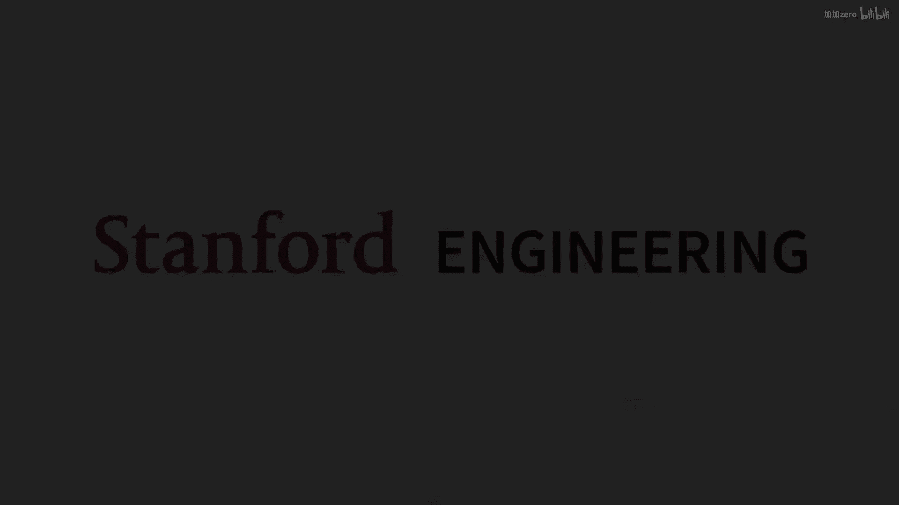
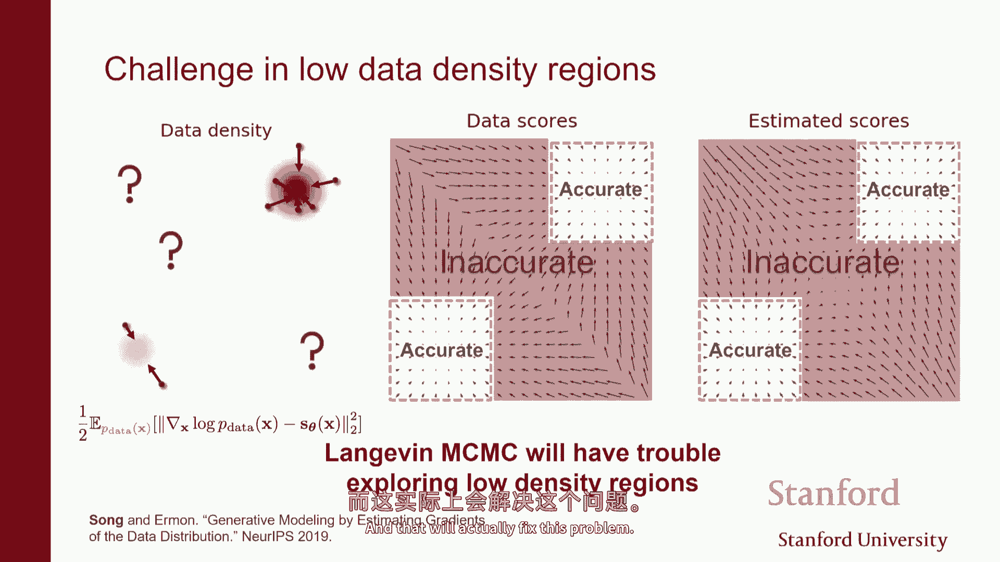
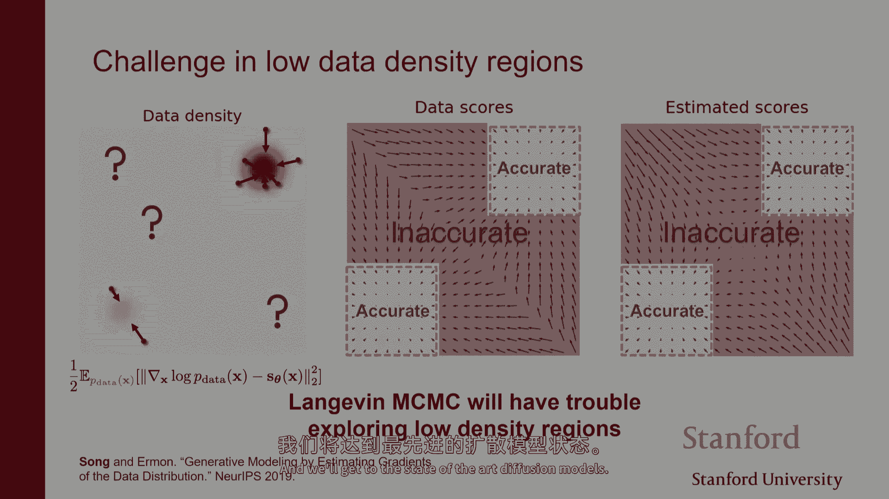

# 13：基于分数的生成模型与扩散模型入门 🧠

在本节课中，我们将要学习一种强大的生成模型——基于分数的模型，也称为扩散模型。这类模型在图像、视频、音频等连续数据生成任务上达到了最先进的水平。我们将看到，它建立在之前讨论过的多种技术之上，并提供了建模概率分布的一种新视角。

## 概述：从概率密度到分数函数

上一节我们介绍了多种生成模型家族。本节中我们来看看另一种表示概率分布的方法。

我们已经见过两大类生成模型：
1.  **基于似然的模型**：模型的核心是概率密度函数（PDF）或概率质量函数（PMF）。模型是一个函数 $p_\theta(x)$，它将输入 $x$ 映射到一个标量，表示 $x$ 的可能性。这类模型的挑战在于必须满足归一化约束（即积分和为1），这限制了可用的网络架构（如自回归模型、归一化流）。
2.  **隐式生成模型**：这类模型（如GAN）直接建模采样过程，例如将随机噪声通过一个神经网络（生成器）来产生样本。其问题在于难以评估生成样本的似然度，且训练不稳定（涉及极小极大优化）。

今天，我们将讨论第三种方法：**基于分数的生成模型**。它适用于连续随机变量，其核心思想不是直接建模概率密度 $p(x)$，而是建模其**对数密度的梯度**，即**分数函数（score function）**：
$$s(x) = \nabla_x \log p(x)$$

分数函数是一个向量场，它指明了在数据空间中，哪个方向能最快地增加数据的对数似然。从计算角度看，分数函数不需要满足归一化约束，这简化了建模过程。

## 分数匹配：训练分数模型

上一节我们定义了分数函数。本节中我们来看看如何训练一个模型来匹配真实数据分布的分数。

我们的目标是：给定一个来自未知数据分布 $p_{data}(x)$ 的样本集，学习一个参数化的向量值函数 $s_\theta(x)$（例如一个神经网络），使其尽可能接近真实分数 $\nabla_x \log p_{data}(x)$。

一个自然的比较方法是使用**费舍尔散度（Fisher Divergence）**：
$$J(\theta) = \frac{1}{2} \mathbb{E}_{p_{data}(x)} [\| \nabla_x \log p_{data}(x) - s_\theta(x) \|^2]$$

然而，这个目标依赖于未知的真实分数 $\nabla_x \log p_{data}(x)$，无法直接优化。通过**分部积分**技巧，我们可以将其重写为一个可计算的形式：
$$J(\theta) = \mathbb{E}_{p_{data}(x)} [\text{tr}(\nabla_x s_\theta(x)) + \frac{1}{2} \| s_\theta(x) \|^2] + \text{const.}$$

这里，$\text{tr}(\nabla_x s_\theta(x))$ 是模型分数 $s_\theta(x)$ 的雅可比矩阵的迹。虽然这个目标不再依赖真实分数，但计算雅可比矩阵的迹在高维数据（如图像）上计算成本极高，与数据维度 $d$ 成正比。

## 去噪分数匹配：一种高效的近似方法

为了解决高维下雅可比迹计算昂贵的问题，我们引入**去噪分数匹配（Denoising Score Matching）**。

核心思想是：我们不直接估计干净数据分布 $p_{data}(x)$ 的分数，而是估计一个经过噪声扰动后的分布 $q_\sigma(\tilde{x})$ 的分数。这个扰动分布是通过给数据添加高斯噪声得到的：$q_\sigma(\tilde{x}) = \int p_{data}(x) \mathcal{N}(\tilde{x}; x, \sigma^2 I) dx$。当噪声水平 $\sigma$ 很小时，$q_\sigma(\tilde{x})$ 非常接近 $p_{data}(x)$。

神奇的是，通过一系列代数推导，匹配噪声数据分布分数的目标，可以等价地转化为一个**去噪（Denoising）**任务。最终的目标函数简化为：
$$\tilde{J}(\theta) = \frac{1}{2} \mathbb{E}_{p_{data}(x)} \mathbb{E}_{\tilde{x} \sim \mathcal{N}(x, \sigma^2 I)} [\| s_\theta(\tilde{x}) - \frac{(\tilde{x} - x)}{\sigma^2} \|^2]$$

以下是其直观解释和训练流程：
*   **直观解释**：对于每个噪声样本 $\tilde{x}$，模型 $s_\theta(\tilde{x})$ 试图预测的是为得到 $\tilde{x}$ 而添加到原始数据 $x$ 上的噪声向量 $(\tilde{x} - x)$，并除以 $\sigma^2$。因此，训练一个分数模型等价于训练一个去噪器。
*   **训练流程**：
    1.  从数据集中采样一个批次干净数据 $\{x_i\}$。
    2.  为每个 $x_i$ 添加高斯噪声，得到噪声样本 $\tilde{x}_i = x_i + \epsilon_i, \epsilon_i \sim \mathcal{N}(0, \sigma^2 I)$。
    3.  计算损失：$L = \frac{1}{N} \sum_i \| s_\theta(\tilde{x}_i) - \epsilon_i / \sigma^2 \|^2$。
    4.  通过梯度下降更新参数 $\theta$ 以最小化损失。

这种方法避免了计算雅可比迹，使得训练可以扩展到高维数据。

## 切片分数匹配：另一种高效方法

除了去噪分数匹配，另一种使训练高效的方法是**切片分数匹配（Sliced Score Matching）**。

其思想是：比较两个向量场是否相等，可以通过比较它们在随机方向上的投影是否相等来实现。我们不再直接比较整个向量，而是随机选取一个方向向量 $v$，然后比较分数在该方向上的投影。

最终得到的目标函数涉及**雅可比向量积（Jacobian-vector product）**，这可以通过一次反向传播高效计算，其成本与数据维度 $d$ 无关，从而实现了可扩展性。

## 基于分数的采样：朗之万动力学

假设我们已经训练好了一个分数模型 $s_\theta(x) \approx \nabla_x \log p_{data}(x)$。我们如何用它来生成新的样本呢？答案是使用**朗之万动力学（Langevin Dynamics）**。

朗之万动力学是一种马尔可夫链蒙特卡洛（MCMC）方法，它仅利用分数函数就可以从分布中采样。其更新规则如下：
$$x_{t+1} = x_t + \epsilon \cdot s_\theta(x_t) + \sqrt{2\epsilon} \cdot z_t, \quad z_t \sim \mathcal{N}(0, I)$$
其中 $\epsilon$ 是步长。

*   **直观理解**：在每一步，粒子 $x_t$ 沿着分数指示的方向（即对数似然梯度上升的方向）移动一小步，同时注入一个随机噪声 $z_t$。噪声的加入确保了采样过程最终能收敛到整个分布 $p_{data}(x)$，而不仅仅是其众数（mode）。
*   **与去噪的联系**：每一步 $x_t + \epsilon \cdot s_\theta(x_t)$ 可以看作是对当前样本 $x_t$ 的一次“去噪”尝试，而添加噪声则防止了确定性过程陷入局部最优。

## 挑战与展望

然而，直接将上述方法应用于复杂数据（如图像）会遇到挑战：
1.  **流形假设**：真实数据往往存在于一个低维流形上。在流形之外或低数据密度区域，分数估计可能非常不准确甚至未定义，导致朗之万动力学采样失败或混合速度极慢。
2.  **混合权重问题**：对于多模态分布，分数函数不包含各模态间的相对权重信息，导致采样结果无法反映真实的模态比例。

在接下来的课程中，我们将看到**扩散模型（Diffusion Models）** 如何通过引入一系列逐渐加噪和去噪的步骤，巧妙地解决这些挑战。扩散模型本质上是在多个噪声尺度上训练分数模型，从而能够在整个空间中获得更准确、更稳定的分数估计，最终实现高质量样本的生成。

## 总结

本节课中我们一起学习了基于分数的生成模型的核心思想：
*   我们放弃了直接建模概率密度，转而建模其对数密度的梯度——**分数函数**。
*   我们介绍了通过**分数匹配**来训练分数模型，并探讨了其原始形式在高维数据下的计算难题。
*   我们学习了两种高效的训练方法：**去噪分数匹配**（将分数估计转化为去噪任务）和**切片分数匹配**（通过随机投影降低计算成本）。
*   我们了解了如何使用**朗之万动力学**，仅利用分数函数从学习到的分布中采样。
*   最后，我们指出了朴素方法的局限性，并引出了更强大的**扩散模型**作为解决方案。

基于分数的模型为我们提供了一种灵活且强大的生成建模框架，是理解当前最先进的扩散模型的重要基础。