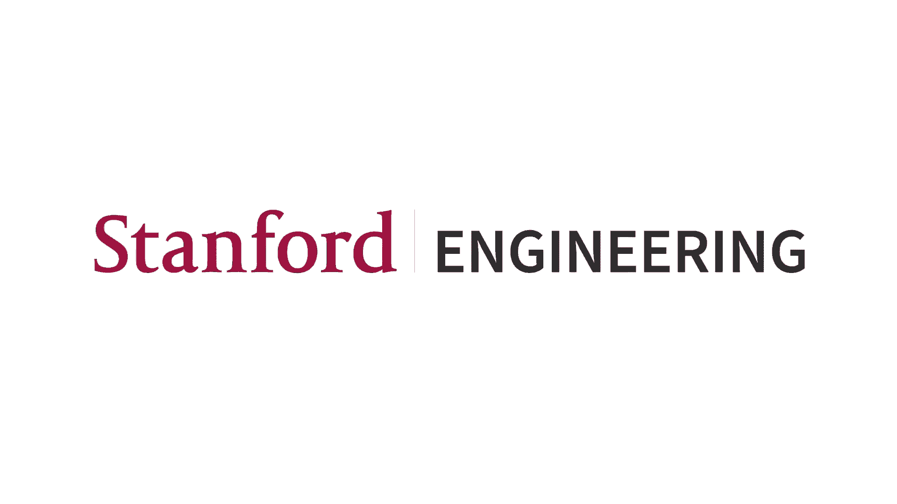
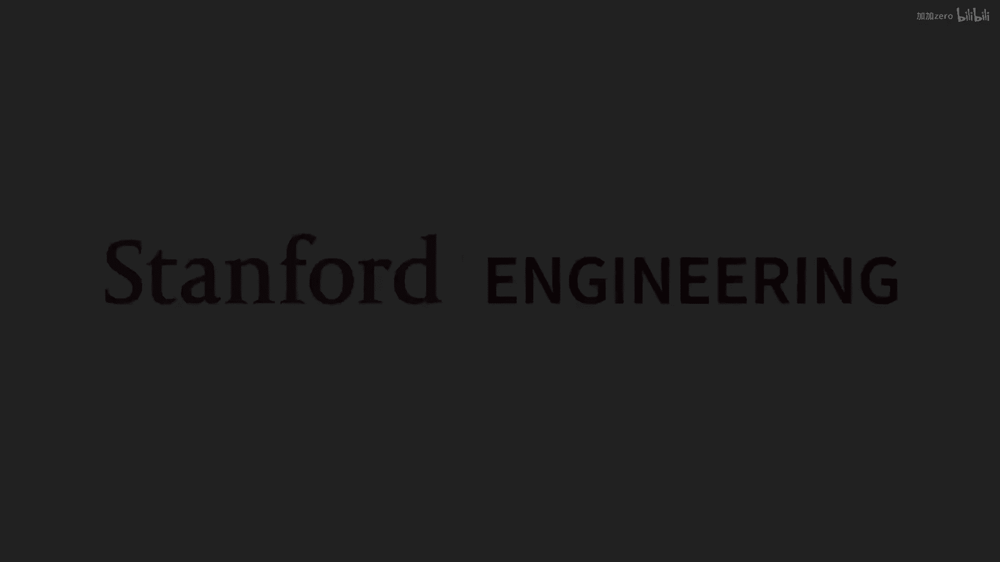
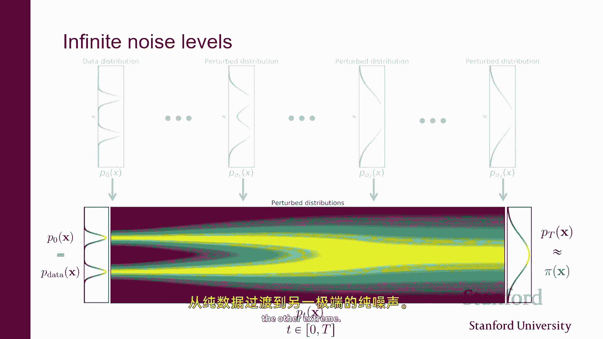
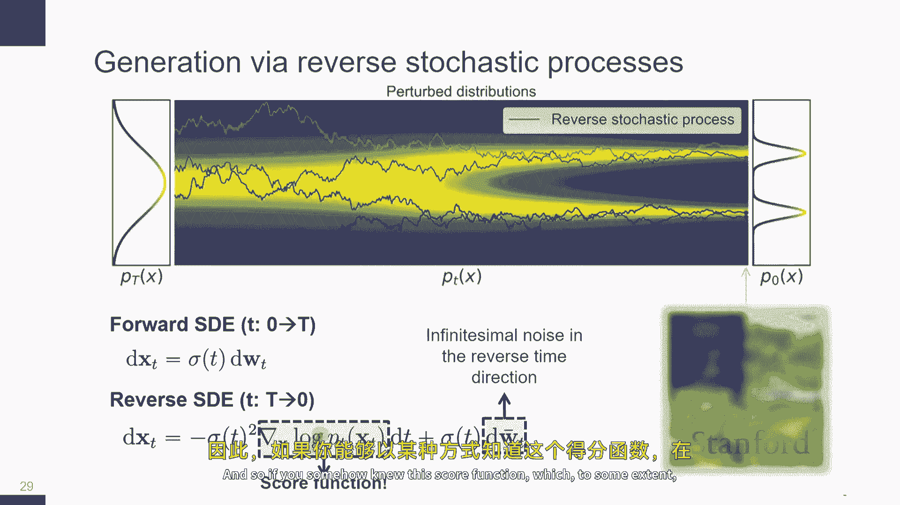
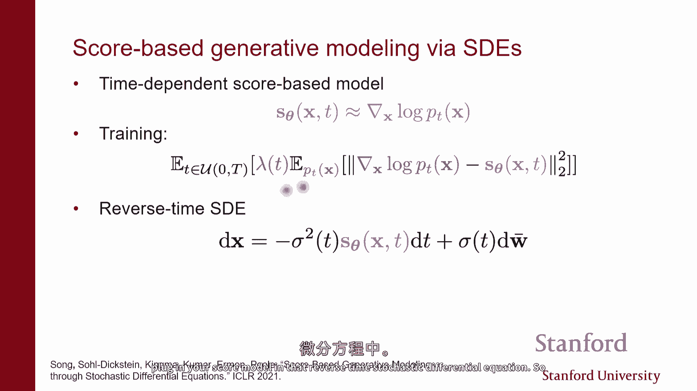
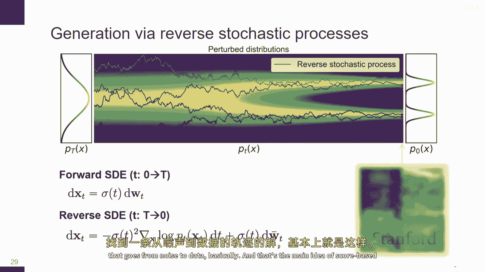
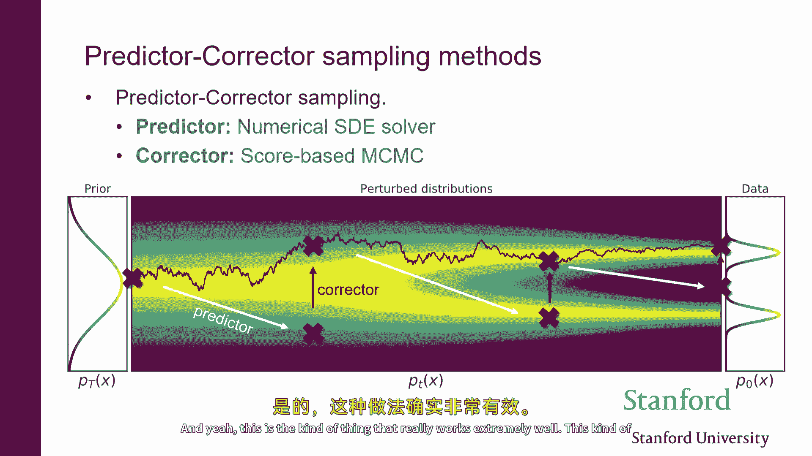
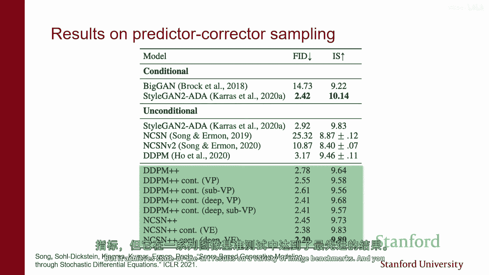
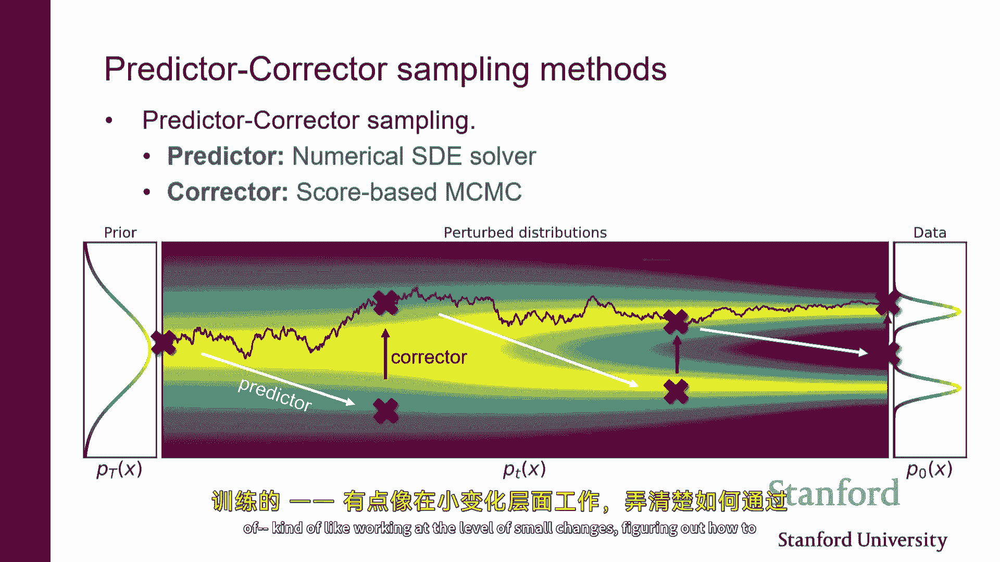

# 14：基于分数的模型与扩散模型 🧠





在本节课中，我们将学习基于分数的生成模型，并探讨它们如何与扩散模型相连接。我们将看到这些技术如何被用于生成高质量的图像和视频。

---

## 概述

基于分数的模型通过参数化数据分布的“得分”（即对数概率密度的梯度）来定义模型族。通过使用得分匹配损失来学习这个向量场，我们可以生成新的数据样本。然而，原始的得分匹配方法在高维数据（如图像）上并不实用。我们将讨论如何通过添加噪声和考虑多个噪声尺度来解决这些问题，从而引出扩散模型的核心思想。

---

## 1. 基于分数模型的核心思想

上一节我们介绍了生成模型的基本概念，本节中我们来看看基于分数模型的具体思路。

关键理念是使用一个向量值神经网络来表示概率分布。对于数据空间中的每个点 `x`，神经网络输出一个向量 `s_θ(x)`。这个向量应该代表数据分布在该点的对数概率密度的梯度，即“得分”。

**公式**：`s_θ(x) ≈ ∇_x log p_data(x)`

因此，你可以将其视为一个由神经网络参数化的向量场。通过改变网络权重 `θ`，我们获得不同的向量场。

---

## 2. 得分匹配及其挑战

我们已经看到，可以通过最小化得分匹配损失来将估计的梯度拟合到真实梯度上。这是一种原则性的模型拟合方法。

然而，它在实践中并不奏效，尤其是在处理像图像这样的高维数据时。主要问题在于计算损失函数中涉及的雅可比矩阵迹非常昂贵，需要大量的反向传播步骤。

---

## 3. 可扩展的得分匹配方法

为了解决上述挑战，我们介绍了两种使得分匹配更可扩展的方法。

### 3.1 去噪得分匹配

在去噪得分匹配中，我们不再试图直接建模干净数据分布 `p_data(x)` 的得分，而是建模一个噪声扰动数据分布 `q_σ(x̃)` 的得分。通常，我们通过向干净数据点 `x` 添加高斯噪声来获得这个扰动分布。

**核心等价关系**：估计噪声扰动数据的得分，等价于解决一个去噪问题。神经网络的目标是预测添加到干净数据上的噪声 `z`。

**代码概念**：
```python
# 假设：x_clean 是干净数据，z 是高斯噪声
x_noisy = x_clean + σ * z
# 神经网络 s_θ 的目标是预测噪声 z
predicted_noise = s_θ(x_noisy, σ)
loss = ||predicted_noise - z||^2
```
这种方法计算上更高效，因为我们不再需要处理雅可比矩阵的迹。但其缺点是，我们最终估计的是噪声扰动分布的得分，而非原始数据分布的得分。

### 3.2 切片得分匹配

在切片得分匹配中，我们不再试图在每个点上完全匹配整个梯度向量，而是仅匹配它们在某个随机方向 `v` 上的投影。

**核心思想**：在每个数据点，我们从某个分布中采样一个随机方向向量 `v`，然后比较真实得分与估计得分在该方向上的投影标量。如果两个向量场相同，那么它们在所有方向上的投影也应该相同。

这种方法可以重写为一个仅依赖于模型、且可高效评估和优化的目标函数。它能估计真实数据密度的得分，但训练速度通常比去噪得分匹配慢。

---

## 4. 采样与存在的问题

如果我们能够通过得分匹配估计出底层的梯度向量场，就可以使用朗之万动力学等随机过程来生成样本。基本思想是沿着得分所指的方向（即概率增加的方向）移动，同时添加少量噪声。

然而，这种方法在实践中存在几个问题：
1.  **得分定义不明确**：对于图像等数据，我们通常认为其大致分布在低维流形上。在流形之外的点，概率密度为零，对数概率密度及其梯度（得分）可能没有良好定义。
2.  **低概率区域估计不准**：训练损失依赖于从数据分布中采样的点，这些点大多来自高概率区域。对于训练中未见过的低概率区域，模型无法准确估计得分。
3.  **收敛性问题**：朗之万动力学的长期动态可能存在收敛速度慢甚至不收敛的问题。

---

## 5. 解决方案：添加噪声

上述所有问题的一个简单而有效的解决方案是：向数据中添加噪声。

*   **解决得分定义问题**：当向数据添加噪声后，噪声扰动数据的支持集变成了整个空间，而不再局限于一个低维流形，因此得分在整个空间上都有定义。
*   **改善低概率区域估计**：添加噪声后，样本会散布到整个空间。如果我们添加足够大的噪声，就可以在更多区域获得准确的得分估计。

但这里存在一个权衡：我们添加的噪声量 `σ` 越大，得分估计越容易、越准确；但同时，我们估计的目标也偏离原始数据分布越远。如果我们跟随噪声扰动数据分布的得分生成样本，最终得到的是带噪声的图像，而非干净的图像。

---

## 6. 关键进展：多噪声尺度

为了在“准确估计得分”和“生成干净样本”之间取得平衡，我们引入了一个关键思想：**同时考虑多个噪声尺度**。

我们不再只使用一个噪声水平 `σ`，而是使用一系列噪声水平 `{σ_1, σ_2, ..., σ_L}`，其中 `σ_1` 很小（接近干净数据），`σ_L` 很大（接近纯噪声）。

**训练**：我们训练一个**噪声条件得分网络** `s_θ(x, σ)`。它接收数据点 `x` 和噪声水平 `σ` 作为输入，目标是估计对应噪声扰动分布 `p_σ(x)` 的得分。训练损失是不同噪声水平下去噪得分匹配损失的加权和。

**代码概念**：
```python
def loss(θ):
    total_loss = 0
    for (x_clean, σ) in data_and_noise_levels:
        z = GaussianNoise()
        x_noisy = x_clean + σ * z
        predicted_noise = s_θ(x_noisy, σ)
        total_loss += λ(σ) * ||predicted_noise - z||^2
    return total_loss
```

**采样（退火朗之万动力学）**：
1.  从最大的噪声水平 `σ_L` 开始，用朗之万动力学从 `p_{σ_L}(x)` 中采样。由于噪声大，得分估计准确，采样过程能有效探索空间。
2.  将上一步得到的样本作为初始点，在下一个稍小的噪声水平 `σ_{L-1}` 上运行朗之万动力学。
3.  重复此过程，逐步降低噪声水平。
4.  在最后的噪声水平 `σ_1`（非常小）上采样，得到的样本几乎来自干净数据分布 `p_data(x)`。

这个过程结合了两种优势：在初始阶段（高噪声）有准确的梯度指引，在最终阶段（低噪声）能生成高质量样本。

---



## 7. 连续时间视角：扩散模型

我们可以将多个离散噪声尺度的思想推向极致：考虑一个**连续的噪声水平**，用时间变量 `t ∈ [0, T]` 索引。其中 `t=0` 对应干净数据分布 `p_0 = p_data`，`t=T` 对应纯噪声分布 `p_T`（例如高斯分布）。

从 `t=0` 到 `t=T` 的过程（数据加噪）可以由一个**前向随机微分方程**描述。关键的理论结果是，如果我们知道每个时间点 `t` 的得分函数 `∇_x log p_t(x)`，那么从噪声生成数据（时间反转）的过程可以由一个**反向随机微分方程**描述。



**公式（反向SDE）**：
`dx = [ - drift_term + diffusion_term * ∇_x log p_t(x) ] dt + diffusion_term * dw`



其中 `dw` 是布朗运动噪声。

**实践**：
1.  我们训练一个连续时间噪声条件得分网络 `s_θ(x, t)` 来近似 `∇_x log p_t(x)`。
2.  采样时，我们从 `t=T` 的纯噪声开始，数值求解上述反向SDE（例如使用欧拉-丸山法），直到 `t=0`，即可得到来自数据分布的样本。



这个框架统一了基于分数的模型和扩散模型。之前讨论的退火朗之万动力学可以看作是求解这个反向SDE的一种特定数值方法。



---



## 8. 总结与成果

本节课中我们一起学习了基于分数的生成模型到扩散模型的演变。

我们从得分匹配的基本思想出发，指出了其在实践中的挑战。通过引入**去噪**和**多噪声尺度**的技术，我们得到了可扩展且强大的模型训练方法。最终，在**连续时间视角**下，这些模型被统一为通过求解反向随机微分方程来生成样本的扩散模型。



这些模型在图像生成领域取得了巨大成功，能够生成非常逼真和高分辨率的图像，在许多基准测试上达到了领先水平。它们的主要优势在于训练稳定性（基于匹配的损失）和推理时可以利用非常深（近乎无限）的计算图来逐步 refine 样本。

---


**核心要点回顾**：
*   **得分**：数据对数概率密度的梯度。
*   **得分匹配**：通过匹配梯度来学习分布。
*   **去噪得分匹配**：通过解决去噪问题来高效学习噪声扰动分布的得分。
*   **多噪声尺度**：同时学习多个噪声水平下的得分，以平衡估计准确性和生成质量。
*   **退火朗之万动力学**：从高噪声到低噪声逐步采样。
*   **扩散模型（连续视角）**：将数据加噪/去噪过程建模为SDE，生成样本即求解反向SDE。