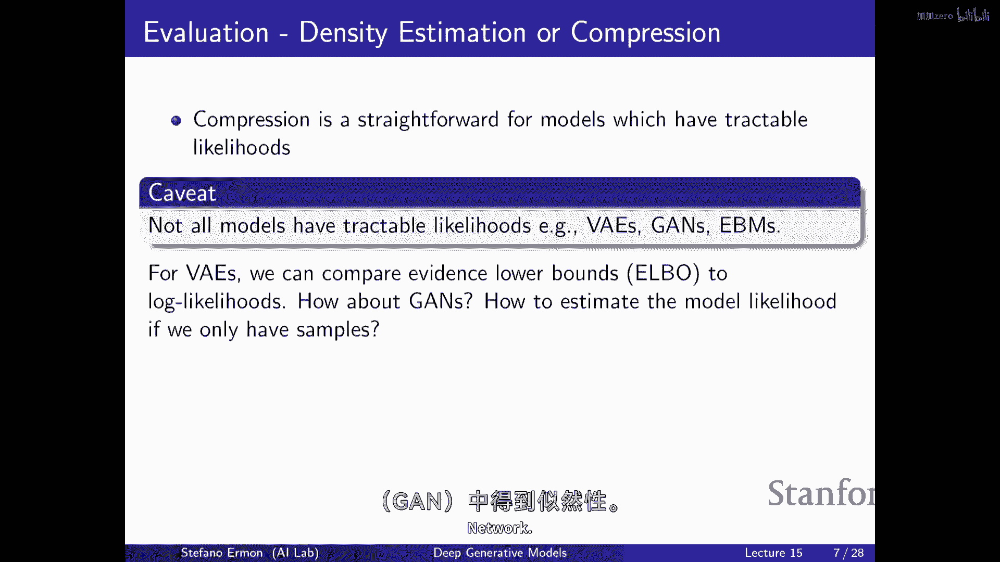
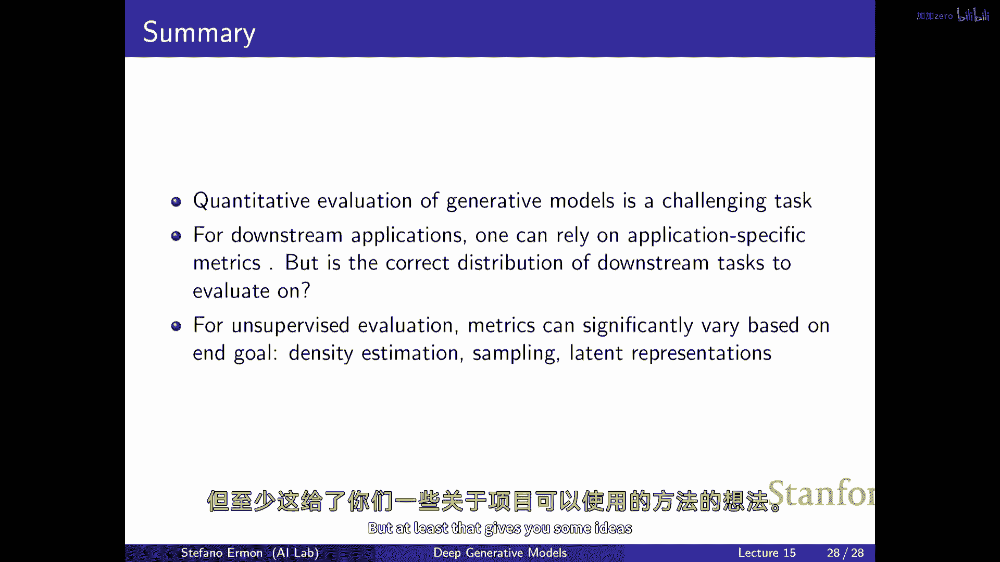

# 15：生成模型评估方法 📊

在本节课中，我们将要学习如何评估深度生成模型的好坏。这是一个具有挑战性的主题，因为目前并没有关于如何正确评估的共识。我们将尽力覆盖一些现有的方法，尽管没有完美的方法，但了解这些方法对于比较和选择模型至关重要。

## 概述：为什么评估生成模型很困难？

上一节我们介绍了多种生成模型和训练目标。一个自然的问题是：如何为你的数据集选择合适的模型？这最终归结为“哪个模型更好”的问题。为了回答这个问题，你需要能够评估生成模型的质量。与用于分类的判别模型不同，生成模型的评估相当困难。对于分类任务，你可以通过损失函数或准确率等量化指标在未见数据上评估性能。然而，对于生成模型，任务的性质本身就不明确，这是我们面临的主要挑战。

## 评估目标：我们关心什么？

评估生成模型取决于你的最终目标。以下是几种常见的关心点：
*   **密度估计**：关心评估图像或句子的概率。
*   **压缩**：关心如何高效地压缩数据。
*   **样本生成**：关心生成美观或逼真的输出。
*   **表示学习**：希望模型从无标签数据中学习结构，以改进下游任务。
*   **任务解决**：例如，利用大型语言模型通过提示解决各种任务。

这些不同的目标导致了多种不同的评估指标。

## 基于似然（压缩）的评估 📉

如果你真正关心密度估计或压缩，那么**似然度**是一个相当合理的度量。你可以将数据分为训练集、验证集和测试集，在测试集上评估模型的平均对数似然度。最大化似然度等于最小化KL散度，这与尝试最佳地压缩数据是同一件事。

**公式**：平均代码长度 ≈ -log p(x)

实际上，训练良好的概率模型可以映射到高效的压缩方案（如算术编码）。因此，比较模型的似然度就是在比较它们压缩数据的能力。直觉上，要实现良好的压缩，模型必须识别数据中的模式和结构，这可以看作是学习世界知识的一种方式。

然而，这种方法存在主要限制：**并非所有信息位都同等重要**。例如，图像标签信息可能比单个像素的微小颜色变化重要得多，但从压缩角度看，它们被同等对待。此外，许多模型（如GAN）无法直接计算似然度。

## 如何为无法计算似然的模型估计密度？ 🔍

对于只能采样、不能直接计算似然度的模型（如GAN），我们可以使用**核密度估计**来近似其概率密度函数。

**方法**：给定模型生成的样本 {x₁, x₂, ..., xₙ}，对于新数据点 x，其概率密度估计为：
`p̂(x) = (1/n) * Σᵢ K((x - xᵢ)/σ)`
其中，`K` 是核函数（如高斯核），`σ` 是控制平滑度的带宽参数。

核密度估计在高维空间（如图像）中可能不可靠，因为需要大量样本来覆盖整个空间。对于潜在变量模型（如VAE），可以通过对潜在变量 `z` 积分来计算似然，但通常需要使用**重要性采样**等技术来获得更准确的估计。

## 评估样本质量 🖼️

在许多情况下，我们更关心生成样本的质量。如何判断一组样本比另一组更好呢？

### 人类评估 👥

最直接的方法是让人类评估者比较样本。这通常被认为是“黄金标准”。一些原则性方法包括：
*   **欺骗率**：给评估者无限时间，计算他们无法区分真实样本与生成样本的比例。
*   **辨别时间**：测量评估者需要多长时间才能准确辨别样本真伪，所需时间越长，样本质量可能越好。

然而，人类评估成本高、难以规模化、且不易复现。此外，它可能无法检测模型是否只是简单地**记忆**了训练集。

### 自动化指标 🤖

以下是几种常用的自动化评估指标：

**1. Inception Score**
该指标适用于有标签的数据集（如ImageNet）。它结合了两个方面：
*   **清晰度**：分类器对生成样本的预测应非常确信（熵低）。
*   **多样性**：所有类别的生成样本都应出现（预测标签的边缘分布熵高）。

**公式**：IS = exp( Eₓ [ KL( p(y|x) || p(y) ) ] )
更高的Inception Score通常意味着更好的样本质量。但其缺点在于只关注生成样本，未与真实数据直接比较。

**2. Fréchet Inception Distance**
FID分数通过比较生成样本与真实样本在预训练模型（如Inception网络）特征空间中的统计量来工作。
*   **方法**：为两组样本的特征分别拟合一个多维高斯分布，然后计算这两个高斯分布之间的Fréchet距离（又称Wasserstein-2距离）。
*   **公式**：`FID = ||μ_r - μ_g||² + Tr(Σ_r + Σ_g - 2(Σ_r Σ_g)^(1/2))`
较低的FID分数表示生成样本与真实样本更相似。

**3. 核最大平均差异**
MMD是一种基于核的两样本检验方法。它比较了样本间相似性的统计量。
*   **思想**：如果两个分布相同，那么样本内的平均相似度应该等于样本间的平均相似度。
*   **方法**：可以在原始像素空间或预训练模型提取的特征空间上计算MMD。

对于文本到图像等更复杂的生成任务，评估可能涉及更多维度，如图文对齐度、审美得分、偏见测量等，需要更全面的基准（如HEIM）。

## 评估学习到的表示 🧠

如果我们训练生成模型的目的是进行表示学习，如何评估学习到的特征好坏呢？

### 在下游任务上的性能
如果你心中有特定的下游任务（如分类），最直接的方法是使用生成模型提取的特征来训练一个简单的分类器，并评估其性能。性能越好，表示质量可能越高。

### 聚类质量
在无监督设置下，可以评估特征空间的聚类能力。将数据点映射到特征空间后，应用聚类算法（如K-means），然后使用数据集的真实标签（如果有）来评估聚类结果。常用指标包括：
*   **同质性**：每个簇中是否只包含单一类别的样本。
*   **完整性**：同一类别的样本是否都被分配到了同一个簇中。
*   **V-measure**：同质性和完整性的调和平均数。

### 重建质量
如果你关心有损压缩，可以评估从潜在表示重建原始数据的准确性。例如，比较重建图像与原始图像之间的均方误差或PSNR。

### 解耦程度
对于潜在变量模型，我们可能希望每个潜在变量控制数据生成过程中某个独立的、可解释的因素（如物体大小、颜色）。评估解耦程度的指标包括：训练一个线性分类器，根据潜在变量预测已知的生成因子，并计算其准确率。但理论上，仅从无标签数据中完全解耦所有因子被证明是不可能的。

## 评估语言模型的应用能力 💬

对于大型语言模型，除了困惑度（与似然相关）外，我们更关心其解决实际任务的能力。主要使用方式有两种：

**1. 提示**
通过精心设计自然语言提示，让模型直接生成任务答案。评估方式是在一系列多样的任务（如问答、情感分析、数学推理）上测试模型的零样本或少样本性能。大规模的基准测试（如HELM、Big-Bench）包含了数百个任务，用于全面比较不同模型。

**2. 微调**
将预训练模型在其特征表示上，针对特定下游任务进行微调。然后评估微调后的模型在该任务上的性能。

提示通常更便捷，无需额外训练；而微调可能获得更高性能，但需要计算资源和专业知识。

## 总结与展望 🎯

本节课中我们一起学习了评估深度生成模型的各种方法。我们了解到：
*   评估高度依赖于最终目标（密度估计、样本质量、表示学习等）。
*   **似然/压缩**是密度估计的自然指标，但有局限性，且不适用于所有模型。
*   **样本质量**可以通过人类评估或自动化指标（如IS、FID、MMD）来衡量，但各有优缺点。
*   **表示质量**可以通过下游任务性能、聚类、重建或解耦程度来评估。
*   对于**语言模型**，评估重点转向其通过提示或微调解决多样化任务的能力。

生成模型的评估仍然是一个活跃且开放的领域。尽管我们有许多指标和基准，但如何权衡不同指标、什么是“正确”的任务分布，仍然没有明确答案。随着生成模型的不断发展，设计更好、更全面的评估方法将是至关重要的研究方向。希望本课内容能帮助你为自己的项目选择合适的评估策略。