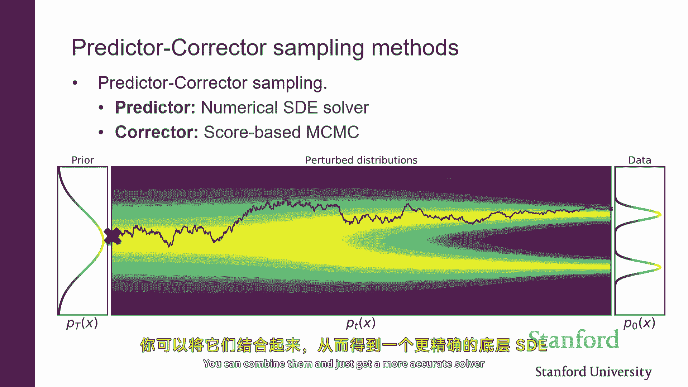

# 16：扩散模型与基于分数的生成模型 🧠

在本节课中，我们将学习扩散模型的核心概念，并探讨其与基于分数的生成模型以及变分自编码器之间的联系。我们将从基础回顾开始，逐步深入到如何将扩散过程视为一种层次化的变分自编码器，并最终理解如何将其转换为可精确计算似然度的流模型。

---

## 1. 基于分数模型的简要回顾 📊

上一节我们介绍了生成模型的基本概念，本节中我们来看看基于分数模型的核心思想。

基本思想是通过对概率分布的**得分函数**（即对数概率密度的梯度）进行建模来工作。得分函数是一个向量场，指示了在输入空间中应向哪个方向移动以增加样本的可能性。我们使用深度神经网络来建模这个得分函数。

以下是核心概念：
*   **得分函数**：`score(x) = ∇_x log p(x)`
*   **目标**：训练一个神经网络 `s_θ(x)`，使其近似真实数据分布的得分函数。

我们见过，可以使用**分数匹配**来从数据中估计得分。这是一种回归损失，旨在最小化估计得分与真实得分之间的L2距离。然而，直接计算真实得分是困难的。

因此，我们引入了**去噪分数匹配**。其核心思想不是直接估计干净数据分布 `p_data` 的得分，而是估计一个被噪声扰动后的分布 `q_σ` 的得分，其中 `q_σ` 是 `p_data` 与高斯核的卷积结果。

以下是去噪分数匹配的关键步骤：
1.  从数据分布中采样一个干净样本 `x`。
2.  添加高斯噪声，得到噪声样本 `x̃ = x + σ * ε`，其中 `ε ~ N(0, I)`。
3.  训练一个去噪模型 `ε_θ(x̃, σ)`，使其能够预测添加到干净样本上的噪声向量 `ε`。
4.  可以证明，优化这个去噪目标等价于估计噪声扰动分布 `q_σ` 的得分。

一旦我们有了对得分的估计，就可以使用**朗之万动力学**来生成样本。这个过程从一个随机初始化的点开始，然后沿着估计的得分方向（即梯度上升方向）移动，并添加少量噪声，从而逐渐移动到高概率区域。

为了使这个过程有效，我们不仅估计单一噪声水平下的得分，而是估计一系列不同噪声水平 `{σ_i}` 下的得分。我们训练一个**噪声条件得分网络**，它同时以样本 `x` 和噪声水平 `σ` 作为输入。

以下是生成样本（朗之万动力学）的过程：
1.  从纯噪声（大σ）开始初始化样本。
2.  对于从大到小的一系列噪声水平 `σ_i`：
    *   运行朗之万动力学链，使用对应于当前噪声水平 `σ_i` 的得分估计来更新样本。
    *   将最终样本作为下一个更小噪声水平链的初始值。
3.  最终，当噪声水平足够小时，我们得到一个接近干净数据分布的样本。

这个过程具有迭代去噪的直观含义：从纯噪声开始，逐步去除噪声以揭示数据结构。

---

## 2. 将扩散模型视为层次化变分自编码器 🔄

上一节我们回顾了基于分数模型的采样过程，本节中我们来看看如何将这个过程形式化为一个层次化的变分自编码器。

我们可以将数据逐步添加噪声的过程（前向过程）视为一个**编码器**，而将逐步去噪生成数据的过程（反向过程）视为一个**解码器**。

**前向过程（编码器）**：
这是一个固定的马尔可夫链，每一步都向数据添加少量高斯噪声。
*   给定 `x_{t-1}`，定义 `x_t` 的分布为：`q(x_t | x_{t-1}) = N(x_t; √(1-β_t) * x_{t-1}, β_t * I)`
*   其中 `β_t` 是控制噪声量的超参数。
*   这个过程从数据 `x_0` 开始，经过 `T` 步后，`x_T` 近似于纯高斯噪声。

这个编码器是固定的、无需学习的，它只是简单地添加噪声。联合分布 `q(x_{1:T} | x_0)` 是所有条件高斯分布的乘积。

**反向过程（解码器）**：
这是我们希望学习的生成模型，它试图逆转前向过程。
*   我们定义生成分布 `p_θ(x_{0:T})`，它从一个先验分布（纯噪声）开始：`p(x_T) = N(x_T; 0, I)`
*   然后学习一系列条件分布来逐步去噪：`p_θ(x_{t-1} | x_t)`
*   通常，我们假设这些条件分布也是高斯的：`p_θ(x_{t-1} | x_t) = N(x_{t-1}; μ_θ(x_t, t), Σ_θ(x_t, t))`
*   其中均值 `μ_θ` 和方差 `Σ_θ` 由神经网络参数化。

这定义了一个层次化的潜在变量模型，其中潜在变量序列是 `x_1, x_2, ..., x_T`。

**训练目标**：
与变分自编码器类似，我们通过最大化证据下界来训练模型。对于扩散模型，ELBO 可以推导为：
`L = E[log p_θ(x_0) - D_KL(q(x_{1:T}|x_0) || p_θ(x_{1:T}|x_0))]`

经过推导和参数化选择（例如，让神经网络 `ε_θ` 预测噪声），这个ELBO损失可以简化为一个**去噪分数匹配损失**：
`L_simple = E_{t, x_0, ε}[|| ε - ε_θ(√(ᾱ_t)x_0 + √(1-ᾱ_t)ε, t) ||^2]`
其中 `ᾱ_t` 是 `β_t` 的函数。

因此，**优化扩散模型的ELBO等价于训练一个噪声条件得分网络进行去噪分数匹配**。两种视角在训练目标上达成了统一。

**采样**：
在采样时，扩散模型通过执行学习到的反向过程来生成样本：
1.  从 `x_T ~ N(0, I)` 采样。
2.  对于 `t = T, ..., 1`：
    *   从 `p_θ(x_{t-1} | x_t)` 采样 `x_{t-1}`。
    *   这通常涉及计算 `μ_θ(x_t, t)` 并添加一些噪声。

这个过程与朗之万动力学类似，都是迭代去噪，但具体更新规则源于对反向过程高斯分布的参数化。

---

## 3. 连续时间视角：随机微分方程与概率流ODE ⏱️

上一节我们在离散时间框架下讨论了扩散模型，本节中我们来看看当时间步数趋于无穷时的连续时间视角。

当我们将离散时间步 `t` 无限细化，前向加噪声过程可以描述为一个**随机微分方程**：
`dx = f(x, t) dt + g(t) dw`
其中 `dw` 是布朗运动增量。一个简单的选择是 `f(x, t) = -0.5 β(t) x`, `g(t) = √β(t)`。这个SDE描述了概率密度如何随时间“扩散”。

有趣的是，对于每一个前向SDE，都存在一个对应的**反向时间SDE**，它描述了从噪声生成数据的过程：
`dx = [f(x, t) - g(t)^2 ∇_x log p_t(x)] dt + g(t) d\bar{w}`
其中 `∇_x log p_t(x)` 正是在时间 `t` 的得分函数，`d\bar{w}` 是反向时间的布朗运动。

**关键联系**：为了数值求解这个反向SDE以生成样本，我们**需要知道每一步的得分函数** `∇_x log p_t(x)`。这正是我们通过噪声条件得分网络 `s_θ(x, t)` 所学习的内容。

将学习到的得分模型 `s_θ(x, t)` 代入反向SDE，我们就可以通过数值SDE求解器（如欧拉-丸山法）从噪声中采样数据。这提供了另一种生成样本的视角。

更进一步，任何一个SDE都可以转换为一个**常微分方程**，称为**概率流ODE**，它具有相同的边缘分布 `p_t(x)`：
`dx/dt = f(x, t) - 0.5 * g(t)^2 ∇_x log p_t(x)`

这个ODE是确定性的（没有随机噪声项）。它的优势在于：
1.  **可逆性**：由于是确定性ODE，从 `x_T` 到 `x_0` 的映射是可逆的。这实际上将模型变成了一个**连续归一化流**。
2.  **精确似然计算**：利用变量变换公式，我们可以通过积分这个ODE来精确计算数据点 `x_0` 的似然值 `p(x_0)`。
3.  **高效采样**：可以使用更高效、精度更高的ODE求解器进行采样。

因此，通过得分函数，我们可以在SDE（随机采样）和ODE（确定性流，可计算似然）视角之间自由切换。

---

## 4. 总结与核心联系 🎯

本节课中我们一起学习了扩散模型的多重视角及其内在联系。

1.  **基于分数的模型**：核心是学习数据分布（及其噪声扰动版本）的得分函数，并使用朗之万动力学采样。
2.  **扩散模型（DDPM）**：将生成过程视为一个学习去噪反向过程的层次化VAE。其训练目标被证明等价于去噪分数匹配。
3.  **随机微分方程视角**：在连续时间极限下，扩散过程由SDE描述。生成样本需要求解依赖得分函数的反向SDE。
4.  **概率流ODE**：任何扩散SDE都有对应的确定性ODE。使用得分函数求解此ODE，可将模型转换为一个可精确计算似然的流模型。

这些视角通过**得分函数** `∇_x log p_t(x)` 这一核心概念紧密相连。无论是作为VAE的解码器参数，还是作为SDE/ODE的驱动项，学习准确的得分函数都是扩散模型成功的关键。

最终，我们拥有了一个灵活的框架：既可以利用SDE视角的随机性进行采样，也可以利用ODE视角的确定性和可逆性进行精确似然计算，为生成建模提供了强大的工具。