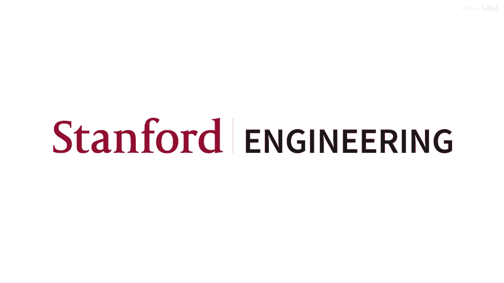
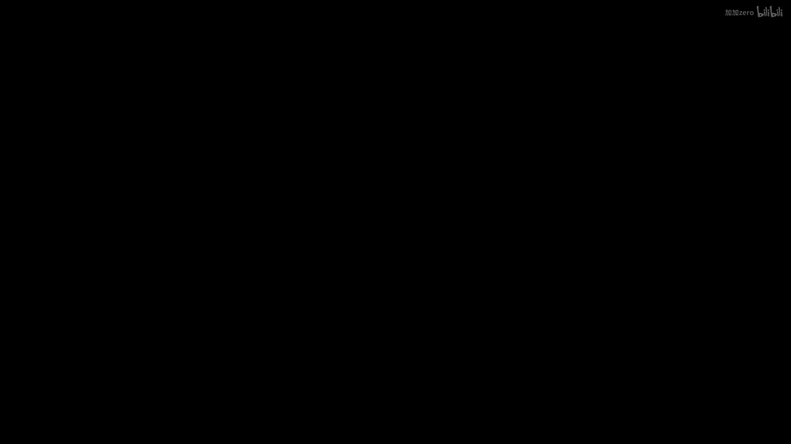
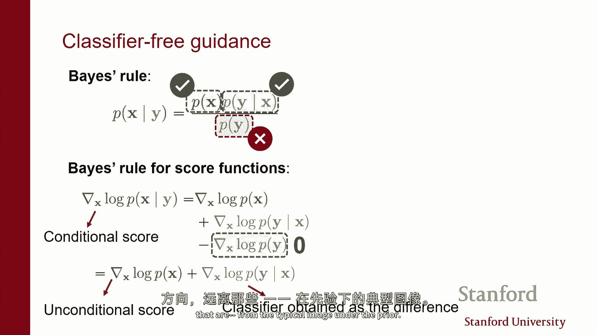
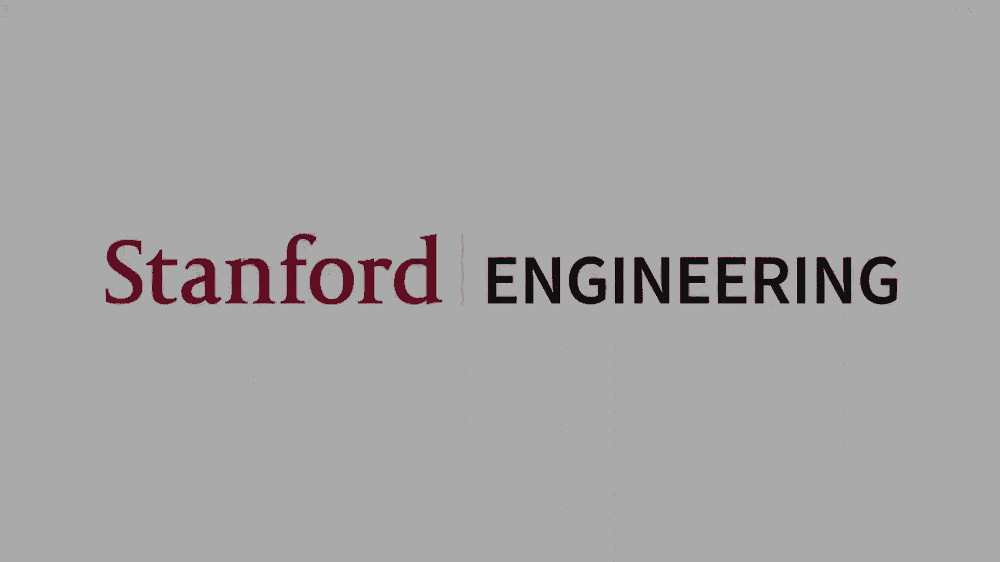

# 17：扩散模型与连续时间视角 🧠

在本节课中，我们将深入探讨扩散模型，特别是从变分自编码器（VAE）的视角出发，理解其与基于分数的模型之间的联系。我们将看到如何将离散时间过程推广到连续时间，并探讨这种视角如何带来更高效的采样、似然计算以及可控生成等强大功能。

---

## 从 VAE 视角看扩散模型 🔄

上一节我们介绍了扩散模型的基本思想。本节中，我们来看看如何将其视为一种特殊的变分自编码器。

扩散模型的前向过程（向数据添加噪声）可以看作是一个编码器。每一步的转换 `Q(xt | xt-1)` 是一个以 `xt-1` 为中心的高斯分布，我们只需添加一些噪声即可得到 `xt`。经过多步后，数据中的结构被完全破坏，最终得到纯噪声。

相应地，存在一个反向过程（从噪声到数据），可以看作是一个解码器。解码器 `pθ(xt-1 | xt)` 试图根据 `xt` 来猜测 `xt-1` 的值。这些解码器通常也是高斯分布，其参数由神经网络计算。

我们可以通过优化证据下界（ELBO）来训练这类模型，其目标是**最小化编码器分布与解码器分布之间的 KL 散度**。有趣的是，经过数学推导，这个 ELBO 目标最终变成了**精确的噪声分数匹配目标**。

**核心公式**：
优化 ELBO 对应于学习一系列去噪器，每个去噪器对应链中的一个不同噪声水平。这本质上与噪声条件分数网络（NCSN）做的事情相同。

因此，去噪扩散概率模型（DDPM）的训练和推理过程与基于分数的模型非常相似。在训练时，我们学习一系列去噪器；在生成样本时，我们使用解码器进行采样。由于解码器是高斯分布，采样步骤包括计算均值并添加噪声，这与朗之万动力学（跟随梯度并添加噪声）的更新步骤非常相似。

---

## 迈向连续时间极限 ⏱️

上一节我们讨论了离散时间步的扩散模型。本节中，我们来看看当噪声级别趋于无穷多时，会发生什么。

我们可以将离散的噪声级别序列视为一个**由连续变量 t 索引的分布谱**。在 `t=0` 端是干净的数据分布，在 `t=T` 端是纯噪声分布。这种连续视角揭示了模型的额外结构，可用于开发更高效的采样器和精确的似然评估。

连续版本描述了一个从数据到噪声的随机过程。这个过程可以通过**随机微分方程（SDE）** 来描述。

**核心公式**（前向 SDE）：
`dxt = dwt`
其中 `dwt` 表示无穷小的噪声（维纳过程的微分）。这是一个没有漂移项的 SDE，意味着变化完全由噪声驱动，就像一种连续的随机游走。

这个 SDE 本质上是之前 VAE 视角中，相邻切片时间步长趋于无穷小时的极限。在密度层面上，这相当于用高斯核连续地对密度进行卷积。

---

## 时间反转与生成过程 🔁

上一节我们定义了从数据到噪声的前向 SDE。本节中，我们来看看如何反转时间，以得到一个从噪声生成数据的随机过程。

如果我们翻转时间轴的方向（令 `t' = T - t`），可以得到描述反向过程的 SDE。有趣的是，这个反向 SDE 包含了一个**漂移项**，而这个漂移项正是**扰动数据密度在时间 t 的得分（梯度）**。

**核心公式**（反向 SDE）：
`dxt = [∇ log pt(xt)] dt + dwt`
这里的 `∇ log pt(xt)` 就是得分函数。这个方程告诉我们，要从噪声生成数据，我们不仅需要添加噪声，还需要跟随得分函数指引的方向。

直观理解：如果我们想从混合了两个高斯分布（例如，猫和狗的图像）的数据分布中采样，并且只想生成狗，那么得分函数会引导轨迹走向“狗”对应的概率质量区域。这为后续的**可控生成**奠定了基础。

为了从该 SDE 定义的模型中生成样本，我们需要知道得分函数 `∇ log pt(xt)`。我们可以通过训练一个神经网络 `sθ(x, t)` 来估计它，使用的目标函数是分数匹配（或去噪分数匹配）损失。

---

## 从随机微分方程到常微分方程 🛤️

上一节我们讨论了用随机微分方程（SDE）描述生成过程。本节中，我们将看到存在一个完全确定性的过程，能产生完全相同的边缘分布。

通过一个称为**概率流常微分方程（Probability Flow ODE）** 的变换，我们可以将随机性的 SDE 转换为一个确定性的常微分方程。

**核心公式**（概率流 ODE）：
`dxt = [∇ log pt(xt) - 1/2 ∇·(∇ log pt(xt))] dt ≈ ∇ log pt(xt) dt` （在某些简化条件下）
这个 ODE 定义了一个**确定性**的轨迹。关键点在于，由这个 ODE 产生的边缘分布 `pt(xt)`，与之前反向 SDE 产生的边缘分布**完全相同**。

这意味着我们可以将扩散模型视为一个**连续时间的归一化流（Normalizing Flow）**。这个流模型由 ODE 的解定义，映射是可逆的。这带来了两大好处：
1.  **高效、精确的采样**：可以利用数值 ODE 求解器（如 Runge-Kutta 方法）进行快速、高精度的采样。
2.  **精确的似然计算**：通过反转 ODE 将数据点映射回先验噪声空间，并计算变量变换的雅可比行列式（实践中通过积分迹实现），可以计算数据点的确切似然。

尽管扩散模型并非直接通过最大似然训练，但通过分数匹配学习后，它们能在图像数据集上达到最先进的似然值。

---

## 加速采样与蒸馏技术 ⚡

上一节我们介绍了通过 ODE 进行确定性采样的优点。本节中，我们来看看如何进一步加速采样过程。

在实践中，我们仍需离散化时间轴来数值求解 ODE 或 SDE。采样速度与步数直接相关。

以下是几种加速策略：

**1. 更粗的离散化**
直接减少采样步数（例如从 1000 步减到 30 步），以计算换速度。这会引入数值误差，但通常能保持可接受的样本质量。

**2. 先进的 ODE 求解器**
使用更高级的数值 ODE 求解器（如 DPM-Solver），可以在更少的步数内获得高精度的解。

**3. 并行化采样**
通过并行计算轨迹的不同部分（在多个 GPU 上），可以用更多的总计算量来换取更短的“墙钟时间”。

**4. 知识蒸馏（渐进式蒸馏）**
这是一种模型压缩技术：
*   训练一个“教师”扩散模型（步数多，结果准）。
*   训练一个“学生”模型，目标是让其**一步**的输出，匹配教师模型**多步**后的输出。
*   迭代此过程，可以将千步模型蒸馏成几步甚至一步的模型，实现极速生成。“一致性模型”便是此类思想的体现。

---

## 潜在扩散模型与条件生成 🎨

上一节我们讨论了在原始像素空间操作的扩散模型。本节中，我们来看看如何将其扩展到潜在空间，并实现条件生成。

**潜在扩散模型（LDM）**
直接在像素上训练扩散模型计算成本高昂。潜在扩散模型的核心思想是：
1.  使用一个预训练的自编码器（VAE）将高维图像 `x` 编码到低维潜在空间 `z`。
2.  在潜在空间 `z` 上训练扩散模型。
3.  生成时，先从潜在空间的扩散模型采样得到 `z`，再用解码器重建为图像 `x`。

**优势**：在低维空间训练更快、更省内存，同时保持了生成质量。Stable Diffusion 是此方法的成功代表。

**条件生成**
我们通常希望生成特定类别的图像（如“狗”），或根据文本描述生成图像。这需要学习**条件分布 p(x|y)** 的得分函数，其中 `y` 是标签或文本。

**方法一：训练条件模型**
直接训练一个以 `y` 为额外输入的去噪网络 `sθ(x, t, y)`。这需要将 `y`（如通过文本编码器得到的向量）集成到网络架构中（例如通过交叉注意力）。

**方法二：事后引导（Classifier Guidance）**
如果我们已有一个无条件扩散模型（先验 `p(x)`）和一个分类器 `p(y|x)`，则可以通过贝叶斯规则得到后验得分：
`∇ log p(x|y) = ∇ log p(x) + ∇ log p(y|x)`
**核心操作**：在采样时，将无条件模型的得分与分类器对 `x` 的梯度相加，即可引导生成过程朝向符合条件 `y` 的样本。这无需重新训练扩散模型。

**方法三：无分类器引导（Classifier-Free Guidance）**
更常用的方法是同时训练一个条件扩散模型 `sθ(x, t, y)` 和一个无条件模型 `sθ(x, t, ∅)`，然后在采样时进行插值：
`引导得分 = sθ(x, t, y) + γ * (sθ(x, t, y) - sθ(x, t, ∅))`
其中 `γ > 1` 是引导强度。这种方法避免了训练显式分类器，在实践中效果更好、更稳定，被当前先进的文生图模型广泛采用。

---

## 总结 📚

本节课我们一起深入学习了扩散模型的连续时间视角及其强大应用。

*   我们从 **VAE 的视角** 理解了扩散模型的训练目标与分数匹配的等价性。
*   通过引入**连续时间极限**，我们用**随机微分方程（SDE）** 描述了前向噪声添加和反向生成过程。
*   我们发现了与之等价的**概率流常微分方程（ODE）**，这允许我们将扩散模型视为**连续时间归一化流**，从而实现**精确的似然计算**和**高效的确定性采样**。
*   为了加速生成，我们探讨了**粗离散化、高级 ODE 求解器、并行化及知识蒸馏**等技术。
*   最后，我们介绍了**潜在扩散模型（LDM）** 如何通过在高维数据上进行操作来提升效率，并详细讲解了**条件生成**的多种方法，包括**训练条件模型、事后引导和无分类器引导**，这些技术使得扩散模型能够根据文本、类别等指令进行可控生成。

这种连续时间的数学框架为理解、改进和应用扩散模型提供了强大而统一的基础。