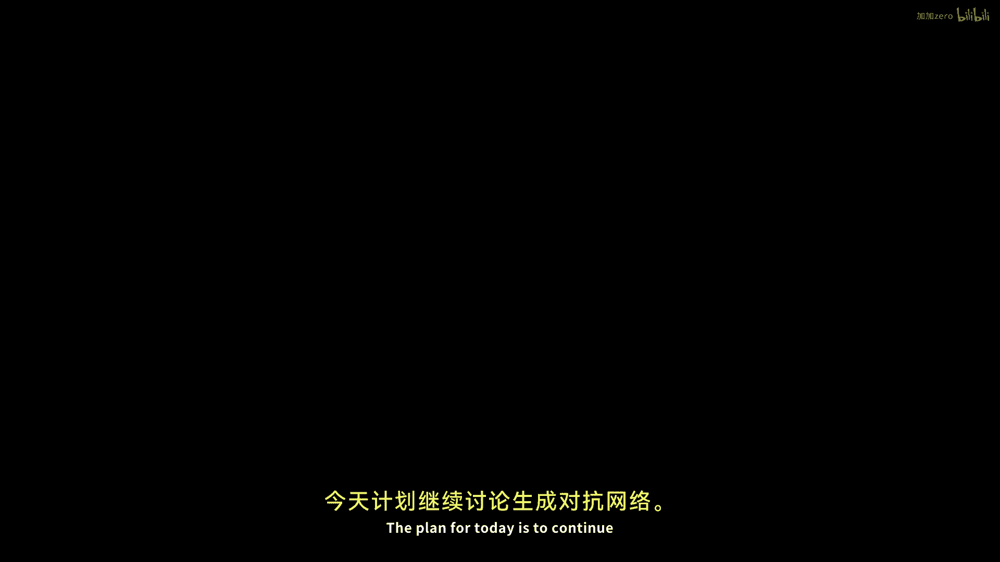
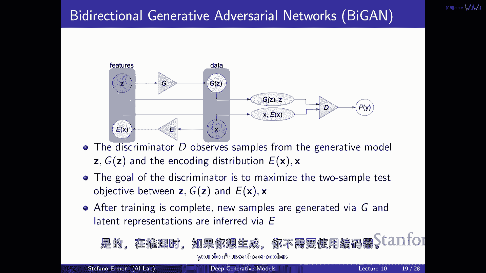

# 【深度生成模型 CS236 2023】斯坦福—中英字幕 - P10：p10 Stanford CS236： Deep Generative Models I 2023 I Lecture 10 - GA - 加加zero - BV1NjH4eYE1v

今天的计划是继续讨论生成对抗网络。

嗯，作为总结，记住，生成对抗网络的一个好处是，它允许我们在无概率的方式训练模型，这基本上意味着你不再需要选择像特殊的架构一样，或者根据链规则分解分布，因为你被强制，能够评估数据点的概率。

因为你想要最大似然训练，嗯，想法是，有一些方法可以，基本上比较你生成模型的概率分布到数据分布，嗯，它不涉及KL散度，并且它不需要，基本上你不必根据你的模式评估样本的概率，特别是在。

我们已经看到有一种非常合理的方法可以找出你的表现如何，你的生成模型匹配一个数据分布，这涉及到基本上训练一个分类器，并且在这个空间中，分类器通常被称为判别器，判别器应该被训练来区分，就像。

接收到样本是否真实，意味着，它们来自数据分布还是伪造的，我意思是它们来自模型分布，你可以认为这个分类器的性能是一个指标，表明你的生成模型被训练得多好，或者它产生的样本与真实数据分布的相似程度如何。

如果判别器非常，非常困难区分你的数据样本与真实的数据样本，那么你的数据样本实际上有很大的可能非常好，因此基于这种直觉，我们这里有像这样的训练目标，它涉及到一种最小最大游戏，所以可以说是一种优化问题。

其中有两个玩家，有一个生成器正在试图产生数据样本，那就是你的生产性模型，有一个判别器，D试图区分真实样本和面部样本，还有这个性能指标，基本上就是判别器的损失，嗯，它基本上就是负对数交叉熵。

判别器在这个区分真实与伪造的任务中的损失，你有这个最大化最小化游戏，或者判别器试图在这个分类问题中做得最好，二分类问题，并且生成器试图让判别器或表现不佳，所以他们在玩一种像游戏的方式。

这就像一种迷你最大游戏，从意义上说，他们在两个不同的方向推动目标函数，并且生成器已经被训练来试图欺骗，基本上，判别器，试图产生与数据中的样本尽可能接近的样本，以判别器的度量为准。

无法区分这两种类型的样本，嗯，我们观察到在一些假设下，所以如果你假设在某种程度上你能够计算出最优的判别器，记住，最优判别器基本上给你密度比，如果你将那个最优判别器插入到这个损失函数中。

那么你会得到类似于两种类型KL散度的混合，我们观察到这种散度有一个名字，它被称为詹森-香农散度，散度，直到缩放和偏移，你可以从这个生成器的视角来考虑这个训练目标，假设判别器是最优的。

你可以把这个看作是试图最小化这个杰尼斯-香农散度，数据分布和模型分布之间的，所以这不太不同于传统的最大似然学习，我们在这里试图最小化KL散度之间数据和模型的，在这些假设下你试图达到，相反。

最小化某种类似于KL散度的混合，那基本上是数据和模型混合物之间的，这为什么是这样和这样的治疗重要，考虑到，你知道那里没有多少其他人，目标不是同一个，缩放只是，如果你这样定义损失，就会发生这种情况，嗯。

你知道，恰巧是Jensen-Shannon散度被定义为那样的，它没有，这有点像你可以拥有的最佳损失，不是很重要，这就像你通过数学计算一样，你会得到一个尺度的偏移，但是，我们不关心那个，当然。

损失是一样的，基本上，你在改变景观，只是通过偏移它，所以实际上并不重要，它只是如果你做导数就会出现，在实际应用中，你知道，当然，从理论上讲，你不能得到最优的判别器，但在实践中，你会做两件事。

一个生成器和一个判别器，它们玩这个游戏，你知道你，你，生成分布被定义为通过变换来自先验分布的简单样本，例如，通过生成网络将高斯分布，然后你只是优化这种目标函数，你知道基于这个的成果有很多，嗯。

基于这个范式，这是一个很酷的仓库，在这里，你可以看到许多不同的神经网络变体和这种想法的提案，以及过去提出的这些想法，我们今天要看到的是，这种想法的，类似于设置一个极小极大游戏的概念实际上是非常有力的。

你不仅可以用它来最小化杰尼斯-香农散度，但你实际上可以用它作为一个嗯，作为一个工具，在某些条件下，允许你优化一个更广泛的，数据与模型分布之间的差异类，被称为f差异的东西。

并且我们将看到还有一种类似的扩展，或类似的框架，允许你大致最小化模型与数据分布之间的某种概念上的时间距离，并且我们将看到如何，嗯，从生成对抗网络或类似的模型中获取潜在表示，类似于变分自编码器。

我们将看到到何种程度，不仅可能生成样本，而且还可以将样本映射到潜在表示，您可以使用，也许可以继续进行半监督学习，或者在其他类型的下游任务中使用它们，嗯，然后我们也看到也许循环GANs，就像一种条件。

生成对抗网络，嗯，也是非常酷的，好的，所以首先让我们再回到高阶视图，记住你知道我们已经在课程的第一部分，我们总是像选择数据和模型之间的这种分歧一样，成为KL散度，这与像基于似然度的模型一样玩得很好。

你可以在你的模型下评估概率，以KL散度来比较相似性非常有意义，我们知道这在某种程度上是优化的，嗯，我们已经看到到一定程度，你可以通过GAN目标优化Jensen-Shannon散度，我们今天要看到的是。

你可以优化一种更广泛的类差异，被称为f差异的差异，而一个f差异只是定义为如下，所以如果你有两个密度，P和q，你可以通过查看期望，以第二个参数为参考，来定义它们之间的差异。

哪一个是q应用到密度比之间的f函数，在每个从p到q的点上，当f基本上是一个函数时，一个必须凸的标量函数，连续的下降七次，并且它必须评估为零，嗯，当你插入一个时，随着你基本上改变这个f函数。

你会得到不同的方式来基本上比较p与q的相似性，只是为了精确，这些技术条件的含义很好理解，一是你知道函数f必须是凸的，希望你知道这意味着什么，这意味着如果你知道图形。

基本上如果你取了两个点并将它们连接到那条线，那么这条线位于这两个点之上，所以像函数的图形必须低于半连续，这只是一种非常战术的事情，它基本上意味着与连续类似的东西，如果它是不连续的，嗯，然后。

就像是在方向的一个方向上，然后，它就必须像函数值的上方一样，在那里有间断性，不是很重要，但是，直觉是f在某种程度上告诉你，嗯，你被惩罚的程度是多少，当p和q为可能发生的一件事分配不同的概率时，让我们说。

一个可能的图像，所以，在某种程度上，它与KL散度相似，我们记得我们做过的事情是，我们正在考虑所有可能发生的事情，然后，我们正在查看由p和q分配的概率比率，我们的意思是我们正在取一些种对数。

这是一个一般化，在意义上，你可以使用不同种类的凸函数来评分，你以不同密度比率的幸福或不幸程度来评分，如果p和q是相同的，那么他们将赋予每个x相同的概率，因此，密度比率是1，然后，这个嗯。

函数f将给你一个惩罚为零，这就像最好的情况可以发生的那样，但f本质上是在测量你对p和q的关心程度，为各种轴分配不同的概率，给模型可以生成的各种样本，有趣的是，因为f是凸的，嗯。

然后你可以使用我们为KL散度所做的同样的技巧来，基本上显示这个f散度是非负的，嗯，特别是，因为我们有一个对密度比函数的期望，这总是至少等于应用到期望的函数，现在，这个期望你可以展开它。

它基本上是对这个概率分布的积分，Q的密度比，这就是p除以q，线索简化，你被留下与p的积分，它评估为一，积分，所以这是f对一的值，它是零，所以你得到理想的属性，即基本上。

这个f散度对于任何选择p和q都是非负的，如果你将p设置为q，那么这里的密度比总是等于一，f对一的值是零，所以整个期望是零，所以它的行为类似于散度，在意义上，它告诉你p和qr的相似性或不相似性。

通过像看所有这些密度比并通过f来评分它们，如果分布相同，那么这些比率，两个p和q为所有可能的事情分配相同的概率，并且这就是f散度将等于零，一般来说，它将是非零的，它将是大于或等于零的，所以它就像。

构成了一种合理的目标函数，试图最小化这个量，所以我们可以有一个p和一个q是数据分布，另一个一个是模型分布，然后我们可以尝试像最小化这个作为模型的函数，如果你，f散度的一个好处是，如果你插入不同的fs。

你将得到许多现有的，合理的散度，你可能想要使用来比较概率分布，例如，如果你选择uh f是你对数你并插入这个公式，然后你看到这个表达式uh评估为通常的KL散度，嗯，你比较uh到概率分布的方式是。

通过查看所有可能的事情，看密度比率并按照这个对数函数来评分它们，有许多其他f散度，所以，好的是，如果你插入不同的fs，你会得到不同的差异，所以我们有Jensen-Shannon差异，你可以通过选择。

例如，这种奇怪的你的选择，你可以通过选择你log u来获得常规的Kullback-Leibler差异，你可以获得反向KL差异，其中，你知道。

在常规的Kullback-Leibler差异中交换p和q的参数，通过选择-log u作为函数f，并且你可以得到更多的，你可以得到，嗯，在这里你可以看到，平方，赫尔林格距离，啊，总变异，阿尔法离散度。

有很多种不同的方式来比较p和q的相似性，"通过选择不同的f函数"，"并且，最终会出现的情况是，像生成对抗网络这样的客观目标"，不仅可以用于最小化Jensen近似的版本，"香农散度"。

"这相当于一个非常特定的f的选择"，"但实际上，它可以用于优化所有这些"，所以你可以选择我们根据的任何f，"满足定义有效f散度的那些约束"，"我们将看到，我们可以使用生成对抗网络（GAN）"。

"类似于目标最小化相应的F散度近似"，嗯，好的，现在基本的设置是，像我们往常一样，你知道我们正在尝试训练一个生成模型，所以我们有一个数据分布，我们有一个模型分布，如果我们能选择一个f，那将是很好的。

然后，我们可以最小化f模型与数据之间的差异，或者，也许数据与模型之间的f差异，这是有道理的，因为我们已经看到，对于任何满足那些约束的f选择，这个目标函数是负的，如果两个参数匹配，那么它将等于零。

所以如果你的生成模型匹配数据分布，那么这个损失函数将等于或大于零，因此，如果你设定一个学习目标，其中你试图将这个作为函数θ的函数最小化，你可能能够学习到一个好的生产模型，现在，问题是。

这个表达式有点像我们开始看kale散度的时候，第一次啊，看起来不像是可以实际优化的东西，看起来不像是可以评价的东西，也不像是可以根据数据实际优化的功能，嗯，首先，你有一个对外部的期望，让我们说数据分布。

嗯，我们并不知道p数据，但我们有样本的访问权，所以我们可以用样本平均来近似那个期望，那不是问题，真正的问题是你 kind of like，需要你评估x在模型和数据分布下的概率，即使你有基于似然的模型。

所以即使你可以评估p theta，我们永远无法在数据分布下评估概率，所以那个密度比是未知的，就像在发散性差异的案例中，我们有那个对数密度比，而且我们实际上无法评估它，我们只能实际上优化尺度发散到偏移。

到数据的熵，我们这里有同样的问题，这种目标函数看起来合理，但不像是我们可以实际优化的东西，如果你试图交换，你会尝试，好的，也许我们可以做 uh，而不是做p theta和p数据之间的f发散。

我们可以尝试做p数据到p theta，你最终会得到类似的东西，我们又有一个期望，它是关于从模型中抽取的样本的，这是可以的，嗯，但是再次，你有这个密度比，这不是我们可以的，嗯，我们通常不能计算它。

即使你有基于似然的模型，所以我们需要做的是，我们需要 somehow 重新写这个f发散或近似这个表达式，并写成我们希望的理想形式，它不依赖于概率，基本上，不需要你能够评估数据分布下的概率，理想情况下。

甚至不依赖于模型分布，但如果目标函数不涉及p theta或p theta，它只需要你能够从两者中采样，嗯，那么我们就像是回到了最初的设置，设置，就像生成对抗网络。

我们可以基本上使用任何类型的架构来隐式定义一个p theta，无论你得到什么，如果你，你知道，从简单的先验分布中采样，通过神经网络采样的样本，那是。

定义可能非常复杂的p theta over x的生成器，到我们可以以等价或近似等价的方式写下目标函数，这不需要我们评估概率，然后我们可以使用非常灵活的，类似于网络架构，如在生成对抗网络中，问题，是的。

我们不喜欢图片采样的质量，嗯，问题是如果这个p theta啊，P theta x，嗯一个，一般来说知道，这基本上就是模型分配给每个可能轴的概率，所以你知道那就是，通常情况下有一种数据生成过程。

我们假设我们只能通过样本访问，所以我们假设我们有一个从p数据采样的训练集，并且这种分布不是均匀的，这不是数据集上的样本分布，这可能就像1/n，其中n是数据集的大小，这是真实的数据生成过程你可以设置它。

你知道，试图拟合数据集上的样本分布，但不是完全，你可以甚至把它看作是p数据的一个近似，因为你 kind of like，有一个基于训练集的非常简单的核密度估计器，但这不特别有效，因为在高维中是。

你知道它可能不会泛化，所以你 kind of like 过拟合训练集太多了，是您不想要theta的原因，是为了避免麻烦，是为了避免基于是的似然，所以我的意思是这架机器工作，嗯，如果你可以评估。

嗯 p theta，但我们知道像评估p theta这样会限制你使用的模型类型，你只能，然后要么使用自回归模型，或者你需要使用可逆的神经网络，这有点像不受欢迎的，如果你能设置一个学习目标。

其中p theta甚至不是你需要评价的东西，你只需要能够从它中采样，那么这就打开了使用种隐式模型的可能性，比如通过神经网络传递噪声，有点像模拟器，几乎到你甚至不需要知道它如何工作。

你不需要知道它如何为数据点分配概率，你只需要能够从它中采样，所以这打开了更多的种，嗯，一种更广泛的，模型，包括这些隐式的模型，其中你只需要能够从它中采样，实际上，你可以想象实际上会回来，所以会喷出很多。

这是可以的，但这是新的爱，因为那就像，仅仅与那个问题有关，为什么Kullback-Leibler散度，我们为什么在你这里得到Kullback-Leibler散度，幸运的，我以为，是的，所以没有那种爱。

因为你记得散度，它是关于p对log p over q的期望在这里，但是，是的，所以你必须乘以，但是，好的，基本上来改变期望到与p相关的一个，但如果你看，实际上，如果你想要反比例缩放。

那么它就是 minus log u，因为反向KL将是关于第二个参数的期望，所以哦，所以u在前面基本上是来改变期望，从q下到p下，基本上可以，所以现在让我们看看如何实际上可以向前移动并再次。

找到一种方法近似这个f散度，这并不需要问题的似然度，是的，我们为什么能在生成对抗网络（GANs）训练开始之前就能估计目标，就像GANs是一类，这就是，所以我们将使用，我们之所以能够做到这一点的原因。

为了，我想，约翰逊-香农散度就是我们现在要看到的，这基本上是一种方式，可以减少这种期望，看起来像是你可能无法计算的东西，有点像如果你看Jensen-Shannon散度，它看起来像是你无法计算的东西。

但如果你有一个最优的判别器，直觉上，最优的判别器将为你计算这些密集的比例，因此这就是你如何绕过它的，有点像你，嗯，你基本上是将计算密度比例的问题委派给了判别器，这可能是好是坏，但是。

希望的是神经网络似乎工作得非常好，对于某种监督学习的分类问题，所以，我们可能能够得出关于这种密度比的合理估计，通过训练分类器，因为要做好分类，如果你试图从假样本中分类真实样本，你实际上需要估计这个。

就像最优分类器需要你知道对于每个x，这个点的可能性，嗯，来自一个与另一个的对立面，所以这就有点像技巧，酷，所以做这件事的机器，嗯通过叫做差分共轭的东西，或者一个函数的凸共轭，被定义为这样。

如果你有一个函数f um，你可以获得另一个函数f star，这个被称为由f定义的凸共轭函数，嗯，使用以下表达式，所以f*不是t的函数，并且f*在t处的值是基本解决这个问题的解决方案。

其中你取这个最大可能值，在所有f的域内，然后你有这个相对简单的目标， which就是ut-f(u)所以，嗯，你知道这似乎有点随机，但是，这个凸共轭函数有许多有用的属性，特别是在它是凸函数的方面，嗯。

即使f不是，而且，原因是在这里的 supremum 作为 t 的函数，嗯，它基本上就是一堆线性函数，在 t 上线性，因此，一些凸函数的 supremum 也是凸的，所以您知道，您可以这么想。

把这看作是由您索引的函数集合中的最大值，并且作为t的函数，它们都非常简单，它们只是线性函数，然后当你对一堆凸函数取最大值时，你会得到凸的，我们将要使用的另一个有趣的属性，是我们可以看看在共轭的共轭中。

我们将其标记为f星，这就是你得到的，如果你取函数的共轭的共轭f，再次，基本上你只是应用了相同的定义，嗯，但现在函数f变成了f星，事实证明，这个凸共轭是原始函数的下界，F，嗯，所以总是小于或等于f，因此。

证明实际上非常简单，你可以从定义上看到这一点，就是我们在这里定义的，我们有这个，对于任何t和f*的选择，f*至少等于ut-f(u)，因为它是最大的，所以它至少得这么大。

是你对于任何you的选择可能获得的所有可能值，如果你得到范围，你可以将f移动到另一边，你可以把它写为f(u)至少等于ut-f*，如果你只是移动这个和这个到另一边，并且嗯，现在，这个定义意味着对于你来说。

f的取值至少等于汤的取值，因为对于任何t和永远的你，这都成立，那么这就意味着f的u的取值至少等于汤的取值，ut的 supremum 减去 f star of t 的 convex conjugate。

这就是我们想要定义的东西，这正是我们想要定义的东西，完全一样，这就是双星共轭的定义，完全一样，所以我们看到嗯，这个共轭的共轭总是小于等于，或者等于我们开始时的原始函数，结果发现，当f是凸函数时，嗯。

那么这个共轭的共轭实际上等于原始函数，如果你从一个函数开始，你可以得到共轭，然后你再次共轭，当你嗯，f返回时，嗯现在，这是因为这将有用的原因，这有点像，将与肘部相似，证据的下界，我们要做的就是。

我们将尝试写下f，在我们的定义中，f散度以共轭形式表达，我们将得到f散度的值界限，通过这种对f函数的描述，以及以这个凸的f散度表达，Te，所以啊，这就是支撑这个火车的基本想法。

基于F散度通过GAN类似目标的生成模型框架，所以我们做的就是我们有原始定义Fb的F散度，嗯，这取决于我们无法访问的密度比，因为F是凸的，我们可以等价地，我们可以等价地将这个写成关于共轭的，这就是。

共轭的共轭的双星，嗯，按定义就是这，嗯，上界，嗯，记住我们在评估f的双重星在密度比值处，所以我们可以写f的双重星为t论据的上界，减去f星在t处评估的值，这就是共轭的定义，共轭的共轭，啊，现在。

这看起来开始变得稍微更容易管理一些，因为我们看到它在密度比之前类似于这个函数论中论据内部的比例，我们之前不知道如何处理的函数，现在，有点像它变得对密度比像现在这样线性依赖。

除了这个未知的 supremum，然后，p x 对 q x 的依赖类似于 f 的论据外部，这将允许我们基本上简化事情，嗯，你现在可以看到，对于每个 x 的值，a，密度比值将取不同的值。

并且存在一个不同的值t，它达到了最大值，我们可以将这个最大值表示为，对于任何特定的x，作为x的t星，所以这就是最大值的值，当我们看数据点x时，这基本上就像，后来判别器要做的事情。

但你可以看到我们现在有一个表达式并不太好，嗯，它是关于q的期望，我们知道如何使用样本来近似，现在密度比值基本上不在这个论据的范围内，嗯，我们使用的F函数来评分，这意味着，基本上你知道，如果你展开它。

它将看起来像这样，关于q的期望只是积分，其中每个x都使用q(x)加权，现在如果你进一步简化它，并注意到这个q(x)与这个q(x)简化，这个表达式基本上看起来就像两个期望的差，有关于p的期望。

有关于q的期望，但这有点像我们在GAN框架中遇到的情况，我们有关于数据分布的期望，有关于模型分布的期望，这给了我们我们对Jensen-Shannon分布的估计，在这种情况下。

你可以看到同样的想法更一般地适用于不同的选择f，是的，问题是什么，一个等于最大值，基本上就是，嗯，是的，嗯，它不是一定存在max的领域，所以它是一个技术性问题，但想它作为max，基本上。

在哪里有x的t星函数，我们就用这个星号来标记它，这是，我只是用它来标记它，因为这是基本上的，但它只是一个表示值的方式，什么最大值对于任何特定的x，t星值都评估为真，但是。

有一个t的值会达到 supremum，我就把它标记为星号，其他问题，是的，这个情况，不要，我们还需要电池，这是因为，好事是这是一次意外的，我的意思是，它仍然，看起来像，是的，它仍然取决于x的p。

但如果你看公式，这基本上是我怎么有它的方式，啊，好的，也许它会在后面出现，但这是对x的p的期望，并且你可以通过取样来近似，因为我们有，因为你有一个训练集，嗯，我看到你已经开始了。

你从t中提取了 supremum，你如何参数化，或如何表示t，是的，是的，那么下一步是，基本上等价于，你可以说好吧，将有一个函数我们称之为t，嗯。

它给你每个x的 optimal value of t star，这不改变任何事情，基本上对于每个x，都有一个最优的t选择，这来自这里的 supremum，我标记它为t，等价于星号，你可以说好吧。

有一个函数t，它接受x作为输入并给出输出，那个 supremum 的，嗯，嗯，在那个凸共轭的定义中，然后你在那里得到界限，你可以说好吧 u i 不能超过，你知道，这需要一种像任意灵活函数t这样的函数。

它可以接受任何x并将其映射到这个优化问题的解决方案，但记住这有一点像vae的味道，在vae中，推断被摊销，其中，你有一个编码器，它应该接受x作为输入，然后将其映射到最优的变分参数。

就像是为你解决一个优化问题，这种有点相同的味道，但我们可以说是，好吧，你总是可以优化过一个函数集，嗯，一个任意的函数集，一个神经网络集，这将给你这个的下界，嗯，F散度，所以，如果你不优化所有可能的函数。

你优化过，你知道，一个你愿意考虑的神经网络架构集，你总是能得到一些啊，嗯，那是小于或等于，嗯，因为你可能没有足够的灵活性将x映射到对应的值，t星x，如果你实际上能精确地解决这个优化问题。

但你肯定得到一个对于任何选择这个映射家族的下界，你用来将数据点映射到基本上看起来像密度比估计的估计值，并且，这个映射家族的灵活性t神经网络越多，那么这个不等式就越紧，所以，你获得的近似越好。

你开始时的f散度的真实值，回到您的问题，好的，这是否取决于p，看起来这仍然取决于p，和这仍然取决于q，你注意到这两个只是相对于p和q的期望，在我们的情况下，这将是数据分布和模型分布，所以。

这就是本质上与GAN训练目标相同的东西，我记得当我们再次使用训练目标时，是g的平均值，然后我们有一个最大或判别器的东西，看起来像这样，所以你是在评估判别器在数据样本上，你正在评估判别器在假样本上。

你试图让判别器评估数据样本和假样本，所以，你是在评估判别器在数据样本上的性能，你正在评估判别器在假样本上的性能，并且你试图让，嗯，稍微区分它们，通过交叉熵损失对比它们，在这里。

我们得到了一种味道非常相似的东西，嗯，我们像是在评估这个判别器t对数据样本的评估，对我们的模型样本，我们试图通过最大化她将要成为的东西来基本上区分它们，是的，所以当我们在描述t上进行优化时。

那就是我们优化判别器或批评者的地方，大概，嗯，这个脚本，t将是一系列我们将使用的神经网络，从中选择茶，通常我们代表我们的数据分布为p，像提议的分布一样，例如，etheriq，像，是的，为了使这个成立。

我们不需要判别器最优，所以如果你想要精确，嗯，如果你想要精确估计f散度，那么判别器必须最优，但如果你不，那么你知道你将至少得到一个更低的bu，所以下界部分成立，即使判别器不一定最优。

你不大约会继承相同的问题与，像，像我们讨论的，有一个下界不是从之前的那里继承的，如果你没有最优的判别器，你只会继承所有这些问题在这里，对吧，是的，这是一个问题，你知道你在优化一个边界，所以嗯。

这可能或不可能是正确的事情去做，这是一个下界，所以最小化一个下界，可能不是，可能不是朝着正确的方向走，嗯，所以是的，你仍然有那些问题，所以在这个意义上，它是近似优化f散度的，嗯。

如果你能以某种方式优化所有可能的判别器，那么我猜你可能有无限的数据，并且你能够实际解决这个优化问题完美地，那么你真的可以优化一个F散度，但在实践中不，总是有近似值，所以我只是在设置，嗯。

一个屏幕上的一个，D应该是代表像最大值一样，但我在这里看到的一个速度是为了定义的，嗯，是的，所以，它本质上应该，嗯，它本质上在计算f的共轭的共轭，并且它类似于找到支持超平面，我们基本上是编码函数的图形。

作为类似于凸壳的形式，并且那个优化问题基本上是在尝试找到一种本质上的嗯，切线于函数的图形，所以，这就是那个优化问题正在发生的事情，关于如何为阿尔法边界制定一个想法，而不是下界。

因为我认为最小化阿尔法边界更自然，对呀，所以呀，这就是我在外层优化问题中想说的，你将会最小化这个，然后这个边界的方向是错误的，不幸的是，获取上界比获取下界要困难得多，有工作人们在尝试制定边界。

尤其是在与，结果发现你需要做类似的事情，如果你想估计随机变量之间的相互信息，这也基本上涉及到某种密度，估计密度比值，并且有文献在尝试达到那里，嗯，但是并没有特别有效的方法，它比冰雹好在哪里。

他们只是在使用甘蓝，嗯，相对于这些和尺度分离的训练，这不是问题，哦，因为它不需要一个，这不意味着可能性，而且它像我们所知的那样，分离都基于压缩，这可能或不是你想要的，这些有其他的分离。

不一定捕捉到一个压缩的目标，因为你以不同的方式评估稠密度，就像你不仅关心问题的对数，你可以插入捕获不同偏好类型的f，模型密度比率与真实密度比率的距离有多近，这是通过f捕获的，这给你更多的灵活性。

基本上在定义训练模型的损失函数时，在这个对期望对的哪个时间，就像GAN这个词，对应于判别器和生成器，是的，所以取决于你想要选择什么，所以它可以是p数据和q是模型，或者反过来，在两种情况下。

你将最终得到一些你可以处理的东西，在意义上，它是两个期望的差，取决于，你知道，你想要kl数据模型，还是kl模型数据，取决于你想要什么，你需要选择正确的顺序和正确的f，给你带来正确的，所以可以是。

它可以是两者，对于这种观点来说，这不重要，这只是期望的差异，你有来自两者的样本，并且你可以估计两者，是的，蒙特卡洛，是的，你能再解释一次吗，我们如何从这些直接跳到有一个覆盖所有如果我有这个的最后一个。

嗯，我们如何从最高到t星，哦，好的，这个，是的，是的，所以这基本上是说，存在一个对于每个x的最优t星，如果你允许有一个任意函数，一个极其复杂的函数，这个函数基本上只是映射每个轴到x对应的t星。

那么你将得到相同的结果，所以你可以说对于每个x，我将选择一个t星，或者你可以说我先选择一个函数，嗯，这个函数映射轴到t星，所以对于每个x，我将选择一个t星，并且到这个函数所能做到的程度。

你想要它做什么它就能做什么，那么就没有区别，你可以把所有的星星像记表一样记下来，然后编码这张表为函数t，所以选择函数，或者选择个体，不同轴上函数的输出实际上实际上是同一件事，但我这里所说的关系，看猫。

你看文档，但你知道尺度和尺度，我想我们现在已经全部到位，我们看不同，嗯，从这些图像中你可能得到的不同函数，啊，是的，是的，基本上是的，这就是你应该这么想的，是一个概括，像在GAN框架中，原始的简单东西。

它起源于看起来像这样的表达式，然后我们展示了，哦，顺便它给你Jensen-Shannon散度，这实际上是显示你可以从任何，你想要的分歧开始，并且你可以得到一个损失，它又看起来像。

顺便如果你从Jensen-Shannon散度开始，你将得到确切的，嗯，我们开始时的增益损失，到偏移和技能，酷，所以，嗯，是的，需要注意的是，下限是概率自由的，在含义上，你可以基于样本进行评估，嗯。

一旦你有这种像下限的f散度，你可以得到如下的GAN目标函数，你可以选择你想要的f散度，让我们假设p是数据分布，Q是模型分布，它通过某种生成器g定义隐式地，然后您参数化两者使用神经网络。

所以让我们假设你有一组神经网络，所以让我们假设你有一组神经网络，嗯，使用定义此函数的权重phi，你外部的T，基本上，判别器是，然后，你有一些定义生成器g的参数，然后，你可以有一个阿富汗的训练目标。

这与我们之前有过的很相似，再次是一个最小最大类型的优化问题，其中，内部最大化问题涉及五个，你在尝试找到一个对f散度的好近似，尽可能多地尝试解决这个优化问题，尝试找到使这个表达式尽可能大的重量phi。

再次，它不是交叉熵，但它相当相似，然后在外面，你有对theta的最小化，因为你正在尝试最小化模型与数据分布的差异，就像在枪设置中，我们有这个，来自由参数theta定义的隐含分布产生的假样本。

你可以尝试最小化，选择使这个表达式最小化的参数θ，并且这个，嗯，你知道，基本上就是我们在之前的，嗯，如果你选择Jensen-Shannon散度，那么这个将对应我们之前的，但本质上在这里发生的事情是。

有一个生成器，它在尝试最小化离散度估计，并且有一个判别器正在试图找出，对于那个f散度的最佳可能界限，所以如果我把它取出来，我们是否仍然可以证明，像使用这个方程一样，它仍然局限于最大值，就像这样。

它不会给你精确的最大似然，因为它是一个近似值，除非你有一种无限灵活的判别器，人们已经证明，如果在原始的阿富汗论文中，他们基本上测试了一堆不同的f对于f散度的值，他们展示的是，如果你选择与分叉对应的f。

那么你往往会得到确实能给你提供更好似然度的样本，正如你所期望的，因为你在某种程度上像是在近似KL散度，但是，正如我们讨论的那样，这不一定给你提供最好的样本质量。

你可能通过选择那个f中的不同fs来获得更好的样本质量，在那篇论文中，酷，所以，那就是这种高层次的总结，嗯，你知道，你不受限于杀死分歧，精确的尺度分歧或约翰逊-香农分歧，你可以实际上插入其他f分歧。

并使用阿富汗训练目标，你可以仍然大致优化那个分歧的概念，现在，你可以做的事情是其他，嗯，使用与这种机器类似的类型可以优化，嗯，然而，关于分叉的另一种观念，嗯，这是基于被称为更广阔的斯坦恩的概念的。

以及你知道光明的动机，超越f分叉的原因是，如果顶点很好，它们非常强大，但是，当分布p和q不共享时，就像它们有，假设我们有不相交的支持集，这在训练初期尤其可能发生。

来自你生成器的样本可能非常非常不同于训练集中的样本，如果这种情况发生，你可能有这种奇怪的不连续性，KL散度就像是一种常数，可能是无穷大或者什么，然后突然切换到一个更好的值，当支持集开始匹配时。

这是一个问题，因为训练期间，你不得不像得到良好的信号一样，朝着尝试的方向去，使你模型的分布支持接近数据的分布支持，你可以在这里看到一种例子，想象一下，你有一种超级简单的类型，嗯，数据分布。

其中所有可能性质量都集中在零上，然后，你有一种模型分布，你将所有可能性质量都集中在这个点上，Theta，我知道，所以如果theta是零，那么两种分布就是相同的，但是如果θ不等于零，那么嗯。

这两者的分布不支持重叠，是不同的，对吧，如果你看，让我们说，离散度，它将等于零，嗯，如果分布匹配，并且对于任何其他θ的选择，它将等于无穷大，所以，如果你试图通过嗯训练这个生成对抗网络。

类似于优化θ以减少发散，你不会得到任何信号，直到你找到你想要的精确值，如果你看JSON和发散，你有类似的问题，基本上它是零，如果你有正确的值，然后它是一个常数，当你有错误的值时，但是再次，没有信号。

没有概念你知道，θ等于5比θ等于10更好，理想上，那是你想要的，因为如果你有那个，然后你可以做梯度下降，你可以尝试将你的数据移动得更接近你想要的值，但这种种发散可能会遇到这个问题，在这些情况下。

所以想法是尝试考虑其他关于uh，距离或发散的概念ah，那些即使在p和q的支持集有重叠时也有效，并支持集只是uh，包含具有非零概率的点的集合，根据p或q，所以，这是一种方法可以做到这一点。

被称为瓦斯特斯坦或地球移动距离，直觉是这样的，如，假设你有两个分布，P和q，你可以想它们，并且它们是一维的，所以你有，你知道你有我显示那里的密度，在这种情况下，它们只是高斯混合的组合。

你可以问你知道p和q有多相似，一种合理的比较p和q相似度的方法是说，如果你认为概率质量，可以被视为在这个x轴上堆放的土，或尘土，你可以想象你需要花费多少努力。

如果你要把所有这些尘土从这个配置移动到这个其他配置，直觉上，你知道你离这个尘土越远，你需要支付的成本就越大，因为你需要更多的时间，而且uh，你知道，p和q都是归一化的，所以，你基本上像左边的尘土量。

与右边的尘土量相同，但是，像p和q越相似，你就不需要做任何工作，如果队列下的概率质量非常远离p下的概率质量，并且你需要做很多工作，因为你需要将所有这些尘土移动，从你知道的各种点，所以，p和q越相似。

你就不需要做任何工作，如果队列下的概率质量非常远离p下的概率质量，并且你需要做很多工作，因为你需要将所有这些尘土移动，从各种点你知道，你有它在左边，到您在右边的地方，这个好处是。

我们将看到它可以处理支持不同的情况下的情况，这种定义并不在意，如果p和q的支持是分离的还是不分离的，它定义了一个非常自然的距离概念，那就是随着您改变p和q的形状，它变化得平滑，用数学语言来写这个，嗯嗯。

这种从配置p移动到配置q的地球运输成本的直觉，是设置一个优化问题，嗯，看起来像这样，p和q之间的巨大距离，将是这个infimum，你 think of it as the minimum，基本上嗯。

并且这个infimum是过所有过所有可能的x和y的联合概率分布，你可以认为x是，p在x上定义的分布，立方在y上定义的分布，让我们说，当我们看x和y的联合分布时，这样，边际在x上的匹配p。

边际在y上的匹配q，你所做的就是对这些概率联合概率分布进行优化，你有在这里，你正在优化的，你看到你从这个联合分布中抽取x和y时得到的预期成本，成本就是我们谈论的，基本上它需要多少努力从x到y。

在这种情况下，这是用l one距离来测量的，你可以选择其他选择，但现在，你可以基本上把它看作是在d中的一个绝对值，x减去y，你可以认为这个，Uh gamma x y，这是x和y的联合分布。

基本上在告诉你我从x移动到y的概率是多少，所以这说的是这里这个条件，边际在x上的是p(x)，这是说在开始，你不能，你不能移动更多的概率质量，你从x开始的，而边际在y上的是q(y)意味着最终的结果，嗯。

你在位置y找到的土地的数量确实就是你想要得到的最终配置，这就是你想要得到的，这个目标函数在这里告诉你移动土地的成本，基本上从x到y，等价于你可以认为y给定x的条件分布，在告诉告诉我我有土地的位置在哪里。

所以，y给定x的条件分布，告诉我我土地的位置在哪里的比例，我将搬到不同的y的地方吗，所以你可以看到，然后如果你看看这个期望，这告诉你在期望中，你将花费多少，这将花费你多少，嗯，你看x，你看y的。

你移动地球到你看两个之间的差异，这告诉你花费你多少来，嗯，你知道对于给定的x，如果你以关于y gamma y给定x的期望来考虑，它告诉你将所有在x处的概率质量移动到你想要移动它的地方所花费的成本，嗯。

由于这个约束在这里，它必须匹配你想要的最终结果，这基本上就是，定义这个直觉的优化问题，告诉我们如果你想移动这个，你需要做多少工作，如果你想将这个，你想要将这个概率分布在这里变形为队列概率分布，你有的。

作为结果，只是为了让你对这个在之前的例子中看起来什么样子有一个感觉，我们以前有这个，嗯，c数据分布，其中所有概率质量都在零处，和这个模型分布，其中所有概率质量都在theta处，这个一个。

这两个对象之间的卡莱散度并不是很有用，但如果你想想这里的地球移动距离，你需要做多少工作，如果你想将所有概率质量从这里移动到这里，基本上你有一个在大左上角的大尖峰。

然后在大右上角有一个在theta处的大尖峰，你需要做多少工作，减去theta，是的，所以是，是绝对值theta，从技术上讲，嗯，所以你可以看到，现在开始变得更加合理，在感覺上，q theta越接近目標。

嗯，P嗯，這個，嗯，這個散度，你可能期待，可能会给你一种更好的学习目标类型，因为你有更好的梯度，你大概喜欢它，你有一个关于你离目标有多近的概念，你，你朝着实现你的目标的进步程度如何。

以及到你可以真正计算这个东西的程度，然后我们会看到如何做，这意味着这将是一种很好的学习目标类型来使用，对定义感到困惑，所以p和q是分布到分布的，你看我们可以有多个p和q的联合分布，是的。

我有无限多个联合分布，我给出了边际，如果你想想，这实际上是一种相当温和的限制集，它只是 saying that for every x，伽马下的马尔科夫分布必须匹配你从开始的分布，所以，这相当于说。

如果你考虑gamma x，逗号y作为从x到y移动的地球量，这相当于说总移动的地球量必须等于你开始时的量，是的，那总移动的地球量必须等于你开始的量，这相当于说另一个限制是 sort of like 说。

如果你看看你在结束时得到的地球量，在你从所有轴上移动所有东西之后，它必须匹配你想要的，那就是最终的结果，最终的q of y，这是你想要的地球量，嗯，在你完成所有运输之后，在你移动所有概率质量之后。

所以呀，这里有两个随机变量，你可以想出许多与相同边际的联合分布，比如如果你想出两个二进制随机变量，比如这些两个随机变量可以是独立的，它们可以是高度依赖的，而联合分布告诉你它们之间的关系如何。

它们如何相互关联，所以有许多与相同边际的联合分布，在这种情况下，它们的关系就像是告诉你它们有多，嗯 yeah，有多紧密，以及你将移动的地方，就像是从一点到另一个点的概率质量， sort of like。

是的，振作起来，'这个'具体指的是什么，那是一个，你知道，进入期望的范围，是的，所以基本上这个在说的意思是嗯，它就是L1范数，在n维空间中，你可以把它看作是x减去y的绝对值，这就是在说。

当x和y相距很远时，他们需要支付更高的成本，因为从你知道，从这里到帕洛阿尔托比从这里到旧金山便宜，所以你可以想象x轴就像是用公里什么的来测量的，然后x减去y就像是你，从一点移动到另一点需要旅行的距离。

所以理想上，你想要选择一个伽马，使得当你从它采样时，x和y非常接近彼此，所以你可以最小化你需要做的工作，但是那并不容易，因为还要满足这些约束，这就有点像一天结束时。

你已经将所有的概率质量都移动到了需要移动的地方，嗯，然后你得到了这个，嗯，Q配置作为最终结果，这是指说边缘概率分布过y是y的q，这个约束只是 saying你不能从无中生有地创造地球。

你必须从你开始的地方移动地球，你需要从左边的配置移动，这是p，到右边的配置，这是q，这里的边际约束基本上只是在说，这是初始条件，这是终态条件，你每次从x移动到y时都会遭受的成本，他们视为最小。

"因此再次"，"基本上，你想要根据x选择一个gamma分布参数y，使概率质量尽可能大。"，尽可能接近x的，但是，你不能总是能做到，"因为有时候你确实不得不离开"，"就像是如果你必须从这里移动概率质量。

而你没有任何"，"而且，你必须把它带到某个地方"，"并且这个优化问题告诉你如何找到最佳的方式"，"将质量从一侧移动到另一侧的最优运输计划是什么？"，"并且再次"，我们基本上处于一种情况，嗯。

你知道原始目标函数是合理的，当然，优化看起来是好的，但看起来不像是我们实际上可以，嗯计算的，嗯，因为像往常一样，你知道p和q应该是数据分布的模型，我们不知道如何根据一个或另一个来评估概率。

所以这不像是我们可以优化的，但是实际上，有一个变异性的特征化，或者有一种方法基本上可以写成u的解，一个我们可以然后近似的优化问题，使用某种判别器或某种神经网络，并且有可能证明这个变分距离或地球移动距离。

等于这个优化问题的解，其中你基本上有一种期望的差异，一个是相对于p的，一个是相对于q的，再次它与gan设置非常相似，并且唯一的区别是现在我们正在做的是，我们正在优化具有唇齿常数一的函数。

这基本上意味着你需要优化所有有基本类似的函数，并且它们的变化不得太快，因此，对于这个在标量函数上的优化问题，F的实际值等于瓦特斯坦距离，请注意，我们这里不再有f星的符号。

这实际上只是p和q之间的期望差异，因此，如果没有任何约束，嗯，那么你可以使得那个东西变得膨胀得非常容易，嗯，因为它就像是你可以随便，嗯，是的，选择一个概率不同的点，然后，你可以在那个点任意增加f的值。

然后，你可以做这件事，你知道这个目标在这里，极其大或极其小，嗯，但你不能这样做，你不能，你不能选择任意一种函数f，因为你有这个基本约束，那就是f的形状不能变化得太快。

必须具有 lipschitz 常数一，嗯，这基本上意味着如果你穿过f的图并取任何两个点，X和y，你看到的那种斜率被一限制，本质上，再次，这种优化问题本身并不是我们可以解决的。

但在实践中你可以做的一件事是你可以近似内部，嗯，这是一切种类的判别器的优化问题，就像是在试图告诉你，想想看，这个目标函数在做什么，你像是在寻找p和q的概率质量分布不同的点，所以你可以找到这些点。

然后你可以增加f的值，你可以得到高值和期望差异，所以你可以近似解决这个问题，试图找到x的，在模型和数据上给予不同概率的x，由训练神经网络得到，这又是某种类型的 uh，判别器，到这个阶段。

交叉熵损失再次不存在，你只是在尝试找到一种网络，它可以在数据点上取高值，并在假数据上取低值，以强制 lipschitz 性，强制 lipschitz 性很难，但在实践中，你可以做的就像往常一样。

你不想让这个网络随意改变得太快太多，然后，在实践中，你做的是，你将要么剪切权重，要么对判别器的梯度施加惩罚，以便再次它不能改变太多，不能改变得太快，你提到这个。

我正在试图理解判别性和地球移动距离之间的关系，所以他们计算地球移动距离，这是您左边的量，所以到你能解决右边优化问题的程度，那么你就能精确地计算出地球移动距离，优化右侧等价于的解决方案。

直觉上就像这个函数，F在告诉你，你知道在p和q之间存在概率质量差异的地方，所以如果给定p和q下不同的轴概率，然后f将尝试选择一个理想的大值，但是，由于这个Lipschitz性约束，那么你可以使其任意大。

就像你要去无穷大，所以你必须在某种程度上平滑，同时，尝试找到p和q之间的差异，我将找到解决方案，所以，如果你能解决这个问题，是的，这将给你精确的大师石，嗯，问题是在实际应用中，你无法像以前那样。

比如在阿富汗的设置中，你不能真正优化那个，因此，在实际应用中，你将使用近似值，你只需要使用某种类型的判别器，并尝试确保判别器不过于强大，你尝试通过以下方式限制判别器的基本力量，例如，尝试减少。

尝试在判别器的输入关于梯度的梯度上添加惩罚项，以便它不能改变太多，但这不会给你边界，所以与发散设置不同，这只是一个近似值，它不一定会给你边界，所以澄清我们没有保证Lipschitz常数会更准确，是的。

好的，好的，是的，对我来说，这非常有趣，尽管数学推导非常不同，但最后目标他们都看起来很相似，所以他们都非常基于相似的想法，你像是在尝试找到见证函数，判别器，或某种分类器。

它试图区分来自p的样本来自q的样本，取决于你需要限制，但这个见证函数或分类器在某种程度上，或者你改变你如何评估这个分类器的工作，并且取决于你如何做，你基本上以不同的方式测量相似性，如果你限制这个判别器。

具有几乎等于一的Lipschitz常数，那么你会得到浪费，如果你使用任意函数，但然后以f星来评估它，那么你会得到f散度等等，是的，但这的主要优势是它更容易训练，所以实际上这经常被使用。

你可以在这里看到例子，想象一个设置，你有真实数据，它只是正态分布，大约在这里，所以你看到所有来自卫星样本，这些蓝色点，它们大约在这里散布，然后你有一个模型，让我们假设你开始以坏初始化为生成器。

大多数你样本仍然是正态分布，但无论如何，均值是不同的，但是，生成器的均值在某种程度上改变了，所以，所有的样本都在这里，这些绿色的点，如果你得到了判别器，判别器将非常擅长区分，在蓝色样本和绿色样本之间。

它将是一个sigmoid函数，但是非常陡峭，所以你基本上知道这里左边的所有东西都会被分类为真实，右边的所有东西都会被分类为伪造，但它几乎完全平坦，所以当你考虑试图理解如何。

当你更新生成器以尝试欺骗判别器时，你在方向上得到的信号并不像那样多，你应该移动这些数据点，嗯，因为绿色的，红色曲线太平坦，所以实际上让模型学习非常困难，并能够学习如何将数据点推向右。

但假数据点应该指向右，但如果你想想更广泛的斯坦因枪批评家，这就是判别器，嗯，它几乎像一个线性函数，它是这条淡蓝色曲线，嗯，如果你，如果你从生成器的角度来看，并且你在尝试，嗯，稍微减少这个。

与批评者优化的目标函数相同，你拥有一个更好的种类，嗯，推动你的数据点向左的学习信号，你大概知道，是的，这里的数据点比那里的数据点好得多，我们计算这个，嗯嗯华盛顿甘曲线像批评者，那么在这种情况下。

我猜你可以甚至用封闭形式做它，嗯，不要，我不知道他们是否做了它，嗯啊，如果他们做了它，你可能也近似它，某种方式，但如果只是两个高斯分布，我认为你可以用封闭形式做它，但是，斜率是什么，有点像，嗯。

它们的方向不同，嗯，是的，很棒，是的，所以，我想你可能仍然试图最小化，这就是，这就是决策边界，嗯，那不太好，是的，我想你可能还是会去，你会尝试的，是的，因为那会是相反的，所以你在试图使它假象，所以你会。

你还是会倾向于向左推，从WGAN的角度来看，你仍然会试图从g中最小化，视角，你会最小化你内部的这个表达式，所以再次你将点推向左边，因为这个蓝色曲线，浅蓝色的曲线向下走，所以我认为，就是。

它正在绘制假象的概率，而不是真实的概率，所以这就是它朝错误的方向走的原因，好的，是的，你能再移动一下吗，这种分歧形式的使用方式比di有什么优势，是的，所以你实际上可以在这里看到它。

而且你基本上有更好的学习信号，这与我们在这里谈论的类似，如果分布差异太大，那么与KL散度有关，你可能没有足够的信号来告诉你，哦像，如果你把所有的，在这种情况下。

将概率质量集中在一半上比将概率质量集中在十上更好，就像以水舍尔廷的距离来说，这将显示出来，因为那两个设置之间会有差异，而一半比十更接近真实值，所以您将能够进行梯度，在那个目标上，关于θ。

你会越来越接近kl，你并没有完全看到它，在实际中，你也可以在这里看到它，啊，基本上，从生成器的角度来看进行优化，通过最小化蓝色曲线进行优化，比在常规gan设置中试图欺骗判别器要容易得多，因为就像是。

存在消失的梯度，它太平了，我们理解这是一款华盛顿产品，W和Gans在统计上有更大的优势，比如测试某种东西时，是的，我不知道你能正式证明它比常规GAN更强大，我认为这可能，它可以大致告诉我们它是否是假的。

但这种方式可以显示这种技术之间的差异，是的，他们只是，他们以不同的方式测量距离，而且我并不知道一般情况，你可以说你可能不得不对p和q做出一些假设，来确定哪一个更好，哪一个更差，我认为一般情况，嗯。

我认为从这个来看，更像是，如果你有访问无限强大判别器的权限，我认为在那个世界里，我认为，你知道两者都可能工作，我认为在实际应用中，你总是有近似值，并且你正在优化受限的判别器家族。

并且你有这个最大化最小化东西，其中你不能实际解决最优性问题，结果发现优化，嗯，主stein类型的目标在实践中更加稳定，酷嗯，也许，最后我们可以简要谈论的是，如何在GANs中实际推断出潜伏表示。

这将是一个主题的一些转变，但是一旦你重新训练，你知道你有这些潜在的变量，它们被映射到观察变量上，你可能想知道它看起来有点像一个v ae，到你多大程度上能够从x中恢复z，让我们说。

如果你想要特征或类似的东西，有一种方法可以做到，你知道问题是它不再是可逆的映射，所以你没有编码器，所以在流映射设置中，你只需要反转生成器，所以给定一个x，你找出是哪个z将被映射到这个x。

在变分自编码器中，你有推断模型，你有编码器，它正在为你做工作，再次，你没有完全得到它，所以从再次获取特征的一种方法是实际上查看判别器，所以判别器试图区分真实数据和伪造数据，所以显然要做很多工作。

它必须找出数据的有趣特征，所以你可以尝试取判别器并微调它在不同任务上，或者你知道，取你获得的表示，就像神经网络的末尾一样，并希望这些特征对其他类型的任务也有用，如果他们对区分真实数据和伪造数据有帮助。

它们可能也对其他任务有用，嗯，但你知道，如果你想从生成器中获取z变量，从判别器中，就像在vae中，那么你需要一种不同的，学习算法和，问题是，在常规GAN中，你基本上只是在看x部分。

我们需要将训练目标更改，以同时看z部分和潜在变量，并这样做的方法是基本上改变你设置两个样本测试的方式，或者这种无监督学习目标，不仅比较你从自动编码器得到的x样本到，到真实数据样本，但也看表示。

产生你看到样本的z类型，问题是当你从模型采样时，你可以看到x和z的部分，因为你是自己采样它们，但在数据中你知道你只能看x，没有对应的z，所以这样做的方法是基本上就像在vae中，引入编码器，一种网络。

它将x映射到潜在，去对应的潜在表示z，所以它的架构看起来像这样，它被称为by gain，因为涉及到它走两个方向，所以你有潜在特征，它们被映射为数据通过生成器，然后你有数据。

它们被映射为潜在特征通过某种编码网络，然后判别器的工作是像，不仅区分gz和x，伪造样本与真实样本，现在判别器将尝试区分伪造样本，与模型中的潜在变量，从真实样本和通过编码器推断的潜在变量，所以。

它将在输入对x和z上工作，或者有时轴是真实的，有时它们由模型生成，同样，有时z是真实的，它们来自先验，有时它们由将真实数据喂入编码器生成，然后，基本上一切都一样，然后您训练，生成器试图欺骗判别器。

您训练编码器，并训练判别器试图区分样本，到何种程度这起作用，所以判别器观察这些对，判别器正在尝试，以及他能够最好地区分这两个对，然后，训练后，基本上您可以从g获取样本，您使用编码器获取潜在表示，然后。

是的，这就是想法，它很简单，它是一种GAN的扩展，您考虑另一个映射，它也是确定的，从数据到特征，然后您让判别器不仅操作数据，但数据，潜在，所以，到判别器无法区分由生成过程产生的疾病。

与由编码器产生的疾病时，您可能期望编码器产生的潜在表示，与GAN用于生成数据点的表示相似，因此，有效地编码器正在反转生成过程，所以它非常类似于我们的变分自编码器，除了它是确定的映射。

它不是通过最小化肘部差异来训练的，如在ELBO中，但它是通过最小化某种两样本测试来训练的，该测试由判别器优化，但是同样的，它是一种高层次的直觉，是的，是将x和x的拼接被放入的，嗯，是的，是拼接，因此。

您需要能够区分编码器产生的真实数据特征对，从假数据，真实特征来自先验，所以你无法区分它们，然后从编码器中获取的特征，E(x)，将与实际用于生成数据点的疾病非常相似。

这就是编码器如何限制所有不寻常或对抗性的东西的，判别器将看到潜伏的，和图像，是的，是熊，你提到了鹦鹉，它们基本上是四种不同的组合，正在执行真实的图像和确定性的特征，类似于，编码的特征生成了图像。

编码的图片是原始图像，在这版本中不，只有兩個選項，但你可以想像一個版本中有，嗯，你試圖強制一些更強的東西，或者你可能想要，它更像是一個循環一致性，我猜我们没有时间讨论今天的事情，这里，只有俩，基本上。

嗯，模型样本和对应的潜在值与真实数据和对应的潜在值，它说训练完成后，样本由g生成，phi和z的表示为e，但当我们生成新的样本，她没有看到，我们首先产生隐藏表示，我们为什么还需要这样做，是的，是的。

这应该是基于真实数据的，所以假设你想要这样做，迁移学习，或者你想要做半监督学习，或者你想要做聚类或者类似的事情，从数据点x中如何获取特征，你不使用g，因为你不知道如何反转它，但你训练了一个单独的模型。

这个编码模型基本上被训练来反转g等，真实数据测试时间，你只需要使用e来获取相应的潜在，两种不同种类的像vae，两种不同的部分一起训练，以某种方式欺骗判别器，在这种情况下，而不是最小化一个el。

有一种关于这在图中的东西，我们从哪里采样z，这里都是一样的，他们从先验中采样，所以这是相同的训练，再次，所以z部分没有变化，所以来自顶部一半的疾病，这些疾病来自先验。

然后您将它们通过生成器传递以产生数据，所以我们只是在训练e，使它映射，嗯映射这两个，嗯映射，原图的主要匹配基本上是肯定的，但是，现在在一个匹配通过卡莱散度进行的va中，匹配是通过对抗性进行的，基本上。

所以，编码器的判别器的输出应该无法区分，从这些来自先验的分布中采样的，其中，无法区分是以kl距离来衡量的，而现在是以判别器来衡量的，不应该能够区分这些，编码器输出的东西，当它被喂入时。

数据不同于你从先验中自己采样的实在有效变量，所以它有类似的味道，你应该记住vae，我们有一种非常相似的直觉，从编码器中出来的东西应该与，你从你自己生成的潜在实例中提取的，在这种情况下。

我们在这里使用kl来强制这种不可区分性，我们在推理时使用两个样本测试和一个判别器，潜在的是从右侧根据最后样本的，是的，类似但是需要一个x作为输入，我们要输入什么到想要获取表示的图像中，就像，在v中。

你有你通过编码器喂给它，然后你得到相应的潜在，然后你可以做你需要的任何事情，你做，但在训练时间，像在推理时间，我们完全不使用编码器，嗯，是的，你对的推断是，如果你想要只是生成，你不使用编码器。

但如果你想要得到特征。

