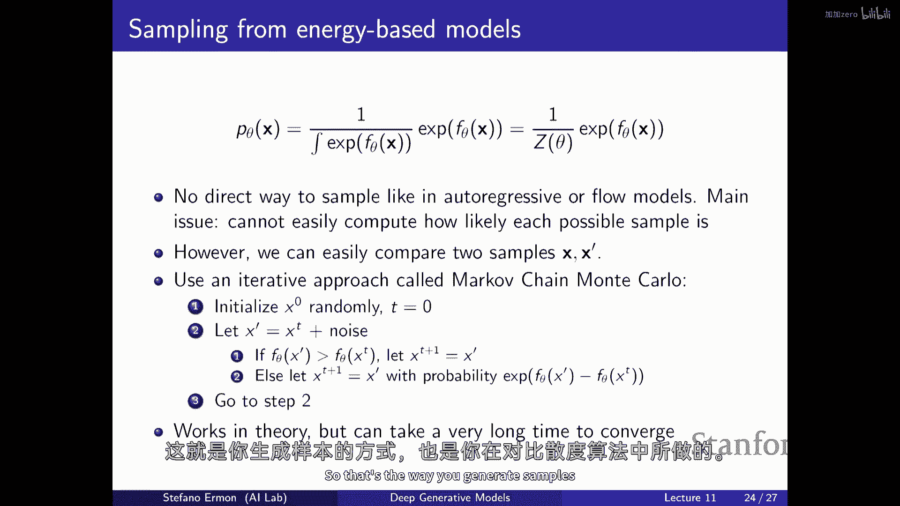

# 【深度生成模型 CS236 2023】斯坦福—中英字幕 - P11：p11 Stanford CS236： Deep Generative Models I 2023 I Lecture 11 - En - 加加zero - BV1NjH4eYE1v

所以今天的计划是讨论基于能量的模型，所以这将是另一种生成模型的家族，这与未来的模型密切相关，这就是我们接下来要讨论的，所以作为总结，我记住，这有点像高层次的视图，我认为它总结得很好，设计空间。

当你试图构建一个生成模型时，你有来自某些未知数据分布的数据，并且你有其独立同分布的样本，你总是需要定义一种模型家族，然后您需要定义一种损失函数，该函数基本上告诉您模型的好坏，与数据分布相比。

我们已经看到，没有似然度或KL散度是一种非常合理的方法，而且这是非常自然的，在没有回归模型的情况下使用，正则化流模型，以及到一定程度的变分编码器，因为它们给您提供了一种方法。

既可以精确地或近似地评估数据点的概率，因此，您可以像评分一样，有多好，有多接近θ的p分布，通过基本上计算KL散度到常数，这相当于模型分配给数据的似然度，这有点像基于压缩的类型的目标，正如我们所知。

最大似然训练非常好，它是一种非常原则性的模型训练方式，但你总是有一些限制，比如在，哦，如何定义这个概率分布的集合，他们无法选择任意的一种像神经网络这样的输入，它们可以处理，不同轴的数据点。

并将其映射到一个标量，它必须是一个有效的概率密度或概率质量函数，因此，为了做到这一点，您必须使用链规则将其分解为条件的乘积，或使用某种类型的可逆神经网络，来定义边际分布，或您必须处理近似。

并使用变分自编码器，然后，另一个，另一个极端的方法是试图在定义模型家族方面尽可能灵活，特别是，我们将只是，你知道，定义概率分布隐式地，而不是定义采样过程，特别是在，我们将，你 know。

定义概率分布隐式地，而不是定义采样过程，你需要支付的价格是你无法基本测量你知道的，这种相似性在这里，使用差异，你基本上需要制定一个训练目标，这不需要你评估数据点的概率，基本上，在这个点上。

你所拥有的唯一东西是来自数据的样本和来自模型的样本，因此，你需要制定一种两样本测试，一种比较样本相似度的可能性高速公路，真实样本与假样本的相似性，生成对抗网络（GANs）是一种实现这一目标的方法。

你有这个最小最大目标，你在尝试训练一个生成器，以产生难以与真实样本区分的样本，根据某个判别器来测量，该判别器在内部最大化问题中被训练，尽其所能区分真实与假样本，嗯，我们已经看到那，嗯，嗯，你知道。

在某些条件下，从原理上讲，如果你有一个极其强大的判别器，那么你可以，在某种程度上近似优化F散度，甚至时间距离的极大值，但在实践中，嗯，嗯，你知道，尽管确实你可以使用基本上任何架构。

你想要定义采样过程的训练，这种最小最大与这种最小最大目标非常棘手，嗯，因为我们没有概率，你需要最小最大优化，这是不稳定的，难以跟踪进度，难以知道你是否收敛，难以评估一个模型是否优于另一个。

因为你不能只看损失，并且有模态坍塌和各种在实际中出现的问题，当你试图训练一种对抗性类型的模型时，所以今天我们将看到另一种定义方式，就像一种模型家族，所以像一种不同的概率参数化方式。

这种模型被称为能量基模型，我们将看到，这将允许我们基本上消除我们对神经网络类型的所有限制，你可以使用这些能量基模型来定义一个有效的概率密度函数或概率质量函数，因此。

这种能量基模型的主要优点是极端的灵活性，并且到一定程度，它们将允许我们有一个相对稳定的训练过程，从意义上说，它仍然将基于最大似然，或者其他损失的变体，它们是完全类似的，它们利用了你有一个概率模型的事实。

而不仅仅是采样程序，嗯，这些模型通常工作得很好，它们给你一个相对高的样本质量，我们将看到它们与未来模型非常密切相关，实际上，它们就像现在最先进的模型一样，对于许多连续模态，如图像，视频和音频和其他的。

嗯，另一个优点是，嗯，你也可以以有趣的方式组合能量基模型，因此，我们将看到那是你可以做的另一件事，你知道，你可以取不同种类的生成模型，并将它们组合，嗯，因为那本质上是定义一个能量基模型的一种方式。

这允许你做一些有趣的事情，就像是的，实质上，结合不同的概念，结合不同种类的模型家族，如流模型和自回归模型，我们将看到这在某些设置中也是有益的，所以，高层次的动机是通常的，我们想要定义一个概率模型。

所以我们想要定义一个概率分布，因为这是一种基本的构建块，我们需要定义集合，这里的绿色集合，我们正在优化的，如果我们能做到这一点，然后我们可以将那个与损失函数结合，你就得到一个新的生成模型，在某种程度上。

你知道这只是一个函数，它是一个函数，它接受x作为输入，其中x可以是图像、句子或其他什么，并映射到一个标量，对吧，所以看起来，嗯，三很直接，但关键的是，你不能随意选择函数。

对于有效的概率密度函数或概率质量函数（在离散情况下），嗯，它们是一种特殊的函数，意味着它们需要满足某些约束，第一个是，它们必须非负，所以，给定任何输入x，你从这个函数得到的标量输出必须是一个负数。

这将说这是一项不是特别困难的约束来执行，更难的一项是他们必须被归一化，因为我们正在处理概率，必须存在，如果你看所有可能发生的事情，并且你加起来他们的概率，你将得到1，或者如果你正在处理连续随机变量。

如果你对概率密度函数在整个空间上进行积分，你应该得到，你应该得到1，所以再次，这基本上由于事实，本质上，概率是如果你通过，你知道所有可能发生的事情都必须相加到1，如，并且那是一种更难以执行的约束。

这是真正困难的约束来执行，这是因为基本上我们之所以必须执行这种奇怪的架构，如自回归模型或流模型，是因为我们必须执行这个归一化约束，并执行那个，这很困难，如果你取一个任意的神经网络，它不会执行，它会。

它不会满足那个约束，执行那个不是直接的，所以再次，所以如果你考虑第一个约束，它不是一个非常困难的，你知道，属性来满足，所以不难想出非常广泛的一组，或函数家族的函数，它们是给定任何输入时保证非负的。

实际上，如果你取一个任意函数，让我们说一个任意的神经网络，它非常容易改变一点，并确保输出是保证非负的，对吧，所以你可以做的一件事是，你可以取一个包含数据的任意神经网络，如果你只是平方它的输出。

你将得到一个新的神经网络g theta，它也是非常灵活的，因为它基本上与您开始的f theta非常相似，并且它保证给定任何输入都是负数，或者你知道你可以再次取指数，给定任意的神经网络f theta。

如果你只是基本上在末尾添加一个层，它将输出并传递，这将得到，将它通过这个指数非线性传递，然后您将得到一个新的神经网络，它被保证是非负的，或者你知道你可以取绝对值，或者我相信你可以烹饪出许多。

许多其他方式将神经网络转化为一个基本同样灵活的，在那里，您只需在最后添加一个新层，这被保证会使输出变为负数，所以那不是，那不是很难做，困难的部分是保证，基本上。

如果你将这个所有的可能的输入都通过这个输入，让我们假设，神经网络，并将你获得的输出相加，你将得到一个，或者如果你有一个连续的设置，其中输入是连续的，然后，这个神经网络的所有可能输入的积分必须是一个。

我想一种思考方式是，为什么这很重要，如果你正在构建一个概率模型，是，这基本上在强制执行那种像总概率质量是固定的那种，所以，如果你在思考概率模型的角色，作为被看作是，或者输出含义是，你知道。

计算x的p值就是说，模型对某一特定x分配的概率是多少，这可能是一张图片，也可能是一句话，你知道在语言模型应用中，基本上的事实是，总和，所有可能性的总和是，一种在很大程度上在强制这个事实。

即总体积是固定的，因此，如果你增加某个数据点的概率，你保证其他事物的概率必须下降，所以，类似于有一个蛋糕，你可以将其分成许多不同的方式，但如果你切出一块更大的，那么其他的必然会变小不可避免。

我们需要这种保证，所以当我们增加训练集中数据的概率，通过增加类似于蛋糕切片的类型，我们分配给样本的那一部分，我们喜欢，训练集中的那些，在生成模型中，自动降低了其他事物的概率，基本上我们不喜欢的那些。

你知道再次，强制执行非负性约束，基本上意味着，在这个类比中，每个切片的大小是非负的，这是很容易的，但强制执行这个约束，就像是体积是固定的，但你知道在这里的定义中它是，嗯，这是一个，但只要你能保持它固定。

基本上这就可以，因为总是可以除以常数，但强制执行基本上，无论你选择什么参数，在你的神经网络中，θ，你保证这大致就像，如果你遍历所有可能的输入，或者如果你对所有可能的输入进行求和。

或者你对所有可能的输入进行积分，然后看输出值，你会得到一个与θ无关的常数，与神经网络的参数无关，这很难，比如，你可以总是计算出什么是总和，总和就像神经网络分配的归一化概率的总和。

如果你遍历所有可能的输入，总会有一些数字，比如如果你遍历所有可能的输入，并评估神经网络的输出，你将它们相加，你会得到一个值，一般来说，这个值将取决于，θ将取决于你神经网络的参数，它不是一个。

它不是一个固定的东西，除非你选择gθ，你选择你的功能家族以一种非常特殊的方式，比如自回归模型或具有可逆架构的模型，基本上是由设计保证的，无论你选择什么参数，总质量或总体积基本上固定。

这里的类比在离散情况下是，你对所有可能的输入进行求和，在连续情况下，它是，嗯，你需要担心的是积分，所以这就是基本上需要强制执行的硬约束，嗯，嗯，某种方式，我们需要能够做到的是。

我们需要能够找到一个由θ参数化的函数家族，理想情况下，这个函数应该尽可能灵活，意味着，嗯，你知道你想要选择基本上一种任意的神经网络，或者是非常深的神经网络，或者是没有任何类型的限制于你可以选择的层。

很容易确保函数的非负性，但是确保体积固定在某个值非常困难，是的，我意思是我们需要一个满足它的函数，如果你要重新分配像静态点的一部分，所以是的，基本上这就是能量基于模型的想法，那就是只要你能计算。

基本上就可以，嗯，这个，你知道这个派片的总面积，你拥有的总圆周率，然后你就可以定义一个能量，你可以定义一个有效的概率模型，但基本上就是除以那个数字，这就是能量基于模型的基本思想，就像事实是。

基本上就像即使给定一个负函数g theta，你可以通过基本上将概率模型除以总体积来总是定义一个有效的概率模型，通过总面积，π的总体积除以积分，在所有可能输入的不归一化概率上，这就是一个有效的概率分布。

因为现在这个对象对于每个θ都已经归一化了，你可以计算这些归一化的概率，每个蛋糕切片的大小，同时，你也可以计算蛋糕的大小，然后你得到并除以这两个，然后你得到一些归一化的东西，因为它有点像比例，那就是。

基本上就是嗯，这个，嗯，概率密度函数或概率质量函数，这些函数由非必要的归一化对象定义，设计上，通过除以这个量z theta，它经常被称为分部函数，这个归一化常数，总体积。

我们需要除以的正常化概率的总和和正常量，以获取有效的概率模型，你可以看到，如果你愿意除以这个z theta，你可以得到一个有效的，你将得到一个对象，因为它是归一化的，如果你在这里积分左边，你将得到。

你知道，然后你替换定义，这就是归一化常数之上的数据，你基本上得到分母中可能发生的所有事物的积分，分母中可能发生的所有事物的积分，当你将它们相除时，你根据定义得到1，基本上，嗯，所以基本上。

只要你有一个非负函数g theta，你可以总是通过除以这个归一化常数来定义一个有效的正常化概率模型，由这个配分函数，"通过你对于定义良好的标量积分"，它就像对所有可能输入的积分。

或者对所有可能的输入的求和，在这些未归一化的概率的空间中，"仅仅通过使用g theta，你就可以得到"，"而且，就像你知道的那样，有一些例子。"，"你可能之前见过的一种方法是这样处理这个问题的。

那就是选择啊函数g(theta)"。"因此，这个分母"，"这个归一化常数"，"这个分部函数基本上像一般情况一样被解析地知道"，我们可能不知道你知道这个积分可能很难计算。

但如果我们限制自己只考虑相对简单的函数，G theta，我们可能能够用解析的形式计算出这个积分，仅仅对于，例如，如果我们选择g有一个非常简单的形式。

 which is just like the kind of relationship that you have in a in a gaussian pdf，所以g基本上就是一个平方指数。

并且你现在知道g有两个参数mu和sigma，并且这个非负函数是用来停止的，一，或者，减去x的平方再减去mu的平方，基本上被方差除以，Sigma的平方，这函数本身是负的，并不一定归一化。

但它是一个简单到足以实际计算积分的函数，像我们有一个对该函数的封闭形式解，并且总体体积只是根号2piSigma的平方，确实，如果你取g的这个表达式并除以总体体积，你会得到高斯pdf。

所以你可以想象那种奇怪的缩放因子，"你所面对的高斯概率密度函数是"，"基本上，你需要将总量分成的"，"如果你想得到一个规范化的对象"，或者你知道你可以选择。

"让我们选择g只是一个看起来像这样的指数函数"，"您有一个参数"，"λ和g对x的函数是e的负λx次方"，"仅由非负函数本身定义并不一定是归一化的"，"但你可以计算出封闭形式的体积"。

原来只是lambda加一，所以实际上你可以得到，如果你将这些两个数值相除，你会得到一个有效的pdf，这是对指数分布的一个，更一般的情况，存在一大类分布，它们的pdf基本上具有这种形式。

它与我们这里的类似，它也是某个点积的指数，在参数向量theta和足够统计量向量的函数之间，x的T并不重要，但结果是，你知道这里有一个体积，它就是再次，这个，未归一化的概率的积分。

然后如果你将这个数量除以，你会得到这些被称为指数家族的分布，它捕获了许多已知的常见分布，如正态、泊松、指数伯努利等，和许多更多，所以，你知道，所以，你知道，这种设置，你知道你从一个负函数开始。

你 somehow 限制自己于可以分析计算的简单函数形式，嗯，它们非常强大，因为你知道这些是非常有用的构建块，在许多应用中都有用处，但你可以看到，就像，你不能随意选择g，如果你选择了一个非常复杂的东西。

或者你插入一个神经网络，你可能无法分析地计算那个积分，嗯，可能没有那个封闭形式，嗯，对于那个分部函数，数据的总和归一化概率，这就是能量基模型进入的地方，比如，我们如何从这种设置，一切都很简单。

手工制作的，可以被分析地计算出封闭形式，转变为更灵活的设置，我们可以开始在这里插入更复杂的函数，如神经网络，实际上，这些简单的构建块，如高斯、指数等，现在，我们可以将这些简单的构建块，如高斯、指数等。

转化为可以开始插入更复杂函数的设置，如神经网络，基本上，而这些简单的构建块，如高斯、指数等，现在，我们可以将这些简单的构建块，如高斯、指数等，嗯，从某种程度上说，我们现在一直在做的这些方法仍然很有用。

比如使用自回归模型，甚至是变分自编码器，潜在变量模型，本质上就像是为构建简单且按设计归一化的函数设计的技巧，并且构建更复杂的概率模型，再次由构造决定，就像是保证被归一化的，所以，嗯，但我们可以看到。

从某种意义上，自回归模型本质上就是一种定义联合概率分布的方法，或者是经过设计规范化的联合概率密度函数，因为它是由被规范化的条件概率的乘积定义的，就像我们的高斯分布一样，或者是指数分布。

或者是我们知道如何计算这些积分的分布，这些归一化常数可以解析计算，所以如果你想象你有，嗯，两个这样的，保证被规范化的对象像，嗯，由theta和另一个在这里由theta'参数化的家族定义。

其中theta'可以由x函数定义，只要对于每个theta'，你在y上得到的分布被规范化，你通过将它们相乘得到的整个对象被保证是规范化的，所以如果你看，如果你试图，你知道。

如果你将两个基本上由构造被规范化的对象相乘，类似于对x的边缘分布和对y的条件分布，其中参数依赖于x，你将得到归一化的东西，这基本上是我们在自回归模型中做的事情，对，你定义联合分布为一个条件的乘积。

并且如果你看，如果你看对所有可能输入的积分的联合分布，你将得到基本上设计上归一化的东西，并且原因是如果类似于由构造，对y的分布是这样的，无论参数如何选择，都是归一化的。

并且参数的选择可能取决于x可以取的值，然后按照设计，有点像对y的积分将评价为一，无论你对x的选择如何，然后当你再次对x进行积分时，那个对象被归一化，所以你再次得到，嗯，一种情况。

其中全联合分布被保证是归一化的，并且可以积分为一，所以，我喜欢这里的对象，这基本上是一种思考y条件概率的方式，即y的概率是，让我们假设一个正态分布，其中参数取决于x的值，这将是这种情况之一，这里会出现。

如果你有一个自回归模型，其中，让我们假设p(x)是一个正态分布，P theta(x)是一个正态分布，所以这里，theta可以是均值和标准差，对于第二个变量或第二个变量组的分布，再次是一个正态分布，其中。

正态分布theta prime的参数允许依赖于x，例如，你计算均值和标准差作为前一个变量的函数，在排序中，然后你有一个对象，由设计保证将被归一化，所以你可以想种自动回归模型。

作为一种结合已归一化对象的方式，将简单的对象组合成一个更复杂的对象，又是一个由设计保证归一化的联合分布，这是一个归一化对象的乘积，然后如果你滑动它，就像这些积分一样，你可以将所有的积分都归结为一。

当你积分出条件时，它们全部归结为一，并且整个对象被保证是归一化的，甚至到一定程度，隐含变量模型可以被视为一种再次的方式，类似于组合，嗯，归一化对象并构建一个更复杂的一个，再次被保证是归一化的。

所以如果你有两个密度，p theta 和 p theta prime 它们是归一化的，然后，你将取一个凸的，它就像alpha p加上一减去alpha p'，对于alpha的任何选择，或者是在零和一之间。

你将得到另一个密度，它是被保证归一化的，因为如果你再次积分它，你将得到一些东西，嗯，第一个积分等于alpha，因为p theta是归一化的，第二个积分等于一减去alpha，因为θ'已经被归一化。

所以再次你得到一个归一化的对象，这就是变分外编码器中基本发生的情况，你在编码器中有这种混合行为，编码器中的条件在解码器中是简单的，像高斯这样的归一化对象，你是将它们混合起来，通过这样做。

你定义了一个边缘，它又是通过构造归一化的，和，所以你可以想到我们一直在做什么，类似于构建倒退模型或变量性较小的模型，就像尝试找到一种聪明的方式，将简单的归一化对象组合起来。

并构建由设计归一化的更复杂的对象，但这就像是在 terms of 仍然强制执行一些限制，就像最终对象的复杂性如何，你必须遵循这些规则来构建被保证归一化的对象，所以基于能量的模型做什么，他们试图打破这个。

嗯，这个约束，并且尝试超越，基本上就是保证归一化的概率密度函数或概率质量函数，对于基本上来说的嗯，因为归一化常数是可以解析计算的，所以我们将工作在一个设置中，这个归一化常数，这些分部函数，这个西格玛。

嗯是一个什么东西，我可能需要处理一下，要么我们就不能计算它，或者我们将近似它，但是，它不能做到，它不是一个已知会占用的，你知道，像对于任何选择theta的值，一个值为一的选择是。

它将以某种复杂的方式随着theta的变化而变化，我们只需要基本上处理它，因此，我们将特别关注这种形式的模型，其中，我们拥有一个由x定义的概率密度函数，它由theta参数化，并定义为f theta的指数。

因为我们需要确保函数是非负的，然后这就是种像归一化概率的东西，f theta 的指数，然后我们通过除以分部函数来获取一个实际上是归一化的对象，所以你可以从一个任意的基本上的神经网络f theta开始。

你取指数，你得到一个负函数，然后通过除以这个分部函数，你将定义一个有效的概率密度函数，由这个归一化常数，这就是积分，基本上，这个未归一化的概率，所以，这就是基本上的全部，嗯，这是能量基模型的定义，嗯。

因为它非常灵活，因为你可以选择，嗯，本质上是一个任意函数f theta，并且这定义了一个有效的概率密度函数，我们特别选择了指数函数而不是，让我们假设，平方，嗯，F theta，嗯，由于几个原因。

第一个原因是它允许我们非常漂亮地、很容易地捕获，有点像模型对不同轴分配概率的大变化，所以如果你在考虑建模图像甚至文本，在某种程度上，你可能期待模型分配给不同轴的概率有大幅度的变化，让我们假设。

与形成良好的图像相比，纯噪声，因此，它使模型更容易捕获这种像大变化概率一样的变化，如果你在这里取指数，因为小变化f theta，这是神经网络所做的，将导致模型分配的实际概率有大幅度的变化，你也可以用。

你知道，在这里取平方，但 then 那将需要更大的变化，有点像神经网络的输出，所以它将不会那么平滑，能量是什么，按定义是，是的，这将在下一个项目点中出现，是的，是的，这不是softmax吗。

softmax是这种例子，是的，让我们假设那是一个，那是一个好点，是的，像soft max，是处理这个问题的一种方式，并基本上映射神经网络的输出，这可能不是一个有效的概率，一个有效的类别分布。

让我们假设试图使用的输出是那些，因为你提到了隐变量 earlier，但我们的vae我们使用softmax来计算重构似然，那么这是如何不同的，这为什么不是能量，能量模型是，它是一个非常广泛的术语。

意味着你知道，甚至你可以认为自回归模型是一种，类型的能量基于模型，其中通过构造，类似于数据总是被保证为一定的，所以这就像一种非常一般的类型的模型，我们在这里将能够处理任意的神经网络。

假设我有数据并从中获得一个有效的概率密度函数，新的概念并非相互排斥，它更一般，因为它不需要像z数据不需要精确为一，它也不需要像在正态情况下，已知的，嗯，例如，数据可能不是已知的，例如，你可能无法知道。

那该积分的积分等于根号2πσ的平方，对，嗯，这不仅仅发生在fθ非常简单的情况下，例如，如果fθ是x减去μ的平方，然后您得到正态分布，然后您知道如何计算这个积分分析地，但在一般情况下，您不。

您不需要在潜在变量中，您在之前的幻灯片中显示的公式，所以这种基本上就显示了混合正态先验或什么的概率，是的，它基本上就像如果您从更抽象的角度考虑这个问题，就是说，我怎么，我怎么设计出非负的函数。

并且它们被保证有一些固定的积分，比如你怎么做对吧，一种方法是，基本上就像，定义一套规则，几乎像代数，从具有您想要属性的对象开始，您可以将它们组合来构建更复杂的对象，再次具有您想要属性的对象。

一种方法是我在这里显示的，是像您可以取这些对象的线性组合，像凸组合的这些对象，这是一种定义新对象的方式，它仍然具有您想要属性的简单对象，但在这个函数中，哪个部分代表潜在变量，在潜在变量中，基本上就是。

嗯阿尔法，他们说，像阿尔法是，阿尔法是这些小部分的概率，基本上这个将对应于潜在变量模型，有一个单一的潜在变量，它只能取两个不同的值，它取值，以概率α，第二个值，一减去阿尔法的概率和其他类似的值。

给你带来那种行为，谢谢，但是，你关于softmax所说的，实际上是另一种基于能量的模型的好例子，就像，嗯，softmax是一种定义方式的方法，嗯，从本质上来说，如果你考虑softmax层。

这就是它具有的这种结构吗，而且实际上这是一种在集合上的概率分布定义方式，或者是分类型的，基本上就是一个随机变量，这在函数f theta的术语下表示的预测标签，这就是你神经网络的原始输出。

这可能并不一定被归一化，所以softmax就是这种东西，但是softmax是这种情况的一个例子，这个归一化常数可以在分析上计算，因为你只有假设的k个不同的分类。

所以softmax将涉及到softmax分母中，你有对k个可能的输出进行求和的情况，所以在这种情况下，这个嗯，这个归一化常数实际上可以被精确计算，我们将对x这个积分感兴趣，嗯。

这是因为x是很难精确计算的，因为x是高维的，所以如果你考虑一幅图片的分布，嗯，x知道可以取上成千上万个不同的值，所以如果你必须对所有可能的图像进行积分，啊，这将是一种非常昂贵的计算类型，实际上无法计算。

所以这有点像，软最大风格计算和我们在这里做的之间的差异，酷和，嗯，所以是的，我们为什么在 uh 前面使用指数，因为我们想要捕捉到大量的变化，另一个原因是，正如我们看到的，像高斯和指数这样许多常见的分布。

以及指数家族的所有其他分布，它们有这种种形式的函数，它们有这种像指数一样的味道，是某个简单函数在指数函数的论据中的，这些分布为什么如此常见，嗯，是因为它们实际上在相当一般的假设下产生，所以，如果你。

如果你了解最大熵模型假设，嗯，基本上就是这个想法，试图来构建一个分布，在某种程度上适合数据，但最小化你关于模型所做的所有其他假设，那么，你会发现这种建模问题的解决方案，具有指数家族的形式。

所以这就是他们被称为能量基模型的原因，因为这在物理学中也出现得很多，考虑一下第二定律热力学，那么在这种情况下，啊，-f(x)被称为能量，并且有一个负号，因为如果你考虑物理学配置，你可以想象。

x是系统可以处于的状态，这些状态具有更低的能量，所以f(theta)应该更大，这就是为什么有负号，但那就是他们被称为能量基模型如此强大的原因，因为它们受到统计物理学的启发，本质上，所以，酷，所以。

这就是能量基模型的一种基本范式，你从一个任意的，本质上任意的神经网络f theta开始，你取一个指数来使负数变为正数，然后，你将其除以这个归一化常数，这一分区函数，就是这的积分，一个归一化的概率。

对于任何theta的选择，这个都是成立的，嗯，或者它定义了一个有效的概率模型，所以它被保证是负数的，被保证会相加到1，所以从灵活性的角度来看，这个基本上就是最好的了，本质上，你对θ的选择没有限制。

这意味着你可以插入你想要建模数据的任何架构，嗯，概念上，有如常的菜单，通常有一些费用需要支付，如果你，如果你想要灵活性，你基本上对模型的结构做出了较少的假设，因此，计算上有费用需要支付，并且有一个大。

嗯，基于能量的模型的负面方面是采样将非常困难，即使你可以拟合模型，如果你想从它中生成样本，这样做将非常困难，所以从基于能量的模型中生成新样本将非常慢，原因是基本上评估概率，嗯也是困难的。

因为你如果想要评估一个数据点的概率，你基本上知道获取未归一化的部分是容易的，这是对f theta的指数，你只需要通过你的神经网络来拟合它，你会得到一个数字，给你归一化的概率，但是要实际评估一个概率。

你需要将这个归一化常数除以，这在一般上是非常昂贵的计算，嗯，这更像是一些提示，为什么采样也难，如果你甚至不知道如何高效地评估数据点的概率，这将非常困难来确定如何生成，你知道如何使用。

这些就像是正确的概率，甚至评估一个数据点的概率都很难，为什么对于这个基于能量的模型，采样很难，因为我们已经因为我们可以学习一种形式，如果我们能学习，嗯，因为我们如果已经能学习到一种形式的p(x)，是的。

所以采样很难像，即使有人给你正弦函数，它有正确的，这里是模型，嗯，基本上问题在于采样困难，因为首先没有顺序像，如果你考虑自回归模型，没有顺序，所以唯一能做的是，你知道，正如我们将看到。

将有一种本地类型的程序，在那里你可以尝试基本上的马可夫链蒙特卡罗，种方法来尝试去寻找可能基本上在模型下的主轴，但甚至评估似然度也不是可能的，这是因为那需要归一化常数，所以总的来说。

没有效率的方法可以从这种类型的盒子中生成样本，所以输入x没有顺序，是的，所以你可以想象就像是的，没有顺序，就像x只是一个向量，或者是你的数据，然后你只是把它放入神经网络，然后你会得到一个数字。

它是有点像归一化的概率，但这不告诉你数据点的可能性有多大，直到你知道所有其他的可能性有多大，所以你需要知道归一化常数，知道分部函数来知道，甚至只是知道数据点的可能性有多大，所以你可以想象，即使要找出。

如果你要从那样的分布中采样，它真的很，真的很困难，因为它不能，即使你想要，甚至只是反转cdf，需要你能够评估概率的事情，所以这就是一个非常棘手的事情，是的，所以我猜玉米们真的不喜欢地板，对，嗯，是的。

正如我们将看到，我的意思是，嗯，你知道，它是嗯，很难但可能，实际上，如果你考虑扩散模型实际上是在做这个，所以它不会以直接的方式，正如你知道的，只是采样一堆条件，像在自回归模型中。

我们将不得不做更多的工作来从模型中采样，评估概率也将需要一些近似，或者是一些其他更复杂的技术，但是，这种能够做到的想法本质上被用于能量基模型，并能够使用任何任意的架构来模型数据。

如果你考虑到扩散模型的成功，如果你认为，实际上，这种想法已经支付了巨大的回报，我认为这主要取决于事实，我们被允许使用，非常复杂的，嗯，神经网络来模型数据，嗯，是的。

这里也没有在您知道意义的意义上进行特征学习，列出这种基本的形式，没有隐含变量，但我猜您可以添加，所以这不是，在这种情况下，这并不是一个大问题，并且这种基本的问题，所有这些之所以如此困难，嗯。

所有这些任务都是如此困难，这是维度诅咒吗，基本上在这个情况下意味着，嗯，因为我们想要选择θ的灵活性很大，我们不能解析地计算这个积分，不像高斯情况，你不能在封闭形式中计算那个，如果你基本上想要粗略地。

强迫它，或者使用数值方法来尝试近似那个积分，你支付的成本基本上会按指数级增长，在你试图建模的变量数量上，基本上如果你考虑，离散情况，那里像是你需要在的轴的数量，增长，在维度数量上组合式地按指数级增长。

而且在连续世界中也发生了同样的事情，如果你要离散化，并且有像小l个单位体积，你用来覆盖整个空间的，你需要的体积小单位数量，在处理的维度数量增加时，这个数量会指数级增长，所以。

这基本上就是这种类型的能量模型计算的关键挑战，分母这部分将会很难，所以，一方面我们将获得灵活性，另一方面，我们面临的一个大计算瓶颈是处理配分函数，基本上，而且好消息是，有许多任务不需要知道分部函数，嗯。

例如，嗯，如果你只需要比较，你有两个数据点，X和x'，你所需要知道的只是哪一个更可能，所以你只是想在两个数据点之间做相对比较，所以你不能必然地，尽管，你可能无法评估x的概率和x'的概率，在这种模型下。

因为那需要你知道配分函数，如果你考虑如果取两个概率的比率会发生什么，那并不影响归一化常数，如果你取比值，它们 both both 分子和分母，它们都是由同一个常数归一化的，所以如果你考虑π的切片。

那基本上就消失了，如果你只是想看相对大小，你可以很容易地做到，而不需要知道π的实际大小，嗯，这意味着我们可以检查给定的两个数据点，我们可以很容易地检查哪一个更可能，尽管我们不能知道它有多可能。

我们可以检查哪一个在两个之间更可能，而且这将在我们设计采样程序时非常有用，嗯，你知道，你可以仍然使用它来做像异常检测这样的事情，去噪，当我们谈论未来的模型时，你会看到。

也 kind of like 依赖于这个，而且实际上，人们已经 kind of like 使用基于能量的模型来 uh，很长时间，甚至对于各种不同的，嗯，基本的 kind of like 区分性。

类似于任务，类似于如果你思考一下，物体识别，如果你有一种与标签y相关的能量函数，该函数关联图像x，然后嗯，并且你试图找出最可能的标签，只要你可以比较它们之间的标签，那么你基本上可以解决物体识别。

并且你知道，这种基于能量的模型已经被用于做序列标注，进行图像恢复，只要应用可以喜欢，需要相对比较，不需要分区函数，例如，我们可以考虑做去噪的问题，这有点像一种旧式的去噪方法。

我们拥有一个涉及两组变量的概率模型，我们有一个未知的真实图像y，然后我们有一个被腐蚀的图像x e，我们可以观察到，目标是推断出清洁的图像，给定受损的图像，一种方法是有一个联合概率分布。

这将是一个基于能量的模型，所以我们说观察清洁图像的概率，Y和相应的噪声图像x有这种形式的函数，其中包含归一化常数，然后它是指数的一些相对简单的函数，这是能量或负能量在这种情况下，这函数基本上在说一些像。

i 损坏的像素与i 清洁的像素之间存在一些关系，例如，他们认为它们应该相当相似，所以每当你插入x，我和y i 配置，其中x i 与y i 相似，我应该更有可能，因为我们预期损坏的像素。

更有可能类似于清洁的像素，而不是与它非常不同，然后也许你有一种像先验的东西，其中图像是说，你知道什么样的，什么样的选择，为什么先验概率更大，也许你有一种先验，它在说嗯，相邻的像素倾向于具有相似的值。

然后您对这些相互作用项进行求和，每个像素一个，也许您有一些空间局部相互作用项，像素之间，在图像中彼此接近，这定义了一个能量函数，如果您想要进行去噪，如果您想要计算给定x，您想要找出对应的y。

你做的事情是尝试找到给定x的最大化y的概率p的y，即使p的概率依赖于归一化常数，U基本上就是，你可以看到归一化常数并不重要，所以只要你想要找到最可能的解决方案，嗯，实际的概率是什么。

所以z分之一就成为一个缩放因子，它实际上不会影响优化问题的解决方案，嗯，为什么在真实图像中维度比较大，所以解决优化问题会变得非常困难，因为在你还在优化一个非常大的空间，但是至少它不依赖于像样的。

只要你在最大化实际值，你知道，基本上所有的y都会被同一个z除，所以再次，只要你能，你将能够比较两个y，这就是你需要的全部，如果你试图让x出现在能量中，但是再次，轴我们不必对之求和，是的，确实确实。

所以它真的全部关于，有很多任务，基本上，你关心的是进行比较，到何种程度，任务仅涉及比较，那么你实际上并不需要知道分部函数，你可能仍然需要没有分部函数，如果你想训练模型，这有点像，接下来会出现什么。

但你至少可以做比较，而不需要了解分部函数，是的，对于比较情况，我们最终会，我们可以用z值像这样，如何可以观察到如果我们对能量函数求导，然后它也消失，是的，所以我有一些影响，是的，所以这将出现在。

这是前面一滑的最后一页，这是另一个，这是另一个，一个 nice 之处是，导数也不依赖于对对数概率的导数，不依赖于归一化常数，所以我们将能够使用它来定义基本上采样方案，酷，嗯，现在另一个事情你可以做是。

你可以结合各种模型，让我们说，你有，嗯，一堆概率模型，例如，它可以是不同的家庭，例如，它可以是像素，Cnn 和流动模型，什么不，嗯，你可以想象每个一个都是专家，它将单独告诉你给定 x 有多可能根据每个。

每个这些三个模型，你可以想象如果你试图结合这个专家，例如，你可以说如果所有这些专家都在独立做出判断，它可能 make sense 通过取积来组合他们，例如，你可以说如果所有这些专家都在独立做出判断。

它可能 make sense 通过取积来组合他们，这些对象的积，虽然它们自己已经被归一化，但不会被归一化，但我们可以定义一个归一化的对象，通过像样地除以这个归一化常数来定义它，并直觉上。

这种集成方式行为像终结操作符，只要其中一个模型分配零概率，然后产品就评估为零，因此，这种集成模型也会分配零概率，如果你考虑混合模型。

你会说alpha p theta one加上one减去alpha p theta two，这种行为更像一个，或者你看到的是，只要其中一个模型分配一些概率，然后集成模型也会分配一些概率。

产品的行为更像一个终结，嗯，但它更难处理，因为你必须，你知道，考虑分部函数，嗯，但这允许你结合基于能量的模型，以有趣的方式结合模型，例如，你可以有一个模型，像产生年轻人，然后你有一个模型产生女性。

然后你可以通过将它们相乘来结合它们，然后您得到一个模型，将大部分概率质量放在这两个群体的交集上，你可以得到这样的行为，所以你可以像组合概念一样组合它们，只要不同的模型通过集成学习到不同的东西。

这样你就可以以有趣的方式结合它们，另一个例子，是的，嗯，肉类产品和混合，如果你使用混合，这些看起来会不同，所以，如果你把它想成产品，嗯，只要其中一个基本上分配零概率，然后整个产品就评估为零，因此。

集成模型，专家产品的乘积也会分配零概率，如果你考虑混合，即使其中一个分配零概率，只要其他模型认为这个东西可能，那个东西仍然有一些概率，所以它更像一个，或者在意义上，只要它是软的，或者因为它是，你知道。

是的，确切地，它更像是一个平均值，是的，我们从这个产品的如何组装，你怎么不喜欢，你怎么忽视那个z部分，是的，我们如何采样那个会出来的，有方法可以做到，它就很贵，所以并非不可能。

它就像在自回归模型中非常快，在基于能量的模型中，你需要增加更多的计算资源，基本上在推理时，当你想要生成一个样本时，这就像是您支付的价格，是的，专家产品的结果与基于能量的模型如形式的关系如何，是的。

所以你可以看到，如果你有单个的概率密度函数或概率质量函数，如果你将它们相乘，你将得到另一个函数，它是非负的，但不是必然归一化的，所以为了归一化它，你必须将这个分部函数除以，从那个角度来看，它是一个。

它是一个基于能量的模型，所以，你可以认为专家产品的能量被定义为，每个单独模型的对数似然和的和，因为你可以写p theta one作为x log p theta one。

另一个是x log p theta two，然后，它就有点像对日志和的指数，问题是对数似然和的和，它是一个能量，而且设计上并不保证会被规范化，所以您必须然后使用全局类型的分部函数来重新规范化所有事物。

酷嗯，另一个例子是rbm，受限的巴拉机器，嗯，这实际上是一个基于能量的模型，具有隐变量，而这个是一个离散的，嗯，概率概率模型，当可见变量和潜在变量都是二进制的时，假设它们是二进制的。

并且潜在变量也是二进制的，所以你有n个二进制变量x和m个潜在变量z，这里的所有变量都是二进制的，并且，例如，x可以代表像素值和疾病等通常情况，可以说是潜在的特征。

而z和x之间的联合分布是一个基于能量的模型，"而且这是一个基于能量的相当简单的模型"，"在通常意义上，存在归一化常数"，"这是有寻常的指数增长"，"然后，能量就像是一个二次形式。"，"你的能量来自哪里。

你就有一个W矩阵"，"你基本上有一个偏差向量b，还有一个偏差向量是c"，"并且你映射出x变量所具有的值"，"并且，z变量只需要取这个就变为标量。"，嗯，这种表达方式，这就像轴上的一堆线性项。

疾病的一堆线性项，然后，还有这个x眼睛和zs的交叉积，这些被这个权值所权重，但它是以这种方式的，这个权重矩阵w和uh，它是受限制的，它被称为受限制的巴尔的摩机器，因为基本上在这个表达式中。

没有可见单位或隐藏单位之间的一种联系，所以基本上这里并没有x_i*x_j这种术语，x变量和z变量之间存在相互作用，但是x变量之间或z变量之间本身没有相互作用，不是很重要，但是嗯，关键的是。

这实际上是一个非常早期的，从历史原因来看，它是非常重要的，它是第一个，嗯，实际上的深度生成模型，嗯，那实际上有点起作用，嗯，他们通过使用图像数据训练了这些模型，通过堆叠多个rbms，所以对于rbm。

它基本上是可见和隐藏之间的联合分布，然后如果你堆叠很多，所以底部有可见的，然后这里有一个rbm，然后，你在第一个rbm的隐藏单元之间构建一个rbm，并在第二个rbm的一些其他隐藏单元之间构建一个rbm。

就这样下去，你得到一个深度玻尔兹曼机，有点像，想法是，你有底部的像素，然后，你有一个层次，层次越高，抽象特征就越多，嗯，实际上，早期在深度学习的非常早期阶段。

人们无法像甚至甚至那样很好地训练深度神经网络，但在监督学习设置中，事情并没有完全按计划进行，而且他们唯一能够得到好结果的方法是实际上预训练神经网络，作为生成模型，所以他们会选择一种架构，类似于这种。

这种深度博斯马机器，他们会在不监督的方式下训练模型，作为RBM，所以，就像基于能量的模型一样，他们会训练这些矩阵的权重，嗯，通过后面我们将讨论的技术，然后，他们将使用这个作为初始化他们的监督学习算法。

我基本上是第一个使深度学习工作的东西，它是最初唯一工作的东西，他们发现了其他使事情工作的方法，嗯，是的，实际上，这对于让人们接受训练大型神经网络的想法是非常重要的，嗯，你可以在这里看到一些样本。

这种模型再次，这是嗯，很久以前，二零零九年，但人们通过训练这种深度博斯马机器，能够生成一些看起来相当合理的样本，所以你可以看到，这种基本上是，这里的基本问题在于归一化常数是分部函数。

仅仅通过在RBM设置中查看一个例子，我们可以看到，确实计算体积是困难的，如果你考虑甚至只是一个简单的单层，RBM，其中你有这个，这些x变量，这些z变量，你知道你有这种基于能量的模型，计算。

这个能量函数的指数是非常容易的，只有一些基本的点积，但是，归一化常数是非常昂贵的，对吧，归一化常数将取决于w b和c，所以，θ，模型中的参数，在这种情况下是，这些偏置b和c以及矩阵w，但是。

计算归一化常数需要你遍历所有可能的配置，所有可能的x变量的赋值，所有可能的z变量的赋值，并求和所有这些未归一化的概率，问题是，这里有大约2^n项在这个和式中，问题在于，这个和式的项数大约是2^n。

这个和的二项式项数为m，所以你可以看到，即使n和m的值很小，计算，并且归一化常数非常昂贵，是否可能继续运行并近似地近似，是的，这就是我们要做的，基本上它就像，它是一个定义明确的函数，只是如果你想要计算。

它没有封闭形式，与高斯情况不同，对于这个表达式，没有封闭形式的解，而且暴力枚举需要指数时间，所以我们基本上不得不做一些种近似，特别是，事实是，分部函数如此难以评估，这意味着基于似然的训练几乎不可能。

因为仅仅要评估数据点在当前参数选择下的概率，需要你了解那个表达式的分母，而且这不通常被知道，而且你不能计算它，所以这就是嗯，嗯，有点像问题，嗯，优化未归一化的概率，这就是指数超级容易。

但你必须考虑到基本上在学习过程中，你需要找出如果你稍微改变参数，那如何影响分母，在这个表达式中，哪一项容易，但是，你也必须考虑到，参数改变如何影响总体积，这对模型分配给所有其他事物的概率有何影响。

可能发生的所有事情，而且这很棘手，因为我们甚至无法计算这个数量，这将很难弄清楚，那个数量如何改变，如果我们对任何参数进行了微小的改变，如果我要改变，让我们假设b稍微改变。

我知道如何评估这个表达式稍微改变的影响，但我不知道如何评估这个分部函数稍微改变的影响，这就像是什么使学习变得困难，你能扩大前面的幻灯片吗，当你展示了像样本一样，从rbf生成的样本，Rbm。

我是如何不理解的，就像太阳一样喜欢，他们如何能够生成那个，所以我的意思是你输入观察像素，然后你知道与堆叠，你可以像学习潜在变量一样，是的，但是像，我喜欢，他们如何生成，所以是的，那么如何生成。

他们如何学习，我们还没有谈论过它，那将会在下一个话题中提到，我们如何做学习，和如何从模型中采样，嗯是的，问题是即使学习学习也很难，因为它需要评估似然度，需要分部函数，因为你没有采样，正如我们将看到。

这也是一种困难，但是存在一些近似方法可以做，这就是他们做的基本情况，和像他们一样，直觉是，你知道，如果你想做最大似然学习，你有一个看起来像这样的表达式，你想要最大化，你有一个训练数据点。

你想要根据模型评估其概率，然后你想要最大化这个表达式作为函数的函数θ，和数据点的概率，像往常一样，概率是像归一化概率除以分部函数，模型分配给总的归一化概率，模型分配给其他所有东西的归一化概率。

所以如果你想让这个比率尽可能大，你需要能够做两件事，你需要增加分子并减少分母，这听起来有道理，直觉是，你想要找出如何改变你的参数，以便你使不归一化概率的训练数据增加，同时。

你需要确保你没有过度增加其他所有东西的概率，真正重要的是你关心的训练点的相对概率，与可能发生的所有其他事情相比，这是你在分母中得到的，这是对其他可能发生的所有事情的总归一化概率，所以当您训练时。

您需要要做的就是，你不能仅仅优化分子，因为如果你仅仅增加分子，就像是，你仅仅增加数据的，你为特定数据点分配的派片的部分，你可能甚至增加了总派的大小更多，因此相对概率甚至没有增加。

因此你 kind of like 需要能够，嗯，考虑到参数 theta 的改变对训练数据的影响不仅影响训练数据，但是，在所有其他可能的点上，这个样本已经被模型采样，所以你需要以某种方式增加概率。

在向下推的同时，训练点的归一化概率，有点像所有其他所有其他事物的概率，所以这就有点像你 here 的直觉，如果这是 f theta，你有正确的答案和一些错误的答案，仅仅向上推是不够的。

有点像正确的答案的归一化概率，因为所有其他的东西也可能上升，所以相对概率实际上并没有上升，所以你需要能够提高正确答案的概率，同时降低基本上错误答案的所有其他概率，那就是嗯，基本上这个想法。

而不是精确地评估分部函数，我们将使用某种形式的蒙特卡洛估计，所以不是评估实际的总和，其他所有东西的归一化概率，我们就只是打算采样一些其他的东西，然后我们打算尝试将训练点与模型中的其他样本进行比较。

我们关心的是这些样本与模型中的其他样本相比如何，这些是错误的答案，这些是其他负样本，我们有一个正样本，这就是我们在训练集中喜欢的东西，它将是一些负样本，是我们要采样的，然后我们打算将它们进行对比。

"我们将尝试增加积极结果的可能性"，"并降低其他所有事情的可能性"，"那就是基本上的"，"已经被使用的对比性差异算法，用于训练那个rbm"，我们之前的dbm，"本质上。

你所做的是通过相对简单的算法将这种直觉转化为具体形式。"，"你做的就是采样"，嗯，"从模型中"，"所以你通过从模型中采样来生成类似于负面的例子"，然后，你对f theta的日志差的梯度进行计算，基本上。

这就是模型的能量或负能量，在训练数据中，我们有theta在负样本上的值，这正是做这种事：推动正确的答案，同时推动错误的答案，或者就像错误的答案被定义为来自模型的样本，我们知道我们错了，是的。

所以样本并不一定是错误的，它只是像来自模型的其他东西，我们考虑它是一种，它是一种代表，来自模型其他可能发生的样本的代表，我们想要真数据点的概率上升，与从模型中可能采样的其他典型场景相比。

这实际上是有原则的，我们将看到，这实际上给你一个无偏估计，你想要优化的真实梯度，你，你想要优化的，样本你可能得到，也可能是来自训练集的，但总的来说，估计，就像，是的，预期的预期，是的，是的，是的，是的。

是否有，是的，我喜欢，如何从该模型中采样，像这样，是的，我们必须讨论如何采样，但如果你能从模型中采样，那么我声称这种图表将给你正确的答案，就像这种使训练数据比模型典型样本更可能的想法，实际上就是你想要。

所以到你确实能够生成这些样本的程度，我们目前还不知道如何做，但如果你能，那么这个就给你训练模型的一种方式，使它更好地适应数据集，是的，当你绘制样本时，你不，你不这样做，你知道。

如果样本内容不在训练数据中，你只需要所有这些东西，你只需要画一个样本，是的，无论它是否在训练集中，是的，这不重要，是的，所以为什么这个算法工作得好，如果你想想，你想要做的是如果你看看这个表达式的日志。

这仅仅是你获得这两个术语的日志似然度，我们将得到f theta，这就是，你知道你正在使用的神经网络来参数化你的能量，然后你有这个依赖于的，分部函数，这依赖于分部函数依赖于你优化的参数以及。

我们想要这个量关于theta的梯度，就像以前我们想要增加f theta在训练集中，同时减少，有点像，我们通过改变数据得到归一化概率质量的总和，所以实际上我们想要这个差异的梯度，这是一个步梯，梯度的差异。

f theta的梯度是容易计算的，那就是你的神经网络，我们知道如何，如何优化这个量，我们知道如何调整参数，以便我们在训练数据点上推动神经网络的输出，我们接触到的，更困难的是找出。

theta如何影响归一化概率质量的总和，我们知道，z theta的日志导数的导数就像，对日志函数的论据的导数除以z theta，只是一个非常log式的表达式。

现在我们可以在那里将z theta替换为我们有的表达式，因为知道梯度是线性的，我们可以将梯度推入这个和，这基本上就是相同的东西，我们知道z theta只是归一化概率的积分，然后我们可以将梯度推入。

我们得到这里这个量，现在我们可以，嗯，我们知道如何计算这个梯度，嗯使用链规则和嗯，这评估为那个，这只是f theta的梯度再次，这是我们知道如何计算的，然后它是由这个指数和分部函数缩放的。

如果我们将分部函数推入，你会认出这仅仅是模型分配给可能数据点的概率，X，因此，日志似然度的真实梯度，这是我们想要优化和取走的，以θ为参数进行梯度上升的基本上是这个差异。

它基本上是在数据点上能量梯度的评估，减去模型分布相对于的预期梯度，这 kind of like 有意义，我们需要找出改变数据一点如何影响，我们分配给关心数据点的真实数据点的归一化概率。

然后我们也需要理解，如何改变θ影响其他可能发生的所有事情，我们需要等待模型分配给当前θ的所有可能的X，对于当前的θ选择，现在你看到为什么对比性差异工作，对比性差异算法只是蒙特卡罗，对那个期望的近似。

所以我们用单个样本来近似模型分布的期望，这是一个无偏估计者的真实梯度，所以真实梯度是，基本上，这个在真实数据点和典型样本上梯度的差异，你通过从模型中采样得到的，只要这个，嗯。

你可以跟随这个方向并运行你的梯度上升算法，你正在增加数据的相对概率，基本上因为它 kind of like 是相对的，数据上升比分部函数增长的更多，然后分部函数如何增长，基本上，这就是 uh。

和 kind of like 是，对比性差异算法的关键思想，我们仍然需要了解的主要事情是如何获取样本，我们仍然不知道如何从这些模型中采样，和想法问题是，嗯，我们没有直接采样的方法，像自回归模型一样。

或者我们可以简单地通过变量一个接一个地设置它们，你知道，通过从条件分布中采样，但我们不能评估每个数据点的概率，因为那需要知道分部函数，但我们可以做的是，我们可以比较两个数据点，因为那需要知道分部函数。

或者我们可以比较两个可能的，嗯，样本x和x'，基本思想是我们可以做一些类似于局部搜索或局部优化的事情，我们可以从一个可能不是好的样本开始，仅仅通过随机初始化x为零的方式，然后尝试局部。

使用这个样本产生一些扰动，试图使它更有可能，基本上根据模型，因为我们可以做比较，你知道，检查样本或其扰动哪个更可能是 tractable 的，将会是 tractable 的，所以这就是一种特定的算法。

嗯，被称为马尔科夫链蒙特卡罗方法，实际上它相当简单，你做的又是，你以某种方式初始化程序，然后在每一步，但你基本上提出一个对你的样本的改变，而且这可能只需要在你现有的东西上添加一些噪音，然后。

如果通过扰动你的样本得到的结果比开始时的概率更高，从哪我们可以，我们可以做这种比较，因为我们不需要分部函数来比较x'的概率与，我们现在有的东西与xt，然后我们将我们的样本更新为这个，嗯，新的候选者x'。

嗯，然后我们需要干的事情是，我们还需要，嗯，在过程中添加一些嗯噪音，基本上如果你把这个看作是一个优化问题，我们总是在向上爬的步骤，如果概率上升，我们总是采取那个步骤，但是如果嗯，X prime。

这个提议的变换，我们添加的噪声样本实际上比我们从开始的地方得到的样本有更低的概率，我们偶尔会采取这种向下的移动，以这个量度的概率成比例，所以基本上成比例于有多糟糕。

我们提出的新样本与我们从开始的地方相比，然后您就一直这样做，结果在理论上，至少，如果您重复此程序的步骤足够多，您最终将得到来自真实分布的样本，你为什么需要概率性地喜欢除了噪音之外的任何一种。

而不是简单地忽略，是的，是的，这是一个很好的问题，我们为什么偶尔需要接受这种，就像从开始的样本中更差的样本一样，原因是我们不仅想要优化，如果你只是做第一步，那么你可能会，嗯，做一些局部搜索程序。

在那里你会一直围绕，直到找到局部最优，然后你就停在那里，这不是我们想要的，因为我们想要采样，所以我们想要某种方式能够探索空间，因此我们需要偶尔接受下降的移动，它们并不是太坏，这基本上允许算法像。

探索它可能生成的所有样本空间，因为也许你被困在一个不是很好的局部最优，如果你移动得更远，那里可能会有非常高的概率的区域，所以你每次丢弃时，你也会得到相同的样本，是的，是的。

所以我们为什么只使用概率来向上移动，我们总是，我们总是去有更高生活编码的样本，你可以定义其他，这不是做它的唯一方式，比如你可以定义这个的变种，其中你不总是接受你的运动。

有一种叫做Metropolis-Hastings的算法，你可以使用它来，嗯，定义MCMC的其他变种，这也会工作，这是一种最简单的版本，这是保证会给出样本的，但是，有其他变种你可以使用。

并在第一步和第二步中做出选择，并找到与你做出相同选择的位置，我认为在两种情况下你都会选择x'，嗯，但在第二种情况下，你只是以某些概率接受它，好的，你总是选择向上的，如果你的概率上升。

你总是那样一步一个脚印，如果是在这里掷骰子，那么你会以一定的概率来取，如果情况大致相同，那么你很可能取，如果情况要差得多，那么这个概率就会非常小，那么你不会取那种，那种动作，所以这就是。

嗯，这就是你生成样本的方式。

