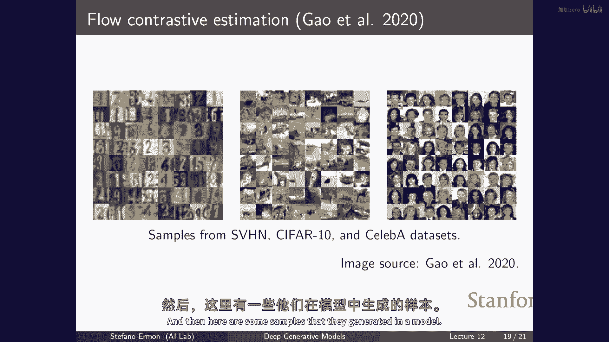

# P12：p12 Stanford CS236： Deep Generative Models I 2023 I Lecture 12 - En - 加加zero - BV1NjH4eYE1v

酷，所以今天的计划是继续讨论基于能量的模型，并且这将提供很多基础，还要讨论基于分数的模型和扩散模型，就像作为一个回顾，你知道，这是我们通常的幻灯片，提供我们对本课程到目前为止讨论的所有不同事物的概述。

嗯，讨论，一，基于能量的模型为您提供了一种定义非常广泛概率分布的另一种方式，并且有点像扩展那个绿色集，这可能允许您更接近真实的数据分布，基于能量的模型的好地方在于它们以这种能量函数定义，有数据。

这可以基本上是任何东西，所以您可以选择任何神经网络架构您想要，并且使用您在那里看到的表达式，您将得到一个有效的概率模型，本质上，你可以在这里获取数据点的可能性，通过查看归一化的概率。

这就是你在那个表达式的numerator中得到的，然后除以总和，有点像归一化的概率，嗯，那些存在，所以这就是所有可能发生的事情的numerator之和，所以，概率被定义为相对于这个归一化常数分布的。

这取决于模型的参数，这就是关键的东西，嗯，问题是通常评估z theta是难以处理的，因为我们对随机变量感兴趣，所以多个随机变量或随机向量x，具有众多不同成分，这意味着你需要考虑的x的可能数量大得惊人。

以便计算归一化常数，这意味着评估概率，数据点的概率通常将是难以处理的，你总是可以很容易地评估分子，但在那个表达式中，很难评估分母，而且，比较两个数据点的概率实际上很容易，这对采样非常重要，所以。

如果你想知道你有一个x和一个x'，这可能是两个图像，例如，你不能轻易地评估根据模型，两个中的任何一个有多可能，但是可以很容易地找出哪一个更可能，因为两个概率的比率，当你取比值时，基本上。

两个归一化常数他们会抵消，因此，很容易根据任何能量函数来评估这个表达式，无论你使用哪种神经网络来代表f theta和嗯，你知道，你付出的代价是再次评估似然性的费用很高，因此。

如果你想要训练一个最大似然模型的模型，你需要能够以某种方式为每个数据点评估，嗯，这个表达式或这个表达式的日志，这将是像这样的，问题是你有两个依赖于theta的术语，所以每当你想要知道如何调整数据。

或者如何选择数据以最大化训练数据点的概率，你知道你需要知道如何调整你的神经网络的参数以增加，有点像分母，这个训练数据点的归一化概率，总是容易，但是然后你需要担心如何改变数据影响归一化常数。

所以你改变其他可能发生的所有事物的概率多少，并且所以您需要找出如何改变数据，以便这个增加，同时分函数增加，日志归一化常数理想上也应该下降，以便相对重要性，这个训练数据点的相对权重可以尽可能地提高。

再次做这件事很难，因为我们不知道如何精确地评估归一化常数，所以它与基于似然度的模型不同，例如，自回归模型，在这个分部函数z theta中，这个值被保证为一，无论你如何选择你的条件参数，例如。

在这种情况下，你不必担心，你知道，如果你在你的神经网络中更改一些参数，分部函数如何变化，因为它是由设计构造的，应该是一个，无论你如何选择你参数，所以，当你训练自回归模型时，你基本上只有第一个术语。

并且它很容易优化，并且你没有我们这里的问题，嗯，我们看到的是，它实际上，相对容易地构建出一种基于样本的描述方式，类似于对日志分布的近似，特别是在此，我们看到存在这种对比性差异，一种算法。

它将给我们提供一个评估对数似然梯度的方法，这是你需要如果想要，你知道，更新你参数以最大化数据点的概率，你需要在这里评估这个表达式的梯度，这是我们要最大化的，实际上，找出这个梯度并不难。

如何计算对数分布的梯度，那么，对数分布的梯度如何随着数据的变化而变化，或者，对数分布的梯度是什么，如果你有模型样本的访问权，所以，如果你能以某种方式从模型中采样，但我们知道，不幸的是，这也相对困难。

但如果你有模型样本的访问权，那么你就可以找出你可以得到对梯度的估计，你主要关注通过查看训练数据上的能源梯度来理解的是什么，与模型生成的样本上的能源梯度相比，所以这有一种相当直观的解释，我们想说的是。

我们正在试图找出在哪个方向，我们应该不更新theta来增加训练数据的概率，或者像减少一些替代的可能性，由我们的模型产生的一种假象的合成数据，通过这样做，你是在调整那种。

你实际上是在找出theta如何作为函数的函数变化log归一化函数，那是正确的表达式，因此，到你能够从模型中生成样本的程度，那么你就有这种对比性差异，它是对比性的，因为你在比较两个来自真实数据的对比样本。

并且你在对比两个来自模型的样本，因此，你需要找出如何调整你的参数来，嗯，基本上嗯，并且通过跟随将真实数据与模型生成的假例进行对比的表达式，所以log z theta的梯度就是找出，如果你稍微改变参数。

分部函数如何变化，所以，你的总和归一化概率如何变化，所以，如果你记得我们分割蛋糕成片的比喻，这个术语基本上在说，我们为特定数据点分配的切片大小是多少，另一个术语在告诉你整个蛋糕的大小如何变化。

因为一切都相对于整体，相对于大小，你必须理解那个，要理解如何提高数据点的概率，不是切片的大小重要，是切片相对于整个蛋糕的相对大小，一个归一化的概率的总量，而且这就是分部函数的梯度。

我们可以用样本基本上来近似，对数分部函数就是整个蛋糕大小的对数，基本上，酷，所以这有点像一个总结，因此，基于最大似然的能量模型训练是可行的，到你可以生成样本的程度。

我们已经看到了一种从能量模型生成样本的食谱，这是一种设置马尔科夫链的想法，所以，使用被称为马尔科夫链蒙特卡罗的技术，基本上，生成样本的方法是初始化，嗯，一些程序，程序通过从某个分布中采样x0来选择。

结果，这不重要，但如果你想尝试从图像分布中采样，你开始以一个图像，无论那个图像在时间零是什么，然后，你基本上试图改变这个图像，对这个候选样本，你需要尝试使它更有可能，例如，如果你从分布π采样。

你是用算法初始化的，你知道这可能很糟糕，它可能只是，你知道，将变量的值设置为均匀随机，所以你基本上开始与纯噪声，然后，你需要找出如何改变像素值，去高概率区域，有一种基本的方法可以做到。

基本上涉及尝试扰动，尝试改变你的数据点一点，如果是连续的，你可能想要添加噪声，如果是离散的，也许你改变单个像素的值，像这样，结果发现你不必，你知道，你可以基本上做很多事情，它们全都工作，嗯。

你提出的新样本x'是那样，然后，你知道，有时，通过添加噪声这个小小的改变是有益的，因为它使你趋向于更高概率的区域，有时它不是，所以，算法做的事情是，它基本上检查这个提议的样本与您当前位置相比有多好。

记住，这是因为在能量模型中，虽然我们不能评估似然度，但我们总是可以与数据点进行比较，所以，我们可以总是检查我们生成的样本x'，通过做一些局部的小改变，与当前最佳猜测相比，是否更好或更坏，如果更好。

意味着x'的正常化概率比之前我们有的更大，所以，我们可以总是检查我们生成的样本x'，通过做一些局部的小改变，与当前最佳猜测相比，是否更好或更坏，然后，如果更好，意味着x'的正常化概率比之前我们有的更大。

我们做了扰动，然后我们接受过渡，并且我们说，好的，你知道，我们在进步，时间t处的状态是，t加一是这个我们生成的新样本x'，并且如果不是的话，以一定的概率，这取决于基本上这个提议有多坏。

这个提议的样本x'是，我们无论如何接受这个转变，添加噪声，丢失一个，一个新的样本，它是，你知道，在我们的模型中更可能，它不能感觉像某种保证，如果我们取模型的尘埃相应的事件，然后添加那个像。

那不是像那个东西一样吵闹吗，是的，所以那个在下一个幻灯片上会出现，在那里，我们将使用f theta的能量梯度，作为一种扰动样本的方法，基本上一般来说，这架机器运行良好，无论你怎么做，理论中的原因和意义。

至少在一些关于你如何添加噪声的温和条件下，如果你对这个过程重复足够的步骤，你将得到收敛到一个来自真实能量基模型的样本，所以你可以在头脑中大致想象一下这个，作为一种像局部搜索一样的东西。

或者是一种随机的山坡攀登过程，你在尝试在这个可能样本的空间中移动，试图去，寻找高概率的区域，而你这样做的方式是，你知道，你总是接受向上爬的移动，并且有一些小概率，并且偶尔你也接受向下爬的移动。

当山的高度是概率时，或者模型分配的归一化对数概率的对数对数概率，并且这是因为这个嗯，运算符满足，嗯，被称为详细平衡的东西，意味着，如果我们用t x表示，X'表示从一个状态转移到另一个状态的概率，X'。

嗯，我们有一个条件，即真分布下X的概率，我们试图从，从X'转移到X的概率与在X'处的概率相同，做相反的移动，即回到X，你可以看到，这是真的，因为X或X'中的一个将具有更高的概率，但是让我们说。

X'的概率高于X，因此，从X到X'的转换在时间t等于1时发生，从X'到X的概率正好等于p_θ，X除以p_θ乘以X'，这是我们接受下降移动时的概率，结果，如果满足这个条件。

那么基本上p_θ是这个操作符的基本点，我们使用该操作符来提出新状态，这意味着，如果某个时间点xt按照p_θ分布，那么xt+1也按照p_θ分布，并且你可以证明在某些条件下，实际上你会收敛到这个固定的点。

所以p theta是这个种操作符的固定点，你会到达那里，无论你从哪里开始，所以，无论你如何选择这个pi，你如何初始化你的样本，最终xt将按照p theta分布，这就是你想要的。

因为它是这个操作符的固定点，你知道我没有对这件事公正，对于这个主题，你可能能开一门关于mccnc方法的课程，但对于我们的目的，你知道重要的是要注意，基于能量的模型有采样的方法，即mc mc，从理论上讲。

它们可以在实践中工作，发生的事情是，通常你需要一个非常大的数量的步骤才能得到一些好的结果，所以你可以想象，如果你开始，你知道，假设x是一张图片，你从随机的像素值开始，然后一个一个地改变它们。

你需要改变很多才能达到，嗯，具有正确结构的东西，尽管你有这个f theta的指导，所以你有点像，知道你在做错的时候，当你没有的时候，你需要走很多步骤才能得到一个好的结果，所以。

这就是能量基模型问题的一部分，即使你有一个训练好的能源基模型，如果有人给你正确的f theta，生成样本很昂贵，这就是你付出的代价，你有一个非常灵活的模型，但从它中采样很昂贵，请注意。

如果你想通过对比性差异来训练一个模型，在训练过程中，你需要不断地生成样本，所以这不是你在推理时必须做的事情，甚至在训练时，如果你想使用对比性分叉，你必须以一种非常非常昂贵的方式使用此程序。

非常非常非常非常困难，它的一种稍微改进版本，这种程序的某种形式，嗯，被称为孤立动力学，这实际上是我们之前见过的一种特殊情况，而且从本质上来说，这个过程的工作方式是一样的，你从初始化这个过程开始。

让我们假设一个随机的图像，然后，你还是做你的操作，你知道你还是一个迭代的程序，你在尝试将你的样本本地更改为更好的东西，但你这样做的方式是，嗯，有点像试图朝着增加方向的方向走，这应该增加你样本的概率。

所以，你做的就是你产生这个扰动版本的x t的方式，是通过执行噪声梯度上升的一步，在这里，你将xt修改为对日志似然度的梯度的方向，我假设x是连续的，这仅在连续状态空间上工作，因此。

xt处的日志似然度梯度告诉你，你应该如何扰动你的样本，如果你想要最快地增加似然度，然后基本上你就跟随梯度，但你添加一些噪声，原因是就像以前一样，我们不贪心，我们不总是优化我们想要探索的似然性。

所以我们想要偶尔采取降低我们样本概率的步骤，即使你知道我们想要能够移动并探索可能的图像空间，但本质上它实际上是取样，跟随梯度并在每一步添加一些高斯噪声，在某种程度上预先缩放，你总是接受过渡。

至少在这个算法的版本中，还有版本允许你接受和拒绝，有点像我之前描述的算法，但结果是你不甚至不需要接受或拒绝，你可以总是移动到xt加1嗯，无论你落在哪里，嗯。

在一个比你从哪里开始的状态概率更高或更低的地方，并且你可以再次证明在技术条件下，这个程序会收敛到一个来自由能量基模型定义的分布的样本，在迭代次数很大的极限中，是的，绝对在实际梯度和噪声上都正确，嗯。

你应该，是的，所以我们使用epsilon是因为它控制步长大小，所以它有点像步长大小和梯度，上升或下降，结果发现为了事情能工作，你必须平衡，你添加的噪声量必须与它的大小成比例，你如何缩放梯度，因此。

信号与噪声的比例必须那样缩放，以便于三点法工作，这个螺丝需要拧到这个位置，是的，因此，它基本上需要保持信号与噪声、噪声与梯度比例之间的比例，噪声的数量，信号与噪声比、噪声与梯度比必须那样缩放。

以便于保证这一点，这种条件在理论上非常小，是的，以便只在极限范围内保证工作，基本上，那个步长将趋于零，嗯，在实际应用中，你将使用小的步长，并希望它能工作，这是当步长为零时，你遵循建议。

就像你移动你要检查的噪声到一个地方，所以它是因为步长因为我们没有做，在这里接受和拒绝，所以如果你记得，如果你记得这里的这个版本，我们有，嗯，有时候我们留在原地，有时候我们，你知道我们根据那个接受或拒绝。

如果你想，你可以使用，嗯，你可以认为你可以在这里基本上，我真的没有说我怎么产生这个扰动的版本，我刚刚说添加噪声，但实际上，你会发现你可以以任何方式做它，而且它还会给你一个有效的算法，基本上。

所以你如果定义了方式，你通过说'我遵循梯度'来添加噪声，我有一点高斯噪声，这定义了一个有效的提议新数据点的程序，只要你平衡它，那么你将有一个有效的程序，无论ε多大，即使ε很大。

我的意思是你仍然会有你知道的问题，嗯，是的，基本上你知道你可能需要接受你需要做的，然后你有接受和拒绝，所以有时候你会被困在你所在的地方，所以你不想要接受，如果你接受太多的我们，你知道如果梯度步长太大。

你可能是，你知道泰勒展开已经不再准确，所以概率实际上会下降，所以然后你可能会被困在你所在的地方，所以仍然非 trivial，但你可以，我想，是的，这个被称为未调整的版本，那是调整后的版本。

基本上就是你接受和拒绝，而且那个可以用金融步长工作，酷，哦，问题是这是否比常规快，或者像，我们为什么用这个而不是，是的，所以这是一个伟大的问题，而且嗯，总的来说，这就是，嗯，我的意思是，它还在理论上。

可能需要大量的步骤，而且收敛只有在极限时才能被保证，但在实践中，你可以想象它是一个，它是一个更好的提议，因为你基本上是在跟随，你有更多的信息，就像以前我们盲目地对图像进行更改一样，那现在我们正在说。

好的，如果你有梯度信息的访问权，你在做决策的方式上可以更加明智，你提出建议的步骤，实际上，这在很大程度上优于，比如，你需要的步骤数量，以收敛，嗯，是的，而且好事是即使嗯，对数似然函数依赖于配分函数。

或者我可能没有在这里，但是，如果你计算出表达式，你会发现z theta依赖于配分函数依赖于theta，但是不依赖于x，所以所有所有x都有相同的配分函数，所以当你以x为变量取梯度时。

你只会得到神经网络的能量梯度，因此，计算对数似然度的梯度实际上很容易，即使你有基于能量的模型，所以这种采样程序非常适合，嗯，对于ebms，我的意思是，在理论上仍然存在问题，至少你拥有的维度越多。

事情往往越慢，嗯，"嗯，而且"，你知道，这种在推理时做的事情是合理的，"但是即使你可能需要"，让我们假设，"一千步，也许一万步"，或者类似于这个程序来生成样本的步骤，"在推理时，它可能是可以接受的"。

你知道，"如果你在生成"，假设我们有一百万像素，做这一步骤的一千步是可以的，或者这可能需要你评估一个大的神经网络，假设一千次可能并不是太坏，但如果你必须在训练期间做，那么事情就变得非常非常昂贵。

所以通过在内部循环中采样来训练基于能量的模型，在那里你在对对数似然进行梯度上升实际上是非常非常昂贵的，尽管这种方法是从基于能量的模型中采样的合理方式，但它如果被用作插值，速度就还不够快。

在这种对比性差异子程序中，对于每个训练数据点，你需要从模型中生成一个样本，如果生成样本，你需要运行一个包含一千步的大型序列，事情会变得太昂贵，基本上，所以，我们今天要看到的，是其他训练能量基模型的方法。

它们不，基本上需要采样，嗯，是的，嗯，我不明白为什么点二是真实的，像为什么为什么它会运行真实，嗯，哪一个，所以，log p theta 的梯度等于三，是的，当然嗯，让我们看看，当我们有它这里。

这个表达式这里是log似然度的梯度，抱歉，只是log似然度，F theta 减去log z，这仅仅是这个表达式的log，如果你对这个东西以x的梯度取，log p theta 不受x的影响，所以它是零。

所以它消失了，这就是为什么，嗯，基本上是的，这是真的，太好了，所以是的，计划是基本上引入不需要在训练期间采样的方式来训练能量基模型，至少，所以，把它们视为对比性差异的替代品。

这是数据和模型之间的一种近似的kl差异，对最大似然训练的一种近似，这就是我们如何引入对比性差异的，我们将看到常规技巧，将有另一种差异，一种不涉及的模型与数据比较的方式，损失函数，基本上不涉及分部函数。

如果我们按照这种方式训练，而不是通过近似kl差异来训练，那么我们将得到一种更快的训练程序，所以我们将看到几种，我们将看到分数匹配，这有点像关键构建块，也是扩散模型的背后，噪声对比估计和对抗训练。

所以记住，嗯，你知道，我们有一个基于能量的模型，它被定义为那样，如果你取那个表达式的日志，你知道你被支持，我们得到这种能量的差异，这是你正在使用的神经网络来模型分布的任何内容，然后你有对数分部函数。

关键的是，分数函数，或对数似然函数关于x的梯度，请注意，这不是关于模型参数的对数似然函数的梯度，这些是模型的参数，这是关于x的梯度，所以这基本上是概率如何改变，如果我对样本本身做出微小的变化。

不是像似然函数会改变的那样，如果我对神经网络的参数做出变化，所以这是关于x的梯度，不是关于theta的，这也是一个关于x的函数，在意义上，每个轴上都会有不同的分量，并且是一个关于theta的函数。

因为对数似然本身是由一个带有权重theta的神经网络参数化的，就像我们之前看到的那样，嗯，对数似然函数的梯度不依赖于分部函数，所以这里，我想它比之前展示的更好一些，但如果你有这个。

对数似然是这两个术语的差，对数分部函数对于每个轴都是一样的，它取决于theta，但它不取决于x，所以当你关于x取梯度时，对数分部函数不会改变，所以梯度是零，这就是我们为什么能够使用分数函数。

或对数似然函数在前一个样本过程中，如果你有访问能量函数的权限f theta，你可以很容易地计算它，你可以在这里看到，这种想法正在发挥作用，如果你有一个高斯分布，或者像往常一样，参数将是均值和标准差。

记住，分部函数有点像你在前面提到的归一化常数，保证这是这个函数的积分实际上等于一，如果你取对数，你会得到归一化常数的对数，然后你得到这个指数的对数，然后当你以x为变量对函数进行微分。

你会再次得到一个与x和模型参数相关的函数，它相对简单，它类似于x减去平均值，乘以方差缩放，再次是伽马分布，前面可能有一个潜在的棘手的归一化常数，如果你取矩，你取得分数，这个归一化常数消失。

你得到一个更简单的函数来处理，所以直觉是，作为θ（得分）提供你对原始函数的另一种视图，你从梯度的角度看待事情，而不是从自身似然性的角度看待，所以如果你想象你有一个pθ，它只是两种高斯混合的组合。

但让我们假设在2d中，所以这里有一个高斯，这里有一个高斯，所以它是两种的混合，所以你有这种相对复杂的等高线，你知道似然性只是一个标量函数，对于每个轴，都给你提供一个标量函数，它类似于这个曲线的高度。

你可以想象你有两个钟形曲线，一个中心在这里，一个在这里，得分基本上在每个点都是梯度的值，它是一个函数，每个x都给你对自然对数似然性的梯度，所以它是一个向量场，你可以想象在每个点，有一个箭头。

箭头告诉你你应该跟随的方向，如果你想要最迅速地增加自然对数似然性，正如预期，你可以看到这些箭头像，指向高斯分布的均值，这像是你在这里看到的，在意义上说，如果你在一个数据点，如果你想要增加似然性。

你应该把它推向均值，如果模型是高斯，固定脚和模型参数被固定得很好，它们不一定被固定，所以我们仍然要学习它们，但当我们取梯度时，我们取关于x的梯度，所以θ不依赖于x，所以当你以x为变量取梯度时。

对数分布的归一化常数消失，但我们仍然要学习θ，所以这里，当然我只是展示一个截面，其中theta是固定的，你知道theta将代表这两个高斯分布的均值和方差，如果你改变这些，得分函数本身将改变。

你可以在这里看到，它仍然是一个关于theta的函数，但它是一个关于数据的简单函数，而不依赖于归一化成本，所以你可以计算它而不知道，相对，嗯，你不需要了解其性质，记住，梯度告诉你似然性如何变化。

但如果你要对小x进行微小变化，我们知道如何在基于能量的模型中比较两个数据点的概率，所以它 kind of  makes sense 你知道它不依赖于分部函数，得分函数基本上是一个向量场，代表梯度，嗯。

一般来说，它是总是像一个向量场，或者它是应该代表什么在 general 上，它总是 yeah，好问题，所以，按照定义，得分函数总是作为一个向量场存在，代表梯度。

因为定义上就是 f theta 对 x 的梯度，所以，一般来说，如果theta可以比一个高斯混合的组合复杂得多，你可以想象这些箭头将更加复杂，并且如果你有概率质量分布在复杂的方式上，梯度可能，我的意思。

它仍然是一个向量场，它可能没有简单的结构，哪里只是指向这些两个点，但它总是总是一个向量场，梯度的场，或者像另一个量的更好场，所以它是向量场，梯度的场，如果它被定义为这样，因为实际上它是一个保守的向量场。

因为有一个实际的能量函数，当我们谈论基于能量的模型时，我们将看到我们将使用任意的神经网络来建模这个，但现在我们假设有一个潜在的 f theon 能源函数，这就是向量场，所以，如果你喜欢与物理学的类比。

你可以把 f theta 想象成像是一种电势，而 s theas 就像那个的梯度，就像一个场，基本上一个电场，它们 kind of 描述同一个对象，但是以稍微不同的方式，所以，这就没有信息损失。

或者只是思考事情以稍微不同的方式，从稍微不同的角度，从计算角度来看将有益的，因为我们不需要担心分部函数，好的，那么我们怎么做，嗯，关键的观察是得分函数，对输入的似然函数的对数梯度与分部函数无关，因此。

想法是我们将定义一个训练目标，我们将比较两个概率分布或两个概率密度p和q，通过比较它们各自的梯度向量场，所以想法是，如果p和q相似，那么他们也应该有相似的梯度向量场，如果p和q在另一个轴上相似。

将有相似的梯度，所以比较p和q有多相似的一种合理方式，是说，什么是p和q得分的l2平均差异，所以在这里我们做的每个点，你应该跟随哪个方向，如果你想要增加p最迅速的可能性，你应该遵循哪个方向。

如果你想要使q的最可能性最快地增加，然后我们检查它们之间的差异，所以它是一个向量，所以把它转化为标量，我们取这个向量的范数，在这种情况下，我声称你知道你可以想象这个应该是合理的，有点像损失函数。

因为如果p实际上等于q，那么梯度就会是相同的，所以log p的梯度就会是等于log q的梯度，这个向量在所有地方都会是零，并且这个，嗯，范数就会是零，平均值也会是零，所以被称为fisher的。

p和q之间的散度也会是零，所以这是一种合理的检查方式，p和q如何彼此不同，而且至关重要的是我们做这件事的原因是，我们最终感兴趣的是训练一个基于能量的模型，所以假设p是数据，Q是模型，但至关重要的是。

用这种损失函数，只涉及到得分，它只涉及到这些梯度，我们并不依赖于分部函数，所以这可能会给我们一个实际上非常适合基于能量的模型的损失函数，因为它不需要你知道模型的日志分区函数，这就像，为什么我们。

我们正在考虑这个，它是一种不同的损失函数，作为比较概率的一种不同方式，稠密的密度函数，它们实际上相互关联，所以从某种意义上说，费舍尔散度有点像卡莱散度的导数，在某种程度上，所以如果你取两个密度。

并将其与高斯噪声卷积，并取其相对于噪声大小的导数，它 turns out 那就是费舍尔平均值，但只是想把它看作是一种不同的分歧，真实值，是的，是的，所以让我们看看你怎么知道这不会那么容易，但这就像是。

想法是让我们定义损失在 terms of 得分，因为我们知道如何计算得分，但我们不知道如何计算对数似然，啊现在，所以这就像是得分匹配的想法，P 将是 p 数据 q 将是基于能量的模型。

它是由这个能量函数参数化的，然后，如果你评估数据密度和模型密度之间的费舍尔散度，你会得到这样的东西，或者等价于这样的东西，或者你以数据分布的期望来计算与，真正的，数据生成过程的梯度之间的差异，是的。

它只适用于连续密度，是的，是的，所以这就是基本上，我们在比较真正的数据分布梯度，与模型梯度，这些都是我们可以计算的，尽管 p theta 是一个基于能量的模型，这个损失函数仅取决于得分。

我们知道我们可以高效地计算得分，而不必担心归一化常数，这就是想法，我知道如何，正如所指出，它感觉像，嗯，它不是非常有用，因为它仍然有点像涉及到对日志数据密度的梯度，我们并不知道。

看起来像是一个合理的损失函数，但我们不知道确切何时可以评估或优化，因为尽管我们有访问来自p数据的样本，所以显然你可以用样本来近似这个期望，相对于p数据，看起来我们需要知道日志数据密度的梯度，这是未知的。

如果我们知道对于每个x，log p数据的值是什么，那么我们就不必构建生成模型了，对吧，相对于的，嗯，它是一个平方，我们会看到那里有一个平方，不幸的是，它创建了一个耦合，但结果是，它几乎很容易做到只是。

是的，是的，不是那么容易，但结果是，是的，所以这有点像表达式，问题是我们只有来自p数据的样本，所以看起来第一个项，梯度，的，数据分布得分是未知的，所以我们不知道如何优化这个目标函数，并试图使它尽可能小。

作为函数θ的函数，因为我们可以计算这里的第一个项，我们只有访问来自p数据的样本，这是生成模型问题的通常设置，但结果是，你实际上将这个损失函数写为一个等价的一个，不再依赖于数据分布得分的未知函数。

通过积分部分，所以让我们看看这是如何工作的，我们从一维情况开始，所以x只是一个一维标量随机变量，所以梯度实际上是导数，并且只是因为积分部分更容易看到那样，所以我仍然使用梯度符号，但这些实际上是导数。

然后嗯，你知道我们不必担心向量的范数，因为再次，导数只是标量，所以平方范数就像这两个标量的差平方，这就是损失函数的样子，当x只是一个单个标量随机变量时，你基本上它是相同的表达式，除了它不是向量。

它是两个标量的差，这就是在那里发生的事情，然后我们可以扩展这个这个，嗯，或者仅仅通过明确地写出这作为一个对数据分布的期望来写，所以您遍历所有可能发生的x，您用它们与数据密度进行加权，然后。

您看数据分布和模型分布的对数导数的差异在每个点，以及在每个点，所以你有点像，有这两条曲线，您在每个点看斜率，然后你们进行比较，然后嗯，你可以展开平方，这是一个，这是一个差的平方，所以如果你展开它。

你将得到三个术语，你将得到一个蓝色术语，这就是这个对数数据密度梯度的第一个梯度的平方，然后您有对数模型密度梯度的平方的梯度，然后，你有这个红色的术语，你有基本模型和数据之间的点积。

以及模型和数据之间的交叉积，你可以看到，第一个术语不依赖于theta，所以我们可以忽略它，对于优化的目的，相对于theta，我们可以忽略蓝色的术语，绿色术语容易，它只取决于模型，所以再次我们很好。

问题是红色术语，因为那个涉及到仍然涉及到对日志数据密度的日志梯度，而且在某种非平凡的方式，而且我们要做的就是我们要使用积分分部法，这是你记得从基本微积分的，它是一种写f'g积分的方式。

以g'f积分的形式，基本上你可以选择你以哪个函数对哪个函数求导，然后我们将那个红色术语应用到那里，哪个是烦人的术语，记住，这是一个关于梯度数据集的期望，对数数据密度，对数模型密度的梯度，现在。

log p数据的梯度是什么，log的梯度是log的论据，论据的倒数乘以，log论据的导数，所以它应该看起来像这样，仅仅通过展开这个嗯 log p数据的梯度是 p数据的倒数，p数据的导数乘以p数据的导数。

我们这样做的原因是现在，这里p数据，这里和这里的p数据会相互抵消，现在，它看起来有点像我们有一些，我们可以在这里应用分部积分，所以，这是p数据的导数，乘以对数p模型的导数。

并且我们可以应用分部积分并重新写为p数据的形式，所以，这里有p数据的导数，所以我们将其重写为只有一种形式的p数据，而不是f的导数，我们转向f，使p数据成为p数据，然后我们对对数取一个额外的导数，嗯。

在模型的得分上，所以，我们基本上，我们已经将其写成期望的形式，相对于第二个模型得分的数据分布，基本上我们现在仍然必须处理这个嗯，这里术语，fg，这有点像积分在两个极端的积分子，在合理的假设下。

你可以假设当x趋向正负无穷时，这个值，p数据趋向零，它是密度，所以边界上不能积聚太多的概率质量，如果你愿意做出那个假设，这简化为现在基本上不再依赖于数据的得分密度，这完全取决于我们可以控制的事情。

我们可以管理它，对于数据密度仍然有一个期望，但是只涉及到，它不再涉及到分数，所以这就是嗯，基本上这个技巧，如果你可以假设，如果你愿意假设这个嗯，这里的术语是零，基本上就是说数据分布衰减足够快。

然后你可以使用积分分部法，然后你可以重新写这个东西，原始的分数匹配损失它原来有三部分，如果我们应用这个技巧，将红色项重写为棕色项，就是我们使用积分分部法得出的。

现在我们得到一个我们可以实际评价的损失函数，我们可以作为theta的函数进行优化，我们有第一个项，它相对于theta是常数的，所以我们可以忽略它，我们对p数据的二阶导数的期望有预期，然后。

我们对p数据的二阶导数的期望也有，对对数似然函数的二阶导数，所以，这就是你知道的，你可以将两个期望写为一个期望，现在我们基本上得到了与起始点等价的损失函数，除了常数，到我们开始的地方。

但现在它只涉及我们可以访问的东西，它只涉及模型得分，对于模型得分的导数，我们有，对对数似然函数的二阶导数，但再次，导数总是关于x的，所以这就是魔法的地方，这是你如何，嗯，消除对数据密度得分的依赖。

并使用基本微积分将其写下为一个表达式，现在是我们可以实际优化的东西，它可以评估和优化作为数据的函数，所以这就是种，至少在一个中。

它 turns out that there is something you might have seen it in multivariate calculus。

在多变量微积分中有一个等效的积分部分，实际上有高斯定理，当你有一个向量时，你可以基本上做同样的技巧，所以当x是向量时，如果你真的有梯度，你可以基本上使用同样的技巧，并导出一些非常相似的东西。

而不是看导数的平方，你有梯度的L2范数，而不是只有对数似然函数的二阶导数，你有对概率密度的Hessian的迹，所以，再次，你需要看二次导数，但当你有向量值函数时，事情会变得稍微复杂一些，所以。

Hessian基本上是这个矩阵，如果你有n个变量，那么它就是n x n，其中包含所有混合二次导数，对log p theta x的偏导数，对于所有对变量x i x j的访问对，所以，再次。

就像泰勒展开到第二阶一样，如果你想，我猜是迹迹，这就是迹，只是抓住，哦 yeah，所以，它是所有二阶导数，所以，它也返回，并是一个向量，嗯，如果脸上跳过了什么东西，这就是你基本上如何使用同一种推导的。

通过积分部分，你又把它写成一个不再依赖于p数据得分的量，这就是我们现在可以优化的目标函数，嗯，如果你愿意用样本平均来近似这个期望，你知道我们总是有访问p数据的样本，所以我们可以使用样本来近似这个期望。

然后，你会得到一个算法或损失，看起来像这样，你有一些来自p个训练数据的数据样本，然后，你可以使用样本均值来估计分数匹配损失，这将看起来像这样，你遍历单个数据点，你评估在每个数据点上能量的梯度。

你看到向量的平方范数的平方，然后，你需要看日志似然函数的海森矩阵的迹，这又是对f theta的动作的某种形式，在这种情况下是模型，然后，这现在是一个关于theta的函数，你可以尝试优化和最小化。

以theta为变量，你记得我们正在尝试最小化，这个，这相当于数据无关的偏移，它等于Fisher散度，所以，如果你能够使这个尽可能小，以theta为变量，你正在尝试匹配数据分布和模型分布的得分，这更好。

所以，它正在获取模型的哈希，这就像，但是，即使是任务的日子，至于这一点并不重要，这并不是一个，是的，是的，这是一个好点，而且我认为这是一，它很快就会出现，嗯，这仍然在非常高维的设置方面存在问题，例如。

海森矩阵的迹，我知道它需要更高的阶次微分，而且有些昂贵，但是，将有方法近似它，关键点是它不需要你从基于能量的模型中采样，这是一种损失，你需要训练数据，你评估你的神经网络，在训练循环中。

你不需要從基于能量的模型中采样，这是关键，如果你想要提高效率，并且损失函数实际上有一个，是的，这就有点像，你刚刚提到了，确实，海森矩阵很复杂，但它有一个，它有一个合理的味道，如果你想想。

这个损失在说什么，你试图将这个数量作为θ的函数来最小化，所以你的意思是，你应该看你的数据点，你应该看对数似然度的梯度，在每个数据点上评估，你试图使它变小，这基本上意味着你试图使数据点。

成为对数似然度的局部稳定点，所以数据点应该要么是对数似然度的局部最大值，要么是局部最小值，因为数据点的梯度应该小，所以你不应该能够通过稍微扰动数据点来改变它，并且通过增加很多可能性来提高。

因为梯度应该非常小，在类似于这个片段所做的数据上进行评估，并且这个片段类似于说，试图松散地确保数据点是局部最大值，而不是对对数似然函数的局部最小值，为了做到这一点，你需要看第二阶导数。

那就是那个术语在做的，这是非常合理的，它说的是如果你想要拟合一个模型，尝试选择参数，这样数据点就能成为局部最大值，在某种程度上是对对数似然函数的，并且这可以通过查看一阶梯度和二阶梯度来评估，是的。

所以这就是要找出的迹，这个局部最小值，不仅仅是看基本上的，是的，所以这就是我们要干的事情，我们是要，有两种做它的方法，一种是，我猜测有一种叫做切片得分匹配的方法，其中，你是在随机方向上移动。

并检查在这些方向上，可能性是上升还是下降，这相当于如果你知道关于胡奇森技巧来估计哈的知识，它基本上是同样的事情，你在，它是矩阵迹的估计器，那种看起来就像是在随机方向上随机投影的样子。

另一个事情是尼娜与一辆匹配的汽车，这也有一种味道，就像是，添加一些噪声并检查，在数据点的邻域中，是否概率会上升或下降，所以它基本上有这种味道，那些事情将与维度有关，是的，当你有一个固定的分析形式时。

当你取，当你在与x交谈时，所以一般来说，所以问题是哈希是否以分析形式存在，比如如果数据是神经网络，你不能，没有封闭的，你需要使用自动差分来基本上计算它，问题是你需要许多反向传递。

有点像不是因为你只是在计算一个单一的偏导数，你在计算，你知道关于每个输入的偏导数，因为类似于你需要计算海森矩阵的所有对角元素，而且我们没有找到除了做反向传播之外更有效的方法，基本上在时间上。

这也是昂贵的，当n很大时，但是，好事是这避免了采样，这将是类似于关键构建块的东西，也用于训练扩散模型，但在下一堂课中会有更多关于这个的，有点有点，哦，是的，问题将收敛于更尖锐的峰值点，而不是这样。

可能会有一个非常非常尖锐的东西，这相当低，然后一个更平滑的高峰，所以不是以我仅仅证明了这是这样的方式发生的意思，与费舍尔散度等价，而费舍尔散度是零，如果和只有当分布的匹配程度类似，所以，尽管是的。

你可能认为这不太正确，这不完全是正确的目标，在无限数据的极限下，这将给你精确的，如果你全球优化它，这将给你精确的，数据分布，因为它实际上只相当于真鱼者分布的偏移，我们从哪里开始，这就是，嗯，这个东西。

这是零，只有，基本上如果密度很大，现在很酷，另一个，是的，这是一种你可以用于训练的酷技巧，嗯是的，所以到目前为止，大致的收获是，好吧，分歧，对关心分歧的近似，或者我需要采样太昂贵，但你可以。

如果你愿意在这里测量相似性，使用这个费舍尔分歧，再次，你会得到一个损失函数，它是大大改进的，这非常适合训练，基于能量的模型，因为它不需要你嗯，尽管它看起来计算和优化起来很复杂。

实际上它可以被重写为只依赖于模型的东西，并且你可以作为数据的函数进行优化，现在还有一个，嗯，能量基模型训练方法，大致类似于生成对抗网络，实际上是一种fit能量基模型的方法。

通过而不是将数据与样本进行对比，从模型中，我们将数据与来自某些噪声分布的样本进行对比，这并不是模型分布本身，这就是它的工作方式，你有数据分布，然后还会有一个噪声分布，这是指你可以从其中采样的任何分布。

并且对于你可以评估概率的分布，而我们要做的是，我们实际上要回到再次，训练一个判别器来区分像数据样本和噪声样本这样的数据，到目前为止，没有基于能量的模型，只有普通的再次再次再次，像目标。

我提起这个的原因是，如果你有一个最优的判别器，那么你将某种方式获得噪声分布和数据分布之间的密度比，所以我记得，如果你通过最小化交叉熵来优化判别器，那么如果你试图，你知道。

在真实数据和噪声分布样本之间进行区分，那么最优的判别器是什么，它必须基本上给你每个轴的密度比，这必须能够知道x在数据上的可能性，和x在噪声分布下的可能性，所以有用，中期复习，是，嗯。

最优的判别器是数据和替代噪声分布之间的密度比，所以对于每个x，你需要找出在数据下的可能性，与在数据和替代噪声分布下的可能性，我提到这一点的原因是，因为我们可以尝试做，我们可以尝试基本上参数化判别器。

从生成模型的角度来看，这可能是一个基于能量的模型，所以我们知道最优的判别器有以这种形式，P(data) over P(data)加上噪声分布，因此我们可以尝试仅仅定义一个判别器，所以而不是有你的。

无论你想要的mlp还是神经网络是什么，用于区分数据和噪声，我们将定义一种特殊的判别器，当我们评估x被真实真实数据视为的概率时，我们得到那个数字，而不是像仅仅将x通过神经网络一样，任意地。

我们通过评估x在模型p theta下的概率与一个，在噪声分布下的概率，再次我们假设是知道的，因为我们自己生成了噪声分布，我们自己生成了噪声数据点，所以，好的是，如果你能想出某种方式。

来产生区分数据与噪声的最优判别器，我们知道最优判别器将具有这一形式，这就必须与，你知道，P数据或P数据加上噪声，所以你可以看到某种方式，如果这个分类器做得很好，能够区分数据和噪声。

它必须学习基本上p theta必须匹配p数据，所以分类器被迫基于x在p theta下的可能性来做出决定，然后如果它能够做出好的决定，那么p theta就必须基本上匹配数据分布，这就是技巧 uh。

他们在这里利用，然后我们要做的是，我们将实际使用基于能量的模型来参数化p theta，但这有点像关键思想，而不是使用任意神经网络作为判别器，像你在再次，我们以另一个生成模型来定义判别器，想法是。

通过常规训练判别器，通过最小化交叉熵损失，我们实际上是迫使它学习一个匹配数据分布的p theta，因为那是它在二元分类任务中做得好的唯一方式，它确实需要了解哪些轴可能是p数据下的可能的。

以便得到良好的交叉熵损失，而且那只有可能当p theta匹配p数据时，而且我们将看到当p theta被定义时，这是合适的，直到常数，p theta的类型将是基于能量的模型，是的，也许让我跳过这个。

因为我们快没时间了，但你也可以使用分类器来纠正噪声分布，但现在让我们假设p theta是基于能量的模型，所以我们将参数化p theta在那个之前的表达式中，以能量的常规技巧来说，只是定义到常数，然后嗯。

我们接下来要做的是一般来说，你知道这个归一化常数z theta是参数f theta的函数，它是一个复杂的函数，我们要，因为我们不知道如何计算那个积分，那个对所有可能发生的事情的和，所以我们要做。

我们将把z theta视为另一个可训练的参数，所以不仅我们将优化f theta，但我们还将把z theta本身视为另一个可训练的参数，这并不是明确约束其取归一化常数的值，它将是其他标量参数。

我们可以优化的，所以如果你这样做，那么基本上我们分类器中使用的密度模型，现在取决于theta和取决于z，然后我们只是插入这个，嗯，嗯，"这个"，"这个想法是，基本上如果我们将这个表达式插入到分类器中"。

"进入判别器"，"我们通常通过最小化交叉熵来训练判别器。"，我们了解在最佳参数下，"这个分类器我们将使用我们构建模型时使用的密度模型"，"分类器需要匹配数据分布"。

"这意味着最优的theta和最优的z将是这样的"，"基于能量的模型等于数据分布"，但是关键现在z只是一个学习参数，它恰好是模型在极限中的归一化函数，因为你对两边都关于x进行积分，你会看到。

这个基于最优能量的模型的积分等于数据的积分，这是由定义决定的，所以尽管我们处理z作为一个学习参数，在学习最优分类器的极限中，这个学习参数，虽然不约束必须是实际的归一化函数，将取模型的真实归一化函数的值。

因为那应该是最优分类器的样子，如果它在二进制交叉熵分类损失上做得真的很好，这种情况就像它不是一只容易的鸟，实际上，所以损失函数最终会变成，这最终会变成一个，让我们看看这个样子，所以如果你把它插进召回率。

我们基本上在说我们要，而不是像再次一样为判别器选择任意的神经网络，我们将选择一种具有特定功能形式的神经网络，所以当你评估，x是真实的概率时，你需要通过上述计算得到它，你有一个基于能量的模型。

它告诉你在模型中x有多可能，其中f，Theta和z都是学习参数，然后，如果你只是乘以分子和分母的z，你会得到一个表达式，嗯，再次，正如它应该，这取决于f，Theta和z以及已知的噪声分布，Pn。

噪声分布再次，是我们正在决定的事情，你可以选择你想要的任何东西，只要你可以从它中采样，并且你可以在噪声分布下评估概率，然后，我们实际上做的就是，我们仍然通过做，使用交叉熵法则进行二分类来训练分类器。

所以我们又有一次像样的，我们有数据，我们有真实数据，我们有由这个噪声分布生成的假数据，我们自己决定，所以这与上次不同，假数据来自一个固定的噪声分布，所以我们是相对的，真实的。

我们在将真实数据与由噪声分布生成的假样本进行对比，我们正在训练分类器以区分这些两个，分类器具有非常特定的功能形式，它以基于能量的模型定义，其中分部函数本身就是学习参数的一个方面，然后。

我们将这个优化以尊重θ和z两方面进行，试图在这个分类任务中做得最好，是的，按照方案，你最终生成的样本将如何，很好，似乎不像很难区分，即使像垃圾生成的样本和噪声，是的，所以，理论上这起作用。

无论实际中噪声分布的情况如何，你想要的是一个非常接近数据分布的噪声分布，有点像数据分布，所以，分类器被强制学习，嗯，什么是一个好的样本，什么是真实的，最终，真实样本具有什么样的结构。

你学到的是一个基于能量的模型，所以你学习到的数据f，你学习到的分部函数，在无限数据的极限下，完美的优化，如果你优化这个损失完美地，基于能量的模型匹配数据分布和分部函数，这就是学习参数的值。

你实际上得到的z是基于能量模型的真实分部函数，尽管我们只是在脚踝扭伤的方式下训练它，所以，θ和z之间没有关系，只是碰巧最好的做法是实际上正确地归一化模型，其中θz成为基于能量模型的分部函数，从原则上讲。

这在实践中做对了，这很大程度上取决于噪声分布的质量，我们实际上没有明确训练判别器，我们只是在我们的模型中添加了一个新的可训练参数，所以我们正在训练动作，所以没有生成器，生成器是固定的。

或者你可以把它看作是固定的，所以，噪声分布，它将是生成器，它是固定的，离散，我们正在训练判别器，但它是一个非常特殊的判别器，所以你不允许取x，然后通过卷积器或MLP进行喂养。

然后将其映射到一个真实与伪造的概率上，您必须使用此表达式获取概率，f theta只是，它仅用于性别，是的，嗯，嗯，这就是我们，是的，一旦您在那里，只有判别器，一旦您训练它，您可以提取一个基于能量的模型。

这是判别器中的f theta，使用固定的噪声分布和嗯，所以这种风味，这是更简单的版本，噪声分布是固定的，我们将看到，我们在接下来的几页中需要一些时间，改变噪声分布是有意义的。

有点像尝试适应并使它尽可能接近，像数据一样，或当前模型的最佳猜测分布，我认为，嗯，这比这种基本版本改进，其中噪声分布是固定的更好，目前，在这种过程中如何采样，我们假设噪声分布是你可以高效地从中采样的。

所以你总是可以基本上得到，你知道，在这里进行某种随机梯度上升，一旦您训练它们，所以学习是良好的，只要pn高效地从中采样，它就效率就高，你，从未需要采样从p theta，一旦您训练了一个模型。

您有一个ebm，因此，如果您想要生成样本从中，您需要在推断时启动mcmc的所有启动，您不能得到任何好处，这只是训练时间，这个损失函数不涉及从模型中采样，我们允许z不是等同的，为什么这在理论上是公平的。

只要到极限，您将学习到一般的分部函数，您不会，因此，这个优化问题的解决方案将给您在实际中提供一个z，那不是模型的真实分部函数，只是一个估计值，你将得到一个基于能量的模型，但不是最优的。

因为你估计的z并不是模型的真实分部函数，所以当你有有限数据和不完美的优化时，你对这个近似要付出代价，但在事物完美的极限下，这不，这不是一个问题，基本上，可能收敛，是的，所以如果你有无限的数据和嗯。

并且你 somehow 能够完美地优化过 theta 和 z，那么我们知道在 theta 和 z 上的最优解将是一个使这个匹配数据分布的地方，所以那个发生的唯一方式是 z 星必须是那个。

基于能量模型的真实分部函数，但在实践中这不会发生，所以你只会得到一个估计，是的所以如果不是真实分部函数，你不会有一个有效的概率分布，对于p数据来说，正确的，是吗，是的，所以这是一个很好的问题。

所以如果不是真正的分部函数，你仍然有一个基于能量的模型，对于这个模型会有一个真正的分部函数，只是它不是你估计的那个，所以f theta仍然定义了一个基于价值和能量的模型，只是该模型的分部函数不会是。

这个嗯问题的解决方案，关于z的优化问题，所以这不会满足约束，但是有一个关于f数据的分部函数，所以这将是一个有效的基于能量的模型，嗯，从实现上看，这看起来像你，因为你似乎在放弃对，所有这些类型的约束。

如实现是，这必须像是一个更难的优化问题，与基于分数的模型相比，我们的实现是这样的，它竟然能工作，嗯，是的，所以实际上这个实现不是用来，我们很快就再见，然后你可以再问，如果它是这样实现的，它不是这样的。

它是一种相对简单的损失，用来优化和写下，就像是，实际上实现起来非常容易，基本上可以保证你会得到一个次优的，就像是f theta i和因为你的z theta近似所以我的问题是像。

如果我训练像这样的一个和基于分数的模型，就像是，我可能能保证这个基于分数的模型对于额外的，但我在里面放入的是像会有一个更好的模型，所以实际上它们之间是非常相关的。

如果然后如果噪声分布类似于通过扰动数据得到的，通过添加一些高斯噪声，基本上，那么这个结果就正好是噪声分数匹配，所以它很大程度上取决于你选择的噪声分布，但有些情况下这个就变成了分数匹配。

所以我不认为总是说这个是坏的，它就是一个不同的东西，是的，所以是的，我回退一点，嗯，是分部函数，是你通常可以为基于能量的模型计算的，或者，哦，你有，是的，这就是问题，是的，所以，使用像这些不同的方法。

是的，所以你要么跨越分歧，要么从它采样，在某种意义上，它涉及到分部函数，因为你会估计它，通过从模型中采样来估计对数分部函数的梯度，但这也太昂贵了，或者这就是我们现在正在做的。

让我们想出一个不依赖于分部函数的训练目标，这将是效率的，酷，然后是的，所以然后嗯，为了数值稳定性，让我看看我有什么在这里，所以是的，这就是目标，然后你将这个基于分数的表达式插入这里，在这里。

你将得到一种损失，它看起来像这样，你有对数两个东西的和，因此为了数值稳定性，实际上，使用对数和指数和的方法更容易使用，有点技巧，或者对数的，嗯 e 等于 theta 加 z 的 pn。

这有点像你在分母中拥有的，以对数和指数和的形式写它更数值稳定，但从实际角度来看，实现非常简单，你开始以一个样本，一批数据点，你有一批噪声样本，你基本上只要做的就是你有这个分类器。

它有一个非常特定的函数形式，只是为了评估分类器在这个小批量上的交叉熵损失，它恰好有这个，嗯 这种函数形式，然后您将其优化为函数中的 theta 和 z，嗯 这就是我们之前有过的，所以你像是在评估，嗯。

分类器的损失，这两批真实的和伪造的，或来自噪声分布的真实样本，然后您试图，嗯，最大化这个作为函数中的 theta 和 z，是的，随机梯度上升相对于数据和 z，再次，关键之处是你不需要从模型中采样。

你可以看到 z 依赖性的非凡性，在意义上，有时像，它不是最优的只是让 z 尽可能小或尽可能大，它取决于 z 以一种非平凡的方式，所以这里有一些有趣的学习在这里发生，既涉及数据又涉及，嗯，但最终，是的。

你最终会得到一个对模型能量的估计 theta 的估计，和对对数分布的估计 partition 函数，一切都可以训练而不使用来自能量基模型的样本，所以它看起来又像另一个生成对抗网络，嗯，在意义上。

在两种情况下，你都在训练一个二分类器的判别器，以交叉熵为损失函数，所以那部分是一样的，嗯，两者都是无监督的，我们在 ebm 中没有概率，所以它应该是，从来没有必要评估 ebm 下的概率，或你的数据分布。

因为我们都没有它们，所以它就像标准的交叉熵损失，基本上在分类任务中，被简化为判别性建模，一种生成模型转化为判别器，一种训练方式，关键的区别在于，再次，实际上你有一个最大化最小化优化，你也在训练噪声。

所以你在这里训练生成器，我们不在这里这样，这是可靠的，是容易训练的，噪声分布是固定的，而你只是在作为函数θ的参数来最大化那个目标函数，它是非凸的，但是没有最小最大值，没有不稳定性，实际上。

它对训练来说相对稳定，嗯，与噪声对比估计相比，种类上的区别在于，你需要能够评估对比样本的似然性，那是你从噪声分布中生成的，所以你只需要能够从生成器中采样，所以如果你看这里的损失。

我们需要能够评估当我们从pn生成时，从噪声分布中，我们还需要能够评估这些噪声样本在再次时有多可能，你不需要，你只需要能够快速生成它们，所以这略有不同，并且嗯，你知道，你知道，当你训练模型时，嗯。

你基本上只是训练判别器，然后从判别器中你得到一个能量函数，它定义了一个基于能量的模型，而在另一个地方，你是实际上在训练一个确定性的样本生成器，所以学习的结果将会不同，嗯，也许我会说的最后一件事是。

有点像，之前建议的那样，你知道，可能适应噪声分布到模型上是有意义的，在训练过程中，随着你的进步，所以，而不是保持一个固定的噪声分布，我们可以尝试与判别器一起学习它，所以，我们需要一个能量。

我们需要一个我们可以高效地从中采样的噪声分布，我们可以高效地评估概率，因此，自然的候选者是一个基于流的模型来处理这个问题，嗯，直觉上，我们像是在训练噪声分布，使分类问题尽可能困难，嗯。

这样噪音分布就可以接近p数据，因此，对比流估计的主要思想是，其中，噪音分布由参数phi的正则化流定义，然后，基本上相同，只是现在判别器，嗯，你知道，这取决于噪音分布，这是一个流模型，因此。

它取决于流的参数，你知道，流模型你可以高效地从中采样，你可以高效地评估似然度，因此，它符合这种API，然后，我们现在优化判别器过theta和z，通过非对比估计的常规方式。

然后他们提出的是训练流模型来类似于，以一种最小最大方式，因此，它回到了GANs，在某种程度上，通过训练，流模型来尽可能地混淆判别器，因此，这就是他们的，最终，他们提出的流模型性能更好，最终。

他们使用流模型生成了一些样本，然后，实际上它们是从流模型生成的，尽管从技术上他们得到了两者，他们得到了基于能量的模型，他们得到了流模型，他们展示了对于某些事情，使用基于能量的模型更好，但是。

最终你得到了两者，更像是一个GAN，是的，是的，是的，所以，基本上对比估计，其中，噪音分布是一个被学习到的流，记住，在这个最大值内部，基本上是判别器的损失，再次，它告诉你判别器有多困惑，但是。

不是困惑得多少，不是困惑得多少，因此，通过最小化它，你，是的，你试图让判别器的生活尽可能困难，因此，你是通过最小化二样本测试来学习的，本质上，这与常规GAN训练相同，然后，是的。

这是他们在模型中生成的一些样本。

我认为这可能是停止的好时机。

