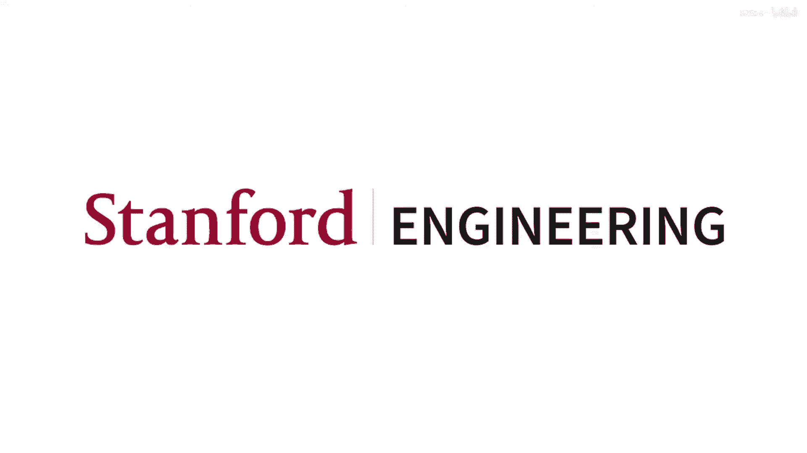
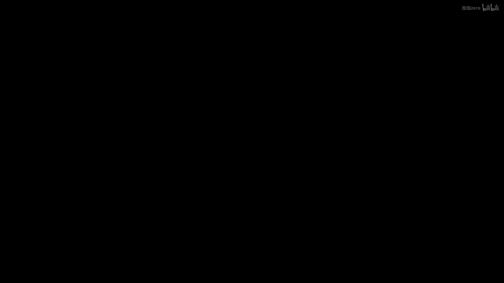
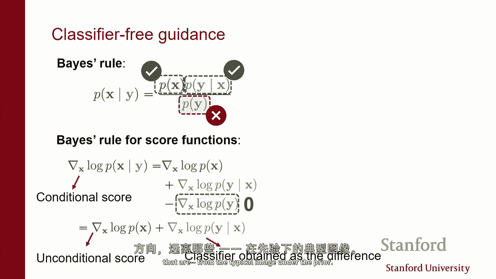
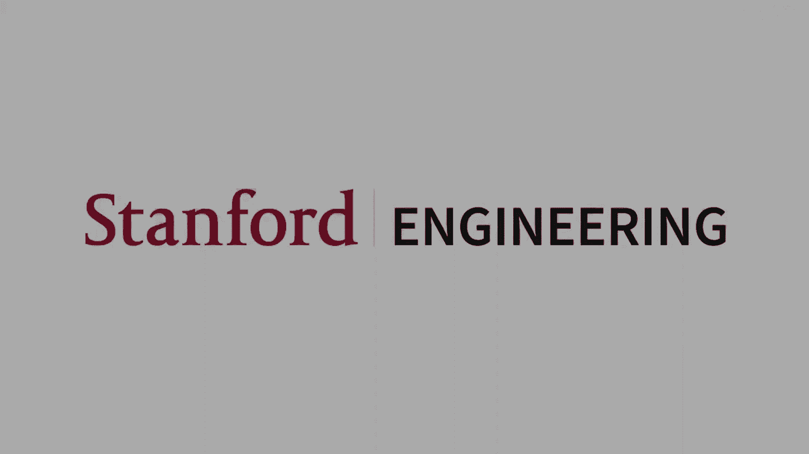

# 【深度生成模型 CS236 2023】斯坦福—中英字幕 - P17：p17 Stanford CS236： Deep Generative Models I 2023 I Lecture 17 - Di - 加加zero - BV1NjH4eYE1v

好的，可以，所以我想我们可以从上次的讲座中结束，继续讨论融合模型，所以已经上了一堂新的讲座了吗，嗯，使用离散变量训练潜在变量模型，但我想我们只是还没有完成这个，而且人们对此产生了很大的兴趣。

也许我们可以浏览剩余的幻灯片，以及与所有高效采样策略的联系，所以所有这些好东西，因此作为一个，作为一个提醒，我们已经看到我们可以认为，分数基模型和扩散中的噪声之间存在这么一种密切的关系，bdpms。

融合概率模型中的噪声，基本思想是，你知道你可以把分数基模型看作是，基本上试图从噪声到数据，通过基本上运行这个更大的动态链，或者我们可以考虑一个过程，它做类似的事情，从变分外编码器的视角来看。

所以存在一个基本过程，向数据添加噪声，你可以把它看作是一个编码器，以及这里的所有转换，xt给定xt-1的Q，这只是一个高斯分布，中心位于xt-1，你只需添加一些噪声即可得到xt。

所以每一步你添加一些噪声，然后最终你添加了，经过多步操作，你已经向数据中添加了如此多的噪声，以至于所有的结构都被丢失，最后，你将剩下链的纯噪声，就像在常规vae中，有一个，有一个解码器。

它是对同一种类型的随机变量的联合分布，我们按反向方向参数化它，所以我们从噪声到，我们有这个序列的解码器，解码器基本上就是这个p theta of x xt - 1，给定xt，所以给定xt。

你试图猜测xt减去一的值，而且这些解码器也在gdpm中，在形式上，这些公式也很简单，因为存在正态分布，而且这个正态分布的参数是通过神经网络计算的，就像在常规rva中，我们看到的是。

我们可以以常规的方式训练这些模型，这是通过优化证据下界来实现的，这实质上试图最小化kl，分布与解码器定义的分布之间的差异，和编码器定义的分布，有点像尝试匹配这两个联合分布，如果你看肘部目标。

你知道它看起来像这样，结果如果你做一些数学，这个目标最终变成了精确的噪声分数匹配目标，所以为了，基本上如果你想学习最好的方法，最好的解码器，猜xt减去一给定xt的最好方法，基本上。

你需要做的事情是你需要学习噪声扰动的数据密度的分数，而我们知道这可以通过解决去噪问题来实现，因此，本质上优化肘部对应于学习一系列去噪器，与，你知道就像噪声条件分数模型本质上一样，并且这有点像，The。

这里的主要事情是，我们可以将整个东西解释为一个变分外编码器，最小化肘部对应于基本上一个噪声和分数匹配目标的和，每个对应于我们在这个链中的不同噪声水平，因此，存在这样的一种情况。

在去噪扩散概率模型中的培训和推理程序非常，与在我总是在分数模型中的程序非常相似，在训练时间，你实际上是在学习一系列去噪器，一个为每个时间步，一旦你有去噪器来生成样本，你做的就是你使用解码器。

就像你在正常vae中一样，并且因为基本上，在解码器中定义的高斯分布意味着的优化方式是加法，本质上对应于得分函数，你做的更新最终看起来非常，非常类似于你在处理更大动态过程的时候做的更新，在每个步骤中。

你基本上都会跟随得分，并且在每个步骤中，你会添加一些噪声，因为解码器是高斯分布，所以为了从高斯分布中采样，你会计算均值，然后，你将向那个向量添加一些噪声，所以，与在大动力学中我们将做的事情非常相似。

再次，你将跟随梯度，你将添加一些噪声，嗯，是的，我们看到的架构也非常相似，但就像我们停下来的地方一样，嗯，上次我们停下来是为了思考它，这是一个数据扩散版本，当我们有无穷多的噪声级别时。

实际上这就是这种情况，所以，而不是有，让我们说，被噪声扰动的数据密度的一千个不同版本，这些噪声的量越来越大，我们可以将这个视为一个连续体，现在由这个变量t索引的分布谱。

你可以将其解释为从t为零的时间开始，所以，就像以前那样，一方面，我们有干净的数据分布，在另一个端，我们拥有一个纯噪声类型的分布，但现在我们有一个连续性，而且这个连续性实际上是有用的。

因为它揭示了模型中像样的额外结构，我们可以利用这些结构来开发更有效的采样器，用于精确地评估似然度等等，所以你可以想象我们讨论的变分视角，就是关于这个连续性过程的某种离散化，我们只关注。

让我们说在这个序列中只看一千个不同的切片，但是我们可以稍微喜欢它，考虑连续版本是有道理的，嗯，因为正如我们将看到，是的，它本质上允许我们做更多的事情，所以当我们再次进入连续版本时。

基本上有一个随机过程描述了从数据到噪声的过程，但在每一步中你都添加一些噪声，就像在前一个例子中一样，除了这样，我们通过思考发生了什么样的过程，可以得到这种连续时间过程。

如果你在之前的视角中采取越来越小的离散化步骤，所以，在我们之前像跳跃一样，我们走了一千个不同步，添加更多的噪音，直到我们到达终点，你可以想象，你可以想象一个从左到右的连续过程，在每个步骤中。

我们都有一个无限小的噪音量，当然，随着时间的推移，如果你集成所有这些噪音，你会得到相同的效果，基本上在数据中摧毁整个结构，嗯，所以正式上，我们处理的这里是一个随机过程，我们有一个随机变量的集合，现在。

这个随机变量的集合，它是一个，在我们之前有无限多个随机变量，假设你有一千个，你有一个vae，你知道，也许有一千层不同的结构，因此你有一千个不同随机变量，一个对应于离散的，你知道，时间步长。

现在我们有无数个随机变量，有一个对应于每个t和t是连续的，所以我可以取无限多个值在零和大写字母t之间，你知道这些随机变量有密度，就像在vae视角中，每个随机变量都有一个与它相关的概率密度函数。

我们发现我们可以描述这些随机变量如何相互关联，通过一种随机金融方程，你可以把它想成，作为一种允许你采样这些随机变量值的方法，你知道，解释这个符号需要一整个季度，和什么是随机微分方程。

但本质上你可以想象这实际上是如果你采取之前的vae视角，并将相邻切片之间的时间步长设置为非常小，非常小，那么dxt基本上就是xt和xt加上delta的差异，就像相邻的切片。

这两个随机变量之间的差异由一些确定的值给出，这就是被称为漂移的，加上一点噪音，无限小的噪音，为了简单起见，我们可以在这里想到一个，你知道，如果你考虑只是添加噪音的过程。

你可以用一个非常简单的方式来描述它，值在时间t处的随机变量与值在时间t处的随机变量之间的差异，加上时间t加上delta t的epsilon是一个小到无限小的噪音，这就是这种方程的真正含义，是的。

所以漂移基本上告诉你你应该如何改变，基本上就像，你可以想象有一些种像速度，如果你考虑动态，嗯像，如果你考虑像xt如何演变，所以xt是，让我们说一张图片，随着时间的增加，像素的值改变，如果没有漂移。

那么变化完全由噪音驱动，这就是我们在这里做的，因为我们将看到，当我们逆转时间的方向时，当我们会看到，当我们逆转时间的方向时，漂移的重要性，因为我们将看到，当我们逆转时间的方向时，漂移的重要性，然后。

实际上考虑漂移就变得非常重要，因为我们想要有一种像速度场一样的东西，推动图像向，我们已知存在较高概率质量的方向移动，因此，需要有漂移，因为如果你考虑如果时间方向翻转，你想要从噪声到数据。

这不是一个纯粹的随机过程，你基本上得像改变像素的值，以一种非常有结构的方式，在其他端生成，一些确实看起来像图像的东西，所以，如果你看到这边，所有的概率质量都像是根据高斯分布分散的。

但如果你想要达到像这样的东西，但所有的概率质量都像是从这里和这里来的，那么你需要有一种像样的像速度，推动粒子，推动这个轨迹去这里或那里，本质上因为你想要有正确的概率质量，另一方面，这是这种特殊情况。

其中漂移为零，结果，这种随机微分方程是捕获这种性质的一种，这种就像是对数据添加一种相对简单的行为，仅仅是添加噪声，更广泛地说，你可能有一个漂移，并且我们将看到，我们需要漂移来谈论反向过程。

但我在这里说的是，对这个过程添加噪声的过程，这就是像前一个vae中发生的事情的一个非常细粒度的离散化，可以被描述为这种简单的像是不同的随机微分方程，其中，dxt是随机变量值的差异。

在一个非常小的时间增量中，仅仅是你想要的无穷小的噪声量，所以，我猜如果你在密度水平上加入高斯噪声，你实际上是在卷积ah，所以这里隐含地进行了卷积，所以如果你考虑密度的形状，就像你有一个密度在这里。

然后你得到，如果你取这里的一个切片，你会得到一个不同的密度，这实际上是前一个密度与高斯核卷积的结果，因为如果你相加到独立的随机变量上，会发生这样的事，所以这里隐含地进行了一种卷积，在密度的水平上，现在。

有趣的地方在于，嗯，我们可以考虑只是改变时间的方向，所以，我们可以认为这个过程是从前一张幻灯片的右向左进行的，所以，从噪音到数据，所以，再次，我们有这些轨迹，它们是从随机过程的样本中提取的，所以。

这些都是这些随机变量的实现，它们是与底层的随机微分方程一致的，如果你能以某种方式从随机过程中采样，那么你就可以通过基本上丢弃所有事情来生成数据，仅仅看到这条轨迹的最终结果，美丽的是。

如果你基本上进行变量变换，因为它有点复杂，因为这是随机的，但本质上如果你应用一个变量变换，并且你交换你替换t为大写的t减去t'，所以你只是简单地翻转时间轴的方向。

你可以获得描述相反过程的未使用的随机微分方程，有趣的是，这个随机微分方程现在有一个漂移项，这是这里的红色项，这是相应扰动数据密度在时间t的得分，嗯，是的，所以这就是，这是一个，这就是这个sd的精确反向。

它第一个词没有漂移项，如果有漂移项，那么在反向sd中你就必须考虑到它，你基本上需要翻转它，嗯，但我们不必这样，这是目前的情况，但你可以包括它，如果你愿意，这有点像最简单的情况，我不必漂移，如果你有它。

你可以包括它，所以在前进过程中，没有漂移，它是纯的，完全由噪声驱动，所以你可以这样想，字面意思，有点像随机漫步，所以每一步，假设它是一维随机漫步，你可以向左或向右移动一些概率，然后经过一段时间，足够大。

你知道你会忘记初始条件，你会得到一个未知的分布，这有点像那个连续时间的版本，在每个步骤中，你移动一点，你移动的量基本上就是这个，这dw，这有点像，你向左或向右移动的量本质上，但是，重要的是在散步中。

你会发现你可以反转它，并且有方法描述这个反转随机 walk，或者你从噪音到数据，它可以被精确地捕获，如果你知道得分函数，所以他们正在精确地描述同一件事，所以这两个都被描述为。

这种轨迹是唯一应该发生的事情，只有一件事已经发生就是我们改变了方向，所以我如果翻转时间的方向，然后你走一种新的，如果你从噪声开始并解决这个sd，你将得到与从数据开始并添加反向噪声时相同的轨迹。

如果你从数据开始并向其添加反向噪声，这两个完全等同于你知道得分函数的程度，所以在这种情况下，你必须走向，因为这个是在尝试从数据分布中采样，所以如果数据分布有一个混合的两个高斯分布，所以有两件事。

我可以添加到两个可能的图像，让我们说，它是或这个或那个，那么你想要过程去那里，我们将看到，这就是这堂课的结尾部分，如何做可控的生成，这是理念，如果你想要只采样其中一个，也许一个是猫，另一个是狗。

让我们说，如果你有一个分类器，它告诉你，如果你在处理猫或狗，这种视角允许你做得非常原则性，所以有相对简单的代数允许你基本上改变漂移，基本上你所需要做的就是你只是基本上应用贝叶斯规则。

并改变漂移以也将你推向可能分类为的轴，让我们说，你想要狗，但可能是被分类为狗的，所以只是改变，基本上有一种原则性的方法来改变漂移，以推动你在某个方向上，这可能是基本上从条件分布中采样的正确方式。

这可能是以一个，它是一个分类器，或者以文本到图像为例，你知道，你有一个分布过图像，对应于标题，现在您想要能够采样具有特定标题的图像，那么你不想必要从训练集中的所有图像的边际分布中采样。

但您想要能够从条件分布中采样，所以我们将看到有方法，有方法可以改变反向de来实际上从不是数据分布中采样，但数据分布的某种版本，让我们说，更偏向于您想要采样的特定标题。

所以这是只与x在给定保证下的梯度有关，实际上有方法可以做，他们也试图估计关于t的得分，它也在尝试估计关于t的得分，哪一个是偏导数，对于t的偏导数结果，你也可以估计出分数匹配类型的损失。

我们实际上有一篇关于，就像是做这些事情，你在哪里，那个好处是，我想很多结构都涉及到，就像，它非常特定于扩散，一种数学，当那个不再成立时，就像，让我们假设，如果你试图在两个数据集之间插值。

那么它就不再有扩散，因此，数学的差异就越大，在这种情况下，你需要与t关于s的梯度相关的得分，如果你有它，你可以做更多有趣的事情，但在这里你不需要，结果，由于福克克-普朗克方程，在正向中。

关于t的梯度完全由这个确定，因为那里没有漂移，这只是一次随机漫步，我们，尤其是，你实际上就是在给数据添加噪声，所以没有特定的方向，比如如果你从数据到噪声，你没有想要偏向的特定方向。

你的项目器指向确定悲伤的分数，是的，是的，是的，正如你所说，仍然有一些噪音，在第二个中，每一步都有一些噪音，我们既有确定性的漂移也有随机噪音，所以它仍然都有，你可以把它想象成如果你将这个离散化。

你将得到，你将在动力学上基本上更大，或基本上相同的声音，DPM的优良程序，在那里，你将跟随梯度并在每一步添加一些噪音，你可以把它看作是对这个的基本离散化，然后基本上你可以做。

在这里你可以构建一个生成模型，啊，通过学习这个，你知道像往常一样，比如，如果你知道这个，嗯，这个得分函数，然后你可以解决这个问题，Sd，生成轨迹，有点像，等这个其他的，我可以让动画再次运行，是的。

所以如果你能 somehow 模拟这个过程，这个必须解决，这就是，然后我们就能在末尾生成样本，但是，要这样做，你需要知道这个红色术语，你需要知道我们现在的得分，我们知道它存在，但我们不知道它的值。

我们通常只能访问数据，所以，你可以通过大致尝试学习这些得分函数来获取生成模型，使用神经网络，就像以前有一个神经网络一样，由theta参数化，对于时间t对应的密度，每个x都试图估计在该x处的相应得分。

所以这与你在dpm情况下的情况相同，你有确切的这个东西，但你只关心，让我们说，一千个不同的时间索引，这些是一千个对原始数据密度的不同视图，你正在考虑一个新的变分外编码器，现在再次。

我们有一个无限的分数函数集合，因为t是ah，真正的啤酒值，你可以像往常一样使用，你可以基本上使用得分匹配来估计这些事情，所以你有像L2回归损失这样的常规类型，试图找到。

确保你的估计在每个轴上的得分接近真实得分，按照两个距离来测量，你知道，平均来说，相对于数据分布，并且每当你想要估计数据加上噪声的分数时，这是我们可以使用噪声得分匹配来做的，本质上，再次。

解决这个训练目标相当于学习一系列去噪器，嗯，而且它不是一千个不同去噪器的集合，它是无限的去噪器集合，对于每个t，但是 again 又是同样的事情，现在您可以做的就是现在可以将其插入到反向时间sd中。

如果你对这个sd进行了离散化，这基本上意味着你知道你只需要离散化时间，离散化时间轴，所以，你只需要看，你知道，而不是dx，你有xt加上一减去xt本质上，然后你积分这个随机微分方程，你又得到一种。

更新规则，本质上是一样的，这与ladynamics非常相似，每一步，跟随梯度，然后添加一些噪声，这是同一回事，即拉因动力学，跟随得分，添加一些噪声，而且你可以把这个过程想成基本上在尝试，你知道。

从噪声开始，然后你在尝试计算这个红色曲线，以得到对数据点的良好近似，你知道我们正在处理一个计算机，所以你不能像我们真正连续的时间过程一样处理无限，所以你必须离散化时间，你必须离散化时间轴。

你可以尝试像近似这个红色轨迹一样，基本上使用泰勒展开，这就是这个东西的本质，只是一个泰勒展开到你应该做的事情，这就是dpm做的事情，所以dpm基本上有一千个不同的时间切片。

然后您将尝试像近似这个红色曲线一样通过步骤，根据以下基本原则，这个白色箭头，对应于从解码器中的一个采样，违背了dpm类型的模型，因为你知道你基本上是在离散化时间，所以有一些错误正在发生。

会有一些数值错误可以随着时间的积累而累积，你可以想象一个基于分数的模型，Mc mc基本上做什么，试图使用更大的动态来从对应于那个时间的密度中获取一个好的样本，因此，你可以实际上结合dpm的采样程序。

或者与基于分数的模型的采样程序，你知道你会增加计算成本，但你可以得到对这个随机微分方程解的更接近的近似，这是由连续时间定义的，这个观点的一个好处是，你可能想知道为什么，我们为什么要通过所有这些。

这是因为有一种方法可以获取到一种等效的类型，或者基本上有一种方法可以将sd转换为普通微分方程，没有在每个步骤中添加噪音的地方，因此，基本上相当于将vae转换为流模型。

因为这本质上就像是一种无限深的vae，其中存在大量的，你知道，随着你沿着这条轨迹前进，你像是在从许多不同的解码器中采样，是的，vae的解码器是随机的，所以，你在每个步骤中都会添加一些噪音。

如果你考虑一个完整的模型，这将是确定的，所以，只有前期存在随机性，这基本上是这个过程的初始条件，但是，动态是完全确定的，所有的变换都是确定的，这也表明这是可能的，因为我们有连续时间，这种形式的表述是。

如果你不使用它，那么你有一个基于分数的模型，所以，如果你只是不使用预测器，你只使用校正器，那么你有一个基于分数的模型，如果你只使用预测器，那么你有一个dpm，如果你使用两者。

你将获得一种稍微更昂贵的东西，它实际上可以给你提供更好的样本，因为它更接近于基本下潜曲线，这是你真正想要的，基本上回忆一下，基本肘部目标实际上是试图基本上反转，解码器试图反转坦克。

编码器和解码器被迫是正态的，只是由定义决定的，嗯，基本上真正的去噪过程并不一定是正态的，你实际上会得到的去噪过程，如果你真正反转了去噪过程，所以，无论你多么聪明地在选择，正态解码器的均值和方差。

你可能总是存在一个与肘部相关的差距，在编码器和解码器的逆向之间，这意味着你可能不，这意味着肘部不是紧的，这意味着你现在正在完美地建模数据分布，他们只是从另一个角度看待这个问题的数学是。

只有在连续时间的极限中，基本上一个无限大的数量的步骤，有可能基本上得到一个紧的肘部，如果前向过程是正态的，反向过程也是正态的，所以你不会失去任何东西，但基本上假设解码器是正态的。

但是那只有当你真正有一个无限的步骤数时才真的正确，所以只有在连续时间下才正确，所以预测器只会取一步，校正器只是使用nin来尝试从对应于该密度的样本中生成，所以现在你仍然会做，让我们假设一千个不同步骤。

但不是像，在这种情况下，我想我展示了三个步骤，实际上，你将有一千个不同的这种宽箭头，"酷"，所以，有趣的地方在于你知道，到目前为止，我们已经在讨论随机微分方程。

"我们拥有你认为在前进或后退的道路上的道路"，"从数据到噪音，或者从噪音到数据啊"，"结果发现，定义一个过程是可能的"，"动态完全决定论"，"而且从意义上来说，相当于"。

在每个时间步长处得到的密度与你将得到的密度相同，"通过解决随机微分方程"，或者在正向或反向的时间中，所以我们基本上有两个不同的有随机过程的过程，一个是基本上你有一个随机的初始条件，然后有确定性的动态。

那些是你看到的白色类型的轨迹，另一个是开始时有随机性，然后我在每个步骤中，而且在意义上，过程是相同的，即对于你想要的任何切片，所以对于每个时间索引，边缘分布都是相同的，所以如果你看。

你知道你如何频繁地看到白色箭头，白色线与通过点的彩色线相比，如果我们得到完全相同的密度，包括在时间零，这是我们关心的一个，这是数据基本对应的标记，所以这意味着我们可以基本上，嗯定义一个完全确定的过程。

像我们之前说的，这实质上相当于将vae转换为流模型，所以在vae中，你将有这个过程，每一步你都可以从解码器中采样，它具有随机性，在流模型中，你有所有这些层，它们只是通过一种可逆的变换来变换数据。

这基本上在这里发生了什么，我们做的是，我们将模型转换为一个无限深的流模型，一个连续时间正态化流模型，在存在无限序列可逆变换的地方，基本上对应于由这个普通微分方程定义的动力学，所以这里的区别是。

如果你看看这个方程，这不再是随机微分方程，现在每一步都没有添加噪声，我们这里只有漂移项，并且没有任何绝对噪音添加，在采样过程中，再次，你可以看到，你需要的唯一东西，为了能够定义这个普通微分方程。

我们需要定义一个得分函数，所以，如果你有得分函数，或者序列的得分函数，一个为每个时间步，那么，你可以等价地从你的数据生成数据，通过解决一个普通微分方程，从你的数据分布中，所以，你只需要知道。

基本上再次初始化这个轨迹，翻转时间方向，你通过从先验中采样来采样初始条件，这是通常的纯噪声类型的分布，然后，你跟随其中一个宽轨迹，最后你得到了一个数据点，这正是你在流模型中从先验中采样时通常会做的事情。

然后你进行变换，嗯，使用确定性和垂直的变换来获取一个数据点，所以这就是你通常会做的事情，嗯，我们有这个，嗯，不，这是一个过程，我们可以把这基本上看作是一个连续时间的正态化流，而原因在于，嗯。

你知道这确实是，或者在直观的，你之所以可以把这看作是一个，作为一个正态化流是因为这些普通微分方程有一个唯一的解，所以基本上这个啊，白轨迹，它们不能相互交叉，它们不能重叠，这意味着存在一种可逆的映射。

这种映射从这里延伸到这里，并且是由我们普通微分方程的解定义的映射，在满足某些技术条件的情况下存在且唯一，所以您知道，我们可以把这看作是一种非常灵活的流动模型，其中可逆的映射由我们普通微分方程的动态定义。

动态由神经网络定义，所以它是神经ode，如果你看到这种模型，一个神经常微分方程，所以它是一个深度学习模型，其中计算由解决常微分方程得到的结果定义，动态由神经网络定义，在这个情况下是得分函数。

ode等于sd，所以他们在每个步骤都定义了相同的分布类型，所以你在这个结束时得到的分布，所以t是大于等于t0的时间，与你仅仅添加t0时得到的分布完全相同，我们正在做一个随机漫步，你在每一步都添加噪声。

这是真的，如果你在每个步骤都有精确的分数函数，这在实践中从未发生过，但到你有精确的分数函数程度，这是sd和ode之间的映射是精确的，所以它们被精确地定义为相同的，这是一个与边际分布相同的不同随机过程。

另一种思考方式是，你在本质上参数化了随机性，所以记住，当我们采样时，我们正在考虑变分推断以及如何前向和后向传播，基本上编码器，就像随机和计算，嗯，我们展示了从高斯分布中采样是可能的。

通过基本上将一些简单的噪声转换为确定性的变换，在这里发生的某种意义上是，我们正在重新参数化，有一个计算图，我们在每一步中都添加了随机性，我们定义了一个相当等价的计算图，我们将所有随机性放在初始条件下。

并且我们在改变它，确定性的，而且嗯，他们做了，这里的关键点是映射是可逆的，因为如果你考虑普通的微分方程，我不知道当存在确定性动态时，所以无论你在哪里，原始的微分方程会将你推向下一个基于动态的位置。

并且没有他们那种分叉，只有最大值一个，通过解偏微分方程得到的状态阶段，因此，两件事情不可能交叉的可能性也没有，我们可以通过基本上从大T反向到零来倒置它，这是从噪声到数据的过程，这对嗯，有几个原因。

主要的一个是，我们现在可以思考，如果你认为这个过程是从一些先验，通过可逆映射将简单前向高斯分布应用于数据，再次是一个归一化流，所以，你可以做，实际上，你可以计算任何x或任何图像的数据点的似然性。

通过使用特殊的变量变换公式，就像在常规流模型中，如果你想在流模型下评估x的似然性，你会做的事情是，你会反转流，以进入先验空间，这在这种情况下对应于解决ode的反向问题，并找到那个潜伏空间的对应点。

在先验和先验已知的情况下，对该点的可能性进行评估是固定的，因此我们可以高效地完成，然后，像往常一样，你需要跟踪变量变化的公式，第一段，因此，你需要跟踪体积是如何压缩或扩张的。

当你通过这个普通微分方程变换一个数据点时，我们在积分它，所以看起来像这样，所以，你需要积分，所以，它是，这是一个普通微分方程，所以你可以想象，如果你把它离散化，你知道得分会给你提供你应该移动一点的方向。

然后然后你需要重新计算它，所以所以你仍然需要某种方式在计算机上解决一个普通微分方程，这涉及到网格化，但你得到的是，人们已经花费了五十年或更多的时间开发解决得非常好的方法，或者有微分方程是非常高效的像。

有非常聪明的方案来选择步长，非常聪明的策略，用于减少您获得的数字错误种类，从左到右移动，并且所有的机器都可以被使用并且已经被用来基本加速采样，生成更高质量的样本，这就是主要原因之一，这种视角如此强大。

因为一旦您将采样减少来解决ode，您突然可以获得许多真正的，真正的聪明技术，人们已经开发出来，来产生对或闪光灯的优良数值近似，如果您记得，你可以把dpm看作是一个具有固定编码器的vae。

它恰好具有相同的维度，这对于在实际中使方法工作非常重要，我们将在几页幻灯片中讨论潜在未来模型，嗯，这基本上更拥抱va的视角，你说得对，让我们有一种第一种编码器和解码器，它将数据映射到一个更低维的空间。

然后在那个潜在空间中学习那个扩散模型，因此，你获得了两种世界的最佳结合，你在两个方面都降低了维度，并且你可以仍然使用这架机器来，但我们并不实践工作工作效果很好，有这个。

福克克计划方程基本上在告诉你密度如何变化，它是一部部分微分方程，关联了pt的偏导数，基本上pxt的偏导数，所以x的概率随着改变而变化，T有两个空间导数，这实际上是雅各比矩阵的迹，因此。

这就是为什么事情会成功，这就是你如何从sd转换为odd的实际方法，你基本上只需要通过普朗克方程工作，就像一切都依赖于这种扩散，隐藏在融合结构之下，嗯，但是，嗯，我在这里看到的是。

你可以使用与原始变化变量公式非常相似的东西，我们在流模型中使用的那个公式，实际上使用这些模型来计算精确的似然度，再次，基本上，如果你想要评估数据点x0的概率，你会解决ode逆向，所以从数据到噪声。

你会得到xt，我们将评估该潜在变量在先验下的概率，这就是这一片，然后，你需要看，嗯，基本上，轨迹上体积是如何变化的，不再需要查看雅各比矩阵的 determinant，你需要看，它。

发现你需要做的实际上是，你需要积分雅各比矩阵的迹，这是一个你可以实际上高效地评价的东西，这就是一致性模型的基本概念，有一种模型是由年轻的人开发的，实际上在open ai，他们基本上在做的是。

他们试图学习一个神经网络，直接输出ode的解在一步，因为存在一个底层ode，所以有，有一些聪明的目标，你可以用于训练神经网络，但是，这就是像，我们将看到，一旦你从这个角度看待问题，你可以提炼出啊。

然后你可以得到非常快，有点像利用这 underlying ui 视角的采样程序，你只是在尝试解决什么，并且有很多技巧你可以使用来获取非常快速的求解器，嗯，但你得到的一个好处是你可以计算似然度。

所以你可以将 va 转换为流模型，然后你可以计算似然度，所以好的是一旦你 kind of like，学习得分一次然后它就打开了，有许多不同的方法 kind of like 在推断时使用得分来生成样本。

所有这些都有效地生成样本，sda仍然有价值，在某些情况下，它实际上可以生成更高质量的样本，原因是如果你考虑当你解决ode时发生的事情，你基本上有，你开始与纯噪声，然后，你跟随ode的实质来。

试图近似这些轨迹，但是，你知道，让我们说，恐龙不是完美的，而你在做一些小的错误，然后你在这个轨迹的中间看到的那种图像，它们应该看起来像数据加上噪声，但它们不太可能完全是数据加上噪声。

因为你的得分函数并不完美，所以然后你开始喂入，你的数据稍微不同于你在训练期间在你的去噪器中看到的那些，这是你的得分模型，所以你将有累积的错误，你输入到你的去噪器的图像。

这基本上是你按照这个轨迹得到的东西，并不完全是你为训练模型使用的那些，这是你直接从数据中得到的，到数据加上噪声，但只是实际上在你的数据上加噪声，所以如果你考虑sd，另一方面。

你实际上是在每个步骤中都添加了噪声，这是好的，因为你正在使输入给去噪器，看起来更像你在训练时看到的那些，问题是解决sd高效率要困难得多，所以嗯，如果你想快速采样，从od视角来看，工作起来更方便，是的。

所以你可以得到似然度，嗯，你需要做的就是基本上解决一个ode，你在其中 kind of like，通过这种方式解决时间上的积分，你可以实际上调用黑箱或求解器，嗯，然后，我们可以计算这个量。

结果发现它非常具有竞争力，所以，尽管这些模型没有通过最大似然进行训练，所以它们没有作为流模型进行训练，它们没有作为流模型进行训练的原因，因为可以，从原则上来说，你可以尝试优化，嗯。

你可以最大化精确的最大似然，正确，因为你可以尝试在你的数据集上评估这个表达式，并作为theta的函数进行优化，但它在数值上非常棘手，非常非常昂贵，因为你必须求导，通过od求解器。

因为你需要对参数theta进行优化，使得od求解器的结果给你高概率，这在实践中极其困难，所以你不训练最大似然模型，你仍然通过分数匹配来训练它，但是仍然能得到非常好的结果，非常高的可能性。

就像你可以实际实现一样，这在图像数据集上达到了最先进的结果，嗯，因为嗯，嗯，是的，不清楚为什么，但是嗯，我的意思是，嗯，我们大致知道为什么，因为正如我们所见，类似得分匹配有一个肘部解释，所以。

由于通过解决这个问题进行匹配并不太令人惊讶，但是，通过匹配梯度，通过做得分匹配，你像是在优化一个肘部和证据下限，所以，这不太令人惊讶，可能性很好，嗯，但是是的，在可能性方面，结果非常非常好，嗯。

你可以做的另一件事是，你可以获取加速的样本，特别是，嗯，经常被用作采样策略，而不是必须通过，让我们说，一千个不同的去噪步骤，这是你如果使用dpm类型的模型会做的。

基本上你可以做的事情是你可以粗略地离散化时间轴，假设你只关注三十个不同的阶段而不是一千个，然后你走大步，基本上你承担大任务，你将付出代价，因为你知道会有更多的数值误差，嗯，但是嗯，它快得多。

在实际应用中，这就是人们使用的，而且还有一点，你知道你可以比这聪明一点，因为存在一些特殊的结构，就像旧的一部分是线性的，所以你实际上可以解决它以封闭形式，但本质上这就是你如何快速采样。

你只需要粗略地离散化时间轴，并且你走大步，所以你可以生成图像，嗯，而不是做一千步，你可能只需要做三十步，这就变成了一个你可以用来决定你想要使用多少计算的参数，你想要使用，在推理时间你想要投入多少努力。

你走的步数越多，对ode的解决方案就越准确，但当然，步数越多，实际上就越贵，只是澄清一下，没有，没有对ode和sd的得分函数，"只有单一的得分函数"，"数据密度加上噪声的得分函数是什么"，"因此。

情况就是这样"，无论你从哪个角度看待，"你获得的边际效应是"，"两种观点相同"，"因此，得分相同"，"他们总是通过记分来学习"，"这是推理时间"，你可以做不同的事情，在推理时，你可以解决sd。

你可以解决od are，但是分数是一样的，这是一种得到非常快速采样的方法，现在有很多更好的方法，我意思是有很多其他种类的聪明的解决方法，解决普通微分方程，人类的求解者，像一半，你在哪里走半步。

人们对于解决常微分方程的数值方法开发了许多聪明的想法，相对较小的计算量就能相当准确地解决，是的，这可以给你非常高，非常非常快的速度提升，而且样本质量相当，你可以做另一个有趣的事情，实际上你可以使用并行。

这是我们最近在论文中讨论的，使用这些复杂的ode求解器，这些基本上是并行在时间上，相反，而不是试图计算物体的轨迹，一步一个脚印解决ODDE，这就是DPM会做的，你大概喜欢。

尝试利用许多许多GPU来猜测整个轨迹，所以，而不是一步一个脚印，试图找到对真实底层轨迹的良好近似，你使用多个GPU来大致清除大量的图像，基本上，一组并行处理的图像，所以。

如果你愿意为了速度而牺牲更多的计算，实际上，你可以得到与单独步骤计算时相同的解决方案，如果你选择逐个步骤进行，使用大量的并行计算，但在大大减少的，类似于的墙钟时间，所以，我不会深入探讨这个问题。

但基本上，有一些技巧可以用于再次使用，将所有求解器高级化以进一步，加速采样过程，让我们看看是否能够得到，基本上你做的事情是，而不是按照dpm一步一个脚印走，试图计算轨迹，这就是你看到的棕色点，移动。

我们做的事情是，我们使用多个gpu并行计算轨迹的一部分，所以这是一种基本上通过交换计算来换取减少的，嗯，墙钟时间，嗯，另外一件事你可以做的就是蒸馏，嗯，基本思想是，你可以把dim视为教师模型。

所以你有一个dm模型，它将计算，假设，基于时间轴某种形式的离散化，ode的解，然后你做的是，你训练一个教师，一个学生模型，基本上在一步中做，dim在两步中做的事情，我也是这样，也许从这里到那里。

再从这里到那里，需要两步，然后从这里到那里，也需要两步，你可以训练一个单独的学生模型，这是一个基于分数的另一个模型，它试图跳过并做，基本上它试图定义一个新的分数函数，这样如果你按照那个分数函数走一步。

你将得到与如果你按照原始分数函数走两步相同的结果，在降维的情况下，如果你按照原始分数函数走两步，那么再次，这就像是试图从奥德赛中提炼出解决方案，根据不同的方法或找到另一种类型的奥德赛。

这将给你相同的解决方案，但在使用较少的步骤，然后你做的就是递归应用这个，所以然后您使用新的学生根据模型作为教师，您将得到另一个学生，试图在一步中完成，但另一个东西在两步中完成。

这将成为原始模型的四个步骤，您一直这样做，直到可以提炼到非常小的步骤数，所以这些是一些结果，并不是完全一张地图，但这些是我们最近关于这种渐进式蒸馏的一篇论文，所有这些都在文本到图像模型上。

这是用于稳定性的ip稳定扩散，实际上，你可以，让我们说，你可以在这里看到，图像在两步或四步或正确的步骤中生成，通过蒸馏原本有一千步的模型，并基本上使用这种技巧，将一半减半再减半。

"直到你走到两步四步或八步"，"而且，你可以从质量上看，它是相当不错的。"，"样本质量"，"当然，这当然更加高效"，"这也很诱人去想象一种一步生成"，"一致性模型直接尝试做到这一点"，"嗯，而且"。

"在一步之内"，嗯，"因此，他们直接尝试学习一种从类似于的类型到类型的映射。"，在这个渐进式蒸馏的末尾你将得到什么，他们用一种不同的方法来做，所以没有渐进式蒸馏，嗯，他们基本上只做一次。

但他们试图得到一种非常相似的结果，嗯，很酷，所以，哦，是的，蒸馏是一种好方法可以快速获得样本，还有一种叫做一致性模型的东西，本质上，我认为你可能已经看到了稳定性，我最近昨天发布了一个模型。

我认为在实时情况下，允许你做实时生成，或者是像这样，一些一些一些分数蒸馏的版本，再加上一些gan，他们放进去，但它基本上是这种东西的组合，再加上，而且他们显然能够生成到一个模型，如此快速。

那就是基本上每次你输入，这是一个文本到图像模型，你可以输入你想要的，它会生成你，并且使用实时，我们现在在这里，并且，嗯，说出去有稳定的分布在稳定性上，AI嗯，他们做的和我们一直在谈论的之间的关键区别。

是他们使用潜伏用户模型，实际上他们做的事情是在他们添加额外的，如果你把你的模型视为vae，他们做的事情是在他们添加另一个编码器和解码层在开始，嗯，这个编码器和解码器的目的，是减少数据的维度，所以。

而不是必须做，嗯，这个通常模型在像素上，你做，你训练一个扩散模型在编码器的潜在空间上，我们的外编码器，或变分外编码器，但实际上你可以想，正在发生的事情只是额外的，如果你考虑层次化的vae。

你只是添加额外的，嗯编码器和额外的解码器在堆栈的末尾，这些蒸馏模型实际上是蒸馏的潜在扩散模型，所以，你可能想要这样做的原因，是因为它训练模型更快，这是他在低分辨率的图像上，或者从记忆的角度来看。

低维数据，所以实际上训练扩散模型更快，如果你能以某种方式训练它，而不是在原始像素空间上，但你可以在某种低维表示空间上进行训练，并且这个优势是，如果你从这个角度看，你现在可以突然使用融合模型。

实际上用于任何数据模式，包括文本，所以，如果一些人尝试在文本上的扩散模型，实际上采取这个视角，所以你从离散输入开始，X，然后编码它们到一个连续的潜在空间，所以，如果一些扩散模型人们尝试在文本上。

实际上采取这个视角，所以你开始与离散输入，X，然后编码它们到一个连续的潜在空间，然后，你用解码器将它们解码回来，然后，你在潜在空间上训练扩散模型，现在是连续的，所以，数学计算得出结果，当然。

这仅在原始编码器和解码器做得相当好的情况下有效，但基本上，它是重建数据的，嗯，是的，稳定扩散做什么，他们实际上预先训练了外部编码器，所以它不是端到端的训练，即使你可以，因为它只是VAE。

所以你实际上可以端到端训练整个东西，他们做的是预先训练外部编码器，他们真正关心的只是得到良好的重建，所以他们不太关心我们的，潜在空间的分布应该类似于高斯分布，他们只关心得到良好的外部编码器，本质上。

然后在一个单独的阶段，他们保持初始外部编码器固定，他们只是训练扩散模型在潜在空间上，嗯，这工作得非常好，这些都是他们，你知道的，他们用这种方法取得了很多成功。

他们是第一个在大量在线数据集上训练大规模模型的人，例如，大量图像数据集，这种方法已被社区广泛采用，人们甚至成功地训练了未来模型在像素空间，但最成功的版本通常要么是在潜在空间上，要么是图像的下采样版本。

所以他们有一种像是这样的，编码器和解码器更像是降采样和放大，但本质上，树可以训练一个模型或低分辨率的，是的，你实际上可以做的就是，我可以在你的数据集上进行编码吗，然后假装。

但数据是来自原始编码器的任何输出，然后在这个上训练你的用户模型，你得到的任何东西，他们使它们规范化，接近高斯分布，如果我记得正确的话，但它是一种非常弱的规范化，他们真正关心的只是重建。

如果你考虑肘部作为重建，再加上匹配先验，所以，如果你认为肘部是重建，再加上匹配先验，他们对匹配先前的并不在意太多，因为他们实际上不是从那里采样的，嗯，本质上他们有一个，他们使用扩散模型作为先验。

并且扩散模型可以生成任何东西，这是一种非常强大的先验分布，所以你不需要对vae进行正则化来有一个在潜在空间上的分布，因为这是接近高斯分布的，因为无论如何，然后你将一个vae拟合到从该区域出来的任何东西。

你将将这个扩散模型拟合到这个编码器的输出中的任何内容，最初是ae，因此，实际上没有必要进行如此多的正则化，嗯，也许它们有点像两个先验，所以，如果你只是考虑从高维到低维数据的基本迷你。

你可以在那里有一个先验，当你预先训练这个模型时，但由于你不会真正使用那个模型来采样，对扩散模型的先验匹配并不真正关心，这个先验在这里是通常的高斯，所以，你学习的扩散模型是。

初始自编码器的潜在空间有一个高斯先验，如何将文本输入到这些模型中，并且有几种方法可以做到，假设你有一个数据集，它不仅仅是x图像，而是图像和标题，我用y来标记标题这里，因为它也可能是类别标签。

让我们说确实，你正在尝试做的事情是，你试图不学习x逗号y的联合分布，因为你不关心生成图像和对应的标题，你只关心学习图像的条件分布，给定相应的标签或给定相应的标题，x的分布，y，嗯，本质上，嗯。

如果你想为这个使用扩散模型或基于分数的模型，这归结为学习给定y的条件分布x的得分函数，因此，现在得分函数或去噪器需要，像往常一样，输入x和t，其中x是一张噪点图像，它需要输入t，这是扩散过程中时间变量。

或sigma水平，你添加到图像中噪声的数量，现在基本上，去噪器或得分函数得到这个，嗯，额外的输入y有额外的信息，所以去噪器知道图片的标题是什么，并且允许利用这一信息，在尝试猜测噪声水平时。

或者等价地去噪图片，因此在某种意义上，你可以把它看作是一个稍微更容易的问题，因为嗯，去噪器有访问标签y或标题y的权限，在试图去噪图片时，因此，它就变成了设计适合架构的问题，你在单位中输入，你输入茶。

你插入图像xt，然后你需要插入y，这是，让我们说，一个标题进入架构，如何做，它将是，例如，你有一些预先训练的语言模型，它能够以某种方式将文本映射到一个向量表示标题意义的表示，然后您将其集成到神经网络中。

有各种方法可以做，但可能通过某种交叉注意力，有不同的架构，但本质上，你想要在你的神经网络架构中添加一个标题相关的额外输入，这是最基本的做法，那就是你只是训练一个条件模型，现在，有更有趣的事情。

我认为是当你想要控制生成过程时，但你不想训练一个不同的模式，所以想法是您可能已经训练了一个生成模型过图像，让我们说，有两种类型的图像，狗和猫，然后让我们说，我们现在只想生成回问题，我在课堂上最初被问到。

如果你想要生成只有狗的图像，所以如果你有一些分类器，P of y given x，它可以告诉你一个图像x是否对应于标签狗，如何生成一个被标记为狗的图像x，与标签y等于狗数学上相同。

我们要做的就是我们要结合这个先验分布，P of x，与这个似然度，P of y given x，让我们假设是由分类器给出的，我们要做的就是我们要从后验分布中采样，X given y。

所以我们知道我们想要一只狗，我们想要从给定标签为狗的条件分布中采样x，如果你记得，给定y的条件分布x是完全由p(x)决定的，并且p(y|x)通过贝叶斯规则得到对吧，这个逆分布是通过嗯。

但是你在那里看到的那个方程，那就是基础规则，所以你，如果你想得到p(x|y)，你乘以先验与似然，然后归一化以得到有效的分布，所以当知道这里分母在原则上时，你可以通过在x上积分来获得它对吧，嗯。

所以你在分子中有p(x，y)，在分母中有p(y)，这是你如果对所有可能的x进行积分时得到的，x是p(x，y)，所以一切都完全取决于先验和这个分类器，所以理论上，如果你有一个预先训练的种类，让我们说。

图像的生成模型，有人给你一个分类器，你有所有必要的信息来定义给定y的条件分布x，这只是一个使用贝叶斯规则的问题来计算那个表达式，不幸的是，嗯，尽管理论上你有先验的访问权，你有似然的访问权。

计算分母通常是困难的部分，它与能量基模型中的正则化常数计算问题相同，基本上它需要一个x的积分，你不能真正计算它，所以实际上，尽管一切都被明确定义，并且你有所有必要的信息，但它是不可行的。

但如果你工作在分数的水平上，所以如果你对那个表达式的日志的梯度进行计算，你得到逆分布的分数是由先验的分数，似然的分数，以及我们有这个术语，这是正则化常数的分数，就像在能量基模型中一样。

记住那个术语趋于零因为它不依赖于x，所以基本上如果你在工作在分数的水平上，你需要做一些简单的代数来获取，后验的分数，就是简单地将先验的分数和似然的分数相加，是得到后验的分数，这意味着，基本上，嗯。

当你把那个看作是de或颂歌时，你所需要做的就是，你需要仅仅替换前一个的得分与后一个的得分，实际上你所需要做的就是如果你知道前一个的得分，你有一个预训练的模型，假设你有一个分类器能够告诉你。

给定x的标签y是什么，只要它可以以x相对于该对象的梯度，这基本上意味着如果你有一个，让我们说一个图像分类器，你只需要能够以输入相对于分类器的梯度，然后您只需将它们相加，并且您就有后验的精确得分。

所以如果基本上你做拉格朗日动力学，或你解决sd或od，而不是跟随先验概率的似然梯度，你跟随先验概率的似然梯度，再加上你做对事情的可能性，所以直觉上，如果你考虑动力学，你做的事情是。

你试图跟随增加图像可能性的方向，相对于先验，但同时，你试图确保分类器会预测，该图像属于狗类，所以你只是在改变ode中的漂移，将样本推向将被分类为狗的样本，实际上，你需要根据x t有这个分类器。

这就像图像的噪声版本，但是，大概，如果你有一个潜在变量模型，那么，它稍微复杂一些，因为你还要通过原始的编码器和解码器，但如果你在像素空间工作，这可以使用，我们已经用它来做了许多事情。

比如你可以用它来做编辑，嗯，你知道，你想要从笔触到图像，基本上，有可能定义一个封闭形式的正式模型，你可以跟随它，你可以做图像合成，或者如果y是标题，然后你有一种图像标题网络。

你可以引导生成模型向一个产生一致图像的模型，这将以特定的方式标记，你可以使用它来进行有条件的生成，你需要文本生成，而且等等，实际上你也可以得到医疗影像问题，其中可能性由机器的工作方式指定。

就像MRI机器的工作方式，而且为什么它有点像你从机器中得到的测量，然后你可以尝试创建一个可能在先验下可能的医疗图像，并且与机器从你中得到的特定测量一致，所以许多有趣的问题都可以用这种方式解决，是的。

而且，甚至无分类器的指导基本上基于这种想法，我想我们没有时间去详细讨论它，但本质上，嗯，这是一种技巧，本质上是通过将分类器视为两个扩散模型的差分来获取分类器，但在实践中，基本上是同样的东西。

你可以简单地用在清洁数据中工作的分类器来近似它，通过使用linoiser从噪声到清洁数据，然后使用分类器，在某些情况下，它可以在封闭形式中完成，或者你可以做这种技巧，基本上训练扩散模型。

一种依赖于某些侧的信息，信息，一种不依赖于的，然后你可以通过取两个的差值来隐式地获取分类器，这就是自由指导的分类器所做的，这在当前最先进的模型中广泛使用。

但本质上他们通过取两个扩散模型的差值来避免训练分类器，所以他们训练一个，让我们说那是给定y的x的概率，那就是一个仅接受描述y的扩散模型，然后他们还有一个基本上不看描述的模型，然后采样的方式你大概喜欢。

推动模型成为，朝着与给定描述一致的图像方向去，从典型的图像下的前验中的来的图像。

