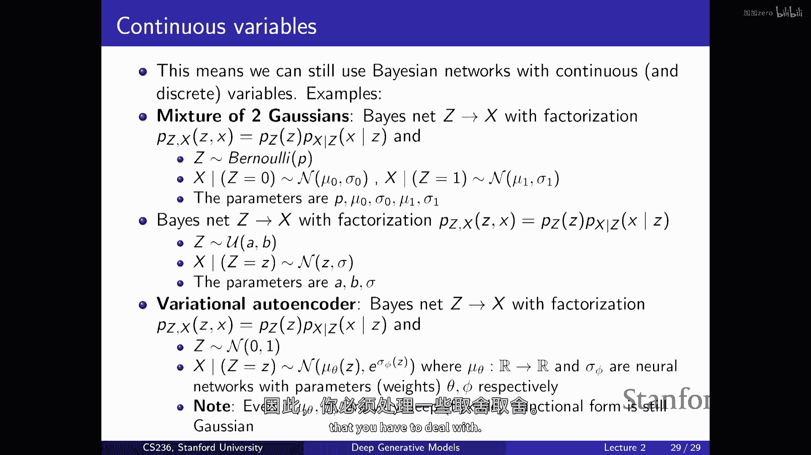

# 【深度生成模型 CS236 2023】斯坦福—中英字幕 - P2：p2 Stanford CS236： Deep Generative Models I 2023 I Lecture 2 - Back - 加加zero - BV1NjH4eYE1v

欢迎来到第二堂课，今天的计划是谈谈生成模型的基本概念，我们将看到，就像遇到第一个挑战一样，每当我们要构建一个复杂的数据集生成模型时，如图像和文本，这是你可能在其他机器学习课程中见过的维度诅咒。

所以今天的计划是讨论一些，在非常高的层面上，人们想出的各种方法，来处理维度诅咒，所以我们将进行一个关于图形模型的简短概述，这有点像我用于做类的cs代码，或者将其压缩为一个讲座或半讲座的部分，然后。

我们将讨论一些区别，生成模型和判别模型之间的区别，这又是你在机器学习课程中可能见过的东西，最后，我们将进入深度生成模型的深度部分，并且，我们将开始看到如何使用神经网络，来处理维度的课程，好的。

所以这将是一个类似于高层次视图的东西，高层次概述，大致对应我们在这个课程中要讨论的很多想法，在这个课程中，它类似于处理学习生成模型的这个问题，你遇到的挑战类型，以及你可以以不同方式解决它们的方式。

通过改变不同的部分，就像在这个图中你将看到的一样，你将获得不同类型的生成性修改，你可能获得反向退化模型，像通常用于语言的那些，你可能获得扩散模型，生成对抗网络，这种东西，通过改变成分变成这种高级视图。

所以这张图片将在本季度中出现几次，它 kind of 处理你的基本问题，每当你想要训练一个生成性模型时，所以基本问题是一个你被给予一组示例的情况，这可能是图像，或者它可能是你在网上收集的句子。

或者它可能是，我不知道，DNA序列，它可能真的是任何东西，嗯，假设是你有访问的数据点，它们是来自我们通常表示为p data的未知概率分布的样本，这有点像数据生成过程，这有点像一个复杂的未知过程。

它已经为你生成了数据，所以，假设你所有可以访问的数据点都与彼此相关，因为它们来自某个真实的底层数据生成过程，你知道，在语言的情况下，这可能对应于，也许如果你有一个从互联网上收集的文本语料库。

这可能对应于人们在网站上或您从任何网站上收集数据集时写作的不同方式，您已经爬取了这些数据，或微对应，到产生我们图像自然分布的复杂物理过程，这里的关键点是数据分布p data是未知的。

你知道你假设存在这样的对象，但你只有有访问这些例子的权利，是这分布的一些样本，在这个类中，整个问题，以及在生成模型的空间中，和生成AI中，基本上是来提出一个这个数据生成过程的好近似。

因为想法是如果你有访问，这个数据生成过程的好近似，这个数据分布p data，然后你可以从这一近似中采样，并生成新的文本，或如果你有一个图像分布，然后你可以从分布中采样，并生成新的图像，它们。

希望与您用于训练我们的模型时的图像相似，到你做得好的程度，来提出一个这个数据分布的好近似，希望您的样本也是好的，所以为了做到这一点，您需要定义一个模型家族，就像这里在绿色中的集。

你可以把它想作为一组不同的概率分布，这些分布被索引或参数化为这个变量theta，所以可以想作为你可以通过改变均值和协方差来获取的所有可能的，高斯分布。

或你可以通过改变神经网络的参数来获取的所有可能的分布，对，一旦你定义了这个集，目标就变成了在这个集中找到一个对数据分布的好近似，所以为了做到这一点，您需要定义一些距离的概念，所以你需要定义一个损失函数。

您需要指定您关心的和不关心的东西，就像这些对象，您需要定义一个损失函数，您需要指定您关心的和不关心的东西，比如这些对象，这个数据分布，数据分布和你的模型分布将非常复杂，所以有很多不同，让我们说。

你可以分配概率给许多图像，你需要在某种程度上指定你关心的和不关心的，或者等价地，你需要指定数据分布和你模型之间的某种距离或相似性概念，然后你有一个优化问题，然后变成一个问题。

即如何在你模型的家族中找到你集合中的分布，那就是尽可能接近数据分布的程度，所以您试图找到这个投影，我试图找到这个点，然后如果您可以解决这个可能很难的优化问题，您将提出您的模式。

您将提出希望相对接近数据分布的分布，再次，您可以使用它，然后您有您的语言模型，或者您有您的扩散模型，并且您可以使用它来生成图像，你可以使用它来生成文本，你可以做许多不同的事情，因此我们看到，类似于，嗯。

嗯，这里有几个组件，你需要始终需要开始一些数据，然后你需要定义一个模型家族，然后你需要定义一个损失函数或分布之间的相似度度量，你应该优化过，我们看到的是你将得到不同类型的生成模型，通过改变这种成分。

这里的问题是这并不是直接的，你知道，想出来，这里并没有像最优解一样，这就是为什么有各种各样的生成模型，这不清楚，我们应该使用哪种模型家族，这不清楚，我们应该使用哪种相似性的概念，例如。

如果你考虑不同的数据模态，这就是为什么我们将看到不同生成模型的家族，这将基本上使模型家族做出不同的选择，至于损失和其他方面，但最终，基本上所有的模型都将看到并试图学习这个概率分布，这又有用。

因为只要你有这个概率分布，你就可以从它中采样，你可以生成新的数据，你可以做密度估计，所以如果你有一个概率分布，然后你可以查询你的概率分布以获取任何输入，X和模型可以告诉你这个对象有多可能。

如果你已经训练了一个模型，处理了大量的狗图像，然后你得出这个p theta，这个分布，尽可能接近数据分布，然后你可以插入一个新图像，模型会告诉你它多可能，这张图片主要是由这个生成的。

由你提出的这个模型分布，这可能有用因为你可以做，例如，异常检测，你可以做，你知道，你可以检查那个对象有多可能，然后你可以开始推理你自己的，关于模型看到的输入，你可以识别异常，嗯，一旦你有密度的访问权限。

你就可以做许多有趣的事情，嗯，最后，我知道这也有用，因为它本质上，就像，它是一种无监督学习的干净方式，如果你想想，如果你试图构建，一种将高概率分配给与你训练集中的图像类似的图像的模型，再次。

类似于你训练集中的图像，为了做得好，你 kind of like，需要理解所有这些图像共有什么，因此，可能在这个例子中，你可能需要理解什么是，狗看起来什么样子，你知道，你需要有哪些部分。

现实世界中存在的颜色种类，哪一个完成了，并且像这些类似的，通过训练这些模型，隐含地学习到，可能在大量的未标记数据上，你大概像，最终学习到数据最终学习的结构，所有这些数据点共有什么，你最终学习到。

这个数据集有哪些变异的轴，这对有用，因为它允许你，例如，本质上，通过无监督的方式发现特征，因此，我们将看到，我们讨论的一些生成模型中至少一些，实际上将允许你明确地恢复数据点的特征。

你可以使用它们来进行可控的生成，或者你可以使用它们来做，你知道，也许半监督学习或少数样本学习，一旦你有好的特征，那么它应该相对容易，让我们说，区分不同品种的狗和其他东西，所以这有点像一个高层次的故事。

我们拭目以待，你知道，在整个课程中，我们将详细讨论所有这些不同的部分，第一个大的问题是如何表示概率分布，我们如何实际产生一个我们可以优化的合理集合，如果我们想要恢复对数据分布的好近似。

这并不是一件容易的事，因为我们关心的对象在很大程度上是复杂的，因为它们有，你知道，如果你思考一张图片，它肯定会有许多像素，或者如果你思考文本，我们通常听到许多标记，这有点像第一个挑战。

你需要开始做出权衡，你知道，如果你处理低维数据，那么这个问题就不难，这就是你可能以前见过的东西，如果你有一个，让我们说，一个单一的离散随机变量，也许一个二进制随机变量，那么描述所有可能发生的事情并不难。

并为这些事件分配概率，所以如果你有一个伯努利分布或伯努利随机变量，那么你只有两个结果，真伪头或尾，类似于那样，为了明确所有可能发生的事情，您只需要一个参数，您只需要一个数字。

这个数字告诉您正面朝上的概率，反面朝上的概率就是这个数字的相反数，P，当然，从数据中学习这些分布是微不足道的，您知道我的，您知道它有用，但是，这还不够用来处理，让我们假设模型是基于图像的还是基于文本的。

嗯，我们还将使用另一种类型的构建块，那就是我们的，分类分布，所以，如果你有超过两个结果，你有，让我们假设有k个不同的结果，那么你正在处理一个分类随机变量，或者这里你有m个不同的结果，再次。

这是一个有用的构建块，你可以用它来模型像掷骰子这样的东西，许多其他事情，这里的挑战或者你开始看到问题可能出现的地方，又是，你基本上需要，如果你有m个可能发生的事情，你需要为每个一个指定一个概率。

所以你基本上需要p m个数字，然后你知道这些数字必须相加等于一，对吧，因为它是有效的概率分布，如果你将所有可能发生的事情的概率相加，你必须得到一，所以这些就像是两个构建块。

然后你可以将它们组合来模型更有趣的对象，所以假设你想要构建一个生成模型过图像，那么你将需要模型许多不同像素，要模型单个像素的颜色，也许你会使用某种像rgb的编码，嗯，表示法，其中你需要指定三个数字。

你需要指定红色通道的强度，让我们假设这是一个介于零和二百五十五之间的数字，你需要指定绿色通道的强度和蓝色通道的强度，对吧，所以你可以想象，使用这三个随机变量，你将捕获可能颜色的空间，已经被离散化。

根据那个粒度，你选择的，现在，你可以用许多不同的颜色来描述特定像素的颜色，每个都对应于这个立方体的一个条目，所以现在我们有一个更丰富的模型，如果你能够 somehow 模型这个分布得很好。

那么我们能够为所有这些条目分配概率，为这个特定像素可以采取的所有不同颜色，那么如果你从它采样，那么你将生成，嗯，为像素的值和颜色，它们是合理的，对吧，希望它们能够匹配到你所拥有的训练数据。

以便学习到这种分布，嗯，你需要指定多少参数来描述这个联合概率分布，三个参数，其他猜测，在这里可以发生的事情有多少种，基本上只有两种，五，六次，两五，六，并且两五六种不同的颜色是我们能够捕捉的。

所以如果你想要完全一般，你需要为每个一个都指定一个概率，所以基本上有二百五十六个立方体的条目，并且你需要能够为每个一个分配一个非负的数字，然后，好吧，你知道它们必须相加等于一。

所以你有稍微较少的参数来拟合，但是仍然是一个相对较高的数字，对吧，所以这里你开始看到有多个随机变量的问题，就像，可能的结果空间，可能发生的事情，它以指数增长，然而，你想要建模的随机变量越多。

所以以另一个例子来说，现在，让我们说想要模型图像的分布，为了简单起见，让我们说图像只是黑白的，所以你将模型一个图像为一系列的随机变量，将有一个随机变量为每个像素，也许有28乘以28个像素。

每个像素本身是一个伯努利随机变量，它可以是开或关，黑白或灰，让我们说你有一个训练集，也许MNIST你有一堆手写数字的图像，那就是你的训练集，然后，你想要学习所有这些黑白图像的概率分布。

那么如何再次有效地表示它，我们有这一系列的随机变量，并且它们都是二进制的，我们有n个，或n是图像中的像素数，这取决于分辨率，你可以思考有多少种图像，有多少种黑白图像，有n个像素的，2的2的8的平方。

是的，二的，但是不管怎样，到二的你当前像素数字的数量，所以是二，有两个可能的呼叫，或者第一个像素可以取两个可能的值的两倍，第二个乘以，二的二的二次方，你重复n次，最后你将得到二的n。

所以有巨大的不同图像，即使在这个简单的场景中，他们只是黑白的，非常庞大的状态空间，有时被称为，所以如果你想要它，你知道，如果你能够想出这个模型。

你 somehow 能够想出对这些二进制随机变量的概率分布，那么你就有这个对象，给定任何输入图像，它将告诉你根据模型有多可能，如果你可以从中采样，你可以为所有像素分配值，然后它将生成图像。

如果你再次成功地学习了分布，它将生成，让我们说，看起来像训练集中的图像，所以它们将看起来，让我们说，像i，数字，嗯，但是再次，你看，有点像，问题是你需要指定这个对象的多少参数，在普遍意义上。

对于一种像问题的猜测，有二的n可能发生的事情，你需要为每个事情分配一个概率，然后你说一个参数，因为它们必须相加等于一，但这个数字很快变得巨大，我猜对于甚至一个小的n，这超过了宇宙中的原子数量。

所以问题来了，你怎么在计算机中存储这些参数，你怎么从数据中学习它们，你需要一些技巧，你需要一些假设，你需要某种方式处理这种复杂性，这是你总是遇到的挑战，每当你训练时。

每当你想要构建任何有趣的生成模型的时候，这里有文本，DNA序列，图像，视频，任何音频，你总是有这个问题，即如何表示分布，现在，进步的一种方法是假设随机变量之间的关系，这基本上是你总是必须做的假设。

并且一种是，你知道，一种你可以强加的假设，是假设所有这些随机变量都是相互独立的，如果你记得，如果随机变量是相互独立的，那么它意味着联合分布可以分解为边际分布的乘积，如果你愿意做出这个假设。

那么这里图像的数量有多少，和这里有多少图像，仍然有2^n种可能的图像，对吧，你仍然在模型，你仍然，你仍然有一个概率分布覆盖相同的空间，你仍然能够为这些n个二进制变量的每个可能的分配分配一个概率数字。

所以它仍然是一个分布过，然而，发生的事情是你可以大大减少需要存储这个对象的参数，对吧，你需要指定这个联合分布的多少参数，现在，它开始变得是n对吧，因为你只需要能够存储每个这些条目，每个这些边际。

并且这些只是伯努利随机变量，所以如果你它们是二进制的，你需要一个参数，所以你知道，如果这些是二进制变量，你需要一个参数为每个那些边际分布，你基本上只需要模型每个像素单独，模型一个像素，它是容易的。

所以如果你愿意做出这种假设，你能够表示一个复杂的对象，我们图像的概率分布，以一个非常小的参数集，这意味着这是可以实现的，你可以很容易地存储这些东西，就像你可以负担得起存储这些东西，嗯，当然，挑战在于。

这种独立性假设可能过于强大，你实际上是在说，你可以独立选择像素的值，如果你考虑建模，让我们说，数字的图像，这可能不会工作，因为你想象当你从这个分布中采样时，你不允许查看任何其他像素值来选择。

选择新的像素值，所以你实际上是在随机选择值，所以很难捕捉到正确的结构，如果你做出如此强烈的独立性假设，所以这不太可能工作，你可以做的，嗯，你可以尝试，嗯，通过这种方式取得进步，基本上，嗯。

做条件独立假设，因此，这是一个非常重要的工具，实际上，这是自动回归模型和语言模型背后的东西，更大的语言模型，它们全部都基于，首先，一个工具，那就是概率链规则，希望你之前见过，基本思想是，你可以总是写下。

嗯，多个事件同时发生的概率，作为条件概率的乘积，所以你总是可以说，s一个事件发生和s两个事件发生的概率，和s三个事件发生等等，你总是可以写为这个事件发生的概率。

然后s两个事件在s一个事件发生之后发生的概率等等，总是这种情况，你可以总是将分布因子化为这种形式，我想这个的推论就是著名的贝叶斯定理，它允许你基本上写一个事件的条件概率。

假设另一个事件在先验概率上的存在，类似于在给定一个事件一的情况下，事件二的发生概率被给出，嗯，目前重要的一个将是第一个，嗯，链式法则，虽然我们也将要使用，基础法则稍后，嗯，但是链式法则。

基本上给你提供了一个写下联合分布的方法，作为可能更简单的对象的产品的形式，嗯，这些是边缘概率或条件概率，所以，这就是你如何使用它的，嗯，你可以总是对一个包含n个变量的联合分布进行取样，并写成产品的形式。

这样，就像x1的概率乘以，x2给定x1的概率，x3给定x1和x2的概率，因此等等，"使用链规则"，"这是你永远可以做的事情"，"这种因式分解方法是在"中常用的。嗯，"自回归模型"。

"我们要讨论的第一类模型是哪一类？"，"这又是同样的事情"，"并且被用于"，例如，大型语言模型，在这里，想法是，你可以写下观察到像一系列单词的概率，假设在一个句子中。

观察到第一个词的概率等于观察到第一个词时的概率，观察到第二个词给定第一个词时的概率等于观察到第一个词时的概率乘以观察到第二个词时的概率。

观察到第三个词给定第一个和第二个词时的概率等于观察到第一个词时的概率乘以观察到第二个词时的概率乘以观察到第三个词时的概率，依此类推，但这是完全通用的，你也可以应用它到像素上，嗯。

任何一组随机变量总是可以这样分解，嗯，我们现在需要多少参数，如果你用这种分解方式正确，似乎我们可能已经取得了进步，因为这个对象在这里非常复杂，但现在p(x1)，例如，是一个简单的对象。

是一个关于单个像素的边缘分布，所以也许我们在这里取得了进步，那么让我们来做数学，我们需要多少参数，结果我们发现我们还需要指数级别的大量参数，不幸的是，而且原因是没有免费的午餐。

我们没有假设来获取这个因式化，所以我们不能期望得到任何节省，你在这里可以看到，嗯，你知道，尽管这里的第一个分布确实简单，你可以用单个参数来存储它，那么您需要多少参数，对于第二个，嗯，如果变量是二进制的。

那么x可以取两个不同的值，零和一，对于每个值，你都需要指定一个分布s two，这将需要您一个参数，所以给定x one，p(x two)将需要两个参数，一个对于第一个位或第一个变量是零的情况。

和一个对于它是一的情况，然后嗯，如果你看给定x one和x two的p(x three)，x one和x two可以取四个可能的值，所以你需要四个参数，这就是你从中得到的这种几何序列。

这就是你从中得到的指数爆炸，这非常这，这些最后条件在这里非常昂贵，是的，所以如果你做和，在这里你仍然得不到任何东西，但它给了我们一种可能进步的方法，嗯，它仍然是一个有用的构建块，例如。

你可以假设条件独立性，例如，你可能愿意假设第i个词的值是条件独立于前面的第i-1个词的，给定第8个词，第i个词的值是条件独立于前面的所有词的，对吧，所以这有点像马尔科夫假设，所以如果这些轴可能代表天气。

那么你在说明天的天气是条件独立于过去的，给定今天的天气，如果你愿意做出这个假设并得到节省，这意味着如果你考虑条件独立的定义，许多这些条件分布都会简化，特别是。

这个给定x one和x two的x three的概率变成给定x two的x three的概率，所以如果你在预测第三个词，这是说你只需要知道第二个词，你可以忽略第一个词，如果你在预测最后一个词。

你不需要记住整个序列，前一个词就足够了，如果你这样做，那么，然后您会得到这种漂亮的表达式，现在条件语句变得简单，就像您，您总是基于最多一个变量进行条件，因此我们现在有了大节省，对。

在这里我们需要多少参数，对，某种东西，像这样的东西与n成正比，基本上正确，取决于您知道，如果变量是二进制的，这是公式，大节省，现在我们有一个更合理的模型，这比完全独立的模型更合理，这。

这些马尔科夫模型在实践中非常有用，但是再次，如果您考虑语言或您考虑图像中的像素，这可能不够好，您可能无法做得很好，如果您试图预测，如果您想想，您的手机自动完成，您试图仅基于前一个词预测下一个词。

您忽略所有其他，您可以，好的，但这不会很好，您需要更多的上下文才能对一个词做出好预测，嗯，所以，尽管有指数级别的减少，您知道，也许这个假设仍然有点太强了，和，所以。

一种方式来概括这个想法是使用被称为贝叶斯网络的东西，基本上就是相同的机器，稍微更一般，基本思想再次是，我们不会写下联合概率作为条件概率的乘积，而不是有这些简单的条件概率，总是一个变量给另一个变量。

我们将说我们将使用条件分布，其中i，Th，变量将依赖于另一个随机变量集，这是在贝叶斯网络中的父母，因此，直觉上，想法是，我们试图将联合表示为条件的乘积，但现在的条件稍微复杂一些，现在。

每个变量都允许依赖于变量的子集，可能是一个，可能是更多，所以这给你带来了一些灵活性，想法是因为我们使用链规则，嗯，只要存在一种排序方式，你以前用来产生这种联合分布，通过简化你从链规则得到的表达式类型。

那么这就是一种保证对应于有效模型的类型，本质上，你可以指定任何条件独立的，你想要在右边的任何条件分布，一旦你将它们相乘，你将在左边得到有效的概率分布，这有点像贝叶斯网络的关键直觉，更正式地。

贝叶斯网络是一种数据结构，你可以用它来指定概率分布，这是一个基于图的数据结构，基本上，它将有一个底层的定向，环形图，这基本上给你提供了因子分解的排序归纳规则，所以，图中将有一个节点。

对于您要建模的每个随机变量，嗯，如果您正在模型图像，图中有一个节点对应于每个像素，如果您正在模型文本，每个标记或单词都有一个词元，然后，你对图片中的每个节点进行操作。

你在这个有向图中指定其给定父节点的条件分布，这就是图的结构，然后，通过为每个变量指定给定父母的不同条件分布，你可以得到这些关节的不同参数化，声称基本上这是有效的概率分布。

原因是它本质上是我们为马尔科夫模型所做的同一技巧，你开始以一个给定的定向和循环的图，一个循环图，你可以总是想出一个排序，这是一个拓扑学的，你可以在图中简单地进行拓扑排序，你会得到一个排序。

你可以应用链规则，根据他们的排序进行因式分解，然后简化条件语句，基于这个，一些条件独立假设，并且这给你一个可能紧凑的，你知道，数据结构取决于有多少个父节点，图的密度如何，但这又可以给你带来节省。

挑战在于我们有这个联合分布，要代表这个对象需要太多参数，但如果这些条件是相对简单的，所以每个变量的父节点不要过多，那么这些条件就简单到可以存储这个对象，你可以从数据中学习这些参数等等。

所以有点像指数与父节点数的关系，对于每个变量，你有的，所以如果你构建一个非常密集的图，你将得到一个非常表达性强的模型类，而且你不会得到太大的节省，如果你使用只有一个父节点 per 节的链图。

那么你将得到之前我们有的马尔科夫假设，并且有一些中间项，例如，好的，这只是一个，你知道，一个定向循环意味着什么，像这样的，所以你需要确保没有定向循环，这意味着有顺序，这意味着你可以使用它来注册，嗯。

这是一个非常简单的贝叶斯网络的例子，嗯，在这里，想法是你有，嗯，这五个随机变量代表考试的难度，学生的智力，你获得的分数等等，嗯，这里有这五个随机变量的联合分布，你知道。

它是每个变量给定父母的条件分布的乘积得到的，对于这个特定的图，你知道，这个节点没有父母，所以你只需要写那个节点的边际概率，这个节点没有父母节点，所以再次，它就是不同智能值获取概率。

成绩从难度和智能有两个箭头来，所以你所说的，是你看到的成绩基本上取决于，考试的难度和学生的智能可能值，所以你可以基本上写下联合概率作为一个条件的乘积，这将看起来像这样，在这种情况下。

你知道这可能比表示联合更经济，因为你基本上只需要指定这些表，这种条件概率分布你不需要，你只需要基本上计算这些随机变量如何彼此局部相关，相对于这个图，你只需要知道如何根据不同的值分配难度和智力的得分。

但你更像是将联合的复杂性分解为更小的，随机变量之间的局部相互作用，再次，通过假设这种像样的，全球依赖可以被分解为更简单的局部依赖，你受益，因为这些条件可能是非常小的，非常简单，更容易表示，并且，想法是。

假设这种分解与假设条件依赖相同，对，你可以在这里看到，我们有对这种联合的一种分解，这是由这个图暗示的，一般来说，我们知道你可以总是有一个更复杂的分解，其中每个变量都依赖于在它前面的所有变量在某种顺序中。

所以总的来说，你将需要指定在考试中具有某种难度的概率，你将需要指定在某种难度下的一些智能值概率，给定难度，给定i和d的g概率，给定所有其他东西的s a t分数概率，等等现在，如果你愿意假设。

学生的智能不依赖于考试的难度，你可以开始简化这个，这些条件，他们就像你在上面看到的一样，所以如果你想要，例如，a d分数仅取决于智能，你不需要知道考试的难度，你不需要知道其他考试的得分。

来选择计算sat分数，所以这个分解基本上对应于一系列的条件依赖，我们在说难度和智能是相互独立的，sat分数在给定智能条件下与难度和得分独立，所以，贝叶斯网络基本上是一种方法，用于简化复杂的分布。

基于条件独立假设，这些假设比全独立假设更合理，现在，所以你知道总结来说，你知道，我们可以基本上代表，使用贝叶斯网络作为工具来分解分布并写下它们，作为条件语句的产物，你得到的是乘积联合。

你可以通过基本遍历顺序来采样条件语句，在这个类中，我们实际上不会去走这条路线，所以这就是你将要采取的路线，如果你想要构建一个概率图，如图形模型，一个pgm 概率图形模型，在这个类中。

图形模型仍然会使用一些图形模型的符号，但是，图形模型将相对简单，它们通常涉及两个或三个随机变量，随机向量，嗯，相反，我们将制作其他种类的，比如对条件独立的一种更柔软的概念，这将是基本上这个想法的。

让我们使用神经网络来尝试代表不同变量如何相互关联，所以它仍然会有一些贝叶斯网络的味道，但它将是一个，一种对变量之间约束稍微柔和一点的类型，现在，显然这是一次快速的入门课程，但是再次地。

我们不会过度利用这些东西，我们将使用一些图形模型符号，并且对于某些图形模型，我们将使用有向无环图，但是不会很重，我们将使用不同种类的假设，并且使用不同种类的建模思想来构建深度生成模型，这将再次受到使用。

嗯，嗯，"神经网络用于"，让我们假设，"分类"，"或者你可能之前见过的其他类型的歧视性任务"，"所以，现在正是开始做点什么的好时机"，"尝试理解构建生成模型与普通模型的区别在哪里"。

"与通常的构建区分性模型不同"，"那么我们如何从已知的工作有效的事物中获取想法呢？"，让我们假设，"图像分类"，或者这些更标准，有点像机器学习问题和将它们翻译回生成模型工作，并且为了看到那个。

让我们看看，嗯又再次，有点像一个例子，你可以尝试的，我们将使用一个简单的，有点像生成模型来解决一个判别任务，并且我们将看到那个与基于的常规方法相比如何推迟，让我们说，神经网络。

那么让我们假设你想要解决一个任务，其中你被给予一堆图像，一堆电子邮件，并且目标在于预测这封电子邮件是否为垃圾邮件，所以有一个二进制标签，你为什么试图预测，并且你是使用一堆特征来做的。

X i 并且让我们假设特征只是二进制的，它们要么是开要么是关，取决于是否不同的单词和一些词汇出现在电子邮件中，通常的假设是存在一些生成数据的底层过程。

所以存在一些不同单词在你在电子邮件中看到的单词之间的关系，轴，和 y 变量，这是你试图预测的标签，一种方法来接近这个问题是构建贝叶斯网络，这是基本的分类器叫做朴素贝叶斯分类器。

基本上就是要建模这个联合分布，这个联合分布有太多的变量，我们无法负担得起存储它来从数据中学习参数，所以我们会做条件独立假设，我们假设这个联合可以被描述为有向无环图，嗯。

如果你愿意做出这种像贝叶斯网一样的假设，这意味着特征，单词，等基本上是条件独立的，给定标签给定 y，如果你愿意做出这个假设，那么你就能因子化联合，这通常很复杂作为一个条件的产品。

所以你可以写它为 p(y) 因为 y 没有父母，然后概率一个变量给其父母，概率这个变量给其父母，等等，这意味着你可以，基本上根据这个非常简化的世界模型，你可以生成一个数据点首先选择它是否是垃圾邮件。

然后选择不同的单词是否出现在电子邮件中，基于电子邮件是否是垃圾邮件，一旦你有这种模型，你可以尝试从数据中估计这个模型的参数，所以你可以尝试估计这些 uh。

概率通过看看你看到不同的单词和类型的电子邮件的频率，然后可以做分类，因为最终，你正在试图做，你正在试图分类新的电子邮件是否是垃圾邮件，你可以使用贝叶斯规则来写下给定 x 的 y 条件的分布。

所以给一个新电子邮件，你观察哪些词存在，哪些不存在，然后你可以尝试通过基本使用贝叶斯规则来计算概率y，x逗号y的概率除以x的概率基本上，这就是你分母中拥有的，如果你做得好，估计这些参数，嗯。

你知道这个东西会，你知道到假设为真的程度，这个条件独立假设是真实的，如果这个模型假设是真实的，给定特征x，挑战，当然，又是，也许这些条件独立假设并不像我们想象的那么好，如果你想想。

你在说不同的词在电子邮件中出现是相互独立的，或者一旦你知道为什么，基本上知道一个词是否存在，这不帮助你预测电子邮件中的其他词是否存在，这可能不太合理，尽管如此，这个模型在实际中通常工作良好。

即使假设并不完全真实，它可能在实践中给你合理的结果，现在，这个如何适应于，你知道，判别式与生成式，嗯，有点像问题模型的一种模型，最终，嗯，我们试图建模特征和标签之间的联合分布，为什么和，使用链规则。

我们可以把它写成这样，作为标签的概率乘以给定标签的特征概率，这就是我们在刚刚看到的朴素贝叶斯模型中做的，另一方面，你可以基于不同顺序使用链规则，你可以说我可以把它写成观察到的特征向量的概率。

乘以具有标签y的特定特征向量的概率，所以，这些都是基本上捕获相同联合分布的两种贝叶斯网络，一个我们有y，然后x，然后一个我们有x，然后y，第二个基本上是你处理的模型，当你考虑通常的判别式模型时。

如果你想想，到最后，如果你只关心一个新的数据点是否标记为0，或者你只关心给定x时y的概率，所以，第二种建模方法，在你直接建模y给定x的情况中，可能会更加自然，在左边的模型中，我们正在指定y的p。

我们正在指定给定y的x的p，然后，我们将使用贝叶斯规则计算给定x的y的p，而在第二个模型中，你有访问给定x的y的p的权限，这个变量给定其父母的概率直接，因此，想法是如果你知道你只关心y给定x的p，那么。

没有尝试学习或建模或处理这个特征的边缘分布的必要，如果你知道你总是总会被给予一封电子邮件，然后你只尝试预测为什么，你为什么费心去理解x是什么类型的特征向量，你很可能会看到正确的，在这里。

x的P基本上会是模型将要看到的特征的分布，如果你知道你不在意，因为你只关心从x预测y，那么甚至你不必建模x的P，因此这更方便，这就是为什么通常，你正在构建的模型类型，你在机器学习中使用的模型。

他们不关心在特征上分布建模，你只需要关心标签和特征x之间的关系建模，而在生成模型中，情况相反，你基本上在模型整个东西，你在建模全联合分布，因此，判别模型基本上只有用于在给定x的情况下区分y。

而生成模型也有能力推理其输入，它能够推理x和y之间的全关系，因此，现在没有免费的午餐的意义，如果你考虑，你知道真的你可以做这两个因式分解，你知道你可以使用因子化为y的p然后给定y的p的x。

或者你可以做x的p然后给定x的y的p，但在两种情况下你都会以这些条件之一的形式结束，这些条件相当复杂，所以，在生成模型中，你有一个贝叶斯，如果你实际上解包了x是随机向量的事实，你有一堆个特征。

你需要处理与两个链规则对应的两个图形模型，在生成世界的视角中，因式分解将看起来像这样，你有y，然后你有所有所有的特征，在世界的判别性视图中，你先有所有轴，然后你有y给定x。

而且你还需要处理你拥有大量访问的事实，你可能有很多特征需要考虑，当你预测y时，所以你知道，在生成性建模的世界中，y的p是简单的，但是，这里有一堆变量，每个变量都有很多父母，所以，当你需要决定的时候。

你需要处理很多复杂性，你知道，特征之间的关系是什么，在判别建模的世界里，嗯，确实，你在进步，因为也许你不需要模型所有这些x变量之间的关系，但你仍然需要能够模型如何，为什么取决于所有轴，那么。

为什么很多父母，所以再次，这种条件分布可能非常复杂，所以一种进步的方法是说，好的，让我们假设条件独立，所以一般来说你会有某种东西，生成模型必须看起来像这样。

所以它必须能够捕获轴和y之间的所有种类的依赖性，如果你愿意做出简化的假设，然后说所有事物都是条件独立的，然后你基本上在图中切割一些边缘，最后你得到的东西要简单得多，记住父母越少，变量就越简单，的。

随机变量之间的关系模型越简单，就越简单，所以你在说，一旦我知道y，我就基本上可以找出x变量的值，而且他们之间没有任何关系，这是一种进步的方法，显然这是一个强烈的假设，这可能在'可能'或'可能不'工作在。

在现实世界中，在判别模型中，您仍然需要能够建模这个条件分布y，给定所有轴，再次，这不直接，因为，如果你考虑所有这些特征在这里，让我们假设它们是二进制的，你有n个可能的特征向量需要处理，对于每个一个。

你都需要指定，就像你看到这个最后条件一样，这里和以前一样对吧，你的条件是基于很多变量的，那些x变量的可能组合有2的n次方，你需要在全面一般性中处理，你需要为每个它们分配一个数字，对于y的概率值。

每个都需要一个不同的值，所以又再次，有点像y的条件分布，给定所有父母，处理起来并不容易，甚至在一个判别模型中，所以你们进步的方式，通常在判别模型中是假设依赖性不完全普遍。

并且它以某种方式采取特定的函数形式，所以确实，这个x向量可以取上许多许多不同的值，如果使用大表，这张表将有2^n行可能，所以你无法存储你不能从数据中学习到的信息，你不能使用它。

但你可以假设存在一些简单的函数，你可以用它来处理x，并将它映射到一个概率值，是的，在这里，为了取得进步，你需要做出的假设，是假设存在一些简单的函数f，你可以应用它到x变量可以取的不同值。

那就是将它映射到这个数字上，你关心的是哪个是y给定x的条件概率，并且有许多不同的方法可以做到，一种方法是，嗯，做嗯，你知道，这里有一些限制，并且一种做它的方法是做逻辑回归中做的，例如，所以想法是那样。

这就是它被称为回归的原因，这基本上不是一张表，将有一种函数，它将接受x的不同值，我们将它们回归到y的概率，嗯，它不是一种任意的像回归问题一样，因为我们在做的是，我们试图将这些轴映射到条件概率。

我们知道一个条件概率是一个数字，必须在一和零之间，像说不有意义，哦，我符合某个特征，向量，在垃圾邮件分类中，X是一个包含，你知道，指示不同单词在电子邮件中出现的指标，如果这个函数给我返回一个值是-1。

没有意义，对，因为我们知道概率是介于0和1之间的数字，所以，这个回归问题有一些关于类型的限制，"特别是，你知道我们想要输出的结果在零和一之间"，"我们想要依赖关系简单但合理"，"如果太复杂"。

"这是一个查找表"，"然后，你将返回你不得到的先前设置"，"你什么也得不到"，"所以你在某种程度上想要一个简单的依赖关系。"，"但它足够丰富，能够捕捉到改变行为方式时的真实情况"，"应改变概率"。

"Y"的中文翻译是"Y"，一种方法是假设存在一些参数向量，我会找到这个情况，然后嗯，也许你可以做的，你可以假设某种线性依赖，其中你基本上取这些轴的线性组合，这些特征由这些系数alpha加权。

然后你试图这样做作为回归，到最后，这是一种线性回归，你现在通过自己的值x映射不同的结果，这是因为我们必须假设这些数字在零和一之间，但这是容易修复的，你可以通过函数将该值缩放并映射到，嗯，在零和一之间。

例如，你可以使用逻辑函数或sigmoid，如果你这样做，那么你就会得到被称为逻辑回归的东西，它是一种模型y给定x的条件分布，你在假设条件分布取特定的函数形式，你在假设给定不同的值x时，分布是不同的。

你可以根据向量系数alpha线性组合它们，然后，你将它们传递给sigmoid函数，这种S形状的函数将接受z值，介于负无穷和正无穷之间，我们将它们缩放到0和1之间，所以，它们是有效的概率。

这也是一种进步的方式，这是其他处理一般情况中的事实的一种方式，你不能用表格来表示为什么和所有x变量之间的复杂依赖，你必须假设存在一些条件依赖性，所以事情甚至不依赖于一些输入，或者你假设它们接受。

存在一种特定的函数形式，允许你计算这些概率，并且这是一种假设，如逻辑回归假设，问题，是的，是的，当你做出线性假设时，这基本上是说贝叶斯网络，那个x的独立性被假设，然后它们彼此无关，然后这也等价于仅仅有。

就像，嗯，描述的联合分布由边际分布乘积构成，实际上，问题是这是否意味着一些条件独立性假设，你可以实际上证明相反的方式，基本上如果你假设朴素的基础类型的分解，那么给定x的条件分布将具有这一函数形式。

但不是反过来，不一定反过来，因此在某种意义上你在做关于条件的一个较弱的陈述，关于随机变量之间的关系，这就是为什么这个模型更强，在实际中，你假设随机变量之间的关系较少。

因此到你有足够的数据来真正学习关系时，你最好使用这个模型，因为你假设较少，如果你有数据非常有限，你可能更好使用一个基于朴素的模型，因为你在做一个强烈的假设，但先验帮助你更多，因为你没有足够的数据来。

你知道，确定事物之间的关系，但这实际上是你在说的一种不同种类的假设，存在一种函数形式，它告诉你随机变量之间的关系，明确这不意味着你的联合是产品分布，所以问题来了，这是否意味着联合是产品分布。

嗯这只是在处理单个条件的水平，所以我们将看到，实际上一个外向回归模型，一个深度外向回归模型，将基本上由假设存在一种链式规则分解构建，并使用这种功能关系来建模条件，可能深度。

可能线性回归模型或深度神经网络，这就是我们将构建第一种有用的深度生成模型的方式，但这仅适用于单个条件，所以这不是关于联合的陈述，它只是在说我甚至不会去关心建模x的p，我不会去考虑输入。

我的逻辑回归模型将看到的，因为在测试时间，我总是，有人会给我提供访问权，所以我不需要担心，如何不同的词语彼此相关，我只会关注建模，如何从x预测y，而且我要做的是这已经很难，但我将基于这个简化的假设来做。

嗯，是的，并且通过假设你是在做线性依赖，你知道再次，你在做一个，嗯，可能在真实世界中是真是假的假设，正确，因此，特别是在这种情况下，这是你假设的y和x之间的一种相对简单的依赖关系，所以你在做的是。

假设你有两个特征，X1和X2，那么你基本上在说等概率轮廓是直线，所以有一些直线，使得所有落在这些直线上的点，他们对y的条件概率相同，或者它也意味着决策边界，所以如果你，你知道。

使用阈值将变量归类为类别零，或一又将是直线，所以这条线一侧的所有点都将是积极的，其他所有的都将是消极的，特别是它基本上意味着随着x和y的改变，概率如何变化，它具有一种非常特定的函数形式。

它看起来像这样的东西，你知道随着x的改变，概率如何改变，那就是随着x的变化，y给定x的概率如何变化的方式，具有非常特定的函数形式，如果你考虑这个版本的查找，那么它将是一个任意函数，在这里你说不，我。

我愿意假设它采取一个非常特定的，相对简单的函数形式，这可能或可能不是真实世界中的事实，也许y给定x的概率应该具有非常不同的形式，然后，这个模型就不太可能工作好，有点像我们以前假设的条件独立性。

可能在真实世界中是真实的，也可能是假的，在这里，我们假设一个特定的函数形式，这可能在真实世界中是真实的，也可能是假的，并且这决定了你的模式在实践中是否工作良好，所以再次，基本上这些是两个。

你必须做出假设，朴素贝叶斯是一种进步的方法，条件独立假设，逻辑回归模型没有明确地做出这个假设，它不假设特征是条件独立的，给定标签，所以它稍微更强大，嗯，如果你考虑垃圾邮件分类。

你知道你的词汇表中可能有两个词，比如银行和账户，知道其中一个是否出现在邮件中，所以知道x1可以告诉你x2是否出现在邮件中，嗯，基于朴素的模型假设这不会帮助，所以这个假设在现实生活中显然是错误的。

判别模型没有明确地做出这个假设，所以让我们说在你的数据集中，这两个词总是一起出现，所以每当有银行，也会有账户，基于朴素的模型被迫由构造假设，它们独立，所以每当你看到，你知道两者都出现，它会双重计算证据。

它会认为两者都在告诉我关于是否是垃圾邮件的事情，我知道它们独立，所以当我看到两者同时出现，我对这可能是垃圾邮件更加自信，逻辑回归模型实际上可以设置一个系数为0，它不双重计算证据。

所以你可以看到你正在使用一种稍微弱的假设，然后它实际上很强大，这就是为什么这个逻辑回归模型在实践中通常工作更好，嗯，然而，嗯，一个问题是你不能做的事情，让我们说，如果你有一个逻辑回归模型。

你不能推理你自己的输入，所以你只能映射x到y，但你不能，让我们说，如果有人给你，嗯，我的意思，同样的事情也在图像分类中也发生，所以让我们说，你有一个模型在预测图像的标签，或给定图像x。

这就是你唯一能做的，从x预测y，所以如果有人给你一个新的图像，其中一些像素缺失，那么，你不能从这个图像中推断出任何信息，你没有一种方法可以推断出缺失的值，因为你不知道x变量之间的关系，你没有模型x的p。

你只模型y给定x，因此这是你不能做的一件事，嗯，与判别模型不同，你可以用生成模型来做，生成模型有点像试图建模y和x的全面，联合分布，因此至少在原则上，只要你能做推理。

只要你能计算出像模态计算问题这样的条件式，嗯，你有足够的信息来从任何事情中预测任何事情，因此你可以填补缺失值，你可以做更多有趣的事情，但是这是一个更难的问题，因为你不仅在模型如何从x预测y的关系。

你还在模型整个事情，你在模型x和y之间的关系，在，特征之间，以及输入之间，嗯，好的，然后好的，你知道神经网络怎么在这里出现，正如我们所说，你知道，输入的问题，或者逻辑回归模型的一个问题。

是您仍然在做某种简化的假设，关于y如何依赖于x，我们假设存在这种线性依赖，您取x作为特征，将它们线性组合，并通过sigmoid传递，这就是您得到的，为什么再次可能在真实世界中不成立。

所以有一种方法可以得到更表达性的，甚至做出更弱的假设，在某种意义上是，基本上允许一些非线性依赖，对，你可以说，而不是直接取x特征，并通过线性组合将它们映射到一个概率值，我将计算输入x的一些特征。

也许我会通过取一些像线性组合的特征，然后对每个我从中得到的值应用非线性函数，然后我将在这些特征上进行线性回归，好的，而不是直接将线性回归应用于x首先，我通过将max乘以矩阵a进行变换。

然后通过向量系数b进行偏移，然后我对这些特征进行逻辑回归，这基本上是一种非常简单的，就像神经网络的一层，而不是基于x直接预测，我变换max，看这些特征h，然后基于那进行线性回归，这严格更强大。

因为现在我允许我做更复杂的计算，如果你考虑那个图形，那个y依赖于x的函数形状，现在我有两个更多的参数，我有这个矩阵a，这些向量，向量偏差系数的向量，b，我可以使用这个来改变函数的形状。

我可以得到y和x之间更复杂的关系，因此这里有一个权衡，我正在使用更多的参数来代表这个条件分布，我不再只有系数向量，阿尔法，我还有许多矩阵，对于神经网络之前的那种层，但这给了我更多的灵活性，预测y从x。

当然，你可以想象这种层可以堆叠很多次，然后，你可以使用深度神经网络来预测y从x，那是个问题吗，是的，哦，我们为什么还需要输出，嗯，我想你可能仍然想要，你知道，有一个，你仍然，你知道，想要使它更深，我想。

嗯，你想要将它映射到一个标量最终，所以ax加b是一个向量，然后我正在试图将其映射到一个标量，所以我使用这个阿尔法向量，但你知道这只是为了明确，这是严格对之前的一种一般化，嗯，嗯，但是。

你想要最终将其映射到一个单一的标量值上，这就像神经网络末尾的软最大值，尽管这个只有二进制的，所以它并不是完全相同的软最大值，但它本质上是神经网络末尾的软最大值，它将输出映射到一个有效的概率值。

如果y是一个类别随机变量，那么这就是软最大值，好的，所以然后是的，本质上你可以做，你可以重复多次，并且你可以得到一个更表达性的，一种捕捉输入变量x和y变量之间关系的方式。

这将是我们构建深度生成模型的基础，所以我们将使用此作为构建深度生成模型的构建块，我们将做什么，我们将利用这一事实，神经网络似乎非常擅长解决这种预测任务，我们将将它们结合，嗯，来构建生成模型。

最简单的方法是使用链规则，然后使用神经网络来表示每个条件，这基本上是神经自回归模型，本质上，大型语言模型就是这样做的，他们使用，他们使用链规则，然后它们表示，它们简化条件。

通过假设您可以使用神经网络来建模它们，因此，您可以使用神经网络预测下一个词，给定之前的单词，但还有其他方法，当我们看到其他类型的生成模型时，他们仍然会使用类似的想法，但我们可能会以不同的方式将它们结合。

我们将得到不同类型的生成模型，这就是故事的大致内容，有链规则分解因素，这是完全通用的，给定一个联合分布，您总是可以写它作为条件的产品，在没有假设的贝叶斯网络中，您将尝试简化这些条件。

通过假设变量是条件独立的，所以每当您试图预测x时，您实际上不需要x2和x3，您只需要x1，例如，这通常太强了，这在高维数据集上不工作，并且对关心的事物征税，一类深度生成模型，非常成功的一种。

这个概念是否成立，它只是取代了所有这些条件，我们无法用神经网络处理的那些，你可以选择不同的建筑结构，但本质上那就是，那就是整个想法，我们将使用神经网络进行预测，嗯，给定第一个词，第四个词是什么。

第二个和第三个，再次，没有免费的午餐，在 sense 上，我们放弃，是，我们假设存在一些关系，这些条件分布基本上可以被一个神经网络捕获，这可能或不可能在实践中发生，但这就像是获取可追踪性的一种方式。

到这个神经网络不太大的程度，并且你 somehow 能够将它们连接起来，你可以看到，就像是你需要一个不同的神经网络来处理序列中的每个位置，这将是非常困难的，所以 somehow 你需要找到一种方法。

来连接这个神经网络的权重，所以这在实践中是可以做到的，但理想情况下，这就像是获取深度生成模型的唯一方式，这就是最后一个吗，嗯，这里应该出口，X三，对，啊，嗯，可以是任何东西，我想取决于。

神经网络的形状是什么，如果你要做一个马尔科夫模型，它应该是X三，但你可以说，也许第四个词完全由第一个词指定，你不需要这个，第二个和第三个对你预测第一个游戏中的第四个游戏没有帮助。

这可能是一个非常奇怪的假设，在实际应用中不工作，但基本思想是，你将简化那些条件，通过消除对某些变量的依赖，这将给你一个贝叶斯网络，取决于你消除的变量，你将得到不同的图，如果你不删除任何变量。

你会得到这个，你会得到完全通用的模型，这就是它不做任何假设，所以这是完全通用的，但它太贵了，因为这些条件太复杂了，每当你的条件太多时，这个条件分布太复杂了，你不能存储它，你不能学习它。

所以你实际上无法在实际中使用它，酷，嗯，"最后的一件事啊"，我想提到的是，嗯，"如何处理连续变量"，"因此，我们经常想要建模不仅仅是离散数据"，但实际上，我们的数据更自然地被看作是，"随着继续"。

"因此，我们将值定义为整个实轴上的值"，"幸运的是，机器非常相似"，所以这里我们不再使用概率质量函数，我们使用概率密度函数，在这里，你可以开始看到使用表格的概念已经不再起作用，因为有点像。

x可以取无限多个不同的值，你不能写下一张表格来为每个值分配一个数字，所以你基本上假设存在某种函数形式，存在一种函数，你可以用它来将x的不同值映射到一个标量，例如，你可以假设x是正态分布的。

这意味着存在一个依赖于两个参数的相对简单的函数，μ和σ，然后，你可以将这些值插入到这个表达式中，然后你会得到在特定点处的高斯密度，你知道μ和σ的X点，这里是高斯的均值和标准差，或者你可以说，好的。

也许又是一个均匀随机变量，这是另一种类似于相对简单的函数，你可以用它将x映射到密度上，在a和b之间的均匀分布将具有那种函数形式，等等，好消息是再次，我们经常关心建模许多随机变量。

这些随机变量可以是连续的，也可能是连续和离散的混合，在这种情况下，我们关心联合，概率密度函数和同样的类型，例如，你知道一个联合高斯将具有那种像样的函数形式，所以现在x是一个向量的数字，而且好消息是。

基于链规则的所有规则他们都仍然适用，所以例如，我们可以写下联合概率密度函数（pdf）对概率密度函数的积分，对于三个随机变量，作为边缘分布，第一个随机变量的pdf，第一个随机变量的条件分布。

第二个随机变量和第一个随机变量，等等，而且嗯，这是因为，我们可以再次匹配，我们可以使用贝叶斯网络，其中我们可以使用神经网络加上视觉网络，以不同的方式获取不同类型的生成模型，所以例如，嗯。

你可以得到一个高斯混合的组合，使用包含两个随机变量z和x的简单贝叶斯网络，因此，贝叶斯网络基于变量z和x，X有Z作为父项，Z没有父项，所以这意味着X和Z的联合概率可以分解。

作为给定Z时X的概率乘以Z的概率，例如，你可以说Z是一个伯努利随机变量，参数为p，所以Z是二进制的，它要么是零，要么是一，你以翻硬币的概率选择一个值，一个偏斜的硬币，概率为p，然后条件于z。

你通过选择x的值来确定，让我们假设，从高斯分布中采样，因为z可以取两个不同的值，实际上有两个高斯分布，当z等于零时，有一个高斯分布，当z等于一时，有一个高斯分布。

并且这两个高斯分布允许有不同的均值和不同的方差，所以这将是一种图形模型，这相当于两个高斯分布的混合，因为你正在混合两个高斯分布，所以你有一个稍微更灵活的模型，你知道这里的参数是p。

这是选择延迟变量为零或一的概率，然后你有均值和均值和标准差，当然，你可以选择其他东西，例如，你可以选择z是一个在零和a之间的均匀随机变量，在b之间，然后，给定z和x，假设它是一个均值为z的高斯分布。

然后，也许有一个固定的标准差，不仅仅是另一个例子，嗯，一个有趣的例子是变分外编码器，我们将在未来的讲座中深入探讨这个问题，但最终，变分外编码器是这个贝叶斯网络，有两个节点z和x。

假设z是从高斯分布中采样的，所以p(z)只是一个简单的高斯随机变量，在这里，你看到我们如何混合贝叶斯网络和神经网络，给定x再次是一个高斯分布，但是，均值，和方差这个高斯的值是由一些神经网络输出的。

或两个神经网络，嗯，μθ和嗯，σφ，这些依赖于z，所以采样过程可以说是对以前或再次看到的采样过程的一种一般化，你首先采样z，然后，你将z拟合到一个神经网络，该网络将给您提供均值和方差。

您使用另一个高斯分布来采样x的值，这种机制本质上是变分外编码器，这对应于VAE中使用的生成过程，或变分外编码器，我们将不得不讨论如何实际训练这些类型的模型，以及如何学习它们，但本质上。

你看到我们如何将这个想法，所以像混合和匹配它们，有一些贝叶斯网络的元素，一些链规则，一些神经网络来代表复杂的条件，但一切都可以缝合在一起，这就是您如何获得不同类型的生成模型，是的，作为一个注解，你知道。

尽管μ和σ可能非常复杂，在这种情况下，z给定x的条件分布仍然是高斯的，对吗，所以你有一些必须处理的权衡。

你必须处理，是的，这就是今天的全部。

