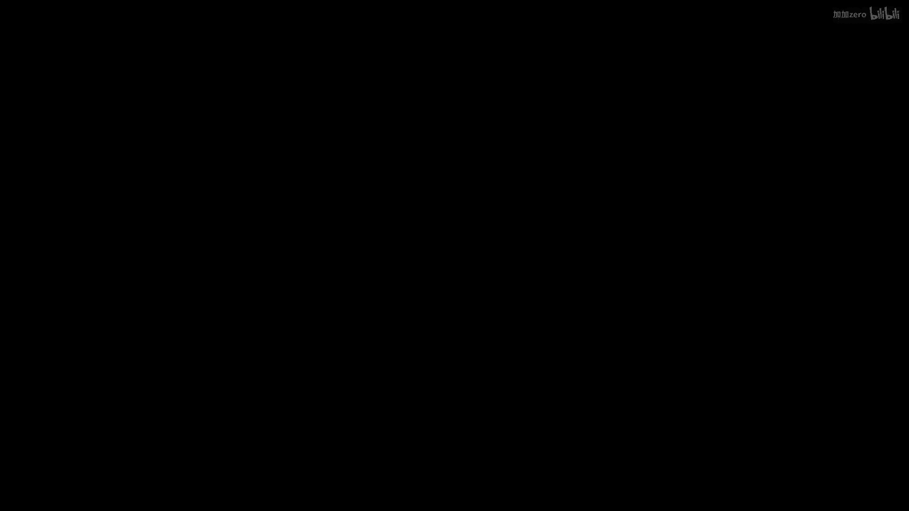
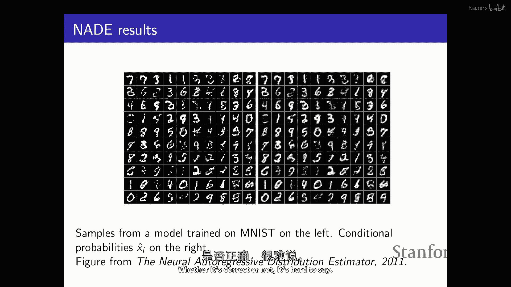
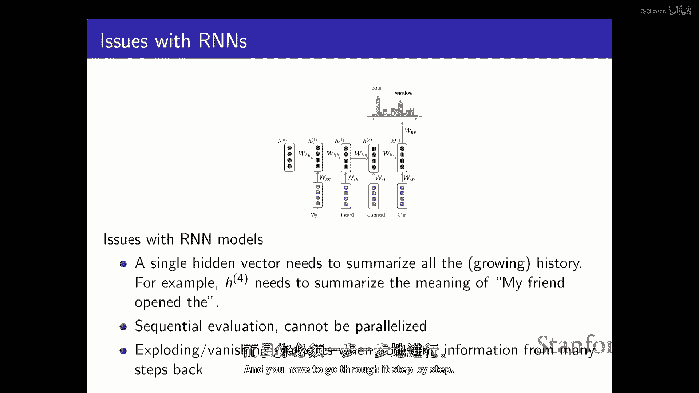

# P3：p3 Stanford CS236： Deep Generative Models I 2023 I Lecture 3 - Auto - 加加zero - BV1NjH4eYE1v

好的，那么让我们开始吧，今天的计划是讨论自回归模型，这将是第一种类型的，我们将在课堂上考虑的生成模型家族，这是支撑大型语言模型技术的一种技术，像gpt这样的，嗯。

所以是的，作为一个回顾，记住，就像这种高层次的概述，每当你想要训练一个生成模型时，你需要数据，所以来自某些iid未知概率分布p数据的样本，然后，你需要定义一个模型家族。

这将是一个在相同空间上定义的概率分布的集合，在这个空间上，你知道你的数据被定义，这些概率分布通常被参数化，例如，使用它可以是贝叶斯网络的条件概率表，正如我们在上一堂课中看到的，对于大多数情况。

我们将考虑定义在神经网络中的概率分布，所以你可以认为那里的theta，就像是，被看作是，神经网络中定义这个概率分布的参数，然后，你将定义某种相似性或差异的概念，之间你的数据分布和你的模型分布，然后。

我们将尝试优化神经网络的参数，以使你的模型分布尽可能接近数据分布，前提是您只有有数据分布的样本，对吧，所以您不知道，您不能评估图像在数据分布下的概率，您只有访问样本，所以您无法评估数据分布的概率。

一旦你有了这个概率分布，你可以做很多事情，你可以从它采样，所以你可以选择向量x的概率，你知道有很多不同的轴可以选择，每个轴都表示你模型的概率，你可以根据这个概率分布选择一个，你从它采样。

这就是你需要生成新数据的，嗯，我们将对概率进行评估，嗯，出于几个原因，一种方法是评估概率对于训练模型是有用的，所以如果你有一些方法可以找出，根据你的模式，任何特定图像的可能性。

那么这就给你提供了一个相当自然的训练模型的方法，有点像解决这个优化问题，或者试图找到一个尽可能接近数据分布的点，一种做这件事的方法就是只做最大似然，你可以尝试找到你模型的参数。

那些最大化观察特定数据集概率的参数，如果你有访问概率的能力，你还可以做的另一件事是，你可以做像异常检测这样的事情，所以你可以给它输入，你可以看到，你知道，这个输入可能是可能的，还是不那么友好的。

就像我们在上一堂课讨论的那样，生成模型相对于判别模型的一个优势是你可以推理，你可能被提供的所有可能的输入，所以你可能，例如，尝试检测对抗性示例，因为也许你知道。

它们它们与您用于训练模型的自然图像类型不同，所以如果你的生成模型好，你可能能够识别出某个输入的异常之处，也许可能性低于它应该的，所以可以说，好的，这可能是一个异常，也许我应该不应该，我不应该。

"对于决策的类型，要非常自信"，"或者是我对这个数据点的预测类型"，"正如我们讨论的另一件事，你可以考虑的是无监督表示学习"，因此，为了在学习好方面做得好，"数据的一个良好近似"。

"你经常需要理解数据的结构"，"因此在某些情况下啊"，"对于自回归模型来说，可能会有些困难。"，这就是我们今天要讨论的，"但对于其他类型的模型"，"这将非常自然"，"提取特征的方式将会相当自然"。

"作为副产品"，基本上的培训，"一个好的生成模型"，"所以第一个问题是如何代表这种概率分布"，"那么，你怎么以有意义的方式定义这个集合呢？"，"今天我们要讨论的自动回归模型"。

"这些基于使用链规则本质上的想法"，"嗯，而且"，接下来我们将讨论如何学习它，所以记住有这个一般的结果，"你可以定义一个任意大变量数n的概率分布"，"并且你可以总是把它分解为条件的乘积"，"所以。

如果你有四个随机变量"，"X一到X四"，你可以总是把它写下来作为x出现的概率，"给定x1，x2，xn的概率"，"这就是完全一般的"，你不，你不需要假设分布的特性，任何分布都可以精确地分解成这样。

特别是在特定情况下，你也可以使用你想要的任何顺序，所以在这种情况下，我是根据顺序x一、x二、x三、x四来分解的，X二，X三和X四，但你可以选择不同的顺序，所以你可以选择把它写下来作为x四的概率。

给定x四，x三的概率，等等，在这里你开始看到，是的，一般来说，你总是可以做到，但是，也许一些排序可能比其他的好，所以，如果数据中有某种像自然因果关系的结构，那么，也许沿着那个方向建模数据更容易，但是。

链规则不关心，它工作，无论你使用哪种排序，嗯，贝叶斯，神经网络本质上利用这种方法，嗯，这种想法，他们通过基本上简化这些条件来取得进步，所以我们看到，一般来说表示，即使随机变量是离散的。

将那些条件表示为表格不可行，不起作用，因此基于这一点，贝叶斯网络本质上做出了某种条件独立性假设，它们假设某些事物与其他事物在条件上是独立的，然后这就给你提供了可能更简单的因素，你可以将它们表示为表格。

另一种方法是使用神经模型得很好，但是，你将放弃，表格表示不再是查找表，现在，它将是某种函数，由神经网络参数化，你将使用它，来映射不同种类的赋值给您正在条件的变量的两个参数。

对于条件分布于'the'上的情况，在这个顺序中使用的下一个变量，所以，在这种面条模型中，我们要做的就是我们从链规则开始，然后，我们将尝试近似，使用神经网络来近似真正的条件。

这工作到神经网络足够强大的程度，它可以很好地近似这些条件概率，这可能非常复杂，如果你考虑这些作为表格，这可能非常复杂，表格中条目之间的关系，使用神经模型这种分解方式有效，到神经网络足够灵活的程度。

它能捕获你获得什么结构的能力，如果你有一个，你知道，一个完全通用的表格表示，好消息是，一个足够深的神经网络，理论上可以近似任何函数，所以这就是深度学习魔法的地方，如果你能利用非常深的神经网络。

那么你有很大的可能实际上能够产生，对这些条件式的一个相当准确的近似，这就是为什么这些模型在实践中往往能够工作，记住你知道，我们将要使用的机器，将与你在常规中使用的机器相同，让我们说分类。

所以你想要预测一个二进制标签，给它一些输入特征，一，你仅仅关心在一个可能包含大量其他变量的情况下，单个变量的条件分布，但重要的是，你是试图一次预测一件事，一个单一的变量y，因此。

你可以使用像逻辑回归这样的东西，或神经网络来做这些事情，特别是，我们已经看到，逻辑回归有点像，假设变量x的值之间存在一种相对简单的依赖关系，或者你正在条件化的特征，并且给定x的条件概率y。

基本上假设存在一种线性依赖关系，然后通过sigmoid函数传递得到非负数，具有正确的形状，有点像归一化，你可以通过假设某种非线性依赖关系来使事情更灵活，那就是你在那里使用神经网络的地方。

所以你可以取你输入，X你可以通过应用线性变换来转换它们，非线性性你可以任意堆叠它们，最后，一天结束时，你仍然有一些类型的变换，可以给出这个条件分布的参数，你试图预测的东西上，基于你所拥有的，也许最后。

你使用一个，某种形式的sigmoid函数或softmax函数，基本上将输出归一化为概率分布，所以它更灵活，你有更多的参数，这是好的，因为知道你可以捕获变量之间更丰富的依赖关系。

你付出的代价是有更多的参数要学习，你需要更多的内存，你可能想象你需要更多的数据，酷，所以这是构建块，然后基本上自动回归模型的整个想法是，一旦你知道如何使用神经网络预测一件事，你可以像组合它们一样。

你可以总是想到一个高维的输出，让我们说一个图像作为一个数个单独组件，链规则给你一种预测单个组件的方法，给定前面的，然后你可以将你的神经网络插入来获取生成模型，这就是神经自动回归模型基本上在做的。

所以例如，嗯，假设你想要学习一个生成模型过图像，嗯，所以为了简单起见，让我们说你想要与二进制化的mnist工作，所以mnist就像是一个经典的手写数字数据集，嗯，所以如果你二进制化它们。

所以每个像素要么是零要么是一，黑色或白色，那么它们可能看起来像这样，所以你可以看到它们有点像手写数字，每个图像都有二十八乘以二十八个像素，所以你有二十八次，二十八个随机变量来建模，变量是二进制的，零。

一，黑色或白色，目标是基本上学习一个概率分布，过这些七百八十四个随机变量，嗯，这样当你从它采样时，你获得的图像可能看起来像你在训练集中的图像，或者，换句话说。

你希望从它采样时得到的图像看起来像你在训练集中的图像，你学习的分布是对生成这些样本的数据分布的良好近似，iid 独立，你在训练集中可以访问的相同分布的样本，再次，这是很具有挑战性的。

因为可能有很多可能的图像，你需要能够为每个图像分配一个概率，所以嗯，记住食谱是，嗯，你定义了一个概率分布的家族，但在由 theta 确定的条件下，我们将在本次讲座中看到，然后您定义了一种学习目标。

以在参数空间中进行搜索，来进行某种优化，以减少学习问题，对 theta 或参数的优化，他们如何定义分布，以尝试找到对数据分布的良好近似，这将是下一堂课，所以使用自回归模型定义这个概率分布的方法。

是你首先需要选择一个顺序，所以记住如果你想使用链规则，你需要选择一个顺序，对于图像，甚至不是显而易见的，顺序应该是什么，没有明显的因果关系结构，不像你正在模型时间序列，你可能期待有一些因果关系结构。

也许在未来预测过去比反向更容易，但实际上，任何顺序都可以工作，所以，例如，你可以采取栅格扫描顺序，所以你可以从上左到下右，你可以那样排列七百八十四个像素，然后你可以对这个概率分布应用链规则，所以。

你总是，你知道没有损失一般性，总是有一种方法可以写下这种分布，基本上作为选择任意值第一个随机变量的概率，然后给定第一个选择第二个的值，依此类推，这就是如何分解生成模型问题，对于序列，这是非常困难的。

对于少数的分类和回归问题，我们是知道的如何处理的，这是我们可以处理的东西，每个条件只涉及一个随机变量，这是我们知道如何处理的设置，从您通常考虑的地方，当你考虑分类和回归时，对于这些条件。

每个只涉及一个随机变量，这就是我们通常处理的地方，那种问题，嗯，你知道，嗯，你不能做表格形式，所以贝叶斯网络在这里是不可能的，因此，我们将尝试基本上建模这些条件，使用某种像神经模型一样的形式。

某种函数形式，这将允许我们映射不同像素配置的概率分布，我们条件于概率分布，或我们需要处理的下一个像素，在这种我们选择的特定顺序中，因此，特别是，我的意思是，如果你考虑第一个概率分布，你知道。

你可以把它表示为一个条件概率表，那就是一个，你知道，二进制随机变量，你需要一个参数来描述它，这就是我在说，Pcpp在这里意味着你可以实际上存储那个一个，但其他的就变得复杂，所以你不得不做一些种近似。

一种简单的事情你可以做的就是失去逻辑回归，所以你可以尝试使用逻辑回归来基本上预测下一个像素，给定之前的像素，这给你一个生成模型，基本上，嗯，如果你这样做，注意，你没有一个单一的分类问题。

你有一系列的分类问题，比如你需要预测第二个像素，给定第一个，你需要预测第三个像素，给定前两个，你需要预测最后一个像素，底部右角的那个，给定所有其他，所以所有这些分类问题基本上都是不同的和分离的。

你是否甚至有不同的协变量或变量，你对其进行条件，所以总的来说，你将，你可能使用不同参数，不同模型来描述它们，这就是我在这里暗示的，有一个不同的字符向量，Alpha对于你的逻辑回归模型，对于每个分类问题。

因此，更明确地说，例如，你将在第一个像素上有第一个先验分布，这只是一个数字，它告诉你你选择第一个像素为白色与黑色的频率是多少，所以如果你考虑这些图像的结构，你知道顶部，这里顶部左上角的像素几乎总是黑色。

所以你可能想要选择这个数字接近零，假设零意味着黑色，有点像你想要那个像素经常是黑色的，然后你知道你需要能够指定一种预测的方式，第一个选择，第二个像素再次，第一个一个。

你可以使用简单的逻辑回归模型来做到这一点，所以等等，而且你知道那是一个建模假设，这种生成性模型是否工作得好，取决于它是否容易预测像素的值，考虑到之前的那些，在这个我为像素选择的特定任意顺序中，嗯。

你知道，是否这个又能工作，这取决于，这个有多好，这是，这个近似度的好坏，它可能效果很好，也可能效果不好，因为可能这些依赖关系过于简单，也许无论你选择哪个alpha。

因为没有一种好的方法可以确定你应该如何选择这个值，一个像素是否为白色或黑色，在这种情况下，嗯，但你可以认为这是一个外推的递归模型，这就是因为本质上你正在做的事情是，你正在尝试回归。

你正在尝试预测数据的结构本身，正确，所以你在自我回归，就像你在尝试预测每个数据点的一部分，给定数据点的其他部分，并且，那就是，你知道，这种建模假设已经被尝试过，嗯。

这种模型被称为完全可见的sigmoid信念网络，有点像一种相对简单的早期类型的生成模型，正如我们将看到的，并不太可能特别有效，但它有点像有用的，用来把它通过，这样你就可以对确切的含义有一个程度的理解。

以简单的分类模型来建模联合分布，当你考虑我们在这里做的事情，当你考虑链规则，我们有所有这些单独的像素，它们正在被条件地建模，以及按顺序出现在它前面的所有，所以当你建模xi的概率时。

给定它在序列中前面的所有变量，让我们假设，使用逻辑回归模型，你知道，你基本上在输出像素处于开或关的条件概率，给定你已经给了前一个像素的值，我们常常会使用这个符号来表示它，X减去i小于i，嗯。

这基本上意味着在所有严格小于所有其他指数的索引i中，"j严格小于i"，"嗯，而且"，"你所知道的"，在逻辑回归的情况下，"这个条件概率由这个相对简单的表达式线性组合给出"。

"然后您将其通过Sigmoid函数。"，现在，"你怎么评价"，"你知道如果有人给你一个数据点"，你想要知道根据我的模式，这个数据点的可能性有多大，你需要做哪种计算，如果你想要通过最大似然来训练模型。

你会怎么做，你会如何评估那个联合概率，假设你有所有这些关于alpha的值，所以你需要做的就是你回去回去应用链规则，所以你基本上只会将这些因素相乘，更具体地说，你知道第一个像素x1的值，很好。

我想在这里有一个与这个相关的例子，让我们假设你只有四个像素，嗯，这里有四个随机变量，让我们假设我们在观察值零，一一零，嗯，那么你基本上需要乘以一起，嗯，所有这些值。

基本上就是预测一个像素在给定其他像素的情况下取特定值的概率，而且这些预测概率取决于前一个像素的值，按照正确的顺序，因此它们取决于x hat i，这是像素的预测概率，取决于在它前面的所有像素在顺序中。

稍微更明确地说，它将看起来像这样，嗯，您需要计算第二个像素的条件概率，当第一个像素是零时，您需要计算第三个像素是，让我们假设在这种情况下，给定前两个是零和一等。

然后您基本上将这里x hat的表达式替换为标准sigmoid，逻辑函数东西，这将给您一个数字，如何从这种分布中采样，假设您已经训练了模型，现在您想要根据这个模型生成图像，自回归模型的一个好处是。

您可以基本上只是，它也给您一个采样的食谱，一般来说，它可能不显而易见您如何做这一点，好的，您有一个食谱来评估不同样本的可能性，但然后如何选择具有正确概率的一个，所以您将随机生成一个关于您的形象。

然后进行拒绝采样，您可以做这样的事，这似乎您可以使用一般的如推断方案，如果您有评估概率的方法，您可以尝试中位数和暴力搜索，并且像样地反转cdf并尝试做点什么什么那样。

当然永远不会扩展到您有一百个随机变量的情况，好消息是，您可以基本上做到，您可以再次使用链规则，并像样地决定像素的值一个接一个，所以您会做，我们基本上知道什么是先验概率，即第一个像素是开或关的概率。

我们可以为第一个像素选择一个值，一旦我们知道第一个像素的值，我们就知道如何概率性地为第二个像素确定值，所以我们可以将其插入到之前的表达式中，您可以这样做，为了非常严谨，那里有一些先验概率。

也许您总是选择它是黑色的，因为所有的图像都是这样的，但然后您选择一个值，然后，基本上你会从给定的条件分布中采样第二个随机变量，这个条件分布你可以通过喂给它来获取参数，使用这个表达式，所以。

逻辑回归模型将试图预测第二个像素，给定第一个，你将从这个中得到一个数字，然后，你可以从它中采样，然后，你将选择，你知道你正在生成你有两个像素，现在，你已经选择了值四，然后。

你可以将其拟合到下一个逻辑回归模型，所以你可以逐像素生成图像，这就是食谱，而且，而且这是好消息，因为采样在某种程度上是容易的，我的意思是，它不是很好，因为你必须依次通过你正在处理的所有随机变量。

你正在处理的，但它比像必须跑出这样的其他选择要好，你知道，使用马尔科夫链，蒙特卡洛方法，或者我们可能需要为其他类型的模型 resort 到的其他更复杂的技术，好消息是，对于这种模型，采样相对相对容易。

如果您想要采样像素值，条件采样可能不是如此，嗯，基于，您知道，如果您想在绘画中做，因为您有一些，您已经拥有一个图像的部分，你想要生成剩余的部分，取决于你对图像的了解，这可能会更容易，这可能会很难。

所以这不是直接的，你能够高效地做到这一点的事实是这个类型的模型的一个 nice 优点，好的，现在，我们有多少参数，所以你知道，我们有一堆阿尔法向量，这些阿尔法向量有不同的长度，因为存在差异。

存在大小不同的逻辑回归模型，基本上任何猜测，比如对于这个模型，因为你有，让我们假设有两个参数，然后这个我们有三个，然后四个，然后五个，它是嗯，在平方中，像，它是平方中的一加一大约平方，所以你知道。

可能不很好，但可能可以管理，现在拨打，正如我之前提到的，这实际上在网络中并不特别有效，所以不，我没有mnist的结果，但如果你训练它于这个caltech one zero one的数据集。

所以样本在左边，你可以看到它们大致有形状，如不同类型的物体，然后你知道，你可以根据逻辑回归分类器训练这个简单的模型，你可以从它采样，并得到这种斑点，所以很棒，原因是基本上，逻辑回归模型不足以描述这个。

你可能有相对于复杂的依赖性，这在像素值上，那么我们如何做得更好，让我们使用更深的神经网络，对，这就是你应该做的事情，嗯，如果你这样做，你会得到一个模型，被称为神经输出回归密度估计。

最简单的事情是你可以做的就是使用单个层的神经网络，来替换逻辑回归分类器，那么它会看起来像什么，嗯，基本上，你对于每个索引，所以我对于每个像素，你会取所有之前的像素值，并将它们传递给线性层。

然后一些非线性，然后您将非线性传递给非线性，嗯，您将得到这些特征，这些隐藏向量，通过逻辑回归的最终输出层，您将得到，这将给您这个随机变量的参数，它将告诉您像素i是否处于开或关状态，现在。

我们可以看到一个稍微更灵活的模型，因为嗯，您不仅仅有阿尔法，逻辑回归分类器在最后一层网络的参数，您还有非线性层的参数，这将使模型更加灵活，但是现在你也有了第一层，所以你有一个稍微更灵活的模型，嗯。

所以它看起来像这样，所以你会，嗯，再次，这里的问题是你，你知道你有n个随机变量吗，你有n种不同的分类问题，所以一般来说，你可以使用完全独立的模型，所以第一个模型会有，让我们假设有一个输入，X1。

所以这个数组的形状基本上就是一个列向量，如果你有两个输入，X1和X2来预测第三个像素，那么这个数组就会有两个列，等等，所以嗯，是的，我们有，我们为什么在边缘上有一个sigma，然后对于第二个东西。

sigma可能 make sense，但我们为什么在h上有一个sigma，我不认为它们不一定需要有它，它只是在这里，我在那里有一个额外的非线性，是的，你不一定需要它，是的。

如果你没有在这里的sigmoid，是的，是的，所以它将与是的相同，所以在地球上有比这更好的，是的，但你知道这只是为了说明目的，你可以想象不同的结构，不同的，它不一定是sigmoid，可以是relu。

可以是其他东西，这只是在这里，在你的A矩阵中，你有三行，我们是在试图预测三个单独的特征吗，为什么，我以为只是概率，嗯，我有，嗯，哦，我明白了，所以这就像有一个隐藏的向量，H，它可以有。

它不一定是一个标量，那个隐藏的向量然后被传递给一个逻辑回归分类器，所以然后它被映射到一个标量通过这个，嗯，这里的表达式，这可能是，所以那里有一个点积，对，所以你知道原则上所有这些都工作。

但你可以大致看到问题，是那就是你基本上为每个像素单独训练不同的模型，这看起来不太好，也许每天结束时有一些共同的结构，我们更像是解决相关问题，我们更像是尝试预测一个像素，给定一张图像的一部分，给定另一个。

基于前一部分的图像，因此，通过连接权重，可能会有机会稍微做得更好，以减少参数数量，作为副产品，加速计算，所以，你可以在这里做的一件事，你可以基本上将这些矩阵连接起来，如果你有的二三四。

如果你把它们视为独立的分类问题，你可以做的就是基本上只有有一个矩阵，然后，你 kind of like 连接所有这些，你在预测问题中使用的权重，通过基本上选择一些更大矩阵的对应切片，所以。

在我们有这个之前，我们通常被称为二的第一个矩阵，然后，三，然后一个四，而且他们完全，你知道，解耦，你可以选择任何值，你想要为那些矩阵的条目，你可以在这里做的一件事是，你可以基本上选择第一行。

第一列来取一组值，然后你将使用它来解决所有其他类型的分类问题，所以你基本上是在尝试从第一个中提取相同的特征，关于x一个，然后你基本上是在将这些特征用于整个，你在内的所有分类问题中，你知道。

当你试图建模整个图像时，是的，这是减少过拟合的方法，这也是这个的动力，是的，所以问题在于产生超过光环的效果是，你知道，过拟合也可能成为一个问题，是的，减少参数值也对过拟合问题有好处，将。

分类问题可能很好，你可能学习到一个更好的解决方案，它能更好地泛化，正如我们所说，这也使它更快，我像经验一样好奇，如果倒置你的x's更有意义，你的意思是，你总是像上次预测一样依赖，因此。

混合n项应该对x一项有相同的权重，例如，有什么建议，抱歉，我不太清楚，我想在这里我们总是乘以，第一个w one x one，w one x one对于每个x i，我们预测，而不是那样。

倒置你的x's是否更有意义，所以w one看x i减去一，w two x i减去二，等等，等等，你只是在看一个前面的条目，两个前面的条目，等等，哦，这也可能工作，是的，这是一种不同参数的表示方式。

这更像是一种卷积式的东西，我认为我们也要谈论这个问题，在这个特定的模型中，他们这样做是一个关于符号的问题，什么是w dot，嗯，逗号小于i意味着，对于这个，它就是一个愚蠢的矩阵，是的，我不认为。

可能需要一个点，或者我猜它意味着更大的矩阵的一部分，我认为这是预期的符号，但是，你理解了，大概，嗯，好消息是，这可以减少参数数量，所以如果你有嗯，对于这个隐藏向量，你需要调整大小，你正在使用的uh来。

做预测，你需要多少参数，我请求超过两次t，它不再，是n的平方，这是一个重要的收获，在我们之前有一些东西，我现在是n的平方，基本上它是线性的，因为只有一个矩阵你需要存储，然后你可以随时重用它，是的，嗯。

所以这很好，嗯，这种模型的另一个优势是，你可以更有效地评估概率，因为基本上每当你走，如果你想要评估一个数据点的概率，你需要评估所有这些条件，所以你需要遍历每个条件，你基本上需要评估这种计算。

如果没有矩阵的结构，并且你需要重新计算，因为什么都没有共享，但如果你有一些共享的结构，你可以像样地重用计算，所以如果你已经计算了这个点积，这里，这里，这个矩阵向量积，然后如果你添加一个额外的，Uh列。

那么你可以重用之前做的计算，你可以只是添加一个额外的副本，是偏差向量，C也共享在所有隐藏层中，是的，我想可以，或者它不一定，我认为你可以，你可以这样做，你可以选择这样，是的，我想我实际上忘记了。

因为它不匹配，但是是的，你应该有，应该有一个c，并且它可以改变它，是的，另一种方式，列在每个步骤中都会被更新，所以像第四步这里，它也更新了第一和第二列，嗯，你的意思是什么，更新就像减去设置是权重矩阵的。

你基本上颜色 by color 构建它，而且但是你尝试学习，而且像监督，像许多例子，我在想，像当模型学习它时，基本上更新，同样，在每个步骤中，它之前学到的所有列，是的，是的，是的。

所以所有的东西都联系在一起，然后我们还没有谈论过你怎么做学习，但是是的，所以然后你可以看到，就像第一列对于所有预测任务都重要一样，所以你可以学习它，你从每一次学习中都会得到一些信号，是的，是的，是的。

只是为了澄清，嗯，在这个模型中，你在共享权重，嗯，对的，那是否意味着任何，比如你对你正在查看数据的假设，这是一个假设，你又一次，以前人们常常说，这种条件概率表可以被某种类型的预测模型捕获。

我们可以任意设置，这种结构形式的预测模型在某种程度上可以捕捉到这一点，因此，在某种程度上，像素预测的方式与像素之间存在某种关系，图像中的不同像素，是否合理，是的，是的，这变成了一个经验性问题。

我想我已经有了结果，而且它往往比，让我们假设之前的逻辑回归模型，所以看起来这种结构有助于建模自然图像或玩具，像mnist这样的图像，所以你可以看到一些mnist的例子在这里，宾尼实际上不想，我没有。

我没有这些样本在这里，你 here 拥有的是模型在mnist上训练的样本，在左边和这些样本对应的条件概率在右边，所以记住，当你生成样本时，要尽可能地，实际上，你会得到给定前一个像素的概率值每个像素。

然后，你从中采样来生成，以实际选择值，因此，左边的图像是二进制的零和一，右边的图像有点软，因为对于每个像素，你都得到一个介于零和一的数字，然后，你从中采样来生成颜色，在这种情况下，零和一。

所以你可以看到它们看起来稍微好一点，因为它们稍微更软，但是，你可以看到它正在相当合理地捕捉到，这些图像的结构，右上角的数字是什么，在右上角，一个表格循环，几乎完全像后室，为什么在。

为什么不我们直接创造一些变化，意味着其他与他人的合作，它们是，所以这些数字对应于你看到的样本，所以基本上这说的是当你采样时你会做什么，你会取第一个像素，你有一个概率，然后你在右边绘制它。

然后你从左边采样一个值，然后基于那个值，基于实际的二进制值，你为第二个像素计算出一个概率，这只是一个介于零和一之间的数字，你在正确的图像上绘制它，然后你从中采样，然后你继续沿着正确的方向走。

人不是否定的，不来自，像东西，什么学习，是的，它这样做它这样做，所以，基本上就是这些数字，每个像素的预测概率，这是x hat i，所以那个像素是开还是关的概率，然后但它们匹配。

这就是为什么它们看起来一样，因为左边你看到的那个样本是你从那些分布中抽取的，通过从那些分布中采样，是的，我注意到像它是对标签应该是什么不关心的，这是否是对一代人正确的决定，所以问题是。

我们应该利用我们可能对数据集有标签的事实吗，所以我们知道你知道有数据集中的不同类型的数字，可能有十个数字，然后我们想要，你知道，利用这一点，所以我假设我们无法访问标签，为什么如果你有访问标签y的权限。

你可以想象尝试学习x和y之间的联合分布，也许你会得到一个更好的模型，也许你可以假设你没有这种结构，你只是学习一个模型，你可以试着使用模型来看，它是否确实发现了有数据点的十个簇。

你知道有数据点大致有这种形状的，看起来像某种类型的，比如椭圆，这就是零，这就是第三种如何从这些模型中提取特征的方法，假设你有一个可以生成具有正确结构的数字的模型，并且它们以正确的比例生成。

它已经学习了图像的结构和它们共有的东西，所以这就是第三种从无监督学习中获取特征的方法，我们将讨论如何做到这一点，但是，可以从两个角度看待这个问题，你可以选择无监督的方式，或者如果你有标签的访问权。

那么也许你可以将其纳入模型中，你可以进行条件生成，或者你可以同时学习x和y的分布，是的，所以在这种情况下当你采样，你可以得到任何一位数字中的任意一位，但如果模型做得好，是的，你知道，例如。

你需要检查模型是否做得好，你可以尝试看比例是多少，如果你在原始训练集中，所有的图像都会来，它们均匀分布，你知道你看到不同数字的比例是相等的，然后，你将nist分类器应用到你的例子中。

你可以看到它是否生成数字在正确的比例中，如果它不，那么可能模型有什么问题，如果它这样做，那么它就做对了，无论它是否正确，它，在这里很难说。

看起来你在向模型注入更强的先验知识，所以如果你有一个无限的数据集，你会期待原始方法比这个方法表现更好吗，意味着那个没有我们强加的结构对吧，所以理论上，表示应该更丰富，那个实际上有更多的结构，像你在施加。

像你有更少的参数，是更不灵活的，如果你有无限的数据和无限的计算能力，最好的事情应该是有条件的，概率表，贝叶斯网络，那个理论上能够以无限的数据捕获任何关系，你将能够学习那个表，它将给你完美的模块化过拟合。

我的意思是，但如果你有无限的数据，你也不需要担心那个。

像是有什么那么对，左边的图片是模型生成的实际样本，右边是我们 somehow 编码，条件概率的条件转化为一种技能，是的，只是介于零和一之间，像条件概率将是介于零和一和二的数字，所以是的，它就是一种灰度。

酷，这就是需要，嗯，你可能想知道如果你想要模型颜色图像，你应该做什么，让我们说，如果二进制变量不再是二进制的，但如果他们可以取，让我们说 k 不同的值，如何你可能像素强度从零到二百五十五，你怎么做它。

你需要做的模型输出的是一类分布对，未知变量可以取多少不同的值，所以你基本上可以做同样的事情，你首先得到这个种隐藏的向量或潜在表示 h，然后你，而不是应用一个某种映射它下来只到，伯努利随机变量的参数。

你可以使用某种 softmax 输出层来映射它下来到一个向量的，概率，如果你关心一个向量中的k个不同输出，那么你有一个包含k个概率的向量，嗯，从π1到πk，这基本上代表随机变量应该采取的概率。

k个不同值中的任何一个，随机变量可以采取的值，嗯，这是对我们之前有的信号函数自然泛化的形式，它就是一种将k个数字（这些数字不一定是非负的）转换为概率分布的一种方式，并且它们可能没有归一化。

这就是一种归一化的方法，使它们成为有效的概率分布，所以，具体来说，你做的就是这样，如果你有一个向量或任意数字，你应用一个softmax操作，它产生另一个向量，你对每个组件应用指数函数，以确保它是非负的。

然后，你将这些指数除以这些指数的和，这基本上确保了条目的归一化，所以，它们，嗯，如果你将所有可能发生的事情的概率相加，你将得到1，嗯，这是我们之前有的自然泛化，你可能想知道，如果你想要模型连续数据。

你会做什么，所以，也许你有，你正在处理语音，这更自然，将数据离散化并不是很自然，我的意思是，即使是对于图像，你也可能不想重新采样随机变量，你想要将它们建模为连续随机变量，所以，解决方案基本上是再次。

这里是相同的架构，但现在神经网络的输出将是某些连续分布的参数，因此，它不是伯努利参数的参数，不是类别参数的参数，它可以是正态分布的参数，逻辑分布的参数。

或者是你认为对你的数据集工作良好的任何连续概率密度函数，所以，例如，你可以做一件事，你可以使用k个高斯混合的组合，所以你需要确保你的神经网络输出给你k个不同的高斯参数，这些高斯参数然后混合在一起。

让我们说，均匀地混合，以获得相对灵活的概率密度函数，就像你看到的这里一个例子，其中有三个不同的高斯，有不同的均值和不同的标准差，所以你需要做的是，你需要确保你的神经网络输出给你k个不同的高斯。

这些高斯参数然后混合在一起，让我们说，均匀地混合，以获得相对灵活的概率密度函数，就像你看到的这里一个例子，其中有三个不同的高斯，有不同的均值和不同的标准差，然后您将它们组合在一起。

就得到一个漂亮的绿色红色曲线，在这里，您允许移动概率质量，您允许说，也许您知道存在两个不同，嗯，随机变量可以取两个更多的值，一个在这里，一个在这里，您允许移动概率质量，通过改变高斯分布的均值和标准差。

所以，在这种情况下，我有两个k值，是的，是的，所以我认为我在这里有更精确的东西，所以你会说给定所有先前的值，x的条件概率是一个由k个高斯分布组成的混合物，每个分布都有一个不同的平均值和一个不同的标准差。

而且像往常一样，你需要使用神经网络来获取这些分布的参数，所以在这种情况下，正如建议的那样，你可以使用同样的技巧，你可以使用相同的技巧，然后作为输出层，你不能再使用softmax或sigmoid。

你必须使用其他东西，给你这些随机变量的参数，因此你需要两个k数字，你需要k均值，你需要k标准差，并且你知道，我想你可能知道，如果你使用，取决于你怎么参数化，如果你参数化方差，那么，成为一个消极的，但是。

强制执行这个相对容易，好的，现在，作为一个，方式来稍微像，更深入地理解这些种类的模型做什么，你可能注意到它们看起来很像我们的编码器如，如果你看看这个种计算图，我在这里有。

其中你有数据点x1 x2 x3 mx4，这被映射到这个预测的概率x一顶帽子，x两顶帽子，x三顶帽子等等，它 kind of 看起来有点像一个外编码器，你在输入x时，然后你将其映射到某种类型的预测，嗯。

输入的重建，并且，更具体地说，外编码器只是一个，嗯，在无监督学习中经常使用的一种模型，它由两个组件组成，编码器将数据点映射到某种类型的潜在表示，例如，它可能再次是一个简单的神经网络，像这样的两层网。

然后有一个解码器的工作就是尝试反转这种变换，解码器的任务是接受编码器的输出，并将其映射回原始的数据点，而且嗯，你知道，在这种情况下，在我有的这张图中，这里，它可能是另一个神经网络，接受编码器的输出。

并将其映射回输入的一些重构，你将使用的损失函数，将有某种类型的重构损失，所以你可能会试图训练编码器和解码器，所以啊，对于每个数据点，当你将解码器应用于编码器时，你会得到接近原始数据点的东西，所以。

取决于数据是否是离散的还是连续的，这可能是像平方损失这样的东西，你在每个坐标上都试图确保，你重构的i变量接近原始的一个，如果你有离散数据，它就更像是，模型是否在预测值方面做得好，我思。

假设在这种情况下它是二进制的，或者是我实际上观察到的第i个随机变量，所以如果第i个随机变量是真实的，模型是否给我高概率为值一，不是很重要，但就像，这就是你不应该，你会尝试学习解码器和编码器。

以便他们满足这个条件，当然，有一个简单的解决方案，有身份映射，所以，如果编码器只是身份函数，并且解码器是某种身份函数，那么你在这个方面做得很好，但这不是你想要的，通常，所以你通常会限制架构。

以便他们不能学习身份函数，但是，嗯，这种感觉有点像我们在做什么，这种有点像自回归模型，我们正在取数据点，然后，我们试图使用数据点的一部分来构建自己，或者我们将其喂入这些网络，然后，我们输出这些预测值。

如果你考虑如何训练这些模型，让我们说，最大似然，你将得到与这非常相似的损失，你想要的，你知道，如果你训练这个逻辑回归分类器，你将得到与这非常相似的东西，其中，你将试图预测数据点中实际看到的值。

我正在尝试理解对于编码器来说，颜色机制是什么，它是否是主要点，编码器只是试图将所有之前的信息压缩到一个非常低的维度，这意味着，是的，是的，所以问题来了，编码器用于什么，典型的用例是学习数据的压缩表示。

如果你能做到这一点，你知道，你可能迫使编码器的输出维度变小，然后，为了做好重构工作，它必须捕获数据的关键变异因素，所以你可以想成它是一种非线性PCA，我们试图发现的数据中的结构，在不监督的情况下，是的。

我们可以做些什么来使自编码器自动调整，问题是，我们可以使用自编码器进行采样吗，自编码器并不是完全生成模型，所以这两件事并不完全相同，但它们有关，这就是我们接下来要看到的，嗯，所以是的，这个正在讨论中。

你知道，通常你会训练这个来做表示学习，尝试找到好的代表，什么是确切的，你知道，如果你考虑像我们刚刚说的，如果你有一个编码器，它实际上并不是一个生成模型，没有，它并不是真正意义上的生成模型。

就像你怎么从外部编码器生成数据，让我来，输入到的什么，所以建议是，让我们扔掉编码器，让我们只使用解码器，你如何将输入喂给解码器以生成数据，这些东西都是手工制作的，是的，这实际上是变分自编码器的解决方案。

所以变分外编码器将是，让我们尝试学习一个简单的生成模型来输入，假输入到你的解码器，所以你可以模拟这个过程，你可以使用它来生成，所以这是变分编码器的解决方案，我会稍后讨论，但如果你只有，你知道。

没有明显的方法生成解码器的输入，除非你有数据，但在那个点上你实际上不是在采样，你能否像输入那个视频一样，这基本上是我们将要讨论的解决方案，如果你喜欢，正则化项将会更差，因为你的表示只是看起来像高斯。

或者像这样，是的，所以再次，这是强制由的解决方案，这基本上是一个变分外编码器，实际上是一个变分外编码器，这加上你建议的，迫使潜伏表示按照简单的分布分布，高斯，如果这工作得很好。

那么你可以从那个分布中采样，将输入喂给解码器，这起作用，但你知道这需要一种不同的正则化，这里的关系是，嗯，你知道，尽管这两件事看起来相似，但它并不完全相同。

原因在于你知道我们不能从外编码器中得到生成模型，因为我们没有足够地结构化这种计算图，也没有顺序，记住，要得到自回归模型，我们需要顺序微分链规则，所以。

实际上获取这种结果的一种方法是对外部编码器施加一个顺序约束，或者将这两件事连接起来，是通过对外部编码器施加一个顺序约束，如果你这样做，你将得到一个基本上的自回归模型，所以基本上。

如果你愿意对这些神经网络的权重矩阵施加约束，使得存在对应的基本上贝叶斯网络或或链规则分解，那么你实际上可以从外编码器中得到一个外归一化模型，想法是基本上，如果你想一想。

问题是我们不知道应该将什么拟合到解码器中，"因此，某种方式地"，我们需要一种方法，能够按顺序生成数据，以便将其插入到这个解码器中。"我们有权访问"，"所以，一种做这件事的方法是像设置计算图一样"。

"以便第一个重建的随机变量不依赖于任何输入"，"如果是那样的话"，"然后，你可以自己产生这个解码器的第一个输出"，"因为你不需要任何特定的输入来做那个"，"然后，你可以将预测的第一个随机变量输入到"。

"那么让我们假设"，你知道，一代的时间，那么现在你就不需要它了，如果你能，没关系，如果第二个随机变量的预测值依赖于x一，没关系因为我们可以为x一设定一个值，然后我们可以把它融入计算。

然后我们可以预测x二的值，然后我们可以取这个值，我们可以取前两个，将它们放入某种类型的外编码器中，并预测x三的值，我们可以继续下去，这与自回归模型是一样的，所以如果你看这种计算图。

你可以看到x一的预测值取决于所有可能的输入，所以你知道，如果你看箭头，所有的输入都对第一个预测值有影响，所以这就是一个问题，因为我们无法获取自回归模型，如果我们那样做，但如果我们以某种方式掩盖权重。

我们可以获取自回归模型，而且作为额外的奖励，那么我们有一个单一的神经网络可以做整个事情，所以不像以前，我们有不同的分类模型，或者是它们以某种方式联系在一起啊，如果我们能做到这个。

然后它是一个单一的神经网络，在一次前向传递中可以产生我们所需的所有参数，我一直在想一些，例如，我们之前讨论的数字任务，嗯，模型学习只是如何偏移的风险是否存在，比如，像一像素或什么。

而且不明显你可以只是偏移，因为我的意思你不是全部，你不能作弊对吧，所以你不能看一个x，他们只能你只能使用，会有，你必须选择一个顺序，并且你预测是，但你可以像从左边开始，然后开始将像左边的像素放在它旁边。

例如妈妈，你放，你没有见过它们，你没有见过右边的像素，所以你不知道确切地应该复制什么，不，不，因为你像，如果之前或从左到右，你将知道输入图像中左边的像素是什么，所以你可以只放那个，嗯。

你可以在左边画一条黑线，所以像，或者我在想，如果为了度量需要像，真正防止这种情况发生，不，你不需要防止这种情况发生，你不需要防止这种情况发生，部分是因为这些瓶子将由最大似然训练，所以，而且那是另一件事。

我们将讨论如何评估，那么那个解决方案可能实际上不会给你从学习算法的角度得到一个好的分数，即使样本可能看起来不错，嗯，但是，我还没有在实践中看到这种情况发生，所以好吧，额外的好处是单次通过。

你可以得到所有事情，而不是n次通过，你的方式是基本上遮蔽右侧，所以你需要强制执行的是一种某种排序，所以，你基本上需要有一个从外编码器得到的一般计算图，然后你需要屏蔽出一些连接，所以，然后有一些排序。

你可以使用它来生成数据，排序可以是任何东西，嗯，所以例如，你可以选择一个排序，我们在其中选择这个x two，X three and x one，这相当于概率密度函数x二的链式规则分解因子。

X three给定x two和x one给定其他两个，然后，你可以做的就是在这个神经网络中遮蔽一些连接，所以，x two的重构不依赖于任何输入，然后，你可以遮蔽这个神经网络的参数，所以。

x three的参数uh只允许依赖于x two，嗯，x one的参数允许依赖于一切，就像根据链式规则的分解一样，所以有一种方法可以做到，是的，那就是，我想我刚刚所说的，一种做它的方法是。

你可以基本上为每个隐藏的跟踪，为你的隐藏层中的每个单位，你可以基本上跟踪它依赖于哪些输入，所以你可以做，你可以为每个单位选择，你可以选择一个整数，我和你可以说我只允许这个运行，这个单元取决于输入到。

我 a，嗯，索引i，所以你可以看到这里，你知道有2个1个2个，这基本上意味着它只允许依赖于，例如，这个单元只允许依赖于单元一和二，这个单元这里标记为1，所以，根据顺序，只允许依赖于第一个输入。

这是x two，然后，你基本上嗯，递归地问问面具，以保持这个不变量，当你去下一层，并且你有一个标记为1的节点，然后，你只允许一个连接，到前一层标记为1的节点，你实现的方法是基本上通过遮蔽并设置为零。

基本上，矩阵中你将使用的一些元素，神经网络的一层，如果你这样做，那么你保持这个不变量，你可以看到确实，嗯，x二的概率参数，这是输出，神经网络的第二个输出不依赖于任何输入，这是我们想要链式法则分解的。

如果你看x的参数三，这是第三个输出，如果你遵循所有这些路径，它们应该只依赖于基本上x二的第二个，这是它在排序中出现的变量，因此，通过保持这个不变量，你将得到一个out编码器，实际上这是一个自回归模型。

你实际上是在迫使模型不要通过查看未来的输出来预测，它只能使用过去的输出，预测未来输出的基本输入实际上是，这是一种将强制执行这种不变性的建筑结构，是的，好的，这是在训练期间做的吗，或者你更喜欢。

训练自编码器，然后在生成期间遮蔽，这是训练过程，所以你必须在训练期间，就像你基本上必须设置一种被遮蔽的建筑结构，这样它就不允许你在训练时作弊，因为如果你做了面具，那么在尝试预测x两个时它就可能。

你只需要看实际值并使用它，所以这非常相似，如果你见过语言模型，你也必须戴口罩，基本上不，允许它看未来标记来预测，如果如果你被允许看未来来预测标记，然后它就会欺骗，你不会做正确的事情，这是一样的事情。

在计算机层面是一个不同的计算图，基本上实现了同样的结果，训练时间单次通过的好处，使计数变为单一，是的，好问题，是的，是的，所以问题在于，好处是否仅在训练时间还是推理时间，所以好处仅在训练时间。

因为在推理时间，你仍然有要生成x值的序列性东西，对于第一个变量，将其拟合，所以仍然需要序列性，这是不可避免的，每个外向攻击性模型都有这种讨厌的味道，基本上我选择了，所以这篇论文的食谱是随机的。

所以你意思是值或顺序，这个顺序也非常困难，我想你知道如果你有什么东西，如果你知道结构，再次知道有一些因果关系，或者有时间，也许有一种合理的方式选择和排序，否则你将不得不选择许多顺序。

如果你基本上有一个混合物，嗯，随机选择一个，但基本上没有选择顺序的好方法，实际上有研究，人们一直在尝试学习如何让回归模型和顺序，所以你可以定义一个模型家族，你可以搜索可能的顺序和搜索在给定顺序下的分解。

但你可以想象有n！个，不同的顺序可以搜索，它是离散的，所以找到正确的顺序是一个非常困难的优化问题，嗯，正确的顺序，如果不依赖于任何东西，模型应该输出的一个应该怎么样，它们只应该提供给它。

一个应该是可以的，谢谢啊，你将不得不，我的意思是，取决于损失函数，它不能依赖于任何东西，但你可以基本上做出一个猜测，基于没有证据，所以你基本上会选择先验，如果让我们说第二个变量总是真的。

那么你仍然取决于训练目标，你将尝试在这里选择输出，它是一个常数，但你将尝试匹配训练集中的最可能值，或者如果你有一个适当的评分规则，然后，你将尝试匹配训练集中看到的分布，取决于损失函数。

你将尝试选择一个有意义的值，但它是固定的，所以你只能选择一个，因此，你不能做太多，但你仍然，你将仍然尽力去捕捉数据，取决于训练损失，是的，看起来在最后一层中，有两个节点只有一个输入。

所以有多个节点只有一个输入是否冗余，我的意思是，权重是不同的，所以即使有多个节点只有一个输入，它们可能会提取那个输入的不同特征，所以并不一定冗余，我认为，所以课程的目标是重建是的，那么如何调和损失函数。

它是一步一步地打破的，你的意思是损失函数的重建，是的，所以损失函数就是我们这里的那些， which would be，你知道，基本上，你将尝试使预测接近数据中的值，所以损失函数不会改变。

只是您制作预测的方式，您不允许作弊，例如，您不允许在预测xi时查看xi，您只能基于之前的变量在某种顺序中进行预测，结果，这将是您将训练出激进模型的相同损失，这取决于您选择的模型家族。

但如果您有逻辑回归模型，它将是相同的损失，例如，在最后一层中，像你说的那样，你有每个，我猜测它查看之前的次数是随机的，所以如果您恰好选择了两个到两个，您如何预测那个之后的第一个条目，是的，所以基本上。

不允许有很多连接，您将做得很糟糕，因为你将不如你能够的那样灵活，因为不允许太多的连接，您将做得很糟糕，因为你将不如你能够的那样灵活，仍然将是一个有效的模型，嗯，不是一个好模型，我想。

这就是为什么人们经常有一种像样的模型组合，其中你有多个面具，你就那样做，是的，酷嗯，让我们看看另一种方法来接近，这是为了嗯，"使用RNN进行一种类似于递归风格的计算，基本上用于预测。"，嗯，"下一个"。

"根据一天结束时的某些顺序，给出的前一个随机变量"，"这就是关键问题"，"每当你构建一个自回归模型时，就是在解决一堆耦合问题。"，"这种预测问题"，或者你预测一个变量，"已知其他变量在一定顺序中出现后。

单一变量"，而且问题在于，这种历史好像一直在变长，所以你正在逐渐条件更多的东西，rnns在这方面做得很好，或者这是一种方式，可以，处理这种情况，这种情境，并且试图总结所有有关信息的所有内容。

你所有条件过的所有东西，以及递归更新它，所以计算图看起来像这样，所以有一个总结h，让我们说h是t或h是t加一，基本上这是一个向量，总结了到那个时间点的所有输入，然后你根据某种初始化方式初始化它，然后。

你说出新的历史摘要来递归更新它，它是我对迄今为止看到的历史的某种变换，对于时间步长x t+1的新输入，你可能知道这是一种实现它的方式，你对ht x t+1进行某种线性变换，他们应用了非线性。

这就给你到了时间t+1的新摘要，然后，你可以做的就是像我们之前做的一样，是然后，你用h来基本上，或者你变换h，然后将其映射到要么，让我们假设，一个类别，一个分类随机变量的参数，或者是一个伯努利随机变量。

或者是一个高斯混合的随机变量，无论你需要预测的是什么，你，通过良好的方式去做，我猜你可能也需要一些非线性性在这里，但是有一些输出，这是您用于预测的东西，这将仅取决于这个历史向量。

或者是所有您到目前为止看到的事物的摘要向量，嗯，这个的好处是，嗯，是，基本上它只有一个非常小的参数集，如，无论历史有多长，都有一个固定的可学习参数集，这些都是这些矩阵，您用于递归使用的矩阵，就像。

更新您到目前为止看到的所有信息的摘要，所以它与n无关记住我们有那些与n线性相关的东西，我们相信这个与n的平方相关的东西实际上是恒定的，度量是固定的它们，您只是继续应用它们，共享完全，它是。

它是极端权重共享，并且在整个课程中您试图做到一切，是的，所以这里我们是，嗯，在初始概率上施加一个标记假设，这仍然不是，所以问题是这是否是一个马尔科夫假设，这不是一个马尔科夫假设，在意义上。

如果您考虑xt不仅仅是前一个xt的函数，减去一，对吧，它仍然取决于所有过去的随机变量，您知道再次，不是一种完全普遍的方式，所以您只能捕获依赖性，但在这种递归的层面上，您可以精确地描述它。

所以您知道它不是，嗯，它肯定不是马尔科夫假设，并且如果您考虑计算图，它确实依赖于所有之前的输入，所以这是一个例子，嗯，如何使用这样的模式来建模文本，所以想法是，在这个简单例子中。

我们只让假设有四个不同的字符，H e l 和 o，然后，您基本上编码它们，让我们假设使用某种一热编码，所以h是一百零一零一零一零一，依此类推，然后，像往常一样，你会使用某种自回归因子分解，所以你写下来。

在这种情况下，从顺序来看是从左到右，所以你写下选择你文本片段中第一个字符的概率，和给定第一个字符后选择第二个字符的概率，依此类推，你所要做的是，你基本上会获得这些概率，从这种循环神经网络的隐藏层中。

所以你有这些隐藏层，它们根据我之前显示的递归更新，然后，你将使用隐藏层，你将将其转换为输出层，它只有四个数字，然后，你可以取一个软最大来基本上将那个映射到嗯，对于非负数，介于零和一之间，和等于一，所以。

在这种情况下，例如，嗯，我们有一个隐藏层，然后，我们对这些数字应用一些线性变换，嗯，我们正在尝试基本上选择这些值，使得那个向量的第二个元素非常大，因为那样会对第二种可能的字符分配很大的概率，恰巧是e。

这是我们想要放在第二个位置的一个，所以当你训练这些模型时，游戏的目标是选择这些矩阵的值，这就是你知道的，假设你最大化观察特定数据的概率，数据点或数据集，嗯，而且没错，所以，再次，这里的关键点是。

只需要一个非常小的参数数量，然后，你用神经网络的隐藏状态，RNN的隐藏状态来获取你需要的条件概率，我们的目标是回归授权，嗯，然后然后，你可以看到类似于递归的东西，然后。

你将通过取当前历史来计算下一个隐藏状态，然后，你知道你有访问到的新字符，你更新你的递归，然后你得到一个新的隐藏状态，你使用那个隐藏状态来产生对于下一个字符的向量预测概率，就这样，所以它与以前相同，但是。

而不是有多个类似于线性回归或逻辑回归的分类器，我们有一堆通过递归连接在一起的分类器，嗯，优点是，你可以申请任意长度的序列，实际上，至少，RNNs在很大程度上是通用的，因为在某种程度上，它们。

可以基本上代表任何可计算函数，至少在理论上在实际应用中，它们很难学习，嗯，你知道，你需要选择一种顺序，这对自回归模型总是一个问题，关键点，这种RNN的关键问题，是它需要在训练时间非常慢。

因为你必须展开这个递归来计算概率，嗯，这是一个问题，但我只会给你一些例子，然后我想我们可以在这里结束，实际上，它工作得相当好，如果你取一个简单的三层，RNN，并训练它在莎士比亚的所有作品中以字符级别。

所以，它实际上是什么，我刚刚展示的就是一个三层的，然后你从模型中采样，你可以得到像这样的东西，它有一点莎士比亚的味道，我想不，如果你考虑到这是以字符级别的，你知道，它只是实际上生成字符字符。

实际上相当令人印象深刻，像它学习，它需要学习哪些单词是有效的，哪些不是语法标点符号，像，一个相对简单的模型像这样，在字符级别工作可以做到这样，可以做成这样，你可以训练它于维基百科，然后你可以采样。

你可以只是，你可以创建假维基百科页面，像这样的关于意大利征服印度的一页，充满了非常有趣的，虚构的内容，但你可以看到它非常有趣，它如何能够有正确的Markdown语法，并且在打开后关闭括号。

这必须通过单个隐藏状态记住，没错，它在继承这些信息，嗯，是的，所以你知道他甚至在编造，链接到它生成的编造事实，嗯，你知道，训练婴儿名字，然后你可以从模型中采样，你可以得到新的名字，所以，是的，它是。

它是一个相当，你知道，工作得非常好，我猜想主要的问题在于，希望那样，也许我们下次会讨论它，但是为什么现在被用于最先进的语言模型，是因为你有这个瓶颈，你需要捕捉到时间t之前的所有信息，并在一个向量中。

这是一个问题，以及序列评估，这是主要瓶颈，所以它不能利用现代的GPU，因为为了计算概率，你真的必须展开计算，你需要一步一步地通过它。

