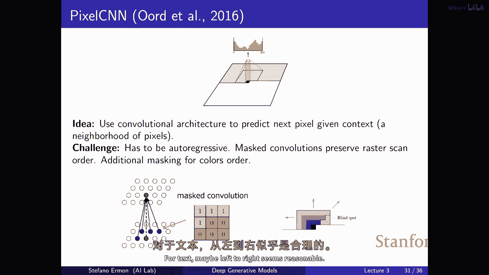
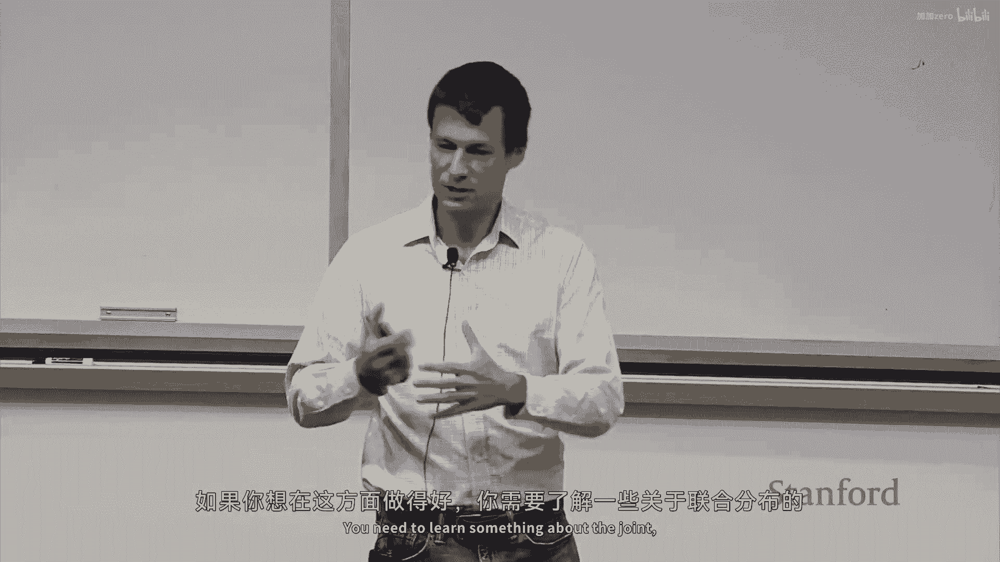
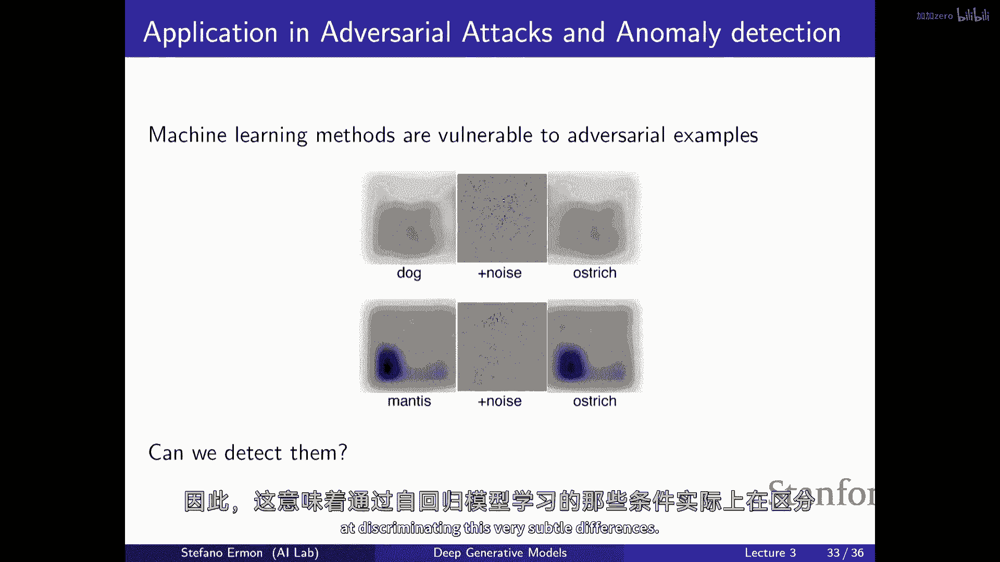
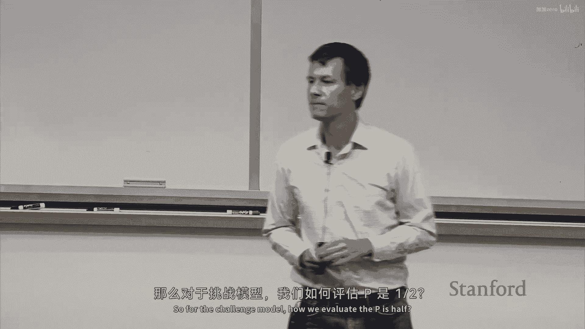
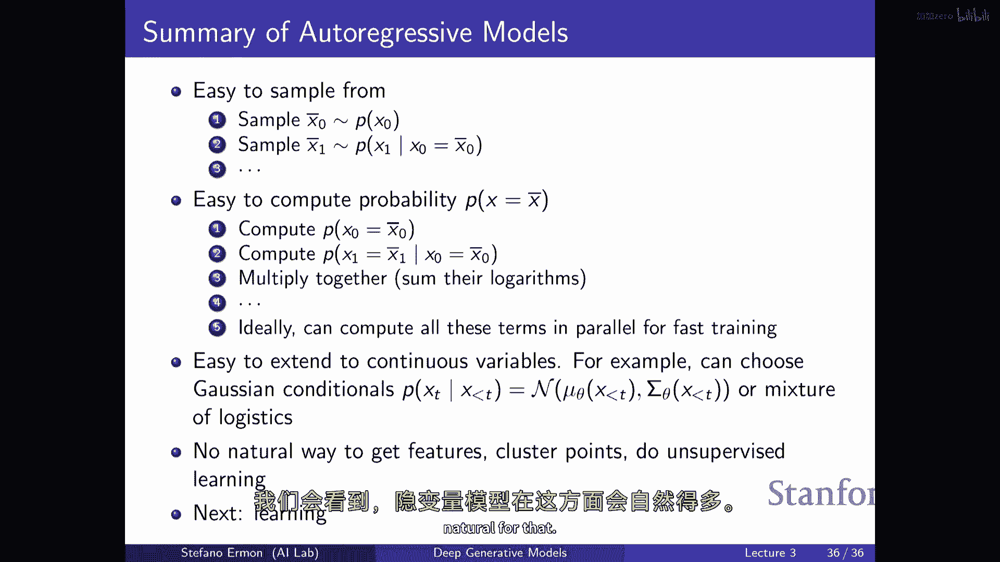
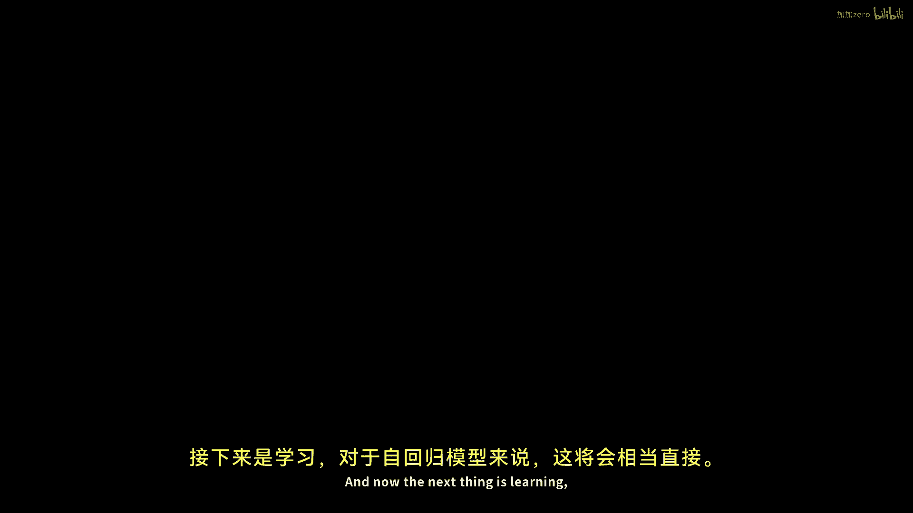
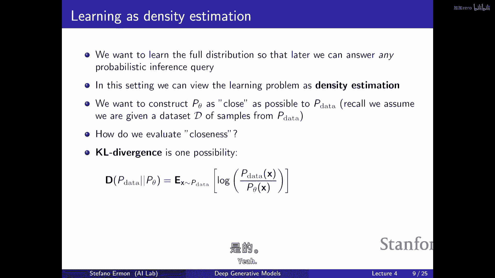
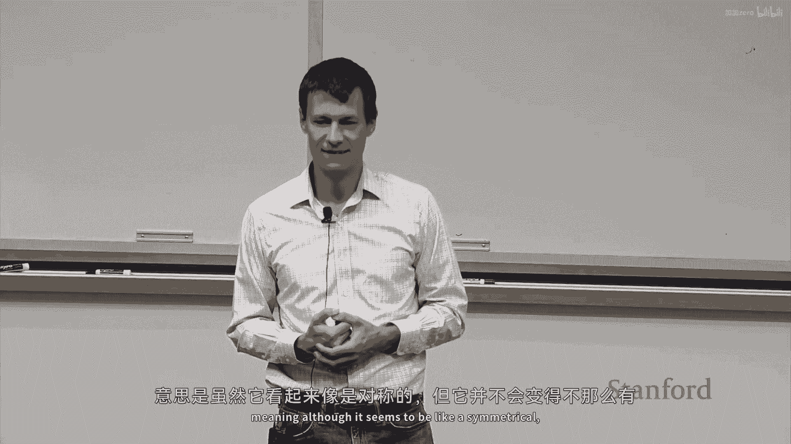
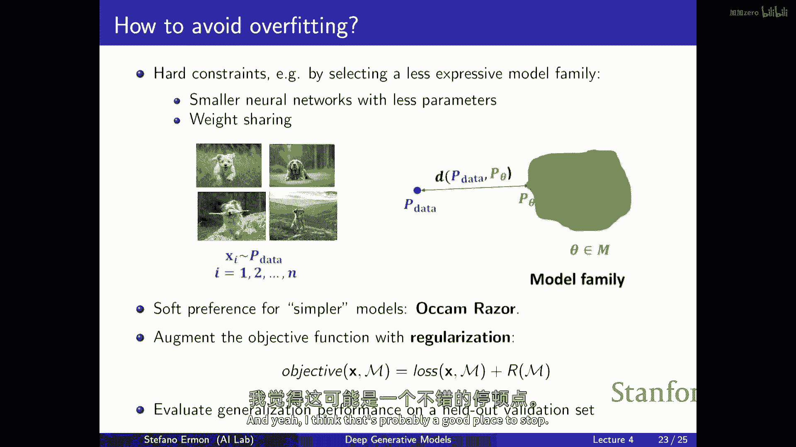

# 【深度生成模型 CS236 2023】斯坦福—中英字幕 - P4：p4 Stanford CS236： Deep Generative Models I 2023 I Lecture 4 - Maxi - 加加zero - BV1NjH4eYE1v

好的，让我们开始吧，所以今天的计划是完成我们上次没有覆盖的材料，在上一次关于自回归模型的讲座中。

然后我们将讨论学习，所以到最后一次讲座的末尾，我们讨论了RNNs作为，另一种参数化自回归模型的方式，记住关键思想是你有一个小的参数数量，实际上是一个常数的参数数量，关于你要建模的序列长度。

你将使用这些参数来，基本上跟踪你使用来预测的上下文，基本上下一个标记或下一个像素，你通过单一种隐藏向量来跟踪所有这些信息，该向量应该总结你所看到的所有信息，你将使用它来制作颈部，下一个预测。

就像这个例子，我在这里看，假设，构建一个RNN来模型文本，你有标记，你可能有一些前缀，比如我朋友打开了，然后你将使用所有这些信息，你将这些信息传递给你的RNN，RNN会更新其状态，其隐藏向量。

最后你将得到一个隐藏向量h4在这里，然后，你将使用那个向量来预测下一个标记，如果你做得好的话，那么你将对继续这句话的合理方式赋予高概率，比如门或窗户，你将对不make sense的事情赋予低概率。

正如我们看到的其他终结模型可以工作得相当好，即使你以字符级别构建它们，这相当困难，一个挑战是这里你拥有的单个隐藏向量，基本上必须总结你到目前为止看到的所有信息，这就是你只能用来做出下一个预测的唯一东西。

这可能是个问题，因为你有点喜欢，你必须做得很好来总结意义，假设你在构建一个语言模型，这个单一向量必须捕获所有所有，所有序列中先前元素的全部意义，这可能是具有挑战性的。

我们手的另一个问题是基本上你必须展开计算，如果你想计算这些概率，并且你想要提出合理的损失或训练时间，这使得它们变得相当慢且难以训练，另一个问题是，它们训练起来可能有些问题，因为你有这些长依赖性。

从序列的早期开始，最差的是向，让我们说现在的，这可能需要许多，许多更新才能达到那里，这可能导致梯度的爆炸或消失，这可能是一个问题，所以这并不是实际上被使用的，而不是艺术语言模型的输出。

递归语言模型已经存在，当前最先进的模型使用注意力，基本思想是它们看起来更像一个naor，像是被制造，我们之前见过的其他模型，你基本上可以使用一个，整个序列的输入直到时间t来预测下一个，所以。

而不是只是使用像隐藏向量，对应于最后一个时间步来预测，你 kind of like，看所有过去的隐藏向量，来预测下一个将要到来的，在实践中使用这种方法有效的方法是使用注意力机制来尝试。

找出序列中哪些部分，序列中哪些元素是有用的，哪些是无用的，你应该关注哪些，你应该不关注哪些，当你做预测时，大致上，这种方法的工作方式是存在一个注意力机制，它将告诉你查询向量与键向量的相关性，所以。

这与你在数据库中搜索类似，你有一个查询，你有一组键，你想要找出，你想要检索，这有类似的味道，它将基本上告诉你隐藏向量，让我们说，对应于第一个时间步的隐藏向量与当前时间步的隐藏向量的相关性。

这可能与将两个向量的点积作为相似性向量类似，一旦你有了相似性向量，然后，你将它们转换为注意力分布，就是我们之前谈论的东西，告诉您序列中哪些元素重要，哪些不重要的东西。

一种简单的方法是只是取所有这些注意力得分，然后通过softmax将它们传递为实际分布，这就是我们之前谈论的注意力分布，告诉您序列中哪些元素重要，哪些不重要，是的，我们不在任何必要的条件独立性中吗。

所以问题在于这种模型是否假设条件独立性，如果你再构建这种模型，没有明确指出条件独立性，因为在原则上是，你知道，只要这仅仅是一个自回归模型，并且我们只是在参数化条件使用具有特定函数形式的函数。

所以我们无法捕获所有可能的依赖性，但我们到目前为止还没有明确做出任何条件独立性假设，嗯，如果你做出了条件独立性假设，通常性能会显著下降，正如我们将看到的，这种架构的优点是。

是它允许你在做出预测时考虑整个上下文，同时，它也是选择性的，有点像，能够忽略不相关的东西，关注相关的东西，例如，在这种简化版的注意力机制中，你可以做，你可以取你之前在rnn中看到的隐藏向量的平均值。

并使用注意力得分，你有的注意力分配得分，你平均它们，然后你得到一个新向量，然后您将与当前向量结合以预测下一个对话，现在不再瓶颈了，我们不仅使用绿色向量来做预测，我们能够使用整个历史。

所以实际上我们可以比较序列中每一对标记，这真的很强大，正如你可以看到，例如，在这个小例子中，我有一个机器人，必须遵守给它的命令，然后您需要做出预测，如果你想做出预测，你真的不需要弄清楚它指的是什么。

一个注意力机制可以帮助你弄清楚这，它可能指的是那个，当你试图理解它意味着什么时，你应该注意这两个标记，一个机器人，所以这就是为什么，这种注意力机制有帮助的，因为你可以像往常一样利用整个序列。

在实际应用中，你知道你需要小心，以确保模型不会过于激进，所以你不能过于关注未来的向量，在实践中，你知道你需要确保模型不会过于激进，当你做这些事情时，所以你必须使用面具机制，就像他做的。

就像在这些其他模型中，所以您只能基本上关注标记，或出现在它前面的随机变量，在序列中，在顺序中，另一个重要的事情是，在实际中被使用的系统中，您不会使用任何种类的像循环，一种架构，所以你不会。

甚至不需要在这里使用这样的重复计算，在哪里您使用RNN更新状态，您只使用前馈计算，您堆叠多个注意力层，这种方法的关键优势是我们回到了类似于预览的状态，嗯设置得像，您可以实际评估，嗯。

你可以大致地像并行评估架构一样做，所以你可以大致地像，在每个索引处并行执行必要的计算来使预测，这是训练时间，当然，而且这就是使这些系统，这些模型在实际应用中好的原因，与rnn相比。

我认为实际上rnn在模型方面应该是相当好的，功率训练太慢了，而且这些变换器因为它们允许大规模并行性，而且那是我们后面会详细讨论的，当我们确切地谈论这些模型是如何训练的，但关键优势是。

你可以基本上非常有效地评估损失，而不必注册与rnn相应的递归，这就是它们，他们之所以在实践中取得了如此伟大的成功，有一个原因是因为它们，它们可以并行评估，它们可以充分利用gpus。

你可以将它们规模到非常大，你可以看到一些变换器的演示，你所知道的系统，嗯，比如GPT，GPT二、三、四，你在第一节课中见过的那些，我们已见过，大家都在谈论的令人惊叹的其他羊羔，嗯，羊羔。

其他在线可用的系统，你可以尝试的，本质上基于这种架构，自回归模型，使用我们将更详细讨论的这种自我注意力机制，在将要 dedicated 到一个关于神经架构的部分中，所以这有点像高层次的。

一种理解是背后的关键成分之一，当前最先进的，语言模型，现在回到我们的目标，我知道人们一直在使用它们来，不仅用于文本，你可以使用它们来建模图像，所以你可以简单地认为图像是一个像素序列，你可以生成它们。

你知道从左上角到右下角，一个接一个，你可以使用 RNN 基本上来建模，你外推模型的所有条件，所以每个像素，嗯，你知道你将有一个像素的条件一个像素，给你那个像素的分布，给所有在它序列中出现的像素，你知道。

每个条件都将是一个类别分布，过那个像素可以采取的颜色，如果你正在模型像素使用 RGB 编码，那么你有三个通道红色，绿色和蓝色，所以你需要捕获像素颜色的分布，给所有之前的像素，一种方法是使用自回归结构。

就像在每个像素内部，定义像素的条件，所以像素将涉及到三个随机变量，红色，绿色和蓝色通道，你可以生成它们，让我们说，按照这个顺序，所以你可以计算红色通道给先前上下文的条件概率。

你可以做绿色通道给先前上下文，以及红色通道的值等等，在实际中，你可以基本上使用 RNN 风格的架构，带有一些掩码，与 Made 看到的相同类型的掩码，强制这种顺序，所以首先你试图计算红色像素的条件概率。

这可能取决于你看到的所有东西，但你不能窥视，你不能看绿色通道或蓝色通道，当你试图预测绿色通道时，看红色通道的值对于这个像素是允许的等等，再次，基本上就是这个想法。

但是你将使用某种形式的掩码来强制执行出到侵略性的结构，这是其中的一个，你知道，这些是RNN可以产生的一些结果示例，在像素级别，在imagenet上训练，缩小imagenet，再次。

你可以看到知道这些结果并不好，但它们相当不错，就像你看到这样，你从一张图像中取，你看到最右边的一列是实际图像，然后你做的就是你可以删除顶部，底部一半，然后让你模型完成，所以它类似于语言模型。

你有一个提示，在这种情况下，提示将是图像的顶部一半，然后让你自回归模型生成下一个像素，然后下一个像素，然后下一个像素等等，你可以看到它正在生成一些合理的完成，嗯，有点像有正确的结构，它有正确的对称性。

它不，它在捕捉像素之间的依赖性方面做得相当好，样本中有一些变异性，如这里，这个与这个相比，当然有随机性，所以即使给定相同的初始条件，如果你采样，你知道，如果你采样，采样方式有随机性。

所以你可以每次采样生成不同的完成，每次采样，你将得到一个完成图像的不同可能方式，你可以看到它们并不总是，我的意思，有些并不理解，但一些完成确实相当不错，有一些变异性，这是好的，嗯，挑战是再次。

因为你必须评估图片的概率，序列性地，你必须展开递归，这些模型非常慢，因此，在实际应用中，由于工作做得更好，卷积架构在图像上比RNN更有效，这些是在建立分类模型时工作良好的架构类型，所以。

自然要尝试使用卷积架构，来构建图像生成模型，挑战再次，那是否你需要确保模型与自回归模型一致，所以你需要确保的是，当你对一个像素进行预测时，你只能使用与您选择的顺序一致的信息。

所以如果顺序再次从左上角到右下角，当你对这个像素进行预测时，使用所有阴影区域的信息是允许的，但在图像中的所有阴影区域，你不能选择，你不能看到来自未来的信息，或来自图像中任何白色区域的信息，所以。

要做这件事的方法再次相对简单，总是要在一天结束时进行掩码，嗯，所以，当你考虑是否想要强制执行自回归结构时，一种方法是设置你的卷积核，以保持一致，就是要在正确的地方设置零。

这样计算的方式就与模型的外向自回归性质一致，所以，如果你有一个简单的3x3类型的卷积核，并清除所有这些内核的条目，那么，如果你看计算图，每当你对这个红色像素做出预测时，你只会使用蓝色像素来做出那个预测。

因此这与我们之前有过的顺序一致，所以再次，它与我很相似，与transformers或自注意力非常相似，你基本上遮蔽以确保事情与，与，或者我 wondering 涉及到，不提及像素，嗯。

你是否恢复了一些卷积结构，在哪里你对邻域像素有更多的关注，是的，所以问题是你是否可以使用我认为的注意力或自我注意力来建模图像，并且那是否可以恢复类似于正确的归纳偏差，是的。

你可以再次使用掩码的注意力来处理图像，并且已经有一些外向回归模型，它们本质上在使用变压器架构，例如，图像的处理架构，据我所知，他们已经非常成功，但这些模型并未公开，这些模型在工业中被构建。

但它们实际上并未发布，我认为它们倾向于在训练时需要大量的计算资源，因此，其他模型似乎更喜欢我们将要讨论的融合模型，在实际应用中，这些模型通常表现更好，但在文献中已经报道。

使用Transformer为基础的架构在图像模型上取得了一些成功，一种现代、无链接数据的渐进式架构，非常疯狂的序列模型，所以，无论语言模型是什么，所有的标记，标记，标记，或者是生成像图片一样的东西。

都是关于我们实际上从哪个顺序开始，是的，那是一个很好的问题，问题是，图像和文本的正确顺序应该是什么，也许从左到右看起来是合理的。

但对于图片，正确的顺序是什么，这是一个很好的问题，而且我们现在并没有一个很好的回答，典型的排序是从左上角到右下角，正如你所说，这可能不是正确的顺序，你可以想象一种不同的方式来排序，有 people。

已经有研究，人们尝试学习最佳的排序，就像你可以想象的那样，存在大量的组合排列方式，但你可以尝试设置一个优化问题，在那里你搜索，或者首先找到正确的顺序，然后你会发现。

那个与该顺序一致的外向回归模型是可靠的，它能够以中等程度的成功最大化数据拟合，顺便说一句，据我所知，甚至对于语言，你可以从右到左建模，它也能正常工作，所以，语言的顺序可能并不重要。

即使我们现在正在使用CNN，嗯，因为它是自回归的，如果我们试图评估，例如，一张图片的可能性，所以，我们还必须展开链规则，结果在计算上非常长，所以，问题是这些种类的卷积模型是否可以在并行中评估。

到一定程度，卷积可以非常有效地评估，组合可以评估，并且基本上就是矩阵乘法，并且他们可以在现代硬件上非常高效地完成，实际上，这是另一种构建非常高效的方法，实际上，语言模型是基于卷积的。

你可以通过1D卷积来相当接近变压器，像使用卷积的模型一样，当然，当然，它们需要具有因果性，所以你不能看未来，你只能看过去，但是使用类似于卷积模型的方法已经在语言处理上显示出了相对良好的效果，同样。

它类似于变压器的性能，所以这是另一种获取快速的方法，并行计算和相对良好的建模性能，但是绘画问题与基本不同，因为我猜想在任何百万像素之间，我们都可以使用外部信息来填充，是的，这是一个新的生物，但我意思是。

你还是可以生成，或者如果那只是划过馅饼的一抹，只属于某些类别，是的，所以问题是，你是否能基于绘画训练一个生成模型，其中你可能遮蔽图像的部分，并训练一个模型来预测剩余部分，一般来说，这不会给你生成模型。

尽管有方法可以从这种架构生成样本，因为在某种程度上，它仍在尝试学习一些东西，你需要学习关于联合的一些东西。

如果你想在那方面做得好，但它不直接给你一种生成样本的方法，至少从左到右，你需要使用更昂贵的，类似于采样程序，这些模型在实践中更难使用，尽管有像掩码编码器这样的变体，它们被用于生成，但这稍微复杂一些。

因为显然，嗯，变压器，它们非常适合并行化，但不考虑计算效率，仅在角色上，这些模型的表示能力，我们可以说，变压器，代表空间像，它的力量比基于lstm的模型更强，我认为这很难声称，所以问题是。

变压器是否比rnn更强，我认为这有点棘手，因为另一个n本身已经可以完成任何一般任务，所以它可以实现任何函数，理论上，相对较小的rnn也可以做到，因此已经证明它们本质上是，是的。

所以实际上可能更关于训练的效率，或者可能是诱导偏差，而不是对灵活性本身有很好的理解，为什么今天有人会使用rnn而不是变压器架构，人们问的是，你为什么会使用rnn，嗯，一种优势是，然后，然后，在推理时。

仅仅跟踪一个状态实际上相当不错，因为你不需要一遍又一遍地进行大量的计算，如果你有一个普通的模型，其中什么都没有绑定，像你需要在推理时进行大量的计算，RNN是，它相当不错，因为所有的你只需要做。

你保持一个小的状态跟踪，并且你可以丢弃所有过去不重要的一切，你只需要跟踪隐藏状态的变化，并且你只需要，你知道，不断展开计算，我的意思是它是顺序的，但这些模型无论如何都是顺序的，但是。

你有一个非常小的向量，这就是你只需要跟踪的状态，非常吸引人，这就是人们试图回到RNN类似架构的原因，因为它们可能在推理上比RNN更有效，酷，所以是的，这是，嗯，然后，你需要记住的是。

如果你这样做大规模卷积，是，你可能最终会得到一种盲点东西，如果你看到你得到的感受野，当你使用被遮蔽的核时，你知道当你做预测时，如果你有一个堆叠的卷积，并对这个像素做出预测时。

你实际上不会考虑这些被灰度化的像素，因为盲点，例如，如果你看看你对这个种计算结构的递归会发生什么，你看到你做了很多卷积，一个接一个地堆叠，你最终会得到一个盲点，因此，还有一些在其他层面上你需要做的事情。

在架构层面，以基本，嗯，结合多个不同种类的卷积与掩码，以获取，来解决这种问题，在这里，你可以看到一些样本，嗯，这种情况通常效果良好，如果你将RNN替换为CNN，你将得到显著更好的样本，"而且它更快"。

"嗯，对了"，"也许让我和你知道，这些模型不仅倾向于生成合理的样本"，"但他们似乎对。有相当深入的理解"，"他们在训练时看到的图像结构是什么"，"并且一个迹象是"。

"那就是在你能够使用它们来进行异常检测的情况下"，所以你可能听说过，机器学习模型对对抗性示例非常脆弱，"对抗性攻击"，"如果你有一个像这样被分类为狗图像的图像"，然后，你将添加这种噪音。

你将得到一个与原始图像看起来相同的图像，但由最先进的模型分类时，将以非常高的信心被分类为完全错误的东西，因此，这两张图像是不同的，但在非常微妙的方式，因此。

有一个自然的问题是你是否能在这些图像中检测到这种类型的差异，这些图像，如果可以做到，也许你可以构建更 robust 机器学习模型，一种方法是尝试将这些两种类型的输入拟合在一起。

类似于将自然图像和对抗性攻击输入到预训练的生成模型中，并查看它们是否会对这两种类型的输入分配不同的概率，如果模型做得好，它可能能够检测到这是一张自然图像，它应该被分配相对较高的概率，相比之下。

这一张图像这里有些奇怪的事情正在发生，所以它应该被分配较低的概率，而且，确实，一个预训练的像素，Cnn模型，在区分自然图像方面做得相当好，并且那些被篡改过的，所以，你看到的就是基本上这种可能性的分布图。

我猜测它们是以每个维度的位来表示的，但这与模型赋予不同样本的可能性是一样的，在x轴上，而在y轴上是，你看到不同图像出现的频率如何，让我们说，在训练集中，这些图像被模型赋予这种概率的频率如何。

你看到训练集和测试集它们大致在这里，而对抗性攻击则显著地从自然图像中分离出来，意味着模型对它们的概率分配较低，所以，如果你使用阈值来尝试区分并说，哦，如果我输入的概率显著低于我所期待的。

那么我可能可以说那是一种对抗性攻击，我可以拒绝，这些模型似乎表现得相当好，这意味着它们不再得到像以前那样高的级别，嗯，图像的含义，但是，他们确实能够理解存在于自然图像中的像素值之间的微妙依赖关系。

并且是的，问题，他们拥有，问题是，人们是否能够进行对抗性攻击，如果他们没有模型的访问权，并且到一定程度是的，这取决于，存在不同的对抗性方法，你可以假设你完全知道，你知道权重，也许你只能知道模型的输出。

有时甚至没有访问任何东西的权限，并且你必须希望这是对一个模型的攻击，转移到不同的模型，所以到一定程度，甚至在黑箱设置中有了一些成功，进步性架构更 robust 对对抗性示例，所以问题是，自适应攻击是否。

是自适应攻击吗，是的，像素防御对抗性攻击比其他模型更好吗，是的，所以不一定更好，我认为这个想法是，这只是为了显示生成模型，由刚刚训练的像素CNN，你知道，最大化数据集的可能性就像是，能够理解图像的结构。

并且像可能性本身是有用的，所以不仅仅是从模型采样的问题，但可能性实际上可以用于区分不同类型的输入，为了做得好，你真的需要理解所有像素之间的关系，你需要找出这张图像实际上与这张图像不同。

所以意味着通过自适应，回归模型学习的条件是实际上在做一个很好的工作来区分，这些非常微妙的差异。

对于通用模型，VIP是如何的，这张图像，所以你基本上就是同一件事。

我想我有它这里，基本上，如果你想要计算概率，你就使用自适应回归链式法则的计算，所以，你评估第一个像素的概率，给定第一个像素，第二个像素的概率，只是乘以所有这些东西，这就给你了可能性。

这是来自自适应回归模型的公式，你对每个输入图像都这样做，这就是来自自适应回归模型的公式，你为每个输入图像都这样做，同样的逻辑，同样的函数，然后你得到的结果就不同，因为啊，在这个图中。

图像在某些基本方式上有所不同，你能再解释一下从这个地方开始，x轴和一维在这个图中的含义吗，是的，所以，x轴就像是基本上的px，概率，模型分配的不同概率值，并且它是每维的位。

这被您图像中维度的数量所归一化，在，在，在图像中，但想象它是x分辨率的p缩放，这样它就更有意义一些，但大致上是概率，在y轴上您有分配给多少图像的数量，它是直方图，有多少张图片被分配了不同的概率值。

因此你会得到这种类型的高斯分布，你知道，即使训练集中的所有图片，它们被赋予了不同的概率值，但大致上它们范围在，它们通常在这个一和四之间的范围内，如果你看对抗性攻击，它们被显著分开。

所以它们在概率上有所不同，很酷，然后嗯，它们还可以用于语音，但是让我跳过那个，而且总结就是嗯，自回归模型相当通用，它们是，它们好因为它们容易从它们中采样，容易评估概率，这些都是有用的。

因为它们可以做一些像异常检测这样的事情，一，你可以将其扩展到连续变量，自动回归模型的一个问题是，实际上并没有一种自然的方式来聚类数据点或获取特征，我们将看到隐含变量模型将大大，对于这一点将更加自然。

现在，下一个事情是学习。

这将对自动回归模型来说相当直接，你可能可以大致猜到你如何训练它们，你基本上就是一个自动回归模型，这只是一系列基本的分类器分类器，然后，你就像往常一样训练所有不同类型分类器，本质上，就是在高层次上，记住。

你知道我们有你的模式家族，这可能是自回归模型，你有数据来训练模型，你需要指定一些距离的概念，一些东西，你的模式分布的质量如何，它与数据分布的相似度如何，我们已经看到了如何使用神经网络定义一组分布。

现在问题来了，如何优化神经网络的参数，使其尽可能接近数据分布，并设置一个场景，我们假设被给予一个数据集，其中包含来自数据分布的样本，并且每个样本基本上对所有模型变量进行了分配，所以。

它可以是每个图像中的像素强度，或者是相同的标准分类问题，其中你可能有特征和标签，你可以看到所有特征的值，这就是你的目标，在所有随机变量中，假设每个数据点都来自相同的分布。

所以他们都从相同的数据分布中采样，所以他们是等价的分布，而且他们彼此独立，这在机器学习中是一种标准的假设，然后您被给予一个模型家族，并且目标就像是，在这个模型家族中挑选一个好的模型对吧。

所以模型家族可以是所有具有给定结构的贝叶斯网络，或者它可以是完全可见的Sigmoid信念网络，你可以想象一堆逻辑回归分类器，它们 each 都有一堆参数，问题是如何选择参数，使你得到一个好的。

一个好的模型，当您只有有访问一些来自未知数据分布的样本时，目标是提出模型，这是一个对未知数据生成过程的好近似，问题是您不知道p数据是什么样的，我无法在任意输入上评估p数据。

我唯一能访问的是来自这个分布的一些样本，嗯，一般来说，这个问题很棘手，因为嗯，你可以想象，样本告诉我们关于哪个轴的信息，让我们说，哪些轴的数据点可能在数据分布下，但是，有很多信息只是丢失的。

那就是我们只是丢失的，每当我们得到，我们就从分布中采样，对吧，所以，让我们说，我们再次尝试建模宽恕，因此我们开始，让我们假设模型七百八十四二进制变量，黑白像素，我所声称的是，这是一个非常非常困难的问题。

因为x是如此的高维，以至于有太多的可能图像，基本上无论，你的训练集有多大，这是一个非常非常困难的问题，如果你想想，可能的图像有多少，如果我们有二进制变量，你有七百八十四个，大约是2的784次方。

这是大约10的236次方的不同图像，你需要找到一种方法，给其中的一个分配一个概率，假设你有可能10百万的训练示例，或100百万或1亿训练示例，仍然有如此巨大的差距，然而，你有多少样本。

和可能发生的所有事情，这从根本上是一个非常非常困难的问题，这远远超过了宇宙中的原子数量，所以有太多的不同组合，你需要找到一种方法，给每个分配一个概率值，所以你有稀疏覆盖。

所以这从根本上是一个相当困难的问题，然后有计算原因，即使你有无限的训练数据，这些模型可能仍然具有挑战性，只是因为你有有限的计算能力，所以我们必须，嗯，接受近似值，我们还将尝试找到，给定我们有的数据。

我们将尝试找到一个好近似值，所以自然的问题是我们意味着什么最好的，什么是一个好的近似值，我们甚至应该尝试达到什么来达到，在这里尝试达到，考虑到我们有基本的限制可以做什么。

所以'最好'的含义真取决于你想要做什么，一个目标可能是只做密度估计，如果你考虑异常检测，我们刚刚谈论过，你真的关心能够为每个可能的输入分配合理的概率，因为，让我们假设你关心这个。

如果你真的能够准确地估计这个完整的联合概率分布，然后，你可以做许多其他事情，然后，你可以基于变量的子集进行条件，你可以推断出其他，你可以基本上做你想要的任何事情，但是，这是一个相当高的要求。

这是一个相当具有挑战性的问题，正如我们刚刚看到的一样，另一个你可以做的事情是，也许你有一个特定的任务在 mind 中，是的，如果你已经知道如何使用此模型。

也许你可以尝试训练一个在特定任务上表现良好的模型，例如，如果你知道你只关心将图像分类为垃圾邮件或不是垃圾邮件，那么也许你实际上想要构建一个判别模型，只预测 y，给定 x。

或者如果你知道你只关心为图像生成描述或生成图像，给定描述，那么也许你不需要学习图像和描述之间的联合分布，你只需要学习你想要预测的条件的分布，给定你在测试时间可用的，这可以使你的生活稍微容易一些。

因为你不再考虑像密度估计这样的东西，你正在说，我不对模型将要执行的任务有任何偏好，我想要在所有可能的任务上都做得很好，但如果你知道你将如何使用模型，那么你可能想要训练模型，以便它在特定任务上做得好。

你关心其他时间，你可能关心结构，如知识发现，但我们不会在这节课中讨论那个，所以我们首先会看到如何做一件事，然后我们会看到如何做另一件事，所以让我们说，这就是你想要做的。

是你想要学习随机变量的联合概率分布，尽可能好，尽可能好的近似，到你的数据分布，生成你的数据的分布，你怎么做，啊，这基本上就是密度估计，它是，它是一个回归问题，你可以把它看作是一个估计问题，因为再次。

你想要能为随机变量的所有可能分配值分配一个概率值，到你有你的随机变量，你试图构建的模型，嗯，所以到现在，实际上，我们只是想要由数据分布定义的联合，这是未知的，但是，我们拥有接近这个模型的样本。

那就是在你的模型家族中，分布为p theta的某个分布，以及嗯，所以设置是这样的，所以有这个未知的p data，你有一堆样本可以访问它，这个集合中有一堆分布，说所有可能得到的分布。

随着你改变逻辑回归分类器的参数，或者你的变换模型，或者没关系，我们想要找到一个点，它与真實的數據分布在某種意義上接近，所以第一個問題是，我們如何評估兩個聯合概率分布的相似性，以及它們是否彼此相似。

有許多方法可以做到，正如我們將看到，我們將得到不同種類的生成模型，通過我們對兩個概率分布的相似性測量的方式變化，有一些比較概率分布的方法，它們含有更多的信息，我們今天將看到理論上的一些。

如基于壓縮的最大似然，這將給你某些類型的模型，還有其他方式，它們更基於，你知道的，如果你能生成，你可以說，好吧，如果我從p theta生成樣本，從p theta生成樣本，你應該不能區別兩者。

這將導致一些像生成對抗網絡的東西，所以將有各種定義分布的相似性的方式，這將是一個軸，定義不同類型生成模型的一個成分，嗯，對於自對抗模型，一個自然的方式來建立相似性的概念是使用似然度，因為我們有訪問它。

所以我們可以使用一個被稱為KL散度的相似性概念，它被定義為這樣，在分布p和q之間的KL散度就是基本上這個期待值，與所有可能發生的事情相關，它們都被加權，所有可能發生的事情，X被加權與p下的概率相關。

然後你看log比值p和q分配的概率，它出來這個量是非負的，並且只有在p等于q時才為零，所以它是一個合理的相似性概念，因為它告訴你你知道如果你能夠在某種方式選擇它們，让我们假设p代表p数据。

Q代表你的模式分布，如果你能够将这个数量驱动得尽可能小，那么这就意味着你正在试图使你的模型更接近数据，如果你能够将这个数据损失驱动到零，那么你就知道你有一个完美的模型，而且我有一个一行的证明。

但我要跳过它，显示它是非负的，嗯，重要的是，这个数量是不对称的，所以p和q之间的KL散度并不等于q和p之间的散度，实际上，散度，你知道，如果你使用其中一个而不是另一个，它将给我们。

两者都是合理的相似性比较方法，一个将给我们最大似然，训练，一个将更自然于，并且在我们讨论生成对抗网络时将再次出现，它将更难以计算处理，但它也是像一种合理的相似性比较方法，用于比较p和q，是的。

所以它们是对称的，如我之前提到的，这种量的直觉是，从信息论的角度来看，并且它 kind of like 告诉你，嗯，有些东西与压缩有关，所以当您构建生成模型时，您实际上是在尝试学习一种分布。

如果您有访问所有可能发生的事情的良好概率分布，那么您也有权访问一种良好的数据压缩方法，本质上，KL散度之间p和q告诉您，基于p的压缩方案与基于q的压缩方案将如何表现，所以具体来说，它正在告诉您。

如果数据确实来自p，并且您使用优化为q的压缩方案，它将比基于数据真实分布的压缩方案差多少，所以，正如我之前提到的，知道生成数据的分布对于压缩是有用的，想象一下，你有一百个二进制随机变量，硬币翻转。

如果硬币翻转是无偏的，所以头尾各一半，嗯，知道生成数据的分布对于压缩是有用的，所以想象一下，你有一百个二进制随机变量，硬币翻转，如果硬币翻转是无偏的，所以头尾各一半，然后。

你没有太多可以做的最好的方式来压缩，翻转这枚硬币的结果，一百次基本上是使用一位，让我们看看如何编码头，编码为尾，平均来说，你将使用一位样本，这就是你可以做的最好的事情，但现在想象一下，硬币是偏斜的。

所以想象一下，头的可能性比尾大得多，那么你知道你正在走出这个，一百次翻转你将，你期待看到比尾更多的头，所以可能值得想出一种压缩方案，为经常出现的事物分配短代码，所以你知道你可以说你可以将事物打包在一起。

你可以说序列如hhh是更常见的，序列如ttt，所以你可能想要为那种经常出现的序列分配一个短代码，你知道我们将会频繁使用，并为你认为不频繁的序列分配一个长代码，这在实践中可以给你节省，所以。

许多你们可能都熟悉的例子是莫尔斯码，这是用点号和划线编码字母的方式，如果你想想，有原因为什么像e和a这样的元音被分配，是非常短的代码，而像y这样的元音被分配一个非常长的代码，有四个元素。

这是因为在英语中，元音比辅音更常见，你更有可能使用，如果你试图向某人发送消息，你更有可能使用元音，所以，如果你想要最小化消息的长度，你想要使用短编码对于频繁的字母，并使用长编码对于不频繁的字母，所以。

所有这些都要说，这个版本的解释是，它基本上在说，如果数据真正按照p分布，并试图构建一个优化为q的压缩方案，你将会低于最优，可能在你的世界模型中，元音比辅音更常见，比您更不常见，所以。

你有一个对于文本的坏生成模型，然后，如果你试图优化，基于这个错误的假设来构建一个方案，你将会，它不会像基于字符的真实频率的方案那样高效，你代码的无效性有多大，正是KL散度测量的。

所以他们有散度精确地测量，你压缩方案的无效性有多大，正是KL散度，因此，如果你试图优化尺度分歧，你的对等性试图优化压缩，所以你正在尝试构建一个模型，这样你就可以很好地或尽可能好地压缩数据。

这又是一种合理的思考模型在世界上的方式，因为在某种程度上，如果你能很好地压缩，那么它意味着你理解你知道的数据的结构，与哪些事物常见，哪些事物不常见，这有点像如果你训练一个模型时采取的哲学。

使用KL散度作为目标函数，所以现在我们已经选择了KL散度，作为测量分布相似性的一种方式，我们可以设置我们的学习问题说，好的，有一个真实的数据生成过程，有一个我可以选择的分布家族。

我可以通过看这个对象来测量我的模式与数据分布的相似性，所以直觉上，如果你考虑这个公式，这个事物在说，我将查看所有可能的，让我们说，来自数据分布的图像，我将查看数据分布和模型分配给这些图像的概率比率。

所以我关心模型和数据分布下的概率差异，如果这两个匹配，所以如果他们分配相同的概率，那么这个比率就变成了一，对数的一是零，所以你看到KL散度正好是零，所以你有一个完美的模型，如果你为每个x分配相同的概率。

那么你有一个完美的模型，否则你将付出代价，这个代价取决于x在数据分布下的可能性，以及你估计的概率与数据分布下的真实概率的差距，是的，我们得到了很好的估计，所以有一个问题，问题是好的，这看起来合理。

但是如何计算这个量，如何优化它，它看起来取决于数据分布下的真实概率，我们无法访问它，所以它看起来不是我们可以优化的，我们将看到它简化为我们可以实际优化的东西，是的，一个很好的问题。

所以KL散度的解释像t theta是什么，就像它会更像，问题是如果我们翻转这里的论据会发生什么，我们有被称为反向kl的东西，所以p theta和p theta之间的类别，所以它将是我们将。

但在这种情况下我们将在看所有可能发生的事情，我们将以模型p theta的尊重来衡量它们，然后这里比率又将再次翻转，所以我们关心比率，但在不同的正负符号中，基本上，所以那个量将等于零。

如果和只有如果他们是相同的，但你可以看到它 kind of 有一种不同的味道，因为如果你看到这种表达式，我们正在说，它，在外面会发生什么，让我们说，数据的分布支持的范围对这些法律并不重要，嗯。

如果你这里有p theta，那么你会说我真的关心我在自己生成的东西上实现的损失，如果你考虑这些模型是如何使用的，实际上这似乎是一个更合理的事情，因为也许真的很重要，你真的想要评分你产生的生成物。

而不是训练集中的可用物品，但将发现我们即将看到的一个 nice 属性，使 this 可行，不 holds for 当你做我们的缩放时，所以这就是你为什么在实际中不能真正优化它，是的，所以。

即使说像 p 和 q 的 kyodivergence，它不是等于 p fk 或 divergence of q 和 b，所以如果你有两个像 p 一 p 二 q 一 q 一的集合。

如果 kl p one q one 小于 kl p two q two 与反向的 kl q two q one p one，像 kl q two q one p one，这些将小于 p q two。

据我所知，不一定。

我 wonder like 我们是否使用其他匹配矩阵，你知道来评估两个分布的距离，例如两个分布之间的积分，是的，所以问题来了，我们是否 ever 想要使用其他度量，是的，在未来的讲座中。

我们将看到不同类型的生成模型，仅仅通过改变这个一个成分，你可以仍然定义你的家庭以任何你想要的方式，但是，我们可能会改变我们比较分布的方式，因为到最后一天，我们在这里说的是我们关心压缩。

这可能或不是你想要的，如果你只关心生成漂亮的图像，也许你不关心压缩，也许你关心其他事情，我们将看到还有其他类型的学习目标，它们是合理的，并产生生成模型，这些模型在实践中往往工作良好，我只是有点好奇。

对于这一句，应该是这样的，嗯，数据，嗯，在，以这种顺序，只有一种含义是不是更好，因为p数据实际上是经验分布，但如果你翻转它，然后它是否会使其意义减少，意思是，尽管它看起来像是一种对称的。

但是，这不使它的意义减少多少，因为我们真的不太信任那个，就像蒙太古卡洛，种类的模拟，你自己，种类的，是的，想象所有的你们，使得问题再次有点像啊，我们应该以什么样的期望对待真正的数据分布。

还是应该以模型对待，这就是你将得到的，如果你在这里和那里颠倒顺序，那么数量将会为零，两者都将为零，只有在你有完美匹配的情况下，但在现实生活中，如果你有有限的数据，你将有，你知道有限的建模能力。

你将没有完美的优化，你将得到非常不同的结果，实际上，如果你那样做，你将获得更多的结果，p theta和p theta之间的边缘差异，你将获得更多的模式寻求行为，类似于，嗯，你可以想象。

如果你把所有的概率质量都集中在一个上，类似于一个单一的模式，它可能看起来根据这个目标你仍然表现得很好，所以它倾向于有一个更多的模式寻求目标，与KL散度相比。

它迫使你将所有的概率质量分散在所有可能发生的事情上，所以如果存在一个在p数据下可能的x，并且你给它分配零概率，你将得到无限的损失，所以这将非常非常糟糕，所以您被迫将概率质量分散，您做反向kl。

这有点像一种激励，让您集中概率质量，所以，正如您所说，行为将非常不同，取决于您想要什么，一种可能比另一种更好，所以我们一直在讨论当我们做一种混乱方式时，它的风味，分歧，反过来看，有点像精确度和召回率。

因为在一种情况下，我们考虑的是分母是真正所有的事情，而在另一种情况下，是全部积极的预测，是的，问题是，这是否有精确度和召回率的味道，是的，它有一个非常相似的，它不是精确度和召回率的确切定义。

这是一种比它味道更柔和的东西，你更关心精确度还是召回率，是的，这是一种很好的表达方式，所以我们有这个，嗯，这个，嗯，损失，你可以扩展这种期望，比如像这样，现在，我们知道这种差异的数据是零。

如果且仅如果分布相同，所以，如果你可以将这个作为θ的函数进行优化，但要使它尽可能小，这是一种合理的学习方式，目标度量，压缩损失，挑战正如之前提到的，是它可能看起来依赖于某些东西，甚至无法计算它。

因为它取决于在所有可能发生的事情下真模型分配的概率，在真数据分布下，你并不知道，但是如果你只是分解，对数比值的对数是差值，你会得到一个看起来像这样的表达式，现在。

你可以注意到这里的第一个术语并不相关于theta，它就像是一个偏移，是一个常数，与你如何选择模型的参数无关，因此，对于优化theta的目的，你可以忽略第一个术语，所以如果你试图使这个量尽可能小。

无论你如何选择theta，这将是一样的，所以你可以有效地忽略它以优化的目的，所以如果你试图找到一个最小化这个表达式的theta，因为这里有一个负号，最好的事情是你基本上可以使这个东西这里尽可能大。

而且我有这里，而且这个术语这里应该有些熟悉，我们正在说，我们应该选择分配给从数据分布采样的轴上最高概率的分布，所以这实际上是最大似然估计，我们试图选择一个模型，该模型对您拥有的东西赋予高概率，训练集。

本质上，嗯，哪，这是你见过的训练目标，嗯，您以前见过的，可能在其他，在其他尝试选择参数的类中，基本上最大化观察特定数据集的概率，我们试图选择参数，这样，预期平均对数似然度的数据最高，所以你可以看到。

那是等价于最小化KL散度，正如我们所见，这与尝试做到最好是一样的，在这种压缩任务中，有一个警告，因为 我们按此顺序排列这个术语，嗯，你知道，有可能比较两个模型，所以您有theta1和theta2。

我可以告诉您哪一个做得更好，但你永远不知道你多么接近数据分布，我们只能评估损失到常数，所以您永远不会知道我能有多好，你不能真正评估那个，并且那是这里的一个问题，是我们不知道我们可能能做得多好。

因为总是有一个无法评估的偏移，对于那些在其他类中见过的人来说，那就是数据的熵，这基本上是告诉你如何难建模数据分布，或者什么，是的，如何随机是数据分布开始，或者什么，如何难是如果你有访问完美模型的权限。

如何建模数据分布，这不影响你的特定模型做得多好，但它是你需要了解的事情，你多么真正接近数据分布，如何接近数据分布并不影响你的特定模型做得多好，但你需要了解，你使用此方法来比较两个模型。

但你只能获得两个之间的大致差异，你仍然不知道所以你能获取如果你取，假设你有一个p theta一和一个p theta二，并且你取数据和p theta一之间的kl差异。

减去它们之间数据和p theta二的差异，常数被取消，所以你知道哪一个更接近数据分布，但你永远不知道你有多近所以回到这张图片，我想说的是，这可能是因为在这里只有两个点，所以给的太多。

你可以看出哪一个更接近数据分布，但你永远不知道这段段的长度，就像你不知道你实际上有多近，让我们看看模型和第二个术语的um的第二项，有没有一种客观的比较方式，相对于这里较少的两个，哪一个更好。

除了在零之外，是的，所以如果你有两个模型，它们实现了相同的平均对数似然，哪一个更好，嗯，奥卡姆的剃刀会告诉你选择最简单的一个，而且那通常也是一个好的有向偏差，好的，嗯，现在。

还有一个进一步的问题是你知道光，这里的数量仍然涉及到对数据分布的期望，我们仍然喜欢，没有访问权限，所以你不能优化这个数量，然而，我们可以用样本对数似然来近似预期对数似然，或者训练集上的平均对数似然。

所以记住我们真正关心的是平均对数似然，相对于所有当你用它们加权时可能发生的事情，由数据分布给出的概率，我们无法访问，但我们可以，我们可以通过遍历我们的数据集并检查日志来近似这一点。

模型为数据集中的所有点数分配的概率，到数据中心足够大的程度，我声称这是对预期值的良好近似，直觉是您有一个期望，您有一个样本平均值，样本平均值将相当接近期望，现在这是一个您可以计算的损失。

您只需遍历您的训练集，你看模型为每个数据点分配的似然度是多少，然后你试图使它尽可能大，对，所以这就是最大似然，学习就是你之前见过的事情，尝试找到分布，那最大化所有训练集数据点的平均对数似然。

D 并且你可以忽略这个，D 那就是一个常数，它不涉及，它，不依赖于theta，所以你会得到类似于常规损失函数的东西，请注意，这就是说，因为数据点相互独立啊，最大化这个表达式与最大化完全相同。

观察到你有访问的数据集的概率，所以它是一个合理的学习目标，你有一堆数据，你正在试图找到最大化观察到你有访问的数据集的参数概率的参数，就像你有访问的那个，正确，如果你对这个表达式取对数。

对数的积变成对数的和，然后你会得到这些两个东西完全相同的这个，所以再次，一种非常合理的训练目标，让我们找到最大化观察数据集概率的参数，我们拥有的，是的，所以数值方法来估计之前的常数项，在你的数据集中。

基于x，你可以喜欢在哪里，然后估计喜欢熵，是的，所以问题来了，你可以使用类似的技巧来估计这个吗，所以你当然可以估计期望，但是问题在于这个对数概率，而且那个更难估计，你可以尝试做核密度估计。

或者甚至你可以在那里使用p theta，如果你认为你有一个好的近似值，那么你就可以把它插入，但你永远不会知道你离真相有多远，所以总是有近似值在那里等等，所以有一个低点说，像x数据的p样本，嗯，接近零。

在目标中非常重，但在实践中，两个人会做任何事情来喜欢，也许你相信吃了一点那个，我认为对于离散分布来说，也许你有一个softmax，我们将其稍微远离零，那是否在连续分布中会发生这种情况，或者你怎么样。

那发生了什么，是的，所以这有点像，回到了我们说的话，这个模型在做什么像，它试图确保如果在训练集中某件事情是可能的，你将被迫在那里放置一些概率质量，这是好事对吧，你将被迫分散概率质量。

这就是那个的全部支持，你的数据集由你的模式完全覆盖，现在问题是你将会，你总是有有限的建模能力，所以如果你在那里放置概率质量，你将会，可能会被迫在某个你不想放置概率质量的地方放置概率质量。

也许然后你的模式会产生一些奇怪的东西，那不是训练集中的，但你必须生成它们，因为你被迫由这个目标再次分散概率质量，回到精确召回，你需要有一个非常高的召回率，像训练集中的一切都必须是非零概率，因此。

也许你的精确度会下降，因为然后你将开始生成不应该生成的东西，这就是那条线的主要收获，酷，嗯，现在，为什么这起作用，这是一个例子，为什么你可以用样本平均值来近似这个期望，这基本上是一个蒙特卡罗估计。

你可能见过它，想法是如果你有一个函数的期望，有一个随机变量x，有一个关于x的函数g，你想要得到g(x)的期望值，这就是这个，你可以通过仅仅查看真实的东西来近似这个，你会看所有可能发生的事情。

并将它们与它们的p权重，或者你可以做你只是生成T场景，T样本，对这些t样本下g的平均值进行查看，那么这个应该算是一个合理的近似吧，你可以这样理解，通过观察这些t代表性的样本的值来近似期望。

而这个g帽是一个随机变量，因为它取决于这些样本x1到xt，所以，但从期望的角度来看，嗯，它能给你你想要的，所以，在期望这个随机变量有正确值的情况下，这就是函数的真实期望，你想要计算的东西。

而且你获得的样本越多，近似就越好，所以，随着t的增加，g帽会非常强烈地收敛到这个预期值，所以，当你取更多的样本时，就像，随机性就越少，你越有可能接近你想要找的真实答案，这就是函数的期望。

随着样本数量的增加，方差也会下降，所以你有一个随机变量，它的期望能给你想要的答案，随着样本数量的增加，这些随机变量的方差变得越来越小，这意味着你的近似变得越来越可靠，你越不可能认为。

你估计的结果离得很远，这就是我们在这里做的，我们正在近似这个期望是一个数字，它不是随机的，我们正在用它来近似一个依赖于训练集的量，所以，不同的训练集会给出不同的答案，但如果训练集足够大。

这个样本平均值将非常接近期望，训练集越大，这个样本平均值在你数据集上得到的可能性就越大，实际上是越来越接近你真正关心的期望值，你关心的，你关心的，酷，所以，我们可能会看到这种想法，经常这种想法。

即有一个你无法处理的期望，你需要用分布中的样本来近似它，这是一个相当方便的方法来使算法更计算上可行，基本上，是处理复杂问题的一种有效方法，使算法在计算上更加可行，实质上，有什么问题吗，好的。

现在我们回到学习，我的意思是，你可能见过最大似然，在像学习伯努利随机变量参数的例子中学习，所以假设你有两个结果，正面和反面，你有一个数据集，所以你看到你翻转硬币五次，并且前两次都是正面，然后有一个反面。

然后正面和反面，你假设有一些潜在的数据分布产生了，你通过五次硬币投掷的结果，然后您模型所有这些伯努利分布，然后再次您只需要一个参数来描述正面和反面的概率，然后您可以尝试拟合。

您尝试找到与真实数据生成过程最接近的模型，嗯，例如，你可能看到五次硬币投掷中有三个正面，然后您尝试找到这种类型的数据的好模型，做这件事的方法是最大似然，所以在这种情况下，θ的p将是非常简单的。

它只是单个类型的伯努利随机变量，您有一个参数，它是正面的概率，一减去θ是反面的概率，然后您有数据集，它是两个三个正面和两个反面，然后您可以评估数据的似然性，它就是那个表达式，所以您有θθ一减去θ。

因为第三个结果是反面，等等，现在这是θ的一个函数，随着θ的变化，您模型分配给数据集的概率也会变化，如果绘制出来，它大致有形状，最大似然会告诉您选择θ，使该概率最大化的θ。

这基本上对应于尝试找到该函数的最大值，在这种情况下，什么解，是的，在这种情况下，你可以实际上解决这个在封闭形式中，并可以计算出什么是最佳的θ，什么解，是的，点六，对，在这种情况下。

你可以实际上解决这个在封闭形式中，并可以计算出什么是最佳的θ，并且它将是0。6点，所以我们现在基本上要做同样的事情，但是，对于自回归模型，所以这就是你有的想法，除了现在，theta非常高维。

它是神经网络的所有可能参数，但是，y轴是一样的，基本上是你模型分配给数据集的概率，然后您尝试找到theta，那最大化你观察到的数据集的概率，好消息是，在非自回归模型中评估似然度，嗯，是相对容易的。

如果你想要评估，模型分配给特定图像或句子的概率，或者x的概率只是，由，链规则是条件概率的乘积，所以，评估单个数据点的概率非常容易，它正是我们之前做的计算，当我们试图做异常检测时，你只是遍历所有条件。

并乘以它们，和，如何评估数据集的概率，或数据集的概率，只是单个数据点的概率的乘积，单个数据点只是通过链规则获得的，所以再次，都非常简单，如果你想要最大化观察到的，你知道你拥有的数据集，你也可以取对数。

并最大化对数似然度，你得到一个表达式，现在当你可以将对数的乘积转换为对数和的和，嗯但我们不再有一个封闭形式的解决方案，所以以前对于伯努利硬币翻转，你知道答案都是0。6，如果你有一个深度神经网络在这里。

你现在不再有一个封闭形式的方式来选择theta，你必须依赖于某种优化算法，来尝试使这个目标函数尽可能高，或尽可能小，所以你可以，例如，你可以使用梯度下降，这就是我们试图优化的目标函数，如果你取对数。

我想这归结为，这是非常不自然的，所以你需要遍历所有数据点，你需要遍历每个数据点中的变量，然后你看到这个变量被分配的日志概率，给定这个数据点中的所有前面的变量，所以等价于，你所做的是记住这个p神经网络。

这些基本上是分类器，它们试图预测下一个值，给定所有前面的东西，所以这个模型，这个损失基本上就是评估所有这些分类器的平均损失，在数据点和变量上，所以再次，基本上最大化最小化差异与最大化对数似然是相同的。

这是同样的，基本上试图让这些分类器表现得尽可能好，它们能做到的，它们应该能做得很好地预测所有数据点，对于所有变量的J，I，它们应该能做得很好地预测下一个变量，给定它们已经看到的所有东西。

对于这个特定的数据点，所以所有这些基本上都归结为，试图让这些分类器预测下一个变量，给定前面的变量，尽可能高效和好，按实质上交叉熵来衡量，所以一种方法是，你可以随机初始化所有参数。

然后你可以计算这个损失的梯度，但反向传播，然后你只是对这个东西做梯度上升，它不是凸的，但在实践中，基本上这就是你如何训练所有这些，所有这些模型，它通常在实践中工作得很好，需要注意的是，正如所写，嗯。

你知道，这个量涉及到对整个数据集的求和，如果你想知道，改变这些分类器的一个参数的影响，所以你想要获取损失关于，让我们说theta i，其中theta i是基本i th条件的参数。

你将需要遍历整个数据集才能得到这个梯度，这将是，当然，太昂贵了，因为你需要遍历整个数据集，来计算这个梯度，这将是，当然，太昂贵了，因为你需要遍历整个数据集，来确定如何调整你的分类器的参数，这很棘手。

好的，这里是，实际上我挺好的，好消息是好的，每个条件都可以单独优化，在实际应用中，没有参数共享，总是存在参数共享，挑战在于你有这个数据集中的所有数据点的大和，但我们可以做的是，我们可以使用蒙特卡洛估计。

所以，而不是遍历整个数据集，我们可以尝试估计梯度，但仅通过查看一小部分数据点，就像以前我们使用样本平均值来近似期望一样，我们可以将这个对所有数据点的和视为m，我们可以乘以m并除以1除以m，然后。

我们可以将这个对所有数据点的和视为m，1除以m，作为与数据集数据点均匀分布的期望，所以，你可以将梯度写为期望的梯度，与数据集数据点的均匀分布有关，到目前为止，我们并没有获得什么，但现在你可以做，嗯。

蒙特卡洛，你可以通过取一堆样本来近似这个期望，并只在那些样本上评估梯度，这基本上是随机梯度，下降或小批量，其中，你将基本上选择一小部分数据点，你将在这些数据点上评估梯度。

并将您的模式更新 accordingly，因此，我们看到另一层次的蒙特卡洛模拟或估计，其中，而不是评估整个梯度，您在数据点的子集上评估梯度，以使事情可扩展，还有其他什么，是的，另一个需要记住的是，嗯。

总是存在过拟合的风险，就像以前那样，如果你盲目优化那个目标，你可能只是记住数据集，所以，如果你知道，如果数据成为模型，你在这个预测任务中将表现得很好，但这不是我们想要的，对吧。

所以我们不关心在数据集上的性能，我们关心在未见过的样本上的性能，这些来自我们用于训练的同一分布，所以，我们在训练机器学习模型时看到的问题在这里也适用，盲目最小化这个损失可能不是做我们想要做的事情。

因为你可以在训练集上做得很好，但你可能在一般上做得不好，你可能不能做出泛化，所以，你需要做的就是，在某种程度上限制假设空间或正则化模型，在某种程度上确保这不会发生，所以它不单单只是记住训练集，而且它不。

而且这样你就不会得到过度拟合的行为，嗯，问题，然后你会得到像偏差方差权衡这样的常规情况，嗯，如果你限制模型太多，如果你限制了建模能力太多，而不是使用深度神经网络，你使用逻辑回归。

或者你假设非常强的条件独立性，你的建模能力或假设空间变得过于有限，你可能无法在训练集上很好地最小化那个损失，这基本上是偏差，因为它限制了你如何近似目标分布，即使你能优化得如你所能，"然后。

这里的权衡是如果嗯"，"你选择的模型家庭过于灵活"，"然后，你们会遇到另一个问题，那就是变异性。"，"所以，你的模型可能过于拟合"，"这可能比生成数据的真实模型更适合"。

"甚至对数据集的微小更改也可能对你的结果产生巨大的影响。"，"您输出的参数"，"那就是方差"，所以你有点像，"想要找到一个甜蜜点"，你在哪里平衡偏差和方差对你的模型性能的影响，嗯，就像是视觉上。

我认为这是一个例子，嗯，假设你有一堆数据点，你在尝试拟合一条曲线，试图从x预测y，如果你选择的是可能的关系空间的一种非常简单的类型，比如所有的线性模型，你可以做得很好一个合适的，但是。

如果模型类过于简单，你就无法捕捉到数据的真实趋势，所以，这里偏差会对你造成伤害，如果你做得有点欠拟合，如果你选择一个非常灵活的模型，有很多参数，你将能够非常完美地拟合数据集，但你可以看到。

这可能过于灵活，如果改变数据中的一个点，模型的性能可能会发生变化，预测将会大幅改变，这可能是过拟合，所以你想要，也许那个甜点区，你有一个低度的多项式，它适合数据，比这个高度的多项式稍微差一些。

但它有点像会泛化，并且在实践中它会表现得不错，是的，问题嗯，因为我们训练模型时，会说这个超参数是固定的，然后，我们训练模型，所以这就是你应该在这里展示的案例，我们说它是一个三次多项式。

有没有任何方式可以，你知道，将模型参数调整以在训练时进行，有一个非常优雅的框架，嗯，是的，所以你可以做几件事，一是防止过拟合，你可以是贝叶斯，但这打开了一个非常困难的计算问题，另一件事你可以做是。

你可以尝试做，嗯，一种交叉验证，其中，你像，保留一些数据来评估你模型的性能，如果你看到在训练时间和在验证集上的性能之间有一个大差距，那么你知道过拟合，所以也许你想要减少你模型的复杂性，所以是的。

你可以做的事情之一是减少你神经网络的复杂性，减少参数数量，共享参数，就像，使这个集变得更小，在某种方式，另一个以前被测量的东西是，你可以尝试使用某种像对简单模型的软偏好。

所以如果你有两个模型都同样适合数据，它们实现了相同的损失，也许你有一个正则化项说偏好简单的一个，也许那个参数数量更少的一个，或者那个参数大小的，参数大小的一个，嗯和嗯，另一个事情就是我刚刚提到的。

我刚刚提到的那个，你可以总是通过保留出一些验证集来评估性能，实际上，人们在实践中就是这样做的，你可以检查训练损失和验证损失之间的差距是否很大，然后，你就知道你可能过拟合了，你可能想要减小这个集的大小。

或者你可能想做一些事情来防止过拟合，嗯，是的，我认为这可能是一个停止的好地方。

