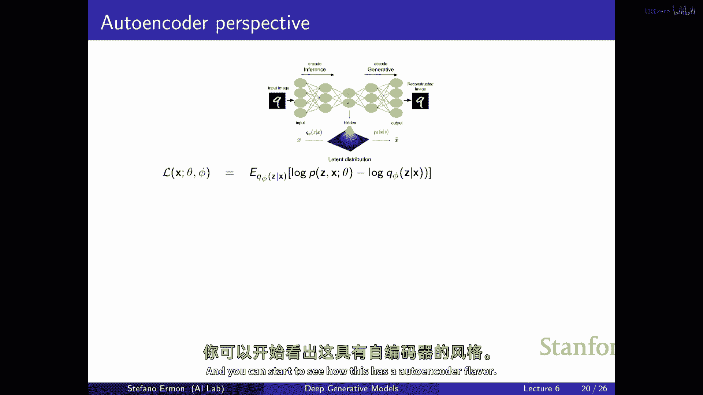

# P6：p6 Stanford CS236： Deep Generative Models I 2023 I Lecture 6 - VAEs - 加加zero - BV1NjH4eYE1v

让我们开始，今天的计划是完成变分外编码器的模型，所以我们会再次讨论肘部，我们将看到如何实际解决相应的优化问题，然后，我们将实际解释为什么这个模型被称为变分外编码器，所以。

我们将展示与前一次讲座中看到的外编码器之间的联系，我们将看到它如何概括它们，你可以把它想作，将自编码器转换为生成模型的一种方式，所以嗯，作为回顾，嗯，记得我们正在谈论一种嗯，生成模型，叫做变分外编码器。

常常用vae缩写表示，从最简单的形式来看，你可以把它想象成这样，它是一种生成模型，首先你采样一个简单的潜在变量z，例如，仅仅从均值为零，方差为的多元正态分布中抽取。

身份矩阵就像是你能想到的最简单的分布类型，然后，你做的就是将这个，嗯，在这个随机变量z处获得的样本通过两个神经网络，嗯，μθ和σθ，这两个神经网络会给你另一个高斯分布的参数。

所以它们会给你一个均值向量和一个协方差矩阵，这些取决于z，然后，实际上，你从这个条件分布中生成一个数据点，P(x给定z和嗯)，正如我们所见，这种模型的好处是，尽管构建块非常简单。

比如你有一个简单的高斯先验p(z)和简单的条件分布，P(x|z)再次只是一个高斯，你从中得到的x的边缘分布可能非常灵活，非常一般，因为你可以想它作为一个混合物，一个非常大且无限的高斯分布集合。

对于每个z都有一个对应的高斯，你有无限的这些，所以你有无数的高斯，你是在混合它们，所以，如果你想知道生成数据点的概率是多少，"对于给定的潜在变量的所有可能值，你需要对其进行积分"，"而且你必须看到"。

"那个潜伏变量给我这个数据点的概率是多少？"，"那种就像是给你带来了很多灵活性"，正如我们所见，有点像，"这个的优点是，它给你提供了一个对x的极灵活边际分布"。

"而且它也 kind of like 给你一种方式去做无监督学习"，在含义上，你可以尝试根据x推断出z，"希望您可能会发现一些结构或一些潜在的变异因素"，这能描述数据中看到的许多可变性，因此。

它可以用于无监督学习，你可以把它看作是k均值的扩展，其中，潜在变量更加灵活，并且它们可以发现更复杂的变异因素，我们看到的是，没有免费的午餐，在意义上说，你所付出的代价是这些模型更难以训练，到最后。

它归结为评估似然度的事实是昂贵的，评估p(x)是昂贵的，因为你必须基本上检查所有可能的z值，这些值可能生成数据点x，这意味着你不能评估似然度，对于数据点，或者你可以做，但是非常昂贵，因此。

训练也非常困难，因为没有一种明显的方法可以优化参数，以最大化您所拥有的数据集的概率，因为计算似然度是困难的，这与自回归模型不同，其中，另一方面，评估似然度是 trivial 的，因为只需将一堆条件相乘。

快速提问，我们可以参数化吗，或者我们必须有好问题，是的，所以问题是我们是否可以学习p(z)基本上，还是必须固定，可以学习，这有点像最简单的设置，已经足够强大来做有趣的事情，z是固定的，如我们将看到。

当你通过数学，没有什么真正阻止你使用更复杂的先验分布z上，并且它可以是学习的，例如，你可以使用，你知道最简单的事情是gaussian参数的学习，所以，而不是使用均值为零和固定的协方差，身份矩阵。

你可以学习这些参数，或者你可以使用外回归模型对于，或者你可以做是您可以堆叠另一个外编码器，另一个vae，然后您可以有一个种类的va，其中，z是从另一个变分自编码器生成的，这就是一种层次va。

并且这实际上是什么，将是一个扩散模型，如果您堆叠这么多，很多次，你会得到一个更强大的模式，但这有点像最简单的有趣模型，它突出了像样的挑战，而且在实践中已经非常有用，什么更合理，在顶部堆叠多个蜜蜂。

或者只是增加这些两个神经网络的层数，你会发现的，是的，所以是好问题，所以问题是什么，增加z的维度或添加多个层与增加深度的神经网络，使其从z映射到x，这两种行为的区别在哪里，与，增加神经网络深度。

给你从z到x的映射，这两种行为的行为，以及这两种行为的行为，两者都将为您提供更大的灵活性，但行为是截然不同的，因为知道您可以使网络有多深，但我们像p(x|z)仍然是高斯分布。

所以这 kind of like 限制了，您能做的事情，这将在后续讨论训练时变得清晰，我的意思是，它增加了一定程度的灵活性，但它不是同样添加更多的混合组件。

这 kind of like 如果您要堆叠另一个vae，或者可能使用更多的，是的，增加维度，两者都朝着同一方向走，但它们以不同的方式做，酷，这就是免费的午餐部分，基本上我们看到的。

我们开始寻找训练这种模型的方法，并将看到训练这种像潜在变量模型一样，如何处理，依赖于这种技术变分推断，其中，我们实际上将有一个辅助模型，我们将使用，来尝试推断潜在变量，在这个课程中，这个辅助模型。

这个辅助模型也将是一个神经网络，它将全部是深度的，嗯，并且 uh，基本上我们将同时训练生成模型和辅助推断模型，您将使用，以尝试将问题减少到我们之前看到的问题，其中，x和z的部分都被观察。

这就是高层次的想法，它建立在我们上次讲座看到的结果之上，构建证据的下界，对吧，所以我们看到，我们可以通过Jensen的不等式获得下界，所以我们看到，我们可以通过Jensen的不等式获得下界，基本上。

我们希望优化的这个量是，嗯，通过基本上使用这种辅助提议分布队列，来尝试推断出潜变量的值，记住，挑战是您只能见到x，您看不到z部分，您必须推断出z部分，某种方式。

肘部技巧基本上使用分布q来尝试推断出z变量的值，当你到达，当只有x被观察时，并构建这种对边际似然度的下限，左边的量，是你希望作为θ的函数优化的量，你可以进一步分解这个目标成两个部分，你有一个第一部分。

基本上就是当x部分和z部分都被观察时，平均对数概率，当你推断出z部分，使用这q模型，第一个部分看起来像以前我们看到的设置，所有东西都被观察，x和z部分都被观察。

唯一的区别是您基本上使用这q模型来推断出潜变量，然后，还有一个部分，它不依赖于您的生成模型，它不依赖于p，它只依赖于q，它基本上说它是在q下预期的log q的期望值，我们在以前的讲座中叫做，q的熵。

基本上，它告诉你q有多随机，你应该对从q中抽取样本的结果有多不确定，我们基本上看到，这个肘部有这两个部分，有一个依赖于q熵的术语，有一个依赖于你使用队列分布猜测数据缺失部分的平均对数概率的术语，因此。

这些两个值的和越高，这两个术语，就越接近证据到真实边际似然度的值，我们讨论过的是，如果选择q，现在，这个不等式对于任何选择的q都成立，如果你选择q是你生成模型下给定x的z后验分布的q。

那么这个不等式变成等式，因此，不再涉及近似，证据下限正好等于边际似然度，作为附注，这就是你在em算法的e步骤中计算的量，如果你以前见过它，如果这个q是你生成模型下给定x的z后验分布的q。

那么这个不等式变成等式，此外，这就是你在em算法的e步骤中计算的量，如果你以前见过它，嗯，你知道，这种程序的味道像EM算法，你有一种方式，可以说是使用q分布来填充缺失值。

然后你 kind of like 假装所有的数据都是完全观察的，这相当于这里的一部分，然后你这里有这种熵，嗯，但这两者之间有联系，这种像EM和变化的学习方法，并且学习我们今天要讨论的内容。

他们两者都试图解决同一个问题，在数据缺失的情况下学习模型，Em的方法不是可扩展的，在深度生成模型的上下文中并不完全适用，但这两种方法密切相关，这就是为什么你可以看到，q的最优选择应该是。

给定z的潜在变量条件分布，给定x的潜在变量z的给定分布，那么，你怎么看这一点，嗯，要推导出它，你可以做，你可以计算出这个表达式，如果你计算出这个q分布与最优推断潜伏变量方式的KL散度。

以及这个最优推断潜伏变量方式的条件分布，即给定x，z的条件分布，不难看到，如果你做一些代数，这个表达式等于你看到的在右边的东西，所以我们看到几个部分，我们有x的边缘概率，x的对数概率，边缘似然度。

我们关心的事情，在这里我们有q的熵，然后我们有这个对完全观察的数据点的平均对数联合概率，并且这是之前我们有的相同部分，啊，并且关键的要点是KL散度，我们知道对于任何选择q，KL散度都是非负的，左边。

这是尺度偏移，版本必须是负数，所以现在如果你重新排列这些术语，我们以稍微不同的方式重新推导出了肘部，你看，如果你移动q的熵，这里右侧的第一个术语，你又会得到，你得到的那个肘部是数据点的对数边际概率更低。

由我们之前有过的表达式所限制，所以这是对肘部的另一个衍生形式，这仅仅利用KL散度的非负性，这个衍生形式更好，因为它实际上显示了你知道你的估计有多松或多紧，这个下界是，所以你可以，你可以清楚地看到。

如果你选择q作为给定x的条件分布，所以这个界限适用于任何q的选择，如果你选择这个特定的分布，那么尺度散度必须为零，因为它是，你知道，KL散度的左右边缘是相同的分布，因此，这个不等式在这里变成了等式。

因此，我们得到了这个结果，就像肘部被绑定一样，所以正好匹配当你基本上推断出缺失变量时，边际对数概率，缺失的变量，使用使用真的条件概率z给定x的最佳或提议分布，来猜测你不知道的数据部分，是的。

我理解我们是否想做这个，因为如果你只是使用蒙特卡洛进行稀疏的，所以这将给我们最大的像，我们可以这样做，但是如何我们可以实际上使用，和计算p有多容易，是的，这是一个很好的问题，所以，我的意思是。

我想我们曾经说过，是的，我们实际上无法评估这个，因为它太昂贵了现在，它似乎我们可以做，如果我们能够选择最佳的q，这更令人向往，我们实际上无法真正做出这个选择，但它有点像告诉我们应该尝试选择q。

尽可能接近真实的，到最佳的一个，尽管在实际应用中，例如对于变分推断，我们将看到，不久，这个对象在这里计算起来太昂贵了，如果你能够计算后验，那么你也将能够基本上计算出我们想要优化的量。

并且这将激励整个变分推断的想法，基本上说，让我们尝试优化q，以找到最紧的下界，这将激励整个变分推断的想法， which is basically saying，让我们尝试优化q，以找到最紧的下界。

所以我们要建立一个类似于神经网络的单独类型，它将扮演q的角色，我们将同时优化p和q，以尝试最大化这个证据，下限和其中一个组件将是vae的解码器，这是p，另一个组件是vae的编码器，那就是qe。

它们必须一起工作，以基本上尝试，尽可能地最大化肘部，你可以从类似于这种表达式中看到，最优的编码器，最优的q应该是z给定x的真实条件分布，所以，它就有点像反转编码器，所以，再次，它开始有点出编码器的味道。

其中存在解码模型，这是z给定x的p，以及x给定z的p，然后，存在编码器，它有点像试图反转解码器所做的事情，因为它试图计算z给定x的条件，希望稍后会更清楚，"但本质上这确认了我们的直觉。

我们正在寻找可能的完成"，"因此，基于提供的证据x"，我们正在寻找可能的完成，与所观察到的相一致的z变量的值，"由这个联合概率p(z，x)来确定一致性"，"哪个是嗯"，"本质上，生成模型"。

"这是简单先验的组合"，"然后，另一个神经网络会将它映射到高斯分布的参数中"，"然后你从中采样"，这就是在给定z的情况下，x的概率分布，所以嗯，现在，这个问题就像我之前提到的那样，是。

这个后验分布一般来说是很难计算的，我们实际上无法计算它，在一些你可能用em做的玩具模型中，例如，有时你可以计算它，如果你有一个高斯混合的分布，实际上，你可以通过解析方法计算这个。

这就是你可以在m中做e步骤的原因，但在许多情况下，做那个e步骤是难以处理的，所以，如果你考虑vae，本质上，你在做的是，你试图反转解码器，所以，记住在vae中，给定z的条件分布x是由这个给出的。

它相对简单，它是一个高斯，但是高斯参数的参数取决于这两个神经网络，均值和方差，当你试图计算给定x的z的概率时，你在做什么，你基本上是在尝试反转这些神经网络，你被给予x，你试图找到产生这个x的可能z。

我看到的这个x值可能相当复杂，因为你必须理解神经网络如何映射这两个输出，你在某种程度上必须以一种概率的方式反转神经网络，这是否合理，太好了，所以想法是，我们下一次将如何训练，这个，这个变分自编码器是。

我们将尝试近似这个不可逆后验，因为我们知道那是推断潜伏变量的最优方式，给定观察值，所以我们必须反转这个，这两个神经网络，我们必须反转这个条件，这个解码器通常很复杂，所以相反，我们将定义一个家族分布。

覆盖潜伏变量，这些分布也将由一些参数化，嗯，通过参数phi的变分参数集，然后我们将尝试同时优化q和p，以最大化肘部，嗯，你能再解释一下吗，为什么我们想要能够计算下一个z的后验，它是x或x，是的。

所以我们可能需要这个后验分布是因为，如我们所见在这里，如果你在这里使用q，这个肘部将紧缩，所以没有近似，通过优化右侧，你将实际上优化左侧，这是我们想要的，这是一个鸡和蛋的问题，虽然因为如果你思考。

如果你能如何定义p of z given x，它是x，z的联合p除以p of x，如果你有x是我们想要什么对吧，所以这就是为什么有点像鸡和蛋，你不能真正计算这个东西，如果你能计算这个东西。

那么你将知道如何得到左侧，所以你不需要，甚至你不需要计算肘部计算，但这是给你一个得到下限的食谱，这适用于任何q的选择，游戏将，让我们尝试找到尽可能接近的，让我们尝试找到可处理的。

这可以让我们尽可能接近我们知道将是最优解的，这将最终是可处理的，关于符号的一个问题，参数的变体是什么，你的意思是像神经网络的参数吗，是的，让我们看看这意味着什么，例如，q可以是一个高斯分布的家族。

其中phi表示均值和协方差，所以它可能是这样的，也许你有一部分phi表示高斯的均值，另一部分表示协方差，你试图在某种程度上选择，嗯，这两个参数的好选择，以尽可能接近真实后验分布，我们所知道的。

我们想要得到的，嗯，为了做这件事，为了计算肘部，这就是变分推断要做的，嗯它将会减少这个问题到一个优化问题，嗯它将会尝试优化这些变分参数，以尝试使这个分布尽可能接近，我们已知存在的不可处理的最优选择。

但我们不知道如何计算，所以在图像中它可能看起来像这样，有一个真正的条件分布，P of z given x，它简单地被显示为蓝颜色的一种混合高斯，在这里，假设它被简单地表示为两个高斯的混合。

在这里被显示为蓝色，嗯，让我们说您正在尝试近似这个分布使用高斯，那么您可以做，您可以改变这个高斯分布的均值和方差，以尝试尽可能接近蓝曲线，例如，您可以选择均值为2，方差为2，嗯，这将是phi的两个选择。

一和phi二，也许这将给您带来这个，嗯，橙色曲线，如果可以的话，你会选择这里最好的近似值是什么，你会选择橙色曲线吗，你会选择对应于的绿色曲线吗，我的意思是，减去点负四和一个标准差为点七十五。

我猜测看起来像是橙色曲线更好，因为它大致有我们想要分布的形状，它不是真正的后验分布，但它很接近，所以如果我们能够 somehow 产生这个变分近似，使用这大致接近我们想要达到的分布。

这可能对于学习来说已经足够好了，这有点像变分推断背后的想法，让我们尝试优化这个分布q过这个变分参数phi，试图使这个高斯分布尽可能接近我们已知的对象，我们是否知道有一些我们想要尽可能近似的。

但往往是不可求解的，嗯，澄清权重变量和数据的维度，所以这些维度通常不是相同的，是的，所以变量的维度并不一定与数据相同，对于这个，唯一重要的是潜在变量，我们只是在尝试找到潜在变量的分布。

这尽可能接近真实的后验分布，所以像，像简单的，他们十yes所以再次，在实际应用中，在一个变分外编码器中，这个队列实际上又会成为一个高斯分布，所以一切都会变得相对简单，那很快就会出现。

但本质上甚至在一个变分外编码器中，你通常会尝试优化这些参数phi，以尝试匹配真正的后验分布，真正的p(z和x)，以及你能做到的程度，是的，你如何评估你自己，是的，我们如何烧烤，嗯，从自然的角度来看。

不应该直接看KL散度，我们知道KL散度在告诉你你离真相有多远，你的肘部离真相有多远，所以，尝试选择一条队列可能会有意义，那就是在KL散度下，给定x，z的p最接近的队列，这可能就是，这就有点像。

当我们优化肘部时，会发生什么，当我们基本上训练一个变分自编码器时，好的，所以这就有点像，想法，在图片上再次，它看起来像这样，对于一个给定的x和一个给定的theta啊，这是你的变分自编码器的参数，你的。

你知道，"你的解码器"，"x的日志概率有一个真正的价值"，"这就像这里的这条蓝色线一样"，"然后，你可以想象如果q"，"如果你有一个分布的家族"，"由phi参数化的Q"，"随着你改变phi"，"嗯"。

"你得到的下限可能更紧或更松"，根据距离的多少，根据尺度分歧值的大小，你的分布q与真实后验的距离有多近，所以本质上我们要做的就是，我们将定义一个证据下界，这不仅取决于q，然后不仅取决于theta。

这是生成模型的参数，但也取决于这个变分参数的选择phi和我们要做的，我们将尝试同时优化这个等式的右侧过theta和phi，因此，通过优化θ，我们试图使这个下界尽可能接近我们关心的东西，通过优化θ。

我们在提高边际似然度的下界，这又是最大似然目标的一个代理，因此，联合优化这个肘部好像有点道理，嗯，作为θ和φ的函数，我们这里有一个种类的下界，它适用于q的选择的一些情况，"现在我们在说"。

"我们将定义一系列下界。"，"这些将要由phi这些可变参数索引的"，"我们试图找到一种像样的phi选择"，"使下界尽可能紧"，"因为这意味着我们得到了对我们关心的量最好的近似值"。

"一个数据点的可能性是多少？"，"这就是你训练变分编码器的基本方法。"，"你们共同优化这个表达式作为theta和phi的函数"，"并且你会发现，基本上会有两个神经网络"，解码器和编码器。

解码器基本上等于西塔，编码器将是菲，这两者一起工作，以尝试最大化那个证据，下界，我们再次知道，就像这样，肘部和真实边际似然之间的差距，真实边际似然由尺度分离给出，因此。

我们越好地近似给定x的真实条件分布z，下界就越紧，所以，这将基本上回到你的问题，通过提高这个量作为西塔和菲的函数，我们实际上是在试图减少KL散度，我们提出的分布，这是队列。

和需要你反向神经网络的真实最优分布，正是我们不知道如何做，但我们知道，与我们相对于尺度分离的距离，或尺度分离的大小，确定下界和蓝色曲线之间的松弛程度，所以你可以认为em的e步，就像是给你最紧的下界。

这就是你为什么这样做，在m中，m的第一个步骤是计算真实条件分布，因为这给你最紧的下界路径，我们不能在这里做，因为我们可以计算最紧的下界，下界，但我们可以尽量接近，是的，正确，我们正在尝试计算关键。

以便我们可以一起进行最大似然估计，好的，所以有两个权重，这里有两个优化目标，是的，所以第一个是我们试图最大化，但你，另一个是我们试图最大化肘部，以尽可能接近p，是的，所以梦想是只是优化log p。

这个量在左边的函数作为西塔的函数，如果你能做到，那就是像训练出一个自回归模型一样，那是你能做的最好的事情那个量，我们不知道如何评估，但我们可以得到适用于任何phi的选择的界限，就像这里显示的红色曲线。

所以你可以做的是，你可以尝试同时优化过phi和theta，为了得到一个对我们想要优化的相当好的外部近似，我们将优化下界，同时，我们将尝试使，你正在优化一个家族下界，我们正在尝试找到最可能的边界。

并将边界作为生成模型数据参数的函数增加，以最大化数据集的似然度，精确地，如果你要在推断代码中运行这个，所以你基本上只是扔掉q，只关注像，是的，所以问题是，你是否在第一次，你是否需要，嗯，队列。

如果你只是想生成你，不需要q，如果你只是想生成你只需要，嗯，你有你最优的theta选择，可能通过优化输出获得，你所需的只是，在你可以采样z之后，你将其喂入解码器，你的两个神经网络。

沉默theta和sigma theta，现在生成一份样本，如果你想评估数据点的似然度，因为也许你想要做异常检测或类似的事情，你可能仍然需要队列，因为这样可以帮助你计算这个量，至少它给你提供了一个边界。

到何种程度这个边界是好的，你可能需要那个，所以q仍然有用，但如果你只关心生成，你说得对，你可以在训练模型后丢弃它，KL散度不应为负，不应该是像负KL散度这样更慢的边界吗，我认为没关系。

因为基本上l小于等于r，所以这个，所以对数概率总是大于，嗯，所以像，实际上phi与theta有些关系，对，它是嗯，但当你进行这种优化时，你实际上不关心像具体什么，这是一个很好的问题。

我的意思是它与theta有关，并且最优的五个肯定相关，因为最优的五个将试图给你关于theta的后验分布，所以知道最优选择，实际上，我有在这里，最优选择五个是这个依赖于theta的后验分布。

因此它们紧密相连，嗯，通过同时优化一个和另一个，你实际上是在试图达到，试图尽可能地接近那种点，但它并不一定等于确切的，所以这两件事与彼此相关，但是您最终获得的phi值并不一定是给您。

这个匹配真实条件分布的值，是的，它将是封闭的，希望因为如果您做得好优化，希望这个KL散度会小，但是并没有保证啊，因为知道，也许真实的后验太复杂了，并且你的提示太简单了，您仍然可能很远。

但是肯定存在两者之间的相互作用，在意义上，一个优化性，这个尺度散度应该为零，因此它们应该匹配，酷，所以这就是基本上如何训练一个变分自编码器，您同时优化这个表达式这里作为函数of theta和phi。

现在偶尔，这有点像图片，它有些困难，因为同时发生了两个优化问题，啊，但是发生了什么是，这个theta参数，这是解码器的参数，您真正想要优化的东西，你知道对于不同的theta选择。

对数据的分配的 likelihood将有所不同，我正在显示这里，这个黑色实线曲线是真实的边际 likelihood，如果可以，您应该只是优化那个，作为函数of theta，那就是最大似然学习。

那将是很棒的，问题是我们无法准确地计算那个东西，所以我们将满足于下限，你看到的就是这里，意味着这些曲线总是低于，黑色曲线，并且存在一系列下界，将会有许多下界，任何phi的值都给你一个有效的下界。

我们试图做的事情是，我们试图找到一个一个好的下界，意味着一个尽可能高的，尽可能接近黑色的，到黑色线，所以，我们将对theta进行联合优化，这是为了最大化数据集的概率。

但我们将通过优化一个界限来实现这一目标，让我们说，优化红色曲线，或优化橙色曲线，同时尝试选择，嗯，一个界限来选择phi，使我们尽可能接近黑色线，如果我们的目标是喜欢，嗯，把嗯调整好。

尽可能地调整黑色线条，我们为什么限制自己于正态分布，难道不是，也许有可能学习分布的某些方面，是哪一部分，你认为是，在条件中的常态，还是先验，或者他们，我在谈论你们两个，是的，这是一个很好的问题。

所以q越灵活，它就越，如果而不是仅仅使用高斯分布，也许使用高斯混合的分布，也许使用自回归模型，这个界限变得越好，并且，所以，如果你能在你的变体原始解码器上做得更好，所以，有很多论文里。

人们基本上提出了对q的更好选择，这实际上意味着更灵活的家庭，这可以通过基本上使提议分布更加灵活来给你提供更好的数据拟合，所以确实，那就是一个，那是一个使模型更好的伟大方式，使q更加表达，更灵活。

我认为让我们优化过那个与黑色线匹配的，但是后来你开始使用黑色光，是的，所以这是一个很好的问题，我的意思是，问题是，看起来随着你的变化，有点像，它回到了之前提出的其他点，那菲和西塔是相互关联的。

所以一个好的，你知道，一个约束的好坏取决于，或者一个西塔的好坏取决于当前选择的西塔，所以如果你在这里，如果你在这里，嗯，也许这个，嗯，在这里周围，你可以看到，这个选择的西塔，也许红色曲线比橙色曲线更好。

但如果你有不同的选择参数变化，那么也许橙色曲线开始变得更好，当我们共同优化时，我们必须保持它们同步，在实际中，我们做的是，我们只是针对西塔和菲进行梯度上升，所以我们试图保持它们。

但你也可以只保持西塔固定，优化作为函数的西塔，以及你可以，这给你提图斯棕榈，然后优化数据稍微一点，实际上这在em中发生，你可以认为m给你当前选择西塔的最紧可能约束，然后在m步骤中，你也优化下限尽可能好。

在这里我们不会这样做，我们将进行基于梯度的更新，但它是同一种哲学，试图同时优化一个和另一个，酷，所以好，所以让我们看看如何做，我们知道对于任何选择q，我们得到下限啊，这是肘部，现在，我们想要记住的是。

我们有一个数据集，并且，我们想要优化所有数据点分配的平均对数概率，在数据集中，所以我们不关心单个轴，我们关心我们数据集中的所有轴，D，我们可以做的就是，嗯，好吧。

我们知道如何通过肘部来为任何x和任何theta的日志概率设定界限，因此，我们可以得到对左边量度的下限，这是分配给数据集的平均日志似然度，只需对每个数据点的肘部求和，好的，所以这是一般的x的肘部。

我们可以为每个数据点得到肘部，我们得到这个表达式，现在，我们需要考虑的事情是，这里的主要复杂性在于，我们需要为不同的数据点使用不同的队列，嗯，所以，如果你想想，即使是对于同一选择theta的后验分布。

在不同的数据点上也会不同，因此，你可能想要为不同的数据点选择不同的变分参数，因此，你没有一个单一的变分参数集phi，但你有一个单一的theta选择，因为你有一个用于整个数据集的单一生成模型。

但是至少如果你这样做，你需要为不同的数据点选择不同的变分参数，我的意思是说这不会可扩展，但这将是，因此我们必须引入额外的近似来使事情更可扩展，但这将是对每个数据点最自然的事情。

你试图找到对于特定选择x i的后验的最好近似，然后您一起优化整个东西，您试图使每个数据点的下界尽可能紧，这样下限的总和就会是一个尽可能好的近似，你可以尽量优化你想要优化的真实数量，在这里。

什么是真正的边际似然度，那么我们为什么需要每个仪式都有一个单独的，是的，我认为我有一个例子在这里，所以现在，在这个例子中，让我们假设潜伏变量是图像中的像素，所以至少它们有意义。

你可以大致理解后验应该是什么样的，所以让我们假设我们有一幅图像的分布，并且x变量是图像的下半部分，并且z变量是图像的上半部分，但是让我们假设那个，也许你在拟合一个自回归模型，但是我们处于一种情况。

就像这样，有些图像是，图像的一部分缺失，所以你永远看不到图像的上半部分，所以那是一个潜在变量，所以不再是vae，它是一种稍微不同的模式，但是，这只是为了让你理解，我们正在尝试做的事情，所以。

为了适应你的自回归模型，你的变换器模型，或你的RNN，或你需要的任何其他东西，有些方式可以猜测图片的上半部分，如果你想评估这个联合概率，并且你可以优化你的参数，一种方法是基本上使用这种变分技巧。

尝试猜测，缺失像素的值，然后假装你有一个完全观察的数据集，然后只是优化，但是，猜测缺失值的方式有很多种，缺失的像素，对吧，所以你可以定义一个家族分布来覆盖混合像素，在这里，只是为了简单起见。

我说像素只是二进制的，零一，所以你有很多变分参数，这些参数基本上会告诉你，你应该选择哪些未被观察的像素是开还是关，所以在这种情况下，你有一个变分参数对应于每个缺失的像素，你可以看到。

你知道一个好的近似值取决于图片的下半部分，比如如果你能看到这部分，你会选择phi点五作为你对后验的近似值，这基本上意味着你猜缺失值的方式是在每个位置随机翻转硬币，这可能不是一个好的后验估计。

你基本上知道这可能是一个九，所以你想要这样猜，所以，翻转所有事物可能不是一个好估计，你基本上知道这可能是一个九，所以你想要这样猜，所以，翻转所有事物可能不是一个好估计，可能不是再次，你想要选择。

打开对应于九的像素，但你看到，你知道它取决于你看到的东西，它取决于证据x，所以，如果你看到这个，你可能说它是九，但如果你看到一条直线，你可能想，哦，它是一，所以你想要选择这些参数的不同值，所以。

尽管θ在所有数据点上都是共同的，但是，θ的估计值可能会因数据点而异，你推断的潜在变量的值应该再次不同，回到变分外编码器，如果z现在捕获了变异的因素，像数据点的类别或任何其他东西再次。

你想要根据你看到的不同选择如何推断，取决于你看到的东西，取决于x部分，因此，这个选择被激励，好的，我们要优化，我们想要为数据点选择不同的文件，因为潜在的隐变量在不同的数据点之间可能会非常不同。

或者另一种说法是，如果你考虑VAE的程序，你是通过向神经网络输入随机噪声来生成这个轴的，取决于你看到的x，你可能要对，你通过解码器放入的随机噪声，通过你的神经网络，做出非常不同的猜测。

所以你想要为数据集中的不同x选择不同的p的选择，你覆盖了四十，"但是，最大化右肘是否正确？"，确保所有最大化左边，"你真是太好了，也有点喜欢你"，你知道最大化那个，但实际上这可能真的很，是的，"所以。

优化右侧的程度是一个伟大的问题"，"对左侧的优化的一个好近似"，"而且，从某种程度上来说，这是一个合理的估计。"，你知道这里的任何值，真实的事情只能比你得到的更好，你可能离得很远。

实际上你可能在做一些奇怪的事情，也许通过一个，也许让我们看看我这里有什么，但可能是看起来你正在优化下限上升，但实际上真正的事情在下降，就像你可以想象一个形状在这里，Where ah。

让我们看看我这里有没有例子，"但是基本上看起来，如果你从这里走到那里"，"看起来像红色线条上升"，"但是，那条黑线可能实际上会下降"，因此，从那个意义上说，没有保证，"因为"，"而且。

边界可能离真实情况非常远"，但你知道的是，真正的目标函数将是，至少与优化这个后得到的结果一样好，"这不是一个坏的保证"，好的，所以现在这就是如何选择它们的方法，现在，我们实际上如何做这件事，嗯。

最简单的版本将是简单地对这个目标函数进行梯度上升，在肘部那里，如果你展开它，它会看起来像这样，所以对于每个数据点，X i 你将有这个期望与 respect 到这个变分分布。

这样我们推断给定观察值时的隐变量，然后您将有对数概率，基本上在完全观察的情况下，然后您将有这个术语，这有点像 q 的熵，所以您可以做，您可以初始化所有优化变量以某种方式，然后嗯，您可以随机采样数据点。

然后您可以尝试优化这个量，以及作为变分参数的函数，要计算这个量与 respect 变量参数的梯度，您试图使，嗯，那个嗯，嗯，第 i 个数据点的肘部尽可能紧，然后直到您知道无法再改进，您找到某种本地最优。

然后您可以在 theta 参数上迈一步，所以您的实际解码器，您实际使用的模型用于生成数据，给定最佳可能的下限，所以内部循环将在最佳下限处找到它，步骤四将沿着那个最佳下限迈一步。

为什么年龄从语言到 u 变了，我们只是在扩展它，所以 h 是熵，这是预期的，在 q 下的日志概率，这不太可能是我们我们，嗯，我们将训练一个变分编码器，它 turns out 实际上更好像。

保持 theta 和 phi 同步，但你可以想象这种策略实际上可以工作，作为优化目标，像计算效率如何，似乎每种优化步骤都需要花费很多，是的，所以效率如何，嗯，首先。

我们将看到第一个挑战是如何甚至开始处理这个问题的，如何计算这个梯度，这些梯度不会很昂贵，幸运的是，正如我们将看到，但是，有一个问题，你知道，你应该在phi上走更多的步，还是在theta上走更少的步。

你应该在theta上走一步，在phi上走一步，有许多策略你可以使用，甚至不知道，实际上，什么是最好的一个，这是一个合理的一个，它更像是一种坐标上升过程，你找到最好的数据，然后优化，找到最优的文件。

然后优化数据一点，所以我理解，我们需要，嗯，一个点，我们需要每个数据点两个参数，是因为真实的分布，如最佳的债券，由，你知道，实际上通过控制离子或z的节奏来确定，所以我知道在这里，因为你看不到下一个。

我们需要一个像Franz这样的参数，是的，是的，所以这就是我们将使事情更可扩展的方式，它被称为摊销推理，它将是我们从基本版本到某种东西的方式，从你获得的界限的角度来看，这可能会更差，但它将更可扩展。

因为不再会有一个优化参数每个数据点，我们基本上将做您建议的，我们将将它们联系在一起，我们将有一个单一的队列，应该能够在不同的X上工作良好，将有一个神经网络，它将基本上尝试猜测phi_i星作为函数的x。

这就是，嗯，我认为是的，更像是，我认为通过镜头理解它更好，首先优化，然后尝试近似，好的，首先你优化，然后尝试近似，但这就是ava是如何实际训练的，基本上将有一个单独的神经网络，将x作为输入。

并且将产生这个phi星的气体，对于那个数据点，最优的变分参数选择作为输出，并且那就是va的编码器，正如你所说，我们可以使用神经网络来猜测，嗯，i对吗，phi，但是，如果不使用你的神经网络，像，什么样的。

我们如何选择作为，所以毫不费力，你可以这样做，它就只是，这实际上是，而且实际上它将比使用神经网络得到的任何方法更好，因为你是在优化，你有较少的限制，对吧，我 kind of 喜欢什么。

我们在说之前说过的，让我们尽可能地使幽默表达，这将更好，但是只是速度会更慢，现在将可扩展，但如果你能负担得起这样做，这将更好，嗯，你之前说过像选择精细的好方法，我可能会选择顶部的一半，接近像素顶部。

所以像数字九什么的，但如果我们不选择五只眼睛，如果我们精心选择，可能会陷入局部最优，在那里你可能无法逃脱，会发生什么，是的，这是个问题，是的，因为我们在这里像是在某种程度上，同时优化这两个。

希望我们能够找到一些东西，但你可以想象，如果我对i的选择真的很差，至少最初可能是随机的什么的，那么我们可能会做得很好或很坏，我猜测这些潜在变量，因此你可能无法实际上优化数据。

所以你可能会陷入一个非常糟糕的种类，像局部最优，这是一个非凸的，所以您在 terms of 没有任何保证，就像能够找到一个好的，对于这个优化问题的好解决方案，因此那些问题，确实，我们这里有它们。

您必须希望梯度上升能找到您一个好的解决方案，但你可能会陷入困境，酷，所以这有点像概念上，至少是一个好的思考方式，关于您如何训练像这样的模型，和仍然不明显的部分是如何计算这些梯度的。

如何计算与 theta 相关的梯度，所以我们需要两个梯度，我们需要步骤三，一个在关于变分参数的梯度内，在步骤四中我们需要关于，模型的梯度，实际的解码器，实际的，嗯，你知道，定义了神经网络的这些。

你知道这些是期望，我们对它们一无所知，你知道你不能计算它们以闭合形式，没有分析类型的表达式，你可以使用，你不能使用它来计算期望，并且关于这些梯度的，所以我们基本上依赖于蒙特卡洛采样。

我们将用样本平均来近似这些期望，所以如果您想要近似关于 q 的期望啊，我们可以这样做，我们可以只是采样 q 的大量样本，然后使用样本平均来近似期望，通常的技巧，关于 q 的期望大约等于样本平均。

如果您按照这个提议分布 q 采样潜伏变量，并且像往常一样你知道，当您按照分布 q 采样潜伏变量时，期望大约等于样本平均，并且，并且你知道，当 k 越大时，这个近似在实践中就越准确，在训练 vae 时。

您可能选择 k 等于一，您只会使用单个样本，但在一般情况下，您可以使用，您可以使用更多，如果您想要更准确的期望估计，这里的关键假设是 q 必须是简单的，你不能选择非常复杂的。

因为你需要能够高效地从中采样，你需要能够高效地评估在队列下的概率，当我问关于立方体的问题时，就像十分钟前，你说可以更复杂，他们怎么做的，是的，所以它必须复杂，但无论如何，它必须是一个模型。

对于你可以高效地评估概率的模型，并且你需要高效地从中采样，所以VAE，例如，不是一个好选择，因为你可以从中高效地采样，但你不能高效地评估概率，自回归模型可能是一个合理的，选择。

因为你可以 kind of 高效地采样，并且你可以评估概率，我们将看到，生成对抗网络不是一个好选择，因为它容易采样，但你不能评估概率，我们将看到一种叫做流模型的东西，这是一种生成模型的类。

你可以从中高效地采样，并且你可以高效地评估概率，这是一个好选择，这就是人们在实践中实际使用的，所以这些都是两个约束，高效采样，高效评估概率，然后我们想要计算这个量的梯度，对。

我们想要计算关于θ和φ的梯度，关于θ的梯度是简单的，因为基本上嗯，你可以，只是，嗯，期望的梯度大约等于，样本平均的梯度，基本上，所以你知道梯度是线性的，你可以把它推进去，嗯，q部分不依赖于θ。

所以关于θ的这个部分的梯度是零，所以你基本上可以只取你的样本，评估关于θ对日志概率的梯度，这是，这是完全可观察的，所以这将是在外部自回归模型中相同的梯度，你知道你有z部分，你有x部分。

所以你知道如何评估这些概率，然后只有梯度，然后你只是这样更新你的theta参数，所以这部分非常容易，嗯，他们困难的部分是相对于phi的梯度，原因是你从依赖于phi的分布中采样样本。

所以如果你想知道我应该如何改变我的变分参数，使得这个期望值尽可能大，你需要能够理解如果改变phi，基本上改变样本落在哪里，你知道你正在从这种依赖于phi的分布中采样，所以你需要能够理解。

如果我对phi进行微小的改变，我的样本会发生什么变化，如果它与theta一致，你不必担心它，因为样本不是你从依赖于theta的分布中采样的，所以你不需要担心样本本身如何变化，如果你改变了phi。

但如果你在改变phi，那么你需要理解你的采样程序在这里如何工作，这取决于phi，因此梯度不会比这个容易，这基本上就是，嗯，问题，问题是你在计算期望，相对于依赖于phi的分布，所以如果你想要计算梯度。

你需要理解，小变化如何影响变分参数的采样过程，这更复杂，因为我们仍然希望通过，某种高效的蒙特卡洛方法，你只需要采样一次，然后计算整个差异的梯度，你就完成了，这并不明显你怎么做，并且有各种方法可以做。

稍后，我们将看到一种叫做强化的学习技术，因为你可以把这看作是一种强化学习问题，其中你像是，如果你把z看作是一个动作，你像是在试图找出你的策略，你像是在试图找出你应该如何改变你的策略才能做得好。

其中期望函数的论据是，告诉你你做得如何的奖励，而且很难找出，改变你的政策如何影响你获得的价值，但是，今天你可以使用强化学习的一些技术，我们将看到一种更简单，实际上更好的方法，这种方法在通常情况下不工作。

它只适用于某些q的选择，例如，当q是正态分布时，你可以使用这种技巧，而且在效率上更有效，也就是说，它具有更低的方差，它是更好的估计器，这种技术被称为重新参数化技巧，它只适用于当这个潜伏变量z是连续的时。

所以，它不工作时你具有离散潜伏变量，只适用于当这个连续的时，例如，当z是正态分布时，例如，所以，这个期望不是求和，但它实际上是积分，所以，它是与这个概率密度函数q的积分，这取决于某个量的phi。

我将其标记为r，因为它有点像奖励，r of z基本上是期望的论据，我只是改变符号以使它更紧凑，但本质上，论据并不重要，困难的部分是找出如何改变phi，以便期望尽可能大，基本上，再次。

你开始看到强化学习的联系，嗯，如果z是动作，那么你在说，并且你随机地做了，你有一个随机的政策来选择动作，不同的动作有不同的奖励，你正在问，我应该如何随机选择动作，以便我获得最高的可能奖励。

你需要理解如何改变phi改变，你选择的哪种动作，在您的政策下，哪种z的可能性更大，哪种可能性更小，这有点困难，嗯，如果再次，q具有某些属性，例如它是正态分布，那么从q中采样有两种方法。

你可以直接从q采样，或你可以从，嗯，嗯，零均值、方差为的高斯随机变量，所以，如果你想从具有均值，Mu和方差sigma的gaussian中采样，你可以通过从均值为零、方差为身份的标准正态中采样。

这做的就是基本上重新写这个复杂的随机变量，Z为一个简单标准正态高斯随机变量的确定性变换，这就是它被称为重参数化技巧的原因，因为我们只是写z作为一个变换，作为一个固定随机变量的确定性变换。

这并不依赖于优化参数，所以我们有确定变换的和，这取决于优化参数，我们使用五个参数来变换这个基本的随机变量epsilon，这不再依赖于phi，然后使用这个等价性，我们可以用两种方式计算期望。

你可以从z中采样，从q中采样，然后，评估你知道的由从q中采样得到的疾病，或者你可以从epsilon中采样，通过g变换它，并在那个点评估r，关键的是，现在我们有一个不再依赖于优化参数的期望。

我现在知道这是一个关于epsilon的期望，因此，我们可以基本上将梯度推入，就像我们之前做的一样，或者换句话说，基本上我们理解改变参数如何影响我们得到的样本类型，因为我们明确地写下了采样程序。

作为一种确定性的某些简单固定随机变量的变换，所以如果你想知道如果，我的性能将如何改变，如果我稍微改变phi，这实际上是梯度，你现在知道你的样本将如何改变，因为你有一个确定性的变换。

它给你新的样本作为phi的函数，所以，对这个求导会告诉你样本如何变化，通过稍微改变phi，所以一旦你有这个表达式，其中包含对，嗯，不再依赖于phi的量的期望，我们基本上处于良好的状态。

因为我们可以计算这个关于phi的梯度，所以这里这个会有一点困难，因为你有一个依赖于phi的期望，而且我们不知道如何做，但是，右边的期望是那种我们知道如何处理的东西，因为它是关于epsilon的期望。

不再依赖于phi，然后，我们可以基本上将梯度推入，R是一个任意函数，是的，而且，我们可以通过蒙特卡洛来做到这一点，基本上，你所做的就是你采样epsilon，然后你想要一堆epsilon，然后。

你近似梯度的期望，用样本平均值来估计该量，基本上通过链规则，你可以大致地，你可以计算出改变phi的效果是什么，基于你对这个期望的关心，因为你知道基本上只要计算这个梯度，你就可以得到你想要的。

你知道这个epsilon将被如何变换，然后你知道对应的奖励是什么，是你如果以某种方式变换样本时将得到的，所以你知道你应该如何调整你的参数，尽可能最大化奖励，因为你知道确切地如何改变，我影响采样程序。

是的，我对完成此所需的部分连续性感到好奇，比如如果你有，Z，那么，嗯，我不知道像从，比如一、二，三，四，五，六，那么你是否喜欢用均匀分布来建模它，你是否喜欢佛罗里达，或者，或者你想看，就像走进它。

就像它，对于离散随机变量，它不工作，如果你，如果你有这种设置，而且它对所有不连续的分布都不适用，像它必须那样，你必须能够编写采样程序，作为一种基本分布，你知道如何采样的某种确定性变换，如果你能做到。

然后这种机器你可以看到它大致通过，但如果你有像，嗯，是的，就像离散的，就像分类随机变量，那么它们就不会是，它将是不连续的，到那个点你不知道，你可以总是通过反转cdf来采样它本质上。

但你无法基本上通过它获取梯度，因此，你不需要使用强化学习，或者我们将讨论其他放松优化问题的方法，并处理这些事情，但这仅适用于特殊情况如高斯，幸运的是，人们经常在实践中使用它，因此。

这在你可以使用它时实际上是一个好的解决方案，好的，所以现在我们基本上已经接近了，我记得我们想要计算这个肘部的梯度，这仅仅是关于q对某些任意函数的期望，它恰巧依赖于phi，这有点麻烦，嗯。

因为我们之前有这个，嗯r，它不依赖于五，现在期望的论据也取决于file，但你可以看到，基本上，你可以仍然使用参数化，你仍然像以前那样，只要你知道如何编写采样程序，以一种可微的方式，嗯。

那么您基本上就有一个啊，嗯，期望的论据，它依赖于五在两种方式中，然后您基本上就做 chamber 会将其取出到 dif，它将处理梯度为您，所以实际上这不是一个问题，基本上。

你用相同的机器来处理这个奖励函数，它现在依赖于五，但基本上相同的机器通过，所以，好的，现在我们基本上知道如何做这件事，所以我们知道如何计算梯度，唯一的其他麻烦部分是我们有一个变分参数每个数据点，所以。

如果有不同的数据点，变分参数可能会很昂贵，特别是如果你有一个非常大的数据集，所以，另一个缺失的部分是所谓的 amortization，这基本上意味着我们不会试图，单独优化所有这些phi的，相反。

我们将有一个单一的参数集，这将是另一个神经网络，它是vae的编码器，我们将其标记为f lambda，这个函数将试图猜测一个良好的变分参数选择，所以。

它试图通过某种方式对这个x和最优参数变分的映射进行回归，它试图猜测，什么是一个近似i数据点后验的好方法，因为我们有固定的参数，这比这要更可扩展，现在，当我们试图优化时，我们有theta，我们有，嗯。

The the encoder，编码器，因此再次，所以如果我们假设提示是高斯分布的，而不是每个数据点都有一个不同的平均向量，你有一个单一的神经网络将试图猜测，作为x函数的高斯均值的是什么。

作为数据点的函数，你在每个数据点看到的观察值，嗯，我们现在近似这个后验分布，给定观察到的值是第i个数据点，使用此分布，所以我们取x_i，我们将其通过这个神经网络，这将猜测变异参数。

然后那就是我们在肘部使用的线索，同样的梯度计算将持续进行，只要三个参数化工作，嗯，是的，只要三个参数化有效，你可以看到，这里应用的是同样的机制，我们显然失去了一些像或能力来建模数据集，这样做。

所以嗯就像，这样做值得吗，像什么，如果我们只是训练在，像一百个例子上，像每个五个用一个，而不是这样做，像，那里的提升是什么，在这种情况下的权衡就像你将获得更好的结果，我的意思是。

到你能够很好地优化的程度，这是非凸的，所以可能会发生一些奇怪的事情，但到你能够优化的程度，你将获得更好的平均对数似然度，嗯，所以这将更昂贵，因为你有更多可变参数需要优化，一，你也将放弃这个事实。

如果我给你一个新的测试数据点，并且你想要评估那个测试数据点的可能性，你将不得不解决一个优化问题，并且试图为那个数据点找到变分参数，如果你有这个已经被训练的神经网络，可以提供好的数据点变分，你没有成本。

所以所有的成本都被摊销，所以被称为摊销，因为本质上有一个神经网络正在摊销，解决这个优化问题或变分参数的成本，以及解决优化问题并给你最优的变分参数，就像是被一个前馈网络摊销的，通过这个神经网络传递。

如果你在学习如何分离我的眼睛，那如何将这种泛化应用到新的大数据科学，而且你不知道它的类型是如此的，在广义上，如果你意味着你将有一个p，并且你可以尝试评估她，你可以尝试。

然后你知道它定义了一个在任何x上都有效的似然性，通过编码器优化它可能具有正则化效果，在意义上，它是约束p的，因为你正在同时优化p和q，所以可以说，好的，你在优化phi，试图使近似后验接近真实后验。

但你也在优化真实后验使其接近1，你可以用你的小神经网络来近似，因此，它对你学习的生成模型有一种正则化效果，因为它必须是一个你可以相对较好地进行推断的生成模型，使用我们 here 的单个神经网络，所以。

正如你所说，这可能有助于你在新数据点上的日志似然度，因为模型更受限制，所以可能表现良好，它一定程度上防止了过拟合，但我猜像，假设你有一百五作为学习数据点。

你在一个可以找出你已经有一百个文件中哪个最能代表你的数据的新文件中学习，如果你想得到最接近可能性的最佳估计，你可以做两者，或者在新的测试数据点上，你将优化一个新的，你将在你的文件上优化。

并且这将给你一个有效的，对于那个数据点，肘部的最佳下限，嗯，那就是最好的，边际可能性定义于无论你怎么，嗯，选择文件，因此，文件只不过是一种计算工具，嗯，你需要它来评估概率，但如果你只关心生成。

甚至不需要文件，训练一个好的参数化函数需要多少个五，实践中的文件数量，你会有一个单一的神经网络，它将基本上猜测最佳文件作为数据点的函数，而且这些神经网络通常相对较浅，嗯，并且许多fito训练那个网络。

你实际上从未得到文件，所以您做的就是优化肘部作为这个函数的函数，让我们说这里的lambda参数，所以你就反向，您只限制自己于这些文件，这些文件可以由这个单个神经网产生。

但我们是否需要坐在维度上像超图一样，是的，所以，选择的维度菲和家族，是正态分布吗，像什么，无论什么变分家族，那是一个选择，模型选择，所以是的，是的，现在我们训练lambda。

菲和 theta 同时存在于同一时刻，所以，在这种情况下，嗯，我想我可能没有在这里找到它，但本质上，你不会，甚至你没有文件，你只有 theta 和 lambda，然后所有事情，是的。

所以让我们看看这里我有什么，是的，所以本质上再次，这是说我们在讨论之前提到的，针对不同的数据点，将有不同的最优变分参数，然后你有这个单一的映射，它将x i作为输入，并将输出为该x的优良变分参数。

那就是你将用于推断该数据点的潜在变量的，所以甚至不再有任何五个，将有一个单一的神经网络，F lambda为您完成工作，并且在变分自编码器中，我们有，嗯，一种经常被表示为q_phi(z|x)的语言。

这意味着你使用的变分分布选择是x和phi的函数，并且这种关系由神经网络确定，这将是变分自编码器的编码器，它预测给定已知的变分分布参数在潜在变量上的参数，给定你所知，给定给定的x变量，所以它是相同的机制。

只是有较少的可训练参数，因为只有一个神经网络将描述所有这些变分分布，而这些变分分布通常应该是不同的，一般来说，但由于计算效率的原因，你限制自己描述那些可以那样描述的东西，然后基本上这就是你实际做的事情。

然后你有，嗯，正是我们之前有过的肘部，它取决于解码器和编码器phi的参数，所以phi在这里现在表示单独的推断神经网络的参数，它接受x作为输入并产生给定x的变分后验q。

然后一切都只是作为函数theta和phi的优化来优化的，通过梯度上升，所以我们初始化解码器和编码器以某种方式，然后你会做，你会随机采样一个数据点，然后对于那个数据点将有一个相应的肘部，你可以尝试做。

你可以尝试找出你应该如何调整theta，解码器和编码器，以最大化那个特定数据点的肘部，这个表达式就是我们之前有过的，只是变分参数是通过这个神经网络产生的，这是编码器。

你可以通过那个额外的神经网络反向传播来计算这个梯度，以找出这个梯度应该如何调整，你应该如何调整编码器的梯度，以便产生对于第i个数据点的变分参数，它们在肘部方面表现良好，并且你可以仍然使用参数化技巧。

只要q是正态分布，一切都会工作，然后你只是取步，在这个版本中，它是人们在实践中使用的版本，你做，你同时优化theta和phi，所以你试图保持它们同步，因为我们知道它们彼此相关。

我们知道phi应该跟踪给定当前theta的真条件分布z和x，并且随着你更新theta，你可能也会更新phi，反之亦然，因此，计算一个关于两者都的单个梯度是合理的，因为在给定theta的选择下。

我们知道phi应该跟踪z和x的真实条件分布，所以当你更新theta时，你可能也会更新phi，反之亦然，因此，计算一个关于两者都的单个梯度是合理的，并且优化，就像是同时优化两种优化变量一样，嗯。

如何再次计算梯度，所以像，让我们说像以前那样参数化技巧，但现在你可以看到自编码器视角，Q是编码器，它接受一个图像，让我们说一个输入，并且它将其映射到一个均值和一个标准差，这是近似后验参数的，对于那个x。

有一个点，然后解码器开始解码z变量，然后将其映射到一个x，这就是另一个神经网络，你可以开始看到，这种编码器有一种作为输出的风味。

实际上，我们将看到，肘部可以被解释为外部编码目标的一个方面，带有某种种类的正则化，你通过外部编码器产生的潜在类型，这就是为什么它被称为变分编码器，因为它本质上有一个编码器，那就是变分后验。

还有一个解码器，它们一起工作，嗯，通过优化肘部，优化肘部本质上是一种关于编码目标的正则化类型。

