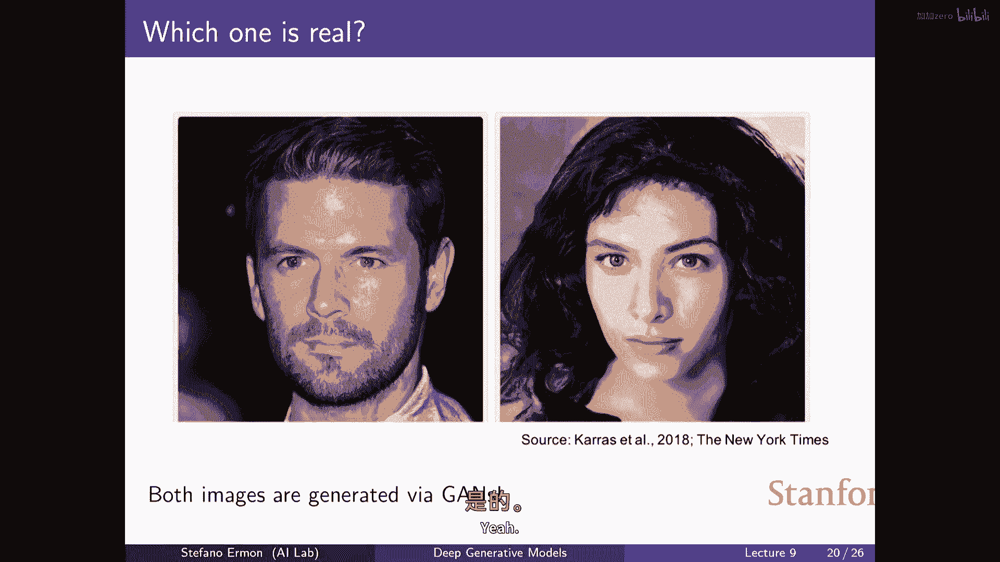

# 【深度生成模型 CS236 2023】斯坦福—中英字幕 - P9：p9 Stanford CS236： Deep Generative Models I 2023 I Lecture 9 - Norm - 加加zero - BV1NjH4eYE1v

好的，所以今天我们要讨论生成对抗网络，所以我们要开始介绍另一种类型的生成模型，就像回顾一下，这有点像整体的故事，整体路线图，为了讨论我们在这门课程中要讨论的东西，当你构建生成模型时。

基本想法是你从一些数据开始，并假设数据基本上是一组相互独立的样本，来自我们未知的概率分布，我们称之为p data，然后，你有一个模型家族，这是一个由神经网络参数化的概率分布集合，然后，你做的是。

你定义了一种数据分布和模型分布之间的某种相似性概念，然后，你在模型家族的概率分布集合中尝试优化，你试图找到一个根据某种相似性概念接近数据分布的概率分布。

我们已经看到了在这个集合中基本构建概率分布的不同方法，我们现在看到了回归模型，其中您有链规则，您基本上将生成模型问题分解为一系列简单的预测问题，我们见过变分自编码器。

我们基本上再次通过类似于一个大型混合模型的方式，在大数据上建模密度，然后我们看到的最后一类模型是这个正则化流模型概念，其中，类似于变分编码的变分出编码器，有一个特殊的解码器类型。

这就是一个确定性的可逆变换，再次，我们通过变化变量规则获取这些密度，但关键的是，我们基本上总是试图建模模型对任何特定数据点的概率分配，我们这样做的原因是如果我们能做到，那么我们就可以做最大似然训练。

所以如果你知道如何根据模型来评估概率，那么训练模型的方式就非常自然，基本上，这就是最小化数据分布和模型分布之间的KL散度的想法，我们都知道这相当于最大化似然度。

所以有一种非常自然和原则性的比较概率分布的方式，当你有访问似然度的权限时，这种方式工作得非常好，而且很多这种机制就像是一种设置模型的方式，使得你可以高效地评估似然度，这就是做事情的一种方式。

我们今天要看到的基本上是一种不同的比较相似性的方法，或者是测量概率分布之间的相似性的方法，所以我们要改变这个故事的一部分，并且我们要尝试以不同的方式比较概率分布，通过这样做。

我们将在定义模型家族方面有很多灵活性，因为我们不再需要基本上的训练目标，训练目标不再基于最大似然，因此我们将有更多的灵活性，实质上在定义生成模型本身方面，所以记住，再次像我们到目前为止所做的那样。

我们是在训练模型。"我最大似然估计"，所以，想法是我们对每个数据点都有密度或概率质量函数的访问权，"所以我们可以问模型你生成这个特定结果的可能性有多大"，在这个情况下，数据点x_i是。

"如果我们能做到那个"，然后，我们也可以啊，"尝试选择参数，使我们在训练数据集上生成的模型最大化概率"，"我们拥有访问的权利"，或者等价地，我们可以选择参数为。

我试图最大化模型分配给我们的训练集平均对数概率，选择这种学习目标的原因有很多，特别是，可以证明在这种意义上它是最优的，我的意思是，基本上在一些假设下，这些假设在实践中不一定成立。

但在一些理想假设和理想的设置中，你有一个足够强大的模型，嗯，存在一种像样的识别条件，不是很重要，"但是，在某些情况下"，"技术条件"，"你可以证明，基本上通过最大化似然来估计模型的参数是有效的。"。

"基本上解决这个特定的优化问题是最有效地利用数据的方法"，所以基本上，你还可以设置其他一些学习目标，"这可能会给你提供模型真实参数的估计值"，"但是，在所有这些各种技术中"。

"最大可能性估计的是最快收敛的那个"，这基本上意味着给定一定量的数据，"你做的最好的事情就是那能带给你正确答案的事情"，基本上使用最少的数据，这就是为什么使用最大似然是一个好主意的原因，因为。

在某种意义上，你在满足一些技术条件下，正在充分利用你所能接触到的数据，嗯，而且你知道的另一个原因，最大似然是一个良好的训练方法，目标是我们已经看到它对应于一个压缩问题。

所以如果你能在一个数据集上实现高似然，那么这就意味着你在压缩数据方面会做得相当好，我们知道压缩是一种合理的方式，就像学习目标之一是，在某种程度上，就像如果你如果你能够压缩数据。

那么这就意味着你可以大致预测可能发生的事情，而且这是一种迫使你理解数据中模式的好方法，因此，压缩通常被视为一种相当好的学习目标，然而，它可能不一定，嗯，我们要的，所以，我们首先看到的，是在有些情况下。

达到高可能性并不一定与，嗯，让我们说，达到高质量的样本，所以，如果你在考虑训练一个生成模型来处理图像，例如，有可能构建出能给你高可能性，并且质量差的样本，反过来，也有可能训练出样本质量非常高的模型。

意思是，它们产生的图像非常真实，但同时它们的可能性又非常差，所以，你知道，通过最大似然训练模型具有很好的特性，它可能不是我们想要的，嗯，如果你关心的是，让我们假设，生成漂亮的样本，"如此美丽的图片"。

"所以这就有点像"，"这将是选择不同种类训练目标的动力"，"这些并不一定基于最大似然"，所以啊，让我们看看，有点像，"首先，让我们更严格地解释一下这个意思"，嗯，"这个"，我们所知道的是，如果某种方式。

你能够找到这个优化问题的真正全球最优解，所以如果你真的能够找到一个完美匹配数据分布的模型分布，如果某种方式你回到这张图片，如果你能够使这个距离精确为零，数据和模型之间的差异真正为零。

所以你能够达到这个优化问题的全球最优解，那么你就处于良好的状态，因为well你获得最佳可能的似然度，并且你产生的样本基本上是由定义决定的完美，因为你知道你的模式与数据分布完全相等。

所以如果你从模式中采样，它就像从数据中采样，所以这就达到了最佳状态，但我们将要看到的是，只要匹配不完全，只要存在一点点的差距，在实际应用中，这总是要发生的，嗯，然后，嗯，你知道。

在KL散度接近或等价于在似然度上做得好的情况下，并不意味着你正在实现一个好的样本质量，是的，但是有些how如果你真的非常能够得到真正的全局最优，那么你就是好的，但对于不完美的模型。

获得高似然度并不意味着你获得良好的样本质量，反之亦然，这是否像这些变化在最优点周围的区域，那里，突然你开始得到最佳结果，直到那时，好的获取，让我们得到一些体面的结果，所以我们将看到。

这个不幸地并不是真的，这里是一个你可以得到非常良好似然度的例子，但是非常差的样本，因此，为了做到这一点，你可以基本上想象这种情况，当你提出这个模型，它是一个两个分布的混合。

它是真数据分布和某些纯噪声垃圾分布的混合，因此，采样过程是这样的，在这里你翻一个硬币，然后以99%的概率你生成噪声，你生成垃圾，以1%的概率你生成一个来自数据分布的真实样本，当然。

在实际中你不能真正做到这一点，但这只是来显示存在能够实现非常良好似然度的模型，我们将看到，但是非常好的样本质量，我的意思是，样本质量差，因为99%的时间你正在生成纯纯的垃圾。

只有1%的时间你正在生成好样本，我们将看到是，嗯，尽管这个模型正在生成非常差的样本，它实际上实现了非常良好的似然度，为了看到它实际上是一种相对简单的推导，当你根据这个模型评估数据点x的概率时。

你得到一个和的两个术语，它是在数据分布下的真实概率，和是在噪声分布下的概率，即使噪声分布可能非常坏，概率至少与，你知道有1%的概率从数据中采样，所以对这个数据点的概率分配至少与你知道的一样大。

这是一个和的两个非负量，所以这是对数的，}，你知道，它的大小至少等于来自数据分布的那个小贡献的日志，因为我们正在取对数，对百分之一乘以p数据的对数等于对p数据的对数，减去这个对数一百，所以某种方式。

基本上我们 here 看到的是，这个模型分配给数据点的对数概率是您可以得到的最佳对数概率，根据真正的 uh，数据分布向下偏移了一些常数，特别是，这意味着如果你以数据分布为参考来期望这个。

所以你想要看到模型能达到的平均对数似然度，你知道，如果你对左边的表达式取期望，你对右边的表达式取期望，你就会得到，平均上，这些模型表现相当好，嗯，从意义上说，它的性能与您得到的性能相同。

如果您使用真实数据分布作为模型偏移了一些常数，然后嗯，我们知道，因为照顾分歧是非负的，嗯那 somehow，这是最佳的您可以为任何模型做的平均对数似然，不可能比您使用真实数据分布时得到的对数似然更好。

如果您使用真实数据分布，来评估由数据分布产生的样本的似然，好的，这就像你知道方差是非负的，如果只是移动对数到另一边，就是在说数据分布，如果数据来自数据分布，世界上最好的可能模型是你可以产生的数据模型。

是数据分布，无论你选择得多聪明，你无法做得比使用更好，产生数据的真实模型，所以你可以看到，基本上就像这样，嗯，这，嗯，嗯，我们得到的性能基本上被这种数据分布的熵所限制，并且低于同样的东西，稍微偏移一点。

我主张常数并不重要太多，嗯，因为如果你把它看作是我们增加维度的数量，所以当我们进入更高的和更高的维度时，这种可能性是，这个片段的基本规模将与维度的数量线性相关，而常数是固定的。

它不依赖于你正在建模的变量数量，所以，而且直觉是，如果你例如，你看到一个，你分解，哦，这是一个错误，这应该是p数据，抱歉，这是一种类型的这里，但是基本上如果你使用一个，如果你根据链规则分解真实数据分布。

你可以看到这里的这个术语，对数据log p的规模与您拥有的变量数量成正比，而第二个部分不依赖于变量数量，所以你可以看到在高维中，这个模型基本上在做你能期望做的最好的事情，这个模型的可能性。

哪个产生垃圾百分之九十九的时间，这基本上就是你可能实现的最佳水平，因此我认为，回到您的问题，这意味着存在一个模型，它非常接近最优模型，并且仍然产生非常，非常差的结果，尤其是在高维中，是的。

这个 standing joke，但是像这样，同样也在花费模型，不仅用在我的信用上，这就像是把这些都像地一样分配回去，我对这个感到恼火，而且我可以做出真的很，是的，那是一个，那是一个好问题，是的。

到你能多大程度上使用它，让我们假设有坏数据，然后某种方式训练模型那样，用最大似然方法怎么做并不明显，但是使用生成对抗网络，这就是我们今天要讨论的，实际上，很容易将负数据集成到模型中。

所以如果你知道存在一些显然不可能的事情，或者你不喜欢的事情，那么将负数据集成到模型中就非常直接，就像是，将这种负向数据增强融入到你的训练目标中，例如，是的，如果你正在训练图像。

然后应用一个像拼图操作者一样的东西，你可以生成一个拼图，然后移动碎片，你会得到一个具有正确局部纹理的图像，但这不是你想要的，你可以融入这种数据增强，本质上或负向增强来改善训练，这适用于一般情况。

对于基于概率的模型来说，做起来稍微有点困难，嗯，但是，这是一个好主意，你能否使用某种类型的集成来单独模型噪声，我知道对于标准监督学习来说这不成立，我们也可以这样做，足够的生成设置，我们只是单独模型线条。

把它取出来，又有你想要的数据，所以你在说，基本上有一个混合物在试图，我们像，噪声来自哪里，试图过滤它出来，或者，如果你训练多个集成，是的，他们中的一部分是从真实分布中学到的，然后噪声部分。

但如果你平均很多他们，那么你只会强化共同的信号，然后当噪声相互抵消时，我只是好奇，如果你能做点什么，我想一般来说，我们不假设我们猜我们不在设置中，哪里我们假设存在训练数据中的噪声。

所以我认为我们在谈论的设置是你知道，你不想要什么，并且你不会利用这种，但你不需要找出什么是噪声，什么是不是，因为你已经知道，在这里我们处于数据干净的设置中，数据实际上只是数据分布的一些样本。

所以你想要利用你所有可以访问的东西，没有任何必要过滤噪声，因为我们假设数据是干净的，数据只是一堆来自数据分布的样本，所以你应该利用你所有可用的资源，这只是一个类似于构建的世界模型。

但它在某种程度上展示了一个观点，即优化似然度，可能不会给你提供高质量的样本，因为至少从概念上讲，通过优化似然度，你可能得到一个像这样的模型，这个模型百分之九十九的时间会产生垃圾。

但它会给你提供高的似然度，所以存在这样的潜在问题，相反地，有可能得到产生伟大样本和极差日志的模型，有没有人猜猜你怎么能做到那个，你会怎么做，是的，过拟合，过拟合，是的，这可能是最简单的方法去做。

只是记住训练集，所以你构建一个模型，你知道它将所有概率质量均匀分配，假设分布在训练集上，然后，如果你从这个模型中采样，样本将看起来很好，或者，按定义，仅仅是训练样本，所以基本上我可以做得比那更好，但是。

测试似然度将像最坏一样，因为它将要分配，基本上零概率给模型在训练期间没有见过的任何事情，所以再次，恐怖的对数似然，所以再次，这表明可能有用去解耦，一点样本质量和似然，然后我们有一些成功。

通过最大似然训练模型并不一定总是这样，并且可能会有其他可能的训练目标会给我们在实践中带来好结果，所以这就是种像样的动机，嗯，然后生成对抗网络的关键思想，这是一种不同于基于似然函数的训练目标，因此。

让我们回到高层次的视图，基本上我们要做的就是，我们将改变这里的性能度量，我们将改变比较我们模型好坏的方式，我们将通过丢弃KL散度来比较模型的好坏，这就是我们一直在做的。

我们将尝试一些替代的方式来比较两个概率分布，这不依赖于似然，是的，所以第三个情况，像样于火车的样本是非常好的样本，我们是因为像样，所以像样吗，你怎么定义梯度，是的，这是一个好问题，什么是好的样本。

也许你可能想要多样性的样本，在这种情况下，这可能不会，但如果你想象像，如果你看它们，它们将看起来，你知道完美，它们将有正确的结构，它们将它们将很好，除了可能不够多样性之外。

因为你实际上没有生成任何东西新，但据推测它将在质量上，嗯，对于单个样本，它们应该应该很好，是的，对于每个单个样本，质量的好坏将很好，太好了，让我们看看如何做到，所以基本想法是嗯。

我们将考虑决定问题的确切问题，嗯，你知道是否，嗯，通过看，两个分布是否相似，它们是如果你不从一个或另一个分布中采样，你将得到的样例类型，你可以想象这个设置，我给你一些来自分布P的样本。

我给你一些来自分布Q的样本，并尝试做，我们可以尝试找出是否有一种方法可以告诉我们，这个我们用于生成第一批样本的分布是否实际上与用于生成，这个样本组的分布相同，正确的样本组，嗯，如果你能做到，然后嗯。

这可能是一种比较概率分布的好方法，因为我们如果没有一种方法可以告诉我们分布是否不同，那么可能意味着分布接近，所以这就是我们要做的，是我们将使用称为两样本测试的东西。

这基本上是一个确定这些两个样本组S1和S2是否来自由同一概率分布生成的样本的程序，它是一个假设检验问题，所以，它是确定样本S1和S2是否来自由同一概率分布生成的样本。

或者是否不是由同一概率分布生成的样本，因此，它是一个关于样本是否来自同一分布的问题，你可能在其他上下文中见过这个，基本上有一个零假设，这就是分布是一样的，所以p等于q。

所以第一个组的样本与第二个组的样本有相同的分布，还有一个备择假设，这就是分布是不同的，是的，再来一次，我们为什么想要比较分布，是的，我们想要比较分布，因为我猜我们需要一个训练目标，所以您知道。

我们通常使用KL散度来确定我们的模型与数据有多近，我们大致说好，KL散度是好的，但可能并非理想，从意义上说，你可以非常接近并得到高KL散度，但仍然有糟糕的样本，因此，也许存在选择不同的空间，嗯，比较。

用于比较的不同方法，关于与某个分布更接近的分布的，嗯，样本的感知质量，这将允许我们做出不同的事情，这就是主要的动机，所以一种方法是说好吧，假设我有来自p数据的一堆样本。

所以他们有来自p theta的一堆样本，我怎么比较他们，最基本的事情就是说，我能否决定他们是否不同，因为我如果无法确定他们是否不同，那么就意味着我是那么的接近，他们相同。

所以如果我在这个假设检验问题中失败，或者是很难的，在这个任务中做得很好，那么就意味着分布相似，所以我有一个很好的方法，那么我就有一个合理的方法来比较那个，那么也许我在学习问题上做得很好，所以这就像直觉。

但是也像随机性p值进入问题的问题，因为像，例如，说p值为5%，那么就像5%的时间，所以即使它们相同，你会拒绝对吧，所以这种方式就是这样出来的，方法，你怎么做，通常你会做的就是想出一个检验统计量。

这就是一个函数，你用它来比较这两个集合，例如，你知道你可能尝试看第一个组的样本平均值是多少，与第二个组的样本平均值相比，或者你可以看方差，第一个组样本的方差与第二个组样本的方差相比。

并且如果确实p等于q，那么，你对这里的样本平均值应该期望与这里的样本平均值相似，与这里的样本平均值相似，你对样本方差也应该期望相似，所以，例如，一种你可以尝试的统计量是这样做，首先。

你在第一个组中计算平均值，你在第二个组中计算平均值，然后，你将它们进行比较，你可以说，好的，如果这个嗯，统计量大于某个阈值，那么我在所有可能性假设中拒绝它，否则我说你知道零假设为非假设，它与我观察一致。

正如你所说，总是存在一种类型一和类型二错误，在意义上，t是随机的，因为s一和s二是随机的，因此，即使p等于q，也有可能平均值不同，仅仅因为随机性，对我们要做的事情来说并不重要，嗯，但是，没有。

这是一个难题，是，你知道，即使你有一个好的统计数据，但仍然存在一些错误的可能性，但你可以问的问题，好的，确定哪个统计数据是最好的，这个假设检验问题的工具是否有效，你可以尝试最小化类型一和类型二错误。

会有假阳性，会有假阴性，但你可以尝试选择一个最小化错误的统计数据，这些类型的错误不需要像可微函数一样，可以有人类参考，这是我最好的，我们将看看如何产生这个t，这只是一种手工制作的，这不是最好的一个。

但它将类似于某种，是的，嗯，它将基本上被学习，是的，在这里，我们试图区分两种不同的分布，你最初的样本来自两种不同类型的生成模型，它们正在制作最终的，在实际中可能是两者，一个是真实的数据，一个是。

让我们说，一个来自数据分布的样本是s1，而s2来自我们的模型，但它不必，它可以是两种模型，它可以是，嗯是的，这相当通用，我们实际上将如何使用它来生成对抗网络，一组样本将是真实的，另一组样本来自模型。

它们是假的，然后，我们将使用某种统计，来尝试确定这些两个样本是否相似，嗯，是的，这里的关键观察是至少你知道，有一些空间可以选择不同种类的测试统计，你可以选择一些统计，哪些不依赖于p或q的似然度，例如。

你只看看平均值，你不需要了解概率，你不需要能够评估在p下的概率，你不需要评估在q下的概率，你可以基于你提到的一堆样本来计算这个函数，就像你可以过度拟合并复制，他没有遵循这两个单一测试，你将有相同的。

是的，所以问题来了，是否解决了过拟合问题，嗯，你是否仍然有过拟合问题，就像在，即使你使用最大似然估计，你仍然可能出现过拟合问题，所以这不直接解决过拟合的问题，尽管是的，你可以，有时候。

至少你可以使用像验证和类似的东西来查看会是什么，嗯，是的，所以嗯，我们将看到，是的，所以，测试统计量，也就是，如果你选择它作为你的交叉熵损失，那么它就是同样的事情，如最大化，离开，你可以，是的。

所以你可以尝试选择基于模型概率的统计量，但你不必，所以再次，有点像，生成性建模的设置，包括两个样本测试，是一个有，有很多样本的，这些样本只是来自数据分布，我记得那就是我们所有。

我们总是假设有人给我们提供访问，来自数据分布的一堆样本，这就是我们的训练集，所以这就是第一个样本组，然后，就像以前，我们拥有一组模型，我们拥有一组分布，P theta，是我们愿意考虑的。

只要这些分布容易从样本中抽取，这并不是一个糟糕的要求，因为显然你打算使用样本，用模型来生成样本，但只要你能够以某种方式从模型中抽取样本，你总是可以生成第二组样本作为两个，这些样本基本上就是模型的样本。

然后你可以尝试训练，基本上这个高层次的想法是，而不是尝试，找到，嗯，一个模型，P theta 仅仅会优化在这个集合上，以便我们最小化这两个分布之间的KL散度，我们将尝试找到一个模型，它试图最小化这个。

我们决定使用的任何测试统计量，以比较两个样本集，并且正确，例如，在前一个例子中，它可以是像这样的，尽量确保我产生的样本的平均值与我有的在，样本的平均值在，嗯，训练集中，这将不会很有用，但这有点像。

高层次的想法，因此，问题在于，就像找到一种好统计方法并不容易，嗯，例如，如果你只是想尝试最小化这种测试的统计方法，你知道，你将会得到一个生成模型，该模型产生与训练集具有相同均值的样本，即，你知道。

它的均值，就是，这是，一种令人向往的特性，但是并不像，如果仅仅匹配均值那样足够，你仍然可以产生非常差的样本，而且，对于这种统计测试，找到一些好统计测试非常困难，所以可以说是直觉上的，你可以说，好的。

让我们假设你开始通过匹配均值来比较概率分布，所以如果你比较均值，你将能够区分，让我们假设这个绿色的高斯分布与这个红色的高斯分布不同，但是，你可以说，仅仅匹配均值是不够的。

这里有两个具有相同均值但变异性不同的高斯分布，所以如果你仅仅比较均值，你不能区分这两个高斯分布，然后也许你和如果你匹配，让我们假设均值和方差，你可能有不同的分布，这些分布具有相同的第一个时刻。

或者相同的均值和方差，如高斯和拉普拉斯密度，相同的均值和方差，但形状不同，所以有点像你可以有点感觉，越多，尤其是你有更多的维度，当你建模时，很多像素或很多标记，有许多不同的方式来。

或者许多不同的东西你可以看，当你比较两个概率分布时，有许多不同的特征你可以尝试来比较样本与 respect to，所以像手工制作一个检验统计量一样，说，好的，让我们尝试根据这个来训练一个模型。

这是因为这不太可能工作，因为你将匹配检验统计量，"然后，还有其他一些你未曾考虑的不同之处。"，实际上在实践中真正重要的那些，所以嗯，我们打算做的事情是我们要尽力。

"而不是选择一种固定的手工制作的统计测试"，"我们将尝试学习一种排序方法。"，"自动识别"，"这些来自数据和模型中的一组样本，通过哪些方式有所不同？"，他们彼此不同，"而不是将其固定"，就说。

让我们比较平均值，我们，我们打算尝试学习使这两组样本不同的因素，并学习如何做到任何气体，我们打算尝试基本上训练一个分类器，本质上在这个，其他生成对抗网络的语言中被称为判别器，所以我们打算，你知道。

这就是你通常会做的机器学习，你知道，如果你正在尝试解决一个分类问题，你正在试图找出正类与负类之间的区别，分类器的工作，或者，例如，深度神经网络的任务是识别允许你区分的特征，并区分这两组样本，所以。

我们将使用相同的想法，来确定我们应该看哪些数据的特征，以区分绿色曲线和红色曲线，本质上，这就是我们要干的基本事情，因为我们要再次训练一个分类器，在这个上下文中，它被称为判别器，主要用于分类。

我们将使用二分类器，例如，神经网络，尝试区分真实样本，这些基本上来自第一个集，由数据分布生成的一个，让我们说，标记一个，来自假样本，由p theta由我们的模型生成的那些，我们可以说，例如，标记零。

我们可以训练一个分类器来做到这一点，并作为一个测试统计量，我们可以使用分类器的损失的负数，我们为什么做得好，如果分类器的损失很高会发生什么，如果嗯，让我们说，如果分类器的损失低。

那就意味着你做得很好在区分两者，并且它们被很好地分离，分类器的性能很好在区分这些两组样本，因此它们非常不同，所以我们想要测试统计量很小，嗯要大，抱歉，如果我们有一个，如果我们有一个高损失。

那么真实和假样本就很难区分，所以我们期望它们相似，是的，是的，自由度如何，尽管，我只是有一点，有一点，因为像，如果我们预测那个，但如果你在做这种分类云任务，像损失的似然性仍然像，它是，是的太多了。

所以你完全正确，所以它是基于分类器的似然性，它不是基于生成模型的似然性，所以通过这种方式做，我们将使用似然性，但它将是所有分类器的似然性，这更容易因为，这将只是基本上一个二进制变量的似然性，所以本质上。

它实际上并没有对可以使用的神经网络类型施加任何限制，与输入超过x的可能性相反，这要求你要么使用回归模型，要么使用可逆的神经网络，在这里，它对可以使用的架构类型施加了大量的限制。

它只是基本上一个二进制随机变量的可能性，这是类别标签，所以，你所要做的就是，你需要在最后有一个软max，它将其映射到概率，但是，你可以根据x做任何事情，所以，你可以从输入中提取你想要的任何特征。

想出一个好的分类器，实际上对架构类型没有限制，优化起来更容易，是的，所以这个分类器的目标，我们训练这个分类器的方法是，最大化两样本测试统计量，基本上，嗯，试图找出哪种统计，基本上。

"我们能够最大程度地基本区分数据和模型"，"这相当于最小化分类损失"，"所以我们将按照常规的方式训练一个分类器，以最小化损失。"，"因为这也是我们最基本区分这两者的最大力量来源"，"这两份分布"。

这两组样本，在讨论我们应该使用哪些统计数据之前，先明确一下，"为了确定在这种情况下他们是否不同"，"并且我理解的部分是"，"我们实际上并没有真正去想那个统计数据究竟意味着什么"，我们只是在进行分类。

以确定是否超过，这将实际上是一个数据，所以这就是实际的数据，它可能是这样的，实际上更像是一组统计数据，这些都是当你改变时可以得到的所有，你有，你有一个分类器，然后你可以想象改变分类器的参数。

然后你可以思考你知道的，如果你要的话，尝试找到一个最大化这个目标函数的分类器，那就是最小化交叉熵，你基于数据来近似它，因为你只有来自p数据的样本，并且你只有来自模型的样本，你最终会得到像这样的东西。

这将是一个统计量，我记得在我们只是取s一中的x的平均值之前，和s二中的样本x的平均值，现在我们不再只看手段，我们现在看分类器对这些两个样本所说的话，这就是我们要使用的，基本上就像我们之前讨论的那样。

比如如果法律是，这只是，哦，这是，这是分类器的负损失，他们正在最大化，所以如果这个量很大，那么它意味着你做得很好地分离了他们，这意味着它们不同，如果损失是，如果这个量很低，那么它意味着你非常困惑。

你没有做好区分它们的工作，这支持了可能它们相似的想法，不难，很难区分，你只是得到旋转，是的，所以我们这里有，你知道，设置是我们之前有过的，我们看到，你知道我们将使用它作为统计量。

我们将使用我们标记为五的分类器，因为它是可以训练的，它将是另一个神经网络我们将训练，他们将训练这个神经网络，试图区分样本集s1和样本集s2中的样本，样本集s1是，你知道，它就是来自数据分布的一个样本。

样本集s2只是来自模型分布p theta的一组样本，如果你最大化这个目标函数对于分类器，你基本上在尝试做到最好，你知道，你基本上只是在按照常规方式训练分类器，通过最小化交叉熵，这将是我们的统计量。

在意义上，分类器的损失将告诉我们这些两组样本有多相似，基本上，这些两个样本组的相似性，嗯，基本上，是的，判别器，phi正在做二分类，使用交叉熵目标函数，你看，在这里要做得好，你应该做什么。

你应该分配概率一给来自p data的所有样本，你应该分配概率一给来自p data的所有样本，你应该将来自模型的所有样本的概率分配为零，如果你想最大化那个量，嗯。

这基本上就是你如果训练分类器的话会做的事情，区分两组样本，这就是负交叉熵，所以目前p theta只是，它只是固定的，它是模型分布，数据分布是你通常的情况是固定的，你只有一些来自它的样本，那就是一个。

而且我们看到的是，我们将尝试优化分类器以做到最好，在这个区分真实样本和伪造样本的任务中，因为，分类器的损失将，基本上告诉我们来自模型的样本与来自数据的样本有多相似，来自数据，是的。

我们将解释损失是如何告诉我们的，如果它是，嗯，我想它是为我准备的一个，嗯，是的，所以想象一下，我在这里有它吗，是的，所以想象一下，某种方式，也许是的，好的，想象一下，如果p代表两个分布是相同的。

那么p theta就是等于p data的，那么p theta就等于p data的样本，那么这两个样本就来自于同一个分布，所以，分类器基本上不能比随机更好，因为你实际上是在取两个来自相同分布的样本组。

然后，就没有办法区分它们，因为它们实际上来自同一个分布，所以，你不能比随机更好，因此，你将有一个高的损失，另一方面，如果样本差异很大，分类器将能做出一个相当好的工作来将它们分开。

然后在哪个地方损失将会很小，因此基于那个我们可以得出一个统计，基本上可以说，基于分类器的损失，我们将决定样本是否相似或不相似，所以到你能够使用分类器很好地将它们分开的程度，那么我们就说它们。

它们是不同的，如果它们 somehow 在某种程度上都重叠，并且没有找到一种好的分类边界方法，然后我们在讨论，好的，那么可能两个样本相似，我们喜欢的地方，事情将消耗大量，你知道，所以我们可以设置那个。

你想要，你需要第一个术语，因为，我想你可能确实需要它与某些东西进行对比，否则，像你一样喜欢它将变得微不足道，这通常是喜欢，也许一个不喜欢，如果你需要，如果你有一个分类问题，你需要来自两个类别的数据。

否则，我模型实际上没有多少可以学习的，我模型，它应该只是学习如何欺骗正确的人，它应该只能控制来自，哦，是的，这与那个无关，是的，是的，是的，好的，好的，你已经领先一步，你已经开始考虑以θ优化。

我们现在在这里不做，是的，但是目前我们只是优化φ，这取决于两者，显然当你以θ优化时你是正确的，你只关心第二个，第二个术语，确实，梯度只会涉及那个术语，是的，又是好的和符号，是的，所以这里的符号是说。

记住，我们有一组样本作为p数据中的一个群体，它们来自数据集，这是你的训练集，或者是来自p数据的一个小样本集，然后，我们有另一组样本，S2，它们来自模型分布p theta，然后。

我们有一个在这里的某种目标函数，这取决于模型和判别器，我们看到的是，判别器将试图优化这个量，这取决于模型和判别器，它将试图最大化它，这相当于基本上试图做到最好。

在区分真实样本从来自p theta的假样本方面，我们之所以有这个v，是因为我们还将试图，然后以theta为参数优化这个函数，因为我们想要训练生成模型，所以后来会出现的基本上是一个最小最大优化问题。

我们将优化这个v在哪里，无论是相对于theta还是相对于phi，所以当，当判别器试图优化这个v数量时，但他们试图最大化这个v数量，而模型将试图最小化这个数量，因为模型是我们试图使它的。

我们试图改变p theta来欺骗判别器，或试图使分类问题尽可能难，所以后来将有一个关于theta的外部最小化，这就是我们如何训练它们的，很酷，结果最优的判别器实际上具有这种形式。

这 kind of like 有道理，这只是如果你仅仅使用贝叶斯规则并计算，一个点 x 属于正类真的条件概率是多少，在这种情况下是，让我们说，数据分布真实样本处理得很好，真的条件分布是。

基本上那个点由数据分布生成，"在那个点被总概率所分割的，实际上由要么"，"模型或真实数据分布"，"因此，特别是"，你可以看到，如果x只是嗯，"根据数据分布可能"，"然后。

模型应该分配给最优的判别器一个标签"，"因为你基本上等于一加一加零"，"然后那就是一段时间"，例如，"如果两个模型相同"，所以，如果一点从p theta或p theta的概率相等。

"那么这个数量应该是一半"，"哪种像是有意义的"，"因为如果x在p theta和p数据下等可能"，那么你知道你能做的最好的就是准确地说出一半的可能性，"如果一个点更有可能来自p数据，因为这个比例很大"。

"然后，分类器应该为那个点分配高概率"，"并且，如果一点从p数据中产生的可能性非常小，因为分母很小"，"然后，分类器应该为那个点分配低概率"，这像是最混乱的，判别器可以，好像p等于pit。

看起来我们回到了目标，你试图逃避，那就是你不想要两个分布之间的KL散度，就像，我想我们如何获得这个问题，所以我们不，因为确实你知道，就像KL散度将被最小化，当两个分布相同时，并且那是KL散度的全球最优。

所以无论我们做什么，我们仍然将趋向那个全球最优，在实际中，你实际上无法达到它，所以真正重要的是，如果你有一个不完美的模型，所以你实际上无法实现这个，嗯，你知道KL散度将取一些非零值。

这个量可能会取一些其他非零值，一个可能的论据是，也许在次优模型中，你应该偏好一个不能欺骗判别器的模型，不能欺骗判别器，与能给你高压缩率的模型相比，因为也许那更符合你关心的事情，我可以有一个判别器吗。

那就是一个具有softmax的生成模型，所以在x的最终结果中，嗯，就像一个二进制的，我可以有一个性别和模型，它们与，让我们说正常护理，过敏反应，有关，我用那个，我就要出去，我正在离开我的，所以你在说。

你可以使用基于似然的模型来做判别器吗，是的，你可以，那实际上是变体训练方式的一种，生成模型的一种，它们是 kind of，嗯，沿着那些路线的，我们将稍后谈论这个问题，当我们谈论噪音时，对比估计。

我认为它将与您建议的相当相似，如果你有访问似然或似然部分的能力，那么你可以像那样，利用并尝试设计，但是那样就违背了目的，正如我们所见，是，这个的主要优势是，你不需要访问似然度。

你需要的只是能够从模型中高效地采样，这意味着你可以使用，极其基本地，一个任意的神经网络来定义生成过程，这是这种程序的一种大优势，是的，那是作为合理性检查的，你可以看到。

如果p theta等于p data，并且这个量对于每个x都是一半，基本上意味着你最好能做到，分类器对于每个x都会输出0。5，这确实是你最好能做到的，如果分布是相同的，你无法比随机性做得更好。

所以这是分类器最困惑的时候，基本，好的，所以现在，我们如何，嗯，获取下一步，现在我们决定那个将是我们的观念，那么我们如何使用它呢，嗯，你知道，我们如何比较基本p数据与p theta的相似性。

现在我们可以定义一个学习目标，试图优化p theta，以基本上欺骗判别器，所以它将是一种像游戏的方式，它将是一个生成器和判别器之间的最小最大优化问题，这就是你的生成模型和这个判别器。

这个分类器和生成器就是只是一个生成模型，通常这基本上看起来像一个流模型，在意义上，你从一个潜在变量z开始，然后你通过某种确定性的映射将它映射到一个样本，这是参数化为神经网络的，我们称之为g theta。

所以采样过程与流模型相同，你从一个简单的先验中采样z，例如，一个高斯，然后，你将其通过此神经网络进行变换，关键地，这与流动相似，但映射不需要可逆，可以是任意的神经网络，它是任意的采样器。

你以某些随机向量开始，并将其转换为样本，对于g没有限制，你有相同的维度，对，它可以有完全相同的维度，不需要有相同的维度，基本上对g没有限制，是的，你可以使用任何生成性模型，如，你可以使用任何生成性模型。

是的，但是，是的，优势，典型的良好，我们将看到实际上训练它非常方便，如果你可以大致通过，嗯，生成过程，嗯，但到一定程度，你可以使用，你确实可以使用其他生成性模型。

但优势是基本上你对这个神经网络没有任何限制，所以我们不必，你知道，这个神经网络的输出将有一些分布，但我们永远不会计算它，所以与替代回归模型、流模型或VAE不同，我们总是非常担心能够给定x时计算它。

我的模式产生特定x的可能性是多少，我们甚至不关心，因为我们将使用两个样本任务来比较它们以训练它们，因此我们不需要能够评估概率，因此我们，我们没有任何限制，基本上对这个采样程序做什么，它可以本质上是任何。

嗯，我们做的，然后，我们将训练这个生成器来做相反的事情，基本上与判别器的相反，生成器将试图改变这个映射，这实际上也改变了它产生的样本类型，以尝试最小化我们使用的统计，以支持这个零假设。

说数据等于我使用此模型时得到的样本分布，因此，结果是这个，你有这个最小最大优化问题，其中函数v是相同的，基本上是分类器的损失或负损失，然后，嗯，这个游戏中的两个玩家，生成器和判别器，他们有相反的目标。

判别器将试图最大化这个，再次，这是同我们之前有过的，这只是说分类器，这两个游戏玩家，生成器和判别器，他们有相反的目标，判别器正在尽其所能来区分样本，来自数据，来自这个生成模型的两个样本。

来自这个生成器和生成器将做相反的事情，它将尝试最小化这个，这个目标函数，这基本上意味着生成器正在尽其所能混淆分类器，它将尝试产生样本，使得最佳的分类器你能够对它们做出，嗯。

当你将它们与数据分布进行比较时，最佳的分类器将表现不佳，这支持了这样一个事实，如果分类器不能区分样本，我从数据集中的样本产生的话，我可能有相当好样的样本，这大致就像训练目标，嗯，我们将使用它来训练，嗯。

这个类生成模型的，因此，我们发现这与概率分布之间的相似性概念有关，嗯，我们知道最佳的判别器是什么，就是它是密度比，P数据除以P数据加P模型，基本上，我们现在知道基本上，最佳的判别器将取决于生成器做什么。

我们可以在基本情况下评估这个目标函数的值，当第二个玩家，判别器选择你能做的最好的事情时，给定生成器在做什么，因为我们知道那看起来什么样子，我们知道嗯，当判别器最优时，判别器只会给我们这个密度比。

P数据除以P数据加P模型，所以我们可以将它插入到这个表达式中，然后我们得到这种方程，所以这就是你获得的最佳损失，嗯，通过选择，每当你选择一个，嗯，一个生成器g，如果分类器选择。

如果我们选择给定g和数据分布时最佳的分类器，这就是那个目标函数的值，这看起来像Kale散度一样，它是对某些密度比的期望的日志，记住，散度是期望下p的log p除以q对吧，这种有一种风味，嗯，现在。

这些分母不是概率分布，它们没有归一化，如果你想得到积分为一的东西，你需要除以二，但在这里，你可以基本上只是除以二，然后减去你在这些分母中添加的对数四，现在，这只是一个还可以的，两个KL散度，你可以看到。

这是数据与数据和模型混合之间的KL散度，这是模型与混合的散度，相同的数据和模型混合，然后它被这个对数四偏移，这是因为我在这里添加了这两个，所以你需要一个对数才能使其相等，所以这说的是。

这个目标作为生成器的函数，等于这个KL散度的和，实际上它有一个名字，它被称为Jensen-Shannon散度，嗯，数据分布和模型分布之间的Jensen-Shannon散度，所以这个东西本质上是两次。

这个被称为Jensen-Shannon散度的量，它也被称为对称散度，如果你看那个表达式，它基本上就是，如果你想计算p和q之间的Jensen-Shannon散度，你基本上计算p和半p半q的混合之间的散度。

然后做相反的q和p和q的混合之间的散度，它有很好的性质，我们知道KL散度是非负的，两个散度的和也必须是非负的，这个的全球最优是什么，像什么时候，它可以是零，是的，所以它也有一个很好的性质。

即全球最优可以实现，如果和基本上分布是一样的，嗯，它是对称的，这很好，记住，KL散度不是对称的，pq不是KLqp，这是通过定义对称的，并且也有更强的不等式，但不是很重要，这意味着，如果嗯。

你能够优化这个量在这里作为g的函数，所以如果你最小化这个v作为g的函数，这是我们在这里外面的做的事情，你将基本上选择，一个与数据分布完全匹配的数据和模型分布，所以。

全局最优解就是你使用KL散度时得到的结果，你将得到类似于这种最优损失，所以，夏季基本上就是一个总结，我们做的是，我们正在改变方式，我们比较数据分布和模型分布，我们基于两个样本测试统计量选择这种相似性。

统计量是通过优化分类器和在理想条件下获得，所以，分类器可以基本上最优，这在实践中不会发生，因为如果你使用神经网络，它可能无法学习到密度比值，但在理想条件下，这基本上对应于在这里不使用KL散度。

而是使用Jensen-Shannon散度来比较数据与，与模型，文章的意思是要评估损失并优化它，您只需要从p theta中采样，您不需要评估似然度，这很棒，嗯，因为那意味着你没有自动攻击的限制。

规范化事物，规范化流，你不必担心它，生成器的架构选择有很多灵活性，基本上只需要定义一个有效的采样程序，这基本上总是成立的，如果你将随机噪声输入到神经网络中，你将得到一个采样程序，一个有效的采样程序。

这就是你需要的全部，而且它速度快采样，因为你知道你可以在一个通过一次生成器遍历中生成一个样本，所以它不像自回归模型，一次变量一个，一切都在一个通过一次遍历中生成，缺点是，嗯，在实际应用中训练非常困难。

因为你有一个最小最大类型的优化问题，因此，在实际操作中，你需要做的事情是像这样的，你需要从训练示例的小型批次开始，然后，从生成器的先验中获取噪声向量的样本，然后，你将它们传递给，你知道。

你将这些噪声向量传递给g来生成m个假样本，然后你基本上有这两个小型批次，你有m个真实数据点和m个假数据点，这是你通过将z_i传递给生成器得到的，然后，你做的事情是尝试优化你的分类器，你的判别器。

以最大化那个目标，分类器就是通常的分类器训练，只是尝试取一个，你知道，你走一步到梯度上升，在这种情况下，走在目标函数上，试图改进，嗯，这个，嗯，这个优化目标以做得更好，基本上，分类真实的数据与假数据。

和类似地，正如之前提到的，然后生成器也在尝试lou，也在看同一个目标函数，但它有一个相反的目标，他们是生成器，试图最小化这个目标函数，你可以仍然做梯度下降，你做的是计算这个量与theta的梯度。

这是生成器的参数，第一个项不依赖于theta，那就是数据，所以，你知道，你不能改变数据的样子，但你可以做的是尝试调整g的参数，所以生成器的参数，看起来像由这个判别器测量的真实数据，我。

这就是你通过在那个目标上取这种梯度下降步骤得到的，嗯，对于这个，嗯，我们使用更新的文件来感知梯度，或者你，是的，所以，它是，很遗憾的是，训练这个非常困难，而且这不保证会收敛，它可以是，你知道，在实际中。

你会使用新的phi，你会做，你会继续下去，试图玩这个游戏，每个玩家都在试图玩得稍微好一点，并希望它会收敛，你重复这个，并希望会发生好事，嗯，这里是一种像样的视觉化，如果你这样做，所以，在这里发生了什么。

你可以想象，在这里，正在发生的事情是，你可以想象，存在一堆z向量，然后他们被g映射到不同的x位置，所以这里z和x只是一维的，这就给了我们一个分布，这就是这个绿色曲线，所以你可以看到。

生成器的样本大多数最终在这里，然后有一个数据分布，这就是这个固定的红色曲线，它就是它，然后假设你开始以一个不是很好的判别器，现在是这里这个弯曲的蓝色线，考虑到你有一堆红色的样本，并且你有一堆绿色的样本。

所以真实的样本和来自当前生成器的假样本，一个生成器，你会做的就是尝试想出一个好的分类器，在你更新判别器后得到的更好分类器是这个蓝色曲线，所以正如你可以看到，你知道如果轴来自这个左侧。

那么他们可能来自真实的数据分布，就像他们没有可能来自生成器，因为生成器在这里的概率非常低，数据的概率非常高，因此，判别器应该说这里的样本应该有高概率是真实的，这里的样本应该有高概率是假的。

或者低概率是真实的，然后在这里之间，嗯，你知道它并不清楚，然后，当你向右边移动时，你就降低概率，这就是当你优化五个时发生的事情，你基本上会得到一个更好的判别器，一旦你有了更好的判别器。

你可以尝试更新生成器来欺骗这个判别器，所以会发生什么，你会改变这里的箭头，这些基本上是g，它告诉你如何将来自先验的随机噪声映射，你喜欢的z两个轴，特别是如果你试图欺骗这个判别器。

你将尝试将概率质量移至左侧，所以你可能会得到一个新的生成器，看起来像这样，并且这个判别器更困惑，因为你可以看到它与红色曲线的重叠更多，并且判别器将很难尝试区分这两个样本，然后你一直继续。

直到你达到希望这种收敛，在哪里判别器，在哪里生成器通过绿色和红色曲线匹配数据分布时重叠，它们相同，判别器最大程度地困惑，并且它到处产生一半，因为它在那个点无法做得更好于机会，就像你知道的，实际实现。

我猜这可能是，这不像是一个嵌套的循环看起来，实际上这更像是一个单一的for循环，在其中你，是的，他们吃了其他日期。

是的，是的，是的，而且嗯，所以在你需要完成的任务中的部分，判别器的工作主要是看一堆样本，比如这两个，我需要决定，你知道，哪一个是真实的，哪一个是假的，基本上，所以你认为哪一个是真实的。

实际上两者都是假的，是的。

所以是的，你知道这个，这种技术，这些年来有了很大的改进，从2014年到2018年，你可以看到，现在甚至有更好的改进，嗯，在许多任务中都非常成功，但在实践中很难使它们工作，因为优化不稳定，是的。

只是随机高斯噪声，这里没有标题，是的，这只是随机噪声，然后您将它们传递到一个网络，该网络将它们转换为图像，是的，是的，生成对抗网络（GANs）有许多问题，第一个问题是不稳定的优化。

有点像因为你有这个最小最大目标，训练它们非常困难，甚至很难知道何时停止，因为它不再像似然度，你可以看到它正在下降，在某个时候，你可以停止当，嗯，或者应用，让我们说，或者你知道你在最大化似然度。

你看到它上升，在某个时候，你看到它不再改善，你现在可以停止，因为你不再知道何时停止的基本情况，并且它可能出现一个叫做模式坍缩的问题，我们将看到啊，基本上，而KL散度是模式覆盖的。

我将尝试将概率质量分配到 everywhere，因为否则你会得到巨大的惩罚，如果某事物在p数据下是可能的，但你给它分配零概率，那么你将有无限的惩罚，这可能会更倾向于追求潮流，"因此。

他们可能只关注几种类型的数据点"，"并完全停止生成其他种类的数据点"，"存在于训练集中的"，"因此，在实践中，你需要许多技巧来训练这些模型。"，"而且，我要向你介绍一些关于如何做到这一点的参考资料。"。

是的，或者你可以看到一些，我的意思是理论上，"并且存在一些非常不现实的假设"，这种程序类型，你在判别器和生成器上进行更新，或者在每一步，或者像你找到的最优判别器在实际中应该如何工作，但在实际中不是这样。

你所看到的是，损失在训练期间振荡，所以它可能看起来像这样，嗯，其中你有生成器损失，这是绿色的一个，判别器损失，并且两种样本类型，你可以看到的真的和假的，它们好像一直在振荡，嗯，因为它们没有达到像样的。

是的，基本上通过这个梯度过程不收敛，并且没有坚固的停止准则，你不知道，你应该何时停止，你真的不知道，你唯一能做的就是看样本，大致看看，好的，它在做有意义的事情，然后你就停止，但是它是一个。

找到一个原则性的方法来决定非常困难，嗯，何时停止训练，所以另一个问题是你有模式坍缩，这是一个再次出现的问题，生成器基本上只集中在几种样本类型上，它不生成其他类型的样本，你可以在这里看到示例，我们更像是。

如果你看样本，它真的很喜欢这种数据点，它一直在生成它，嗯，你可以看到像，一个更玩具的例子，它可以让你感受到正在发生的事情，类似，想象一下数据分布就像是一堆高斯分布的混合，无论是在二维空间中。

它们就像是躺在这个圆盘上，嗯，然后当您训练生成器时，它就像是在移动，所以可能在某个时候它产生了一个模式，然后判别器做得很好，但是您知道，区分它做的和真实数据，然后生成器开始在不同的模态上移动概率质量。

并且它一直在移动，但是它从未同时覆盖所有这些，为了使目标分布成为，你知道，嗯不，因为这有几行，然后欺骗了，你知道，再次以适应一个，是的，所以你需要使用各种各样的技巧，在我们的例子中，在任何地方。

你都可以看到它如何有点像塌缩在，生成在某个特定数字上，它 kind of like 停下来学习，有一篇伟大的帖子，博客帖子可以黑客，在那里，你可以看到所有类型的黑客。

你可以用来获取生成对抗网络（GAN）的，在实际工作中工作，并且还包括包括噪音和各种技巧，你可以在网站上查找到，在那网站上，遗憾的是，所有这些都非常经验性，没有任何东西是保证会工作的，所以你必须尝试。

并且有更好的架构，它们是技巧，有时工作，有时不工作，但我要说，这些模型如此难以训练的事实，这就是为什么它们不再算是最先进的，人们已经基本上放弃了GANs，人们开始使用扩散模型，因为它们更容易训练。

并且它们有一个嗯，在训练期间可以评估的清晰损失，你知道如何停止，并且没有不稳定性，这只是一个你需要解决的单一优化问题，我认为这是主要原因，GANs已经不再那么流行了，嗯但是人们仍然在使用它们。

你知道这是，这是一个强大的想法，可能会回来，但我认为那是主要缺点，非常非常难训练，人们对功能的尊重有所损失，看起来是真正看到实际的生成模型，我认为它已经被训练，你知道，来自这个的信号，就像一个信号。

我们可以，是的，所以判别器正在查看数据，然后，你看，生成器正在从数据中学习什么，判别器实际上对数据学习的非常狭窄，这是一个非常狭窄的信号，是的，这就是为什么你也一直在移动。

因为然后取决于判别器正在寻找什么样的特征，你可能试图赶上那些，但是然后继续改变，然后你真的不会收敛到任何地方，如果你喜欢像标准模型那样组合，是的，是的，实际上，甚至有一些我最近在CML上看到的最新论文。

他们在那里采用了一个扩散模型，然后他们有一种聪明的方法，基本上将一个判别器融入，以提高性能，而且，如果你可以添加一点点判别器，以便，以一种有意义的方式比较样本，那往往有帮助，所以这就是，是的。

这就是我们还在谈论这个想法的原因，因为它实际上很有力量，而且你可以将它与其他现有的模型结合使用，是的，它对其他事情仍然有价值，是的，在这里初始化生成模型使用预训练的vae是一个好主意。

或者你更喜欢从头开始训练吗，当你有数据足够多的时候，就像人们通常从头开始训练的那样，是的，是的，哦，好的，而且我认为基本上到最后，但是是的，我认为这是第一个，生成模型生成的艺术。

几年前在克里斯蒂的拍卖会上被拍卖，这是一幅由gan生成的画作，当时是最好的之一，人们预计它会卖在这个范围内，我认为它卖了大约五百万美元，所以是的，哦，是的，是的，它是，它是，它是，嗯，但是它是，是的。

我想这是一种新奇的事物。

所以是的，嗯，酷，我认为。

