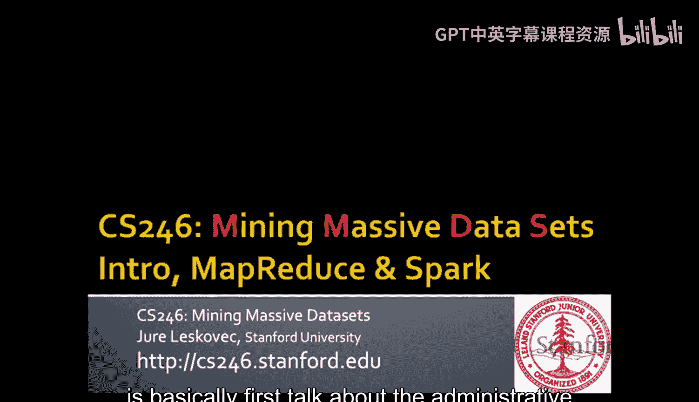
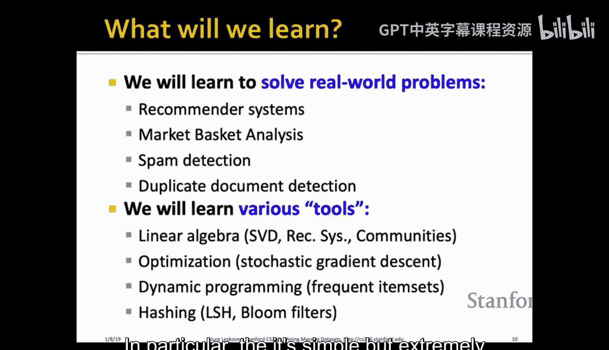
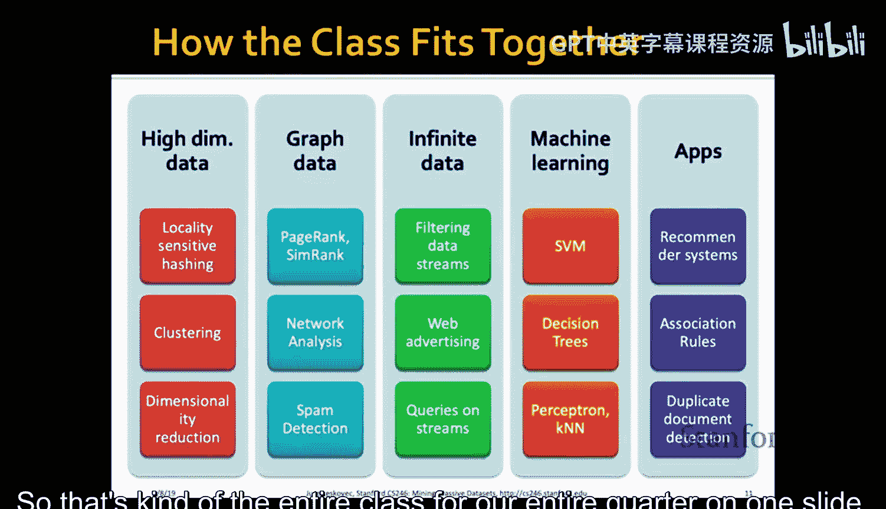
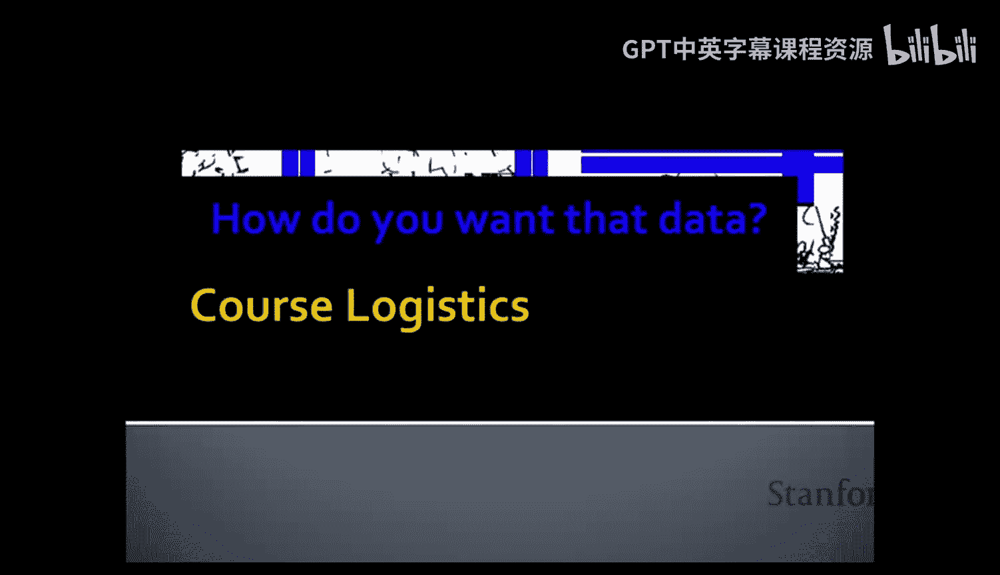
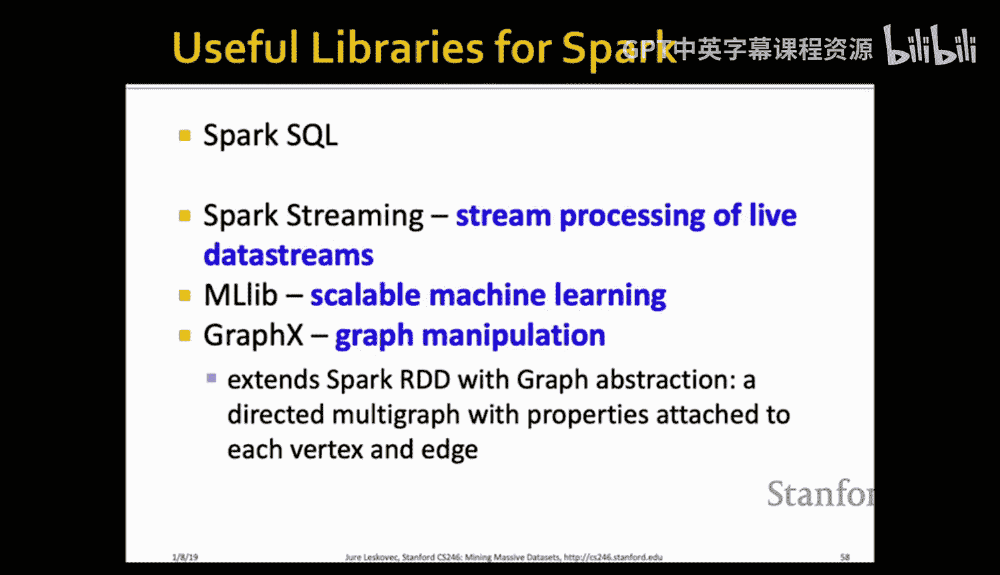
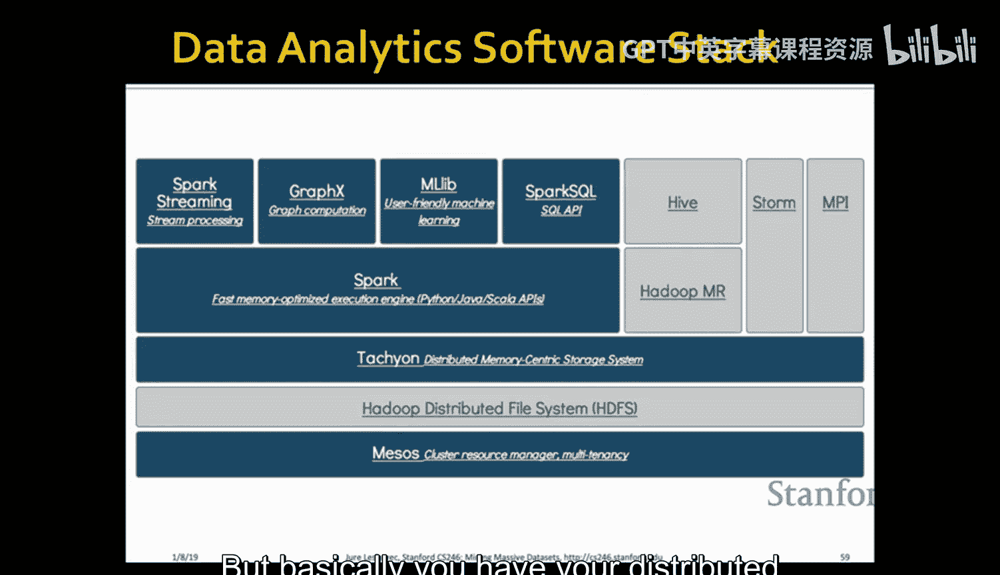
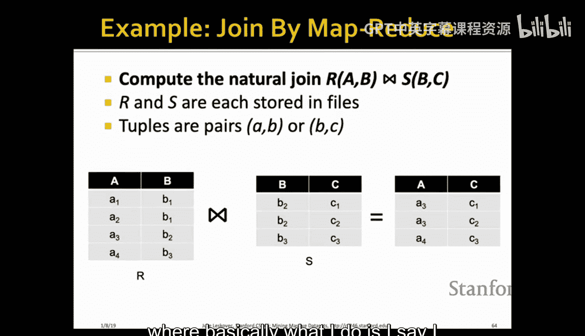

#  001：课程介绍；MapReduce与Spark

在本节课中，我们将学习课程的整体介绍，并探讨用于分析海量数据的核心计算工具和架构，特别是MapReduce和Spark。

## 课程概述与动机

欢迎来到CS246：海量数据集挖掘课程。这是一个激动人心的新季度。

如今，计算领域正经历一个激动人心的转变。历史上，计算机主要用于生成数据（例如物理模拟）。而现在，计算机首次被大规模用于**分析**海量数据。数据蕴含着巨大的价值和知识，我们的目标就是从数据中提取这些价值和知识。通常，我们处理的数据越多，能提取的价值和知识就越多。

数据挖掘、大数据、预测分析、数据科学、机器学习和人工智能等术语，在本质上都是这一核心理念在不同阶段的体现。这一切都得益于我们终于拥有了**海量数据**和**强大的计算能力**，将两者结合就能创造奇迹。

本课程的重点在于**规模**。即使是当前机器学习和深度学习领域的革命，也是拥有海量数据和强大算力的结果。因此，本课程将聚焦于如何处理海量数据集，以及并行化在这些场景中的重要性。

## 课程内容与方法

我们可以将分析方法分为两大类：
*   **描述性方法**：用于描述数据的结构，发现人类可理解的模式。例如，**聚类**，用于发现数据中出现的不同类别或类型。
*   **预测性方法**：给定某些变量，用于预测其他变量。一个典型的例子是**推荐系统**，根据用户历史预测其可能喜欢的电影。

本课程融合了理论计算机科学（算法）、机器学习（统计模型）和系统（数据库管理系统）的知识。我们将使用可扩展的算法和机器学习模型，结合处理海量数据的方法，来解决实际问题。

### 学习目标

我们将学习如何从不同类型的数据中提取价值并进行预测：
*   处理**超高维数据**。
*   处理**图结构数据**。
*   处理**数据流**（无限、永不终止的数据）。
*   处理**有标签**和**无标签**数据。

我们还将探讨支持这些数据处理的计算架构：
*   **MapReduce**：一种分布式计算框架，便于编写处理海量数据的程序。
*   **流式与在线算法**：一次处理一个数据点，决策后即丢弃，适用于持续流入的数据。
*   **单机内存算法**：经典的单机处理方法。

课程将结合这些数据类型和计算架构，解决诸多现实世界问题，例如构建推荐系统、市场篮子分析、垃圾邮件检测、网页搜索和重复文档检测等。

### 数学与算法工具

我们将使用多种数学和算法工具：
*   **线性代数**，特别是**奇异值分解**，用于解决推荐系统等问题。
*   **优化方法**，特别是简单但极其有用的**随机梯度下降**，用于大规模优化。
*   **动态规划**。
*   **哈希技术**，特别是**布隆过滤器**和**局部敏感哈希**。

## 课程结构与期望

课程结构围绕几个核心模块组织：处理高维数据、图数据、数据流、机器学习，以及这些方法在特定领域的应用。

我们的目标是，在课程结束时，你能像一位技艺精湛的大厨，面对任何数据挑战，都能从容应对，提出合适的解决方案。

## 课程管理与后勤

本季度课程任务繁重，但我们拥有一支优秀的助教团队。我们将从下周开始安排答疑时间，计划每周工作日安排两次，周末安排一次，以确保为大家提供充分的支持。

### 课程资源

*   **课程网站**：将发布讲义幻灯片、阅读材料、作业及解答。
*   **教材**：《Mining of Massive Datasets》。可以购买纸质版，也可以从指定URL免费获取PDF。每讲内容都对应书中的一个章节。
*   **MOOC课程**：有一个基于CS246的在线开放课程，可以在那里找到相关视频。
*   **特别辅导**：在课程前两周，我们将组织三次特别辅导：
    1.  **Spark教程**：Spark是一个用于分析海量数据的分布式系统。
    2.  **线性代数复习**。
    3.  **概率统计与证明技巧复习**。
    所有辅导课程都会被录制并发布。

### 沟通方式

我们主要使用**Piazza**进行课程沟通。请确保登录并关注Piazza上的动态。课程通知、作业更正等都会通过Piazza发布。Piazza不仅是一个向助教提问的平台，更鼓励同学们互相解答问题，助教团队会参与并认可正确的答案。积极参与Piazza讨论将获得额外学分。

### 课程作业与考核

课程考核包括以下几个方面：
*   **四次大型作业**：每次占总成绩的10%。第一次作业（作业0）是一个简短的Spark教程，旨在帮助大家熟悉软件环境，预计耗时1-2小时。后续作业预计每份需要约20小时完成，请务必尽早开始。
*   **每周小测验**：每周会有简短的电子测验。测验在周二发布，九天后（周四午夜）截止。**截止时间非常严格，系统不允许任何宽限**。测验可以多次提交，系统会随机改变题目参数，最终成绩以最近一次提交为准。
*   **期末考试**：占总成绩的40%，日期定在3月19日。
*   **额外学分**：积极参与Piazza讨论或报告课程材料中的错误，最高可获得占总成绩1%的额外学分。

### 先修要求与诚信准则

我们期望学生具备较强的编程背景（Python或Java）、基础的算法知识、概率论、线性代数、多元微积分和数据库系统基础。如果你在某些方面有所欠缺，可以通过课程提供的复习材料和“即时学习”来弥补。但**编程能力是必须的**，因为课程最终需要编写代码。

我们将严格遵守斯坦福大学的荣誉准则。你可以讨论作业算法，但必须注明讨论对象，并且必须**独立编写自己的代码**。严禁抄袭他人代码或使用网络上的代码。我们将使用工具检查代码抄袭情况。

### 相关课程与后续机会

CS246有一个姊妹课程**CS246H**，每周一次讲座，深入探讨用于数据处理的分布式系统内部原理（如Hadoop文件系统、MapReduce、Spark等）。CS246H的讲座也会被录制。

课程结束后，我们提供**CS341：海量数据集挖掘项目**，你可以将所学知识应用于实践，在指导下进行为期10周的数据密集型研究项目。此外，我们也为感兴趣的同学提供研究助理职位。

## 海量数据处理架构

现在，我们开始探讨用于处理数据的**大规模分布式系统**。

如今，大规模计算基础设施通常由通过商用网络连接的大量商用机构成，即大型数据中心。挑战在于：如何分配计算？如何简化在成千上万台机器上编写软件的过程？以及当机器故障时如何处理？

一个简单的计算是：假设一台服务器每三年故障一次（约1000天）。如果你有数千台服务器，那么预计每天会有一台故障。如果你有百万台服务器，那么每天将有约1000台机器故障。因此，软件必须具备**容错能力**。

### 核心思想：计算向数据移动

网络传输数据耗时很长。传统的思路是将数据从存储位置传输到计算节点。更好的思路是**将计算带到数据所在之处**，即在存储文件的本地进行计算。

### 容错机制：数据多副本存储

为了处理故障，关键思想是将同一文件存储在多个位置（副本）。这样，即使一台机器宕机，数据在其他地方仍有备份。

**Spark**和**Hadoop**就是为解决这类问题而构建的系统。它们为工程师或科学家抽象了底层细节，提供了：
1.  **存储结构/文件系统**（如Hadoop的HDFS）。
2.  **编程模型**（如MapReduce或Spark模型）。
程序员只需按照编程模型编写代码，无需担心文件如何分区、存储以及机器故障等问题。

### 分布式文件系统

为了实现持久化存储，我们使用**分布式文件系统**。它提供一个全局文件命名空间，但文件实际分布式存储。典型使用模式是处理巨大的文件（数百GB或TB级别），这些文件通常只写入一次，之后多次读取进行分析。

在Hadoop中，大文件被分割成多个**数据块**（例如64MB）。每个数据块会被复制多份，存储在不同的机器上，甚至尽可能分布在数据中心的不同位置。一个**主节点**（NameNode）负责存储元数据，记录所有数据块的位置。客户端库通过访问主节点来定位并获取具体数据块。这种机制确保了可靠的分布式存储。

## MapReduce 编程模型

MapReduce是一种旨在简化并行编程的编程模型，能自动管理硬件和软件故障，轻松处理大规模数据。其开源实现包括Hadoop、Spark和Flink。

MapReduce程序分三步运行：
1.  **Map阶段**：对每个输入元素应用用户编写的`map`函数，输出一组**键值对**。
2.  **分组阶段**：系统自动对Map输出的键值对进行**排序和混洗**，将相同键的所有值分组到一起。
3.  **Reduce阶段**：对每个键及其对应的值列表，应用用户编写的`reduce`函数进行聚合。

程序员只需编写`map`和`reduce`两个函数。

### 实例：词频统计

假设有一个巨大的文本文档，需要统计每个单词的出现次数。

*   **Map函数**：读取文档中的每个单词，输出 `(word, 1)`。
*   **分组**：系统自动将所有相同的 `word` 键分组，形成 `(word, [1, 1, 1, ...])`。
*   **Reduce函数**：对每个 `word` 对应的值列表求和，输出 `(word, total_count)`。

通过将大文档分割成多个数据块，可以在不同机器上并行运行多个Map任务。所有Map任务完成后，系统进行分组，然后Reduce任务也可以并行执行。MapReduce环境自动处理数据分区、任务调度、分组、容错和机器间通信。

### 容错处理

*   **Map任务失败**：只需在存有相同数据块的其他机器上重新运行该Map任务。
*   **Reduce任务失败**：只需重新执行进行中的Reduce任务。

## Spark：更现代的框架

Spark旨在解决MapReduce的两个主要问题：
1.  **编程模型限制**：许多问题不易用MapReduce模型描述。
2.  **性能瓶颈**：Hadoop MapReduce需要将中间结果持久化到磁盘，导致速度较慢，且多个作业链式执行时效率低下。

Spark是一种**数据流系统**，它进行了以下泛化：
*   允许任意数量的任务阶段，而不仅是Map和Reduce。
*   允许除Map和Reduce外的其他函数。
*   只要数据流是单向的（有向无环图），就可以实现故障恢复。

### Spark核心：弹性分布式数据集

Spark的核心抽象是**弹性分布式数据集**。RDD是分布在集群中的只读记录分区集合，可以缓存在内存中。RDD可以通过转换其他RDD或从Hadoop数据源创建。

RDD支持两种操作：
*   **转换**：基于现有RDD创建新RDD，如 `map`, `filter`, `join`, `union`等。转换采用**惰性求值**，直到遇到“动作”操作时才真正计算。
*   **动作**：触发计算并返回值或将数据导出，如 `count`, `collect`, `reduce`, `save`。

Spark允许用户构建复杂的有向无环图数据流，所有计算在内存中进行，避免了大量的磁盘I/O，因此通常比Hadoop MapReduce快得多。

### Spark生态系统

Spark拥有丰富的库，包括Spark SQL（类似SQL的查询）、MLlib（机器学习）、GraphX（图计算）和Spark Streaming（流处理）。现代数据分析栈通常由底层分布式文件系统、集群资源管理器（如Mesos）、Spark计算引擎以及上层各种应用库构成。

### Spark vs. Hadoop MapReduce

*   **速度**：Spark通常更快，但前提是数据能在内存中容纳。如果数据量远超内存，Spark性能会严重下降，而MapReduce由于依赖磁盘，更能处理超大规模数据。
*   **资源使用**：Spark占用大量内存，可能影响集群其他任务；MapReduce资源需求更温和。
*   **易用性**：Spark提供更高级的API，编程更灵活方便。
*   **通用性**：Spark不仅限于MapReduce模型，支持更广泛的计算模式。

## 适合MapReduce的问题

适合MapReduce的问题通常具有以下特点：
*   **批量处理**：对巨大文件进行顺序扫描和统计计算，例如词频统计、链接分析、构建语言模型（统计N元词组频率）。
*   **连接操作**：在大型关系表之间进行等值连接，可以自然地通过Map（提取连接键）和Reduce（合并记录）来实现。

MapReduce的高效性瓶颈通常不在于计算复杂度，而在于**通信成本**，即产生的中间键值对的数量以及需要混洗的数据量。因此，在设计MapReduce作业时，关键目标是尽量减少中间数据的大小。

## 总结

本节课中，我们一起学习了CS246课程的概览、动机和后勤安排。我们深入探讨了用于海量数据处理的核心架构：从分布式文件系统和容错机制的基础，到经典的MapReduce编程模型及其词频统计实例，再到更现代、灵活的Spark框架及其核心RDD概念。我们了解了Spark与Hadoop的对比，以及哪些类型的问题适合用MapReduce范式解决。记住，在处理海量数据时，控制**通信和中间数据规模**往往是实现可扩展性的关键。

请记得领取课程讲义，我们周四将开始第一个正式主题的学习。

