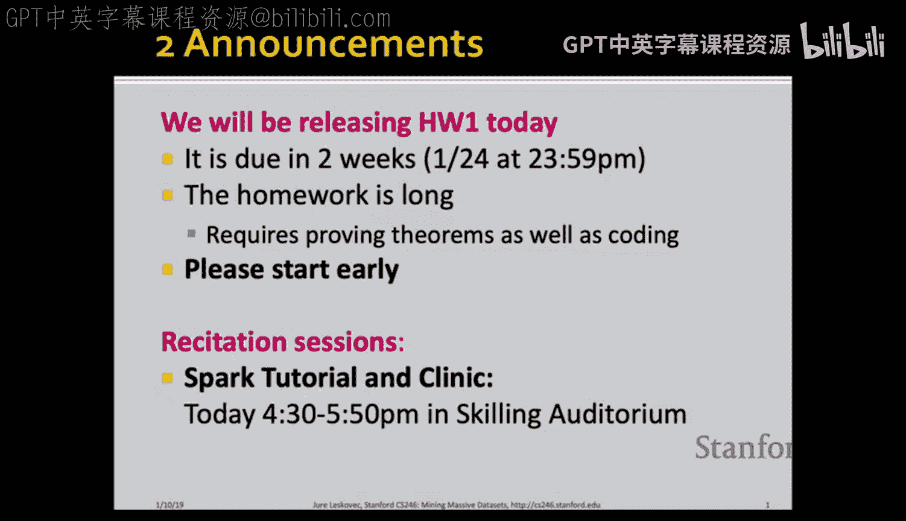

#  002：频繁项集与关联规则 🧺

在本节课中，我们将要学习数据挖掘中的一个核心概念：如何从海量交易数据中发现频繁出现的商品组合（频繁项集），并从中推导出有意义的关联规则（例如，“购买尿布和牛奶的顾客也倾向于购买啤酒”）。我们将从基本概念入手，逐步学习高效的算法，以应对大规模数据的挑战。

## 概述

关联规则挖掘的目标是识别数据中项目之间的有趣关系。其典型应用是市场篮子分析，即分析顾客购物篮中的商品组合。通过分析，我们可以优化货架摆放、进行商品推荐等。本节课将首先定义频繁项集和关联规则，然后介绍计算它们的核心算法。

## 1. 基本概念与定义

### 频繁项集

首先，我们需要理解几个核心概念。**项集** 指的是一组项目的集合。**支持度** 是衡量一个项集出现频率的指标，定义为包含该项集的交易（或“篮子”）数量。

**频繁项集** 是指支持度不低于用户指定阈值 **s** 的项集。例如，如果阈值 s=3，那么一个项集必须在至少3个交易中出现，才能被认为是频繁的。

### 关联规则

关联规则是一种“如果-那么”形式的规则，格式为 `{I1, I2, ..., Ik} -> {J}`。其含义是：如果一个交易包含了左侧项集 `{I1, I2, ..., Ik}` 中的所有项目，那么它也**很可能**包含右侧的项目 `J`。

为了衡量规则的质量，我们引入两个指标：
*   **支持度**：规则左右两侧所有项目同时出现的交易数量。它衡量了规则的普遍性。
*   **置信度**：在包含左侧项集的交易中，同时也包含右侧项目的比例。它衡量了规则的可靠性。其计算公式为：
    `confidence = support({I1,...,Ik, J}) / support({I1,...,Ik})`

一个高置信度的规则意味着当左侧条件满足时，右侧结果出现的可能性很高。

### 问题定义

关联规则挖掘的正式问题是：**找出所有支持度 ≥ s 且置信度 ≥ c 的关联规则**，其中 s 和 c 是用户给定的阈值。

## 2. 关联规则挖掘的两步法

挖掘关联规则可以分解为两个主要步骤：

1.  **找出所有频繁项集**：这是计算量最大、最核心的一步。一旦我们知道了所有频繁项集及其支持度，生成规则就相对简单。
2.  **从频繁项集中生成关联规则**：对于一个频繁项集 I，我们可以将其划分为两个非空子集 A 和 B（A ∪ B = I， A ∩ B = ∅），从而生成形如 A -> B 的规则。该规则的置信度可以轻松计算为 `support(I) / support(A)`。我们只保留置信度高于阈值 c 的规则。

以下是从频繁项集生成关联规则的具体步骤：

*   对于每一个频繁项集 `I`
*   生成 `I` 的所有非空真子集 `A`
*   对于每一个 `A`，输出规则 `A -> (I - A)`
*   计算该规则的置信度：`support(I) / support(A)`
*   如果置信度 ≥ c，则保留该规则

## 3. A-Priori 算法：发现频繁项集

现在，我们聚焦于最关键的步骤：如何高效地发现频繁项集。最直接的暴力方法是统计所有可能项集的出现次数，但对于海量数据（例如上百万商品），可能的项集数量是天文数字，内存根本无法容纳所有计数器。

A-Priori 算法的核心思想是利用 **频繁项集的单调性**：**如果一个项集是频繁的，那么它的所有子集也一定是频繁的**。反之，如果一个项集不是频繁的，那么它的所有超集也一定不是频繁的。

基于这一原理，A-Priori 算法采用一种**逐层搜索**的策略：

1.  **第一遍扫描**：统计每个**单个项目**的出现次数，找出所有频繁的**1-项集**（即支持度 ≥ s 的单品）。
2.  **第二遍扫描**：基于频繁的1-项集，生成候选的**2-项集**（即由两个频繁单品组成的对）。再次扫描数据，只统计这些候选2-项集的支持度，找出频繁的2-项集。
3.  **第三遍及后续扫描**：用频繁的2-项集生成候选的3-项集（生成时确保候选3-项集的每个2-项子集都是频繁的），然后扫描数据统计，找出频繁的3-项集。以此类推，直到无法生成新的频繁项集为止。

这种方法极大地减少了需要跟踪的候选项集数量，因为大量不可能是频繁的项集在早期就被修剪掉了。

## 4. PCY 算法：进一步优化内存使用

A-Priori 算法在第一次扫描时，大部分内存是空闲的（只用来计数单个商品）。PCY 算法巧妙地利用了这部分空闲内存。

在第一次扫描数据时，PCY 算法除了计数单个商品，还做了一件事：
*   对于交易中的**每一对商品**，将其哈希到一个哈希表的某个“桶”中，并增加该桶的计数器。
*   第一次扫描结束后，我们得到一个哈希桶计数数组。如果一个桶的计数值小于支持度阈值 s，那么这个桶就是“非频繁的”。

关键推论：**如果一个商品对哈希到了一个非频繁的桶中，那么这个商品对本身绝不可能是频繁的**（因为即使有哈希碰撞，该桶的总出现次数仍不足）。

在第二次扫描生成候选2-项集时，PCY 增加了一个过滤条件：一个商品对 `{i, j}` 成为候选，必须满足：
1.  商品 `i` 和 `j` 各自都是频繁的（A-Priori 的条件）。
2.  商品对 `{i, j}` 哈希到的桶是频繁的。

这样，PCY 算法通过第一遍扫描收集的额外哈希信息，在第二遍扫描前进一步修剪了大量不可能成为频繁项集的候选对，从而节省了更多内存。

## 5. 处理超大规模数据：减少扫描次数

当数据量极大，即使两遍扫描也成本很高时，我们可以采用基于抽样的方法。

**随机抽样法**：
*   从整个数据集中随机抽取一个能放入内存的子样本。
*   在内存中，对这个子样本运行 A-Priori 或 PCY 算法（注意，为了能发现潜在的频繁模式，需要按比例调低支持度阈值）。
*   在样本中找到的频繁项集作为“候选”，最后再用整个数据集扫描一遍，验证这些候选是否真正频繁。

**SON 算法**：
*   将大数据集分成多个能放入内存的块。
*   对每个数据块独立运行内存算法，找出在该块内“频繁”的项集（使用全局支持度阈值）。
*   所有在**任何一个**数据块中频繁的项集，都被收集为全局候选集。
*   最后，通过一次全局扫描，验证这些候选集在整个数据集上的支持度。

这些方法的核心思想是：**一个项集要在整个数据集中频繁，它至少必须在某个子集（样本或数据块）中频繁**。因此，我们可以用较少的全局扫描次数来发现所有真正的频繁项集。

## 总结

本节课我们一起学习了关联规则挖掘的基础。我们首先定义了频繁项集、支持度、置信度等核心概念。然后，我们深入探讨了发现频繁项集的关键算法：从基础的 A-Priori 算法开始，它利用单调性进行逐层搜索和剪枝；到更高效的 PCY 算法，它通过哈希技术进一步优化内存使用；最后，为了应对超大规模数据，我们介绍了基于抽样和分区的 SON 等方法，以减少对磁盘数据的扫描次数。这些算法是许多现代推荐系统和商业智能工具的基石。