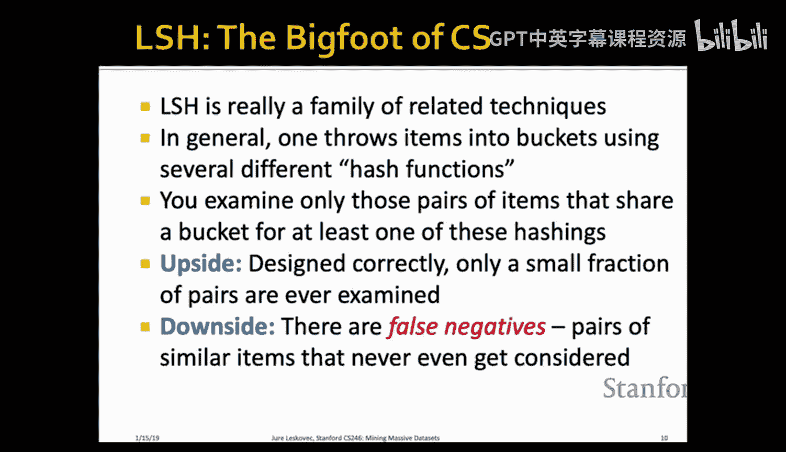
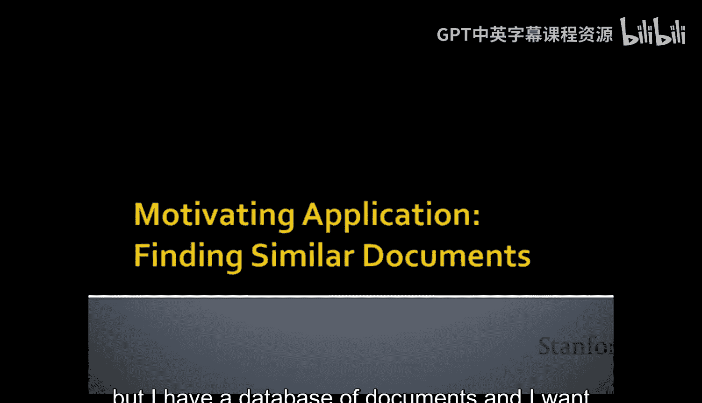
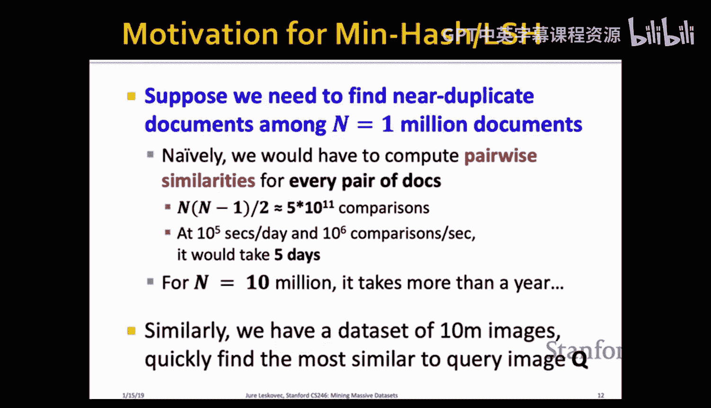

#  003：局部敏感哈希

在本节课中，我们将要学习一种名为“局部敏感哈希”的强大技术。这是一种非常巧妙且极具影响力的哈希函数应用方法，能够帮助我们高效地处理海量高维数据，例如快速进行图像搜索或查找相似文档。

## 概述：我们面临的问题

我们正在讨论高维数据。今天我们将探讨局部敏感哈希，未来几周将讨论聚类和降维。这些技术将为我们构建现实世界的推荐系统和推荐算法奠定理论基础。

我们面临的核心任务是：如何在海量数据集中快速找到相似项？例如，在Pinterest这样的应用中，用户从图像中选择一个子部分，系统需要在包含数十亿图像的数据库中，实时找出与该子部分相似的图像。

为了实现这一点，我们首先需要将图像（或文档）表示为某种形式。通常，我们会使用深度神经网络将图像编码为一个由0和1组成的向量（嵌入）。查询时，我们将查询图像通过相同的神经网络得到其编码，然后需要计算查询向量与数据库中所有向量（例如30亿个）的相似度，并找出最相似的项。显然，我们不能线性扫描整个数据库，因为那太慢了。

因此，问题在于：**如何在常数时间内（即不依赖于数据量大小）找到最近邻？**

## 应用场景与抽象问题

这项技术有两个主要应用方向：
1.  **最近邻查询**：给定一个查询点，在数据集中找到其最近邻。
2.  **全对相似搜索**：在数据集中找出所有相似度超过某个阈值的对象对。

例如：
*   **谷歌**：爬取整个网络后，需要找出所有近似重复的网页。
*   **推荐系统**：找出与目标客户最相似的其他客户，以便进行推荐。
*   **计算机视觉**：基于相似特征进行图像检索或图像补全。

我们将问题抽象如下：给定一组高维数据点和一个距离（或相似度）函数，目标是找出所有距离小于阈值 `s` 的数据点对。

朴素的方法是使用双重嵌套循环，计算所有点对的距离。这种方法的时间复杂度是 `O(n²)`，对于海量数据（如10亿个点）是完全不可行的。然而，我们将看到，**即使输出规模可能达到平方级，我们也能在线性时间内解决这个问题**。

## 解决方案：局部敏感哈希

我们将要学习的技术家族称为**局部敏感哈希**。其核心思想是：
*   使用特殊的哈希函数将数据项（如图像、文档）哈希到不同的“桶”中。
*   这些哈希函数被设计成具有“局部敏感性”：**相似的对象有很高的概率被哈希到同一个桶中，而不相似的对象则很可能被哈希到不同的桶中**。
*   这样，我们只需要检查那些被哈希到同一个桶中的对象对，它们就是潜在的相似对（候选对）。

这种方法不是完全精确的，它允许一定的误差（假阴性和假阳性），但能带来巨大的计算效率提升。

---

## 具体案例：查找相似文档

为了具体说明，我们以“查找相似文档对”为例。假设我们有100万个文档，目标是找出所有相似度超过阈值 `s` 的文档对。朴素方法需要约 `5×10¹¹` 次比较，即使每秒能进行100万次比较，也需要5天。对于10亿个文档，时间更是不可想象。因此，我们需要更聪明的方法。

我们将通过三个步骤来解决这个问题：
1.  **分片化**：将文档表示为0/1布尔向量（集合）。
2.  **最小哈希**：将大型布尔向量压缩为短签名，同时保持相似性。
3.  **局部敏感哈希**：使用哈希技术，聚焦于可能相似的文档对（候选对）。

以下是这三个步骤的详细说明。

### 第一步：分片化

分片化的目的是将文档转化为一个由元素组成的集合，通常表示为一个稀疏的0/1布尔向量。

**具体做法如下：**
*   一个文档的 **k-分片** 是该文档中出现的连续k个标记（token）序列。标记可以是字符、单词等。为简单起见，我们假设标记是字符。
*   我们将每个k-分片通过一个哈希函数映射为一个整数（例如4字节整数）。
*   这样，一个文档就被表示为其所有k-分片哈希值组成的集合。

**例如：**
文档内容：`A B C A B`
2-分片（k=2）：`AB`, `BC`, `CA`, `AB`
分片集合（去重后）：`{AB, BC, CA}`

**实践中，k值通常取10左右。这种表示的好处是：**
*   直观上相似的文档会有很多共同的分片。
*   更改一个单词只会影响少数几个分片，因此即使使用不同词汇的文档也可能保持较高的相似性。

**相似度度量：Jaccard相似度**
在得到文档的分片集合表示后，我们使用 **Jaccard相似度** 来衡量文档间的相似性。

对于两个集合 `C1` 和 `C2`，其Jaccard相似度定义为：
`sim(C1, C2) = |C1 ∩ C2| / |C1 ∪ C2|`

即，共同分片数除以总的不同分片数。Jaccard相似度的值在0到1之间。Jaccard距离则为 `1 - sim(C1, C2)`。

我们可以将文档集合表示为一个巨大的0/1矩阵：
*   **行**：所有可能的分片（或其哈希值）。
*   **列**：各个文档。
*   **单元格值**：1表示该分片出现在该文档中，0表示未出现。

在这个矩阵表示下，Jaccard相似度的计算依然成立：交集对应逻辑“与”，并集对应逻辑“或”。

### 第二步：最小哈希

现在，我们有了大型的稀疏布尔矩阵。直接比较所有列（文档）的代价仍然很高。因此，我们需要压缩这些列，生成短签名，同时要求**签名的相似度能近似等于原始列的Jaccard相似度**。

这就是**最小哈希**技术。它是一种针对Jaccard相似度的局部敏感哈希函数。

**最小哈希的定义如下：**
1.  选择一个随机排列 `π`，对矩阵的行进行重排。
2.  对于每一列（文档）`C`，定义其哈希值 `h_π(C)` 为：在排列 `π` 的顺序下，第一个值为1的行的索引。

**关键性质：**
对于任意两个列 `C1` 和 `C2`，在随机排列 `π` 下，它们的最小哈希值相等的概率恰好等于它们的Jaccard相似度。
`Pr[h_π(C1) = h_π(C2)] = sim(C1, C2)`

**直观解释：**
考虑两列的所有行类型：
*   **A类行**：两列值都为1。
*   **B类行**：C1为1，C2为0。
*   **C类行**：C1为0，C2为1。
*   **D类行**：两列值都为0。

当我们按随机排列顺序扫描时，第一个遇到非D类行（即至少一列为1）时停止。此时，两列哈希值相等的充要条件是，我们停在一个A类行（两列都为1）。因此，这个概率就是 `A/(A+B+C)`，这正是Jaccard相似度的定义。

**生成签名矩阵：**
我们不会只使用一个哈希函数。我们会选择多个（例如100个）随机排列 `π1, π2, ..., πn`，对每一列计算每个排列下的最小哈希值。这样，对于每个文档，我们就得到了一个签名向量 `[h_π1(C), h_π2(C), ..., h_πn(C)]`。

所有文档的签名向量组成了**签名矩阵**。签名矩阵的行数等于哈希函数个数，列数等于文档数。

**签名相似度：**
两个文档的签名相似度，定义为它们的签名向量中，对应位置值相等的比例。根据最小哈希的性质，这个比例的期望值等于它们原始的Jaccard相似度。使用的哈希函数越多，这个估计就越准确。

### 第三步：局部敏感哈希

现在，我们有了一个签名矩阵，它紧凑地保留了文档间的相似性信息。但我们的目标不是计算所有对的签名相似度（那仍然是 `O(n²)` 的），而是快速找出那些相似度可能超过阈值 `s` 的候选对。

这就是**局部敏感哈希**的用武之地。它是一个通用步骤，可以与任何局部敏感哈希函数（如最小哈希）结合使用。

**核心思想：**
我们希望通过哈希，使得相似度高的列（文档）有很大概率被哈希到同一个桶中，从而成为候选对；而相似度低的列则大概率被哈希到不同桶中。

**具体方法：将签名矩阵分割成“带”和“行”。**
1.  将签名矩阵的 `b` 行（即使用了 `b` 个哈希函数）分割成 `B` 个“带”，每个带包含 `r` 行。因此有 `b = B * r`。
2.  对于每一个带：
    *   将该带内每个文档的 `r` 行签名作为一个子向量。
    *   使用一个哈希函数将这个 `r` 维子向量哈希到一个具有大量桶的哈希表中。
3.  我们宣布：**如果两个文档在至少一个带中被哈希到了同一个桶中，那么它们就是一个候选对**。

**工作原理分析：**
假设两个文档的Jaccard相似度为 `t`。
*   在单个带（包含 `r` 行）中，由于最小哈希的性质，两文档在该带内所有 `r` 行签名完全一致的概率是 `t^r`。
*   因此，它们在某个特定带内不一致的概率是 `1 - t^r`。
*   那么，它们在所有 `B` 个带中都不一致的概率是 `(1 - t^r)^B`。
*   最终，它们**在至少一个带中一致**（即成为候选对）的概率为：
    `P(t) = 1 - (1 - t^r)^B`

这个函数 `P(t)` 是一个S形曲线，其形状由参数 `B` 和 `r` 决定。

**参数 `B` 和 `r` 的影响：**
通过调整 `B`（带数）和 `r`（每个带的行数），我们可以控制 `P(t)` 曲线的形状，使其在目标相似度阈值 `s` 附近尽可能陡峭，像一个阶跃函数。
*   我们希望：当 `t > s`（真正相似的文档对）时，`P(t)` 接近1（高召回率，低假阴性）。
*   当 `t < s`（不相似的文档对）时，`P(t)` 接近0（高精确率，低假阳性）。

**权衡：**
*   **增加 `r`（每个带行数）**：会使曲线向右移动，提高精确率（减少假阳性），但可能降低召回率（增加假阴性）。
*   **增加 `B`（带数）**：会使曲线向左移动，提高召回率（减少假阴性），但可能降低精确率（增加假阳性）。

在实际应用中，我们可以根据对假阳性和假阴性的容忍度来调整 `B` 和 `r`。通常，我们可以接受一定数量的假阳性，因为可以在后续步骤中对候选对进行精确的相似度计算来过滤它们。而假阴性（漏掉的相似对）则可能永远丢失。

---

## 总结

在本节课中，我们一起学习了局部敏感哈希这一强大的技术框架，用于在海量数据集中高效地查找相似项。

1.  **分片化**：我们将文档转化为k-分片集合，并用Jaccard相似度进行度量。
2.  **最小哈希**：我们学习了一种针对Jaccard相似度的局部敏感哈希函数。它通过随机排列和取首个“1”行索引的方式，将大型稀疏向量压缩为短签名，并神奇地保持了相似性：`Pr[h(C1)=h(C2)] = sim(C1, C2)`。
3.  **局部敏感哈希**：我们学习了通用的“带与行”技术。通过将签名矩阵分带哈希，我们将相似度与成为候选对的概率关系从一条直线“弯曲”成一条S形曲线。通过调整参数，我们可以让这条曲线在目标阈值处变得陡峭，从而高效地筛选出高相似度的候选对，而无需比较所有数据对。

这项技术是许多现代大规模搜索和推荐系统的基石。在下节课中，我们将进一步探讨如何为其他相似度度量（如余弦相似度、欧氏距离）设计局部敏感哈希函数，并更深入地分析参数选择对性能的影响。