#  004：局部敏感哈希理论

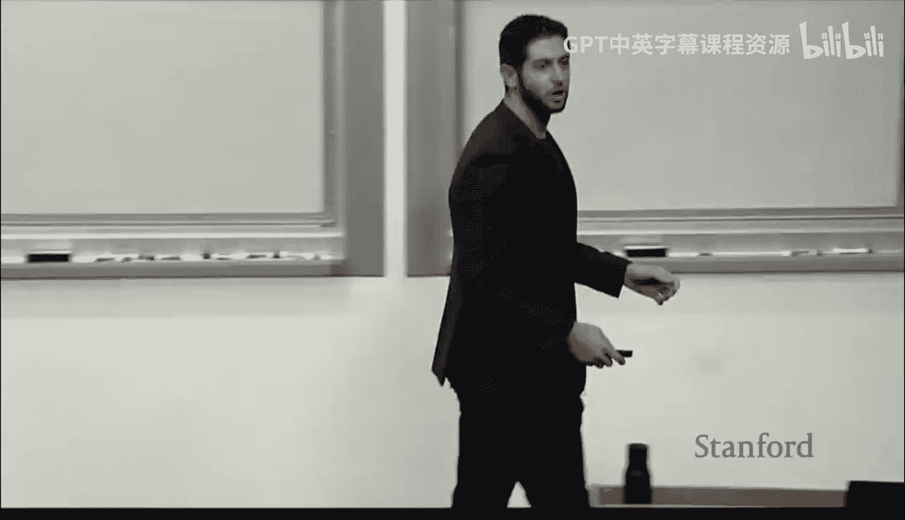

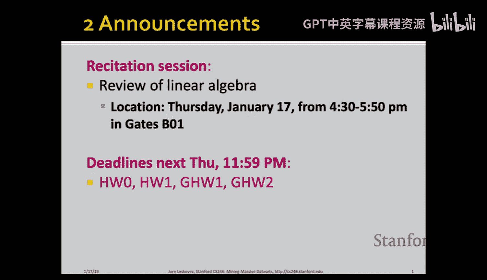

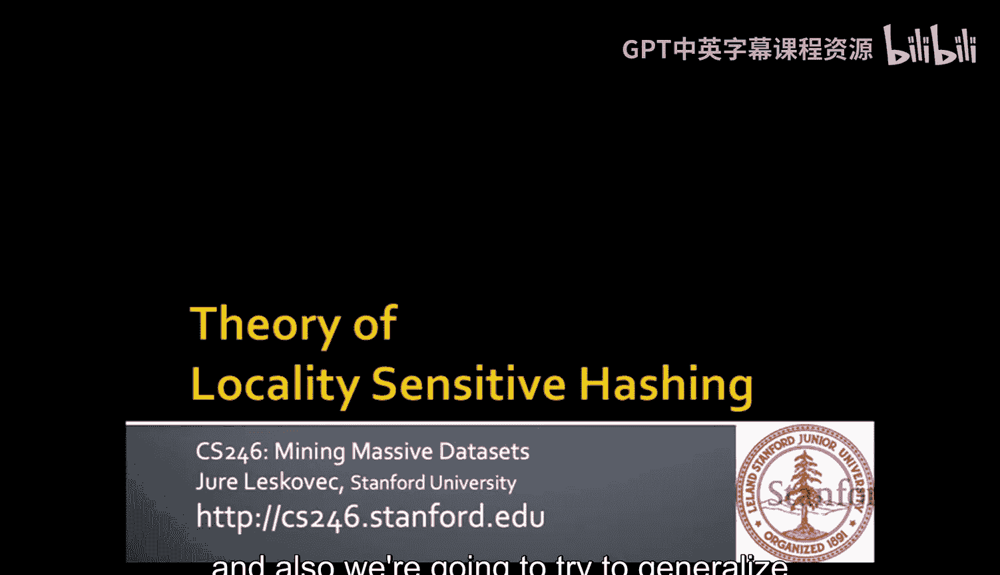

在本节课中，我们将深入学习局部敏感哈希的理论基础，理解其工作原理，并探讨如何将其推广到不同的相似性度量函数上。

---

## 概述

我们将首先回顾局部敏感哈希的基本概念和流程，然后深入探讨其背后的数学原理。核心目标是理解如何通过调整参数来优化哈希函数的性能，使其能够高效地从海量数据集中找出相似项。我们还将学习如何将这一技术应用于余弦距离和欧几里得距离等不同的相似性度量。

---

## 回顾：局部敏感哈希流程

上一节我们介绍了局部敏感哈希的动机。本节中，我们来看看其标准处理流程。

局部敏感哈希旨在解决海量数据集中寻找相似项这一计算量巨大的问题。如果进行两两比较，复杂度是二次方的。局部敏感哈希通过将相似项哈希到同一个桶中，将问题复杂度降低到线性级别。

以下是标准的三步流程：

1.  **Shingling**：将文档表示为K-shingle（或K-gram）的集合。一个K-shingle是文档中连续出现的K个标记序列（标记可以是字符、单词等）。
    *   例如，对于文档“ABCAB”和K=2，得到的2-shingle集合是 {AB, BC, CA}。
    *   此步骤的输出是文档的集合表示。

2.  **Min-Hashing**：将大型的集合表示压缩为更短的“签名”向量，同时保持集合间的相似性。其核心性质是：两个集合经Min-Hash后得到相同值的概率，等于这两个集合的Jaccard相似度。
    *   公式：`P(h(A) = h(B)) = Jaccard(A, B) = |A ∩ B| / |A ∪ B|`

3.  **局部敏感哈希**：对Min-Hash签名进行哈希，使得相似签名落入相同桶的概率高，不相似签名落入相同桶的概率低。通过将签名矩阵划分为`b`个波段，每个波段包含`r`行，我们只将那些在至少一个波段中所有`r`行都匹配的文档对视为候选对，进行后续详细的相似度计算。

---

## 核心：理解S曲线与参数调优

我们之前看到，如果只使用一个哈希函数，两个文档成为候选对的概率与其相似度呈线性关系，这无法有效过滤不相似的文档对。

理想情况是，我们想要一个类似阶跃函数的“S曲线”：当相似度高于某个阈值`t`时，成为候选对的概率接近1；当相似度低于`t`时，概率接近0。

局部敏感哈希通过组合多个哈希函数来逼近这个理想曲线。关键参数是波段数`b`和每个波段的行数`r`。

以下是推导候选对概率的步骤：

*   设两个文档的Jaccard相似度为 `s`。
*   在Min-Hash签名中，某一行两个值相等的概率是 `s`。
*   因此，在一个特定波段（包含`r`行）中，所有`r`行都相等的概率是 `s^r`。
*   那么，该波段不匹配的概率是 `1 - s^r`。
*   所有`b`个波段都不匹配的概率是 `(1 - s^r)^b`。
*   最终，**至少有一个波段匹配**（即成为候选对）的概率为：
    `P(candidate) = 1 - (1 - s^r)^b`

我们可以通过调整`b`和`r`来改变这个概率曲线的形状。

---

### 参数影响分析

让我们分析`b`和`r`如何影响S曲线。

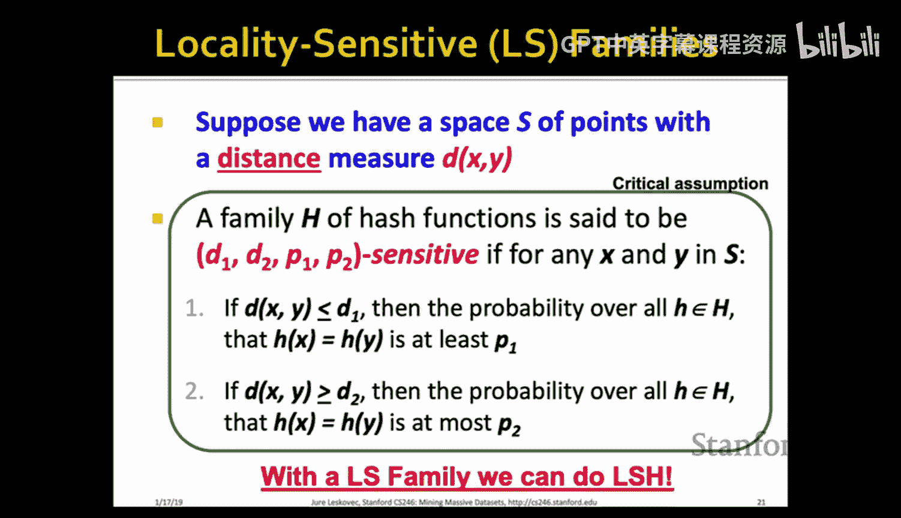

*   **固定`b`，增加`r`**：每个波段匹配的条件变得更严格（需要更多行一致）。这使得概率曲线向右移动，只有相似度更高的文档对才有较高概率成为候选。这减少了假正例（不相似却被视为候选），但可能增加假反例（相似却被遗漏）。
*   **固定`r`，增加`b`**：有更多机会（波段）让文档对匹配。这使得概率曲线向左上方移动，更多相似度较低的文档对也可能成为候选。这减少了假反例，但增加了假正例。

因此，`b`和`r`的选取是一个权衡。通常，我们根据想要的相似度阈值`t`来选取`b`和`r`，使得S曲线在`t`附近尽可能陡峭。

**假正例与假反例的权衡**：
*   **假正例**：不相似的文档对被错误地视为候选。代价是后续进行不必要的昂贵相似度计算。
*   **假反例**：相似的文档对从未被当作候选。代价是永远丢失这些相似对。
*   在许多应用中，假反例比假正例更值得关注，因为计算资源可以增加，但丢失的数据无法找回。

---

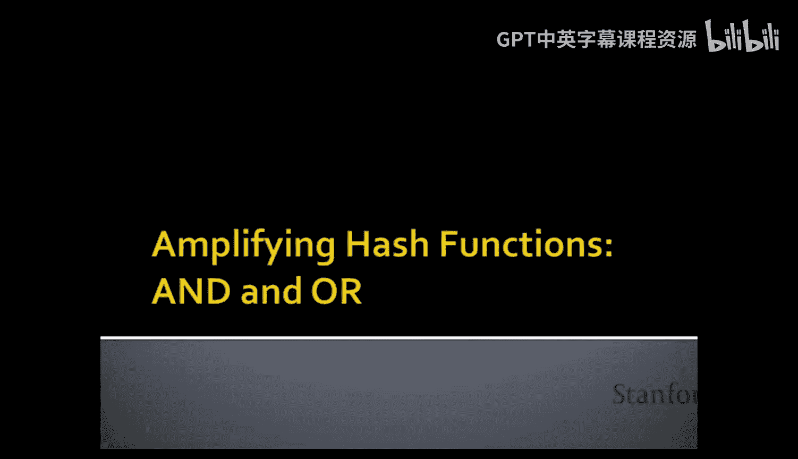

## 理论推广：局部敏感哈希族

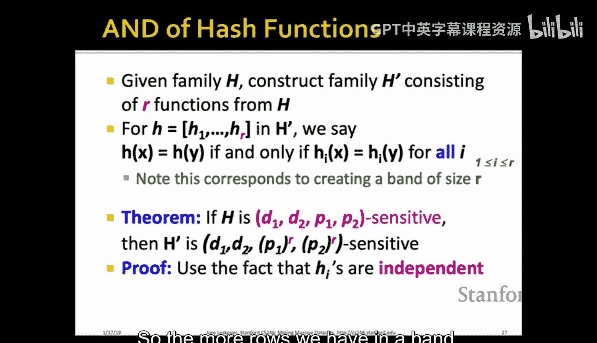

为了使局部敏感哈希适用于Jaccard相似度以外的度量，我们需要为其定义“局部敏感哈希族”。

一个哈希函数族`H`被称为是`(d1, d2, p1, p2)`-敏感的，如果对于任意两点`x`和`y`：
1.  若`dist(x, y) ≤ d1`，则 `P[h(x) = h(y)] ≥ p1`。
2.  若`dist(x, y) ≥ d2`，则 `P[h(x) = h(y)] ≤ p2`。

其中`d1 < d2`，`p1 > p2`。我们希望`p1`尽可能接近1，`p2`尽可能接近0，并且`d1`和`d2`尽可能接近，这样哈希函数就能清晰地区分“近”和“远”的点。

对于Min-Hash和Jaccard距离`d = 1 - s`，其哈希族是`(1/3, 2/3, 2/3, 1/3)`-敏感的。这个性质不够强，我们需要放大它。

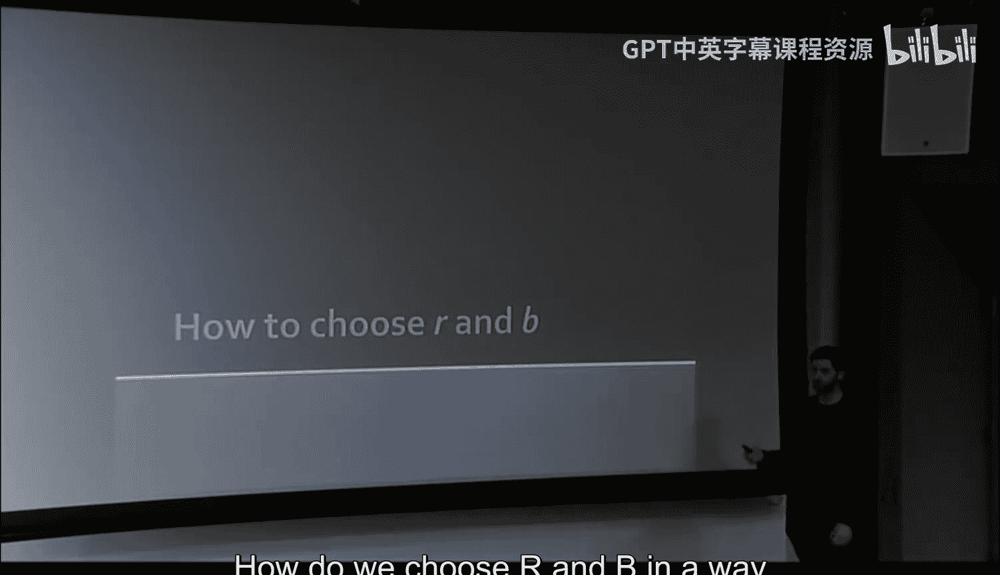

---

### 放大哈希族：AND与OR构造

我们可以通过组合基本的哈希函数来构造新的、性能更好的哈希族。

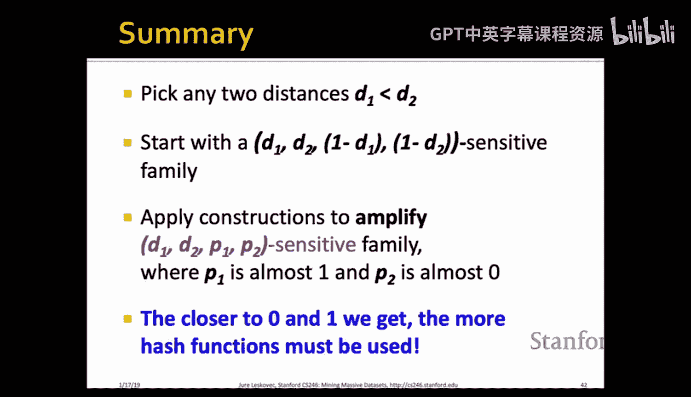

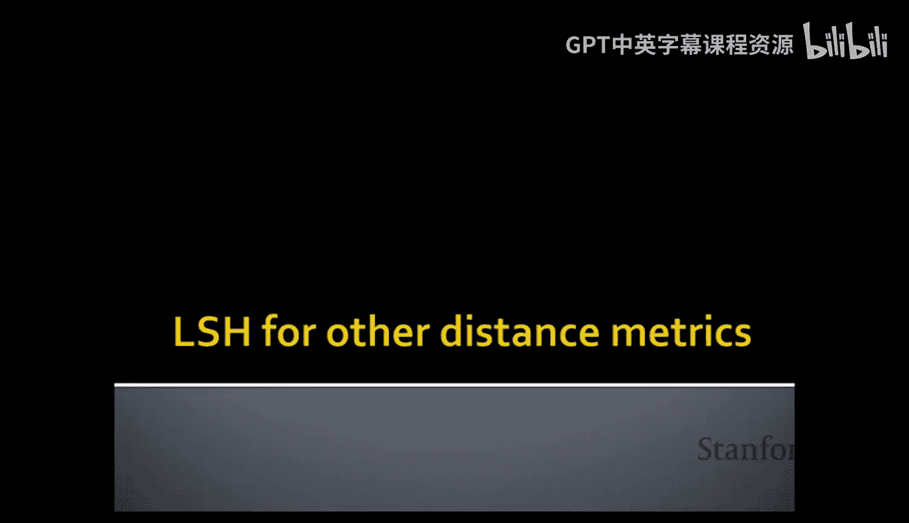

*   **AND构造**：创建新哈希函数`g`，它由`r`个基本哈希函数组成。`g(x) = g(y)` 当且仅当这`r`个基本函数的结果全部相等。这使概率变为`p^r`。
    *   效果：`p1`和`p2`都减小，但`p2`减小得更快（因为`p2 < p1`）。这使曲线在右侧（高距离/低相似度区域）下降更快，减少了假正例。

*   **OR构造**：创建新哈希函数`g`，它由`b`个基本哈希函数组成。`g(x) = g(y)` 当且仅当这`b`个基本函数中至少有一个结果相等。这使概率变为`1 - (1-p)^b`。
    *   效果：`p1`和`p2`都增大，但`p1`增大得更快。这使曲线在左侧（低距离/高相似度区域）上升更快，减少了假反例。

**组合使用**：通过先进行`r`路AND构造，再进行`b`路OR构造（即我们之前的分`b`个波段，每波段`r`行的技术），我们可以同时放大`p1`和缩小`p2`，从而得到接近理想阶跃函数的S曲线。

---

## 应用于其他距离度量

局部敏感哈希的强大之处在于它可以适配不同的距离度量。一旦我们为某种距离定义了合适的局部敏感哈希族，剩下的流程（生成签名、分波段、哈希）是完全相同的。

---

### 余弦距离

余弦距离通过向量间的夹角来衡量差异。对于向量`u`和`v`，其夹角为`θ`，余弦相似度为`cos(θ)`，距离可定义为`θ/π`。

**对应的哈希族：随机超平面法**
*   生成一个随机单位向量`r`。
*   哈希函数定义为：`h(v) = sign(r · v)`。如果点积非负，结果为+1，否则为-1。
*   **核心性质**：`P[h(u) = h(v)] = 1 - θ/π`。即两个向量哈希值相同的概率等于1减去其归一化夹角。
*   直观理解：`h(v)`表示向量`v`位于随机超平面`r`的哪一侧。两个向量夹角越小，它们位于超平面同一侧的概率就越大。

通过生成多个随机超平面（即多个哈希函数），我们可以得到签名向量（由+1和-1组成），然后应用标准的波段技术。

---

### 欧几里得距离

对于欧氏空间中的点，我们使用基于投影的哈希族。

**对应的哈希族：随机投影法**
1.  随机选择一条直线。
2.  将这条直线划分为若干长度为`a`的等宽区间（桶）。
3.  哈希函数`h(p)`将点`p`投影到这条直线上，并返回其所在桶的索引。
*   **核心性质**：如果两点距离`d`远小于`a`，则它们落入同一桶的概率至少为`1 - d/a`。如果`d`大于`a`，则落入同一桶的概率较低。
*   直观理解：相近的点投影后很可能在同一个桶里，而相距较远的点很可能被分开。使用多条随机直线（多个哈希函数）可以提高稳定性。

同样，得到投影桶索引的签名后，即可使用波段技术进行处理。

---

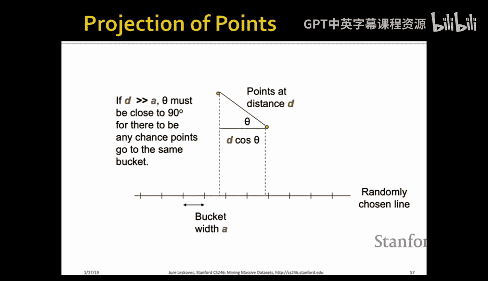

## 总结

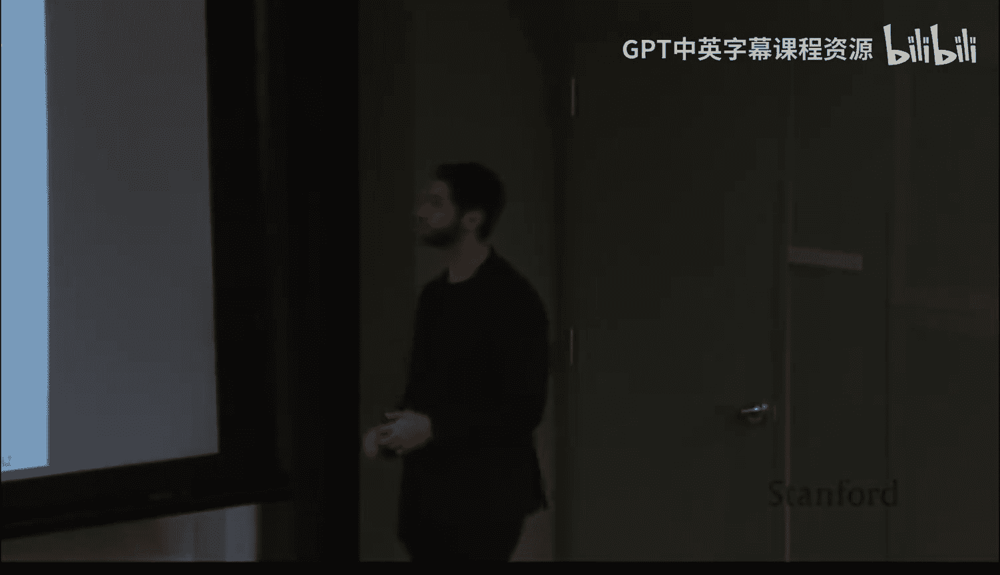

本节课中我们一起学习了局部敏感哈希的核心理论：

1.  **核心思想**：设计哈希函数，使得相似项以高概率哈希到相同值，不相似项以低概率哈希到相同值。
2.  **关键参数**：通过调整波段数`b`和每波段行数`r`，我们可以塑造S曲线的形状，在相似度阈值附近实现陡峭的过渡，从而平衡假正例和假反例。
3.  **理论框架**：引入了`(d1, d2, p1, p2)`-敏感哈希族的概念，以及通过AND和OR构造来放大其区分能力的通用方法。
4.  **推广性**：局部敏感哈希不仅适用于Jaccard相似度（Min-Hashing），通过设计不同的哈希族，也适用于余弦距离（随机超平面法）和欧几里得距离（随机投影法）等多种相似性度量。

掌握这些原理，使你能够根据具体的数据类型和相似性定义，合理设计并调优局部敏感哈希方案，从而在海量数据挖掘任务中实现高效且准确的相似性搜索。