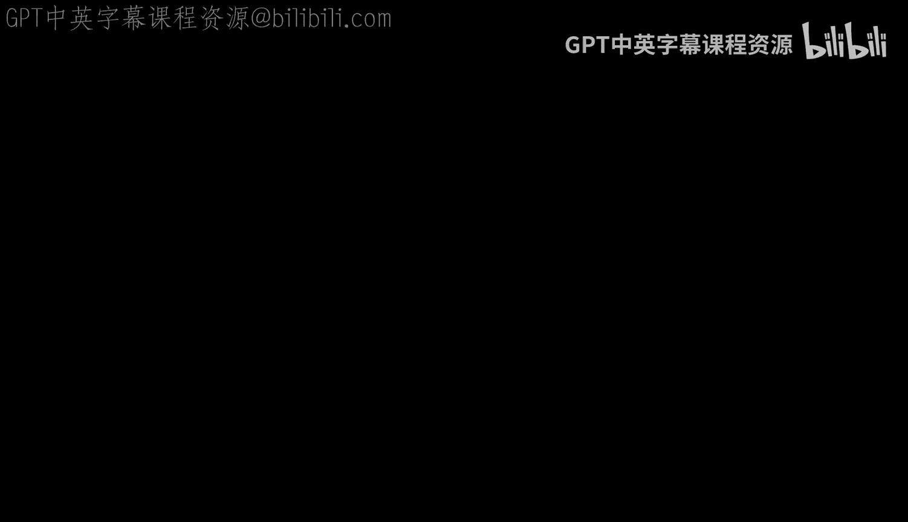
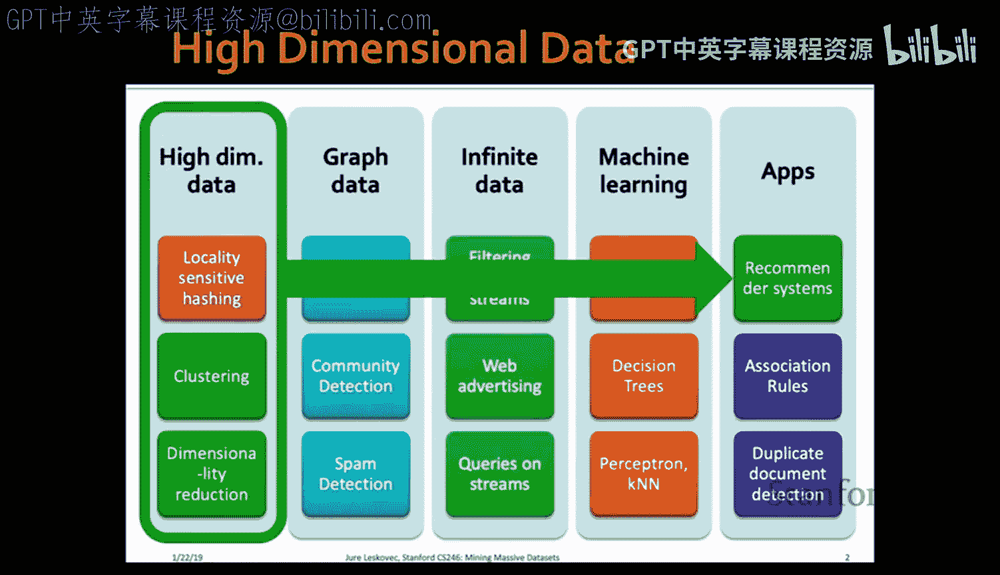
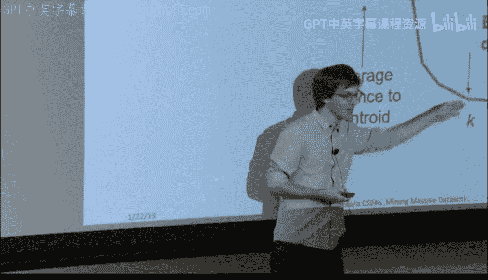

#  005：聚类分析

在本节课中，我们将要学习聚类分析的基本概念和方法。聚类是一种无监督学习技术，旨在将数据点分组，使得同一组内的点彼此相似，而不同组间的点彼此相异。我们将探讨两种主要的聚类方法：层次聚类和点分配聚类，并介绍处理大规模数据集的扩展算法。

## 层次聚类

上一节我们介绍了聚类的核心目标，本节中我们来看看层次聚类。层次聚类通过构建一个树状图（树状图）来展示数据点如何被逐层合并或分割成簇。它有两种主要方式：自底向上（凝聚式）和自顶向下（分裂式）。

### 核心概念与操作

层次聚类的关键操作是反复合并两个最接近的簇。这引出了三个需要回答的问题：
1.  如何表示一个包含多个点的簇？
2.  如何确定两个簇之间的距离？
3.  如何合并簇，以及何时停止合并过程？

在欧几里得空间中，一个簇通常用其**质心**来表示。质心是簇中所有点的平均值，其计算公式为：
\[
\text{质心} = \frac{1}{n} \sum_{i=1}^{n} \mathbf{x}_i
\]
其中，\( n \) 是簇中点的数量，\( \mathbf{x}_i \) 是每个点的坐标向量。质心是到簇内所有点平均距离最小的点。

对于非欧几里得空间（例如集合数据），我们无法计算平均值。此时，可以使用**中心点**。中心点是簇中一个真实的点，它到簇内所有其他点的距离之和（或其他聚合度量）最小。中心点比质心更具可解释性，因为它是一个真实存在的数据点。

### 簇间距离度量

确定两个簇是否“接近”需要定义簇间距离。以下是几种常见的方法：
*   **质心距离**：计算两个簇质心之间的欧几里得距离。公式为：
    \[
    d_{\text{centroid}}(C_1, C_2) = \|\text{centroid}(C_1) - \text{centroid}(C_2)\|
    \]
*   **最近邻距离**：计算两个簇中任意两点之间的最小距离。公式为：
    \[
    d_{\text{min}}(C_1, C_2) = \min_{\mathbf{x} \in C_1, \mathbf{y} \in C_2} \|\mathbf{x} - \mathbf{y}\|
    \]
*   **簇内凝聚性度量**：也可以不直接测量距离，而是评估合并两个簇后新簇的“凝聚性”。例如，可以计算新簇的直径（簇内最远两点间的距离）或平均点对距离。如果合并导致凝聚性指标（如直径）增长过大，则可能不应合并。

选择哪种度量取决于数据的预期结构。对于形状规则、近似球形的簇，质心距离效果较好。对于形状复杂、可能相互缠绕的簇，最近邻距离通常更有效。

### 停止准则

层次聚类过程可以持续到所有点合并为一个簇。然而，我们通常需要确定最终的簇划分。以下是一些停止准则：
*   **指定簇数量**：当合并到用户预设的 \( K \) 个簇时停止。
*   **距离阈值**：当最近的两个簇之间的距离超过某个阈值时停止。
*   **凝聚性变化**：当合并操作导致簇的直径或密度等凝聚性指标发生显著恶化时停止。

在实际操作中，通常会构建完整的树状图，然后根据树状图中连接的高度（代表合并时的距离）来决定在何处切割，以获得有意义的簇。

## 点分配聚类：K-means 算法

了解了层次聚类后，我们转向另一大类方法：点分配聚类。其中最著名的是 **K-means** 算法及其改进版 **K-means++**。K-means 假设数据存在于欧几里得空间中，并且需要预先指定簇的数量 \( K \)。

### 算法步骤

K-means 是一个迭代优化算法，步骤如下：

1.  **初始化质心**：选择 \( K \) 个点作为初始簇质心。随机选择效果不佳。K-means++ 采用了一种更好的策略：
    *   随机选择第一个质心。
    *   对于每个后续质心，选择一个新点，其被选中的概率与它到已选质心的最短距离的平方成正比。这确保了初始质心能分散在整个数据空间中。

2.  **分配点**：遍历所有数据点，将每个点分配到离它最近的质心所属的簇中。最近通常指欧几里得距离最近。

3.  **更新质心**：重新计算每个簇的质心（即该簇所有点的平均值）。

4.  **迭代**：重复步骤 2 和 3，直到质心的位置不再发生变化（或变化很小），即算法收敛。

### 选择K值

K-means 需要预先指定 \( K \)，但这通常未知。一种常用的方法是“肘部法则”：
*   尝试不同的 \( K \) 值（例如从 1 到 10）。
*   对于每个 \( K \)，运行 K-means 并计算所有点到其所属簇质心的平均距离（或距离平方和）。
*   绘制 \( K \) 值与这个平均距离的关系图。
*   随着 \( K \) 增大，平均距离会下降。当 \( K \) 增加到真实簇数时，平均距离的下降幅度会突然变缓，图表上会出现一个“肘部”拐点。这个拐点对应的 \( K \) 值通常是较好的选择。

## 处理大规模数据集的扩展算法

标准的 K-means 假设数据能放入内存。对于海量数据集，我们需要更高效的算法。

### BFR 算法

BFR 算法是 K-means 的变体，专为处理非常大、可能无法完全装入内存的数据集而设计。它假设簇在欧几里得空间中呈轴对齐的正态分布（即每个维度独立）。

BFR 的核心思想是用汇总统计信息来代表簇，所需内存与簇的数量成正比，而非数据点数量。它为每个簇维护三个统计量：
*   \( N \)：簇中点的数量。
*   \( \text{SUM} \)：一个 \( D \) 维向量，记录每个维度上所有点坐标之和。
*   \( \text{SUMSQ} \)：一个 \( D \) 维向量，记录每个维度上所有点坐标的平方和。

利用这些统计量，可以轻松计算簇的质心（\( \text{SUM}/N \)）和每个维度上的方差。

#### 算法流程与马氏距离

BFR 将数据点分为三类集合进行处理：
*   **废弃集**：已确定属于某个簇的点，用上述统计量汇总后即可“遗忘”该点。
*   **压缩集**：一些点彼此接近，但又不接近任何现有簇质心。它们被聚类成子簇，并用统计量汇总，留待后续处理。
*   **保留集**：无法立即处理的孤立点，暂时保存。

判断一个点是否“足够接近”一个簇以加入废弃集，BFR 使用了**马氏距离**。马氏距离考虑了数据在不同维度上的方差，其计算公式为：
\[
d_{\text{Mahalanobis}}(\mathbf{x}, \mathbf{c}) = \sqrt{\sum_{i=1}^{D} \frac{(x_i - c_i)^2}{\sigma_i^2}}
\]
其中，\( \mathbf{c} \) 是簇质心，\( \sigma_i^2 \) 是该簇在第 \( i \) 维上的方差。马氏距离将各维度标准化，使得在数据分布较散的维度上，距离惩罚变小。如果数据簇服从正态分布，则大约 95% 的点其马氏距离在 2 个标准差（即 \( 2\sqrt{D} \) ）以内。因此，可以将阈值设为此值来决定是否将点加入簇。

### CURE 算法

CURE 算法旨在发现任意形状的簇，而不仅仅是球形簇。它使用一组分散的**代表点**来刻画一个簇的形状，而不是单个质心。

#### 算法步骤

1.  **采样与初始聚类**：从数据中随机抽取一个能放入内存的样本。对该样本使用层次聚类算法，得到初始簇划分。
2.  **选取代表点**：对于每个初始簇，选取固定数量（如 4 个）分散的点作为代表点。然后，将这些代表点向簇的质心方向收缩一定比例（如 20%）。收缩操作使大而稀疏的簇收缩更多，有助于避免将孤立点误分配给它们。
3.  **分配所有点**：重新扫描整个数据集。对于每个点，找到离它最近的**代表点**（而非质心），并将该点分配给该代表点所属的簇。

通过使用多个代表点并向中心收缩，CURE 能够更好地捕捉复杂形状的簇，并对异常值更具鲁棒性。

## 总结

本节课中我们一起学习了聚类分析的核心技术。我们首先介绍了层次聚类，它通过构建树状图来展示数据的层次结构，并讨论了簇表示、距离度量和停止准则。接着，我们深入探讨了点分配聚类的代表——K-means 算法，包括其步骤、初始化和如何选择 K 值。最后，为了应对海量数据集的挑战，我们学习了两种扩展算法：BFR 算法利用汇总统计和马氏距离高效处理大数据；CURE 算法则通过多个代表点来识别任意形状的簇。这些方法为从高维数据中发现有意义的结构提供了强大的工具。