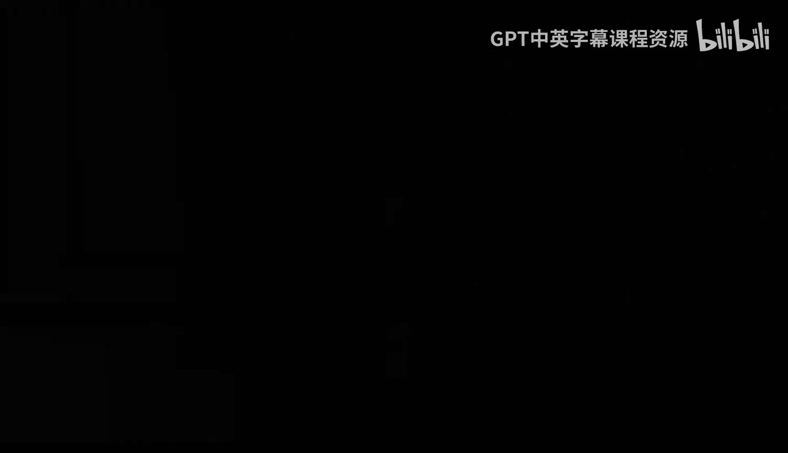
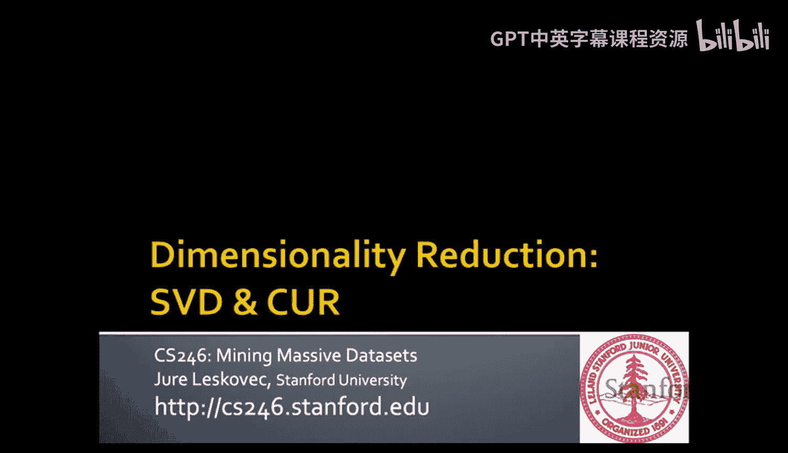
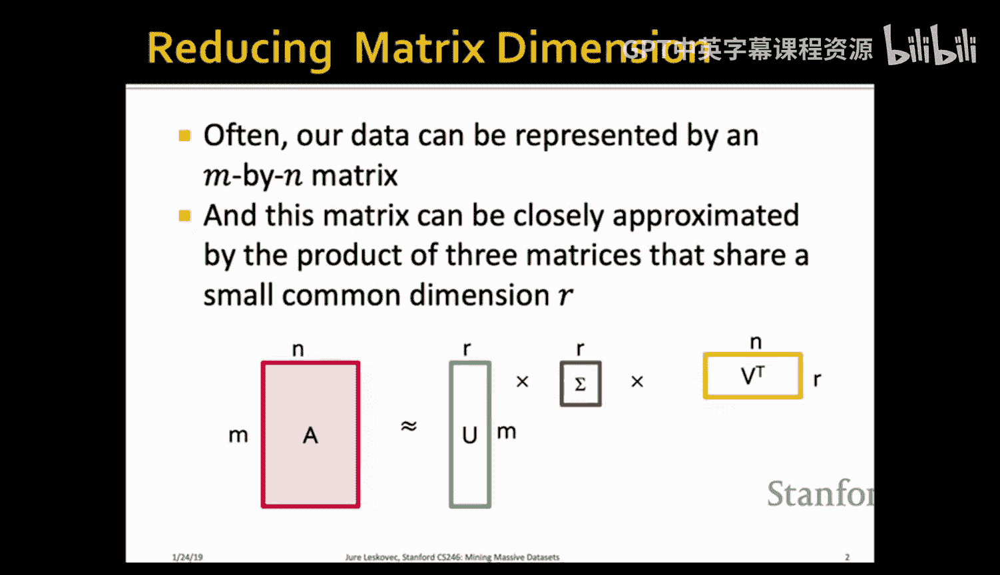

#  006：降维 - SVD与CUR分解







在本节课中，我们将要学习两种重要的降维方法：奇异值分解（SVD）和CUR分解。我们将探讨它们如何将高维数据矩阵压缩为低维表示，理解其背后的数学原理，并比较各自的优缺点。

## 数据矩阵与降维动机

我们通常可以将数据表示为一个大的 M 行 N 列的矩阵。这个矩阵通常可以被一个共享较小公共维度 R 的矩阵乘积所近似。这意味着我们可以将原始的 M×N 矩阵分解为几个更小矩阵的乘积。

上一节我们介绍了降维的基本概念，本节中我们来看看具体的数学表示。

## 降维的直观理解

降维的核心思想是：数据虽然存在于高维空间中，但实际上可能只占据一个更低维度的流形。我们的目标是识别出这些数据真正存在的潜在维度或潜在因子。

以下是降维过程的直观步骤：
1.  识别数据中方差最大的方向作为第一个潜在维度。
2.  找到与第一个方向正交且方差次大的方向作为第二个潜在维度。
3.  以此类推，直到能够充分描述数据，而剩余的方差很小。

## 矩阵的秩与维度

如何衡量矩阵的维度？矩阵的秩本质上衡量了其维度。矩阵的秩等于其线性无关的行（或列）的数量。如果一个矩阵的秩为 R，那么用 R 维坐标就可以精确表示它。

## 奇异值分解（SVD）

奇异值分解是一种将任意实数矩阵 A 唯一分解为三个特定矩阵乘积的方法。

**公式表示**：
`A = U Σ V^T`

其中：
*   **A**：原始的 M×N 数据矩阵。
*   **U**：M×R 的左奇异向量矩阵，列向量是单位正交的。
*   **Σ**：R×R 的对角矩阵，对角线上的元素称为奇异值（σ₁, σ₂, ..., σ_R），按降序排列且均为正数。
*   **V^T**：R×N 的矩阵，是右奇异向量矩阵 V 的转置，其行向量也是单位正交的。

这个分解也可以写成外积和的形式：
`A = Σ (σ_i * u_i * v_i^T)`，对 i 从 1 到 R 求和。

### SVD的性质与解释

SVD分解具有唯一性。矩阵 U 和 V 的列是单位正交的，这意味着 `U^T U = I` 且 `V^T V = I`（I 为单位矩阵）。

在应用中，我们可以这样解释：
*   **U**（用户-概念矩阵）：描述了每个用户属于各个潜在概念（如“科幻片”、“爱情片”）的程度。
*   **Σ**（奇异值矩阵）：表示每个潜在概念的重要性或强度。奇异值越大，该概念对数据变异的贡献越大。
*   **V^T**（电影-概念矩阵）：描述了每部电影属于各个潜在概念的程度。

### 基于SVD的降维与最优性

要进行降维，我们可以将较小的奇异值设为零。例如，如果我们想将数据降至 K 维（K < R），则令 σ_{K+1} = σ_{K+2} = ... = σ_R = 0。

**代码逻辑描述**：
```python
# 假设已计算得到 U, Sigma, V_T
K = 2  # 目标维度
Sigma_reduced = Sigma.copy()
Sigma_reduced[K:, :] = 0  # 将第K个之后的奇异值置零
Sigma_reduced[:, K:] = 0
A_reconstructed = U @ Sigma_reduced @ V_T  # 得到降维后的近似矩阵
```

这样做会引入重构误差，但SVD的神奇之处在于：对于给定的目标秩 K，通过归零最小奇异值得到的近似矩阵 `A_k`，是在所有可能的秩为 K 的近似矩阵中，与原矩阵 A 的弗罗贝尼乌斯范数误差最小的。**弗罗贝尼乌斯范数**可视为矩阵间的欧几里得距离。

**公式表示**：
`||A - A_k||_F` 在所有秩为 K 的矩阵 B 中是最小的。

### 计算SVD：幂迭代法

在实际计算中，我们可以通过计算矩阵 `A^T A` 的特征分解来间接得到SVD。
1.  计算 `A^T A`，这是一个对称矩阵。
2.  使用**幂迭代法**求其主特征向量和特征值：
    *   初始化一个随机向量 `x_0`。
    *   迭代：`x_{k+1} = (A^T A * x_k) / ||A^T A * x_k||`
    *   当 `x_k` 收敛时，即为主要特征向量。
    *   对应特征值 `λ = x^T (A^T A) x`。
3.  `A^T A` 的特征向量就是 SVD 中的右奇异向量 V，特征值的平方根就是奇异值 σ。
4.  类似地，通过计算 `A A^T` 可以得到左奇异向量 U。

专业线性代数库（如 LAPACK）有更高效稳定的算法，其复杂度约为 O(min(M, N) * max(M, N)^2)。

### SVD的应用示例：查询与相似性

通过SVD，我们可以将用户和电影映射到低维概念空间。即使两个用户在原始评分空间中没有共同评分的电影，他们在概念空间中的距离也可能很近，这得益于SVD挖掘出了数据背后的相关性。

例如，一个查询“喜欢《黑客帝国》的用户”可以被映射到概念空间。另一个只给《异形》和《宁静号》高分的用户也会被映射到概念空间。虽然在原始空间他们看似无关，但在低维概念空间中他们的位置可能非常接近。

### SVD的优缺点

**优点**：
*   **最优性**：在给定秩 K 的限制下，SVD能提供最小的弗罗贝尼乌斯范数重构误差。

**缺点**：
1.  **可解释性差**：奇异向量是所有原始行或列的线性组合，是抽象的数学概念，难以直接对应现实世界的具体含义。
2.  **密度性**：即使输入矩阵 A 非常稀疏，分解得到的 U 和 V 矩阵也通常是稠密的，这会增加存储和计算开销。

## CUR分解

为了克服SVD的缺点，特别是可解释性和稀疏性问题，我们引入CUR分解。CUR分解旨在用稀疏矩阵来近似原始矩阵。

### CUR分解的原理

CUR分解将矩阵 A 近似分解为三个矩阵的乘积：`A ≈ C U R`。

**矩阵定义**：
*   **C**：从原始矩阵 A 中选取的一组列（Columns）。
*   **R**：从原始矩阵 A 中选取的一组行（Rows）。
*   **U**：一个稠密但较小的矩阵，计算自 C 和 R 的交集矩阵 W 的伪逆。

**构造过程**：
1.  **采样列和行**：不是均匀随机采样，而是依据“重要性”进行概率采样。列（或行）的重要性定义为其弗罗贝尼乌斯范数的平方（即所有元素平方和）。重要性越高，被采样的概率越大。
2.  **构造矩阵 W**：取被选中的行和列的交集元素，构成一个小矩阵 W。
3.  **计算矩阵 U**：计算 W 的伪逆 `W⁺` 作为 U 的核心。伪逆通过计算 W 的SVD得到：若 `W = X Z Y^T`，则 `W⁺ = Y Z⁺ X^T`，其中 `Z⁺` 是将 Z 对角线元素（奇异值）取倒数得到的矩阵。如果 W 可逆，则伪逆等于真逆。

### CUR的理论保证与直觉

理论表明，如果选取大约 `K log K` 列和 `K log K` 行，那么CUR分解的重构误差最多是SVD最佳秩K近似误差的 `(2 + ε)` 倍。实践中，通常选取 4K 列和 4K 行来获得良好的秩K近似。

直观上，CUR倾向于选取范数大的列/行，这些点往往远离坐标原点，更可能代表数据变异的主要方向。与SVD寻找正交基不同，CUR的“基”就是实际的数据点，因此可能更贴合数据的实际分布。

### CUR分解的优缺点

**优点**：
1.  **可解释性强**：每个“轴”（C的列或R的行）都是一个真实的原始数据点（如一部具体的电影、一位具体的科学家），易于解释。
2.  **保持稀疏性**：如果原始矩阵 A 是稀疏的，那么 C 和 R 也是稀疏的，大大节省了存储空间。
3.  **计算高效**：基于随机采样，计算速度非常快。

**缺点**：
1.  **可能包含重复项**：重要性高的行/列可能被多次采样。解决方法是对重复采样的行/列进行缩放。
2.  **近似误差**：相对于SVD，在相同维度下误差更大，但可以通过使用更多（但稀疏的）维度来弥补。

### SVD与CUR对比

考虑一个稀疏的作者-会议发表量矩阵（约50万作者×3.6万会议）：
*   **SVD**：产生稠密的 U 和 V 矩阵，存储开销大，但精度高。
*   **CUR**：产生稀疏的 C 和 R 矩阵，存储效率极高。为了达到与SVD相近的精度，CUR可能需要更多的维度，但由于其稀疏性，总的非零元素存储量仍可能远小于SVD的稠密矩阵。

实验表明，在相同存储成本（空间比）下，CUR通常能达到比SVD更高的重构精度；或者说，在相同精度要求下，CUR需要存储的非零元素更少。

## 总结

本节课中我们一起学习了两种核心的降维技术：
1.  **奇异值分解（SVD）**：一种最优的数学分解方法，能给出给定秩下的最佳近似，但存在可解释性差和结果稠密的问题。
2.  **CUR分解**：一种基于随机采样的分解方法，通过使用原始数据行和列作为“基”，获得了优异的可解释性和稀疏性，计算效率高，在误差上接近SVD。

这两种方法为我们处理海量高维数据提供了强大的工具，下一周我们将学习它们在推荐系统等实际场景中的应用。