#  007：推荐系统 I

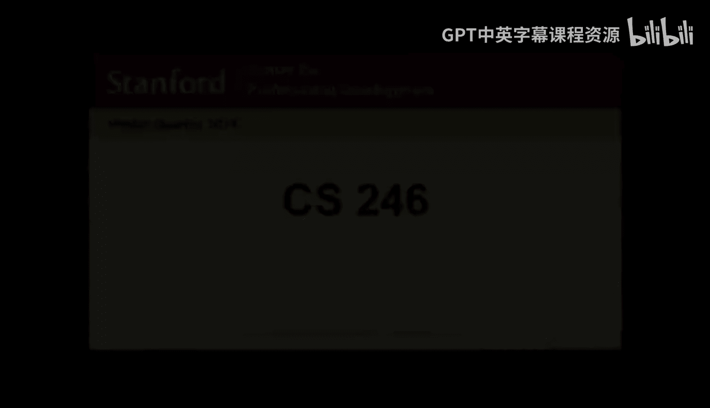


## 概述
在本节课中，我们将要学习推荐系统的基础知识。我们将从推荐系统的重要性讲起，然后深入探讨两种核心的推荐方法：基于内容的推荐和协同过滤。课程将涵盖它们的工作原理、优缺点以及实际应用中的考量。

---

## 推荐系统简介

推荐系统旨在向用户展示他们可能感兴趣的内容。这不仅仅是电子商务平台的核心功能，也广泛应用于新闻、视频、音乐等众多领域。

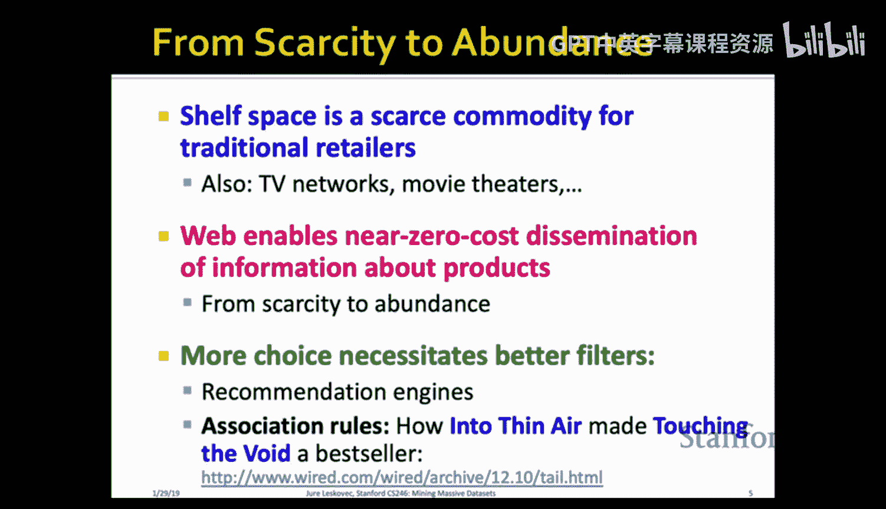

过去，我们处于信息稀缺的环境，例如实体店的货架空间有限。如今，我们进入了信息极度丰富的网络时代，平台拥有数百万甚至数亿的商品。瓶颈不再是展示空间，而是用户的认知能力。因此，我们需要通过推荐系统来过滤内容，只展示对用户最相关的信息。

一个著名的例子是两本关于登山灾难的书籍《Into Thin Air》和《Touching the Void》。后者出版更早，但销量平平。当亚马逊通过关联规则开始推荐《Touching the Void》给喜欢《Into Thin Air》的用户后，前者的销量开始飙升，最终成为畅销书。这体现了推荐系统发掘“长尾”商品、驱动销售的能力。

“长尾”理论指出，除了热门商品，还存在大量不那么流行但仍有受众的商品。例如，在亚马逊的图书销售中，长尾商品（非畅销书）贡献了超过57%的销售额。因此，一个有效的推荐系统对于挖掘长尾价值、提升平台收入至关重要。

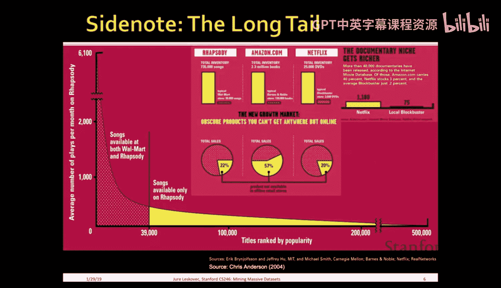

---

## 推荐系统的问题定义与挑战

### 问题形式化
设 `X` 为用户集合，`S` 为商品集合。推荐系统的目标是学习一个效用函数 `u`，该函数能够预测用户 `x` 对商品 `s` 的评分 `r`。
```
u: X × S → R
```
其中 `R` 是评分集合，可以是1-5星、0-1的实数，或是简单的“喜欢/不喜欢”二元信号。

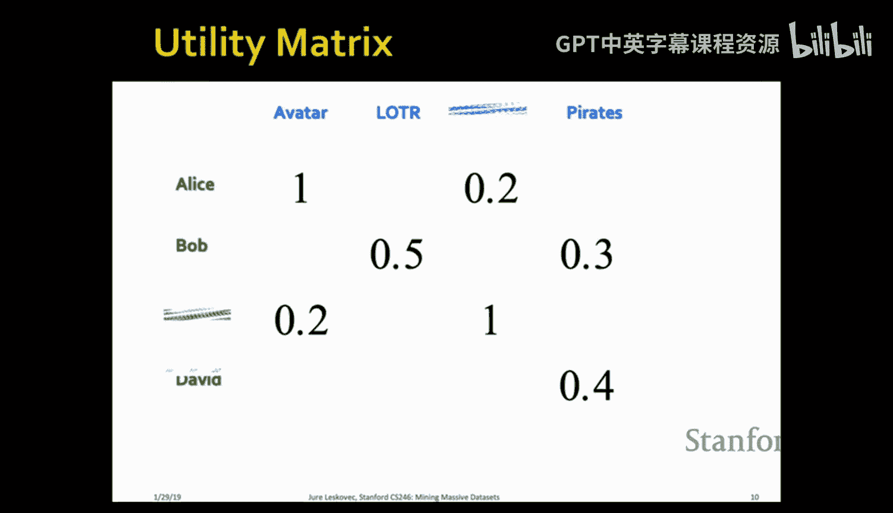


### 核心挑战
我们通常将用户-商品评分组织成一个矩阵（效用矩阵），其中行代表用户，列代表商品。


以下是推荐系统面临的两个关键问题：

1.  **收集已知评分**：让用户为商品评分是困难的。显式评分（如打星）需要用户主动参与，而用户往往不愿被打扰。隐式反馈（如购买行为、观看时长）虽然容易收集，但难以区分低评分和用户短暂注意。
2.  **推断未知评分**：效用矩阵通常是极度稀疏的，我们的核心任务就是填充这些缺失值。我们更关心准确预测用户可能喜欢的高分项，而不是他们讨厌的低分项。

### 评估挑战
评估推荐系统比想象中更复杂。例如，在搜索引擎中，用户点击顶部结果可能出于习惯而非内容真正相关，这会给评估带来噪声。因此，我们需要设计合理的评估指标。

---

## 基于内容的推荐系统

上一节我们介绍了推荐系统的基本框架和挑战，本节中我们来看看第一种具体的实现方法：基于内容的推荐。

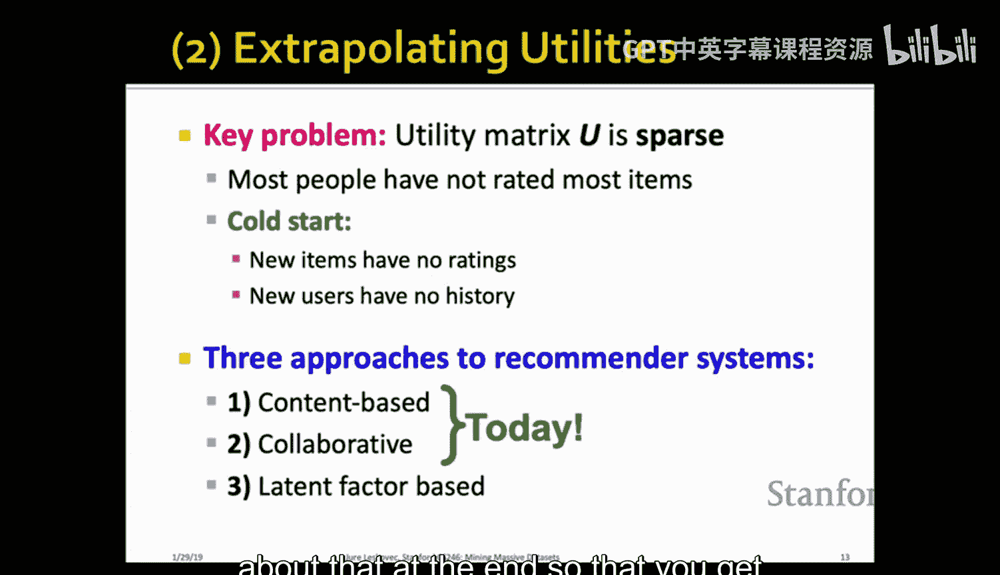

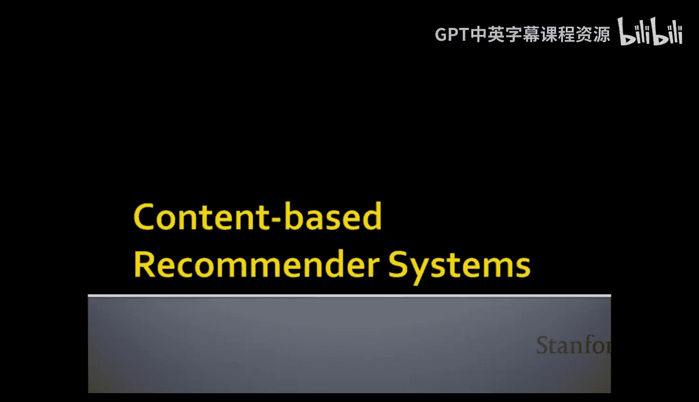

### 核心思想
基于内容的推荐系统会向用户推荐与其过去高评分商品相似的商品。它通过分析用户已评分商品的内容特征来构建用户画像，然后匹配具有相似特征的新商品。

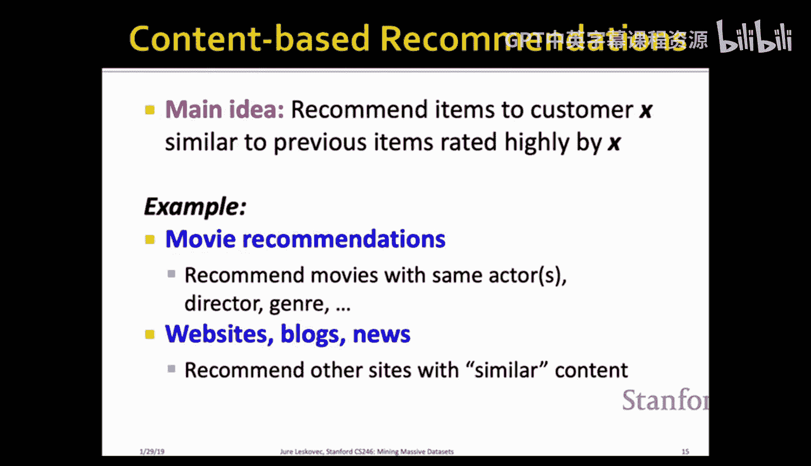

例如，一个喜欢金属乐的用户给Metallica的专辑打了高分，系统就会推荐其他具有相似特征（如相同流派、乐队）的专辑。

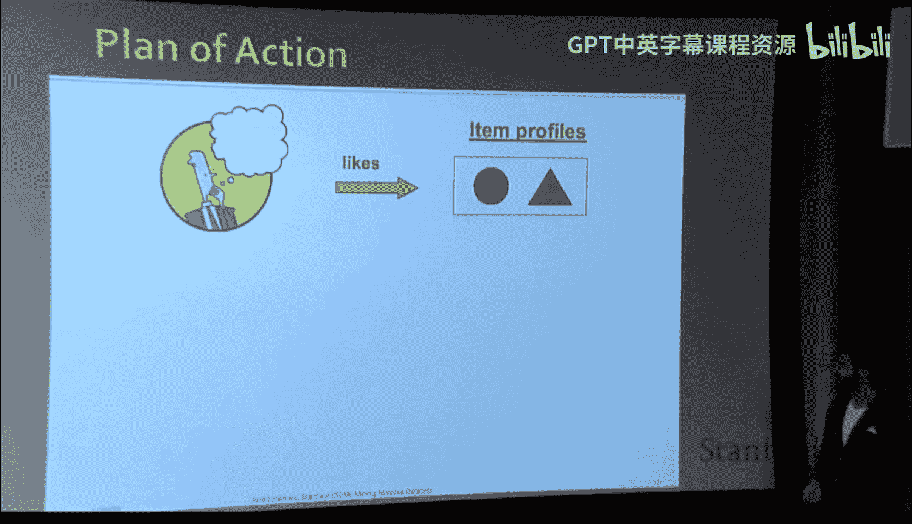

### 工作原理
系统需要为每个商品构建一个特征档案（Item Profile），并为每个用户构建一个偏好档案（User Profile）。

*   **商品档案**：由描述商品的特征组成。对于电影，可能是类型、导演、演员；对于文本，可能是关键词。
*   **用户档案**：通常基于用户历史评分商品的档案加权平均得到，评分越高，权重越大。

预测用户对新商品 `i` 的喜好度时，可以计算用户档案 `x` 与商品档案 `i` 的余弦相似度：
```
cosine_sim(x, i) = (x · i) / (||x|| * ||i||)
```
然后，我们可以使用诸如局部敏感哈希（LSH）等技术来高效查找与用户档案最相似的商品。

### 特征构建示例：TF-IDF
对于文本内容，常用TF-IDF（词频-逆文档频率）来提取重要特征词。

*   **词频（TF）**：衡量一个词在特定文档中的重要性。
    ```
    TF(t, d) = (词 t 在文档 d 中出现的次数) / (文档 d 中的总词数)
    ```
*   **逆文档频率（IDF）**：衡量一个词的区分度。在所有文档中都出现的词（如“的”）区分度低。
    ```
    IDF(t) = log(总文档数 N / 包含词 t 的文档数)
    ```
*   **TF-IDF**：最终的特征权重。
    ```
    TF-IDF(t, d) = TF(t, d) * IDF(t)
    ```
文档的档案即由其所有词的TF-IDF分数向量构成。

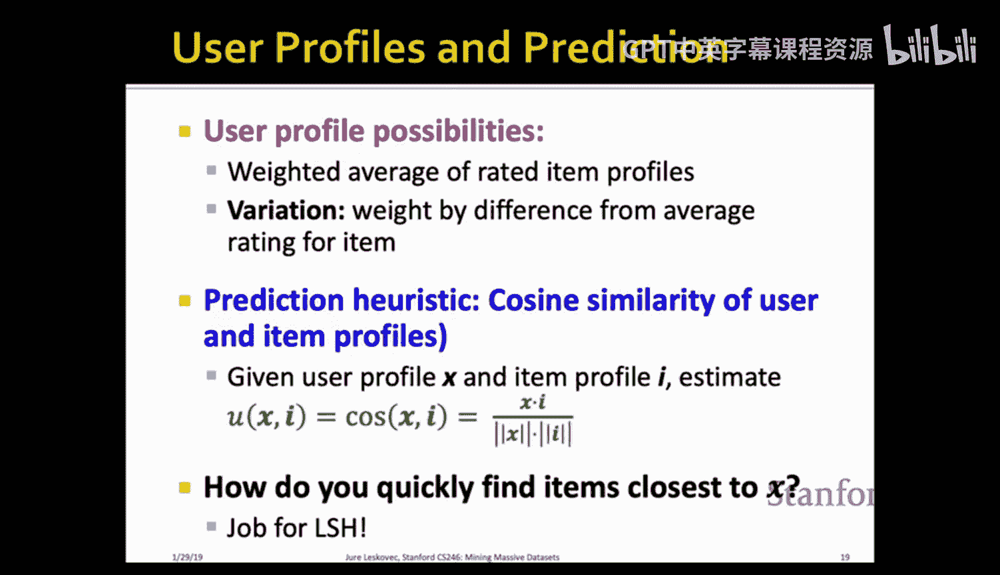

### 优缺点分析
以下是基于内容推荐系统的优缺点：


**优点**：
*   **无需其他用户数据**：仅依赖用户自身的历史数据。
*   **可推荐小众商品**：能向品味独特的用户推荐新的、不流行的商品。
*   **可解释性强**：易于向用户解释推荐理由（例如，“因为你喜欢A和B，所以我们推荐了C”）。

**缺点**：
*   **特征依赖**：需要领域知识来定义和提取有效特征，对于多媒体内容（视频、音频）可能很困难。
*   **新用户问题**：新用户没有历史数据，无法立即产生推荐（需要“冷启动”策略，如注册时选择兴趣）。
*   **过度特化**：系统可能只推荐与用户已有兴趣高度相似的商品，缺乏多样性，无法发现用户潜在的新兴趣。

基于内容的系统完全忽略了其他用户的评分信息，而这部分信息可能非常有价值。接下来，我们将转向利用这些信息的协同过滤方法。

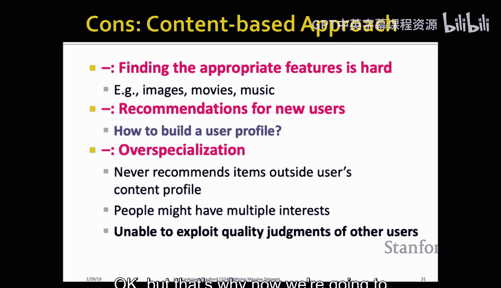

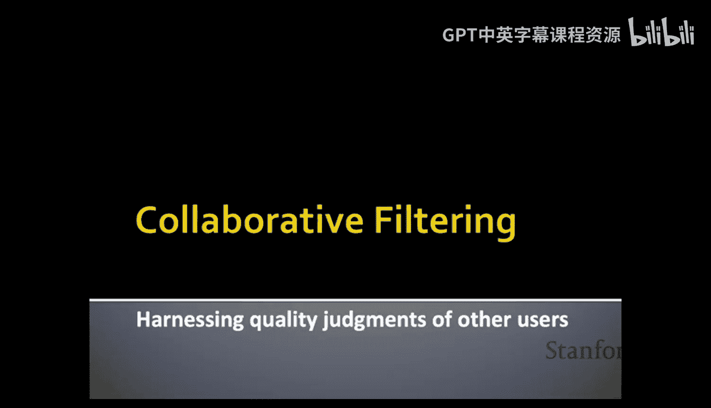

---

## 协同过滤推荐系统

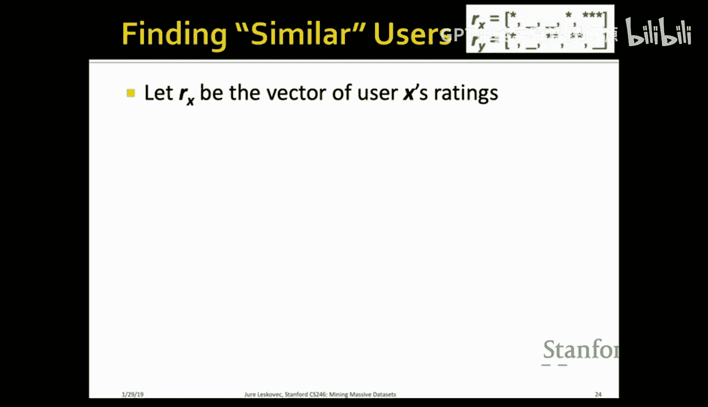

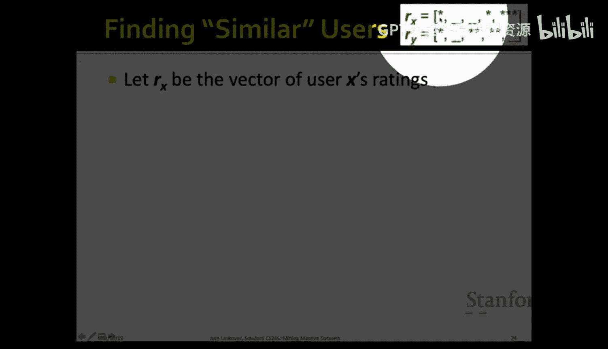

上一节我们讨论了基于内容的推荐，它完全依赖于商品特征和用户自身的历史。本节中我们来看看协同过滤，它利用了“集体智慧”。

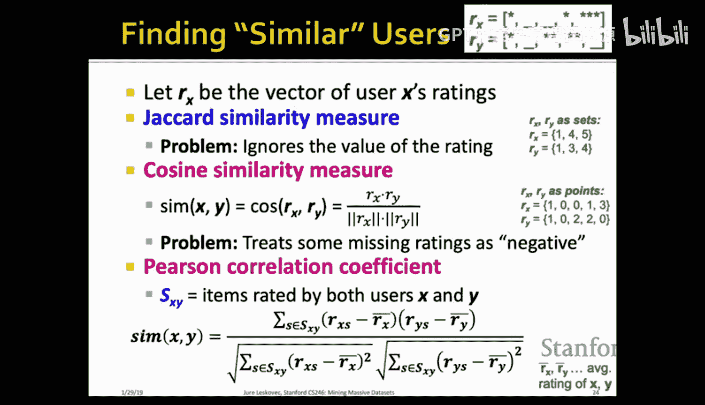

### 核心思想
协同过滤通过寻找与目标用户 `X` 评分模式相似的其他用户（邻居），然后基于这些邻居的评分来预测 `X` 对未评分商品的喜好。其核心假设是：如果用户 `X` 和 `Y` 在过去对某些商品的评分一致，那么他们对新商品的评分也可能一致。

### 用户-用户协同过滤
步骤如下：
1.  **计算用户相似度**：找到与目标用户 `X` 最相似的用户。皮尔逊相关系数是常用的度量，因为它考虑了用户评分尺度的差异（有些用户打分严，有些打分松）。
    ```
    sim(X, Y) = Σ_{i ∈ I_XY} (r_{X,i} - avg_r_X) * (r_{Y,i} - avg_r_Y) / (σ_X * σ_Y)
    ```
    其中 `I_XY` 是用户 `X` 和 `Y` 共同评分过的商品集合，`avg_r_X` 和 `avg_r_Y` 是各自的平均分，`σ` 是标准差。
2.  **选择邻居**：选取 `k` 个与 `X` 最相似的用户，记为邻居集合 `N`。
3.  **生成预测**：预测用户 `X` 对商品 `i` 的评分。一种简单方法是取邻居评分的平均值。更优的方法是进行加权平均，权重即为相似度。
    ```
    pred(X, i) = avg_r_X + [ Σ_{Y ∈ N} sim(X, Y) * (r_{Y,i} - avg_r_Y) ] / Σ_{Y ∈ N} |sim(X, Y)|
    ```


### 商品-商品协同过滤
我们也可以从商品的角度出发，寻找相似的商品。
1.  **计算商品相似度**：同样使用皮尔逊相关系数，但此时计算的是商品之间的相似度（基于所有对它们都评过分用户的评分向量）。
2.  **选择邻居**：对于目标商品 `i`，找到 `k` 个最相似的商品。
3.  **生成预测**：预测用户 `X` 对商品 `i` 的评分，基于用户 `X` 对 `i` 的邻居商品的评分进行加权平均。

在实践中，商品-商品协同过滤往往比用户-用户更有效、更稳定，因为商品的属性（如类型、风格）比用户多变的口味更固定，且商品数量通常少于用户数量。

### 引入基线预测
为了进一步提高预测准确性，可以引入一个基线预测值，它结合了整体平均分、用户偏差和商品偏差。
```
baseline(X, i) = μ + b_X + b_i
```
其中：
*   `μ` 是全局平均分。
*   `b_X` 是用户 `X` 的评分偏差（`X` 的平均分 - `μ`）。
*   `b_i` 是商品 `i` 的评分偏差（`i` 的平均分 - `μ`）。

最终的预测可以在这个基线值上，加上基于邻居的调整值。

### 优缺点分析
以下是协同过滤推荐系统的优缺点：

**优点**：
*   **无需内容特征**：可以推荐任何类型的商品，只要存在用户评分。
*   **能发现复杂关联**：可以发现用户自己可能都未察觉的潜在兴趣关联。

**缺点**：
*   **冷启动问题**：
    *   **新用户**：没有评分历史，无法找到相似用户。
    *   **新商品**：没有收到任何评分，无法被推荐。
*   **数据稀疏性**：在拥有海量商品和用户的平台上，两个用户共同评分过的商品可能极少，难以可靠地计算相似度。
*   **流行度偏见**：系统倾向于推荐热门商品，难以向品味独特的用户推荐小众商品。

由于基于内容的推荐和协同过滤优缺点互补，在实际应用中常采用混合方法，以构建更强大的推荐系统。

---

## 推荐系统的评估与实操要点

上一节我们探讨了协同过滤的原理，本节中我们来看看如何评估推荐系统，并讨论一些工程实践中的关键点。

### 评估方法
评估通常在保留一部分已知评分（作为测试集）的效用矩阵上进行。

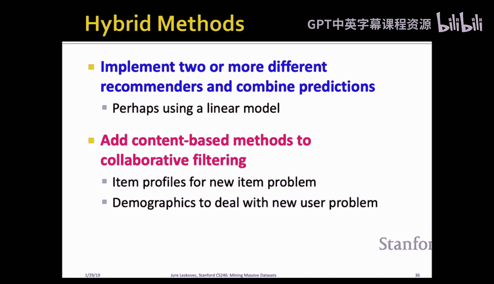


1.  **准确性指标**：
    *   **均方根误差（RMSE）**：衡量预测评分与实际评分的整体偏差。计算简单，但可能无法反映真实用户体验，因为我们更关心高分项预测是否准确。
    *   **Top-K 精确度（Precision@K）**：在系统推荐的K个商品中，有多少个是用户真正喜欢的（在测试集中评分高）。这更贴近实际业务目标。
    *   **排名相关性**：比较系统预测的排名顺序与用户真实偏好的排名顺序是否一致。

2.  **针对隐式反馈（0/1模型）的指标**：
    *   **覆盖率（Coverage）**：系统能为多大比例的用户生成预测。一个高精度但低覆盖率的系统可能不如一个精度稍低但能服务所有用户的系统。
    *   **精确率/召回率与AUC**：用于评估二元分类（推荐/不推荐）的性能。

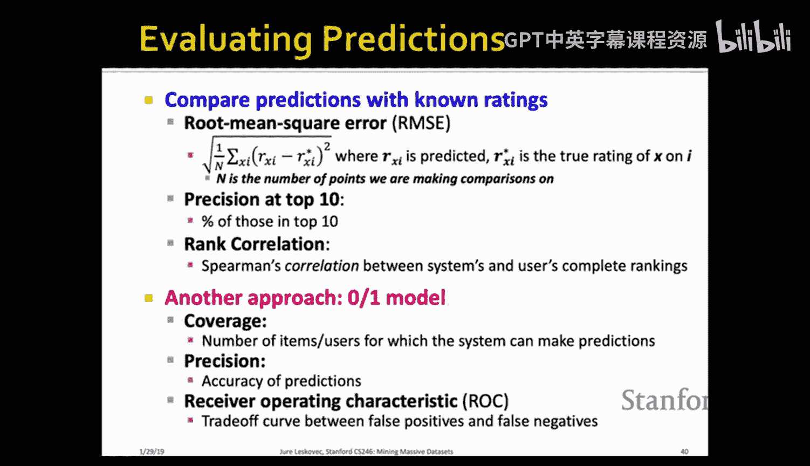

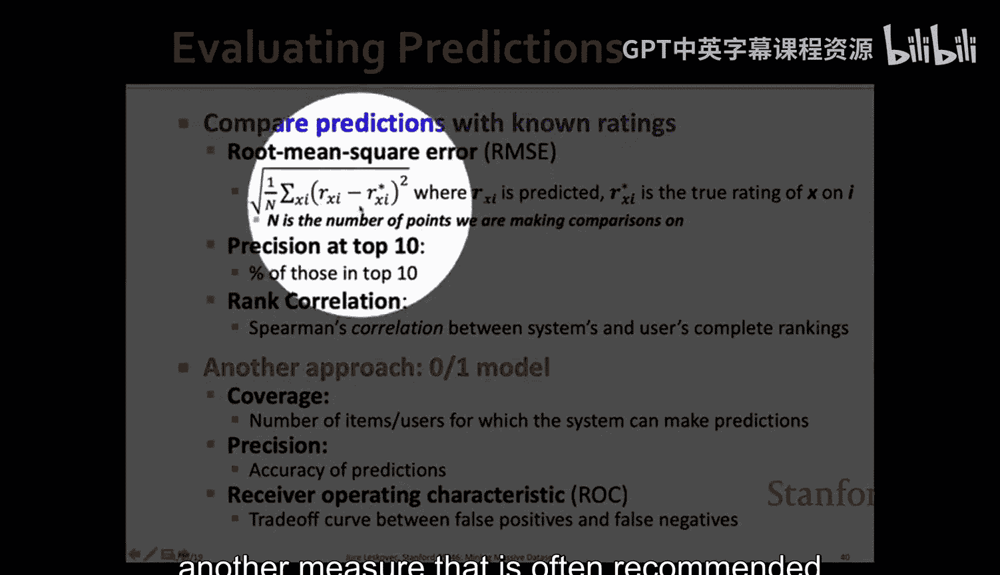

3.  **超越准确性的考量**：
    *   **多样性/惊喜度**：推荐列表不应千篇一律，偶尔推荐一些用户兴趣边界之外但可能喜欢的商品，能提升用户体验和探索性。
    *   **上下文感知**：推荐应考虑用户当前会话的上下文（例如，刚浏览了鞋子，接着推荐裤子）。
    *   **排序效果**：推荐列表的排列顺序本身也影响点击率。

### 性能与复杂度
协同过滤中最耗时的步骤是寻找最近邻（用户或商品）。我们可以利用之前学到的技术进行优化：
*   **聚类**：将相似的用户或商品预先分组。
*   **降维**：使用PCA、SVD等技术减少数据维度。
*   **局部敏感哈希（LSH）**：高效近似查找最近邻。
这些方法可以将计算复杂度从二次方降低到接近线性，使系统能够处理百万级用户和商品。

### 实践建议
一个重要的原则是：**充分利用所有可用数据**。简单的模型（如协同过滤）在大量数据上的表现，往往优于复杂模型在有限数据上的表现。首先确保你使用了所有可能的信息（用户行为、商品属性、上下文等），然后再考虑模型优化。

---

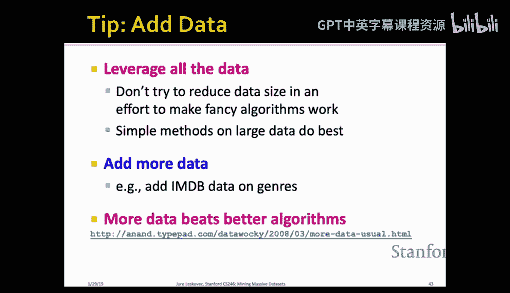

## 总结与下节预告


本节课中我们一起学习了推荐系统的基础。我们首先了解了推荐系统的商业价值和核心问题定义。然后，我们深入研究了两种经典方法：
1.  **基于内容的推荐**：通过分析商品特征和用户历史来匹配相似商品。优点是可解释性强、能处理新商品，但受限于特征提取和过度特化。
2.  **协同过滤**：利用用户群体的评分数据，通过寻找相似用户或商品来产生推荐。优点是无须特征、能发现复杂关联，但受冷启动和数据稀疏性问题困扰。

我们还讨论了评估推荐系统的多种指标和工程实践中的关键点，例如覆盖率、多样性以及利用聚类和降维技术来提升系统效率。

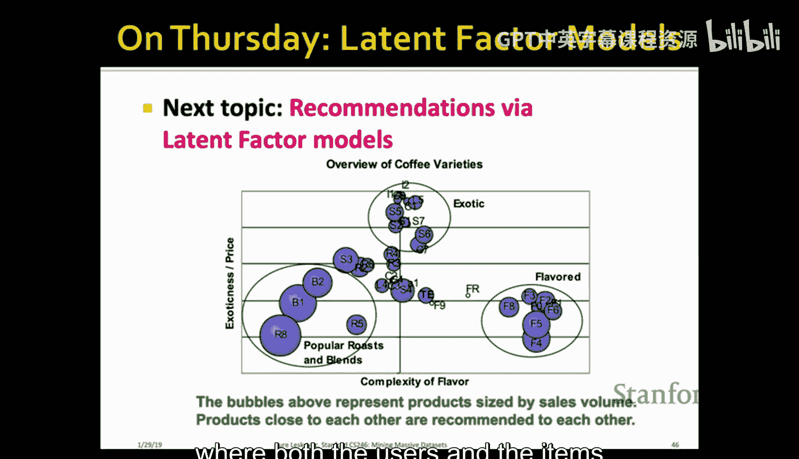

在下一讲（周四的课程）中，我们将介绍更强大的**潜在因子模型**，它通过将用户和商品映射到同一个低维潜在空间中来克服协同过滤的一些局限性。我们也会讲述著名的**Netflix大奖赛**的故事，该竞赛正是推动了潜在因子模型的发展，并为我们提供了许多关于构建工业级推荐系统的宝贵见解。