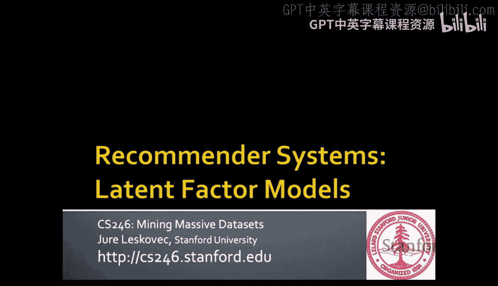
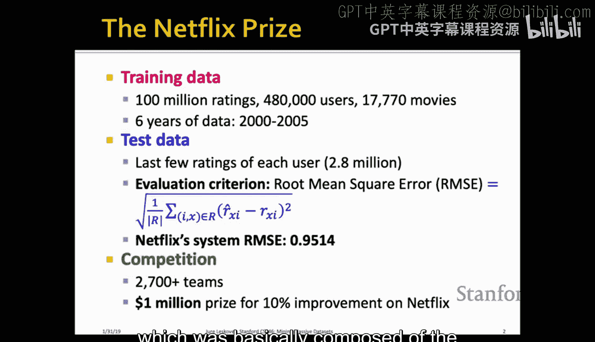
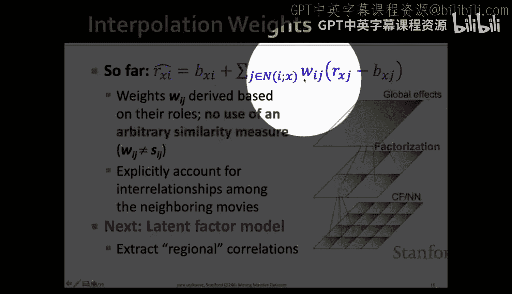
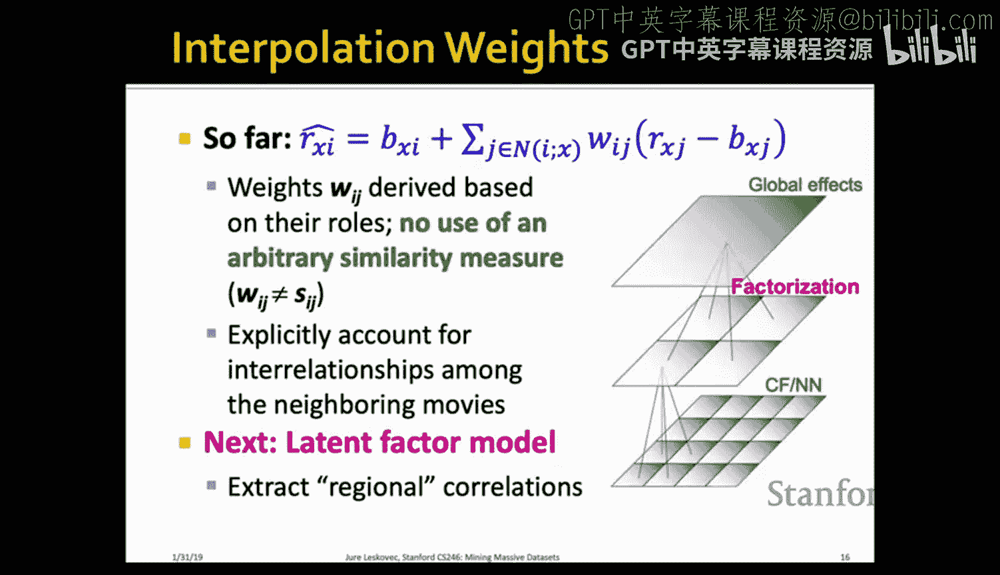
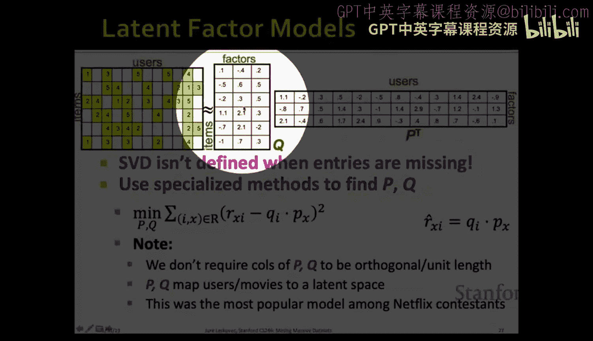
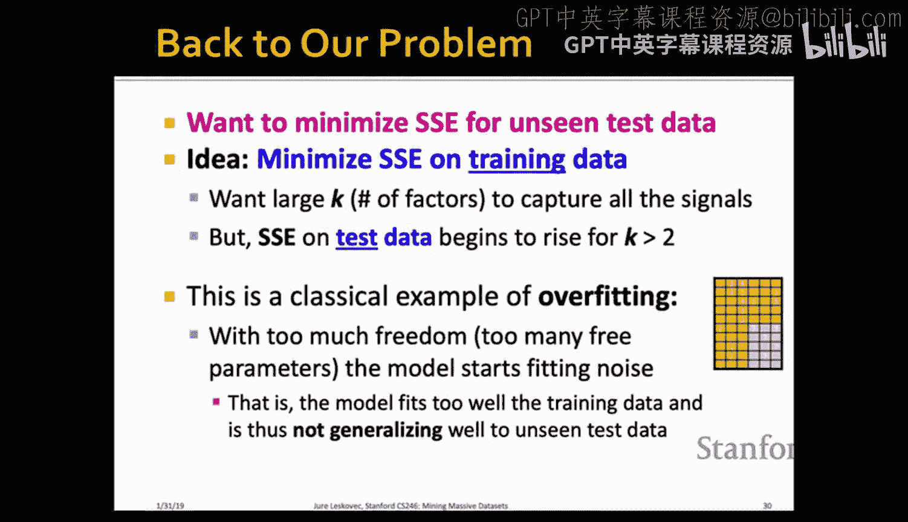
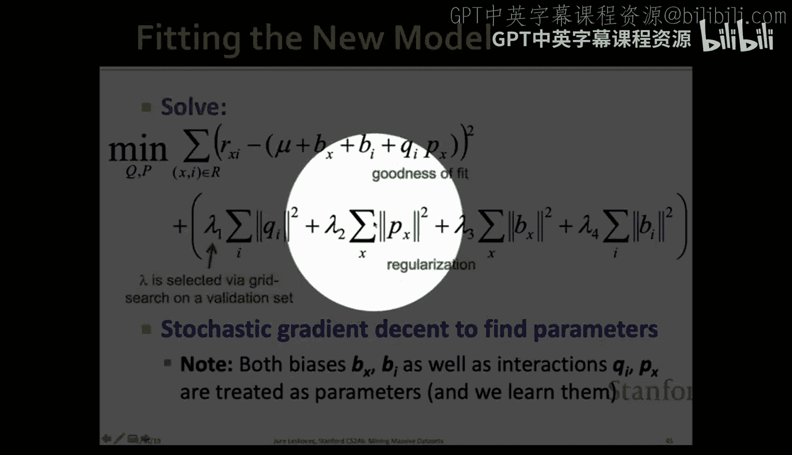
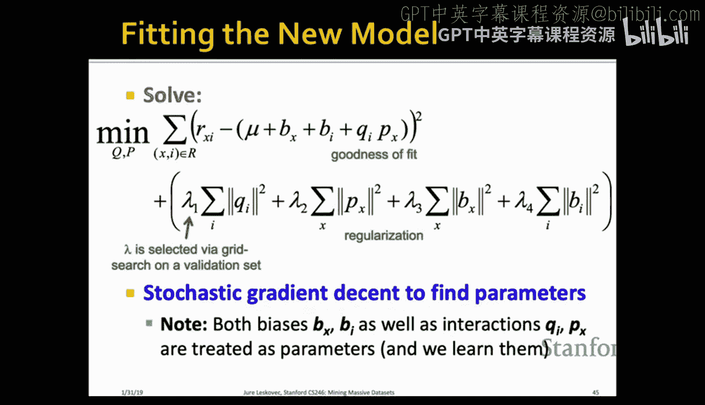

#  008：推荐系统 II

在本节课中，我们将学习推荐系统的进阶技术，特别是隐因子模型。我们将从回顾Netflix竞赛开始，深入探讨如何结合全局效应、协同过滤和矩阵分解来构建高性能的推荐引擎，并最终了解赢得百万美元大奖的解决方案。

## 问题背景：Netflix竞赛

几年前，Netflix发起了一项名为“Netflix Prize”的挑战赛。他们提供了约1亿条用户对电影的评分数据作为训练集。这些数据涵盖了约50万用户对1.8万部电影在2000年至2005年间的评分。

测试集则包含了约280万条评分，是每个用户最后给出的部分评分。竞赛的目标是：基于训练集构建推荐引擎，预测测试集中的评分，并最小化预测评分与真实评分之间的**均方根误差**。

当时Netflix生产系统的RMSE为0.951。竞赛规定，任何团队若能将该误差降低10%（即达到约0.8553），即可赢得100万美元奖金。最终，超过2700支队伍参与了这场竞赛。

## 数据与评估

数据可以看作一个巨大的矩阵：行代表电影，列代表用户。矩阵中的每个单元格表示某个用户对某部电影的评分。我们拥有1亿个已知评分（非零单元格），但相对于矩阵的总单元格数（约90亿）来说，数据非常稀疏。

评估方式如下：我们被给予矩阵中的部分已知评分（黄色部分），需要预测被隐藏的评分（灰色部分）。通过计算预测值与真实值之间的差异来衡量性能，具体公式为**均方根误差**：

\[
RMSE = \sqrt{\frac{1}{|Test|} \sum_{(u,i) \in Test} (r_{ui} - \hat{r}_{ui})^2}
\]

我们的目标就是最小化这个RMSE。

## 获胜方案概览

获胜团队名为“BellKor‘s Pragmatic Chaos”。他们的方法核心在于对数据进行**多尺度建模**：
1.  **全局效应**：捕捉整体趋势，如电影平均评分、用户平均评分。
2.  **区域效应（矩阵分解）**：使用隐因子模型捕捉用户和电影在潜在空间中的交互。
3.  **局部效应（协同过滤）**：基于相似项目进行非常局部的预测。

接下来，我们将逐一探讨这些部分，并了解如何将它们整合。

## 全局效应建模

全局效应旨在为预测建立一个基线。例如，预测用户Joe对电影《第六感》的评分：
*   整个数据集的平均评分是3.7星。
*   《第六感》的平均评分比全局平均高0.5星。
*   用户Joe的平均评分比全局平均低0.2星。

那么，基线预测就是：`3.7 + 0.5 - 0.2 = 4.0`星。这可以形式化为：

\[
b_{ui} = \mu + b_u + b_i
\]

其中，\(\mu\)是全局平均分，\(b_u\)是用户\(u\)的偏差，\(b_i\)是物品\(i\)的偏差。

上一节我们介绍了如何建立全局基线，本节中我们来看看如何结合更局部的信息。

## 局部效应：基于学习的协同过滤

传统的协同过滤基于物品相似度。例如，预测用户\(u\)对物品\(i\)的评分时，会找到与\(i\)最相似的、且被\(u\)评分过的物品集合\(N(i;u)\)，然后进行加权平均：

\[
\hat{r}_{ui} = \frac{\sum_{j \in N(i;u)} s_{ij} \cdot r_{uj}}{\sum_{j \in N(i;u)} s_{ij}}
\]

其中，\(s_{ij}\)是物品\(i\)和\(j\)的相似度。

然而，这种方法存在几个问题：相似度度量是任意的，且忽略了用户间的相互依赖关系。

一个改进方法是使用**插值权重** \(w_{ij}\) 来代替相似度 \(s_{ij}\)，并专注于预测与基线估计的**偏差**。改进后的公式如下：

\[
\hat{r}_{ui} = b_{ui} + \frac{\sum_{j \in N(i;u)} w_{ij} \cdot (r_{uj} - b_{uj})}{\sum_{j \in N(i;u)} w_{ij}}
\]

这里的关键转变是，我们不再直接预测绝对评分，而是预测评分相对于基线\(b_{uj}\)的偏差。\(w_{ij}\) 是需要从数据中学习的权重，它表示物品\(j\)对物品\(i\)的影响程度。

### 如何学习权重 \(w_{ij}\)？

我们的目标是**最小化训练数据上的平方误差和**。因为最小化平方误差和等价于最小化RMSE（开方和除以常数都是单调变换）。因此，我们定义损失函数 \(J(w)\)：

\[
J(w) = \sum_{(u,i) \in Train} (r_{ui} - \hat{r}_{ui})^2
\]

将预测公式 \(\hat{r}_{ui}\) 代入，我们就得到了一个关于权重 \(w\) 的二次函数。我们可以使用**梯度下降法**来找到最小化 \(J(w)\) 的 \(w\) 值。

梯度下降的更新公式为：
\[
w^{\text{new}} = w^{\text{old}} - \eta \cdot \nabla J(w^{\text{old}})
\]
其中，\(\eta\) 是学习率，\(\nabla J\) 是梯度。

通过这种方式学到的权重 \(w_{ij}\) 是基于数据优化的，而不是基于任意的相似度度量，因此通常能获得更好的预测性能。

## 区域效应：隐因子模型（矩阵分解）

隐因子模型的核心思想是将用户和物品映射到一个共同的低维潜在空间中。在这个空间中，用户向量与物品向量的点积可以预测评分。

我们假设评分矩阵 \(R\) 可以近似分解为两个矩阵的乘积：
\[
R \approx Q \cdot P^T
\]
其中，矩阵 \(Q\) 的每一行对应一个物品的隐因子向量，矩阵 \(P\) 的每一行对应一个用户的隐因子向量。对于用户\(u\)和物品\(i\)，预测评分为：
\[
\hat{r}_{ui} = q_i \cdot p_u^T
\]

这类似于奇异值分解（SVD），但有一个关键区别：SVD会最小化整个矩阵（包括缺失值，被视为0）的重建误差。而在推荐系统中，我们只关心对**已知评分**的重建误差。因此，我们需要解决以下优化问题：

\[
\min_{P, Q} \sum_{(u,i) \in Train} (r_{ui} - q_i \cdot p_u^T)^2
\]

### 过拟合与正则化

如果隐因子数量 \(k\) 设置得过大，模型可能会过度拟合训练数据，即在训练集上误差很小，但在未见过的测试集上误差很大。这种现象称为**过拟合**。

为了防止过拟合，我们引入**正则化**项，修改后的目标函数为：

\[
\min_{P, Q} \sum_{(u,i) \in Train} (r_{ui} - q_i \cdot p_u^T)^2 + \lambda_1 \sum_i ||q_i||^2 + \lambda_2 \sum_u ||p_u||^2
\]

正则化项 \(\lambda ||\cdot||^2\) 惩罚了隐因子向量的长度（L2范数）。\(\lambda\) 是正则化参数，控制着拟合数据与保持模型简洁性之间的权衡。其直观解释是：对于数据丰富的用户或物品，误差项占主导，模型会尽力拟合；对于数据稀疏的用户或物品，正则化项占主导，会将其向量拉向原点（接近全局平均），做出更保守的预测。

### 随机梯度下降

直接使用梯度下降求解上述问题，每次更新需要遍历所有训练样本（1亿条），计算开销巨大。**随机梯度下降** 是更高效的选择。它的核心思想是：每次更新只基于一个或一小批（mini-batch）训练样本计算梯度噪声估计，然后进行更新。

虽然每次更新的方向可能不准确，但由于更新速度极快，总体上往往能比标准梯度下降更快地收敛到较好的解。

## 整合所有组件

最终的模型是前面所有组件的集成：
1.  **全局基线**：\(b_{ui} = \mu + b_u + b_i\)
2.  **隐因子交互**：\(q_i \cdot p_u^T\)
3.  **时间效应**：将用户偏差 \(b_u\) 和物品偏差 \(b_i\) 建模为随时间变化的函数（例如，按时间分箱）。

因此，完整的预测公式为：
\[
\hat{r}_{ui}(t) = \mu + b_u(t) + b_i(t) + q_i \cdot p_u^T
\]

模型中的所有参数（\(\mu, b_u(t), b_i(t), P, Q\)）都通过带有正则化的随机梯度下降联合学习得到。

## Netflix竞赛的最终角逐

通过引入时间动态模型，误差可以降至0.876。为了进一步逼近目标，领先团队采用了“厨房水槽”法：他们构建了数百个不同的预测模型（包括各种变体和集成），然后将这些模型的预测结果以复杂的方式进行**混合**，形成最终的预测。

最终，BellKor‘s Pragmatic Chaos 团队以仅领先第二名20分钟提交的优势，达到了10.09%的改进目标，赢得了100万美元奖金。这场竞赛深刻地推动了推荐系统领域的发展，并突显了精心调整正则化、模型集成以及利用数据中时间模式的重要性。

## 总结与思考

本节课中我们一起学习了构建高级推荐系统的核心方法：
1.  **全局基线**：建立用户和物品的偏差模型。
2.  **基于学习的协同过滤**：用可优化的插值权重替代固定的相似度。
3.  **隐因子模型（矩阵分解）**：将用户和物品映射到潜在空间，用点积捕捉交互。
4.  **正则化**：防止过拟合，确保模型泛化能力。
5.  **时间动态**：将偏差参数建模为时间的函数，以捕捉趋势变化。
6.  **模型集成**：结合多个模型的预测以提升性能。

Netflix竞赛表明，成功的关键在于细致的数据分析、对过拟合的控制（正则化）以及灵活地整合多种信号。在实际应用中，除了显式评分，我们还需要考虑隐式反馈（如观看完成率、订阅留存率），这些同样是构建有效推荐系统的重要标签。