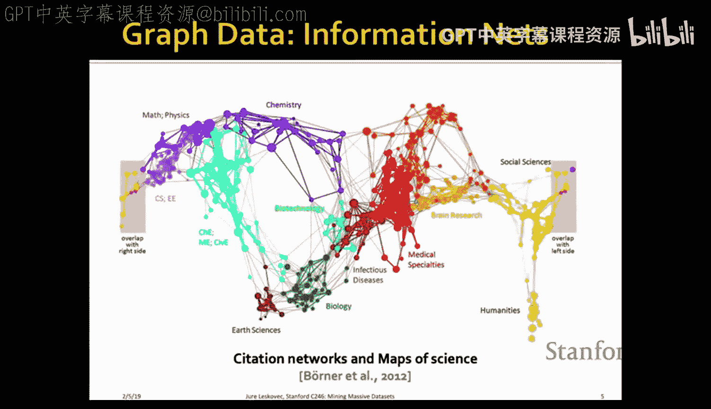
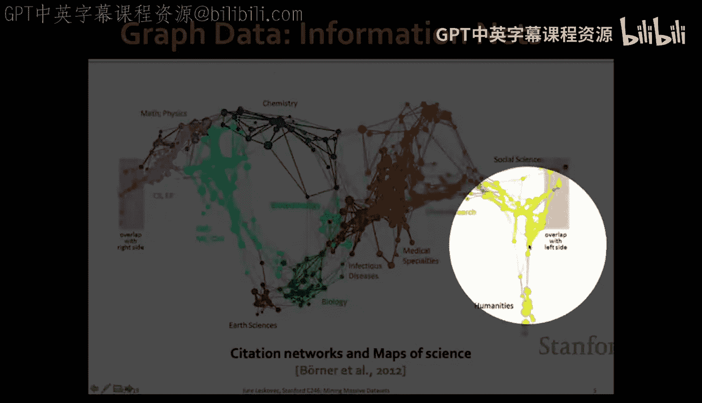
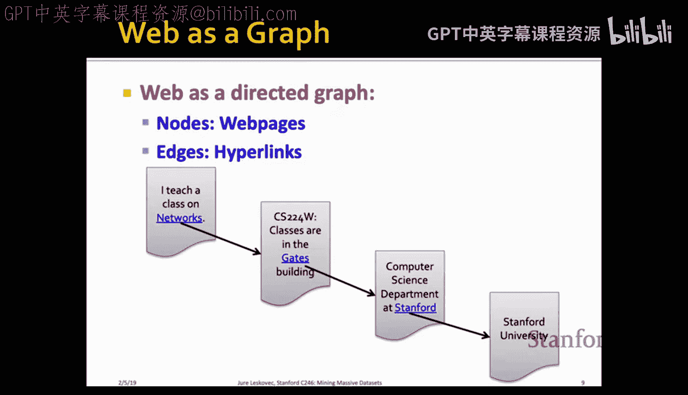

#  009：PageRank算法详解

在本节课中，我们将要学习如何分析和计算大规模图结构中节点的重要性。我们将重点介绍PageRank算法，这是由Google创始人Larry Page和Sergey Brin提出的核心算法，用于衡量网页的重要性。我们将从图结构数据的普遍性讲起，逐步深入到PageRank的递归定义、随机游走模型、矩阵特征值问题，并最终学习如何高效地计算PageRank。

## 图结构数据无处不在

上一节我们介绍了课程的整体安排，本节中我们来看看什么是图结构数据。图结构数据是指可以自然地表示为图的数据，图由一组节点和连接这些节点的边组成。

以下是图结构数据的一些典型例子：
*   **社交网络**：节点代表人，边代表人与人之间的关系。
*   **媒体生态系统**：例如政治博客之间的链接网络，可以用于分析观点形成和两极分化。
*   **科学引文网络**：节点代表科学论文或科学家，边代表引用关系，可以揭示不同科学领域之间的联系。
*   **通信与基础设施网络**：如互联网、道路网、电网等，可以建模为图以进行优化和鲁棒性分析。

## 将万维网视为图

上一节我们看到了图在多个领域的应用，本节中我们来看看一个核心案例：万维网。我们可以将万维网视为一个巨大的图，其中节点是网页，边是网页之间的超链接。这形成了一个有向的连接网络。

早期组织网络的方式（如雅虎目录）是人工分类。而现代网络搜索面临两个核心问题：如何评估海量、不可信甚至包含垃圾信息网页的可信度；以及如何找到查询的最佳答案，即使答案页面可能不包含查询关键词。

解决这些问题的关键在于利用网络图的结构。通过分析链接，我们可以理解图中节点（网页）的重要性，这个研究领域称为**链接分析**。今天我们将重点讨论该领域的主要方法：**PageRank**。

## PageRank：递归定义与流方程

上一节我们提出了评估节点重要性的需求，本节中我们来看看PageRank算法的核心思想。一个直观的想法是：一个网页的重要性取决于指向它的其他网页的重要性。重要的网页投出的票更有分量。

这引出了一个递归定义：网页`j`的PageRank得分`r_j`等于所有指向`j`的网页`i`的PageRank得分之和，其中每个网页`i`将其重要性均分给它指向的所有网页。

用公式表示如下：
`r_j = Σ_{i -> j} (r_i / d_i)`
其中，`d_i`是网页`i`的出链数量。

这被称为**流方程**，可以想象影响力沿着边流动。每个节点从入边收集影响力，并将其均分给出边。

## 从流方程到矩阵方程

上一节我们得到了PageRank的流方程，本节中我们来看看如何将其转化为矩阵形式以便计算。

我们定义一个**随机邻接矩阵M**。如果网页`i`有`d_i`个出链，并且`i`指向`j`，则矩阵元素`M_{ji} = 1 / d_i`，否则为0。这样，矩阵`M`的每一列之和为1（列随机矩阵）。

我们再定义一个**排名向量r**，其第`i`个分量是网页`i`的PageRank得分，并且所有得分之和为1。

可以证明，流方程等价于以下矩阵方程：
`r = M * r`

这意味着排名向量`r`是矩阵`M`的特征值为1的特征向量。这为我们提供了另一种视角和计算方法。

## 随机游走解释

上一节我们得到了矩阵特征值形式的PageRank方程，本节中我们来看看一个更直观的解释：**随机游走模型**。

想象一个随机冲浪者在网络上浏览：他从一个随机网页开始，每次在当前页面上随机点击一个链接前往下一个页面。这个过程无限进行下去。

设`p(t)`是一个向量，其第`i`个分量表示冲浪者在时刻`t`位于网页`i`的概率。那么，从`t`时刻到`t+1`时刻的概率分布更新为：
`p(t+1) = M * p(t)`

当这个过程达到稳态，即概率分布不再随时间变化时，有 `p = M * p`。这正是我们之前得到的方程。因此，PageRank得分可以解释为随机冲浪者长期访问各个网页的极限概率分布。

流方程、特征向量和随机游走模型在此完美统一。

## 问题：终止点与陷阱

上一节我们建立了PageRank的理论模型，本节中我们来看看这个模型在真实网络图中会遇到的问题。

第一个问题是**终止点**：即没有出链的网页。随机游走者到达这种页面后便“无处可去”，导致重要性分数从系统中“泄漏”。

第二个问题是**采集器陷阱**：即一组网页，其所有出链都在组内。随机游走者一旦进入该组，便永远无法离开，最终该组会吸收所有重要性分数。

这两种情况都会导致基本的幂迭代法失效或得到不合理的结果。

## 解决方案：随机跳转

上一节我们指出了基本模型的问题，本节中我们来看看Google的解决方案：引入**随机跳转**。

我们修改随机游走者的行为：在每一步，冲浪者以概率`β`（通常设为0.8或0.9）按照链接随机浏览；以概率`1-β`进行**随机跳转**，即瞬间跳转到网络中的任何一个随机网页（均匀分布）。

这解决了两个问题：
*   **解决采集器陷阱**：冲浪者有机会跳出循环或封闭组。
*   **解决终止点**：我们可以将终止点视为一个特殊的随机跳转：到达终止点后，冲浪者以概率1跳转到随机网页。

修正后的PageRank方程为：
`r_j = β * Σ_{i -> j} (r_i / d_i) + (1-β) / n`
其中`n`是网页总数。

## 高效的PageRank计算

上一节我们得到了修正后的PageRank方程，本节中我们来看看如何高效地计算它，尤其是在海量图上。

修正后的方程可以写成矩阵形式 `r = A * r`，其中 `A = βM + (1-β)[1/n]`。矩阵`A`是稠密矩阵，直接存储和计算不可行。

通过代数变换，我们可以将迭代步骤改写为：
`r_new = β * M * r_old + [(1-β)/n] * 1`
这里`1`是全1向量。这个形式非常关键，因为矩阵`M`是稀疏的（边数决定），我们只需要高效地计算`M * r_old`，然后为每个节点加上一个常数即可。

以下是完整的PageRank算法步骤：
1.  初始化排名向量`r`（如均匀分布）。
2.  重复直到收敛：
    *   计算 `r'_j = β * Σ_{i -> j} (r_i / d_i)` （对所有j）。
    *   计算 `S = Σ_j r'_j`。由于存在终止点，`S`可能小于1。
    *   设置 `r_j = r'_j + (1 - S) / n` （对所有j）。这同时处理了随机跳转和重要性泄漏。

## 大规模计算与数据布局

上一节我们给出了内存充足时的算法，本节中我们来看看当图大到无法全部装入内存时，如何进行计算。

假设排名向量`r`可以放入内存，而矩阵`M`存储在磁盘上。我们可以顺序读取`M`的每一行（源节点`i`及其出链列表），并根据`r_old[i]`的值更新所有目标节点`j`在`r_new`中的值。这只需要对`r_new`进行随机写访问。

如果连向量`r_new`都无法完全装入内存，我们可以采用**分块更新**策略。将`r_new`分成若干块，每次只将一块调入内存。然后扫描整个矩阵`M`和向量`r_old`，但只更新当前内存中块对应的目标节点。这需要多次扫描数据。

更优的方法是**分块-条带化更新**。我们不仅将`r_new`分块，还将矩阵`M`也按目标节点重新组织成“条带”。第`k`个条带只包含指向第`k`个块中节点的边。这样，在更新第`k`个块时，我们只需要顺序读取第`k`个条带和整个`r_old`向量，避免了不必要的磁盘访问。每个边在整个计算过程中只被读取一次。

## 总结与扩展

本节课中我们一起学习了PageRank算法。我们从图结构数据的普遍性出发，探讨了衡量节点重要性的需求。PageRank通过递归定义（流方程）将节点重要性与其入链节点的重要性关联起来。

我们看到了该定义的三种等价形式：
1.  **流方程**：直观的递归公式。
2.  **矩阵特征值问题**：`r = M * r`，将求解转化为寻找随机矩阵主特征向量。
3.  **随机游走模型**：将PageRank解释为随机冲浪者的极限分布。

为了解决真实网络中存在的终止点和采集器陷阱问题，我们引入了带随机跳转的修正模型。最终，我们推导出了高效的幂迭代计算方法，并讨论了如何通过巧妙的数据布局（分块-条带化）在海量数据集上实现PageRank计算。

PageRank是链接分析的基础。其变体包括**主题敏感PageRank**（非均匀跳转分布）、**HITS算法**（区分枢纽和权威页面）以及**TrustRank**（用于对抗垃圾链接）。我们将在后续课程中探讨与网络垃圾对抗的相关内容。