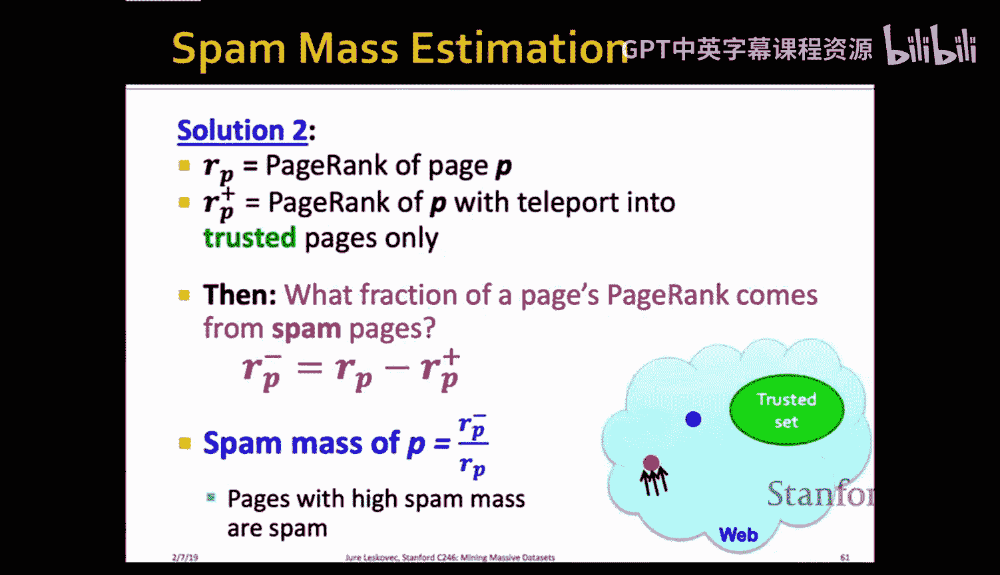

#  010：链接垃圾与社交网络简介


在本节课中，我们将学习PageRank算法的扩展应用，包括主题特定PageRank和随机游走重启算法，并探讨如何利用这些技术构建推荐系统。最后，我们将深入研究网络上的链接垃圾问题，并学习如何使用信任排名来对抗垃圾农场。

## PageRank回顾与扩展

上一节我们介绍了PageRank算法，它通过模拟随机游走者的行为来评估图中节点的重要性。随机游走者可以沿着链接浏览，也可以“传送”到图中的任意节点。我们通过构建一个随机转移矩阵，并使用幂迭代法求解其主特征向量（即平稳分布），来计算每个节点的PageRank分数。

以下是处理“死胡同”和“蜘蛛陷阱”的算法伪代码：

```python
# 初始化所有节点的分数为 1/N
# 重复直到收敛：
#   S = beta * (从所有入链邻居处获得的分数之和)
#   # S 的总和将小于 1，因为乘以了 beta < 1
#   leaked_rank = (1 - S的总和) / N
#   每个节点的新分数 = 其获得的S分数 + leaked_rank
```

这个算法可以在大型图上高效运行，通常在50次迭代内收敛。

然而，标准的PageRank衡量的是节点在整个图中的通用重要性，并未考虑页面的主题。接下来，我们将探讨如何使其变得“主题特定”。

## 主题特定PageRank

本节中，我们来看看如何使PageRank与特定主题相关。目标是评估网页在特定主题（如体育、历史）下的重要性，而不仅仅是根据整体图结构。

其核心思想是修改随机游走者的“传送”行为。在标准PageRank中，游走者传送时会均匀地跳转到图中任何一个节点。而在主题特定PageRank中，我们定义一个“传送集”S，它只包含与特定主题相关的页面。每当游走者决定传送时，它只会跳转到S集合中的某个随机页面。

**公式变化如下：**
在标准PageRank的转移矩阵中，传送部分为 `(1 - beta) * (1 / N)`，其中N是节点总数。
在主题特定PageRank中，传送部分变为 `(1 - beta) * (1 / |S|)`，但仅对属于传送集S的节点添加此项。不属于S的节点只获得由链接转移带来的分数（乘以beta）。

因此，对于每个不同的传送集S，我们都会得到一个不同的PageRank向量R_S。这也被称为个性化PageRank。

计算过程与标准PageRank类似，只需在迭代更新分数时，确保只有传送集中的节点获得来自传送的分数增量。

以下是选择传送集（即主题）的一些方法：
*   使用开放目录（如DMOZ）中权威页面作为主题代表。
*   对用户查询进行分类，根据分类结果选择对应的主题传送集。
*   根据用户历史查询、书签或当前浏览页面的上下文来推断主题。

实际应用中，我们可以为多个重要主题预计算不同的PageRank向量。当用户发起搜索时，先检索包含关键词的页面，然后使用与查询主题最相关的那个PageRank向量来对这些页面进行排序。

## 随机游走重启与推荐系统

上一节我们介绍了主题特定PageRank，本节我们将其推向极致：将传送集S设置为仅包含一个节点。这被称为**随机游走重启**。游走者总是从同一个起始节点U开始，每次传送（重启）都回到U。这样，其他节点相对于U的PageRank分数，就量化了该节点与起始节点U在图中的“接近度”或“相关性”。

这种方法能比简单的最短路径更好地衡量节点间的关联强度，因为它考虑了所有路径（包括间接路径），并考虑了节点的度数（避免高度数节点的干扰）。

这种方法在推荐系统中极其有用。例如，可以构建一个二部图，连接“用户-物品”、“作者-会议”或“论文-关键词”。通过在这个图上运行以某个节点（如用户当前感兴趣的物品）为起点的随机游走重启，我们可以找到与该节点最接近的其他节点，作为推荐候选。

**一个实例：Pinterest的推荐系统**
Pinterest拥有一个巨大的图：约40亿个图钉（Pin）、30亿个画板（Board）和2000亿条边（图钉被保存到画板）。其推荐系统的工作原理如下：
1.  给定一个查询图钉（用户当前观看的）。
2.  以该图钉为起始节点，在“图钉-画板”二部图上模拟随机游走重启。
3.  随机游走过程：从当前图钉随机跳转到一个包含它的画板，然后从该画板随机跳转到一个新的图钉，如此反复，并以一定概率重启回查询图钉。
4.  记录每个被访问图钉的访问次数。
5.  返回访问次数最高的前K个图钉作为推荐结果。

这种方法之所以高效且可扩展，原因如下：
*   **局部性**：随机游走倾向于停留在起始节点附近，我们只关心排名靠前的节点，因此无需遍历整个巨图。运行时间与图的大小无关，只与局部探索范围有关。
*   **实时计算**：无需预计算所有节点对的接近度，可以按需为每个查询实时运行快速随机游走模拟（每秒可进行数十亿次推荐）。
*   **图剪枝**：可以通过移除超高度的图钉和画板（它们会使游走过度分散）来压缩图，使其能放入单机内存（例如压缩后约200GB）。
*   **灵活性**：可以引入边权重（例如偏向用户语言的内容），或使用“早停”策略（当排名第1000的节点被访问足够多次时即停止游走）。

## 网络垃圾与垃圾农场

现在，我们转向网络安全的另一面：链接垃圾。垃圾是指任何旨在人为提升网页在搜索引擎结果中排名的活动，这与页面的真实价值相悖。估计约有10-15%的网页是垃圾页面。

早期的垃圾主要针对**术语垃圾**，例如在页面背景色中隐藏大量关键词，或复制高排名页面内容。搜索引擎通过分析文本颜色、频率，以及使用**锚文本**（其他页面链接到该页面时使用的文字）和PageRank来对抗这类垃圾。

然而，垃圾发布者随之转向**链接垃圾**，即创建特殊的链接结构来人为提升目标页面的PageRank。这种结构被称为**垃圾农场**。

**垃圾农场的典型结构：**
1.  **目标页面T**：垃圾发布者想要提升排名的页面。
2.  **可访问页面**：垃圾发布者不拥有但能发布评论和链接的页面（如博客评论区），这些页面链接到T。
3.  **自有页面**：垃圾发布者完全控制的大量页面（数量为M）。T链接到所有这些自有页面，而这些自有页面又都链接回T，形成一个紧密的互链结构。

通过数学推导可以证明，这种结构能带来两大好处：
1.  **乘数效应**：从可访问页面获得的PageRank贡献 `x`，在目标页面T处会被放大。公式近似为：`PageRank(T) ≈ x / (1 - beta^2)`。当beta=0.85时，乘数约为3.6。
2.  **规模效应**：目标页面T的PageRank还与自有页面数M成正比。垃圾发布者拥有的页面越多，T的排名就越高。

## 信任排名：对抗垃圾农场

为了检测和对抗垃圾农场，我们引入**信任排名**。其核心思想基于“近似隔离”原理：好的页面很少链接到坏的页面，而坏的页面则经常相互链接。

信任排名的步骤如下：
1.  **选取信任种子集**：人工识别出一小部分可信页面（例如.gov、.edu域名下的页面）。
2.  **信任传播**：以信任种子集作为传送集，运行**主题特定PageRank**。这实质上是将信任值沿链接在网络中传播。
   *   每个被信任页面初始获得信任值。
   *   页面将其信任值按出链数量平分，并乘以一个衰减因子beta后传递给所链接的页面。
   *   页面的总信任值是所有入链传递来的信任值之和。
3.  **判定垃圾**：得到每个页面的信任分数后，有两种方式判定垃圾：
   *   **方案A：阈值法**：直接设定一个信任分数阈值，低于该阈值的页面被视为垃圾。
   *   **方案B：垃圾质量法**：更优的方法是计算页面的**垃圾质量**。
        *   令 `r(p)` 为页面p的标准PageRank分数（全局重要性）。
        *   令 `r+(p)` 为页面p的信任排名分数（来自可信集的重要性）。
        *   定义 **垃圾质量 = (r(p) - r+(p)) / r(p)**。
        *   如果一个页面全局排名很高 (`r(p)` 大)，但来自可信集的排名很低 (`r+(p)` 小)，那么它的垃圾质量就很高，很可能是通过垃圾农场获得排名的。

选择信任种子集需要在“覆盖面广”（确保所有好页面都能通过短路径被覆盖）和“规模小”（减少人工审核成本）之间取得平衡。启发式方法包括选择标准PageRank最高的K个页面，或直接使用受控域名（如.edu）下的页面。

## 总结

本节课中我们一起学习了：
1.  **主题特定PageRank**：通过将随机游走者的传送目标限制在与特定主题相关的页面集合中，来衡量节点在特定主题下的重要性。
2.  **随机游走重启**：将传送集固定为单个起始节点，用于衡量图中其他节点与该节点的接近度，是构建高效、可扩展推荐系统的强大工具。
3.  **链接垃圾与垃圾农场**：了解了垃圾发布者如何通过创建特殊的互链结构（垃圾农场）来人为提升页面PageRank。
4.  **信任排名**：学习了如何通过以可信页面集为起点运行个性化PageRank来传播信任，并通过比较页面的全局PageRank与信任排名分数（计算垃圾质量）来有效识别和过滤垃圾页面。

这些技术展示了如何通过巧妙地利用图结构和随机游走模型，来解决信息检索、推荐系统和网络安全中的核心问题。



