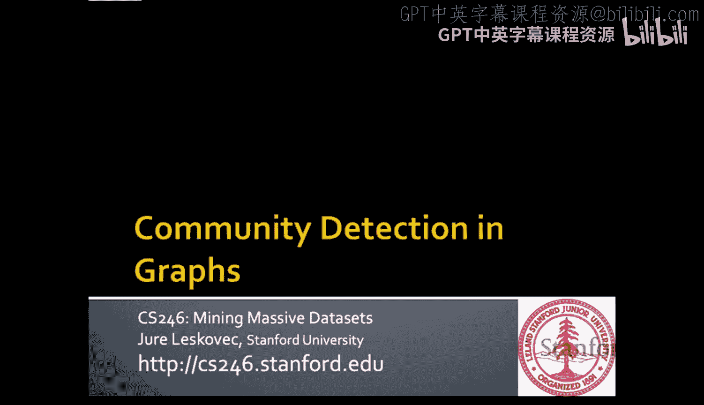
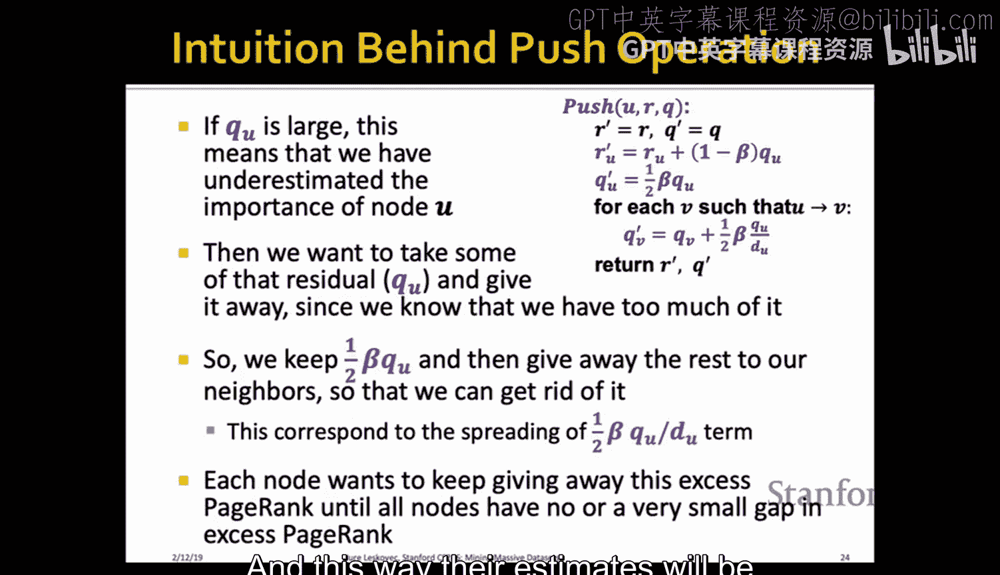
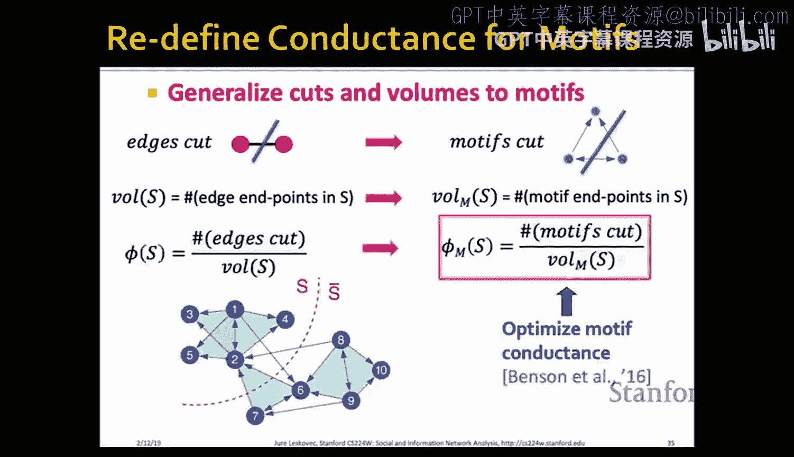
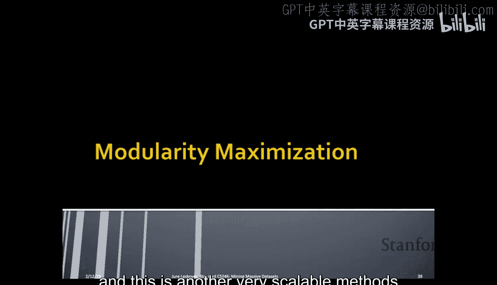
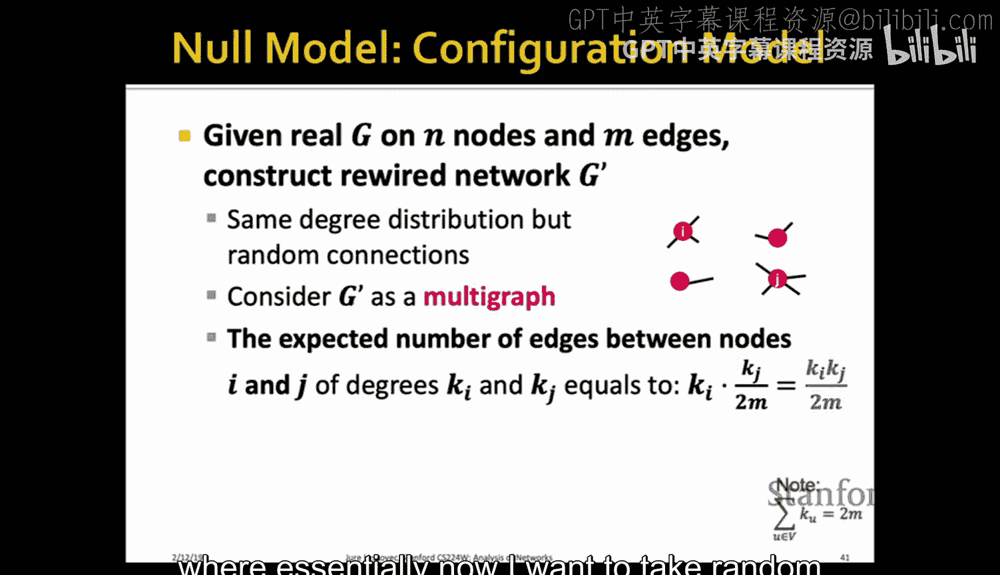
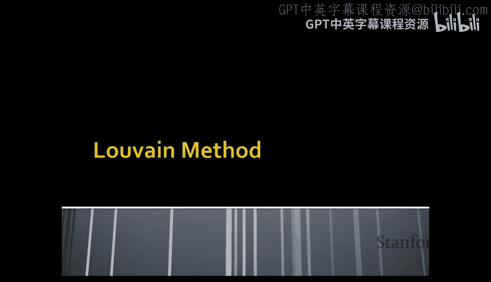
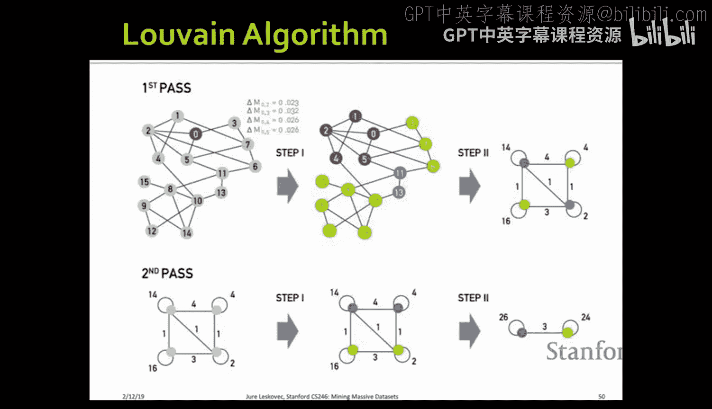
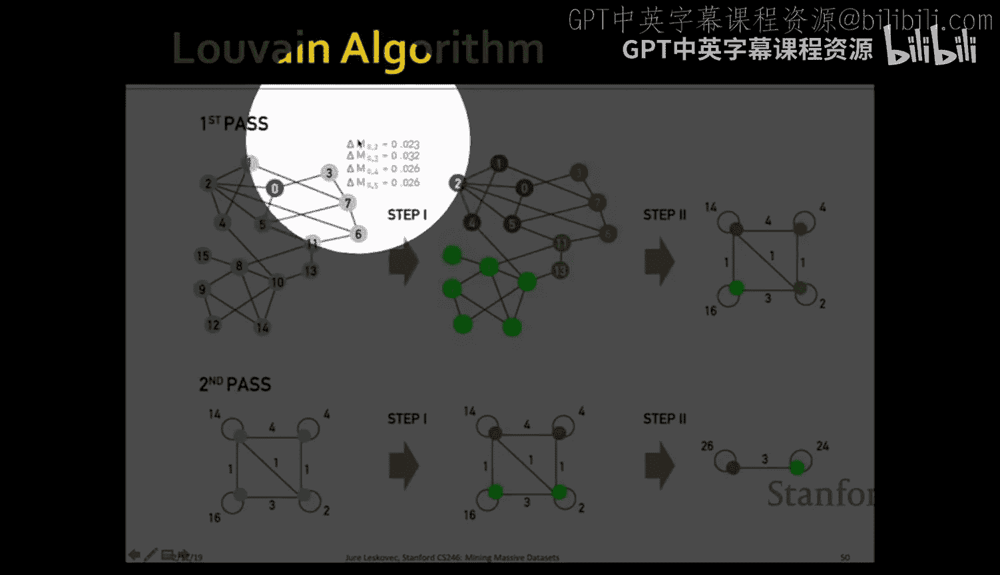
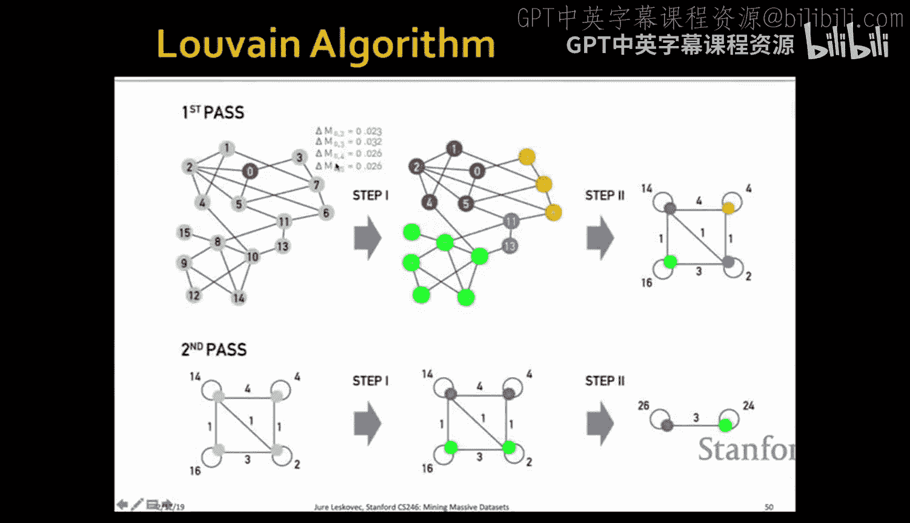

#  011：图中的社区检测

在本节课中，我们将要学习如何在图中进行社区检测。社区检测的目标是发现图中那些内部连接紧密、外部连接稀疏的节点组，这些组通常被称为集群、模块或社区。我们将介绍两种主要方法：基于个性化PageRank的局部社区发现方法和基于模块度最大化的全局社区发现方法。

## 概述

上一节我们介绍了图中节点的重要性度量（如PageRank）。本节中，我们来看看如何发现图中的社区结构。社区结构是许多真实网络（如社交网络、生物网络）的内在特征。我们的目标是设计出能够高效、可扩展地发现这些社区的方法。

## 社区检测简介

现实世界中的网络，如社交网络、生物网络和信息网络，通常具有非随机的结构。它们存在一些潜在的、有组织的模式。我们的目标就是发现并提取这些潜在的组织结构。这些结构有时被称为集群、模块或社区。

核心思想是，网络可以被分割成一些内部连接紧密的单元。这些单元可以像下图所示那样，以层次化的方式嵌套存在。

例如，一个社交网络可能包含三个大的社区，而每个大社区内部又包含若干个子社区。我们的目标就是发现这种结构，并识别出属于每个社区的节点。

下图是另一个例子。虽然在小图上识别这些紧密连接的节点组看似简单，但核心问题在于：我们如何定义“好”的社区？应该使用什么样的优化目标函数？以及如何高效地求解？

今天，我们将讨论**非重叠社区检测**，即每个节点只属于一个社区。如果我们有一个理想的社区结构，其邻接矩阵经过排序后，会呈现出明显的块状结构：社区内部连接密集（矩阵块内为深色），社区之间连接稀疏（矩阵块外为浅色）。

然而，我们实际得到的邻接矩阵是未经排序的，看起来是随机的。因此，从看似随机的数据中发现这种潜在结构是一个极具挑战性的问题。

## 应用实例

以下是社区检测的几个应用场景：

*   **网络广告**：可以构建一个二分图，其中一方是广告商，另一方是关键词。如果广告商对一组关键词出价，则存在边。通过社区检测，可以发现对相似关键词组合感兴趣的广告商群体。例如，可能发现一个与“赌博”相关的关键词集群，其中又包含一个专注于“体育博彩”的子集群。
*   **电影-演员网络**：构建一个二分图，连接演员和他们参演的电影。对此图进行社区检测，第一层级的集群可能对应不同的语言或国家，如阿根廷电影、墨西哥电影、巴西电影等。
*   **个人社交网络**：分析个人的朋友网络（Ego Network），可以发现不同的社群，如高中同学、家人、大学朋友、研究组成员等。这些社群可能是重叠或嵌套的。

## 问题设定与假设

我们的假设是图规模很大，但足够放入内存。通过优化，大约可以在16GB内存中处理2亿个节点和20亿条边。因此，即使在笔记本电脑上，也能处理相当大规模的网络。

尽管图可以放入内存，但其规模之大使得我们只能承受**线性时间复杂度**的算法。本节课将介绍一种非常高效的计算PageRank的方法，用于发现图中的密集社区。

这种方法的一个优点是，其运行时间与**输出的社区大小成正比**，而与**整个图的大小无关**。这意味着我们甚至可以在有限时间内处理理论上无限大的图，因为它只访问图中很小的一部分。

## 方法一：基于个性化PageRank的局部社区发现

### 核心思路

该方法从一个给定的**种子节点**出发，旨在找到包含该种子节点的社区。

基本思想是：在种子节点上运行**个性化PageRank**，其中传送集仅包含该种子节点。直觉是，如果种子节点属于一个连接紧密的社区，那么随机游走者将在该社区内“被困住”很长时间。一旦游走者“逃出”该社区，就会迅速扩散到图的其他部分而消失。

### 算法大纲

以下是该方法的步骤概述：

1.  **选择种子节点**：选取一个感兴趣的种子节点 `s`。
2.  **运行个性化PageRank**：以 `s` 为传送集，计算个性化PageRank向量。
3.  **按分数排序节点**：根据个性化PageRank分数降序排列所有节点。
4.  **执行扫描操作**：通过扫描操作识别出优质社区。

扫描操作是该方法的关键。我们按PageRank分数降序逐个将节点加入候选集合，并计算当前集合的某种质量指标（通常是**电导率**，下文会详述）。绘制质量指标随集合大小变化的曲线（扫描曲线），曲线中的**局部最小值**通常对应一个好的社区划分。

上图展示了一个扫描曲线的例子。第一个局部最小值对应一个较小的社区（无线箭头），第二个更深的局部最小值对应一个更大的社区（绿色箭头）。较小的社区嵌套在较大的社区之中。

### 社区质量度量：电导率

在深入扫描操作之前，我们需要定义如何衡量一个社区（节点子集）的质量。给定一个无向图，我们将节点集划分为两个不相交的子集 `A` 和 `B`（`B = V \ A`）。我们的目标是最大化社区内部连接，最小化社区之间的连接。

为此，我们定义两个量：
*   **割**：连接集合 `A` 内部与外部节点的边的权重之和。
    *   公式：`cut(A) = Σ_{i∈A, j∉A} w_{ij}`
*   **体积**：与集合 `A` 中节点相关联的所有边的权重之和（即 `A` 中所有节点的度之和）。
    *   公式：`vol(A) = Σ_{i∈A} degree(i)`

一个直观的想法是最小化 `cut(A)`。但这存在缺陷，例如，它可能倾向于选择只有一个节点的集合（割为1），而这通常不是有意义的社区。

更好的度量是**电导率**，它考虑了社区的内部连接，类似于表面积与体积之比。

*   **电导率公式**：`Φ(A) = cut(A) / min(vol(A), 2m - vol(A))`
    *   其中 `m` 是图中总边数（对于加权图是总权重），`2m` 是整个图的体积。
    *   分母取 `vol(A)` 和 `vol(V\A)` 中较小者，是为了鼓励发现规模相对均衡的划分，避免选择极大的集合（其体积接近 `2m`，导致电导率很小但无意义）。

**电导率越低，表示社区质量越好**（内部连接紧密，外部连接稀疏）。

### 扫描操作详解

现在我们可以详细说明扫描操作：

1.  将节点按个性化PageRank分数 `r` 降序排列：`v1, v2, ..., vn`，其中 `r(v1) ≥ r(v2) ≥ ... ≥ r(vn)`。
2.  按顺序考虑前 `k` 个节点组成的集合 `S_k = {v1, v2, ..., vk}`，其中 `k` 从 1 到 `n`。
3.  对于每个 `k`，计算集合 `S_k` 的电导率 `Φ(S_k)`。
4.  绘制 `Φ(S_k)` 关于 `k` 的曲线。
5.  识别曲线中的**局部最小值**，每个局部最小值对应的集合 `S_k` 被认为是一个优质的社区。

**高效计算**：扫描曲线可以在线性时间内计算。当我们从 `S_k` 扩展到 `S_{k+1}`（即加入节点 `v_{k+1}`）时，可以快速更新割和体积：
*   `vol(S_{k+1}) = vol(S_k) + degree(v_{k+1})`
*   `cut(S_{k+1}) = cut(S_k) + degree(v_{k+1}) - 2 * (v_{k+1} 与 S_k 中节点相连的边数)`
这样，只需一次遍历即可计算出整个曲线。

### 近似个性化PageRank计算

直接计算个性化PageRank需要多次迭代遍历整个图，成本高昂。为了 scalability，我们使用一种近似算法：**PageRank Nibble**。

该算法的核心是**惰性随机游走**和**残差推送**的思想。

*   **惰性随机游走**：在每个节点，游走者以 `1/2` 概率停留在原地，以另外 `1/2` 概率随机跳到一个邻居。
*   **残差**：定义残差 `r(u)` 为节点 `u` 的真实PageRank分数与当前估计值之间的误差。
*   **推送操作**：算法维护两个向量：估计PageRank向量 `p` 和残差向量 `r`。初始时，`p` 全为0，`r` 在种子节点处为1，其余为0。
    *   当某个节点 `u` 的残差除以其度数大于某个阈值 `ε`（`r(u)/degree(u) > ε`）时，对该节点执行推送操作：
        1.  将一部分残差 `(1-β)*r(u)` 加入到 `p(u)` 中（`β` 是传送概率）。
        2.  将剩余残差 `β*r(u)` 平均推送给 `u` 的所有邻居 `v`，即每个邻居的残差增加 `β*r(u) / degree(u)`。
        3.  将 `u` 的残差 `r(u)` 设为0。
*   **迭代**：重复上述推送操作，直到所有节点都满足 `r(u)/degree(u) ≤ ε`。

**算法优势**：
*   运行时间为 `O(1/(ε(1-β)))`，与图的大小无关，只与精度参数 `ε` 和 `β` 有关。
*   是一种局部算法，只访问图中PageRank值显著高于误差阈值的部分，非常适合寻找局部社区。
*   有理论保证，如果图中存在电导率为 `φ` 的社区，该方法能找到电导率不超过 `O(√φ)` 的社区。

通过调整误差参数 `ε`，可以控制随机游走传播的范围。`ε` 越大，算法越局部，运行越快；`ε` 越小，结果越精确，但运行越慢。在扫描曲线中，我们只信任PageRank估计相对准确的前一部分节点，后面的部分由于误差累积可能不可靠。

## 方法二：基于模块度最大化的全局社区发现

上一节我们介绍了基于种子节点的局部社区发现方法。本节中，我们来看看一种不需要种子节点、旨在发现整个图所有社区的全局方法。

### 模块度定义

模块度 `Q` 用于衡量网络划分成社区的整体质量。对于给定的划分 `S`（将节点分到多个社区），模块度定义为：

*   **模块度公式**：`Q(S) = (1/(2m)) * Σ_{c∈S} [ (Σ_{i,j∈c} A_{ij}) - (Σ_{i,j∈c} (degree(i)*degree(j))/(2m) ) ]`
    *   `m`：图中总边数（或总权重）。
    *   `A_{ij}`：节点 `i` 和 `j` 之间的边权重（无边则为0）。
    *   第一项 `Σ_{i,j∈c} A_{ij}`：社区 `c` 内部实际的边权重之和。
    *   第二项 `Σ_{i,j∈c} (degree(i)*degree(j))/(2m)`：在**零模型**下，社区 `c` 内部期望的边权重之和。

**零模型（配置模型）**：我们构造一个随机图，其中每个节点 `i` 的度数 `degree(i)` 与原图相同，但边是随机连接的。在这个模型中，节点 `i` 和 `j` 之间期望的边数为 `(degree(i)*degree(j))/(2m)`。

模块度的核心思想是：**一个好的社区划分，其社区内部的连接应远高于随机连接下的期望值**。`Q` 的取值范围在 `[-1, 1]` 之间，通常大于 `0.3` 就认为社区结构比较显著。

我们的目标是找到使模块度 `Q` 最大化的划分 `S`。

### Louvain 算法

Louvain 算法是一种高效、贪婪的模块度最大化算法，时间复杂度约为 `O(n log n)`。它支持加权图，并能产生层次化的社区结构。

算法分为两个重复进行的阶段：

**阶段一：局部优化**
1.  初始化：每个节点独自成为一个社区。
2.  遍历所有节点（顺序可能影响结果，但通常影响不大）。对于每个节点 `i`，考虑将其移动到每个邻居节点 `j` 所在的社区。
3.  计算每种移动带来的模块度增益 `ΔQ`。
4.  将节点 `i` 移动到能带来**最大正增益** `ΔQ` 的社区。如果所有移动都不能带来正增益，则节点 `i` 保持不动。
5.  重复遍历所有节点，直到没有节点可以移动（即模块度无法再提高）。此时达到一个局部最优。

计算 `ΔQ` 的公式可以只依赖于社区和节点的局部统计信息（如社区内部边权重和、社区总度数、节点与社区之间的边权重和等），因此计算非常高效。

**阶段二：网络凝聚**
1.  将阶段一找到的所有社区分别凝聚成新的“超节点”。
2.  超节点之间的边权重，等于原图中对应两个社区之间所有边的权重之和。
3.  超节点内部的自环边权重，等于原社区内部所有边的权重之和。
4.  这样就得到了一个新的、更小的加权网络。

**迭代**：将新生成的网络作为输入，重新应用**阶段一**和**阶段二**。如此反复，直到网络结构不再变化（模块度无法再提高），或者整个网络被凝聚成一个节点。

**层次化输出**：这个过程自然产生了一个社区划分的层次结构。最初每个节点是一个社区，然后小社区合并成大社区，最终合并为整个网络。我们可以选择层次结构中模块度最大的那一层划分作为最终结果。

上图展示了Louvain算法在一个小网络上的运行过程。从左到右，先是初始划分，然后经过局部优化和凝聚，产生新的网络，再次优化，最终得到层次化结构。

## 方法比较与总结

本节课中我们一起学习了两种社区检测方法：

1.  **基于个性化PageRank的局部方法**：
    *   **优点**：运行快，与图规模无关，适合寻找特定种子节点周围的局部社区。可以处理大规模图。
    *   **缺点**：需要指定种子节点；一次只找一个社区；结果受参数 `ε` 影响。
    *   **适用场景**：当你关心某个特定节点属于哪个社区时。

2.  **基于模块度最大化的Louvain全局方法**：
    *   **优点**：不需要种子节点；能发现整个图的社区结构；输出层次化结果；速度快，在实践中非常流行。
    *   **缺点**：是贪婪算法，可能找到局部最优解；结果可能受节点遍历顺序影响。
    *   **适用场景**：当你想要了解整个网络的全局社区组成和层次结构时。

**如何选择**：
*   如果问题聚焦于单个或少数几个节点及其所属社区，使用第一种方法。
*   如果需要对整个网络进行全面的社区划分和分析，使用第二种方法。

这两种方法为我们提供了强大的工具，用以揭示隐藏在海量图数据中的丰富组织结构。