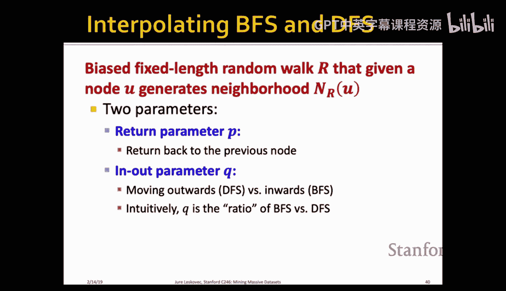
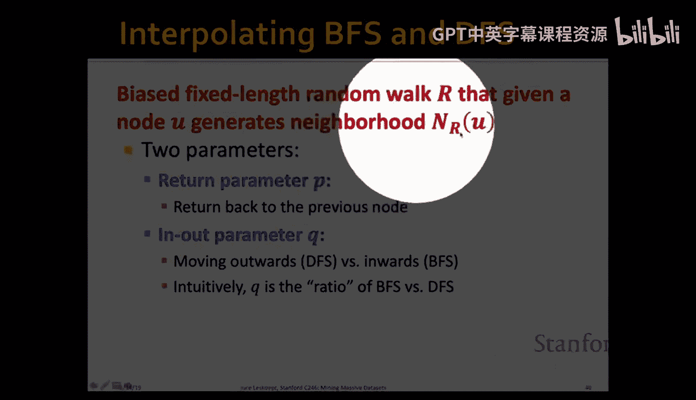
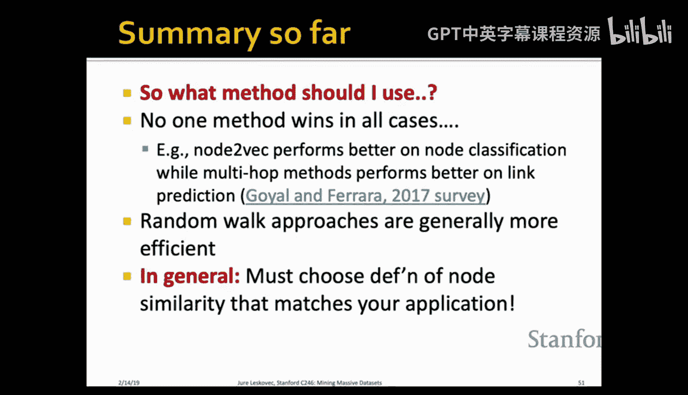
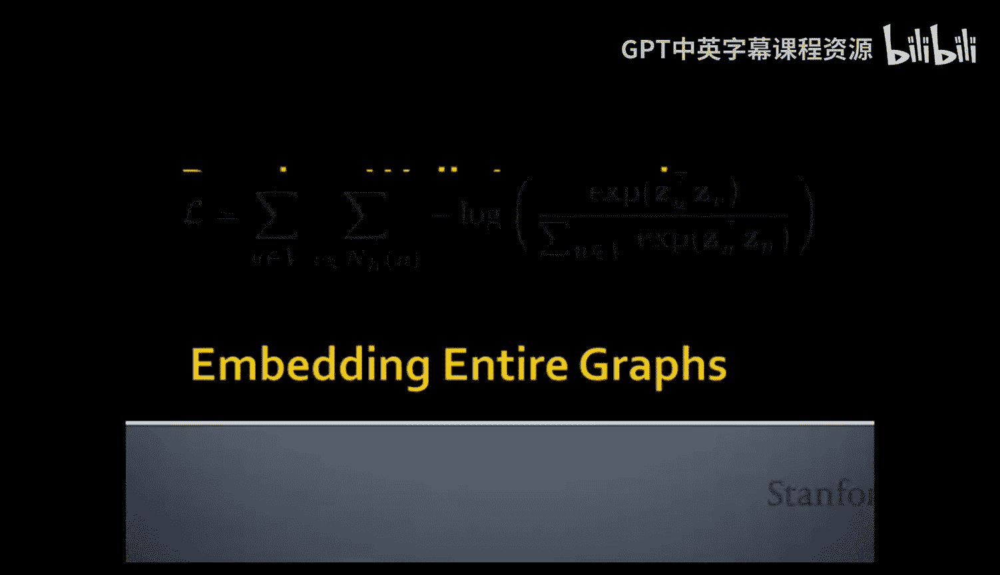
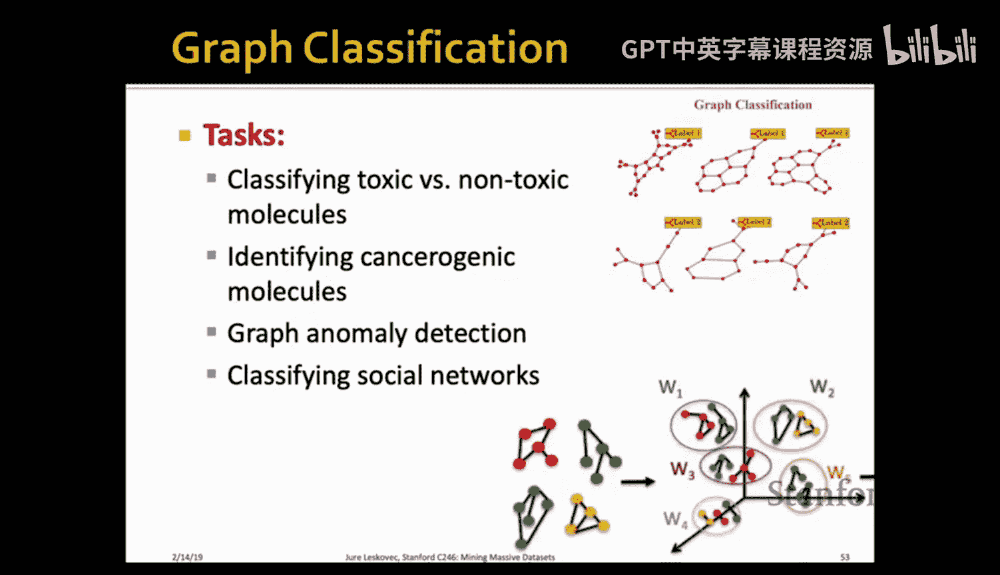
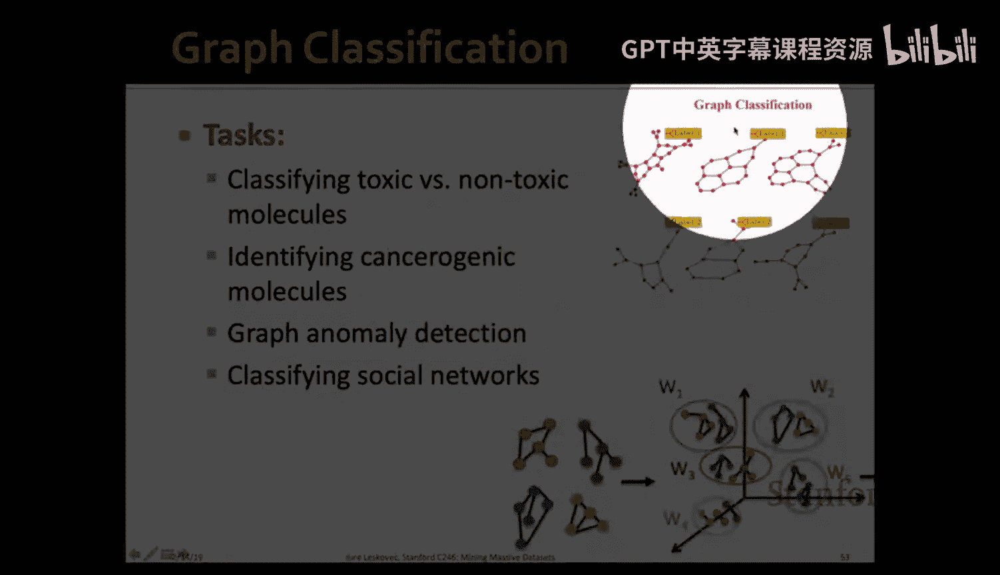
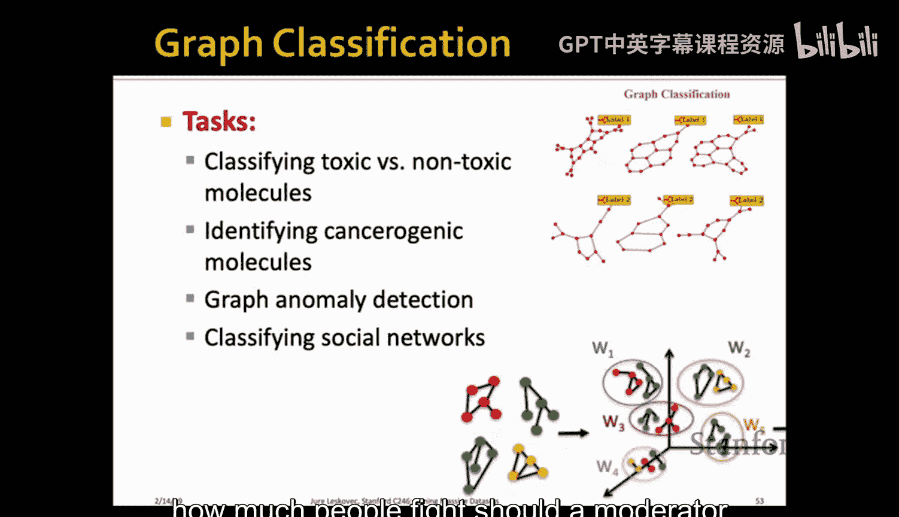

#  012：图表示学习 🧠

在本节课中，我们将要学习如何为图中的节点计算坐标表示，以便后续执行各种任务，如链接预测和节点分类。我们将探讨如何自动学习网络的结构特征，从而避免繁琐的手工特征工程。

---

## 概述 📋

图表示学习的核心目标是将图中的每个节点映射到一个低维向量空间中。这些向量（或称为嵌入）应能捕捉节点在网络中的结构信息，使得网络中结构相似的节点在嵌入空间中也彼此接近。一旦获得这些嵌入，我们就可以轻松地在其上应用各种机器学习算法。

---

## 图表示学习的目标 🎯

我们的目标是学习一个编码器函数，该函数将每个节点映射到一个低维向量。我们希望嵌入空间中的节点相似性（例如点积）能够近似原始网络中的节点相似性。

**核心公式**：
设编码器函数为 `ENC(v) = z_v`，其中 `z_v` 是节点 `v` 的 `d` 维嵌入向量。我们希望：
`sim(u, v) ≈ z_u · z_v`
这里，`sim(u, v)` 是原始网络中节点 `u` 和 `v` 的相似度。

---

## 定义节点相似性 🔗

上一节我们介绍了学习节点嵌入的目标，本节中我们来看看如何定义节点在原始网络中的相似性。一个关键且灵活的方法是使用**随机游走**。

我们定义节点相似性为：节点 `v` 在从节点 `u` 开始的随机游走中被访问到的概率。换句话说，如果两个节点经常在短随机游走中共同出现，那么它们就是相似的。

**核心思想**：
通过优化嵌入向量，使得点积 `z_u · z_v` 能够编码随机游走的共现概率 `P(v | u)`。

---

## 优化问题与损失函数 ⚙️

基于上述思想，我们可以将学习嵌入表示构建为一个优化问题。我们希望最大化从节点嵌入预测其网络邻居的可能性。

**损失函数**：
`L = -∑_{u ∈ V} ∑_{v ∈ N_R(u)} log P(v | z_u)`
其中，`N_R(u)` 是通过随机游走策略 `R` 定义的节点 `u` 的邻居集合。

为了计算概率 `P(v | z_u)`，我们使用 **softmax** 函数：
`P(v | z_u) = exp(z_u · z_v) / ∑_{n ∈ V} exp(z_u · z_n)`

---

## 负采样：提升计算效率 🚀

直接计算上述损失函数非常耗时，因为 softmax 分母需要对图中所有节点求和。为了解决这个问题，我们引入 **负采样** 技术。

负采样通过用一组随机采样的“负”节点来近似整个求和项，从而将计算复杂度从 `O(|V|^2)` 降低到 `O(|V|)`。

**近似公式**：
`log P(v | z_u) ≈ log σ(z_u · z_v) + ∑_{i=1}^{K} E_{n_i ~ P_n} [log σ(-z_u · z_{n_i})]`
其中，`σ` 是 sigmoid 函数，`K` 是负样本数量，`P_n` 是节点的采样分布（通常与节点度成正比）。

以下是负采样的关键步骤：
1.  为每个正样本（即出现在邻居中的节点对 `(u, v)`）采样 `K` 个负样本节点。
2.  负样本节点通常从整个图的节点分布中采样，且偏向于高频（高连接度）节点。
3.  通过这种方式，模型在拉近正样本对的同时，推远随机负样本对。

---

## DeepWalk 算法 🚶‍♂️

基于随机游走和负采样的思想，我们得到了 **DeepWalk** 算法。该算法可以看作是词向量模型 Word2Vec 在图结构数据上的直接应用。

以下是 DeepWalk 的主要步骤：
1.  对图中的每个节点，执行固定长度的短随机游走多次，生成节点序列（相当于文本中的“句子”）。
2.  将这些序列作为输入，使用 Skip-gram 模型（即给定中心词预测上下文词）来学习节点嵌入。
3.  在训练 Skip-gram 模型时，使用负采样来优化计算效率。

---

## Node2Vec：更灵活的随机游走 🔄

上一节我们介绍了基础的 DeepWalk 算法，本节中我们来看看它的一个强大扩展——**Node2Vec**。Node2Vec 通过引入有偏的随机游走策略，提供了在 **广度优先搜索（BFS）** 和 **深度优先搜索（DFS）** 之间进行权衡的能力，从而学习到更丰富、更具任务相关性的嵌入表示。

Node2Vec 的随机游走由两个参数控制：
*   **返回参数 `p`**：控制游走返回上一个节点的概率。较小的 `p` 值会增加回溯，使游走更局部化（类似 BFS）。
*   **进出参数 `q`**：控制游走向外探索的概率。较小的 `q` 值会使游走更倾向于探索远离起点的节点（类似 DFS）。

**游走概率公式**：
假设随机游走刚从节点 `t` 走到节点 `v`，现在需要决定下一个节点 `x`。设 `d_{tx}` 为节点 `t` 到 `x` 的最短路径距离（对于当前节点 `v` 的邻居，`d_{tx}` 只能是 0， 1 或 2）。到下一个节点 `x` 的未归一化转移概率为：
*   如果 `d_{tx} = 0`（回到 `t`），概率权重为 `1/p`
*   如果 `d_{tx} = 1`（与 `t` 距离相同），概率权重为 `1`
*   如果 `d_{tx} = 2`（远离 `t`），概率权重为 `1/q`

通过调整 `p` 和 `q`，我们可以让模型学习到侧重于网络局部微观结构（`p` 小，`q` 大）或全局宏观社区结构（`p` 大，`q` 小）的嵌入。

---

## 嵌入的应用 🛠️

一旦我们获得了节点的低维嵌入向量，就可以将其用于各种下游任务。

以下是几个主要的应用方向：
*   **节点分类**：将节点的嵌入向量 `z_v` 作为特征，输入到一个分类器（如逻辑回归、神经网络）中，预测节点的标签。
*   **链接预测**：给定一对节点 `(u, v)`，通过一个函数 `f(z_u, z_v)`（如点积、连接后通过神经网络）来预测它们之间是否存在边。
*   **图聚类**：对节点的嵌入向量进行聚类（如 K-Means），从而发现图中的社区结构。
*   **图分类**：为了对整个图进行分类（例如判断分子图的毒性），可以简单地将图中所有节点的嵌入向量求和或平均，得到图的整体表示，再用于分类。

---

## 总结 📝

本节课中我们一起学习了图表示学习的基本原理和方法。我们从学习节点嵌入的目标出发，探讨了如何利用随机游走定义节点相似性，并构建了相应的优化问题。为了高效求解，我们引入了负采样技术。在此基础上，我们介绍了 DeepWalk 和 Node2Vec 两种经典算法，其中 Node2Vec 通过有偏随机游走在 BFS 和 DFS 之间取得平衡，能够学习到更灵活的嵌入表示。最后，我们了解了这些嵌入向量在节点分类、链接预测和图分类等任务中的广泛应用。图表示学习是一个活跃的研究领域，这些基础方法为处理复杂的网络数据提供了强大的工具。