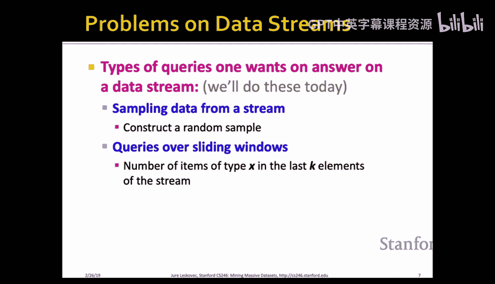
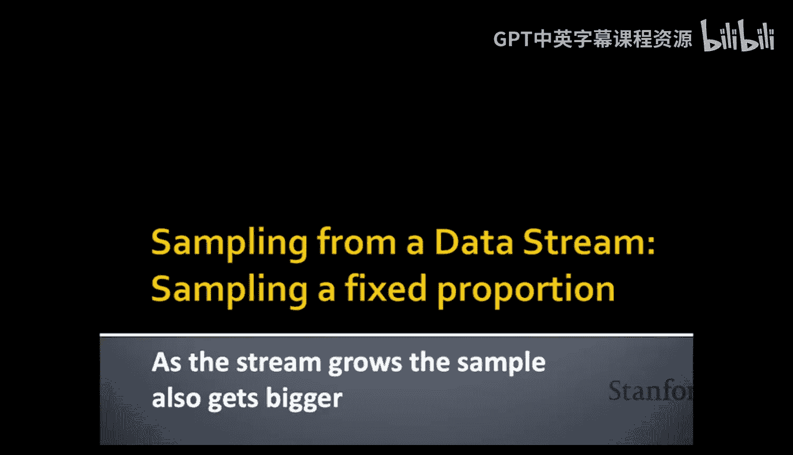
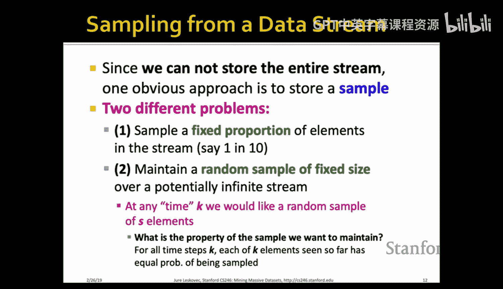

#  015：数据流挖掘 I

在本节课中，我们将要学习如何处理无限的数据流。我们将探讨当数据以流的形式持续到达，且无法全部存储时，如何通过构建数据摘要来回答关键查询。具体来说，我们将学习如何从数据流中进行采样，以及如何回答关于滑动窗口的查询。

---

## 数据流简介

上一节我们介绍了课程的整体脉络。本节中我们来看看数据流这一特殊场景。

数据流管理指的是数据随着时间推移在线到达的情况。在许多实际应用中，输入数据是无限的。例如，社交媒体网站上的帖子是实时生成的，你永远不会有一个完整的帖子数据集。搜索引擎接收的查询也是一个接一个到来的流，你永远不会拥有所有查询的完整集合。

这意味着我们可以将数据视为无限且非平稳的，其分布会随时间变化。这正是其有趣且需要专门算法的原因。数据是无限的，你永远无法看到其全部内容。

处理这类问题的核心在于，输入元素以高速率到达，并且你无法存储所有到达的数据。因此，关键问题变成了：如何在有限的内存下进行关键计算和回答查询？这类算法的诀窍始终在于如何保存或构建数据的某种关键摘要，以便无需保存迄今为止看到的所有数据就能回答查询。

一个相关的概念是在线算法。例如，随机梯度下降在某种意义上就是一种流式算法。在机器学习中，我们称之为在线学习，它允许我们在新数据到达时实时更新模型。算法能够适应数据的变化，其方式是对模型进行小的增量更新。

---

## 流处理模型与查询类型

以下是流处理的基本模型：

*   数据流进入流处理器。
*   处理器拥有有限的工作存储空间，可能还有一些归档存储。
*   查询会不断到来，我们需要能够回答这些查询。

我们将讨论可以回答哪些类型的查询，以及使用哪些算法来回答。

今天我们将讨论两种类型的查询：

1.  从数据流中采样。
2.  回答关于滑动窗口的查询。

对于滑动窗口查询，我们可能想问：“在流的最后 K 个元素中，有多少个是类型 X 的？”如果有大量存储空间，这很容易，只需保存最后 K 个元素并计数即可。但我们不希望这样做。同样，构建流的随机样本时，一种方法是保存整个流再采样，但随着流变长，需要保存的数据也越多，这也不可取。

在周四的课程中，我们将讨论：
*   过滤数据流（选择具有属性 X 的元素）。
*   估计流中不同元素的数量。
*   估计流的矩（如平均值、标准差）。
*   寻找流中的频繁项集。

---

## 流处理的应用

流处理有很多应用场景：

*   **网络搜索查询**：例如，谷歌想知道哪些查询今天比昨天更频繁。
*   **点击流**：分析网站上的用户点击行为。
*   **社交媒体新闻流**：识别 Twitter、Facebook 上的热门话题。
*   **传感器网络**：传感器实时感知环境数据，需要总结和分析，以触发警报等。
*   **电话呼叫记录**：识别特定用户的所有呼叫，或将呼叫记录归到相应的人。
*   **网络数据包监控**：交换机监控经过的数据包，收集最优路由信息，检测拒绝服务攻击等。

---

## 从数据流中采样

### 采样固定比例

首先，我们讨论如何从数据流中采样固定比例的元素。随着流变大，样本也会相应变大。

一种简单的策略是：对于每个到达的元素，以概率 `p`（例如 `p = 0.1`）决定是否保存它，否则丢弃。这可以通过生成一个随机数来实现。

**但必须注意**：采样方式取决于你想要回答的问题。考虑以下场景：一个搜索引擎希望回答“用户在同一天内重复发出相同查询的频率是多少？”。

假设每个用户一天发出 `x` 个唯一查询（各一次）和 `d` 个重复查询（各两次）。那么：
*   总查询数：`x + 2d`
*   唯一查询数：`x + d`
*   重复查询的比例应为：`d / (x + d)`

如果采用前述的简单随机采样（以 10% 的概率保存每个查询实例），会出现问题：
*   单次查询被采样的概率是 `0.1`，所以样本中约有 `x/10` 个单次查询。
*   一个重复查询（两次）**同时**被采样的概率是 `0.1 * 0.1 = 0.01`，所以样本中约有 `d/100` 个重复查询。

如果我们直接在样本中计算重复查询的比例，会得到 `(d/100) / (x/10 + d/100) = d/(10x + d)`，这与真实的 `d/(x+d)` 不符，导致了错误估计。

**正确的采样方式**：这个问题本质上是关于“每个用户”的。因此，我们应该对用户进行采样，而不是对查询实例进行采样。例如，使用哈希函数将用户 ID 均匀哈希到 10 个桶中，只保存哈希到第一个桶的用户的**所有**查询。这样，对于被采样的用户，我们可以准确计算其重复查询比例，然后进行平均，从而得到对整体用户群体的无偏估计。

**一般方法**：要对数据流进行 `a/b` 比例的采样，可以对每个元素的键（key）应用一个哈希函数，将其均匀哈希到 `b` 个桶中。如果哈希值落在前 `a` 个桶，则保存该元素。例如，要获得 30% 的样本，可以哈希到 10 个桶，并保存哈希值落在前 3 个桶的元素。

---

### 采样固定大小：蓄水池采样

现在，我们讨论一个更有趣的问题：如何在潜在的无限流上维持一个固定大小的随机样本。

我们希望在任何时刻 `k`，都拥有一个包含 `S` 个元素的样本，并且要求：在迄今为止看到的 `k` 个元素中，每个元素出现在样本中的概率都相等，即 `S / k`。随着 `k` 增长，这个概率会减小，但样本大小 `S` 保持不变。

**蓄水池采样算法**步骤如下：

1.  将流的前 `S` 个元素直接放入样本中。
2.  对于第 `n` 个到达的元素（`n > S`）：
    *   以概率 `S / n` 决定保留这个新元素。
    *   如果决定保留，则从当前样本中**随机移除**一个现有元素，并将新元素放入样本。
    *   如果决定不保留，则样本保持不变。

**算法正确性证明（归纳法）**：
*   **基础情况**：当 `n = S` 时，所有 `S` 个元素都在样本中，概率为 `S/S = 1`，成立。
*   **归纳假设**：假设在处理完 `n` 个元素后，每个元素在样本中的概率为 `S/n`。
*   **归纳步骤**：考虑第 `n+1` 个元素到达。
    *   对于前 `n` 个元素中的某一个，它要继续留在样本中，有两种情况：
        1.  新元素被丢弃（概率 `1 - S/(n+1)`）。
        2.  新元素被保留（概率 `S/(n+1)`），但该旧元素**没有被**选为被替换的元素（概率 `(S-1)/S`）。
    *   因此，一个旧元素留在样本中的概率是：
        `[1 - S/(n+1)] + [S/(n+1) * (S-1)/S] = n/(n+1)`
    *   根据归纳假设，该元素之前就在样本中的概率是 `S/n`。所以，在处理完 `n+1` 个元素后，它仍在样本中的概率是：
        `(S/n) * (n/(n+1)) = S/(n+1)`
    *   对于新到达的第 `n+1` 个元素，它进入样本的概率显然是 `S/(n+1)`。
*   因此，在处理完 `n+1` 个元素后，所有 `n+1` 个元素出现在样本中的概率都等于 `S/(n+1)`。归纳成立。

---

## 回答滑动窗口查询

### 问题定义

现在，我们讨论如何回答关于长滑动窗口的查询。假设我们有一个数据流，只对最近的 `N` 个元素（窗口）感兴趣。`N` 非常大，以至于无法将最后 `N` 个元素全部存入内存。

例如，在亚马逊上，每个商品可以看作一个流：一次交易中若售出该商品则发出 `1`，否则发出 `0`。我们想回答：“在最近 `N` 次交易中，商品 X 被售出了多少次？”

我们考虑一个更一般化的问题：给定一个由 `0` 和 `1` 组成的流，对于任意 `k`（`1 ≤ k ≤ N`），回答“在最后 `k` 个元素中有多少个 `1`？”。

**我们不希望**的简单方案是：假设流是平稳的，用全局的 `1` 的比例来估计窗口内的数量。这忽略了数据分布可能随时间变化的事实。

---

### DGIM 算法

我们将介绍 **DGIM 算法**，它不假设数据均匀分布，并且能在 `O(log² N)` 的存储空间内给出估计值，其误差最多为 50%（可调整）。

**核心思想**：用指数增长的“桶”来汇总流的历史信息，但这里“桶的大小”定义为桶内 `1` 的数量，而不是时间长度。

**桶的定义与规则**：
*   每个桶记录其结束时间戳（模 `N` 以节省空间）和桶内 `1` 的数量。
*   桶内 `1` 的数量必须是 2 的幂次（如 1, 2, 4, 8...）。
*   对于每个 2 的幂次 `2^i`，我们最多只允许有 1 个或 2 个桶。
*   桶按结束时间排序，更晚的桶（更近的数据）更大。
*   桶的时间范围不重叠（可以紧邻）。
*   当一个桶的结束时间超出当前窗口范围（即早于 `N` 个时间单位以前）时，丢弃该桶。

**更新过程（新元素到达）**：
1.  **检查丢弃**：如果最早（最老）的桶已超出窗口，则丢弃它。
2.  **处理新元素**：
    *   如果新元素是 `0`，无需任何操作。
    *   如果新元素是 `1`：
        a. 创建一个新的桶，大小为 1，结束时间为当前时间。
        b. 检查是否违反了“每个尺寸最多 2 个桶”的规则。如果某个尺寸的桶变成了 3 个，则将**最早（时间最老）**的两个该尺寸的桶合并为一个两倍大小的桶（大小相加，结束时间为较晚的那个桶的结束时间）。
        c. 合并可能引发连锁反应，需要持续检查并合并，直到所有尺寸的桶数量都不超过 2。

**查询过程**：
当查询“最后 `k` 个元素中有多少个 `1`？”时：
1.  找到所有结束时间在最近 `k` 个时间单位内的桶。
2.  除了最后一个（时间上最早，可能只有部分在窗口内）桶，将其它所有桶的 `1` 的数量相加。
3.  加上最后一个桶的 `1` 的数量的一半。
4.  这个总和就是我们的估计值。

**误差分析**：
*   设最后一个（部分覆盖窗口的）桶的大小为 `2^r`。
*   我们只加了它的一半，即 `2^{r-1}`，因此最大可能误差就是 `2^{r-1}`。
*   由于桶的大小是 2 的幂次，且对于每个更小的尺寸 `2^0, 2^1, ..., 2^{r-1}` 都至少有一个完整的桶在窗口内，这些桶的总和至少为 `1 + 2 + 4 + ... + 2^{r-1} = 2^r - 1`。
*   因此，真实值至少为 `(2^r - 1) + 至少半个最后桶 ≈ 2^r`。我们的误差 `2^{r-1}` 最多是真实值的 50%。

**降低误差**：
可以通过允许每个尺寸有更多桶来降低误差。如果允许每个尺寸最多有 `R` 个桶，则误差上界可以降至 `1/R`。当然，这需要更多的存储空间 (`O(R * log² N)`)。

---

### 扩展

1.  **查询任意 `k ≤ N`**：DGIM 算法天然支持。查询时，只需考虑结束时间在最近 `k` 个时间单位内的桶，并应用相同的规则（全加最后一个桶之前的所有桶，再加最后一个桶的一半）。
2.  **处理整数流求和**：假设流中的元素是非负整数，我们想求最后 `k` 个元素的和。
    *   **方法一（位分解）**：将每个整数的二进制表示的每一位看作一个独立的 `0/1` 流。对每一位运行 DGIM 算法来估计该位在窗口内为 `1` 的次数。则总和 = Σ(第 `i` 位为1的次数 * `2^i`)。
    *   **方法二（扩展桶定义）**：重新定义“桶的大小”为桶内元素值的和。要求桶内元素和不超过 `2^b`（`b` 是桶的尺寸指数）。更新和合并规则需要相应调整，确保合并后桶的和不超过下一个尺寸的界限。查询方式类似。

---

## 总结

本节课中我们一起学习了数据流挖掘的基础内容：

1.  **数据流采样**：
    *   **固定比例采样**：需根据查询目标谨慎选择采样的键（如按用户采样而非按事件采样），常用哈希法实现。
    *   **固定大小采样**：使用**蓄水池采样**算法，能在无限流上维持一个等概率的固定大小随机样本。

2.  **滑动窗口查询**：
    *   使用 **DGIM 算法** 估计二进制流滑动窗口中 `1` 的数量。
    *   核心是维护一组遵循特定规则（指数大小、数量限制）的桶来摘要历史数据。
    *   该算法能以 `O(log² N)` 的空间提供误差有界的估计，并可通过参数调整误差。
    *   算法可扩展以支持查询任意窗口大小 `k`，以及处理整数流求和问题。

这些技术是处理高速、无限数据流的基础，使我们能够在有限的内存资源下进行有效的监控和分析。