#  016：数据流挖掘 II

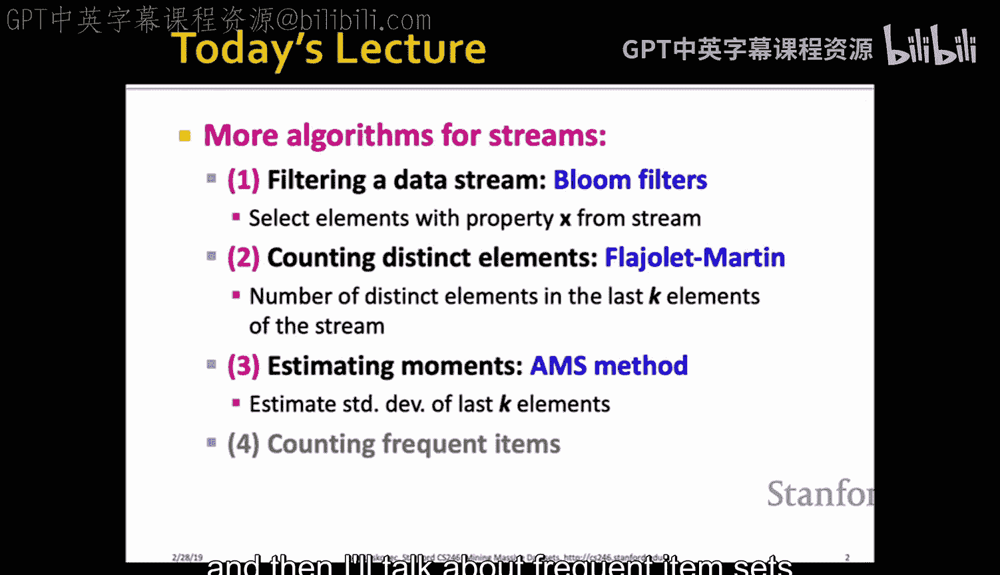

## 概述
在本节课中，我们将继续学习数据流挖掘技术。我们将介绍四种新的方法，用于处理高速、大规模的数据流。这些方法包括布隆过滤器、计数不同元素的Flajolet-Martin算法、估计数据流矩的AMSS方法，以及用于频繁项集计数的指数衰减窗口技术。这些技术都旨在用有限的内存资源，对无限的数据流进行高效的近似计算。

---

## 布隆过滤器：一种高效的流数据过滤方法

上一节我们讨论了数据流的基本概念和计数方法。本节中，我们来看看如何高效地过滤数据流，即只选择具有特定属性X的元素。

抽象地说，我们希望将流中的每个元素视为一个键值对，并给定一个键的集合S。我们需要判断流中的元素是否在集合S中。一个显而易见的解决方案是使用哈希表存储S中的所有元素，但当我们无法存储整个哈希表时（例如，需要为百万用户各自维护一个信任邮箱列表），就需要更节省空间的方法。

布隆过滤器提供了一个巧妙的解决方案。其核心思想是使用一个长度为n比特的数组和k个独立的哈希函数。

以下是布隆过滤器的构建与查询过程：

1.  **初始化**：创建一个长度为n的比特数组，所有位初始化为0。
2.  **构建**：对于集合S中的每个元素s，使用k个哈希函数 `h1(s), h2(s), ..., hk(s)` 分别计算哈希值（对应数组中的位置），并将这些位置的值设置为1。
3.  **查询**：当流中元素a到达时，计算其k个哈希值。**仅当这k个位置的值全部为1时**，才输出（或“放行”）元素a；否则，丢弃它。

布隆过滤器保证**没有假阴性**（即，所有在S中的元素都会被放行），但可能存在**假阳性**（即，某些不在S中的元素也可能被放行）。

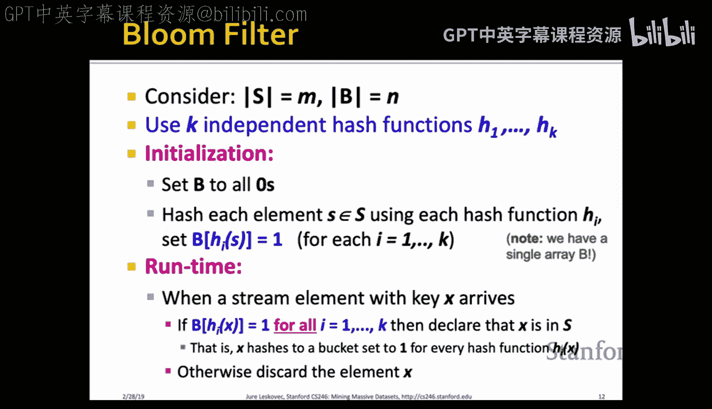

### 假阳性概率分析
假设集合S的大小为m，比特数组长度为n，使用k个哈希函数。经过推导，假阳性的概率近似为：
`(1 - e^(-k*m/n))^k`

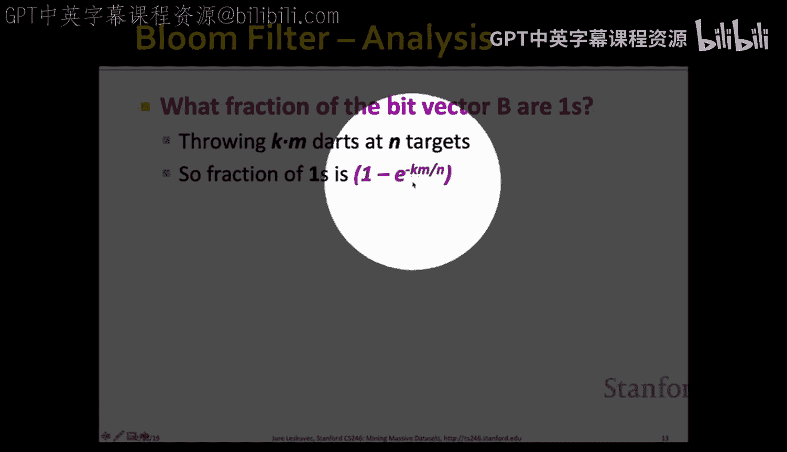

通过选择合适的k值，可以最小化这个错误率。例如，当 m=10亿，n=80亿比特时，最优的k约为6，此时假阳性率可降至约2%。布隆过滤器因其简单、高效且可并行化，被广泛应用于硬件实现和预处理步骤中。

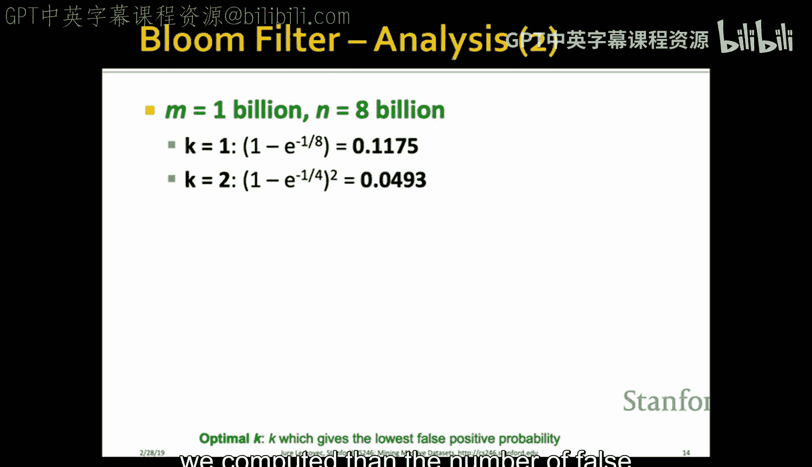

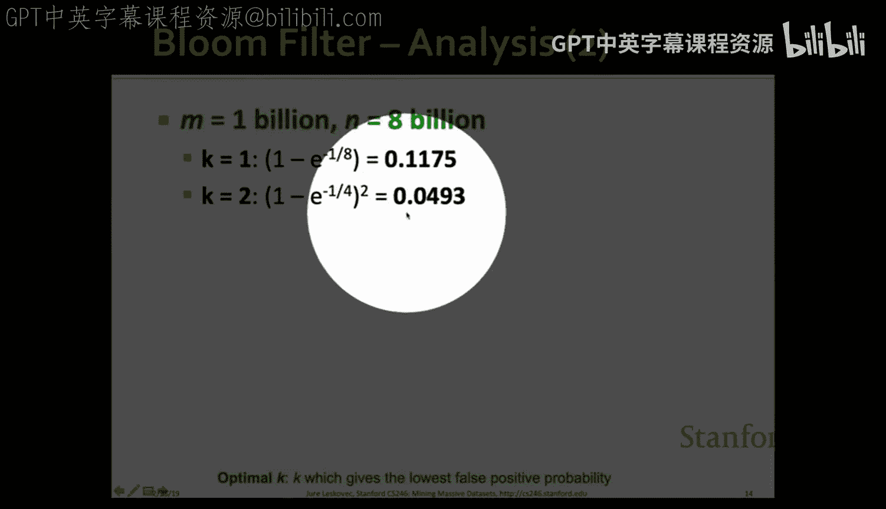

---

## 计数不同元素：Flajolet-Martin算法

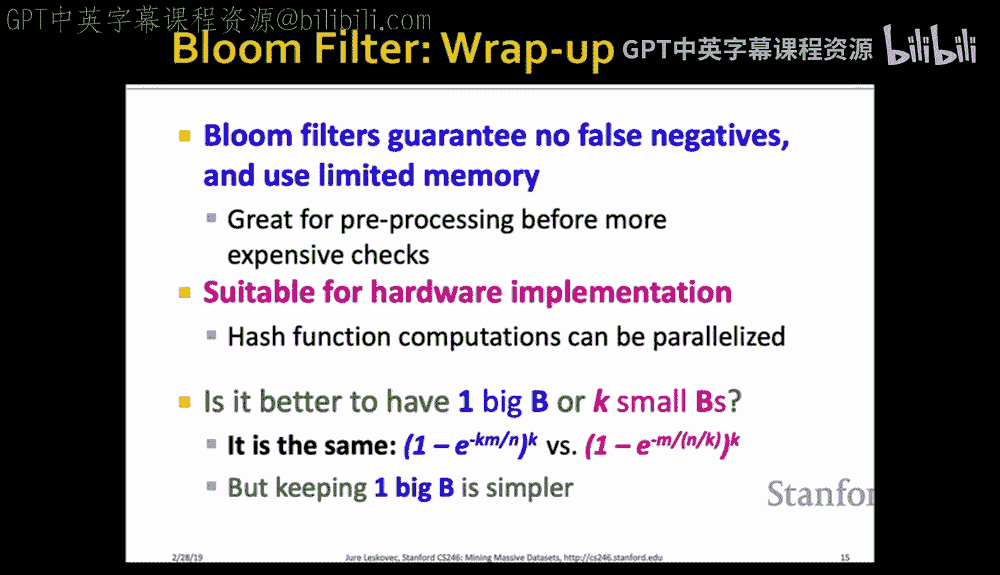

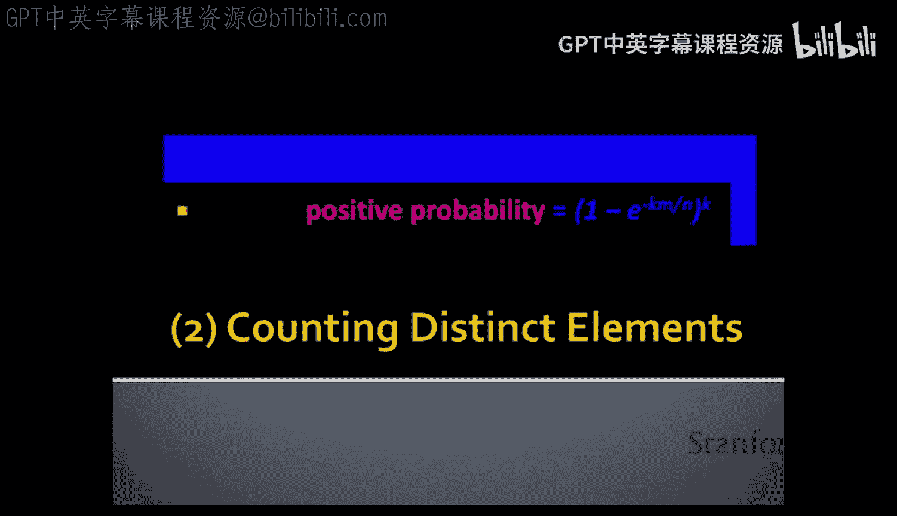

在过滤数据流之后，我们常常需要知道流中出现了多少种不同的元素。例如，统计一周内不同用户访问的独立网页数量。同样，我们无法存储所有已见元素。

Flajolet-Martin算法提供了一种估算不同元素数量的方法。其核心是追踪哈希值二进制表示中末尾零的个数。

算法步骤如下：

1.  选取一个哈希函数，将元素均匀地映射到 `[0, 2^L - 1]` 范围内的整数。
2.  对于流中每个元素a，计算其哈希值 `h(a)`，并将其表示为二进制。
3.  令 `ρ(a)` 为 `h(a)` 的二进制表示中，从最低位开始连续零的个数（即末尾零的长度）。
4.  在整个流处理过程中，记录所见到的最大 `ρ(a)` 值，记为 `R`。
5.  估算的不同元素数量为 `2^R`。

### 算法原理
其背后的直觉是：如果哈希函数是均匀的，那么看到一个末尾有r个零的哈希值的概率是 `2^(-r)`。因此，需要看到大约 `2^r` 个不同的元素，才有较大概率观察到这样一个哈希值。所以，观察到的最大 `R` 值可以用来估算不同元素的数量 `2^R`。

为了获得更稳定、更精确的估计，实践中会使用多个哈希函数。将多个哈希函数得到的 `R` 值分组，取每组的中位数，再对这些中位数取平均，作为最终的估计值。

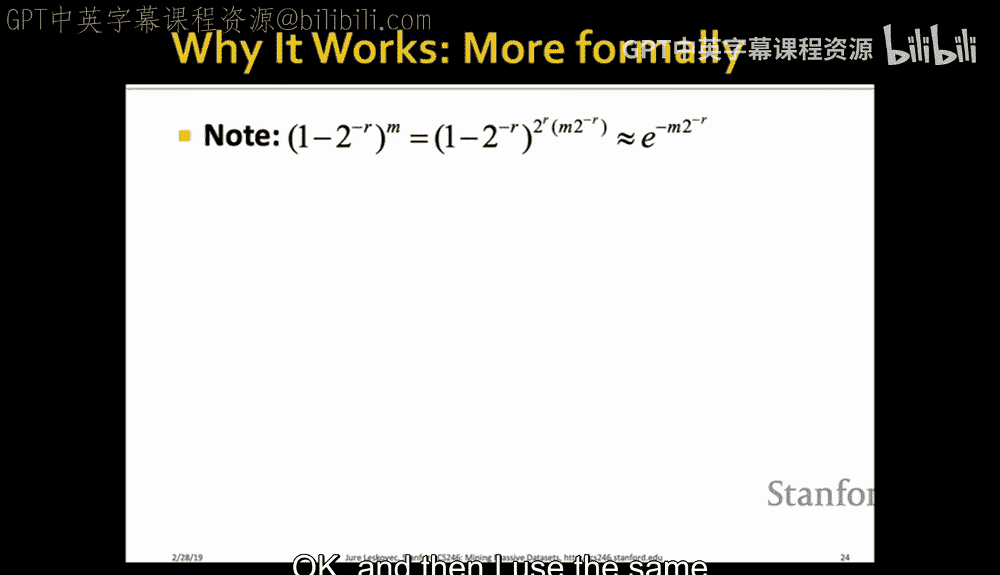

---

## 估计数据流矩：AMSS算法

接下来，我们探讨如何估计数据流的矩（Moments）。设流中元素来自一个全集，`m_i` 表示元素i在流中出现的次数。流的第k阶矩定义为：`∑ (m_i)^k`。

*   **0阶矩**：不同元素的数量（即刚才解决的问题）。
*   **1阶矩**：流的总长度（容易计算）。
*   **2阶矩**：称为“惊奇数”，衡量元素频率分布的均匀程度。分布越不均匀，值越大。

AMSS算法可以在不保存所有元素计数的情况下，无偏地估计流的矩（以2阶矩为例）。

算法思路如下：

1.  假设已知流长度n（后续会处理未知情况）。
2.  随机选择一个起始时间点t（从1到n均匀选择）。
3.  初始化一个随机变量X，记录在时间t出现的元素，比如是元素i。
4.  从时间t开始到流结束，统计元素i出现的次数，记为c。
5.  对于这个随机变量X，其对于2阶矩的估计值为：`f(X) = n * (2c - 1)`。
6.  维护多个这样的随机变量X，最终的估计值是所有 `f(X)` 的平均值。

### 为何有效？
可以证明，`E[f(X)] = ∑ (m_i)^2`，即 `f(X)` 的期望值正是我们想求的2阶矩。其原理在于，当对所有可能的起始时间t的估计值求和时，会形成一个“伸缩和”，最终只剩下各元素计数的平方项。

对于无限流和未知长度n的情况，我们可以结合**蓄水池采样**技术。始终保持k个随机变量X。当新元素到达时，以 `k/(当前流长度)` 的概率决定是否用这个新元素替换掉一个已有的X，并开始新的计数。这样就能保证在任何时刻，每个时间点被选为起始点的概率都是近似相等的。

---

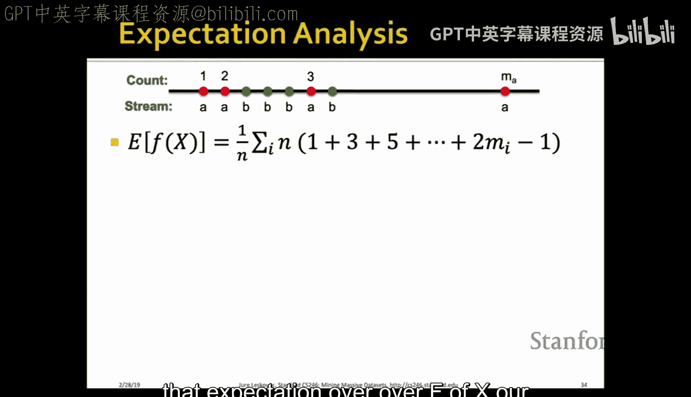

## 频繁项集与指数衰减窗口

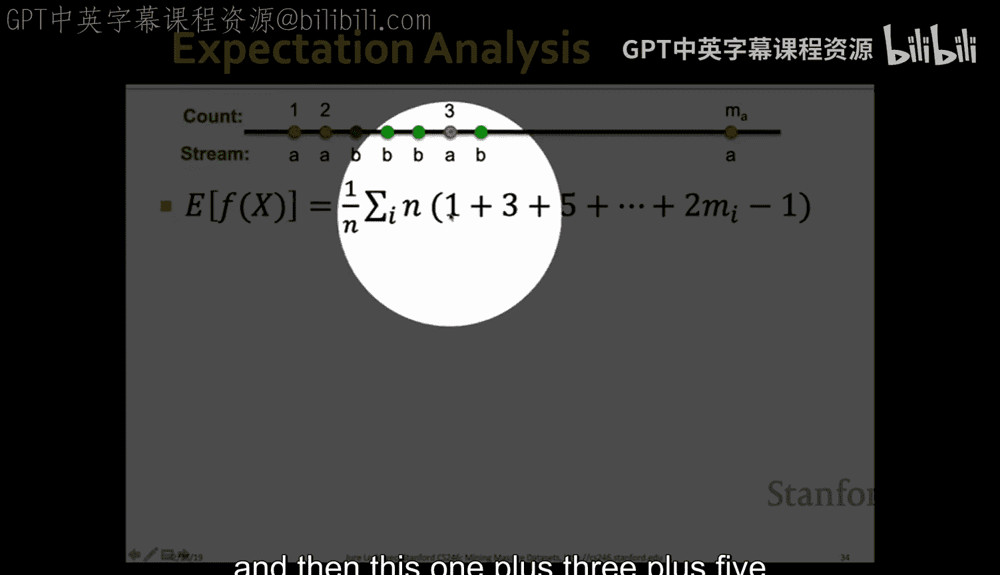

最后，我们讨论如何在流数据中查找频繁项集（如经常一起购买的商品对）。为每个可能的项对维护一个流是不现实的，因为数量是商品数的平方。

指数衰减窗口技术提供了一种优雅的启发式方法。它不固定一个时间窗口，而是让历史数据的影响随时间指数级衰减，从而更强调近期的数据。

其核心操作是为每个监控的项（如商品）维护一个权重。假设衰减因子为常数c（一个接近1的小数，如0.99）。

1.  每到来一个新的时间步，将所有项的当前权重乘以 `(1 - c)`。
2.  如果新到达的篮子中包含某项x，则给x的权重额外加上1。
3.  项x在时刻t的权重可以形式化表示为：`∑_{i=1 to t} (δ_i(x) * (1-c)^{t-i})`，其中 `δ_i(x)` 在时刻i出现x时为1，否则为0。

这样，频繁出现的项会不断获得“加分”而保持较高的权重，而不常出现的项其权重会因持续的衰减而逐渐趋近于零。

### 应用
我们可以设定一个阈值。由于所有权重的总和收敛于 `1/c`，因此只有有限数量的项其权重会超过某个阈值（如 `1/2`）。系统可以只保留那些权重高于阈值的项及其计数，从而在有限内存中动态维护一个“当前最流行项”的列表。这种方法非常适合追踪实时热点，如热门电影、推特上的热门话题等。

---

## 总结
本节课我们一起学习了四种强大的数据流挖掘技术。
1.  **布隆过滤器**：用于成员资格查询，以极小的空间代价换取可控的误报率，且绝无漏报。
2.  **Flajolet-Martin算法**：用于估算数据流中不同元素的数量，基于哈希值末尾零的分布。
3.  **AMSS算法**：用于无偏估计数据流的各阶矩（如二阶矩“惊奇数”），结合了随机采样和巧妙的估计函数。
4.  **指数衰减窗口**：一种用于发现近期频繁模式（如项集）的启发式方法，通过指数衰减强调近期数据，并能自然地在有限内存中维护热点信息。

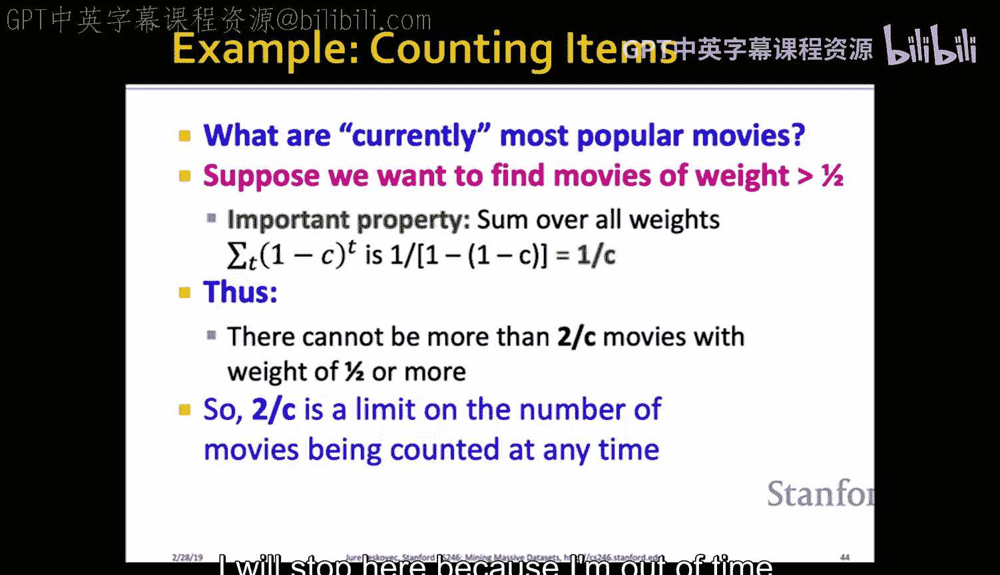

这些方法都是在内存受限条件下，对海量、高速数据流进行实时分析的基石。