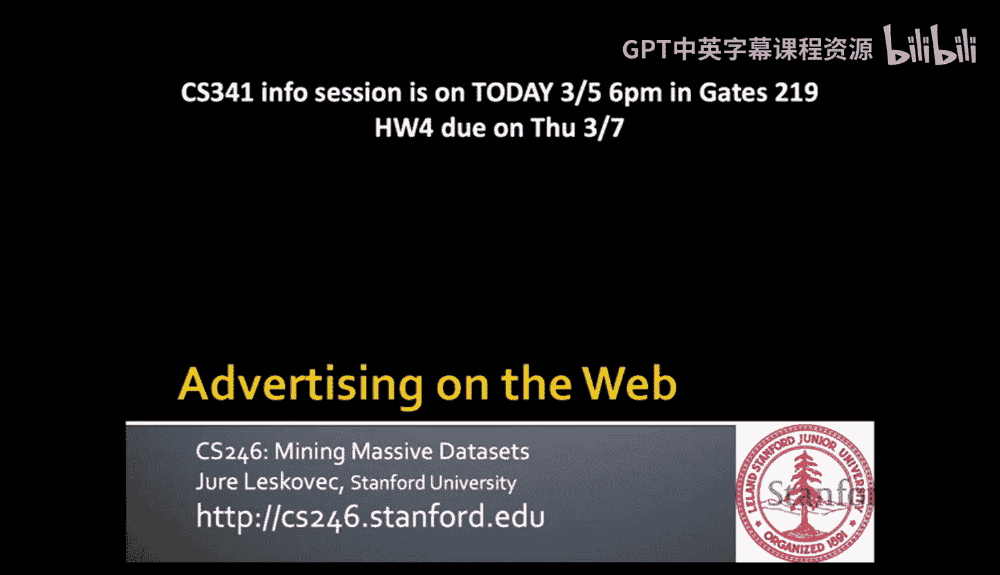
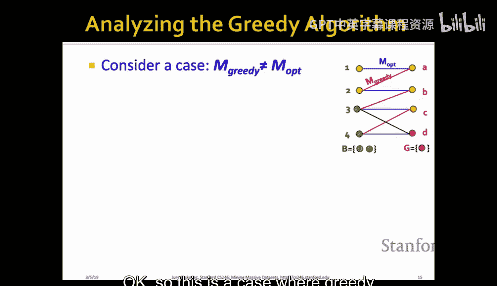
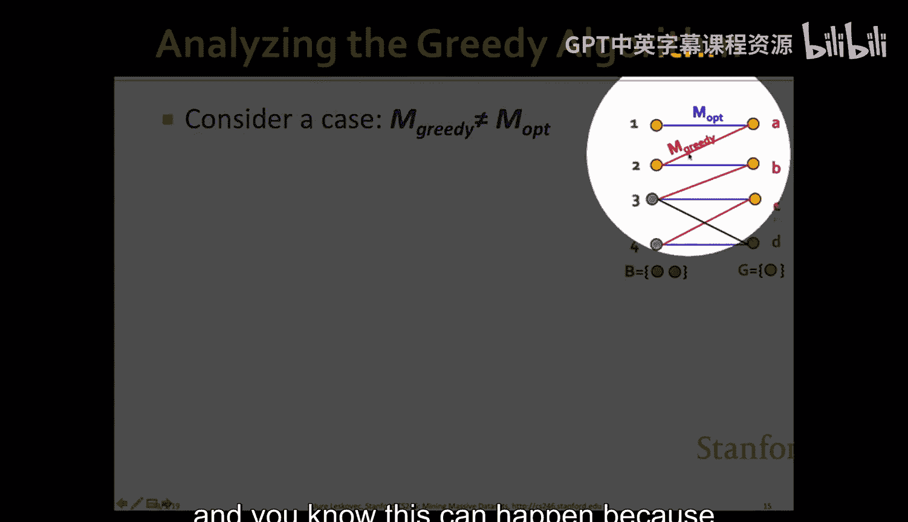
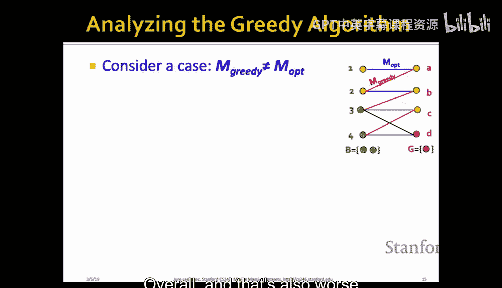
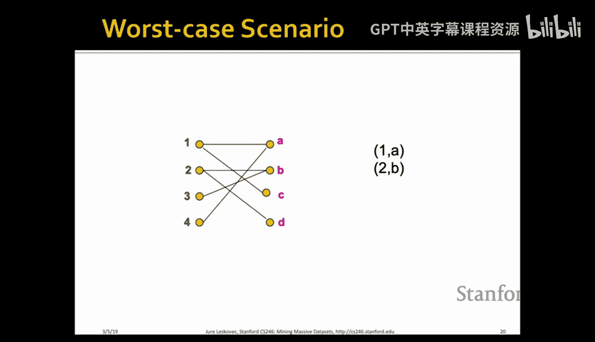
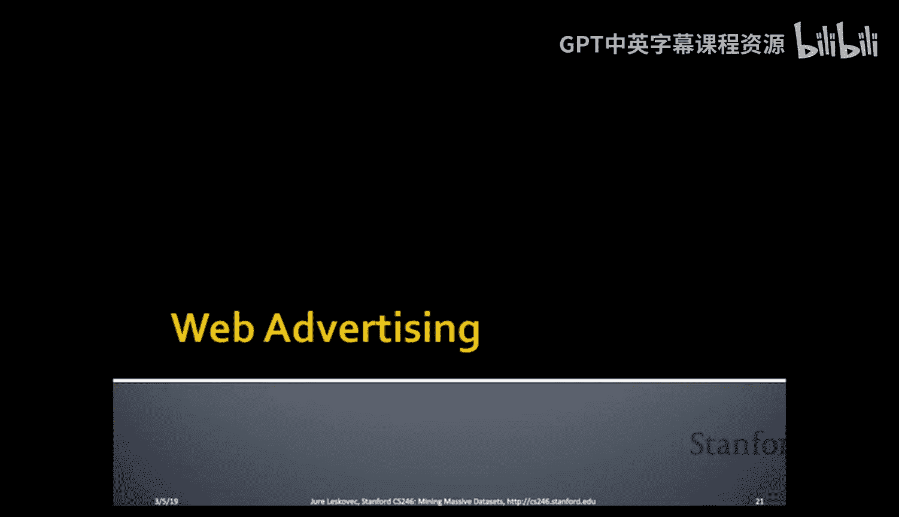
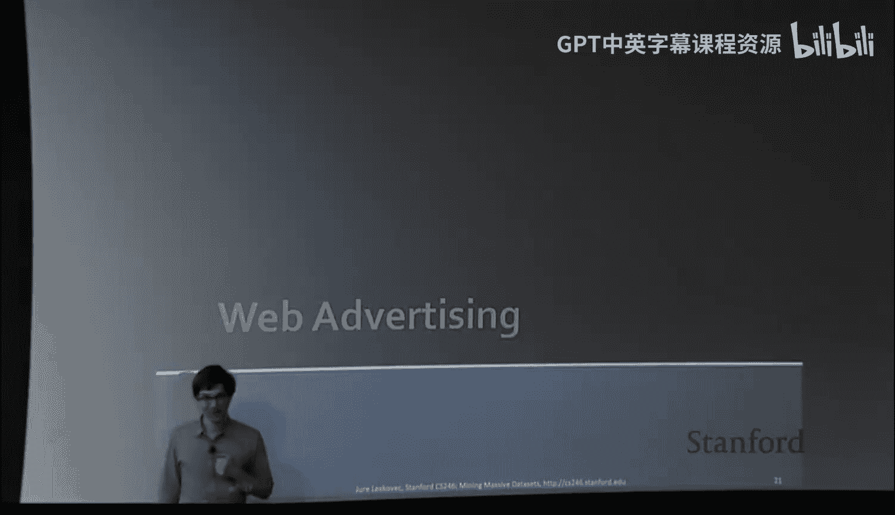
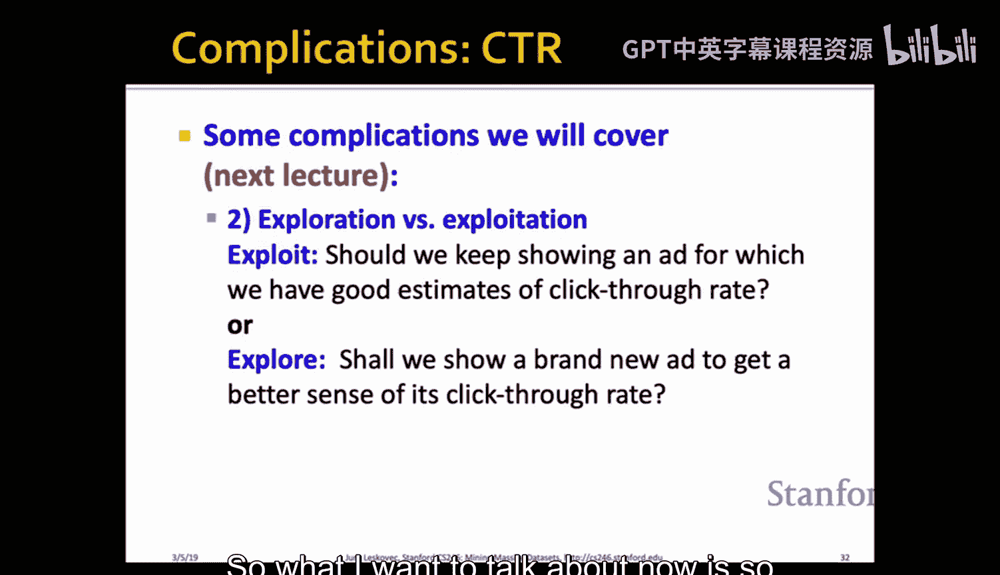
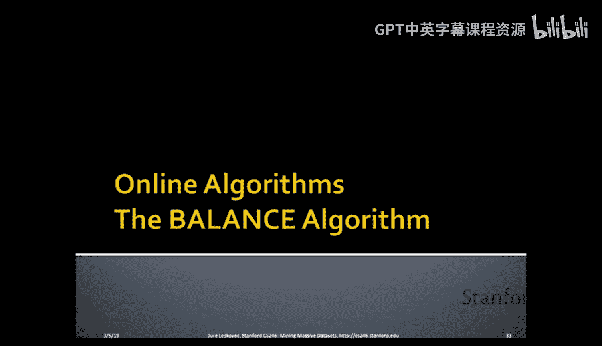
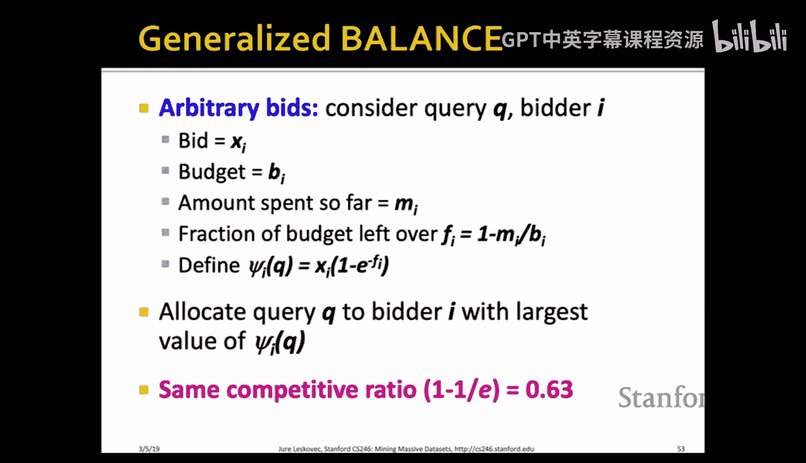

#  017：计算广告

## 概述
在本节课中，我们将学习计算广告的基础知识，特别是如何将广告商与用户或查询进行匹配。我们将从抽象的在线二分图匹配问题入手，分析其算法和性能，然后将其与网络广告的实际问题联系起来，探讨如何设计算法以最大化广告平台的收入。

---

## 在线算法与离线算法

上一节我们介绍了海量数据流处理。网络广告是流算法的一个典型例子，本节我们将探讨与之相关的在线算法。

经典的算法模型是**离线算法**：算法一次性看到所有输入数据，然后计算某个函数并返回答案。

**在线算法**则不同：算法一次只能看到输入的一部分，并且必须立即做出不可撤销的决策。在处理完当前输入并做出决策后，下一个输入才会到达。这与数据流模型非常相似，元素一个接一个地到来，我们必须做出决策。

---

## 广告匹配问题模型

那么，广告模型是怎样的呢？以谷歌为例，它通过填充一个矩阵来赚钱：许多广告商对不同的关键词进行出价。当有人搜索某个关键词时，所有对该关键词出价的广告都有资格展示给该用户。

当然，如果有多个广告商都想为同一个查询展示广告，我们需要选择向该查询展示哪个广告。同时，同一个广告商可能对许多不同的查询感兴趣。

我们可以这样建模：我们有广告商1到K。广告商希望为一组特定的查询或关键词展示广告。每当新用户出现并输入查询时，符合条件的广告商集合就确定了。然后，我们需要决定向该用户展示哪个广告。

例如，用户A输入查询，广告商1和4符合条件。我们决定向用户A展示广告1。接着，新用户B到达并输入不同的查询，广告商2和3对此出价。我们必须从2和3中决定向用户B展示哪个广告。假设我们展示了广告2。然后用户C到达，只有广告商1对其查询感兴趣。但由于广告商1的预算可能已经用完，我们无法向用户C展示广告。用户D到达，只有广告商3出价，并且预算充足，我们就可以向用户D展示广告3。

这本质上是一个**图匹配问题**：我们有一个二分图，试图将左侧节点（广告商）与右侧节点（用户/查询机会）进行匹配。左侧节点只能匹配一个右侧节点。

这是一个**在线问题**，因为我们必须根据图逐步揭示的信息（即用户按什么顺序到达、提出什么查询）来实时决定将哪个广告商与哪个用户匹配。一旦我们向某个用户展示了广告，就不能再将同一个广告展示给其他用户。广告商提前到来，并声明他们希望出价的查询集合以及预算金额。

---

## 在线二分图匹配问题

现在，我们来谈谈这种抽象的在线二分图匹配问题。首先在抽象层面讨论问题，然后再将其与匹配广告商和用户的问题联系起来。

**例子**：我们有一个二分图，左侧是男孩，右侧是女孩。图中的边表示偏好。目标是匹配男孩和女孩，以满足尽可能多的偏好。

每个男孩最多匹配一个女孩，每个女孩也最多匹配一个男孩。以下是一个匹配示例，其**基数**（匹配对数）为3。

实际上，可能存在**完美匹配**：每个男孩和每个女孩都能根据偏好成功匹配。完美匹配总是**最大匹配**，但最大匹配不一定是完美匹配（例如，存在一个没有任何偏好的孤独男孩）。

**问题**：如何为给定的二分图找到匹配（最大匹配或完美匹配）？存在基于增广路径思想的Hopcroft-Karp多项式时间离线算法。但该算法假设提前知道整个图。

我们的目标不是提前知道整个图。**在线图匹配问题**是：我们提前知道一组男孩（例如服务器），在每一轮中，一个女孩（例如任务）的偏好会被揭示。此时，我们有两个选择：要么将女孩与她有偏好的某个男孩配对，要么不配对。如果我们配对，那个男孩就被“占用”了。

**实际例子**：将任务分配给服务器。任务一个接一个到达，每个任务声明它可以在哪些服务器上运行（偏好集）。我们必须决定是将任务调度到某个服务器，还是让任务等待。

---

## 贪心在线匹配算法

现在让我们定义一个算法来解决这个在线匹配问题。

我们将采用一种**贪心在线算法**：在新的女孩节点到达时，如果在她偏好的男孩中至少有一个是未匹配的，我们就将她与其中一个未匹配的男孩匹配。如果没有符合条件的未匹配男孩，我们就无法匹配这个女孩，继续处理下一个。

**问题**：这个贪心算法有多好？

我们使用**竞争比**来衡量算法的好坏。竞争比定义为，对于所有可能的输入序列，贪心算法产生的匹配基数 `|M_greedy|` 与最优离线算法产生的匹配基数 `|M_opt|` 之比的最小值。

**公式**：
`竞争比 = min_{所有输入I} ( |M_greedy(I)| / |M_opt(I)| )`

这衡量了贪心算法在最坏情况下能达到最优解的比例。

---

## 贪心算法的竞争比分析

让我们分析贪心算法的竞争比。考虑贪心算法不能给出最优解的情况。

**定义**：
*   `G`：在最优匹配中被匹配，但在贪心匹配中未被匹配的女孩集合。
*   `B`：与 `G` 中女孩相邻的男孩集合。

根据定义，我们可以得到以下不等式：
1.  `|M_opt| ≤ |M_greedy| + |G|` （最优匹配大小不超过贪心匹配大小加上未被贪心匹配的女孩数）。
2.  集合 `B` 中的每个男孩都必须在贪心匹配中被匹配了（否则，如果存在未匹配的男孩与 `G` 中某个女孩相邻，贪心算法本可以匹配他们，产生矛盾）。因此，`|M_greedy| ≥ |B|`。
3.  在最优解中，`G` 中的所有女孩都必须匹配到 `B` 中的某个男孩。因此，`|G| ≤ |B|`。

结合不等式2和3，我们得到：`|G| ≤ |B| ≤ |M_greedy|`。

现在，结合不等式1和这个关系，在最坏情况下，`|G|` 和 `|B|` 都等于 `|M_greedy|`。代入不等式1：
`|M_opt| ≤ |M_greedy| + |G| = |M_greedy| + |M_greedy| = 2|M_greedy|`

这意味着：
`|M_greedy| / |M_opt| ≥ 1/2`

因此，**贪心算法的竞争比是 1/2**。在最坏情况下，它能达到最优解50%的效果。

**最坏情况示例**：当第一批到达的女孩节点，我们做出了“错误”的匹配决定，消耗了本应在后期用于匹配其他女孩的男孩资源，导致后期无法进行更多匹配。

---

## 网络广告简史与模型

现在，让我们将话题转回网络广告，并将其与在线图匹配问题联系起来。

网络广告的早期形式是**横幅广告**，采用 **CPM** 模式，即按千次展示付费。广告商为广告展示付费，而不论用户是否点击。这导致用户参与度低，投资回报率也低。

大约在2000年，出现了**基于效果的广告**，例如 **CPC** 模式，即按点击付费。广告商只在用户点击广告时才付费。谷歌在2002年采用了这种模式。这种模式激励广告平台展示更相关的广告，因为只有点击才能带来收入。

**谷歌AdWords问题**：我们有一个到达搜索引擎的查询流。多个广告商对每个查询出价。当查询 `q` 到达时，搜索引擎必须决定展示哪些广告商子集。目标是最大化搜索引擎的收入。

一个重要细节是：我们不应仅仅展示出价最高的广告，而应展示能带来**最高预期收入**的广告，即 `出价 * 点击率`。点击率需要估计，且是用户特定的。

**两个主要挑战**：
1.  广告商有**有限预算**，并且对多个查询出价。
2.  广告的**点击率未知**，需要预测。

关于点击率的另一个复杂因素是**探索与利用的权衡**：对于新广告，我们不知道其点击率，是应该尝试展示它以收集数据，还是继续展示已知表现良好的广告？这将在下节课讨论。

---

## 简化模型下的贪心算法

如果我们对广告模型做一些简化，之前讨论的贪心图匹配算法可以直接应用。

**简化假设**：
*   每个查询只展示一个广告。
*   所有广告商预算相同（`B`）。
*   所有广告点击率相同。
*   每个广告的出价相同（例如1美元）。

在这些假设下，我们可以应用之前的贪心算法：对于一个查询，选择任何对该查询出价且仍有预算的广告商。我们已经知道该算法的竞争比是 `1/2`。

**例子**：两个广告商A和B，预算均为4。A对查询X出价，B对查询X和Y出价。查询流为：XXXX YYYY。
*   **最优解**：将前4个X分配给A，后4个Y分配给B。收入为8。
*   **贪心算法（可能的最坏情况）**：将前4个X分配给B，耗尽其预算。当Y到达时，A不对Y出价，B已无预算，因此无法展示广告。收入为4。
竞争比 = 4/8 = 1/2。

---

## Balance 算法及其分析

现在，我们介绍一个性能更好的算法——**Balance算法**。

**算法规则**：当查询到达时，在所有对该查询出价且仍有预算的广告商中，选择**剩余预算最多**的那一个。

继续使用上面的例子（A对X出价，B对X和Y出价，预算均为4，查询流：XXXX YYYY）。Balance算法的分配可能如下：X1->A, X2->B, X3->A, X4->B。此时A和B各花费2。当Y到达时，可以将Y1->B, Y2->B。总收入为6。竞争比 = 6/8 = 3/4。

**分析（两个广告商情况）**：
假设有两个广告商A1和A2，预算均为 `B`。最优解会耗尽两个预算（总收入 `2B`）。Balance算法至少会耗尽其中一个广告商的预算。假设它耗尽了A2的预算，但分配给A1的查询比最优解少 `x` 个。那么Balance的收入为 `2B - x`。

通过分析Balance算法总是选择剩余预算最多的广告商这一特性，可以证明 `x ≤ B/2`。因此，最小收入为 `2B - B/2 = 3B/2`。竞争比 = `(3B/2) / (2B) = 3/4`。

**对于多个广告商**，可以证明Balance算法的竞争比为 `1 - 1/e ≈ 0.63`，并且没有在线算法能取得比这更好的竞争比。

**最坏情况场景**：有N个广告商，预算 `B > N`。查询分轮到达，每轮有 `B` 个查询。出价结构呈“三角形”：第1轮所有广告商都出价，第2轮从第2个到第N个广告商出价，第3轮从第3个到第N个广告商出价，以此类推。
*   **最优解**：第1轮所有查询给A1，第2轮所有给A2，...，第N轮所有给AN。总收入 `N * B`。
*   **Balance算法**：由于总是选择剩余预算最多的，预算会相对均匀地消耗。通过数学分析（利用调和级数和自然对数的关系），可以得出Balance算法在消耗完所有预算前能运行大约 `N * (1 - 1/e)` 轮。因此，其收入约为 `B * N * (1 - 1/e)`，竞争比即为 `1 - 1/e`。

---

## 广义Balance算法

在更一般的情况下，广告商出价和预算都不同。基本的Balance算法可能表现不佳。

**例子**：广告商1对查询Q出价1美元，预算110。广告商2对查询Q出价10美元，预算100。查询Q出现10次。Balance算法会因为广告商1预算更高而总是选择它，收入10美元。但最优解是选择广告商2，收入100美元。

为了处理不均匀的预算和出价，可以对Balance进行推广：

定义 `f_i` 为广告商 `i` 已花费预算的比例。定义函数 `ψ_i = bid_i * (1 - e^{-(1 - f_i)})`。当查询到达时，将其分配给 `ψ_i` 值最大的广告商。可以证明，这种推广的算法也能达到 `1 - 1/e` 的竞争比。

---

## 总结

本节课我们一起学习了计算广告中的核心匹配问题。
1.  我们首先介绍了**在线算法**与离线算法的区别。
2.  我们将广告匹配抽象为**在线二分图匹配问题**，并分析了简单的**贪心算法**，其竞争比为 `1/2`。
3.  接着，我们介绍了性能更优的 **Balance 算法**。对于两个广告商，其竞争比为 `3/4`；对于多个广告商，其最优竞争比为 `1 - 1/e ≈ 0.63`。
4.  最后，我们讨论了如何将Balance算法推广到处理不同出价和预算的一般情况。

这些算法为在线广告系统中实时决定广告展示提供了理论基础，确保了平台即使在最坏情况下也能获得有保障的收入比例。